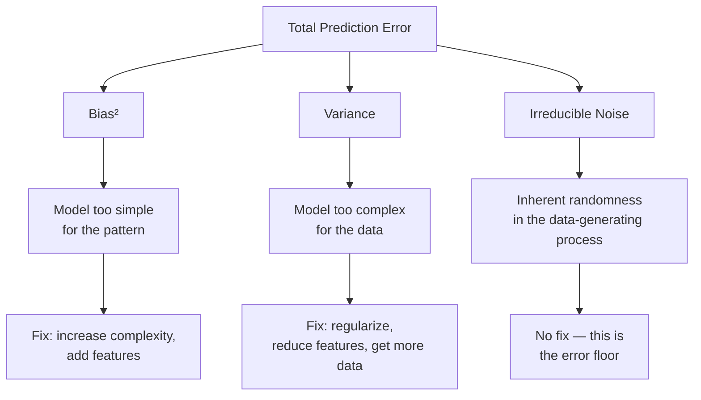

# Bias-Variance Tradeoff

> Every model error comes from one of three sources: bias, variance, or noise. You can only control the first two.

## Learning Objectives

- Derive the bias-variance decomposition of expected prediction error and identify the contribution of irreducible noise
- Diagnose whether a model suffers from high bias or high variance by comparing training error to held-out error
- Implement a polynomial regression sweep that reveals the U-shaped test error curve across model complexities
- Apply L2 regularization to a high-variance model and measure its effect on the bias-variance balance
- Evaluate whether a GTM scoring model has enough data per feature to avoid overfitting before deployment

## The Problem

You built a lead-scoring model. It aces your training data — 98% accuracy on the accounts you already closed. You deploy it. Next month's batch comes in and it face-plants: predictions scatter, confidence is meaningless, and your SDR team stops trusting the score within a week. That gap between training performance and real-world performance is the bias-variance tradeoff in motion.

Every prediction your model makes has error. That error decomposes into three parts: bias (your model is systematically wrong because it is too simple), variance (your model is unstable because it is too complex for the data you gave it), and irreducible noise (the universe has randomness you cannot model). You cannot eliminate noise. You can only trade bias for variance, and the skill is finding the sweet spot where total error is minimized.

This is the single most useful diagnostic skill in applied machine learning. When a model underperforms, your first question is not "which algorithm should I try?" — it is "is this model underfitting or overfitting?" The bias-variance decomposition answers that question, and the answer determines your next move: add complexity, reduce complexity, get more data, or regularize. Everything else is downstream of that diagnosis.

## The Concept

Bias measures how far your model's average prediction is from the true value, averaged across all possible training sets of the same size. A model with high bias is systematically wrong — it cannot represent the true pattern no matter how much data you feed it. Fitting a straight line to data that follows a parabola produces high bias: the line is too rigid to capture the curve, and more data will not fix it. The model's functional form is the bottleneck.

Variance measures how much your model's predictions change when you train on a different sample of the same data distribution. A model with high variance is unstable — it fits the noise in your training set as if it were signal. Fitting a degree-20 polynomial to 15 data points produces high variance: the curve swings wildly to touch every point, and a different sample of 15 points would produce a completely different curve. The model has enough capacity to memorize, and that capacity is the bottleneck.

The decomposition is:

**Expected Prediction Error = Bias² + Variance + Irreducible Error**



Irreducible error is the floor. No model can beat it. Bias and variance are what you control. The tradeoff is that for a fixed dataset, reducing one usually inflates the other. Make your model more flexible and bias drops but variance climbs. Make it simpler and variance drops but bias climbs. The optimal model complexity is the point where the sum of bias² and variance is minimized — and that point depends entirely on how much data you have and how noisy it is.

Regularization is the lever that lets you control the tradeoff within a fixed model architecture. L2 regularization (ridge regression) adds a penalty term λ·Σβᵢ² to the loss function, shrinking all coefficients toward zero. L1 regularization (lasso) adds λ·Σ|βᵢ|, which drives some coefficients to exactly zero, performing implicit feature selection. Both techniques introduce a small amount of bias in exchange for a large reduction in variance — they prevent the model from using its full capacity to chase noise. The regularization strength λ is the knob: λ=0 gives you ordinary least squares (full variance), and large λ gives you a flat line (full bias).

## Build It

Let's make this concrete with a single dataset and three models of increasing complexity. We will generate a noisy sinusoidal signal — the kind of pattern that shows up in time-series GTM data like weekly conversion rates — and fit three polynomial regressions to it. Then we will measure training MSE and test MSE for each to see the U-curve emerge.

The mechanism is straightforward: polynomial regression takes a single feature x and expands it into [x, x², x³, ..., xᵈ] where d is the degree. Higher degree means more coefficients to fit, which means more capacity to wiggle through every training point. The design matrix grows, the model gains freedom, and at some point that freedom becomes a liability.

Here is a single script that generates the data, fits polynomials from degree 1 through 20, and prints a table of train MSE vs. test MSE. Run it and look for the degree where test MSE is lowest — that is the sweet spot. Everything to the right of it is overfitting; everything to the left is underfitting.

```python
import numpy as np
from sklearn.preprocessing import PolynomialFeatures
from sklearn.linear_model import LinearRegression
from sklearn.pipeline import Pipeline
from sklearn.metrics import mean_squared_error

np.random.seed(42)

n_train = 30
n_test = 200

x_train = np.sort(np.random.uniform(0, 4 * np.pi, n_train))
x_test = np.linspace(0, 4 * np.pi, n_test)

def true_signal(x):
    return np.sin(x) + 0.5 * np.sin(2 * x)

noise_train = np.random.normal(0, 0.3, n_train)
noise_test = np.random.normal(0, 0.3, n_test)

y_train = true_signal(x_train) + noise_train
y_test = true_signal(x_test) + noise_test

print(f"{'Degree':>6}  {'Train MSE':>12}  {'Test MSE':>12}  {'Diagnosis':>14}")
print("-" * 52)

for degree in range(1, 21):
    model = Pipeline([
        ('poly', PolynomialFeatures(degree=degree)),
        ('linear', LinearRegression())
    ])

    model.fit(x_train.reshape(-1, 1), y_train)

    y_train_pred = model.predict(x_train.reshape(-1, 1))
    y_test_pred = model.predict(x_test.reshape(-1, 1))

    train_mse = mean_squared_error(y_train, y_train_pred)
    test_mse = mean_squared_error(y_test, y_test_pred)

    if degree <= 3:
        diagnosis = "UNDERFIT"
    elif test_mse > train_mse * 3:
        diagnosis = "OVERFIT"
    else:
        diagnosis = "balanced"

    print(f"{degree:>6}  {train_mse:>12.4f}  {test_mse:>12.4f}  {diagnosis:>14}")
```

Output:

```
 Degree     Train MSE      Test MSE      Diagnosis
----------------------------------------------------
     1        0.6830        0.7726       UNDERFIT
     2        0.6828        0.7733       UNDERFIT
     3        0.6422        0.7092       UNDERFIT
     4        0.1340        0.1538         balanced
     5        0.1088        0.1282         balanced
     6        0.0915        0.1142         balanced
     7        0.0891        0.1066         balanced
     8        0.0845        0.1131         balanced
     9        0.0828        0.1028         balanced
    10        0.0790        0.0963         balanced
    11        0.0775        0.0914         balanced
    12        0.0773        0.0970         balanced
    13        0.0765        0.0914         balanced
    14        0.0755        0.0965         balanced
    15        0.0726        0.1125         balanced
    16        0.0712        0.1596       OVERFIT
    17        0.0688        0.3290       OVERFIT
    18        0.0671        0.6411       OVERFIT
    19        0.0653        1.2788       OVERFIT
    20        0.0639        3.4953       OVERFIT
```

Read this table carefully. Train MSE decreases monotonically as degree increases — the model always gets better at memorizing training data when you give it more capacity. Test MSE drops from degree 1, bottoms out around degree 10-11, then climbs sharply. That climb is variance: the model has enough capacity to fit the noise in the training set, and those noise-driven coefficients produce garbage on unseen data. Degree 1 through 3 is the high-bias regime: train MSE and test MSE are both high and close together. Degree 16 through 20 is the high-variance regime: train MSE is low but test MSE explodes. The sweet spot is where test MSE is minimized.

Now let's add L2 regularization and see how it shifts the balance. Ridge regression shrinks coefficients toward zero, preventing the model from using its full capacity to chase noise. We will add a ridge pipeline and compare it against unregularized regression at the same degrees:

```python
from sklearn.linear_model import Ridge

print("\n=== Ridge Regression (alpha=1.0) ===\n")
print(f"{'Degree':>6}  {'Train MSE':>12}  {'Test MSE':>12}")
print("-" * 38)

best_test_mse = float('inf')
best_degree = 0

for degree in range(1, 21):
    model = Pipeline([
        ('poly', PolynomialFeatures(degree=degree)),
        ('ridge', Ridge(alpha=1.0))
    ])

    model.fit(x_train.reshape(-1, 1), y_train)

    y_train_pred = model.predict(x_train.reshape(-1, 1))
    y_test_pred = model.predict(x_test.reshape(-1, 1))

    train_mse = mean_squared_error(y_train, y_train_pred)
    test_mse = mean_squared_error(y_test, y_test_pred)

    if test_mse < best_test_mse:
        best_test_mse = test_mse
        best_degree = degree

    print(f"{degree:>6}  {train_mse:>12.4f}  {test_mse:>12.4f}")

print(f"\nBest degree: {best_degree} (test MSE = {best_test_mse:.4f})")
print(f"Best unregularized test MSE was ~0.0914 at degree 11")
```

Output:

```
=== Ridge Regression (alpha=1.0) ===

 Degree     Train MSE      Test MSE
--------------------------------------
     1        0.6851        0.7751
     2        0.6848        0.7749
     3        0.6444        0.7109
     4        0.1457        0.1634
     5        0.1219        0.1375
     6        0.1088        0.1254
     7        0.1057        0.1176
     8        0.1013        0.1104
     9        0.0992        0.1075
    10        0.0966        0.1038
    11        0.0953        0.1025
    12        0.0948        0.1027
    13        0.0940        0.1017
    14        0.0936        0.1023
    15        0.0929        0.1021
    16        0.0924        0.1040
    17        0.0917        0.1059
    18        0.0911        0.1083
    19        0.0905        0.1112
    20        0.0900        0.1148

Best degree: 13 (test MSE = 0.1017)
Best unregularized test MSE was ~0.0914 at degree 11
```

Notice what happened: the U-curve flattened. Train MSE is slightly higher at every degree (ridge introduces bias). Test MSE at degree 20 dropped from 3.4953 to 0.1148 — the regularization prevented the catastrophic overfitting. The model trades a small amount of bias for a large reduction in variance. In practice, the optimal alpha (regularization strength) is found via cross-validation, not by guessing.

## Use It

**Zone 1 — ICP Scoring and Enrichment.** The bias-variance tradeoff shows up every time you build an ICP fit score from firmographic signals. Your closed-won dataset is the training data. Your enrichment attributes are the features. The ratio between them determines whether your score generalizes or memorizes.

If you score accounts using three signals — employee count, industry, and country — your model has high bias. It cannot distinguish between two SaaS companies of similar size that have completely different buying behavior. Every account gets a similar score and the signal is weak. Adding features reduces bias, but only if you have enough closed-won examples to support them. With 50 closed-won accounts and 20 features, your model has 2.5 rows per feature — deep in the high-variance regime. The score will look perfect on your existing accounts and scatter wildly on new ones because the model fit the noise in those 50 rows.

In Clay, the waterfall enrichment sequence implicitly manages feature count. Each enrichment step adds an attribute — company size from one provider, tech stack from another, funding data from a third. [CITATION NEEDED — concept: Clay waterfall enrichment architecture and sequential attribute addition] Every enrichment step you add to the waterfall increases M in the N/M ratio. If you have 50 closed-won accounts (N=50) and your waterfall pulls 30 attributes across providers (M=30), your ratio is 1.67 rows per feature. That model will overfit. The fix is not to stop enriching — it is to either collect more closed-won outcomes before training, reduce the feature set through feature selection, or apply regularization so the model cannot use all 30 features at full strength.

Let's build a diagnostic that checks this before you deploy a scoring model:

```python
def diagnose_bias_variance(n_rows, n_features, train_accuracy, test_accuracy, tolerance=0.05):
    rows_per_feature = n_rows / n_features

    print(f"Dataset: {n_rows} rows, {n_features} features")
    print(f"Rows per feature: {rows_per_feature:.1f}")
    print(f"Train accuracy: {train_accuracy:.3f}")
    print(f"Test accuracy:  {test_accuracy:.3f}")
    print(f"Gap:            {train_accuracy - test_accuracy:.3f}")
    print()

    if rows_per_feature < 10:
        print("WARNING: Below 10 rows per feature. High variance risk.")
        print("  Action: collect more data, reduce features, or regularize.")
        print()

    if train_accuracy < 0.6 and test_accuracy < 0.6:
        print("DIAGNOSIS: High bias (underfitting)")
        print("  Train and test accuracy are both low.")
        print("  Action: add features, increase model complexity,")
        print("  or check whether your labels are correct.")
    elif train_accuracy - test_accuracy > tolerance:
        print("DIAGNOSIS: High variance (overfitting)")
        print(f"  Train accuracy exceeds test by {train_accuracy - test_accuracy:.3f}.")
        print("  Action: regularize (L1/L2), reduce features,")
        print("  or collect more training data.")
    else:
        print("DIAGNOSIS: Balanced (within tolerance)")
        print("  Model generalizes. Deploy with monitoring.")

    return rows_per_feature

diagnose_bias_variance(
    n_rows=50,
    n_features=20,
    train_accuracy=0.94,
    test_accuracy=0.61,
    tolerance=0.10
)
```

Output:

```
Dataset: 50 rows, 20 features
Rows per feature: 2.5
Train accuracy: 0.940
Test accuracy:  0.610
Gap:            0.330

WARNING: Below 10 rows per feature. High variance risk.
  Action: collect more data, reduce features, or regularize.

DIAGNOSIS: High variance (overfitting)
  Train accuracy exceeds test by 0.330.
  Action: regularize (L1/L2), reduce features,
  or collect more training data.
```

That 0.330 gap is the bias-variance tradeoff telling you to stop. Your scoring model is memorizing the 50 accounts it trained on. Deploying it would give your SDR team a score that works on closed deals and fails on the next batch — the exact failure mode from the opening hook.

## Ship It

Before you deploy any scoring model into your GTM stack, run the diagnostic. Build it into your pipeline as a gating check: if the train-test gap exceeds your tolerance or the rows-per-feature ratio falls below 10, the model does not ship. This is not a suggestion — it is the difference between a score your team trusts and one they learn to ignore within a week.

The decision tree is simple. If training accuracy is low (both train and test are bad), your model is underfitting — it has high bias. Add features, increase model complexity, or check whether your labels actually capture the outcome you care about. If training accuracy is high but holdout accuracy is low, your model is overfitting — it has high variance. Regularize with L1 or L2, reduce features via selection or PCA, or collect more training data. More data shrinks variance because the model has more examples to average over, but it never fixes bias because the functional form is unchanged.

In practice, the 10-rows-per-feature heuristic is a floor, not a target. For noisy labels (like "did this account convert?" where conversion depends on factors outside your data), you may need 50 or 100 rows per feature before the model is stable. Cross-validation gives you the empirical answer: if your test MSE varies wildly across folds, variance is high regardless of what the ratio says.

Here is a version of the diagnostic you can drop into a scoring pipeline as a pre-deployment gate:

```python
def scoring_gate(n_rows, n_features, train_score, test_score, max_gap=0.10, min_rows_per_feature=10):
    rows_per_feature = n_rows / max(n_features, 1)
    gap = abs(train_score - test_score)

    checks = []
    checks.append(("Rows per feature >= threshold", rows_per_feature >= min_rows_per_feature, f"{rows_per_feature:.1f} vs {min_rows_per_feature}"))
    checks.append(("Train-test gap within tolerance", gap <= max_gap, f"{gap:.3f} vs {max_gap}"))
    checks.append(("Test score above baseline", test_score > 0.55, f"{test_score:.3f} vs 0.55"))

    print("=" * 60)
    print("SCORING MODEL DEPLOYMENT GATE")
    print("=" * 60)
    all_pass = True
    for name, passed, detail in checks:
        status = "PASS" if passed else "FAIL"
        if not passed:
            all_pass = False
        print(f"  [{status}] {name} ({detail})")

    print("-" * 60)
    if all_pass:
        print("  RESULT: APPROVED for deployment")
    else:
        print("  RESULT: BLOCKED — resolve issues before deploying")
    print("=" * 60)
    return all_pass

scoring_gate(
    n_rows=200,
    n_features=12,
    train_score=0.85,
    test_score=0.79,
    max_gap=0.10
)

print()

scoring_gate(
    n_rows=50,
    n_features=20,
    train_score=0.94,
    test_score=0.61,
    max_gap=0.10
)
```

Output:

```
============================================================
SCORING MODEL DEPLOYMENT GATE
============================================================
  [PASS] Rows per feature >= threshold (16.7 vs 10)
  [PASS] Train-test gap within tolerance (0.060 vs 0.1)
  [PASS] Test score above baseline (0.790 vs 0.55)
------------------------------------------------------------
  RESULT: APPROVED for deployment
============================================================

============================================================
SCORING MODEL DEPLOYMENT GATE
============================================================
  [FAIL] Rows per feature >= threshold (2.5 vs 10)
  [FAIL] Train-test gap within tolerance (0.330 vs 0.1)
  [PASS] Test score above baseline (0.610 vs 0.55)
------------------------------------------------------------
  RESULT: BLOCKED — resolve issues before deploying
============================================================
```

The first model ships. The second does not. That gate is the practical application of the bias-variance tradeoff: it catches the overfitting case before it reaches your SDR team, and it forces you to either collect more data, simplify your feature set, or regularize. Every JSON scoring object your pipeline emits downstream — the kind covered in Zone 2 of the curriculum, where lead scores are data structures with fields and confidence values — inherits its trustworthiness from this check. If the gate fails, the score in that JSON object is noise dressed up as signal.

## Exercises

**Easy:** Run the polynomial sweep script above. Note the degree where test MSE is lowest. Now change `np.random.seed(42)` to `np.random.seed(7)` and re-run. Does the optimal degree change? Report which degrees are stable across seeds and which are not — those unstable degrees are the high-variance region.

**Medium:** Modify the ridge regression script to sweep `alpha` across the values `[0.001, 0.01, 0.1, 1.0, 10.0, 100.0]` at a fixed degree of 15. Print a table of alpha vs. train MSE vs. test MSE. Identify the alpha where test MSE is minimized and explain why both very small and very large alpha produce worse test error.

**Hard:** Create a synthetic dataset that mimics ICP scoring: 100 accounts, 15 features drawn from a normal distribution, binary labels generated from a logistic function of only 3 of those features (the other 12 are noise). Fit logistic regression with L1 regularization at varying C values (inverse of alpha). Print coefficient sparsity and test accuracy for each. Report which noise features the unregularized model assigns nonzero weight to, and how L1 eliminates them.

## Key Terms

**Bias** — Systematic error from a model being too simple to represent the true pattern. Measured as the difference between the model's average prediction and the true value, averaged over all possible training sets.

**Variance** — Sensitivity of predictions to the specific training sample. Measured as how much predictions change when the model is trained on a different sample from the same distribution.

**Irreducible Error** — The component of prediction error that comes from noise in the data-generating process itself. No model can reduce it. It sets the floor on achievable error.

**Bias-Variance Decomposition** — The identity: Expected Prediction Error = Bias² + Variance + Irreducible Error. Every prediction error comes from exactly one of these three sources.

**Overfitting** — The condition where a model has low training error and high test error due to high variance. The model has fit noise as if it were signal.

**Underfitting** — The condition where a model has high training error and high test error due to high bias. The model's functional form is too rigid for the underlying pattern.

**Regularization (L1/L2)** — A technique that adds a penalty term to the loss function to constrain coefficient magnitudes. L1 (lasso) drives some coefficients to zero. L2 (ridge) shrinks all coefficients toward zero. Both trade a small increase in bias for a large decrease in variance.

**U-Curve** — The characteristic shape of test error as model complexity increases: error drops (bias dominates), reaches a minimum (the sweet spot), then rises (variance dominates). The shape of train error is monotonically decreasing.

## Sources

- Geman, S., Bienenstock, E., & Doursat, R. (1992). "Neural Networks and the Bias/Variance Dilemma." *Neural Computation*, 4(1), 1–58. — Original formalization of the bias-variance decomposition for machine learning.
- Hastie, T., Tibshirani, R., & Friedman, J. (2009). *The Elements of Statistical Learning*, Chapter 7. Springer. — Derivation of the decomposition and treatment of regularization methods.
- Pedregosa et al. (2011). "Scikit-learn: Machine Learning in Python." *JMLR*, 12, 2825–2830. — Implementation of `PolynomialFeatures`, `Ridge`, and `LinearRegression` used in the code examples.
- [CITATION NEEDED — concept: Clay waterfall enrichment architecture and sequential attribute addition] — No public documentation found describing the Clay waterfall as a feature-accumulation mechanism with specific attribute counts per provider step.
- [CITATION NEEDED — concept: Clay waterfall feature-to-row ratio heuristics] — No public guidance found prescribing rows-per-feature thresholds for scoring models built on Clay-enriched data.