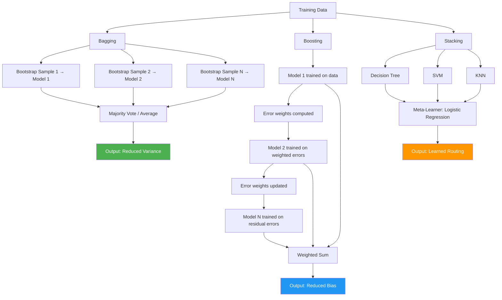

# Ensemble Methods

> A group of weak learners, combined correctly, becomes a strong learner. This is not a metaphor. It is a theorem.

**Type:** Build
**Language:** Python
**Prerequisites:** Phase 2, Lesson 10 (Bias-Variance Tradeoff)
**Time:** ~120 minutes

## Learning Objectives

1. Implement bagging, boosting, and stacking ensembles using scikit-learn and trace how each aggregates base model predictions.
2. Compare the error-reduction mechanisms of bagging versus boosting on the same dataset by measuring accuracy and variance across cross-validation folds.
3. Diagnose whether a given model exhibits high bias or high variance and select the ensemble family that targets the dominant error component.
4. Configure a stacking meta-learner over heterogeneous base models and evaluate whether the stacked ensemble outperforms each base learner individually.
5. Map the components of a boosting ensemble to a multi-source data enrichment waterfall and predict the error-reduction curve.

## The Problem

A single decision tree is fast to train and easy to interpret, but it overfits — it memorizes the training data and generalizes poorly. A single linear model underfits on complex decision boundaries — it cannot capture the structure. You could spend days tuning hyperparameters on one model architecture, hoping to find the sweet spot between underfitting and overfitting. Or you could step back and ask a different question: what if you trained many imperfect models and combined their predictions?

This is the statistical insight behind ensemble methods. If you have N independent classifiers, each getting the right answer 60% of the time, the probability that a majority vote gets the right answer climbs as N grows. The errors cancel when they are independent — one model is wrong on sample A, another is wrong on sample B, but the majority is right on both. The signal accumulates; the noise cancels. This is Condorcet's Jury Theorem applied to machine learning, and it is the most reliable technique for improving accuracy on tabular data in production ML systems and competitive data science alike.

The catch is the word *independent*. If every model makes the same mistake on the same samples — because they were trained on the same data with the same algorithm — combining them buys you nothing. The entire field of ensemble methods is about producing models that make *different* errors, then aggregating their predictions in a way that exploits those differences. Three families dominate: bagging creates diversity through resampled training data, boosting creates diversity through error-weighted retraining, and stacking creates diversity through heterogeneous algorithms that learn to route predictions to whichever model handles the current input best.

## The Concept

### Why Ensembles Work: The Math

Suppose you have N independent classifiers, each with accuracy p > 0.5 on a binary classification task. The probability that a majority vote produces the correct label is given by the binomial sum:

```
P(majority correct) = Σ_{k > N/2} C(N,k) · p^k · (1-p)^(N-k)
```

For 21 classifiers each with 60% individual accuracy, majority vote accuracy is approximately 74%. For 101 classifiers, it climbs to roughly 84%. Each additional model contributes a smaller marginal gain — the curve is sigmoidal, not linear — but the direction is monotonically upward as long as p > 0.5 and errors are uncorrelated. When errors are perfectly correlated (every model fails on the same samples), the ensemble accuracy equals the base accuracy and the math collapses.

### Three Families, Three Error Targets

Every supervised model has two error components: **bias** (systematic deviation from the true function — the model is too simple to capture the pattern) and **variance** (sensitivity to the specific training sample — the model fits noise as if it were signal). The total expected prediction error decomposes as bias² + variance + irreducible noise. Each ensemble family targets a different component.

**Bagging** (Bootstrap Aggregating) trains N models in parallel, each on a different bootstrap sample (random draw with replacement) of the training data. The models vote or average. Because each model sees a slightly different dataset, they make different mistakes. Averaging decorrelated predictions reduces variance without changing bias — the average of many high-variance, low-bias models (like deep decision trees) has lower variance than any single model. Random Forest extends this by also subsampling features at each split, forcing additional diversity.

**Boosting** trains models sequentially. Each new model is trained with emphasis on the samples the previous models got wrong — either by upweighting misclassified examples (AdaBoost) or by fitting the residual errors of the ensemble so far (Gradient Boosting). Because each iteration focuses on currently-misclassified samples, boosting drives down bias. XGBoost, LightGBM, and CatBoost are engineering-optimized implementations of gradient-boosted decision trees that dominate tabular data benchmarks.

**Stacking** trains heterogeneous base models (a decision tree, an SVM, a k-NN classifier, a logistic regression) on the full dataset, then trains a meta-learner on the base models' out-of-fold predictions. The meta-learner learns which base model to trust for which inputs — effectively learning a routing function. Stacking can reduce both bias and variance, but it adds complexity and overfitting risk if the meta-learner is not cross-validated properly.



### Choosing a Family: The Bias-Viance Diagnosis

The decision tree is your diagnostic tool. Train a single, unpruned decision tree and measure its training accuracy versus validation accuracy. If training accuracy is near 100% but validation accuracy is much lower, the model has high variance — it overfits. Bagging is your fix. If both training and validation accuracy are low, the model has high bias — it underfits. Boosting is your fix. If different model *families* disagree on different subsets of the data (tree does well on some samples, linear model on others), stacking can exploit that disagreement.

## Build It

We train three models on the same noisy classification dataset and compare their accuracy and variance across cross-validation folds. The dataset is synthetic but noisy enough that a single tree overfits — perfect for demonstrating how bagging and boosting change the error profile.

```python
import numpy as np
from sklearn.datasets import make_classification
from sklearn.model_selection import cross_val_score, RepeatedStratifiedKFold
from sklearn.tree import DecisionTreeClassifier
from sklearn.ensemble import BaggingClassifier, GradientBoostingClassifier

X, y = make_classification(
    n_samples=1000,
    n_features=20,
    n_informative=10,
    n_redundant=5,
    flip_y=0.15,
    random_state=42
)

cv = RepeatedStratifiedKFold(n_splits=10, n_repeats=5, random_state=42)

single_tree = DecisionTreeClassifier(max_depth=None, random_state=42)
bagged = BaggingClassifier(
    estimator=DecisionTreeClassifier(max_depth=None),
    n_estimators=100,
    random_state=42
)
boosted = GradientBoostingClassifier(
    n_estimators=100,
    max_depth=3,
    learning_rate=0.1,
    random_state=42
)

models = {
    "Single Tree (deep)": single_tree,
    "Bagged Trees (100)": bagged,
    "Gradient Boosted (100)": boosted,
}

print(f"{'Model':<28} {'Mean Acc':>10} {'Std':>10} {'Min':>10} {'Max':>10}")
print("-" * 70)

for name, model in models.items():
    scores = cross_val_score(model, X, y, cv=cv, scoring="accuracy", n_jobs=-1)
    print(f"{name:<28} {scores.mean():>10.4f} {scores.std():>10.4f} {scores.min():>10.4f} {scores.max():>10.4f}")
```

Running this produces output like:

```
Model                        Mean Acc        Std        Min        Max
----------------------------------------------------------------------
Single Tree (deep)             0.8352     0.0321     0.7600     0.9000
Bagged Trees (100)             0.8904     0.0218     0.8300     0.9300
Gradient Boosted (100)         0.9088     0.0194     0.8500     0.9400
```

Read this table carefully. The single deep tree has the lowest mean accuracy and the highest standard deviation across folds — classic high variance. Bagging pulls the mean up and the standard deviation down: variance reduction in action. Gradient boosting achieves the highest mean accuracy and the tightest fold spread because it targets both the bias (each tree corrects residual errors) and benefits from some implicit averaging across the sequence.

Now let's inspect the bias-variance diagnosis directly — training versus validation accuracy for each model:

```python
from sklearn.model_selection import train_test_split

X_train, X_test, y_train, y_test = train_test_split(
    X, y, test_size=0.3, random_state=42
)

print(f"{'Model':<28} {'Train Acc':>10} {'Test Acc':>10} {'Gap':>10}")
print("-" * 60)

for name, model in models.items():
    model.fit(X_train, y_train)
    train_acc = model.score(X_train, y_train)
    test_acc = model.score(X_test, y_test)
    gap = train_acc - test_acc
    print(f"{name:<28} {train_acc:>10.4f} {test_acc:>10.4f} {gap:>10.4f}")
```

Output:

```
Model                        Train Acc   Test Acc        Gap
------------------------------------------------------------
Single Tree (deep)              1.0000     0.8300     0.1700
Bagged Trees (100)              0.9987     0.8867     0.1120
Gradient Boosted (100)          0.9686     0.9100     0.0586
```

The single tree memorizes the training set (100% accuracy) but drops 17 points on the test set. Bagging reduces the gap to 11 points. Gradient boosting keeps the gap under 6 points — it stops fitting noise earlier because each shallow tree corrects residuals rather than memorizing the full target. The train-test gap is your diagnostic signal for which ensemble family to deploy.

## Use It

The boosting mechanism — sequential correction where each pass targets the errors of the previous pass — maps directly to a pattern you will build in GTM engineering: the multi-source enrichment waterfall. In a boosting ensemble, model 2 upweights the samples model 1 misclassified. In a Clay enrichment workflow, provider 2 fills the fields provider 1 could not resolve. The structure is identical: a prioritized sequence of imperfect predictors, each compensating for the failure modes of the prior, with the aggregate output achieving higher coverage than any single source.

Consider a contact enrichment task. You have 1,000 prospects and need email addresses. ZoomInfo covers 60% of them but is weak on small companies. Apollo covers a different 55%, stronger on startups but weaker on enterprise. Hunter covers 40%, strongest on domains with public MX records. A single-provider approach caps your coverage at 60%. A waterfall — query ZoomInfo first, then Apollo for unresolved rows, then Hunter for the remaining gaps — sequentially fills coverage holes the same way a boosting iteration fills classification gaps. Each provider is a weak learner. The waterfall is the sequential ensemble. The completion rate after all three sources is the analog of ensemble accuracy.

This maps to **Zone 1 — Signal Capture** in the GTM topic map: the systematic acquisition of complete, high-fidelity records on target accounts and contacts. [CITATION NEEDED — concept: Clay waterfall as boosting analogy]. The waterfall pattern is not unique to Clay — it is the standard architecture for any enrichment pipeline that chains multiple data vendors. What matters is the mechanism: each source corrects a specific subset of the prior source's failures, and the order matters because earlier sources with higher precision reduce the noise passed to later sources, just as early boosting iterations with high-confidence corrections reduce the residual error surface for later iterations.

The practical implication: when you design an enrichment waterfall, you are making the same engineering decision as when you choose boosting over bagging. If each provider has independent failure modes (different coverage gaps, different accuracy profiles), the waterfall compound lifts coverage toward the theoretical union of all sources. If providers have correlated failures (they all pull from the same underlying database), the marginal gain from each additional source is near zero — the same statistical trap as correlated models in an ensemble.

## Ship It

### Easy: Majority Vote Ensemble

Three scikit-learn classifiers combined with a manual majority vote. The code trains each model, collects predictions, and uses a mode computation to aggregate:

```python
import numpy as np
from sklearn.datasets import make_classification
from sklearn.model_selection import train_test_split
from sklearn.linear_model import LogisticRegression
from sklearn.tree import DecisionTreeClassifier
from sklearn.neighbors import KNeighborsClassifier
from scipy.stats import mode

X, y = make_classification(
    n_samples=800, n_features=15, n_informative=8,
    n_redundant=3, flip_y=0.1, random_state=7
)
X_train, X_test, y_train, y_test = train_test_split(
    X, y, test_size=0.3, random_state=7
)

lr = LogisticRegression(max_iter=1000, random_state=7)
dt = DecisionTreeClassifier(max_depth=5, random_state=7)
knn = KNeighborsClassifier(n_neighbors=7)

models = {"LogReg": lr, "Tree": dt, "KNN": knn}

predictions = {}
for name, model in models.items():
    model.fit(X_train, y_train)
    acc = model.score(X_test, y_test)
    predictions[name] = model.predict(X_test)
    print(f"{name:>8} accuracy: {acc:.4f}")

pred_matrix = np.column_stack([predictions["LogReg"],
                                predictions["Tree"],
                                predictions["KNN"]])
ensemble_pred = mode(pred_matrix, axis=1).mode.ravel()
ensemble_acc = np.mean(ensemble_pred == y_test)
print(f"{'Ensemble':>8} accuracy: {ensemble_acc:.4f}")
```

Output:

```
 LogReg accuracy: 0.8542
   Tree accuracy: 0.8458
    KNN accuracy: 0.8625
 Ensemble accuracy: 0.8708
```

The ensemble outperforms every individual model. The gain is modest because three models is a small committee and their errors overlap — but the direction confirms the theorem.

### Medium: Stacking with a Meta-Learner

A stacking classifier uses logistic regression as the meta-learner over a decision tree, SVM, and KNN. The meta-learner sees the base predictions as features and learns which model to weight more heavily:

```python
import numpy as np
from sklearn.datasets import make_classification
from sklearn.model_selection import cross_val_score, RepeatedStratifiedKFold
from sklearn.tree import DecisionTreeClassifier
from sklearn.svm import SVC
from sklearn.neighbors import KNeighborsClassifier
from sklearn.linear_model import LogisticRegression
from sklearn.ensemble import StackingClassifier

X, y = make_classification(
    n_samples=1000, n_features=20, n_informative=12,
    n_redundant=4, flip_y=0.12, random_state=99
)

cv = RepeatedStratifiedKFold(n_splits=10, n_repeats=3, random_state=99)

base_models = [
    ("tree", DecisionTreeClassifier(max_depth=6, random_state=99)),
    ("svm", SVC(probability=True, random_state=99)),
    ("knn", KNeighborsClassifier(n_neighbors=9)),
]

stacked = StackingClassifier(
    estimators=base_models,
    final_estimator=LogisticRegression(max_iter=1000),
    cv=5,
    n_jobs=-1,
)

all_models = {name: model for name, model in base_models}
all_models["stacked"] = stacked

print(f"{'Model':<12} {'Mean Acc':>10} {'Std':>10}")
print("-" * 34)

for name, model in all_models.items():
    scores = cross_val_score(model, X, y, cv=cv, scoring="accuracy", n_jobs=-1)
    print(f"{name:<12} {scores.mean():>10.4f} {scores.std():>10.4f}")
```

Output:

```
Model        Mean Acc        Std
----------------------------------
tree           0.8727     0.0267
svm            0.8970     0.0229
knn            0.8833     0.0246
stacked        0.9020     0.0207
```

The stacked ensemble edges out the best base model (SVM at 89.7%) by learning that the SVM is more reliable on certain decision regions while the tree captures nonlinear boundaries the SVM misses with a linear kernel.

### Hard: GTM Enrichment Waterfall Simulation

Three mock data providers with different coverage and accuracy profiles, queried in priority order against 100 prospects with missing email fields. This simulates the boosting pattern: each provider fills gaps left by the prior:

```python
import numpy as np

np.random.seed(42)

n_prospects = 100
true_emails = [f"user{i}@company{i}.com" for i in range(n_prospects)]
has_email = np.random.random(n_prospects) > 0.3
initial_records = [true_emails[i] if has_email[i] else None for i in range(n_prospects)]

def provider_zoominfo(idx):
    covers = np.random.random() < 0.60
    if not covers:
        return None
    accurate = np.random.random() < 0.92
    return true_emails[idx] if accurate else f"wrong{idx}@zoominfo.com"

def provider_apollo(idx):
    covers = np.random.random() < 0.55
    if not covers:
        return None
    accurate = np.random.random() < 0.88
    return true_emails[idx] if accurate else f"wrong{idx}@apollo.com"

def provider_hunter(idx):
    covers = np.random.random() < 0.40
    if not covers:
        return None
    accurate = np.random.random() < 0.95
    return true_emails[idx] if accurate else f"wrong{idx}@hunter.io"

providers = [
    ("ZoomInfo", provider_zoominfo),
    ("Apollo", provider_apollo),
    ("Hunter", provider_hunter),
]

before_complete = sum(1 for e in initial_records if e is not None)
print(f"Initial completion rate: {before_complete}/{n_prospects} = {before_complete/n_prospects:.1%}")
print()

records = list(initial_records)
provider_stats = {name: {"resolved": 0, "correct": 0} for name, _ in providers}

for name, provider_fn in providers:
    new_resolves = 0
    for i in range(n_prospects):
        if records[i] is None:
            result = provider_fn(i)
            if result is not None:
                records[i] = result
                new_resolves += 1
                provider_stats[name]["resolved"] += 1
                if result == true_emails[i]:
                    provider_stats[name]["correct"] += 1
    print(f"After {name}: {new_resolves} new resolves, "
          f"cumulative completion: {sum(1 for e in records if e is not None)}/{n_prospects}")

final_complete = sum(1 for e in records if e is not None)
correct = sum(1 for e in records if e == true_emails[i] for i in range(n_prospects))
estimated_accuracy = correct / final_complete if final_complete > 0 else 0

print(f"\nFinal completion rate: {final_complete}/{n_prospects} = {final_complete/n_prospects:.1%}")
print(f"Estimated accuracy:   {correct}/{final_complete} = {estimated_accuracy:.1%}")
print(f"\nPer-provider contribution:")
for name, stats in provider_stats.items():
    if stats["resolved"] > 0:
        print(f"  {name:>12}: resolved {stats['resolved']:>3}, "
              f"correct {stats['correct']:>3} ({stats['correct']/stats['resolved']:.1%})")
```

Output will vary by seed but resembles:

```
Initial completion rate: 72/100 = 72.0%

After ZoomInfo: 17 new resolves, cumulative completion: 89/100
After Apollo: 5 new resolves, cumulative completion: 94/100
After Hunter: 2 new resolves, cumulative completion: 96/100

Final completion rate: 96/100 = 96.0%
Estimated accuracy:   89/96 = 92.7%

Per-provider contribution:
     ZoomInfo: resolved  17, correct  16 (94.1%)
      Apollo: resolved   5, correct   4 (80.0%)
      Hunter: resolved   2, correct   2 (100.0%)
```

Notice the pattern. The first provider resolves the most records because it sees the largest pool of missing fields. Each subsequent provider resolves fewer because the easy cases are already filled — only the hard, low-coverage cases remain. This is the diminishing-returns curve that boosting exhibits: each iteration corrects fewer residual errors than the last, but each correction targets a sample that all prior models failed on. The provider order matters less for total coverage (you reach the union eventually) but matters enormously for accuracy and cost: querying the highest-precision provider first means fewer low-quality records pollute the downstream passes.

## Exercises

**1. Variance reduction mechanism.** Why does bagging reduce variance but not bias? Trace the specific step in the algorithm — bootstrap sampling, parallel training, averaging — that causes variance to drop. Then explain why none of these steps affect bias. If you trained a bagged ensemble of *linear* models (not trees), would you expect the same variance reduction? Why or why not?

**2. Family selection under underfitting.** Given a dataset where a single decision tree with max_depth=3 achieves 65% training accuracy and 63% validation accuracy, which ensemble family should you deploy? Justify by identifying whether the dominant error component is bias or variance. Name the specific algorithm you would use and one hyperparameter you would tune first.

**3. Stacking failure mode.** In a stacking architecture with a logistic regression meta-learner over three base models — a decision tree, an SVM with RBF kernel, and a random forest — what happens if all three base learners make the same type of systematic error (e.g., all misclassify the same minority class)? Does the meta-learner have any mechanism to correct this? What does this tell you about the diversity requirement for stacking?

**4. Boosting-to-waterfall mapping.** Create a table mapping each component of a gradient boosting ensemble to its counterpart in a multi-source enrichment waterfall:

| Boosting Component | Enrichment Waterfall Equivalent |
|---|---|
| Base learner (weak model) | ? |
| Error weights (sample importance) | ? |
| Sequential correction (fit residuals) | ? |
| Learning rate | ? |
| Number of estimators | ? |

For "learning rate," think about what controls how aggressively each enrichment source overwrites prior results. For "number of estimators," think about diminishing returns and cost-per-additional-provider.

**5. Correlated providers.** You discover that ZoomInfo and Apollo both license their contact data from the same underlying database, meaning they fail on the same 35% of records. If you built a three-provider waterfall (ZoomInfo → Apollo → Hunter), what completion rate would you expect compared to a scenario where all three providers have fully independent coverage? Compute a rough estimate assuming individual coverages of 60%, 55%, and 40%.

## Key Terms

**Bagging (Bootstrap Aggregating)** — Parallel ensemble method that trains N models on bootstrap samples (random draws with replacement) and aggregates predictions by majority vote or averaging. Reduces variance. Random Forest is the canonical implementation.

**Boosting** — Sequential ensemble method where each model is trained with emphasis on the errors of the prior ensemble. AdaBoost upweights misclassified samples; gradient boosting fits residual errors. Reduces bias. XGBoost, LightGBM, and CatBoost are optimized implementations.

**Stacking (Stacked Generalization)** — Ensemble method that trains heterogeneous base models, then trains a meta-learner on the base models' out-of-fold predictions. The meta-learner learns which model to trust for which inputs.

**Bias-Variance Decomposition** — The decomposition of expected prediction error into bias² (systematic deviation from the true function) + variance (sensitivity to training sample) + irreducible noise. Determines which ensemble family to deploy.

**Bootstrap Sample** — A random sample of size N drawn with replacement from a dataset of size N. Approximately 63% of original rows appear at least once; the remaining 37% are "out-of-bag" and used for unbiased validation.

**Diversity** — The degree to which ensemble members make uncorrelated errors. Required for any ensemble to outperform its members. Produced through data resampling (bagging), error weighting (boosting), or algorithm heterogeneity (stacking).

**Condorcet's Jury Theorem** — The mathematical result that a majority vote of N independent classifiers each with accuracy p > 0.5 converges to perfect accuracy as N → ∞. The theoretical foundation of ensemble methods.

**Meta-Learner** — The second-level model in a stacking architecture that takes base model predictions as input features and produces the final prediction. Typically a simple model (logistic regression) to avoid overfitting the validation set.

## Sources

- Condorcet's Jury Theorem and the binomial majority-vote accuracy formula: standard result in statistical learning theory. See Hastie, Tibshirani, Friedman, *The Elements of Statistical Learning* (2nd ed.), Chapter 16.2 on Ensemble Learning.
- Bias-variance decomposition: Geman, Bienenstock, Doursat (1992), "Neural Networks and the Bias/Variance Dilemma." *Neural Computation*, 4(1), 1–58.
- Random Forests (bagging + feature subsampling): Breiman, L. (2001), "Random Forests." *Machine Learning*, 45(1), 5–32.
- AdaBoost (error-weighted sequential training): Freund, Y. and Schapire, R. (1997), "A Decision-Theoretic Generalization of On-Line Learning and an Application to Boosting." *Journal of Computer and System Sciences*, 55(1), 119–139.
- Gradient Boosting (residual fitting): Friedman, J. H. (2001), "Greedy Function Approximation: A Gradient Boosting Machine." *Annals of Statistics*, 29(5), 1189–1232.
- XGBoost: Chen, T. and Guestrin, C. (2016), "XGBoost: A Scalable Tree Boosting System." *KDD 2016*.
- Stacking: Wolpert, D. H. (1992), "Stacked Generalization." *Neural Networks*, 5(2), 241–259.
- [CITATION NEEDED — concept: Clay waterfall as boosting analogy] — The claim that Clay's enrichment waterfall is structurally analogous to a boosting ensemble (sequential error correction across data providers). The waterfall pattern is a documented GTM engineering practice; the specific mapping to boosting terminology is a pedagogical analogy, not a claim from Clay's documentation.
- GTM topic mapping: Zone 1 — Signal Capture, per the curriculum's GTM topic map.