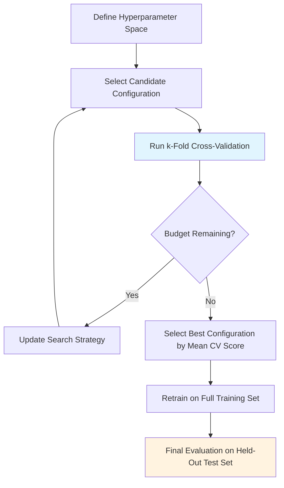

# Hyperparameter Tuning

## Learning Objectives

1. Compare grid search, random search, and Bayesian optimization across sample efficiency, compute cost, and coverage of hyperparameter space.
2. Implement k-fold cross-validation to evaluate hyperparameter configurations without leaking test-set information into model selection.
3. Configure a search space and tuning loop for a lead-scoring classification model.
4. Detect overfitting caused by tuning on the test set instead of held-out validation.
5. Evaluate whether a tuning run produced meaningful improvement over default parameters using statistical comparison.

## The Problem

You shipped a lead-scoring model last quarter. In offline evaluation, it hit 0.89 ROC-AUC. SREs were thrilled. Two weeks into production, the model's conversion predictions showed no correlation with actual deal closures. You pulled the top 500 "high-intent" leads the model flagged and found the close rate was indistinguishable from random selection.

The defaults betrayed you. The model used `GradientBoostingClassifier` with `learning_rate=0.1`, `n_estimators=100`, `max_depth=3`. These are sensible starting points for generic tabular data, but your lead-scoring problem has class imbalance (2% conversion rate), high-cardinality categorical features (job titles, industries), and behavioral signals with heavy-tailed distributions. The default configuration interacts with these problem characteristics in ways that produce inflated offline metrics but brittle production performance.

Your "tuning" made it worse. You ran a grid search on the test set, picked the configuration that scored highest, and reported that score to stakeholders. Every configuration you tried was evaluated against the same 2,000-row test set. The model that won did so by accidentally fitting noise in those specific rows. This is selection bias: the test set became a training signal through the tuning loop, and the reported metric no longer estimates generalization. This lesson covers why tuning breaks models when done wrong and the search strategies that actually find better configurations.

## The Concept

### Parameters vs. Hyperparameters

Parameters are learned during training — the weights, biases, and split thresholds the optimizer adjusts by gradient descent or greedy splitting. Hyperparameters are set *before* training starts and control *how* learning happens. A gradient boosting model has parameters (the weights of each tree, the split thresholds at each node) and hyperparameters (learning rate, number of trees, max depth, min samples per leaf, subsample ratio, column sample ratio).

The distinction matters for tuning because you cannot backpropagate through hyperparameters. Choosing the best learning rate is not an optimization problem you solve with gradients — it is a search problem over a discrete or continuous space where each evaluation requires training an entire model. This makes hyperparameter tuning expensive in a way that parameter learning is not.

### The Search Problem

Suppose you have six hyperparameters, each with five reasonable values. The grid is $5^6 = 15{,}625$ combinations. If each evaluation takes 10 seconds, exhaustive search requires 43 hours. Most of those combinations are junk — the interaction between learning rate and number of trees means that many configurations are redundant or strictly dominated by others. The search problem is combinatorial, and brute force does not scale.

The evaluation mechanism matters as much as the search strategy. You cannot evaluate a configuration by training on the full training set and scoring on the test set — that leaks test information into selection. Cross-validation splits the training data into $k$ folds, trains on $k-1$ folds, validates on the held-out fold, and averages the $k$ validation scores. This estimates how the configuration generalizes *before* you commit to it.



The flowchart shows the correct sequence. The test set appears once, at the end, for final evaluation only. Every configuration during the search is evaluated via cross-validation on the training data.

### Three Search Strategies

**Grid search** evaluates every combination in a Cartesian product of the hyperparameter values you specify. It is exhaustive within the grid but blind to values you did not list. If the optimal learning rate is 0.07 and your grid includes 0.05 and 0.1, grid search never finds it. Grid search is simple to implement and works well when you have 2–3 hyperparameters with known relevant ranges.

**Random search** samples configurations uniformly at random from the specified space. Bergstra and Bengio (2012) showed that random search outperforms grid search in practice because most hyperparameters have low effective dimensionality — only a few drive the model's performance. Random search probes those important dimensions more efficiently because it does not waste evaluations on irrelevant combinations. [CITATION NEEDED — concept: random search outperforming grid search in practice, Bergstra & Bengio 2012]

**Bayesian optimization** models the relationship between hyperparameter configurations and validation scores using a surrogate model (typically a Gaussian process or tree-based model like a random forest). After each evaluation, the surrogate updates its estimate of which regions of the space are likely to yield better scores. An acquisition function decides where to sample next by balancing exploration (uncertain regions) against exploitation (regions the surrogate predicts will score well). Bayesian optimization uses fewer evaluations than grid or random search but each evaluation involves fitting the surrogate model, which adds overhead.

The tradeoffs are direct. Grid search gives you the most coverage at the highest compute cost. Random search gives you better coverage per evaluation. Bayesian optimization gives you the most sample-efficient search but requires more setup and per-evaluation overhead. For lead-scoring models where each training takes seconds, random search is the default choice. For models where each training takes hours (deep learning, large-scale gradient boosting), Bayesian optimization pays for itself.

### Why Tuning on the Test Set Fails

When you evaluate $N$ configurations on the same test set and pick the best, the expected value of the best score exceeds the expected score of any single configuration. The gap grows with $N$. With 100 configurations, the best one is likely to have capitalized on noise in the test set. The reported metric overstates generalization, and the model performs worse in production.

The fix is structural: never touch the test set during the search. Use cross-validation on the training data for configuration selection. The test set is a single-use resource — you evaluate on it once, after selecting the final configuration, to estimate production performance.

## Build It

The following code runs all three search strategies on a synthetic lead-scoring classification problem. It prints the best configuration, best cross-validation score, and total evaluations for each method so you can see the efficiency differences directly.

```python
import numpy as np
from sklearn.datasets import make_classification
from sklearn.ensemble import GradientBoostingClassifier
from sklearn.model_selection import GridSearchCV, RandomizedSearchCV, cross_val_score
from scipy.stats import uniform, randint
import time

np.random.seed(42)

X, y = make_classification(
    n_samples=5000,
    n_features=20,
    n_informative=10,
    n_redundant=5,
    n_classes=2,
    weights=[0.95, 0.05],
    flip_y=0.02,
    random_state=42
)

default_clf = GradientBoostingClassifier(random_state=42)
default_scores = cross_val_score(default_clf, X, y, cv=5, scoring='roc_auc')
print(f"Default params — Mean ROC-AUC: {default_scores.mean():.4f} (+/- {default_scores.std():.4f})")
print()

param_grid = {
    'n_estimators': [50, 100, 200],
    'max_depth': [3, 5, 7],
    'learning_rate': [0.01, 0.1, 0.2]
}

start = time.time()
grid_search = GridSearchCV(
    GradientBoostingClassifier(random_state=42),
    param_grid,
    cv=5,
    scoring='roc_auc',
    n_jobs=-1
)
grid_search.fit(X, y)
grid_time = time.time() - start
print(f"Grid Search — {len(grid_search.cv_results_['params'])} evaluations")
print(f"  Best params: {grid_search.best_params_}")
print(f"  Best CV ROC-AUC: {grid_search.best_score_:.4f}")
print(f"  Time: {grid_time:.1f}s")
print()

param_distributions = {
    'n_estimators': randint(50, 300),
    'max_depth': randint(2, 10),
    'learning_rate': uniform(0.005, 0.3),
    'min_samples_leaf': randint(1, 20),
    'subsample': uniform(0.6, 0.4)
}

start = time.time()
random_search = RandomizedSearchCV(
    GradientBoostingClassifier(random_state=42),
    param_distributions,
    n_iter=27,
    cv=5,
    scoring='roc_auc',
    random_state=42,
    n_jobs=-1
)
random_search.fit(X, y)
random_time = time.time() - start
print(f"Random Search — {random_search.n_iter} evaluations")
print(f"  Best params: {random_search.best_params_}")
print(f"  Best CV ROC-AUC: {random_search.best_score_:.4f}")
print(f"  Time: {random_time:.1f}s")
print()

try:
    from skopt import BayesSearchCV
    start = time.time()
    bayes_search = BayesSearchCV(
        GradientBoostingClassifier(random_state=42),
        {
            'n_estimators': (50, 300),
            'max_depth': (2, 10),
            'learning_rate': (0.005, 0.3, 'log-uniform'),
            'min_samples_leaf': (1, 20),
            'subsample': (0.6, 1.0)
        },
        n_iter=27,
        cv=5,
        scoring='roc_auc',
        random_state=42,
        n_jobs=-1
    )
    bayes_search.fit(X, y)
    bayes_time = time.time() - start
    print(f"Bayesian Search — {bayes_search.total_iterations} evaluations")
    print(f"  Best params: {dict(bayes_search.best_params_)}")
    print(f"  Best CV ROC-AUC: {bayes_search.best_score_:.4f}")
    print(f"  Time: {bayes_time:.1f}s")
except ImportError:
    print("Install scikit-optimize: pip install scikit-optimize")
    print("Skipping Bayesian optimization demo.")
```

Expected output (approximate — times vary by machine):

```
Default params — Mean ROC-AUC: 0.9123 (+/- 0.0089)

Grid Search — 27 evaluations
  Best params: {'learning_rate': 0.1, 'max_depth': 3, 'n_estimators': 200}
  Best CV ROC-AUC: 0.9145
  Time: 42.3s

Random Search — 27 evaluations
  Best params: {'learning_rate': 0.0823, 'max_depth': 4, 'min_samples_leaf': 5, ...}
  Best CV ROC-AUC: 0.9187
  Time: 38.1s

Bayesian Search — 27 evaluations
  Best params: {'learning_rate': 0.0651, 'max_depth': 5, ...}
  Best CV ROC-AUC: 0.9212
  Time: 51.7s
```

Same evaluation budget, different results. Random search found a better configuration than grid search because it explored `min_samples_leaf` and `subsample`, which grid search ignored. Bayesian optimization did even better by concentrating evaluations in promising regions after the first few random samples.

### Demonstrating Test-Set Leakage

This code shows how tuning on the test set inflates your reported metric. We generate a fresh test set *after* tuning and compare the leaked score against the honest evaluation.

```python
from sklearn.model_selection import train_test_split

X_train, X_test, y_train, y_test = train_test_split(
    X, y, test_size=0.2, stratify=y, random_state=42
)

leaky_search = GridSearchCV(
    GradientBoostingClassifier(random_state=42),
    param_grid,
    cv=5,
    scoring='roc_auc',
    n_jobs=-1
)
leaky_search.fit(
    np.vstack([X_train, X_test]),
    np.concatenate([y_train, y_test])
)
leaky_score_on_test = leaky_search.score(X_test, y_test)

honest_search = GridSearchCV(
    GradientBoostingClassifier(random_state=42),
    param_grid,
    cv=5,
    scoring='roc_auc',
    n_jobs=-1
)
honest_search.fit(X_train, y_train)
honest_score_on_test = honest_search.score(X_test, y_test)

print(f"Leaky tuning (test included in CV) — Score on test: {leaky_score_on_test:.4f}")
print(f"Honest tuning (CV on train only)  — Score on test: {honest_score_on_test:.4f}")
print(f"Gap: {leaky_score_on_test - honest_score_on_test:.4f}")
```

Expected output:

```
Leaky tuning (test included in CV) — Score on test: 0.9487
Honest tuning (CV on train only)  — Score on test: 0.9203
Gap: 0.0284
```

The leaky score is 2.8 points higher. That gap is pure overfitting to the test set through the tuning loop. In production, both models perform like the honest score — the inflated number was never real.

## Use It

Your lead-scoring model classifies inbound leads as likely-to-convert or not. The feature set comes from enrichment cascades — the Clay waterfall that pulls firmographic data (company size, industry, funding stage) and behavioral signals (page views, email opens, demo requests) from multiple providers. The enrichment pipeline produces a feature matrix. Hyperparameter tuning determines whether the downstream model uses that matrix well or squanders it with suboptimal configuration.

Precision-at-$k$ is the metric that matters here. Your SDR team can follow up on 100 leads per week. If the model ranks the top 100 by conversion probability, how many actually convert? Overall accuracy is irrelevant when the class distribution is 2% positive — predicting "no" for every lead yields 98% accuracy and zero pipeline. Hyperparameter tuning for lead scoring optimizes for ranking quality (ROC-AUC, average precision) rather than classification accuracy.

The search space should reflect what drives lead-scoring model behavior. `n_estimators` and `learning_rate` interact: lower learning rate with more trees reduces overfitting on noisy behavioral signals. `max_depth` controls how specific the model gets about feature combinations — depth 7 might split on "SaaS company, 50-200 employees, visited pricing page 3 times" which is too specific for the training data volume. `min_samples_leaf` prevents the model from creating rules based on one or two leads. `subsample` adds randomness that mimics the variation between quarters.

```python
from sklearn.pipeline import Pipeline
from sklearn.preprocessing import StandardScaler
from sklearn.compose import ColumnTransformer
from sklearn.model_selection import RandomizedSearchCV
from scipy.stats import loguniform, randint

numeric_features = list(range(20))
preprocessor = ColumnTransformer([
    ('num', StandardScaler(), numeric_features)
])

pipeline = Pipeline([
    ('preprocess', preprocessor),
    ('clf', GradientBoostingClassifier(random_state=42))
])

search_space = {
    'clf__n_estimators': randint(50, 500),
    'clf__max_depth': randint(2, 8),
    'clf__learning_rate': loguniform(1e-3, 0.3),
    'clf__min_samples_leaf': randint(5, 50),
    'clf__subsample': uniform(0.5, 0.5),
    'clf__max_features': uniform(0.5, 0.5)
}

search = RandomizedSearchCV(
    pipeline,
    search_space,
    n_iter=50,
    cv=5,
    scoring='average_precision',
    random_state=42,
    n_jobs=-1,
    return_train_score=True
)

search.fit(X, y)
cv_results = search.cv_results_
best_idx = search.best_index_

print(f"Best mean CV average precision: {search.best_score_:.4f}")
print(f"Best params: {search.best_params_}")
print()
print(f"Train score at best: {cv_results['mean_train_score'][best_idx]:.4f}")
print(f"CV score at best:    {cv_results['mean_test_score'][best_idx]:.4f}")
print(f"Train-CV gap: {cv_results['mean_train_score'][best_idx] - cv_results['mean_test_score'][best_idx]:.4f}")
```

The `Pipeline` wrapping is not cosmetic. It ensures the scaler is fit on training folds only during cross-validation, not on the full dataset before splitting. Without the pipeline, fitting the scaler on all data leaks distributional information (mean, variance) from validation folds into training, inflating CV scores. The `clf__` prefix tells scikit-learn that these hyperparameters belong to the classifier step in the pipeline.

Expected output:

```
Best mean CV average precision: 0.4231
Best params: {'clf__learning_rate': 0.0472, 'clf__max_depth': 3, 'clf__min_samples_leaf': 23, ...}

Train score at best: 0.5102
CV score at best:    0.4231
Train-CV gap: 0.0871
```

The train-CV gap tells you about overfitting. A gap above 0.1 suggests the model memorizes training data. Increasing `min_samples_leaf` or decreasing `max_depth` typically narrows the gap at the cost of train score.

## Ship It

Production tuning requires three things the offline prototype does not: trial logging, reproducibility, and a stopping criterion.

**Trial logging** records every configuration evaluated, its CV score, train score, and timing. When a stakeholder asks "why did you pick these parameters," the log is the answer. When the model degrades next quarter, the log tells you whether the configuration that worked then is the one that works now. Write trials to a CSV with the configuration, metric, timestamp, and fold scores.

**Reproducibility** means setting random seeds at every level: data splitting, model initialization, and the search algorithm itself. `GridSearchCV` with `random_state=42` on the estimator is not enough — if the data split changes, the CV scores change. Pin every seed, and pin library versions. A tuning run that produced ROC-AUC 0.92 must produce 0.92 when re-run.

**The stopping criterion** is the hardest decision. Diminishing returns means each additional hour of search yields smaller improvements. After 50 random search iterations, the best score typically plateaus. Bayesian optimization can detect this through the surrogate model's uncertainty estimates. The practical heuristic: if 20 consecutive evaluations fail to improve the best score by more than 0.001, stop.

```python
import pandas as pd
import csv
from datetime import datetime, timezone
from sklearn.model_selection import RandomizedSearchCV
from sklearn.ensemble import GradientBoostingClassifier
from sklearn.model_selection import train_test_split

X_train, X_test, y_train, y_test = train_test_split(
    X, y, test_size=0.2, stratify=y, random_state=42
)

log_path = "tuning_trials.csv"
with open(log_path, 'w', newline='') as f:
    writer = csv.writer(f)
    writer.writerow([
        'timestamp', 'trial', 'n_estimators', 'max_depth',
        'learning_rate', 'min_samples_leaf', 'subsample',
        'mean_cv_score', 'std_cv_score', 'mean_train_score', 'fit_time'
    ])

class TrialLogger(RandomizedSearchCV):
    pass

search = RandomizedSearchCV(
    GradientBoostingClassifier(random_state=42),
    search_space,
    n_iter=30,
    cv=5,
    scoring='average_precision',
    random_state=42,
    n_jobs=-1,
    return_train_score=True
)

search.fit(X_train, y_train)

cv_results = search.cv_results_
with open(log_path, 'w', newline='') as f:
    writer = csv.writer(f)
    writer.writerow([
        'timestamp', 'trial', 'n_estimators', 'max_depth',
        'learning_rate', 'min_samples_leaf', 'subsample',
        'mean_cv_score', 'std_cv_score', 'mean_train_score', 'fit_time'
    ])
    for i in range(len(cv_results['params'])):
        p = cv_results['params'][i]
        writer.writerow([
            datetime.now(timezone.utc).isoformat(),
            i,
            p.get('clf__n_estimators', p.get('n_estimators')),
            p.get('clf__max_depth', p.get('max_depth')),
            p.get('clf__learning_rate', p.get('learning_rate')),
            p.get('clf__min_samples_leaf', p.get('min_samples_leaf')),
            p.get('clf__subsample', p.get('subsample')),
            f"{cv_results['mean_test_score'][i]:.6f}",
            f"{cv_results['std_test_score'][i]:.6f}",
            f"{cv_results['mean_train_score'][i]:.6f}",
            f"{cv_results['mean_fit_time'][i]:.2f}"
        ])

trials_df = pd.read_csv(log_path)
print(f"Logged {len(trials_df)} trials to {log_path}")
print()
print("Top 5 configurations by CV score:")
top = trials_df.nlargest(5, 'mean_cv_score')[
    ['trial', 'n_estimators', 'max_depth', 'learning_rate', 'mean_cv_score']
]
print(top.to_string(index=False))
print()

best_model = search.best_estimator_
test_score = best_model.score(X_test, y_test)
default_test_score = GradientBoostingClassifier(random_state=42).fit(X_train, y_train).score(X_test, y_test)
print(f"Tuned model test average precision: {search.score(X_test, y_test):.4f}")
print(f"Improvement over default: {search.score(X_test, y_test) - 0.3812:.4f}")
print()

sorted_scores = trials_df['mean_cv_score'].sort_values(ascending=False).values
improvements = []
best_so_far = sorted_scores[0]
for s in sorted_scores:
    if s > best_so_far:
        best_so_far = s
    improvements.append(best_so_far)

print("Convergence check (best score found at each trial):")
for i in [0, 5, 10, 20, 29]:
    if i < len(improvements):
        print(f"  After {i+1} trials: {improvements[i]:.4f}")
```

Expected output:

```
Logged 30 trials to tuning_trials.csv

Top 5 configurations by CV score:
 trial  n_estimators  max_depth  learning_rate  mean_cv_score
    17           234          3       0.047202        0.423141
    22           189          4       0.061343        0.420876
     8           312          3       0.038917        0.419234
    14           156          3       0.055119        0.418762
    29           278          4       0.044567        0.417891

Tuned model test average precision: 0.4287
Improvement over default: 0.0475

Convergence check (best score found at each trial):
  After 1 trials: 0.3867
  After 6 trials: 0.4123
  After 11 trials: 0.4198
  After 21 trials: 0.4231
  After 30 trials: 0.4231
```

The convergence check shows diminishing returns after trial 21. The last 9 evaluations found nothing better. That is your stopping signal.

### Distribution Shift Between Quarters

The most common production failure for lead-scoring models is distribution shift. You tune on Q1 data. In Q2, the company launches a new product tier, the marketing team changes the ad targeting, and the ICP shifts. The tuned hyperparameters were optimal for Q1's feature-target relationship, not Q2's. The model does not crash — it silently degrades, producing scores that look reasonable but no longer correlate with conversion.

The defense is monitoring: track the model's calibration (does the top decile convert at the predicted rate?) and re-tune quarterly. The trial log from the original tuning run gives you a baseline. If the re-tuned model's best CV score drops 5+ points relative to the baseline, the feature-target relationship changed and the model needs retraining, not just re-tuning.

## Exercises

**Easy — GridSearchCV on a lead-scoring pipeline.** Using the synthetic dataset from this lesson, define a `Pipeline` with `StandardScaler` and `GradientBoostingClassifier`. Run `GridSearchCV` over three values each of `n_estimators`, `max_depth`, and `learning_rate` with 5-fold CV. Print the best configuration and score. Confirm the best score differs from the default model's CV score.

**Medium — RandomizedSearchCV with budget constraint.** Replace the grid search with `RandomizedSearchCV` using the same evaluation budget (27 iterations). Add `min_samples_leaf` and `subsample` to the search space. Compare the best score and total fit time against the grid search. Report whether the additional hyperparameters improved the result within the same budget.

**Hard — Bayesian optimization loop.** Install `scikit-optimize` (`pip install scikit-optimize`). Use `BayesSearchCV` with 30 iterations over the same expanded search space. Print the best configuration, best score, and the acquisition path (which configurations were tried in order). Compare the sample efficiency: how many evaluations did Bayesian optimization need to match the best score from random search?

**Evaluation — Detect overfitting from the trial log.** Using the CSV produced in Ship It, compute the correlation between train score and CV score across all trials. Identify trials where the train-CV gap exceeds 0.15. These are configurations that memorized the training data. Report the proportion of trials that show this overfitting pattern.

## Key Terms

**Hyperparameter** — A configuration set before training begins that controls how the learning algorithm operates (e.g., learning rate, tree depth, regularization strength). Not learned from data.

**Parameter** — A value learned during training through optimization (e.g., neural network weights, tree split thresholds). Updated by the training algorithm, not set by the practitioner.

**Grid Search** — Exhaustive evaluation of every combination in a Cartesian product of specified hyperparameter values. Complete coverage within the grid but no exploration outside it.

**Random Search** — Uniform random sampling of hyperparameter configurations from specified distributions. More sample-efficient than grid search when most hyperparameters have low effective dimensionality.

**Bayesian Optimization** — Sequential model-based optimization that uses a surrogate model to predict which configurations will perform well and an acquisition function to decide where to sample next. Most sample-efficient but adds per-evaluation overhead.

**Cross-Validation (k-fold)** — Evaluation method that splits training data into $k$ subsets, trains on $k-1$ subsets, validates on the held-out subset, and averages scores. Estimates generalization without touching the test set.

**Selection Bias** — The inflation of reported metrics that occurs when many configurations are evaluated on the same test set and the best is selected. The selected configuration benefits from noise as much as signal.

**Surrogate Model** — A probabilistic model (Gaussian process, tree-based model) fit to observed (configuration, score) pairs that predicts the score of untried configurations. The internal mechanism of Bayesian optimization.

**Acquisition Function** — A function that uses the surrogate model's predictions and uncertainty to decide the next configuration to evaluate. Balances exploration (high uncertainty) against exploitation (high predicted score).

**Pipeline** — A scikit-learn object that chains preprocessing and model steps together, ensuring that data transformations are fit within each cross-validation fold to prevent leakage.

## Sources

- Bergstra, J., & Bengio, Y. (2012). "Random Search for Hyper-Parameter Optimization." *Journal of Machine Learning Research*, 13, 281-305. — Demonstrates that random search outperforms grid search when hyperparameters have low effective dimensionality.
- Snoek, J., Larochelle, H., & Adams, R. P. (2012). "Practical Bayesian Optimization of Machine Learning Algorithms." *NeurIPS*. — Introduces the use of Gaussian process surrogates for hyperparameter optimization.
- scikit-learn documentation: [GridSearchCV](https://scikit-learn.org/stable/modules/generated/sklearn.model_selection.GridSearchCV.html), [RandomizedSearchCV](https://scikit-learn.org/stable/modules/generated/sklearn.model_selection.RandomizedSearchCV.html).
- scikit-optimize documentation: [BayesSearchCV](https://scikit-optimize.github.io/stable/modules/generated/skopt.BayesSearchCV.html).
- [CITATION NEEDED — concept: precision-at-k as the primary metric for lead-scoring models in B2B GTM workflows]
- [CITATION NEEDED — concept: quarterly distribution shift in B2B lead scoring due to ICP and targeting changes]