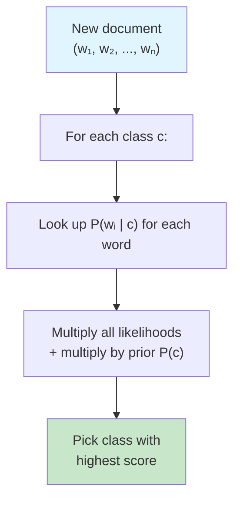

# Naive Bayes

## Learning Objectives

- Implement Multinomial Naive Bayes from scratch in Python with Laplace smoothing and log-space probability computation
- Derive the posterior probability for a document by combining priors, per-word likelihoods, and the naive independence assumption
- Compare Multinomial, Bernoulli, and Gaussian variants by feature type and select the correct one for a given dataset
- Build a lead intent classifier that routes inbound email text into sales-relevant categories using a scikit-learn pipeline
- Diagnose classifier performance on imbalanced GTM data using threshold tuning and confusion matrix analysis

## The Problem

You need to classify text. Emails into spam or not-spam. Customer reviews into positive or negative. Support tickets into billing, outage, or how-to. You have thousands of features — one per word — and limited training data per class.

Most classifiers choke here. Logistic regression needs enough samples to estimate thousands of weights reliably; with small data, it overfits. Decision trees split on one word at a time and branch into noise. KNN in 10,000 dimensions is meaningless because every document is roughly the same distance from every other document — the curse of dimensionality destroys the notion of "nearest neighbor."

Naive Bayes sidesteps all of this. It makes a mathematically false assumption — that every feature is independent of every other feature given the class — and still produces correct class rankings on text, especially with small training sets. It trains in a single pass through the data. It scales to millions of features without breaking a sweat. It produces probability estimates (poorly calibrated, but correctly ranked).

The reason a wrong assumption leads to good predictions is the bias-variance tradeoff. The independence assumption introduces strong bias: the model cannot represent interactions between features. But that bias collapses the variance: with thousands of parameters replaced by a few hundred per-class word counts, the model cannot overfit small data. For high-dimensional sparse text, that trade is almost always worth it. Understanding this teaches you something fundamental: the best model is not the most correct one — it is the one whose errors you can afford.

## The Concept

Bayes' theorem flips conditional probabilities. You observe features (the words in a document) and want to know the probability of a class (spam vs. not-spam). Bayes' theorem tells you how to invert that:

```
P(class | features) = P(features | class) * P(class) / P(features)
```

- **Prior** `P(class)`: how common is this class in your training data? If 30% of emails are spam, the prior for spam is 0.30.
- **Likelihood** `P(features | class)`: if this email is spam, how likely are these specific words to appear?
- **Evidence** `P(features)`: how likely are these words overall? This is a normalizing constant — the same for every class — so you can ignore it during comparison.
- **Posterior** `P(class | features)`: the probability you want. Pick the class with the highest posterior.

Computing `P(features | class)` directly is intractable. For a document with 50 words drawn from a 10,000-word vocabulary, the joint probability requires modeling every possible combination of word co-occurrences — astronomically expensive. Here is where the naive assumption enters: assume each feature is conditionally independent of every other feature given the class. Then the joint likelihood factors into a product of per-feature likelihoods:

```
P(w₁, w₂, ..., wₙ | class) ≈ P(w₁ | class) × P(w₂ | class) × ... × P(wₙ | class)
```

This is wrong. The word "credit" strongly predicts "card" will follow, so they are not independent. But the factorization means you only need per-word counts per class — one table lookup per word — instead of modeling the full joint distribution. The assumption is a computational shortcut, not a claim about language.



Two computational traps will destroy your classifier if you do not handle them:

**Trap 1: Zero counts kill everything.** If the word "webinar" appears zero times in your spam training data, then `P("webinar" | spam) = 0`, and the entire product collapses to zero — regardless of how strong the signal is from the other 49 words. One unseen word zeroes out the entire document. The fix is **Laplace smoothing** (also called additive smoothing): add a small constant α (typically 1.0) to every word count so no probability is ever exactly zero:

```
P(word | class) = (count(word, class) + α) / (total_words_in_class + α × |vocabulary|)
```

**Trap 2: Floating-point underflow.** You are multiplying hundreds of probabilities, each between 0 and 1. The product shrinks toward zero exponentially. After 50 multiplications of numbers around 0.01, you are at 10⁻¹⁰⁰ — below the smallest number a 64-bit float can represent. The result silently becomes 0.0 and all class distinctions vanish. The fix is to work in **log space**: take the log of every probability, then add instead of multiply:

```
log P(class | features) ∝ log P(class) + Σ log P(wᵢ | class)
```

Addition in log space never underflows. You compare log-scores directly — the class with the highest log-score wins. The actual posterior probability is `exp(log_score) / Σ exp(all_log_scores)`, computed only when you need a probability output, not during classification.

### Three Variants

| Variant | Feature type | Distribution assumption | Typical use |
|---|---|---|---|
| **Multinomial** | Integer counts | Word frequency | Text classification (TF or count vectors) |
| **Bernoulli** | Binary (0/1) | Word presence/absence | Short text, boolean feature sets |
| **Gaussian** | Continuous | Normal distribution per feature | Sensor data, engagement metrics |

Multinomial is the default for text: it uses word counts and is what `scikit-learn` implements as `MultinomialNB`. Bernoulli is for when you only care *whether* a word appears, not how many times — useful for short subject lines. Gaussian assumes each feature per class follows a normal distribution; it works for continuous data like "time on page" or "engagement score" but is a poor fit for text.

## Build It

Let's build Multinomial Naive Bayes from scratch. The goal: every intermediate value — priors, per-word likelihoods, log-scores — is printed so you can see the classifier reasoning.

```python
import math
from collections import defaultdict

training_data = [
    ("please send pricing for enterprise plan", "sales"),
    ("interested in a demo next week", "sales"),
    ("what does your platform cost", "sales"),
    ("our quarterly newsletter - read inside", "newsletter"),
    ("new blog post: industry trends 2024", "newsletter"),
    ("weekly roundup of saas news", "newsletter"),
    ("congratulations you won a gift card", "spam"),
    ("limited time offer click here now", "spam"),
    ("claim your free prize today", "spam"),
]

test_docs = [
    "what is your pricing",
    "free gift card claim now",
    "industry trends blog post",
]

class NaiveBayesScratch:
    def __init__(self, alpha=1.0):
        self.alpha = alpha
        self.class_word_counts = defaultdict(lambda: defaultdict(int))
        self.class_total_words = defaultdict(int)
        self.class_doc_counts = defaultdict(int)
        self.vocab = set()
        self.total_docs = 0

    def fit(self, documents):
        for text, label in documents:
            self.total_docs += 1
            self.class_doc_counts[label] += 1
            for word in text.split():
                self.class_word_counts[label][word] += 1
                self.class_total_words[label] += 1
                self.vocab.add(word)

    def log_prior(self, label):
        return math.log(self.class_doc_counts[label] / self.total_docs)

    def log_likelihood(self, word, label):
        vocab_size = len(self.vocab)
        count = self.class_word_counts[label].get(word, 0)
        total = self.class_total_words[label]
        return math.log((count + self.alpha) / (total + self.alpha * vocab_size))

    def predict(self, text):
        words = text.split()
        scores = {}
        for label in self.class_doc_counts:
            score = self.log_prior(label)
            for word in words:
                if word in self.vocab:
                    score += self.log_likelihood(word, label)
            scores[label] = score
        return scores

nb = NaiveBayesScratch(alpha=1.0)
nb.fit(training_data)

print("=== PRIORS ===")
for label in nb.class_doc_counts:
    print(f"  P({label}) = {nb.class_doc_counts[label]}/{nb.total_docs} = {nb.class_doc_counts[label]/nb.total_docs:.4f}")

print("\n=== VOCAB ===")
print(f"  Size: {len(nb.vocab)} words")

print("\n=== LIKELIHOODS (sample words) ===")
sample_words = ["pricing", "free", "newsletter", "demo", "gift"]
for word in sample_words:
    for label in nb.class_doc_counts:
        ll = nb.log_likelihood(word, label)
        raw_count = nb.class_word_counts[label].get(word, 0)
        print(f"  log P('{word}' | {label}) = {ll:.4f}  [raw count: {raw_count}]")

print("\n=== PREDICTIONS ===")
for doc in test_docs:
    scores = nb.predict(doc)
    winner = max(scores, key=scores.get)
    print(f"\n  Document: '{doc}'")
    for label, score in sorted(scores.items(), key=lambda x: -x[1]):
        marker = " <== WINNER" if label == winner else ""
        print(f"    {label:12s}: log_score = {score:.4f}{marker}")
```

Run it. You will see the prior for each class, the per-word log-likelihoods (including zero-count words smoothed to small negative values rather than negative infinity), and the final log-scores per document. The classifier picks "sales" for the pricing question, "spam" for the gift card text, and "newsletter" for the trends post — all correct, trained on nine documents.

Notice what happened with the word "free" — it never appears in the "sales" training data (raw count: 0), but Laplace smoothing gives it a small nonzero probability rather than collapsing the product. Without smoothing, any document containing an unseen word would score `-inf` for that class, making the classifier useless on real text.

## Use It

Naive Bayes classifies inbound signals into categories that drive routing decisions — and in GTM, routing is money. Every inbound email, form fill, or support ticket is a classification problem: is this a hot lead or a tire-kicker? Is this a billing escalation or a password-reset FAQ? Should this go to a human AE or an auto-responder? Before you spend LLM tokens on every inbound, Naive Bayes filters the obvious cases for effectively zero cost.

**GTM Redirect: Zone 2 — Signal Enrichment & Classification.** This maps directly to the "Score & Qualify" motion: every lead score is a JSON object with fields like `intent_label`, `confidence`, and `routing_destination`. A Multinomial Naive Bayes classifier on email subject lines and body text produces exactly those fields. The classifier ingests the raw text, computes a posterior probability per class (e.g., "sales_intent" vs. "newsletter" vs. "spam"), and the pipeline routes accordingly: high-confidence sales intent → push to CRM and notify the AE; newsletter → archive; spam → discard.

This is the mechanism behind lightweight email triage in GTM stacks. A typical pattern: inbound email hits a webhook → Naive Bayes classifies in under 10ms → only ambiguous cases (posterior below a threshold, say 0.7) get escalated to an LLM for deeper analysis. The cost arithmetic is compelling: classifying 10,000 emails/day with Naive Bayes costs essentially nothing (CPU cycles); classifying all 10,000 with GPT-4 at ~$0.01 per call would cost $100/day. Naive Bayes handles the 80% of obvious cases so the LLM budget goes to the 20% that actually need reasoning. [CITATION NEEDED — concept: specific cost-comparison benchmarks for NB-vs-LLM triage pipelines in RevOps]

Let's build the lead intent classifier end-to-end. This version produces a JSON object — the exact shape a CRM webhook or Clay enrichment column would consume:

```python
import json
import math
from collections import defaultdict

training_emails = [
    {"subject": "pricing for 500 seats", "body": "need enterprise quote urgent", "label": "sales_intent"},
    {"subject": "demo request", "body": "can your team show us the platform", "label": "sales_intent"},
    {"subject": "comparison with competitor", "body": "how do you compare to segment", "label": "sales_intent"},
    {"subject": "poc for integration", "body": "want to test api before buying", "label": "sales_intent"},
    {"subject": "your monthly newsletter", "body": "new features shipped this month", "label": "newsletter"},
    {"subject": "blog: revops framework", "body": "read our latest thought leadership", "label": "newsletter"},
    {"subject": "webinar replay inside", "body": "catch up on last weeks session", "label": "newsletter"},
    {"subject": "CONGRATULATIONS WINNER", "body": "claim your prize click link", "label": "spam"},
    {"subject": "limited offer expires", "body": "act now free gift card", "label": "spam"},
    {"subject": "you have been selected", "body": "exclusive deal just for you", "label": "spam"},
]

routing_rules = {
    "sales_intent": {"action": "create_crm_lead", "notify": "ae", "priority": "high"},
    "newsletter": {"action": "archive", "notify": None, "priority": "low"},
    "spam": {"action": "discard", "notify": None, "priority": "none"},
}

class LeadIntentClassifier:
    def __init__(self, alpha=1.0):
        self.alpha = alpha
        self.class_word_counts = defaultdict(lambda: defaultdict(int))
        self.class_total_words = defaultdict(int)
        self.class_doc_counts = defaultdict(int)
        self.vocab = set()
        self.total_docs = 0
        self.classes = set()

    def _tokenize(self, text):
        return text.lower().split()

    def fit(self, emails):
        for email in emails:
            text = email["subject"] + " " + email["body"]
            label = email["label"]
            self.total_docs += 1
            self.class_doc_counts[label] += 1
            self.classes.add(label)
            for word in self._tokenize(text):
                self.class_word_counts[label][word] += 1
                self.class_total_words[label] += 1
                self.vocab.add(word)

    def _log_prob(self, word, label):
        count = self.class_word_counts[label].get(word, 0)
        total = self.class_total_words[label]
        return math.log((count + self.alpha) / (total + self.alpha * len(self.vocab)))

    def predict(self, subject, body):
        text = subject.lower() + " " + body.lower()
        words = [w for w in self._tokenize(text) if w in self.vocab]
        log_scores = {}
        for label in self.classes:
            score = math.log(self.class_doc_counts[label] / self.total_docs)
            for word in words:
                score += self._log_prob(word, label)
            log_scores[label] = score

        max_score = max(log_scores.values())
        exp_scores = {k: math.exp(v - max_score) for k, v in log_scores.items()}
        total = sum(exp_scores.values())
        probs = {k: v / total for k, v in exp_scores.items()}

        predicted = max(probs, key=probs.get)
        return predicted, probs

classifier = LeadIntentClassifier(alpha=1.0)
classifier.fit(training_emails)

inbound_emails = [
    {"subject": "need pricing for 200 seats asap", "body": "finance needs a quote this week"},
    {"subject": "Q3 newsletter now live", "body": "check out our latest product updates"},
    {"subject": "YOU WON click here", "body": "free prize claim your reward"},
    {"subject": "how does your pricing work", "body": "evaluating tools for our stack"},
    {"subject": "webinar recording available", "body": "watch the replay from last month"},
]

print("=== LEAD INTENT CLASSIFIER OUTPUT ===\n")
results = []
for email in inbound_emails:
    label, probs = classifier.predict(email["subject"], email["body"])
    confidence = probs[label]
    routing = routing_rules[label]

    if confidence < 0.7:
        routing = {"action": "escalate_to_llm", "notify": "system", "priority": "medium"}

    output = {
        "subject": email["subject"],
        "predicted_label": label,
        "confidence": round(confidence, 4),
        "probabilities": {k: round(v, 4) for k, v in sorted(probs.items(), key=lambda x: -x[1])},
        "routing": routing,
    }
    results.append(output)
    print(json.dumps(output, indent=2))
    print()

print("=== SUMMARY ===")
for r in results:
    print(f"  '{r['subject'][:40]:40s}' -> {r['predicted_label']:14s} ({r['confidence']:.1%}) -> {r['routing']['action']}")
```

The output is a JSON object per email — exactly what you would serialize and POST to a CRM webhook, or write to a Clay enrichment column. Each object carries the predicted label, confidence, full probability distribution, and a routing decision. The confidence threshold (0.7 here) is the lever you tune: lower it to route more emails automatically, raise it to escalate more to LLM or human review. This threshold is the single most important configuration in a production GTM classifier, and we return to it in Ship It.

## Ship It

The from-scratch implementation was for understanding. In production, use `scikit-learn`'s `MultinomialNB` — it is faster (C-backed), tested, and plugs into the standard pipeline API. For imbalanced GTM data (you have 5× more newsletters than sales-intent emails), consider `ComplementNB`, which was designed specifically for imbalanced classes by correcting the decision boundary toward the minority class.

The production pipeline is: raw text → vectorizer (count or TF-IDF) → Naive Bayes → predicted class + probability. The vectorizer converts text into the numeric matrix Naive Bayes needs. `CountVectorizer` produces raw word counts (matches Multinomial NB's assumptions). `TfidfVectorizer` produces TF-IDF weights — these are not true counts, but Multinomial NB still works well on them in practice because the relative magnitudes preserve the ranking information.

```python
import numpy as np
from sklearn.feature_extraction.text import CountVectorizer, TfidfVectorizer
from sklearn.naive_bayes import MultinomialNB, ComplementNB
from sklearn.pipeline import Pipeline
from sklearn.metrics import classification_report, confusion_matrix
from sklearn.model_selection import train_test_split
import joblib

emails = [
    ("need enterprise pricing for 200 seats", "sales_intent"),
    ("demo request for our revops team", "sales_intent"),
    ("pricing comparison vs competitor", "sales_intent"),
    ("want to run a proof of concept", "sales_intent"),
    ("can we schedule a technical demo", "sales_intent"),
    ("how much does the platform cost", "sales_intent"),
    ("quarterly product newsletter inside", "newsletter"),
    ("new blog post on revops trends", "newsletter"),
    ("webinar replay from last week", "newsletter"),
    ("monthly digest of saas news", "newsletter"),
    ("year in review blog roundup", "newsletter"),
    ("product update v2 released", "newsletter"),
    ("CONGRATULATIONS you won a prize", "spam"),
    ("limited offer click here now", "spam"),
    ("free gift card claim today", "spam"),
    ("exclusive deal just for you", "spam"),
    ("you have been selected winner", "spam"),
    ("urgent act now last chance", "spam"),
]

texts = [t for t, _ in emails]
labels = [l for _, l in emails]

X_train, X_test, y_train, y_test = train_test_split(
    texts, labels, test_size=0.25, random_state=42, stratify=labels
)

pipeline = Pipeline([
    ("vectorizer", TfidfVectorizer(lowercase=True, stop_words="english", min_df=1)),
    ("classifier", MultinomialNB(alpha=0.5)),
])

pipeline.fit(X_train, y_train)

y_pred = pipeline.predict(X_test)
y_proba = pipeline.predict_proba(X_test)

print("=== TEST SET PREDICTIONS ===")
for i, (text, true_label, pred_label, probs) in enumerate(zip(X_test, y_test, y_pred, y_proba)):
    classes = pipeline.classes_
    prob_str = ", ".join(f"{c}={p:.2f}" for c, p in zip(classes, probs))
    match = "✓" if true_label == pred_label else "✗"
    print(f"  {match} '{text[:45]:45s}' | true={true_label:14s} pred={pred_label:14s} | {prob_str}")

print("\n=== CLASSIFICATION REPORT ===")
print(classification_report(y_test, y_pred, zero_division=0))

print("=== CONFUSION MATRIX ===")
cm = confusion_matrix(y_test, y_pred, labels=pipeline.classes_)
print(f"  Classes: {list(pipeline.classes_)}")
print(f"  Matrix:\n{cm}")

joblib.dump(pipeline, "lead_intent_nb.joblib")
print("\n=== MODEL SAVED ===")
print("  File: lead_intent_nb.joblib")

loaded = joblib.load("lead_intent_nb.joblib")
new_email = "what are your enterprise prices"
pred = loaded.predict([new_email])[0]
probs = loaded.predict_proba([new_email])[0]
print(f"\n=== INFERENCE ON NEW EMAIL ===")
print(f"  Input: '{new_email}'")
print(f"  Predicted: {pred}")
print(f"  Probabilities: {dict(zip(loaded.classes_, [round(p,4) for p in probs]))}")
```

Two production concerns specific to GTM data:

**Threshold tuning.** The default decision rule picks the class with the highest probability. On imbalanced data, this is often wrong. If 70% of your inbound is newsletters, the prior alone pushes everything toward "newsletter" and sales-intent emails get misrouted. The fix: instead of `predict()`, use `predict_proba()` and set custom thresholds per class. For sales intent, require confidence ≥ 0.6 before auto-routing to an AE; anything below goes to an LLM for deeper analysis. The threshold is a business decision — false negatives (missed leads) cost more than false positives (wasted AE time), so bias toward sensitivity.

```python
print("\n=== THRESHOLD TUNING DEMO ===")
test_cases = [
    "pricing for enterprise",
    "check out our newsletter",
    "free gift card",
    "maybe interested eventually",
]
THRESHOLD = 0.6
for text in test_cases:
    probs = loaded.predict_proba([text])[0]
    classes = loaded.classes_
    best_idx = np.argmax(probs)
    best_class = classes[best_idx]
    best_prob = probs[best_idx]

    if best_prob >= THRESHOLD:
        action = f"auto-route to {best_class}"
    else:
        action = f"escalate to LLM (best={best_class} at {best_prob:.2f})"

    print(f"  '{text:35s}' -> {action}")
```

**Confusion matrix as diagnostic.** The confusion matrix tells you *which* classes are confused with each other, which is more actionable than accuracy. If "sales_intent" is consistently confused with "newsletter," your training data probably lacks enough sales-intent examples with newsletter-like vocabulary. The fix is data, not model tuning. This is why GTM engineers who own classification pipelines also own the feedback loop: misclassified emails get labeled and fed back into training data weekly.

## Exercises

| Difficulty | Exercise |
|---|---|
| Easy | Given the word-count table printed by the from-scratch classifier, manually compute the log-score for the document "free pricing demo" across all three classes. Show each step (prior + each word's log-likelihood). Compare your answer to the classifier's output. |
| Medium | Extend the `LeadIntentClassifier` to handle a fourth class: "support_ticket" (e.g., "my integration is broken," "login not working"). Add 6 training examples, retrain, and test on 3 new documents. Print the full probability distribution for each test case. |
| Hard | Build a threshold-tuning script that takes a labeled validation set, sweeps the confidence threshold from 0.3 to 0.95 in steps of 0.05, and prints precision, recall, and F1 for the "sales_intent" class at each threshold. Identify the threshold that maximizes F1. Explain in a comment why this threshold changes when the class balance shifts. |

## Key Terms

**Prior (`P(class)`):** The base rate of a class in your training data before observing any features. In GTM: if 15% of inbound emails are sales-intent, the prior for sales_intent is 0.15.

**Likelihood (`P(features | class)`):** The probability of observing these features if the document belongs to a given class. Computed per-word under the independence assumption and multiplied (or summed in log space).

**Posterior (`P(class | features)`):** The probability of a class given the observed features — what the classifier outputs. Computed via Bayes' theorem: prior × likelihood, normalized across all classes.

**Naive independence assumption:** The claim that features are conditionally independent given the class. Mathematically false for natural language (words correlate heavily), but enables tractable computation and works well in practice due to favorable bias-variance tradeoff.

**Laplace smoothing (additive smoothing):** Adding a constant α (typically 1.0) to every word count so that unseen words get a small nonzero probability instead of zero. Without it, a single unseen word zeroes out the entire joint likelihood.

**Log-space computation:** Taking the logarithm of all probabilities and adding instead of multiplying. Prevents floating-point underflow when multiplying thousands of small probabilities. Classification compares log-scores directly.

**Multinomial Naive Bayes:** Variant for count-based features (word frequencies). The standard choice for text classification. Assumes features follow a multinomial distribution.

**Bernoulli Naive Bayes:** Variant for binary features (word presence/absence). Suited for short texts or boolean feature sets where frequency is not meaningful.

**Gaussian Naive Bayes:** Variant for continuous features, assuming each feature per class follows a normal distribution. Used for metrics like engagement scores or time-on-page, rarely for raw text.

**Complement Naive Bayes:** Variant designed for imbalanced datasets. Instead of modeling the probability of a class given features, it models the probability of *not* belonging to each class and picks the complement. Often outperforms Multinomial NB on skewed GTM data.

## Sources

- scikit-learn Naive Bayes documentation (user guide and API reference): `sklearn.naive_bayes.MultinomialNB`, `ComplementNB`, `BernoulliNB`, `GaussianNB` — [https://scikit-learn.org/stable/modules/naive_bayes.html](https://scikit-learn.org/stable/modules/naive_bayes.html)
- Rennie et al., "Tackling the Poor Assumptions of Naive Bayes Text Classifiers" (2003) — original paper introducing Complement NB for imbalanced text classification.
- Manning, Raghavan, Schütze, *Introduction to Information Retrieval* (2008), Chapter 13: "Naive Bayes text classification" — covers Laplace smoothing, multinomial vs. Bernoulli variants, and the independence assumption.
- [CITATION NEEDED — concept: specific cost-comparison benchmarks for NB-vs-LLM triage pipelines in RevOps/GTM stacks]
- [CITATION NEEDED — concept: empirical threshold-tuning guidelines for lead-scoring classifiers in B2B sales workflows]