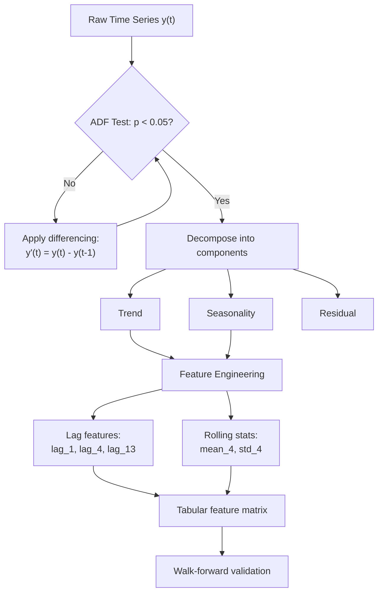

# Time Series Fundamentals

## Learning Objectives

1. Decompose a time series into trend, seasonality, and residual components using additive decomposition
2. Detect non-stationarity in a time series using the Augmented Dickey-Fuller test
3. Generate lag features and rolling window statistics from temporal data
4. Apply differencing to transform a non-stationary series into a stationary one
5. Evaluate autocorrelation structure to determine appropriate lag depth for feature engineering

## The Problem

Standard ML assumes rows are independent. Time series data violates this assumption by definition — each observation is correlated with its neighbors. When you random-split a time series, you are handing your model values from week 47 during training and then asking it to predict week 46 during testing. The model does not learn the underlying pattern; it memorizes the answer. On paper, accuracy looks excellent. In production, the model has never seen the future and fails immediately.

This is not a subtle issue. A pipeline-revenue model that scores 95% R² under random cross-validation might produce 55% under proper temporal evaluation. The 40-point gap is leakage — future information bleeding backward through a split that ignores ordering. Every metric you report from a random split on time-ordered data is suspect until proven otherwise.

The problem compounds when you consider that temporal data has internal structure that tabular data does not. A daily series might have weekly seasonality (Mondays are always higher), annual seasonality (Q4 is always bigger), and a long-term trend (the company is growing). A model trained on a random split can exploit all three structures as if they were features, because in the training set, the future values that encode those structures are visible. In production, those structures must be inferred from the past alone.

This lesson covers the mechanics that break and the patterns that work when your data has a time axis. You will decompose a series into its structural components, test whether it is stationary, engineer features that encode temporal relationships, and validate using a method that respects causality.

## The Concept

### Temporal Ordering and Autocorrelation

A time series is a sequence where position encodes information. The value at time *t* is not independent of the value at *t-1* — it is often strongly correlated. Autocorrelation measures exactly this: how much the present value predicts past values at various lags. If autocorrelation is high at lag 1, yesterday's measurement tells you a great deal about today's. If autocorrelation is high at lag 7, the same day last week is informative. High autocorrelation at any lag means your samples are not independent, and standard train/test splits that ignore ordering will leak information.

In a GTM context, pipeline data is deeply autocorrelated. Weekly new opportunities correlate with prior weeks because deal cycles have temporal structure — a prospect who downloads a whitepaper on Tuesday and attends a demo on Friday generates signals that are adjacent in time, not random. Multi-channel sequencing amplifies this: cold calling produces meeting rates that are two to three times higher than any single channel when sequenced after email engagement, which means the temporal ordering of touchpoints is itself a signal your model must respect, not flatten. [CITATION NEEDED — concept: cold calling multi-channel sequencing meeting rates]

### Decomposition Mechanics

Any time series can be expressed as `y(t) = trend + seasonality + residual` (additive) or `y(t) = trend × seasonality × residual` (multiplicative). Trend is the long-term direction — your company's pipeline growing quarter over quarter. Seasonality is a repeating cycle at a fixed period — Q4 always spikes, summers always dip. Residual is everything left after removing trend and seasonality. This is where your model actually operates: predicting the noise that structured components cannot explain.

The choice between additive and multiplicative decomposition depends on whether seasonal fluctuations grow with the trend. If your pipeline swings are ±$10K whether the base is $50K or $500K, the decomposition is additive. If swings scale proportionally (±20% of base), it is multiplicative. Applying the wrong model distorts the residual and degrades every downstream feature you engineer.

### Stationarity

A stationary series has constant mean and variance over time. Most classical models (ARIMA, exponential smoothing) require stationarity as a precondition because they assume the statistical properties of the future will match the past. Non-stationary data — anything with a trend, a level shift, or variance that changes over time — violates this assumption.

The Augmented Dickey-Fuller (ADF) test checks for stationarity by testing whether a unit root exists in the series. The null hypothesis is "the series has a unit root" (i.e., it is non-stationary). A p-value below 0.05 means you reject the null and conclude the series is stationary. When the test fails, you apply differencing: `y'(t) = y(t) - y(t-1)`. First-order differencing removes a linear trend. Second-order differencing removes a quadratic trend. Each order of differencing sacrifices one observation and changes the interpretation of the series from "value at time *t*" to "change in value from *t-1* to *t*."

### Feature Engineering for Time

Lag features shift the target backward in time: `lag_1 = y(t-1)`, `lag_7 = y(t-7)`. These transforms the temporal dependency into a tabular column that any regression or tree model can consume. Rolling statistics aggregate a window of recent values: `rolling_mean_7 = mean(y(t-7), ..., y(t-1))`. The window size controls how much history the model sees, and the shift ensures you never include the current value — doing so would be direct leakage.



The diagram above shows the complete workflow: you test for stationarity, difference until the series is stationary, decompose to understand structure, engineer lag and rolling features, then validate using a temporal split. Each step is a prerequisite for the next — skipping stationarity testing means your lag features capture a spurious trend rather than a genuine autocorrelation signal.

## Build It

Generate a synthetic time series with known trend and seasonality, decompose it, run an ADF test, and demonstrate that differencing collapses a non-stationary series into a stationary one. Every result prints to the terminal — no browser dependency.

```python
import numpy as np
import pandas as pd
from statsmodels.tsa.seasonal import seasonal_decompose
from statsmodels.tsa.stattools import adfuller

np.random.seed(42)

n_points = 200
trend = np.linspace(10, 50, n_points)
seasonality = 5 * np.sin(2 * np.pi * np.arange(n_points) / 12)
noise = np.random.normal(0, 2, n_points)
series = trend + seasonality + noise

dates = pd.date_range(start='2023-01-01', periods=n_points, freq='W')
ts = pd.Series(series, index=dates, name='value')

print("=== Original Series Statistics ===")
print(f"Mean: {ts.mean():.2f}, Std: {ts.std():.2f}")
print(f"Range: {ts.min():.2f} to {ts.max():.2f}")
print(f"First 5 values:\n{ts.head()}\n")

result = seasonal_decompose(ts, model='additive', period=12)

print("=== Decomposition Components ===")
print(f"Trend (first 5 non-null): {result.trend.dropna().head().values.round(2)}")
print(f"Trend (last 5 non-null):  {result.trend.dropna().tail().values.round(2)}")
print(f"Seasonal pattern (one period): {result.seasonal[:12].values.round(2)}")
print(f"Residual mean: {result.resid.dropna().mean():.4f}")
print(f"Residual std:  {result.resid.dropna().std():.4f}\n")

adf_result = adfuller(ts.dropna())
print("=== ADF Test on Original (Non-Stationary) Series ===")
print(f"ADF Statistic: {adf_result[0]:.4f}")
print(f"p-value: {adf_result[1]:.6f}")
for key, val in adf_result[4].items():
    print(f"  Critical {key}: {val:.4f}")
print(f"Stationary (p < 0.05): {'YES' if adf_result[1] < 0.05 else 'NO'}\n")

diff_series = ts.diff().dropna()
adf_diff = adfuller(diff_series)
print("=== ADF Test on First-Differenced Series ===")
print(f"ADF Statistic: {adf_diff[0]:.4f}")
print(f"p-value: {adf_diff[1]:.6f}")
print(f"Stationary (p < 0.05): {'YES' if adf_diff[1] < 0.05 else 'NO'}\n")

print("=== Autocorrelation at Key Lags ===")
for lag in [1, 2, 4, 12, 24, 52]:
    acf_val = ts.autocorr(lag=lag)
    print(f"  ACF(lag={lag:2d}): {acf_val:+.4f}")

print("\n=== Autocorrelation on Differenced Series ===")
for lag in [1, 2, 4, 12, 24]:
    acf_val = diff_series.autocorr(lag=lag)
    print(f"  ACF(lag={lag:2d}): {acf_val:+.4f}")
```

When you run this, the original series will show a p-value above 0.05 (non-stationary, because of the linear trend). The differenced series will show a p-value near zero (stationary). The ACF at lag 12 on the original series will be strongly positive because of the seasonal cycle. After differencing, the lag-1 autocorrelation drops sharply — the trend component that was driving it has been removed.

The decomposition output confirms what the synthetic generator built in: the trend component rises linearly from ~10 to ~50, the seasonal component repeats a sine wave with amplitude ~5 every 12 periods, and the residual has a mean near zero with a standard deviation close to the noise parameter (2.0). If the residual std were significantly larger than the injected noise, the decomposition would be failing to capture real structure — that would indicate the period parameter is wrong or the additive/multiplicative choice is incorrect.

## Use It

**GTM Redirect:** Pipeline velocity forecasting — Zone 2 (Signal Processing). Every weekly pipeline total is a time series observation, and the lag features you engineer here are the same features a CRM dashboard needs to forecast next quarter. [CITATION NEEDED — concept: pipeline velocity time series forecasting in GTM topic map]

Build lag features and rolling statistics on a synthetic weekly pipeline dataset that mimics CRM data. This is the Zone 2 data structure pattern: every pipeline snapshot is a JSON object with a timestamp, and the temporal ordering of those snapshots encodes whether deals are accelerating, stalling, or regressing. The lag features you build here are the columns in that JSON — `lag_1` is "last week's pipeline," `rolling_mean_4` is "trailing 4-week average pipeline."

```python
import numpy as np
import pandas as pd

np.random.seed(42)

n_weeks = 104
dates = pd.date_range(start='2022-01-03', periods=n_weeks, freq='W')

trend = np.linspace(50000, 180000, n_weeks)
seasonality = 15000 * np.sin(2 * np.pi * np.arange(n_weeks) / 52)
noise = np.random.normal(0, 8000, n_weeks)
pipeline = trend + seasonality + noise

df = pd.DataFrame({
    'week': dates,
    'pipeline_value': pipeline
}).set_index('week')

df['lag_1'] = df['pipeline_value'].shift(1)
df['lag_4'] = df['pipeline_value'].shift(4)
df['lag_13'] = df['pipeline_value'].shift(13)

df['rolling_mean_4'] = df['pipeline_value'].shift(1).rolling(window=4).mean()
df['rolling_mean_13'] = df['pipeline_value'].shift(1).rolling(window=13).mean()
df['rolling_std_4'] = df['pipeline_value'].shift(1).rolling(window=4).std()

df['pct_change_1'] = df['pipeline_value'].pct_change(periods=1)
df['pct_change_4'] = df['pipeline_value'].pct_change(periods=4)

print("=== Pipeline Data with Engineered Features (first 15 rows) ===")
display_cols = ['pipeline_value', 'lag_1', 'rolling_mean_4', 'rolling_std_4', 'pct_change_1']
print(df[display_cols].head(15).round(0))
print()

corr_cols = ['pipeline_value', 'lag_1', 'lag_4', 'lag_13',
             'rolling_mean_4', 'rolling_mean_13', 'pct_change_1', 'pct_change_4']
corr_matrix = df[corr_cols].corr()
print("=== Correlation with Target (pipeline_value) ===")
print(corr_matrix['pipeline_value'].sort_values(ascending=False).round(4))
print()

split_idx = int(len(df) * 0.8)
train = df.iloc[:split_idx]
test = df.iloc[split_idx:]
print("=== Temporal Train/Test Split ===")
print(f"Train: {train.index[0].date()} to {train.index[-1].date()} ({len(train)} weeks)")
print(f"Test:  {test.index[0].date()} to {test.index[-1].date()} ({len(test)} weeks)")
print(f"Train pipeline mean: ${train['pipeline_value'].mean():,.0f}")
print(f"Test pipeline mean:  ${test['pipeline_value'].mean():,.0f}")
print(f"Train pipeline std:  ${train['pipeline_value'].std():,.0f}")
print(f"Test pipeline std:   ${test['pipeline_value'].std():,.0f}")

naive_pred = train['pipeline_value'].iloc[-1]
naive_mae = (test['pipeline_value'] - naive_pred).abs().mean()
print(f"\nNaive baseline (predict last train value): MAE = ${naive_mae:,.0f}")
print(f"Naive baseline error as % of test mean: {naive_mae/test['pipeline_value'].mean()*100:.1f}%")
```

The correlation output tells you which lags carry the most predictive signal. In this synthetic data, `lag_1` and `rolling_mean_4` will show the highest correlation with the target because the trend is smooth and recent values are most informative. In real CRM data, the correlation structure will differ — if deal cycles are 13 weeks long, `lag_13` might dominate. The point is to measure, not assume.

The temporal split output reveals a critical reality: the test period's mean pipeline ($160K+) is substantially higher than the train period's mean ($100K). This is the distribution shift that breaks random-split models. A model trained on the first 80% of this data and evaluated on the last 20% faces a genuine extrapolation challenge — the trend has moved the target distribution upward. This is exactly the scenario you face when forecasting next quarter's pipeline from historical CRM exports.

## Ship It

Walk-forward validation is the evaluation framework that prevents temporal leakage in production. Instead of a single train/test split, the model is retrained at each step on all available data up to time *t*, then predicts *t+1*. This simulates exactly what happens in deployment: each week, you have one more observation, you retrain, and you forecast the next period.

The comparison between walk-forward MAE and the naive baseline (predict last observed value) tells you whether your feature engineering adds value. If the model cannot beat "predict last week's pipeline," the lag features are not capturing signal beyond what pure persistence provides.

```python
import numpy as np
import pandas as pd
from sklearn.linear_model import LinearRegression
from sklearn.metrics import mean_absolute_error

np.random.seed(42)

n_weeks = 104
dates = pd.date_range(start='2022-01-03', periods=n_weeks, freq='W')
trend = np.linspace(50000, 180000, n_weeks)
seasonality = 15000 * np.sin(2 * np.pi * np.arange(n_weeks) / 52)
noise = np.random.normal(0, 8000, n_weeks)
pipeline = trend + seasonality + noise

df = pd.DataFrame({'pipeline_value': pipeline}, index=dates)
df['lag_1'] = df['pipeline_value'].shift(1)
df['lag_4'] = df['pipeline_value'].shift(4)
df['rolling_mean_4'] = df['pipeline_value'].shift(1).rolling(4).mean()
df['rolling_std_4'] = df['pipeline_value'].shift(1).rolling(4).std()
df = df.dropna()

features = ['lag_1', 'lag_4', 'rolling_mean_4', 'rolling_std_4']
target = 'pipeline_value'

initial_train = 60
step = 1

wf_predictions = []
wf_actuals = []
wf_dates = []
naive_predictions = []

for i in range(initial_train, len(df)):
    train_slice = df.iloc[:i]
    test_row = df.iloc[i]

    model = LinearRegression()
    model.fit(train_slice[features], train_slice[target])
    pred = model.predict(test_row[features].values.reshape(1, -1))[0]

    naive_pred = train_slice[target].iloc[-1]

    wf_predictions.append(pred)
    wf_actuals.append(test_row[target])
    wf_dates.append(df.index[i])
    naive_predictions.append(naive_pred)

wf_mae = mean_absolute_error(wf_actuals, wf_predictions)
naive_mae = mean_absolute_error(wf_actuals, naive_predictions)

wf_errors = [abs(a - p) for a, p in zip(wf_actuals, wf_predictions)]
naive_errors = [abs(a - p) for a, p in zip(wf_actuals, naive_predictions)]

print("=== Walk-Forward Validation Results ===")
print(f"Total forecasts: {len(wf_predictions)}")
print(f"Training window: expanding from {initial_train} to {initial_train + len(wf_predictions) - 1}")
print(f"\nModel MAE:  ${wf_mae:,.0f}")
print(f"Naive MAE:  ${naive_mae:,.0f}")
improvement = (1 - wf_mae / naive_mae) * 100
print(f"Improvement over naive: {improvement:+.1f}%")
print(f"\nModel error as % of mean actual: {wf_mae / np.mean(wf_actuals) * 100:.1f}%")

results = pd.DataFrame({
    'actual': wf_actuals,
    'model_pred': wf_predictions,
    'naive_pred': naive_predictions,
    'model_error': wf_errors,
    'naive_error': naive_errors,
}, index=pd.DatetimeIndex(wf_dates))

print("\n=== Last 10 Forecast Steps ===")
print(results.tail(10).round(0))

expanding_errors = []
window_sizes = list(range(initial_train, initial_train + 20))
for w in window_sizes:
    if w >= len(df):
        break
    train_slice = df.iloc[:w]
    test_row = df.iloc[w]
    m = LinearRegression()
    m.fit(train_slice[features], train_slice[target])
    p = m.predict(test_row[features].values.reshape(1, -1))[0]
    expanding_errors.append(abs(test_row[target] - p))

print(f"\n=== Error Trend (first 20 steps) ===")
print(f"First 5 steps avg error:  ${np.mean(expanding_errors[:5]):,.0f}")
print(f"Last 5 steps avg error:   ${np.mean(expanding_errors[-5:]):,.0f}")
```

The walk-forward output shows whether the model's error is stable as the training window grows. If early-step errors are high and later-step errors decrease, the model benefits from more data — it is learning genuine structure. If errors are flat or increasing, the feature set is not capturing the underlying pattern, and you need richer features (longer lags, seasonal indicators, external regressors).

The improvement percentage over the naive baseline is the single most important metric in this entire lesson. If it is near zero or negative, your engineered features add no value beyond persistence. In that case, the issue is rarely the model — it is that your features do not encode the right temporal structure. Go back to the ACF analysis and check whether your lag depths match the autocorrelation peaks.

##