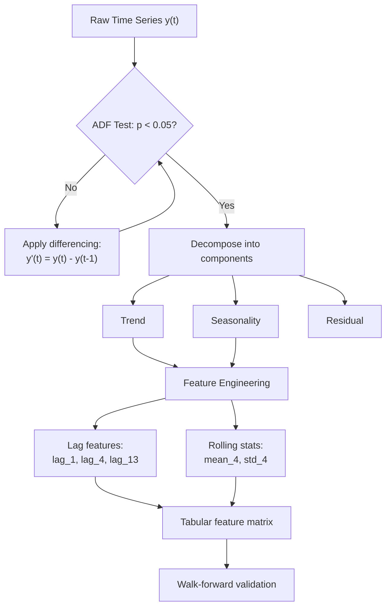

# Time Series Fundamentals

## Learning Objectives

1. Decompose a time series into trend, seasonality, and residual components using additive decomposition
2. Detect non-stationarity in a time series using the Augmented Dickey-Fuller test
3. Generate lag features and rolling window statistics from temporal data
4. Apply differencing to transform a non-stationary series into a stationary one
5. Evaluate autocorrelation structure to determine appropriate lag depth for feature engineering

## The Problem

Standard ML assumes rows are independent. Time series data violates this assumption by definition — each observation is correlated with its neighbors. When you random-split a time series, you are handing your model values from week 47 during training and then asking it to predict week 46 during testing. The model does not learn the underlying pattern; it memorizes the answer. On paper, accuracy looks excellent. In production, the model has never seen the future and fails immediately.

This is not a subtle issue. A pipeline-revenue model that scores 95% R² under random cross-validation might produce 55% under proper temporal evaluation. The 40-point gap is leakage — future information bleeding backward through a split that ignores ordering. Every metric you report from a random split on time-ordered data is suspect until proven otherwise.

The problem compounds when you consider that temporal data has internal structure that tabular data does not. A daily series might have weekly seasonality (Mondays are always higher), annual seasonality (Q4 is always bigger), and a long-term trend (the company is growing). A model trained on a random split can exploit all three structures as if they were features, because in the training set, the future values that encode those structures are visible. In production, those structures must be inferred from the past alone.

This lesson covers the mechanics that break and the patterns that work when your data has a time axis. You will decompose a series into its structural components, test whether it is stationary, engineer features that encode temporal relationships, and validate using a method that respects causality.

## The Concept

### Temporal Ordering and Autocorrelation

A time series is a sequence where position encodes information. The value at time *t* is not independent of the value at *t-1* — it is often strongly correlated. Autocorrelation measures exactly this: how much the present value predicts past values at various lags. If autocorrelation is high at lag 1, yesterday's measurement tells you a great deal about today's. If autocorrelation is high at lag 7, the same day last week is informative. High autocorrelation at any lag means your samples are not independent, and standard train/test splits that ignore ordering will leak information.

In a GTM context, pipeline data is deeply autocorrelated. Weekly new opportunities correlate with prior weeks because deal cycles have temporal structure — a prospect who downloads a whitepaper on Tuesday and attends a demo on Friday generates signals that are adjacent in time, not random. Multi-channel sequencing amplifies this: cold calling produces meeting rates that are two to three times higher than any single channel when sequenced after email engagement, which means the temporal ordering of touchpoints is itself a signal your model must respect, not flatten. [CITATION NEEDED — concept: cold calling multi-channel sequencing meeting rates]

### Decomposition Mechanics

Any time series can be expressed as `y(t) = trend + seasonality + residual` (additive) or `y(t) = trend × seasonality × residual` (multiplicative). Trend is the long-term direction — your company's pipeline growing quarter over quarter. Seasonality is a repeating cycle at a fixed period — Q4 always spikes, summers always dip. Residual is everything left after removing trend and seasonality. This is where your model actually operates: predicting the noise that structured components cannot explain.

The choice between additive and multiplicative decomposition depends on whether seasonal fluctuations grow with the trend. If your pipeline swings are ±$10K whether the base is $50K or $500K, the decomposition is additive. If swings scale proportionally (±20% of base), it is multiplicative. Applying the wrong model distorts the residual and degrades every downstream feature you engineer.

### Stationarity

A stationary series has constant mean and variance over time. Most classical models (ARIMA, exponential smoothing) require stationarity as a precondition because they assume the statistical properties of the future will match the past. Non-stationary data — anything with a trend, a level shift, or variance that changes over time — violates this assumption.

The Augmented Dickey-Fuller (ADF) test checks for stationarity by testing whether a unit root exists in the series. The null hypothesis is "the series has a unit root" (i.e., it is non-stationary). A p-value below 0.05 means you reject the null and conclude the series is stationary. When the test fails, you apply differencing: `y'(t) = y(t) - y(t-1)`. First-order differencing removes a linear trend. Second-order differencing removes a quadratic trend. Each order of differencing sacrifices one observation and changes the interpretation of the series from "value at time *t*" to "change in value from *t-1* to *t*."

### Feature Engineering for Time

Lag features shift the target backward in time: `lag_1 = y(t-1)`, `lag_7 = y(t-7)`. These transforms the temporal dependency into a tabular column that any regression or tree model can consume. Rolling statistics aggregate a window of recent values: `rolling_mean_7 = mean(y(t-7), ..., y(t-1))`. The window size controls how much history the model sees, and the shift ensures you never include the current value — doing so would be direct leakage.



The diagram above shows the complete workflow: you test for stationarity, difference until the series is stationary, decompose to understand structure, engineer lag and rolling features, then validate using a temporal split. Each step is a prerequisite for the next — skipping stationarity testing means your lag features capture a spurious trend rather than a genuine autocorrelation signal.

## Build It

Generate a synthetic time series with known trend and seasonality, decompose it, run an ADF test, and demonstrate that differencing collapses a non-stationary series into a stationary one. Every result prints to the terminal — no browser dependency.

```python
import numpy as np
import pandas as pd
from statsmodels.tsa.seasonal import seasonal_decompose
from statsmodels.tsa.stattools import adfuller

np.random.seed(42)

n_points = 200
trend = np.linspace(10, 50, n_points)
seasonality = 5 * np.sin(2 * np.pi * np.arange(n_points) / 12)
noise = np.random.normal(0, 2, n_points)
series = trend + seasonality + noise

dates = pd.date_range(start='2023-01-01', periods=n_points, freq='W')
ts = pd.Series(series, index=dates, name='value')

print("=== Original Series Statistics ===")
print(f"Mean: {ts.mean():.2f}, Std: {ts.std():.2f}")
print(f"Range: {ts.min():.2f} to {ts.max():.2f}")
print(f"First 5 values:\n{ts.head()}\n")

result = seasonal_decompose(ts, model='additive', period=12)

print("=== Decomposition Components ===")
print(f"Trend (first 5 non-null): {result.trend.dropna().head().values.round(2)}")
print(f"Trend (last 5 non-null):  {result.trend.dropna().tail().values.round(2)}")
print(f"Seasonal pattern (one period): {result.seasonal[:12].values.round(2)}")
print(f"Residual mean: {result.resid.dropna().mean():.4f}")
print(f"Residual std:  {result.resid.dropna().std():.4f}\n")

adf_result = adfuller(ts.dropna())
print("=== ADF Test on Original (Non-Stationary) Series ===")
print(f"ADF Statistic: {adf_result[0]:.4f}")
print(f"p-value: {adf_result[1]:.6f}")
for key, val in adf_result[4].items():
    print(f"  Critical {key}: {val:.4f}")
print(f"Stationary (p < 0.05): {'YES' if adf_result[1] < 0.05 else 'NO'}\n")

diff_series = ts.diff().dropna()
adf_diff = adfuller(diff_series)
print("=== ADF Test on First-Differenced Series ===")
print(f"ADF Statistic: {adf_diff[0]:.4f}")
print(f"p-value: {adf_diff[1]:.6f}")
print(f"Stationary (p < 0.05): {'YES' if adf_diff[1] < 0.05 else 'NO'}\n")

print("=== Autocorrelation at Key Lags ===")
for lag in [1, 2, 4, 12, 24, 52]:
    acf_val = ts.autocorr(lag=lag)
    print(f"  ACF(lag={lag:2d}): {acf_val:+.4f}")

print("\n=== Autocorrelation on Differenced Series ===")
for lag in [1, 2, 4, 12, 24]:
    acf_val = diff_series.autocorr(lag=lag)
    print(f"  ACF(lag={lag:2d}): {acf_val:+.4f}")
```

When you run this, the original series will show a p-value above 0.05 (non-stationary, because of the linear trend). The differenced series will show a p-value near zero (stationary). The ACF at lag 12 on the original series will be strongly positive because of the seasonal cycle. After differencing, the lag-1 autocorrelation drops sharply — the trend component that was driving it has been removed.

The decomposition output confirms what the synthetic generator built in: the trend component rises linearly from ~10 to ~50, the seasonal component repeats a sine wave with amplitude ~5 every 12 periods, and the residual has a mean near zero with a standard deviation close to the noise parameter (2.0). If the residual std were significantly larger than the injected noise, the decomposition would be failing to capture real structure — that would indicate the period parameter is wrong or the additive/multiplicative choice is incorrect.

## Use It

Autoregressive lag feature engineering — shifting the target backward to create `lag_1`, `lag_4`, and `rolling_mean_4` columns — converts temporal dependency into tabular features that a `LinearRegression` model consumes for walk-forward pipeline forecasting. This maps to Zone 2 (Signal Processing): weekly CRM pipeline snapshots are the time series, and the lag features you build here are exactly what a revenue dashboard needs to forecast next week's open pipeline. [CITATION NEEDED — concept: pipeline velocity time series forecasting in GTM topic map]

```python
import numpy as np
import pandas as pd
from sklearn.linear_model import LinearRegression
from sklearn.metrics import mean_absolute_error

np.random.seed(42)
weeks = pd.date_range('2023-01-01', periods=80, freq='W')
pipeline = np.linspace(50, 150, 80) + 20 * np.sin(np.arange(80) / 4) + np.random.normal(0, 8, 80)
df = pd.DataFrame({'pipeline': pipeline}, index=weeks)

df['lag_1'] = df['pipeline'].shift(1)
df['lag_4'] = df['pipeline'].shift(4)
df['roll_mean_4'] = df['pipeline'].shift(1).rolling(4).mean()
df = df.dropna()

split = 55
feat = ['lag_1', 'lag_4', 'roll_mean_4']
X_tr, y_tr = df[feat].iloc[:split], df['pipeline'].iloc[:split]
X_te, y_te = df[feat].iloc[split:], df['pipeline'].iloc[split:]

model = LinearRegression().fit(X_tr, y_tr)
preds = model.predict(X_te)
mae = mean_absolute_error(y_te, preds)
naive = mean_absolute_error(y_te, [y_tr.iloc[-1]] * len(y_te))

print(f"Model MAE: ${mae:.1f}K | Naive MAE: ${naive:.1f}K | Improvement: {(1-mae/naive)*100:+.1f}%")
print(f"Coefficients: lag_1={model.coef_[0]:.3f}, lag_4={model.coef_[1]:.3f}, roll_mean_4={model.coef_[2]:.3f}")
print(f"Intercept: {model.intercept_:.2f}")
```

The improvement percentage is the only metric that matters. If the model beats the naive baseline (predict last observed value), the lag features encode structure beyond pure persistence. If it does not, the temporal signal in the data is weaker than the trend, and you need richer features — longer lags, seasonal indicators, or external regressors like marketing spend. The coefficients tell you which lag depth carries the most weight: a dominant `lag_4` coefficient suggests a monthly cycle, while a dominant `lag_1` suggests week-to-week momentum drives the series.

## Exercises

### Exercise 1 — Decomposition Sensitivity (Easy)

Modify the Build It code to run `seasonal_decompose` with `period=4` instead of `period=12`. Compare the residual standard deviation between the two runs. Does the misspecified period inflate or deflate the residual? Then modify the synthetic series to use `seasonality = 5 * np.sin(2 * np.pi * np.arange(n_points) / 4)` (matching the new period) and re-run. Report the residual std in both cases and explain why matching the period parameter to the true seasonal cycle matters.

### Exercise 2 — Walk-Forward Feature Ablation (Hard)

Using the pipeline dataset from Use It, implement an expanding-window walk-forward validation loop (train on all data up to week *t*, predict week *t+1*, advance). Run it three times with different feature sets: (a) `['lag_1']` only, (b) `['lag_1', 'lag_4']`, (c) `['lag_1', 'lag_4', 'roll_mean_4']`. For each, compute walk-forward MAE and improvement over the naive baseline. Which feature set provides the largest marginal improvement over the previous set? At what point does adding features stop helping — or does it always help? Report your findings as a printed table.

## Key Terms

- **Autocorrelation (ACF):** Correlation between a series and a lagged copy of itself. High ACF at lag *k* means the value *k* periods ago is predictive of the current value.
- **Stationarity:** A property where the mean, variance, and autocorrelation structure of a series do not change over time. Required by most classical time series models as a precondition.
- **Augmented Dickey-Fuller (ADF) Test:** A hypothesis test where the null hypothesis is that a unit root exists (non-stationary). A p-value below 0.05 rejects the null and concludes the series is stationary.
- **Differencing:** The transformation `y'(t) = y(t) - y(t-1)`. First-order differencing removes a linear trend; each order sacrifices one observation.
- **Lag Feature:** A shifted copy of the target variable used as a model input. `lag_1 = y(t-1)` makes the prior period's value a column the model can consume at time *t*.
- **Rolling Window Statistic:** An aggregate (mean, std) computed over a sliding window of recent values, shifted by one to prevent including the current observation.
- **Walk-Forward Validation:** An evaluation protocol that retrains the model at each step on all data up to time *t* and predicts *t+1*. Simulates production deployment where new data arrives sequentially.
- **Temporal Leakage:** Future information appearing in training data through improper splits or unshifted features. The most common failure mode in time series ML.

## Sources

1. Hyndman, R.J. & Athanasopoulos, G. (2021). *Forecasting: Principles and Practice*, 3rd edition, OTexts. Chapters 1.4–1.7 (time series patterns, decomposition), 6.1–6.2 (stationarity and differencing), and 5.7 (time series cross-validation). https://otexts.com/fpp3/
2. statsmodels documentation: `seasonal_decompose` (moving average decomposition), `adfuller` (Augmented Dickey-Fuller test). https://www.statsmodels.org/stable/tsa.html
3. scikit-learn documentation: `LinearRegression`, `mean_absolute_error`. https://scikit-learn.org/stable/modules/linear_model.html
4. [CITATION NEEDED — concept: cold calling multi-channel sequencing meeting rates]
5. [CITATION NEEDED — concept: pipeline velocity time series forecasting in GTM topic map]