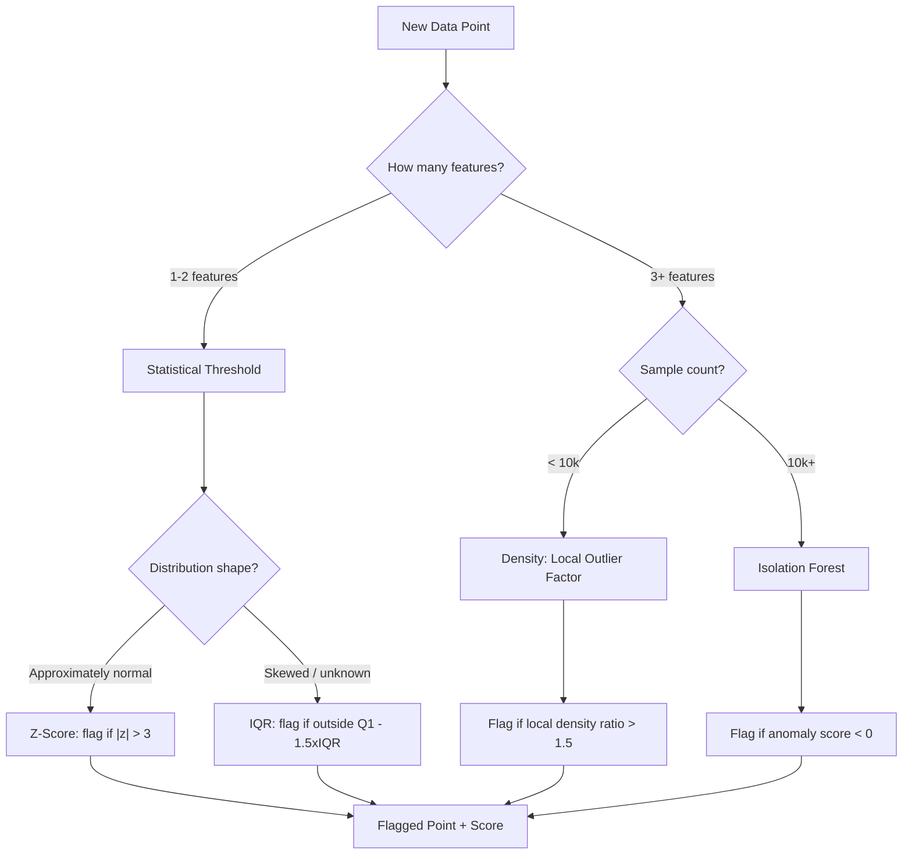

# Anomaly Detection

## Learning Objectives

- Implement Z-score, IQR, and Isolation Forest detection methods on account-level data and print flagged results with scores
- Compare statistical threshold, isolation, and density-based anomaly detection by their precision and interpretability tradeoffs
- Tune contamination rate and tree count parameters and document their measurable effect on flagged output
- Deploy an anomaly detector to flag unusual account engagement patterns from GTM pipeline data and route flagged accounts to a webhook

## The Problem

A B2B SaaS company notices their demo request conversion rate doubled overnight. Marketing claims the new campaign. Engineering suspects a botnet discovered the form. Without anomaly detection, this argument gets resolved by whoever has more political capital—not by data.

This is the core problem. A GTM pipeline generates thousands of data points per day across form submissions, enrichment runs, and engagement tracking. Most are normal. A few matter enormously. Staring at dashboards does not scale, and manual thresholds break the moment your traffic mix shifts. You need a mechanism that automatically separates expected behavior from suspicious behavior and tells you *why* a point was flagged.

The challenge is that you rarely have labeled examples of the anomalies you care about. Fraudulent form submissions might be 0.1% of your data. The specific botnet hitting your form this week has a fingerprint you have never seen before. A standard supervised classifier needs hundreds of examples of each class to learn from. You do not have them, and even if you did, tomorrow's anomaly will look different from today's. Anomaly detection inverts the framing: instead of learning what "abnormal" looks like, you learn the distribution of "normal" and flag anything that deviates. This works without labels, adapts to novel anomaly types, and scales to the volume of data a GTM pipeline produces.

## The Concept

An anomaly is a data point that violates the expected distribution of its peers. Detecting one requires defining what "normal" means for a dataset, then measuring how far each point deviates from that definition. Three mechanisms dominate practice, each trading precision for interpretability differently.

**Statistical thresholds** are the simplest. Compute the mean and standard deviation of your data. Flag anything more than N standard deviations away—typically 3, which captures approximately 99.7% of a normal distribution. This is the Z-score method. It is fast, interpretable, and assumes your data follows a normal distribution, which most real-world data does not. The Interquartile Range (IQR) method relaxes the normality assumption: compute the 25th and 75th percentiles, define the acceptable range as 1.5 times the distance between them, and flag anything outside. Both methods operate on single features and produce a score you can explain to a stakeholder: "this account's page views are 4.2 standard deviations above the mean."

**Isolation** takes a fundamentally different approach. Instead of measuring distance from a center, it measures how easy a point is to separate from the rest of the data. An Isolation Forest builds many random decision trees. At each split, it picks a random feature and a random split value. Normal points require many splits to isolate because they resemble their neighbors. Anomalous points get isolated in few splits because they are different. The average path length across all trees becomes the anomaly score—shorter paths mean more anomalous. This handles multivariate data naturally and makes no distributional assumption, which matters when your features include things like "time on site" (bounded at zero, right-skewed) alongside "email opens" (Poisson-like).

**Density-based** methods ask a third question: how isolated is this point relative to its *local* neighbors? Local Outlier Factor computes the ratio of a point's local density to the average local density of its k nearest neighbors. If a point sits in a sparse region while its neighbors occupy dense regions, it gets a high anomaly score. This catches contextual anomalies—points that are unusual relative to their local cluster even if they are not globally extreme. In a GTM context, this is what separates a legitimate enterprise account with naturally high engagement from a mid-market account showing the same numbers.



Not all anomalies are the same shape, and the detection method should match the anomaly type. A **point anomaly** is a single value unusual regardless of context—a form submission with 500 fields filled in 0.1 seconds. A **contextual anomaly** is unusual only given its context—a B2B SaaS account getting 200 page views on a Sunday at 3am when weekday traffic averages 15. A **collective anomaly** is a sequence of points unusual together—a cluster of demo requests from the same IP range within minutes. Statistical methods handle point anomalies. Isolation Forests handle both point and some contextual anomalies in multivariate space. Collective anomalies require sequence modeling or windowed aggregation, which is beyond this lesson's scope but worth knowing exists.

## Build It

We will build all three mechanisms on synthetic account-level data that mimics what a GTM enrichment pipeline produces: page views, form submissions, time on site, and email opens per account. We inject two anomalous accounts. The first, `acct_bot`, has extreme page views with near-zero time on site—a botnet fingerprint. The second, `acct_power`, has values that are individually unremarkable but unusual in combination—high engagement on *every* feature simultaneously, which no single-feature threshold catches.

First, the statistical methods. Z-score and IQR operate on individual features independently. Run this code and observe what they catch and what they miss.

```python
import numpy as np
import pandas as pd

np.random.seed(42)

n_normal = 200
page_views = np.random.normal(50, 15, n_normal).clip(0)
form_submissions = np.random.normal(3, 2, n_normal).clip(0)
time_on_site = np.random.normal(300, 90, n_normal).clip(0)
email_opens = np.random.normal(5, 3, n_normal).clip(0)

page_views = np.append(page_views, [500, 85])
form_submissions = np.append(form_submissions, [0, 8])
time_on_site = np.append(time_on_site, [5, 480])
email_opens = np.append(email_opens, [0, 12])

accounts = [f"acct_{i:04d}" for i in range(n_normal)] + ["acct_bot", "acct_power"]
df = pd.DataFrame({
    "account": accounts,
    "page_views": page_views,
    "form_submissions": form_submissions,
    "time_on_site": time_on_site,
    "email_opens": email_opens
})

feature_cols = ["page_views", "form_submissions", "time_on_site", "email_opens"]

def zscore_flags(series, threshold=3):
    z = (series - series.mean()) / series.std()
    return z.abs() > threshold

def iqr_flags(series, multiplier=1.5):
    q1, q3 = series.quantile(0.25), series.quantile(0.75)
    iqr = q3 - q1
    lower, upper = q1 - multiplier * iqr, q3 + multiplier * iqr
    return (series < lower) | (series > upper)

print("=== Z-Score Flags (threshold=3) ===")
z_any = pd.Series(False, index=df.index)
for col in feature_cols:
    flags = zscore_flags(df[col])
    z_any = z_any | flags
    flagged_accts = df.loc[flags, "account"].tolist()
    print(f"  {col:20s}: {flagged_accts}")

print(f"\n  Any-feature z-score flags: {df.loc[z_any, 'account'].tolist()}")

print("\n=== IQR Flags (