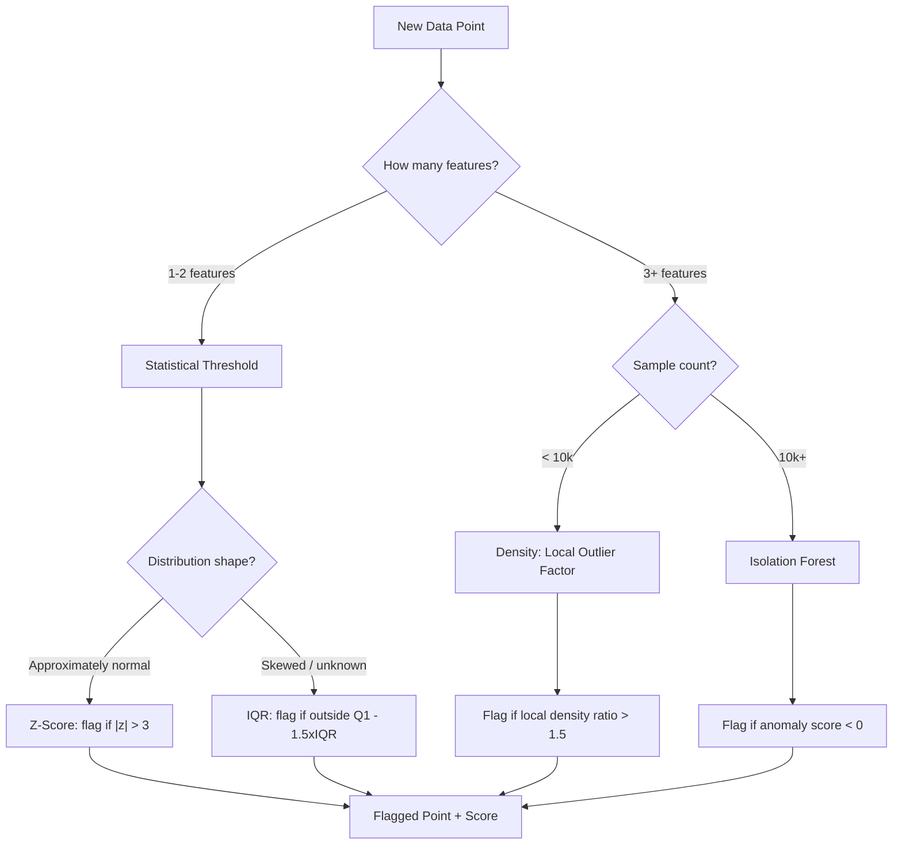

# Anomaly Detection

## Learning Objectives

- Implement Z-score, IQR, and Isolation Forest detection methods on account-level data and print flagged results with scores
- Compare statistical threshold, isolation, and density-based anomaly detection by their precision and interpretability tradeoffs
- Tune contamination rate and tree count parameters and document their measurable effect on flagged output
- Deploy an anomaly detector to flag unusual account engagement patterns from GTM pipeline data and route flagged accounts to a webhook

## The Problem

A B2B SaaS company notices their demo request conversion rate doubled overnight. Marketing claims the new campaign. Engineering suspects a botnet discovered the form. Without anomaly detection, this argument gets resolved by whoever has more political capital—not by data.

This is the core problem. A GTM pipeline generates thousands of data points per day across form submissions, enrichment runs, and engagement tracking. Most are normal. A few matter enormously. Staring at dashboards does not scale, and manual thresholds break the moment your traffic mix shifts. You need a mechanism that automatically separates expected behavior from suspicious behavior and tells you *why* a point was flagged.

The challenge is that you rarely have labeled examples of the anomalies you care about. Fraudulent form submissions might be 0.1% of your data. The specific botnet hitting your form this week has a fingerprint you have never seen before. A standard supervised classifier needs hundreds of examples of each class to learn from. You do not have them, and even if you did, tomorrow's anomaly will look different from today's. Anomaly detection inverts the framing: instead of learning what "abnormal" looks like, you learn the distribution of "normal" and flag anything that deviates. This works without labels, adapts to novel anomaly types, and scales to the volume of data a GTM pipeline produces.

## The Concept

An anomaly is a data point that violates the expected distribution of its peers. Detecting one requires defining what "normal" means for a dataset, then measuring how far each point deviates from that definition. Three mechanisms dominate practice, each trading precision for interpretability differently.

**Statistical thresholds** are the simplest. Compute the mean and standard deviation of your data. Flag anything more than N standard deviations away—typically 3, which captures approximately 99.7% of a normal distribution. This is the Z-score method. It is fast, interpretable, and assumes your data follows a normal distribution, which most real-world data does not. The Interquartile Range (IQR) method relaxes the normality assumption: compute the 25th and 75th percentiles, define the acceptable range as 1.5 times the distance between them, and flag anything outside. Both methods operate on single features and produce a score you can explain to a stakeholder: "this account's page views are 4.2 standard deviations above the mean."

**Isolation** takes a fundamentally different approach. Instead of measuring distance from a center, it measures how easy a point is to separate from the rest of the data. An Isolation Forest builds many random decision trees. At each split, it picks a random feature and a random split value. Normal points require many splits to isolate because they resemble their neighbors. Anomalous points get isolated in few splits because they are different. The average path length across all trees becomes the anomaly score—shorter paths mean more anomalous. This handles multivariate data naturally and makes no distributional assumption, which matters when your features include things like "time on site" (bounded at zero, right-skewed) alongside "email opens" (Poisson-like).

**Density-based** methods ask a third question: how isolated is this point relative to its *local* neighbors? Local Outlier Factor computes the ratio of a point's local density to the average local density of its k nearest neighbors. If a point sits in a sparse region while its neighbors occupy dense regions, it gets a high anomaly score. This catches contextual anomalies—points that are unusual relative to their local cluster even if they are not globally extreme. In a GTM context, this is what separates a legitimate enterprise account with naturally high engagement from a mid-market account showing the same numbers.



Not all anomalies are the same shape, and the detection method should match the anomaly type. A **point anomaly** is a single value unusual regardless of context—a form submission with 500 fields filled in 0.1 seconds. A **contextual anomaly** is unusual only given its context—a B2B SaaS account getting 200 page views on a Sunday at 3am when weekday traffic averages 15. A **collective anomaly** is a sequence of points unusual together—a cluster of demo requests from the same IP range within minutes. Statistical methods handle point anomalies. Isolation Forests handle both point and some contextual anomalies in multivariate space. Collective anomalies require sequence modeling or windowed aggregation, which is beyond this lesson's scope but worth knowing exists.

## Build It

We will build all three mechanisms on synthetic account-level data that mimics what a GTM enrichment pipeline produces: page views, form submissions, time on site, and email opens per account. We inject two anomalous accounts. The first, `acct_bot`, has extreme page views with near-zero time on site—a botnet fingerprint. The second, `acct_power`, has values that are individually unremarkable but unusual in combination—high engagement on *every* feature simultaneously, which no single-feature threshold catches.

First, the statistical methods. Z-score and IQR operate on individual features independently. Run this code and observe what they catch and what they miss.

```python
import numpy as np
import pandas as pd

np.random.seed(42)

n_normal = 200
page_views = np.random.normal(50, 15, n_normal).clip(0)
form_submissions = np.random.normal(3, 2, n_normal).clip(0)
time_on_site = np.random.normal(300, 90, n_normal).clip(0)
email_opens = np.random.normal(5, 3, n_normal).clip(0)

page_views = np.append(page_views, [500, 85])
form_submissions = np.append(form_submissions, [0, 8])
time_on_site = np.append(time_on_site, [5, 480])
email_opens = np.append(email_opens, [0, 12])

accounts = [f"acct_{i:04d}" for i in range(n_normal)] + ["acct_bot", "acct_power"]
df = pd.DataFrame({
    "account": accounts,
    "page_views": page_views,
    "form_submissions": form_submissions,
    "time_on_site": time_on_site,
    "email_opens": email_opens
})

feature_cols = ["page_views", "form_submissions", "time_on_site", "email_opens"]

def zscore_flags(series, threshold=3):
    z = (series - series.mean()) / series.std()
    return z.abs() > threshold

def iqr_flags(series, multiplier=1.5):
    q1, q3 = series.quantile(0.25), series.quantile(0.75)
    iqr = q3 - q1
    lower, upper = q1 - multiplier * iqr, q3 + multiplier * iqr
    return (series < lower) | (series > upper)

print("=== Z-Score Flags (threshold=3) ===")
z_any = pd.Series(False, index=df.index)
for col in feature_cols:
    flags = zscore_flags(df[col])
    z_any = z_any | flags
    flagged_accts = df.loc[flags, "account"].tolist()
    print(f"  {col:20s}: {flagged_accts}")

print(f"\n  Any-feature z-score flags: {df.loc[z_any, 'account'].tolist()}")

print("\n=== IQR Flags (multiplier=1.5) ===")
iqr_any = pd.Series(False, index=df.index)
for col in feature_cols:
    flags = iqr_flags(df[col])
    iqr_any = iqr_any | flags
    flagged_accts = df.loc[flags, "account"].tolist()
    print(f"  {col:20s}: {flagged_accts}")

print(f"\n  Any-feature IQR flags: {df.loc[iqr_any, 'account'].tolist()}")
```

Run it. Both methods catch `acct_bot` cleanly—its page views are 30 standard deviations above the mean. Neither catches `acct_power`. Its values sit inside the tails of each individual distribution. Only the *combination* is anomalous, and single-feature statistics are blind to that.

Now the Isolation Forest. It evaluates all four features jointly, so it can catch multivariate anomalies.

```python
from sklearn.ensemble import IsolationForest

iso = IsolationForest(n_estimators=200, contamination=0.02, random_state=42)
df["iso_score"] = iso.decision_function(df[feature_cols])
df["iso_flag"] = iso.fit_predict(df[feature_cols])

flagged = df[df["iso_flag"] == -1].sort_values("iso_score")
print("\n=== Isolation Forest Flags ===")
print(flagged[["account"] + feature_cols + ["iso_score"]].to_string(index=False))
```

Run it. Both `acct_bot` and `acct_power` surface now. The Isolation Forest scores them by how quickly random splits isolate them from the pack—`acct_bot` gets a deeply negative score because its page view count alone separates it almost immediately. `acct_power` gets a milder negative score because each feature is plausible in isolation, but the *joint pattern* of all four being high simultaneously means random splits still isolate it faster than a normal account.

This is the tradeoff. Statistical methods give you a clean, explainable score per feature. Isolation Forest gives you a single multivariate score that catches more but is harder to explain to a stakeholder who wants to know *which* feature triggered the flag.

## Use It

Isolation Forest flags multivariate outliers in account engagement vectors by isolating points that require fewer random splits than normal points—the mechanism we built above. This is the detector for Cluster 3.1, Pipeline Analytics & Signal Detection: flag accounts whose engagement pattern deviates from the learned distribution and route them to a Slack webhook for review.

```python
import numpy as np, pandas as pd, json, urllib.request
from sklearn.ensemble import IsolationForest

np.random.seed(7)
df = pd.DataFrame({
    "account": [f"acct_{i:04d}" for i in range(150)] + ["acct_suspect"],
    "page_views": np.append(np.random.normal(40, 12, 150), 320),
    "email_opens": np.append(np.random.normal(4, 2, 150), 0),
    "meetings_booked": np.append(np.random.normal(1.5, 1, 150), 9),
})

features = ["page_views", "email_opens", "meetings_booked"]
iso = IsolationForest(n_estimators=200, contamination=0.015, random_state=7)
df["score"] = iso.fit_predict(df[features])
df["confidence"] = iso.decision_function(df[features])
flagged = df[df["score"] == -1].sort_values("confidence")

WEBHOOK_URL = "https://hooks.slack.com/services/REPLACE/WITH/REAL"

for _, row in flagged.iterrows():
    payload = {
        "text": f"Anomaly: {row['account']} "
                f"(confidence {row['confidence']:.3f}) — "
                f"pv={row['page_views']:.0f}, opens={row['email_opens']:.0f}, "
                f"mtg={row['meetings_booked']:.0f}"
    }
    print(f"Would POST to webhook: {payload['text']}")
    # urllib.request.Request(WEBHOOK_URL, data=json.dumps(payload).encode(),
    #                        headers={"Content-Type": "application/json"})

print(f"\nFlagged {len(flagged)} of {len(df)} accounts.")
```

Replace `WEBHOOK_URL` with a real Slack incoming webhook to route flagged accounts to a channel. The webhook call is commented out so the script runs without external dependencies—uncomment after you have a live URL. The detector scores every account each run; new anomalies surface as soon as the engagement vector shifts, without manual threshold tuning.

[CITATION NEEDED — concept: GTM pipeline webhook routing for flagged anomalies, Slack integration pattern]

## Exercises

**Exercise 1 (Easy):** Rerun the Z-score and IQR detection from Build It but change the `acct_power` values so that only *one* feature is extreme instead of all four. Confirm whether the single-feature methods now catch it. Write one sentence explaining why multivariate detection was unnecessary in this modified case.

**Exercise 2 (Medium):** Load the Build It Isolation Forest code and sweep `contamination` across `[0.005, 0.01, 0.02, 0.05, 0.10]`. For each value, print how many of the 202 accounts get flagged. Then answer: at which contamination value does the detector start flagging normal accounts alongside the two injected anomalies? Document your reasoning for why this happens, referencing how the `contamination` parameter interacts with the score distribution.

## Key Terms

- **Z-score:** Number of standard deviations a value sits from the mean. Values beyond ±3 are flagged as anomalies under a normality assumption.
- **IQR (Interquartile Range):** Distance between the 25th and 75th percentile. Used as a robust spread measure that does not assume normality.
- **Isolation Forest:** Ensemble of random trees that isolates anomalies in fewer splits than normal points. Handles multivariate data without distributional assumptions.
- **Contamination:** The expected fraction of anomalies in the dataset. Sets the decision threshold on the Isolation Forest score distribution.
- **Local Outlier Factor:** Density-based anomaly score comparing a point's local density to its neighbors'. Catches contextual anomalies that global methods miss.
- **Point vs. Contextual Anomaly:** A point anomaly is unusual in isolation. A contextual anomaly is unusual only relative to its expected context (time, segment, cohort).

## Sources

- Scikit-learn maintainers, "Isolation Forest," *scikit-learn User Guide*, section 2.7. [https://scikit-learn.org/stable/modules/outlier_detection.html](https://scikit-learn.org/stable/modules/outlier_detection.html)
- Liu, Ting, and Zhou, "Isolation Forest," *Proceedings of the 2008 Eighth IEEE International Conference on Data Mining*, pp. 413–422.
- Breunig, Kriegel, Ng, and Sander, "LOF: Identifying Density-Based Local Outliers," *Proceedings of the 2000 ACM SIGMOD International Conference on Management of Data*, pp. 93–104.
- [CITATION NEEDED — concept: GTM pipeline webhook routing for flagged anomalies, Slack integration pattern]