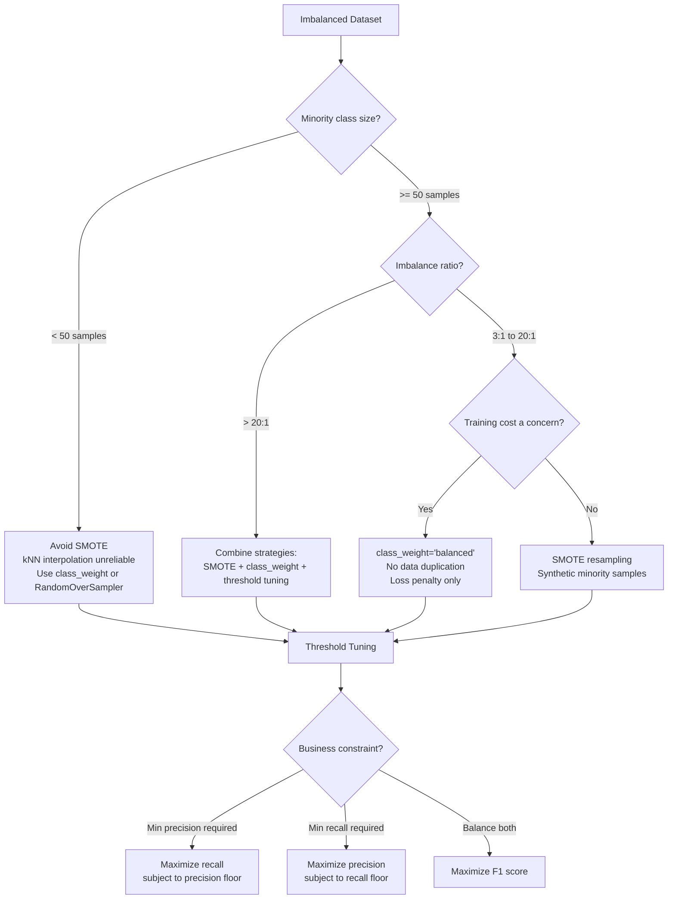

# Handling Imbalanced Data

## Learning Objectives

- Explain why accuracy fails as a metric when class distributions are skewed, and compute the specific accuracy a degenerate majority-class predictor achieves on a given dataset.
- Implement SMOTE resampling within a scikit-learn pipeline using `imbalanced-learn`, and describe how synthetic minority samples are interpolated from nearest-neighbor line segments.
- Configure `class_weight` parameters to penalize minority-class misclassification during loss optimization, and compare this mechanism against data-level resampling.
- Evaluate imbalanced classifiers using precision, recall, F1, and precision-recall AUC instead of raw accuracy.
- Tune decision thresholds against a business constraint (e.g., minimum acceptable precision) and justify the selection with tradeoff analysis.

## The Problem

You built a lead-scoring model. It achieves 96% accuracy on held-out CRM data. You deploy it. Three weeks later, the SDR team reports that the model has not surfaced a single high-intent account — every prediction came back negative. You inspect the output and find the model predicts "no" on every single lead. The 96% accuracy was real. It was also useless.

This is not a bug. If 96% of your historical leads did not convert, then predicting "no conversion" for every lead is the mathematically optimal strategy for minimizing total error. The model did exactly what you asked it to do — you just asked the wrong question. Accuracy treats every correct prediction as equally valuable, so correctly labeling the 96% majority swamps any signal from the 4% minority that actually matters to the business.

The problem compounds as the minority class gets rarer. Disease diagnosis at 1% positive rate. Network intrusion at 0.01% attacks. Manufacturing defects at 0.5%. Closed-won deals at 2–5% of pipeline records. The more consequential the event, the rarer it tends to be — which means the models that matter most are the ones most vulnerable to this failure mode. We need training strategies, evaluation metrics, and deployment practices that force the model to pay attention to the rare class instead of ignoring it.

## The Concept

### Why Imbalance Breaks Models

Most classification models optimize a loss function that sums or averages error across all training samples. Logistic regression minimizes log-loss. Gradient-boosted trees minimize a similar objective. When 97% of samples belong to the majority class, 97% of the gradient signal comes from those samples. The model learns a decision boundary that is optimal for the majority and indifferent to the minority — not because the algorithm is broken, but because the loss landscape is dominated by one class.

Consider a dataset with 1000 samples: 970 negative, 30 positive. A model that always predicts negative achieves 97% accuracy. It catches zero positives. The log-loss for the majority class is near zero (correct predictions contribute minimal loss), while the loss for each misclassified positive sample is large but稀 diluted across only 30 examples. The gradient nudges the model toward predicting negative everywhere because that is where the bulk of the loss reduction lives.

### Three Correction Strategies

There are exactly three places in the ML pipeline where you can intervene. They are not mutually exclusive — production systems often combine all three.

**Resample** modifies the training data before the model sees it. You oversample the minority class (duplicate existing samples or synthesize new ones) or undersample the majority class (remove samples). The most common oversampling technique is SMOTE, which does not duplicate — it interpolates. For each minority sample, SMOTE finds its k nearest neighbors (typically k=5) within the minority class, picks one at random, and creates a new synthetic sample somewhere along the line segment connecting the two. The new sample has feature values that are a weighted average of the original and its neighbor. This creates novel, plausible data points rather than exact copies, which helps the model learn a smoother decision boundary instead of memorizing specific examples.

**Reweight** modifies the loss function itself. Instead of changing the data, you change how much each misclassification costs. Setting `class_weight='balanced'` in scikit-learn assigns a weight inversely proportional to class frequency: the minority class receives a penalty multiplier of `n_samples / (n_classes * n_samples_per_class)`. On a 970/30 split, each minority misclassification is penalized roughly 32x more than a majority misclassification. The model still sees the original data distribution, but the optimization objective changes so that minority errors dominate the gradient.

**Rethreshold** modifies the decision boundary at prediction time. By default, most classifiers label a sample as positive when the predicted probability exceeds 0.5. This threshold is a convention, not a law. On imbalanced data, the probability distribution shifts toward the majority class — positive predictions rarely reach 0.5 even when the model has learned useful signal. Lowering the threshold to 0.3 or 0.15 can recover minority-class predictions that would otherwise be silently discarded.



### When SMOTE Breaks Down

SMOTE relies on k-nearest-neighbors within the minority class. If you have fewer than k+1 minority samples, the algorithm cannot find enough neighbors to interpolate meaningfully, and the synthetic samples collapse toward the same few points. With fewer than ~50 minority samples, the interpolation produces low-variance clusters that do not represent the true minority distribution. In those cases, random oversampling (plain duplication) or class weighting is more reliable because they do not fabricate geometric assumptions from sparse data.

### Why Thresholds Are Not 0.5

The 0.5 threshold comes from the symmetric assumption: if the model outputs probability p, and the two classes are equally likely, then p > 0.5 is the Bayes-optimal decision. Under class imbalance, the prior probability of the minority class is much lower than 0.5, so the Bayes-optimal threshold shifts accordingly. More practically, the business cost of false negatives (missed high-intent accounts) is rarely equal to the cost of false positives (wasted SDR time on low-intent accounts). The threshold should reflect that cost asymmetry, not a mathematical default.

## Build It

The following script generates a synthetic 97/3 imbalanced dataset, trains two logistic regression models — one naive, one with balanced class weights — and evaluates both using metrics that actually surface the minority-class problem.

```python
import numpy as np
from sklearn.datasets import make_classification
from sklearn.model_selection import train_test_split
from sklearn.preprocessing import StandardScaler
from sklearn.linear_model import LogisticRegression
from sklearn.metrics import (
    classification_report,
    confusion_matrix,
    average_precision_score,
    precision_recall_curve,
)

X, y = make_classification(
    n_samples=5000,
    n_features=20,
    n_informative=10,
    n_redundant=5,
    n_classes=2,
    weights=[0.97, 0.03],
    flip_y=0.01,
    random_state=42,
)

X_train, X_test, y_train, y_test = train_test_split(
    X, y, test_size=0.3, random_state=42, stratify=y
)

train_dist = dict(zip(*np.unique(y_train, return_counts=True)))
test_dist = dict(zip(*np.unique(y_test, return_counts=True)))
print(f"Train distribution: {train_dist}")
print(f"Test distribution:  {test_dist}")
print(f"Imbalance ratio:    {train_dist[0]}:{train_dist[1]} ({train_dist[0]/train_dist[1]:.1f}:1)")

scaler = StandardScaler()
X_train_s = scaler.fit_transform(X_train)
X_test_s = scaler.transform(X_test)

naive = LogisticRegression(max_iter=1000, random_state=42)
naive.fit(X_train_s, y_train)
naive_pred = naive.predict(X_test_s)
naive_proba = naive.predict_proba(X_test_s)[:, 1]
naive_prauc = average_precision_score(y_test, naive_proba)

cm_n = confusion_matrix(y_test, naive_pred)
print("\n" + "=" * 60)
print("NAIVE MODEL (no class weighting)")
print("=" * 60)
print(classification_report(y_test, naive_pred, digits=4))
print(f"PR-AUC: {naive_prauc:.4f}")
print(f"\nConfusion Matrix:")
print(f"  TN: {cm_n[0,0]:4d}  FP: {cm_n[0,1]:4d}")
print(f"  FN: {cm_n[1,0]:4d}  TP: {cm_n[1,1]:4d}")
print(f"  Minority recall: {cm_n[1,1] / (cm_n[1,0] + cm_n[1,1]):.4f}")

balanced = LogisticRegression(max_iter=1000, random_state=42, class_weight='balanced')
balanced.fit(X_train_s, y_train)
balanced_pred = balanced.predict(X_test_s)
balanced_proba = balanced.predict_proba(X_test_s)[:, 1]
balanced_prauc = average_precision_score(y_test, balanced_proba)

cm_b = confusion_matrix(y_test, balanced_pred)
print("\n" + "=" * 60)
print("BALANCED MODEL (class_weight='balanced')")
print("=" * 60)
print(classification_report(y_test, balanced_pred, digits=4))
print(f"PR-AUC: {balanced_prauc:.4f}")
print(f"\nConfusion Matrix:")
print(f"  TN: {cm_b[0,0]:4d}  FP: {cm_b[0,1]:4d}")
print(f"  FN: {cm_b[1,0]:4d}  TP: {cm_b[1,1]:4d}")
print(f"  Minority recall: {cm_b[1,1] / (cm_b[1,0] + cm_b[1,1]):.4f}")

print("\n" + "=" * 60)
print("THRESHOLD SWEEP ON BALANCED MODEL")
print("=" * 60)

precisions, recalls, thresholds = precision_recall_curve(y_test, balanced_proba)

print(f"\n{'Threshold':>10} {'Precision':>10} {'Recall':>10} {'F1':>10}")
print("-" * 44)
best_f1 = 0
best_t = 0
for p, r, t in zip(precisions[:-1], recalls[:-1], thresholds):
    f1 = 2 * p * r / (p + r) if (p + r) > 0 else 0
    if t >= 0.05 and t <= 0.95 and (int(t * 100) % 10 == 0):
        print(f"{t:>10.2f} {p:>10.4f} {r:>10.4f} {f1:>10.4f}")
    if f1 > best_f1:
        best_f1 = f1
        best_t = t

print(f"\nBest F1 threshold: {best_t:.4f} (F1={best_f1:.4f})")

best_idx = np.argmin(np.abs(thresholds - best_t))
prec_at_best = precisions[best_idx]
rec_at_best = recalls[best_idx]
print(f"  Precision at best threshold: {prec_at_best:.4f}")
print(f"  Recall at best threshold:    {rec_at_best:.4f}")
print(f"\nNaive accuracy:     {np.mean(naive_pred == y_test):.4f}")
print(f"Balanced accuracy:  {np.mean(balanced_pred == y_test):.4f}")
print(f"Naive minority F1:  {2 * cm_n[1,1] / (2 * cm_n[1,1] + cm_n[0,1] + cm_n[1,0]):.4f}")
print(f"Best-tuned F1:      {best_f1:.4f}")
```

Run this and observe the gap between the naive model's accuracy (high) and its minority recall (near zero). The balanced model trades majority-class accuracy for minority-class sensitivity. The threshold sweep shows how sliding the decision boundary recovers additional minority predictions at the cost of more false positives. Every metric in the output is the one that matters for an imbalanced problem — accuracy is printed at the bottom only to confirm how misleading it is.

## Use It

Lead scoring on CRM pipeline data is the textbook minority-class problem. If your historical win rate is 3%, then 97% of your records are the majority class ("not closed-won"). A model trained naively on this data will predict "won't convert" for nearly every lead — just like the naive model in the script above. The SDR team sees a 96% accurate model that has never told them to pick up the phone.

The three correction strategies map directly onto CRM workflow decisions. Resampling with SMOTE synthesizes new "lookalike" closed-won records so the model sees a balanced training set — useful when you have enough historical wins (say, 200+) to make interpolation meaningful. Class weighting penalizes the model more heavily for missing a real opportunity, which is the right call when closed-won samples are too sparse for SMOTE's k-nearest-neighbor interpolation. Threshold tuning is where the business constraint enters: the SDR team has finite capacity, so you cannot lower the threshold to catch every possible deal — you need a precision floor that prevents flooding the pipeline with false positives.

The library that packages all of this is `imbalanced-learn` (imported as `imblearn`). It implements SMOTE, ADASYN, RandomOverSampler, RandomUnderSampler, Tomek links, and EasyEnsemble, all behind a `fit_resample(X, y)` API that integrates with scikit-learn pipelines. The mechanism matters more than the import name: SMOTE's `fit_resample` call does not return a model — it returns resampled X and y arrays that you pass to your classifier.

```python
from imblearn.over_sampling import SMOTE
from imblearn.pipeline import Pipeline
from sklearn.linear_model import LogisticRegression
from sklearn.preprocessing import StandardScaler
from sklearn.model_selection import train_test_split, cross_val_score
from sklearn.datasets import make_classification
from sklearn.metrics import f1_score, classification_report
import numpy as np

X, y = make_classification(
    n_samples=3000,
    n_features=15,
    n_informative=8,
    n_classes=2,
    weights=[0.95, 0.05],
    flip_y=0.02,
    random_state=7,
)

X_train, X_test, y_train, y_test = train_test_split(
    X, y, test_size=0.3, random_state=7, stratify=y
)

naive_pipe = Pipeline([
    ('scaler', StandardScaler()),
    ('clf', LogisticRegression(max_iter=1000, random_state=7)),
])

smote_pipe = Pipeline([
    ('smote', SMOTE(random_state=7, k_neighbors=5)),
    ('scaler', StandardScaler()),
    ('clf', LogisticRegression(max_iter=1000, random_state=7)),
])

balanced_pipe = Pipeline([
    ('scaler', StandardScaler()),
    ('clf', LogisticRegression(max_iter=1000, random_state=7, class_weight='balanced')),
])

pipes = {'Naive': naive_pipe, 'SMOTE': smote_pipe, 'Balanced': balanced_pipe}

print(f"{'Model':<12} {'F1 Score':>10} {'Minority Recall':>18}")
print("-" * 42)
for name, pipe in pipes.items():
    pipe.fit(X_train, y_train)
    preds = pipe.predict(X_test)
    f1 = f1_score(y_test, preds)
    cm = confusion_matrix(y_test, preds)
    recall = cm[1, 1] / (cm[1, 0] + cm[1, 1])
    print(f"{name:<12} {f1:>10.4f} {recall:>18.4f}")

smote = SMOTE(random_state=7, k_neighbors=5)
X_res, y_res = smote.fit_resample(X_train, y_train)
print(f"\nBefore SMOTE: {dict(zip(*np.unique(y_train, return_counts=True)))}")
print(f"After SMOTE:  {dict(zip(*np.unique(y_res, return_counts=True)))}")

best_pipe = smote_pipe
best_pipe.fit(X_train, y_train)
proba = best_pipe.predict_proba(X_test)[:, 1]

print(f"\n{'Threshold':>10} {'Precision':>10} {'Recall':>10} {'F1':>10}")
print("-" * 44)

for t in np.arange(0.1, 0.9, 0.1):
    preds_t = (proba >= t).astype(int)
    cm = confusion_matrix(y_test, preds_t)
    tp = cm[1, 1]
    fp = cm[0, 1]
    fn = cm[1, 0]
    prec = tp / (tp + fp) if (tp + fp) > 0 else 0
    rec = tp / (tp + fn) if (tp + fn) > 0 else 0
    f1 = 2 * prec * rec / (prec + rec) if (prec + rec) > 0 else 0
    print(f"{t:>10.2f} {prec:>10.4f} {rec:>10.4f} {f1:>10.4f}")
```

The output shows three things: how SMOTE changes the class distribution before training, how the three strategies compare on F1 and minority recall, and how threshold selection creates a precision-recall tradeoff curve. In a CRM context, the "minority recall" column is the percentage of actual closed-won deals your model surfaces — that is the number the revenue team cares about. The threshold table is the artifact you bring to the sales operations meeting: "At threshold 0.3, we surface 82% of real opportunities, but 40% of surfaced leads are false positives. At 0.5, we surface 55% of opportunities at 70% precision. Which tradeoff matches SDR capacity?"

## Ship It

When your lead-score model ships to the CRM — whether that is Salesforce, HubSpot, or a custom scoring endpoint consumed by an n8n or Make automation — the accuracy metric is irrelevant to the business. What matters is pipeline generated from correctly identified high-intent accounts. The model's predicted probability becomes a field on the lead record (often as a JSON object: `{"lead_score": 0.34, "model_version": "v2.1", "threshold": 0.3}`), and the decision to route that lead to an SDR is governed by the threshold you selected.

Threshold selection is not a data science decision — it is a business decision made with data science input. If the SDR team has capacity for 100 outreach sequences per week, and the model surfaces 500 leads above threshold 0.15, the threshold is too low. If it surfaces 20 leads above 0.5, the team is underutilized. The constraint is operational capacity and cost per false positive, not an F1 score. [CITATION NEEDED — concept: typical SDR weekly outreach capacity and cost per false-positive contact in outbound]

Two operational practices matter at deployment. First, log the chosen threshold alongside model version and feature schema. When the business asks "why did we miss this deal?", the answer is "the model assigned probability 0.22 and the threshold was 0.30" — not "the model got it wrong." Second, monitor class distribution drift. If your training win rate was 3% and a product change or market shift pushes the live win rate to 7%, your threshold and class weights are calibrated for the wrong distribution. Set up a weekly check on predicted-probability histograms and actual outcome rates to detect when retraining is necessary. In automated CRM pipelines (n8n, Make), this drift check can run as a scheduled job that compares the rolling conversion rate against the training baseline and flags when the gap exceeds a configurable tolerance.

The shipped system should expose three numbers to stakeholders: the predicted probability (raw model output), the threshold (business-configured cutoff), and the expected precision at that threshold (from the validation PR curve). These three numbers let a sales operations lead reason about the model without understanding gradient descent. The model produces a score; the threshold converts it to a decision; the precision estimate tells the team what fraction of routed leads will likely convert.

## Exercises

**Easy:** Load a 95/5 imbalanced dataset using `make_classification`, print the class distribution, apply `RandomOverSampler` from `imbalanced-learn`, and print the distribution again. Confirm that oversampling produces exact class balance without synthesizing new feature values.

**Medium:** Build three scikit-learn pipelines — (1) StandardScaler → LogisticRegression, (2) SMOTE → StandardScaler → LogisticRegression, (3) StandardScaler → LogisticRegression(class_weight='balanced') — on a 97/3 dataset. Train all three, print F1 and PR-AUC for each, and write two sentences explaining which strategy wins and why.

**Hard:** Take the balanced model from the Build It script. Sweep thresholds from 0.05 to 0.95 in steps of 0.05. For each threshold, print precision, recall, and F1. Then impose a business constraint: minimum precision of 0.60. Identify the threshold that maximizes recall while satisfying the constraint. Print the chosen threshold and the resulting precision, recall, and F1. If no threshold satisfies the constraint, print "Constraint not satisfiable" and explain what that means for the model's production readiness.

## Key Terms

- **Class Imbalance:** A training-data condition where one class (the majority) significantly outnumbers the other (the minority), causing standard loss functions to bias toward the majority.
- **Minority Class:** The rarer class in an imbalanced dataset — typically the class the model exists to detect (fraud, churn, closed-won deal, disease).
- **SMOTE (Synthetic Minority Over-sampling Technique):** An oversampling algorithm that generates synthetic minority-class samples by interpolating between a minority sample and its k nearest minority neighbors.
- **Class Weight:** A multiplicative penalty applied to the loss function for misclassifying a given class. Setting `class_weight='balanced'` assigns weights inversely proportional to class frequency.
- **Decision Threshold:** The probability cutoff above which a sample is predicted as positive. Defaults to 0.5 but should be tuned to reflect class priors and business costs.
- **Precision-Recall AUC (PR-AUC):** The area under the precision-recall curve. Unlike ROC-AUC, PR-AUC is sensitive to minority-class performance and is the preferred summary metric for imbalanced classification.
- **F1 Score:** The harmonic mean of precision and recall. Useful when you need a single number that balances both, but it hides the tradeoff — always report precision and recall alongside it.
- **imbalanced-learn (`imblearn`):** A Python library implementing resampling algorithms (SMOTE, ADASYN, Tomek links, EasyEnsemble, RandomOverSampler, RandomUnderSampler) with a `fit_resample` API compatible with scikit-learn pipelines.
- **Tomek Links:** A data-cleaning technique that identifies pairs of samples (one from each class) that are each other's nearest neighbors. Removing the majority sample from each pair sharpens the decision boundary.
- **Confusion Matrix:** A 2×2 table of true positives, false positives, true negatives, and false negatives. The starting point for computing precision, recall, F1, and understanding where the model fails.

## Sources

- scikit-learn `class_weight` documentation: [https://scikit-learn.org/stable/glossary.html#term-class_weight](https://scikit-learn.org/stable/glossary.html#term-class_weight) — mechanism of balanced class weighting (inverse frequency penalty).
- imbalanced-learn SMOTE API and algorithm description: [https://imbalanced-learn.org/stable/references/generated/imblearn.over_sampling.SMOTE.html](https://imbalanced-learn.org/stable/references/generated/imblearn.over_sampling.SMOTE.html) — `fit_resample` interface and k-nearest-neighbor interpolation.
- Chawla, N. V., Bowyer, K. W., Hall, L. O., & Kegelmeyer, W. P. (2002). "SMOTE: Synthetic Minority Over-sampling Technique." *Journal of Artificial Intelligence Research*, 16, 321–357. — original SMOTE algorithm and kNN interpolation mechanism.
- [CITATION NEEDED — concept: typical SDR weekly outreach capacity and cost per false-positive contact in outbound GTM workflows]
- [CITATION NEEDED — concept: observed closed-won rates in B2B SaaS CRM pipelines (commonly cited as 2–5%, but no specific source verified for this lesson)]