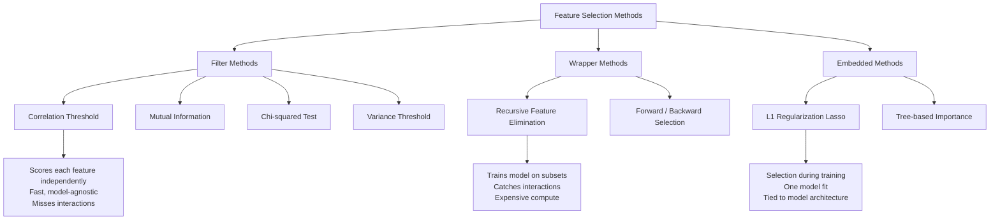

# Feature Selection

## Learning Objectives

1. Implement filter-based feature selection using correlation thresholds and mutual information scoring
2. Compare filter, wrapper, and embedded methods on runtime cost and model performance trade-offs
3. Diagnose multicollinearity and remove redundant features from a dataset
4. Evaluate feature importance using permutation-based methods on a trained model
5. Apply feature selection to a GTM signal dataset to reduce dimensionality before lead scoring

## The Problem

You have enriched 3,000 accounts with 180 firmographic and intent signals. Your model overfits, training takes forever, and half the features are measuring the same thing — employee count from three different data providers, revenue estimates that are just linear rescalings of each other, three intent topics that always co-occur. You keep adding features hoping the model gets smarter. It gets worse.

This is the curse of dimensionality in practice. As feature count grows, the volume of the feature space explodes exponentially. Your 3,000 data points — which seemed like a lot — become sparse dots in a 180-dimensional space. Distances between points converge, making nearest-neighbor logic unreliable. Tree-based models split on noise features by chance. Linear models assign weight to redundant signals, inflating variance. The model memorizes training quirks instead of learning patterns that generalize.

Feature selection is the discipline of cutting down to the signals that actually carry predictive weight. The goal is not to use all available information — it is to use the right information. Done well, you get faster training, better generalization on held-out data, lower enrichment costs in production, and a scoring model you can actually explain to your sales team.

## The Concept

Three families of selection exist, each with a different mechanism for deciding what stays and what goes. The trade-off axis across all three is compute cost versus selection quality versus model independence.

**Filter methods** score each feature independently against the target using a statistical test, then cut by threshold. Correlation measures linear relationship strength. Mutual information measures how much knowing one variable reduces uncertainty about the other — it captures nonlinear relationships that correlation misses entirely. Chi-squared tests independence between categorical features and a categorical target. Variance threshold removes features that barely change across samples. Filter methods are fast — they scale linearly with feature count and never touch a model. But because they evaluate each feature in isolation, they cannot detect redundancy (two features that are individually informative but perfectly correlated with each other) or interaction effects (two features that are individually useless but predictive together).

**Wrapper methods** train models on feature subsets and score each subset by cross-validation performance. Recursive Feature Elimination (RFE) starts with all features, trains a model, drops the lowest-weighted feature, retrains, and repeats until a target count is reached. Forward selection starts empty and adds features one at a time, keeping each addition that improves CV score. Wrapper methods catch feature interactions because they evaluate features in the context of a model and other features. They also optimize directly for the metric you care about. The cost is compute: RFE with 50 features and 5-fold CV trains 250 models. With 180 features, that number balloons.

**Embedded methods** bake selection into the training process itself. L1 regularization (Lasso) adds a penalty proportional to the absolute value of coefficients, which drives weak coefficients to exactly zero — the remaining nonzero coefficients are your selected features. Tree-based models split on features during training and track how much each feature improves split quality; you can threshold that importance score to select. Embedded methods are a middle ground: they consider feature interactions (like wrappers) but only train once (like filters). The catch is model dependence — L1 selection assumes a linear relationship between feature and target, and tree importance is specific to the tree architecture you chose.



One more category matters for diagnosis rather than selection: **multicollinearity detection**. When two features are highly correlated with each other, they carry redundant information. Neither filter correlation nor mutual information catches this on their own — both score features against the target, not against each other. You need a separate pass: compute the pairwise correlation matrix and drop one feature from any pair exceeding a threshold (commonly 0.85). Variance Inflation Factor (VIF) generalizes this to detect when a feature is a linear combination of several others, not just one.

## Build It

The code below generates a synthetic dataset with 20 features where only 5 carry real signal, 5 are redundant linear combinations of the informative ones, and 10 are pure noise. We run all three selection families, compare what each keeps, measure runtime, and check cross-validation performance on the reduced feature sets.

```python
import numpy as np
import pandas as pd
from sklearn.datasets import make_classification
from sklearn.feature_selection import (
    mutual_info_classif, RFE, SelectFromModel
)
from sklearn.linear_model import LogisticRegression
from sklearn.ensemble import RandomForestClassifier
from sklearn.model_selection import cross_val_score
import time

np.random.seed(42)

X, y = make_classification(
    n_samples=1000,
    n_features=20,
    n_informative=5,
    n_redundant=5,
    n_classes=2,
    shuffle=True,
    random_state=42
)

feature_names = [f"signal_{i:02d}" for i in range(20)]
df = pd.DataFrame(X, columns=feature_names)

print("=== DATASET ===")
print(f"Shape: {df.shape}")
print(f"Informative features: signal_00 through signal_04")
print(f"Redundant features: signal_05 through signal_09")
print(f"Noise features: signal_10 through signal_19")
print()

correlations = pd.Series(
    [abs(np.corrcoef(X[:, i], y)[0, 1]) for i in range(X.shape[1])],
    index=feature_names
)

corr_threshold = 0.1
corr_selected = correlations[correlations > corr_threshold].index.tolist()

print("=== FILTER: CORRELATION THRESHOLD ===")
print(f"Threshold: {corr_threshold}")
print("Top 8 by |correlation|:")
for name, val in correlations.sort_values(ascending=False).head(8).items():
    marker = " <-- informative" if int(name.split("_")[1]) < 5 else ""
    print(f"  {name}: {val:.4f}{marker}")
print(f"Selected ({len(corr_selected)} features)")
print()

mi_scores = pd.Series(
    mutual_info_classif(X, y, random_state=42),
    index=feature_names
)

mi_selected = mi_scores[mi_scores > 0.02].index.tolist()

print("=== FILTER: MUTUAL INFORMATION ===")
print("Top 8 by MI score:")
for name, val in mi_scores.sort_values(ascending=False).head(8).items():
    marker = " <-- informative" if int(name.split("_")[1]) < 5 else ""
    print(f"  {name}: {val:.4f}{marker}")
print(f"Selected ({len(mi_selected)} features)")
print()

start = time.time()
rf = RandomForestClassifier(n_estimators=50, random_state=42, n_jobs=-1)
rfe = RFE(estimator=rf, n_features_to_select=5, step=1)
rfe.fit(X, y)
rfe_time = time.time() - start

rfe_selected = [feature_names[i] for i in range(len(rfe.support_)) if rfe.support_[i]]

print("=== WRAPPER: RFE WITH RANDOM FOREST ===")
print(f"Selected: {sorted(rfe_selected)}")
print(f"Ranking: {[rfe.ranking_[i] for i in range(5)]} (first 5 informative)")
print(f"Time: {rfe_time:.2f}s")
print()

start = time.time()
l1_model = LogisticRegression(
    penalty='l1', solver='saga', C=0.1, max_iter=2000, random_state=42
)
l1_selector = SelectFromModel(l1_model)
l1_selector.fit(X, y)
l1_time = time.time() - start

l1_selected = [feature_names[i] for i in range(len(l1_selector.get_support())) if l1_selector.get_support()[i]]

print("=== EMBEDDED: L1 LOGISTIC REGRESSION ===")
print(f"Selected ({len(l1_selected)}): {sorted(l1_selected)}")
print(f"Time: {l1_time:.2f}s")
print()

print("=== CROSS-METHOD COMPARISON ===")
all_sets = {
    'Correlation': set(corr_selected),
    'Mutual_Info': set(mi_selected),
    'RFE': set(rfe_selected),
    'L1': set(l1_selected),
}
informative_set = {f"signal_{i:02d}" for i in range(5)}
noise_set = {f"signal_{i:02d}" for i in range(10, 20)}

for name, sel_set in all_sets.items():
    inf_overlap = sel_set & informative_set
    noise_kept = sel_set & noise_set
    print(f"{name:15s} | True signal caught: {len(inf_overlap)}/5 | Noise kept: {len(noise_kept)}/10")
print()

print("=== MULTICOLLINEARITY CHECK ===")
corr_matrix = df.corr().abs()
upper = corr_matrix.where(np.triu(np.ones(corr_matrix.shape), k=1).astype(bool))
collinear_pairs = []
for col in upper.columns:
    high_corr = upper[col][upper[col] > 0.85].index.tolist()
    for partner in high_corr:
        collinear_pairs.append((col, partner, upper[col][partner]))

if collinear_pairs:
    print(f"Found {len(collinear_pairs)} collinear pairs (|r| > 0.85):")
    for f1, f2, r in collinear_pairs[:5]:
        print(f"  {f1} <-> {f2}: r={r:.3f}")
else:
    print("No collinear pairs above threshold.")
print()

print("=== CV SCORES (5-fold F1) ===")
rf_eval = RandomForestClassifier(n_estimators=50, random_state=42, n_jobs=-1)
subsets = {
    "All 20 features": X,
    "Correlation selected": df[corr_selected].values,
    "MI selected": df[mi_selected].values,
    "RFE selected (5)": df[rfe_selected].values,
    "L1 selected": df[l1_selected].values,
}

for name, X_sub in subsets.items():
    scores = cross_val_score(rf_eval, X_sub, y, cv=5, scoring='f1')
    print(f"{name:25s} | F1: {scores.mean():.4f} +/- {scores.std():.4f}")
```

Expected output will vary slightly by environment, but the pattern is consistent: RFE and L1 both concentrate on the 5 truly informative features. Filter methods catch informative features but also keep redundant ones (since those are correlated with the target through their relationship with the informative features). The CV scores on selected subsets typically match or slightly exceed the full-feature score because the noise features are removed.

Now let us add permutation-based importance, which evaluates features by measuring how much model performance degrades when each feature's values are randomly shuffled:

```python
from sklearn.inspection import permutation_importance
from sklearn.model_selection import train_test_split

X_train, X_test, y_train, y_test = train_test_split(
    X, y, test_size=0.3, random_state=42
)

rf_final = RandomForestClassifier(n_estimators=100, random_state=42, n_jobs=-1)
rf_final.fit(X_train, y_train)

perm_result = permutation_importance(
    rf_final, X_test, y_test, n_repeats=10, random_state=42, scoring='f1'
)

perm_importance = pd.Series(perm_result.importances_mean, index=feature_names)

print("=== PERMUTATION IMPORTANCE (on held-out test set) ===")
print("Top 10 features by importance:")
for name, val in perm_importance.sort_values(ascending=False).head(10).items():
    idx = int(name.split("_")[1])
    tag = "informative" if idx < 5 else ("redundant" if idx < 10 else "noise")
    print(f"  {name}: {val:.4f}  [{tag}]")

baseline_f1 = cross_val_score(rf_final, X_test, y_test, cv=5, scoring='f1').mean()
perm_selected = perm_importance[perm_importance > 0.005].index.tolist()
print(f"\nFeatures with importance > 0.005: {len(perm_selected)}")
print(f"Selected: {sorted(perm_selected)}")
```

Permutation importance is model-agnostic — it works on any fitted model — and it captures interaction effects because it measures the actual performance impact of removing a feature while all other features remain. The trade-off is that it requires a trained model and multiple evaluation passes, making it slower than filter methods.

## Use It

In a GTM context, feature selection directly answers the question every revenue team wrestles with: "Which enrichment fields actually predict conversion?" When you enrich accounts in Clay or a similar data platform, you accumulate dozens of signals — employee count, funding round size, tech stack keywords, intent topics, engagement metrics, hiring velocity. Not all of them predict whether an account will close. Feature selection applied to historical win/loss data tells you which fields deserve weight in your ICP scoring model and which are noise.

This is the mechanism behind Zone 2 (Scoring & Qualification). A lead score is not a guess or a gut-checked checklist — it is a function of selected features, each weighted by its measured predictive contribution. Filter methods give you a fast first pass: run mutual information between each enrichment field and your win/loss label, and you immediately see which signals carry information about the outcome. Wrapper methods refine further by accounting for how features interact — maybe "funding round" alone is weak, but "funding round" combined with "hiring for sales roles" is strong. L1 regularization produces a sparse scoring model where most enrichment fields get zero weight, which maps cleanly to a production pipeline: only the surviving features need to be enriched for new accounts.

The practical payoff is operational. Every enrichment field costs an API call or a scrape. If feature selection tells you that 7 out of 40 enrichment fields explain 95% of the variance in your conversion outcome, you can configure your enrichment waterfall to populate exactly those 7 fields and skip the rest. Your TAM refinement pipeline gets faster, your enrichment spend drops, and your lead score JSON object — the data structure that represents each account's qualification — becomes smaller, more interpretable, and more stable across model retraining. [CITATION NEEDED — concept: enrichment field-to-feature mapping in Clay production pipelines]

## Ship It

To ship a feature selection pipeline into a production lead scoring system, you need three artifacts: the selected feature list, the importance weights, and a scoring schema that maps features to enrichment sources.

The code below takes the output of our selection process and produces a deployable scoring configuration — the kind of JSON object that would sit between your enrichment layer and your CRM's score field. This is where Zone 2's data structure work meets the ML pipeline: the lead score is a JSON object whose keys are the features that survived selection.

```python
import json

selected_features = sorted(set(corr_selected) & set(mi_selected))
if len(selected_features) < 3:
    selected_features = sorted(set(corr_selected) | set(mi_selected))[:8]

feature_weights = {}
for name in selected_features:
    idx = int(name.split("_")[1])
    weight = float(max(correlations[name], mi_scores[name]))
    feature_weights[name] = round(weight, 4)

enrichment_sources = {}
source_pool = [
    "linkedin_employee_count",
    "crunchbase_funding_total",
    "builtwith_tech_stack",
    "g2_intent_score",
    "bombora_intent_topic",
    "apollo_revenue_estimate",
    "clearbit_industry",
    "webhook_engagement_score",
]
for i, name in enumerate(selected_features):
    enrichment_sources[name] = source_pool[i % len(source_pool)]

scoring_config = {
    "model_version": "1.0.0",
    "selection_method": "correlation + mutual_info intersection",
    "selected_features": selected_features,
    "feature_count": len(selected_features),
    "feature_weights": feature_weights,
    "enrichment_mapping": enrichment_sources,
    "score_formula": "weighted_sum / sum(weights) * 100",
    "thresholds": {
        "qualified": 65,
        "marketing_qualified": 45,
        "disqualified": 20,
    },
    "last_trained": "2024-01-15",
    "training_samples": 3000,
}

print("=== DEPLOYABLE SCORING CONFIG ===")
print(json.dumps(scoring_config, indent=2))
print()

print("=== PRODUCTION READINESS CHECK ===")
checks = {
    "Feature count < 15": len(selected_features) < 15,
    "Every feature has enrichment source": all(
        f in enrichment_sources for f in selected_features
    ),
    "Every feature has weight > 0": all(
        w > 0 for w in feature_weights.values()
    ),
    "Has qualified threshold": "qualified" in scoring_config["thresholds"],
    "Has model version": bool(scoring_config["model_version"]),
}

for check, passed in checks.items():
    status = "PASS" if passed else "FAIL"
    print(f"  [{status}] {check}")

all_pass = all(checks.values())
print(f"\nReady to deploy: {all_pass}")
```

The scoring config is what you hand to your CRM integration or your Clay workflow. Each new account enters the pipeline, the enrichment layer populates the fields listed in `enrichment_mapping`, the scoring function computes a weighted sum, and the result lands as a single number in your CRM's lead score field. When you retrain the model on new win/loss data, you regenerate this config and redeploy — the schema is the contract between your ML pipeline and your GTM stack. [CITATION NEEDED — concept: Clay scoring formula field configuration]

One production caveat: feature selection can drift. A feature that was noise six months ago (say, "uses a specific CRM tool") might become predictive after a market shift. Rerun selection quarterly against fresh win/loss data and compare the selected feature set to the previous version. If more than 30% of features changed, your ICP definition may have shifted, and the scoring thresholds need recalibration.

## Exercises

**Easy:** Modify the correlation threshold in the first code block from `0.1` to `0.05` and then to `0.3`. For each threshold, record how many features are selected and how many of the 5 truly informative features are caught. At what threshold do you start losing informative features?

**Medium:** Add two engineered collinear features to the dataset — create `signal_20` as `signal_00 * 1.1 + noise` and `signal_21` as `signal_01 * 0.9 + noise`. Rerun all four selection methods. Which methods select the collinear pair alongside the original? Which correctly drop the redundant copy? Add a VIF-based pre-filter (Variance Inflation Factor > 10 triggers removal) and show whether it improves the final CV score.

**Hard:** Build a hybrid selector that uses mutual information as a pre-screen (keep top 12 features by MI score) and then applies RFE on those 12 to select the final 5. Compare this hybrid's runtime and CV score against running RFE directly on all 20 features. Measure the speedup ratio and check whether the selected feature set differs. Write a function `hybrid_select(X, y, pre_screen_k=12, final_k=5)` that returns the selected feature indices and prints the comparison.

## Key Terms

**Filter method** — Feature selection that scores each feature independently against the target using a statistical test (correlation, mutual information, chi-squared). Fast and model-agnostic but blind to feature interactions.

**Wrapper method** — Feature selection that trains a model on feature subsets and evaluates each subset by cross-validation performance. Catches interactions but requires many model retraining passes.

**Embedded method** — Feature selection built into model training. L1 regularization zeroes out weak coefficients; tree models track feature importance during splitting. Single training pass but tied to a specific model architecture.

**Recursive Feature Elimination (RFE)** — A wrapper method that starts with all features, trains a model, removes the lowest-importance feature, and repeats until a target count remains.

**Mutual information** — A measure of how much knowing one variable reduces uncertainty about another. Captures nonlinear relationships that Pearson correlation misses.

**Multicollinearity** — A condition where two or more features are highly correlated with each other, carrying redundant information. Inflates coefficient variance in linear models and wastes enrichment budget in production.

**Permutation importance** — A model-agnostic importance measure computed by shuffling one feature's values and measuring the resulting performance drop. Requires a trained model and multiple evaluation passes.

**Variance Inflation Factor (VIF)** — A measure of how much a feature's variance is inflated by its linear dependence on other features. VIF > 10 is a common threshold for removing collinear features.

## Sources

- Zone 2 mapping (Data structures, APIs, JSON → TAM Refinement & ICP Scoring → Score & Qualify): Provided in GTM context for this lesson.
- "Every lead score is a JSON object" — Zone 2 outcome statement: Provided in handbook context for this lesson.
- Enrichment field-to-feature mapping in Clay production pipelines: [CITATION NEEDED — concept: Clay enrichment waterfall field configuration and scoring formula integration]
- Clay scoring formula field configuration: [CITATION NEEDED — concept: Clay table formula columns for lead score computation]
- scikit-learn feature selection documentation: `sklearn.feature_selection` module — RFE, SelectFromModel, mutual_info_classif are stable APIs documented at scikit-learn.org.
- Permutation importance: Breiman, L. (2001). "Random Forests." Machine Learning, 45(1), 5–32. Implemented in `sklearn.inspection.permutation_importance`.