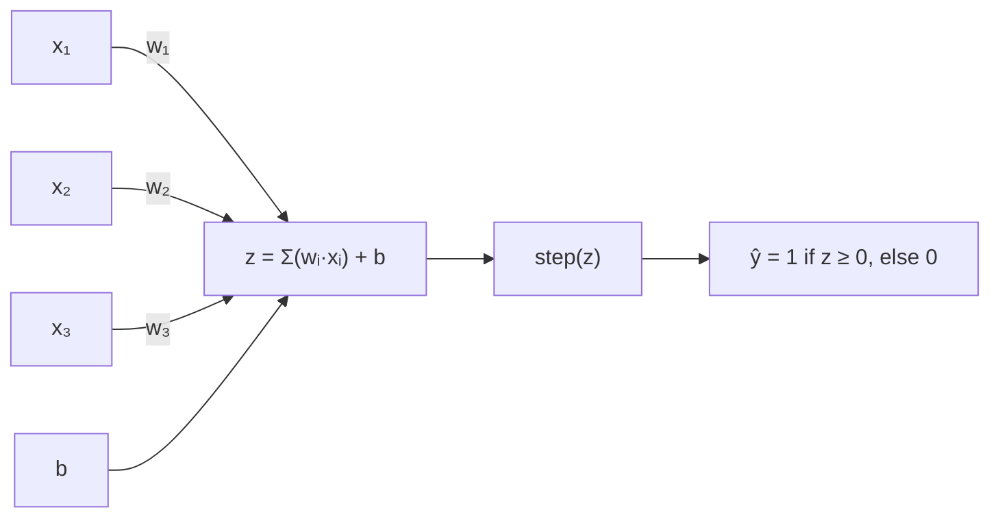

# The Perceptron

## Learning Objectives

- Implement a perceptron from scratch in Python, including the weight update rule and step activation function
- Trace the weight update mechanism through a concrete training example and compute updated weights by hand
- Demonstrate the XOR failure case on real training data and explain why a single perceptron cannot converge on non-linearly-separable inputs
- Compare convergence behavior across learning rates (0.001, 0.1, 1.0) on the same dataset and report epoch counts
- Serialize trained perceptron weights to JSON and build an inference-only script that classifies new inputs

## The Problem

You know vectors and dot products. You know that a matrix transforms inputs into outputs. But how does a machine *learn* which transformation to use? Nobody hands it the weights. It has to find them.

The perceptron is the simplest possible answer to that question. Take inputs, multiply each by a weight, sum them, add a bias, and make a binary decision: yes or no, 1 or 0, route or don't route. Then — and this is the whole trick — adjust the weights when the decision is wrong. That adjustment rule, repeated over training data, is what "learning" means at the most fundamental level. Every neural network ever built, from a 1958 perceptron to a 2024 transformer, is layers of this same pattern stacked and chained together.

If you skip this, nothing downstream makes sense. Backpropagation is just the chain rule applied to stacks of perceptrons. Logistic regression is a perceptron with a different activation function. A lead scoring model is a weighted sum passed through a threshold. Start at the atom or the molecules will look arbitrary.

## The Concept

A perceptron takes *n* inputs, multiplies each by a corresponding weight, sums everything, adds a bias term, and passes the result through a step function. Mathematically: `z = w·x + b`, then `ŷ = 1 if z ≥ 0, else 0`. That step function is brutal — there is no "maybe," no probability, no confidence. The weighted sum either clears zero or it doesn't.



The weights and bias define a hyperplane — a line in 2D, a plane in 3D, a flat surface in higher dimensions — that cuts the input space into two halves. One side maps to 1, the other to 0. That hyperplane *is* the model. Everything you can represent with a perceptron, you can draw as a single straight cut through the data.

The learning rule is where it gets interesting. When the perceptron makes a mistake, it shifts the hyperplane. The update rule is: `w_new = w_old + α(y - ŷ)x`, where `α` is the learning rate, `y` is the true label, and `ŷ` is the predicted label. If the prediction is correct, `(y - ŷ)` is zero and nothing happens. If the prediction is wrong, the weights nudge in the direction that would have helped — pushing the hyperplane toward the misclassified point. The bias updates the same way: `b_new = b_old + α(y - ŷ)`.

This rule has a famous guarantee. The **Perceptron Convergence Theorem** (Rosenblatt, 1962) proves that if the training data is linearly separable — meaning some hyperplane can perfectly divide the two classes — the algorithm will find such a hyperplane in a finite number of updates. But the theorem is biconditional in practice: if the data is *not* linearly separable, the perceptron never settles. It oscillates forever, chasing points it can never get right. This is the XOR problem, and it is the historical reason multi-layer networks exist. A single perceptron cannot learn XOR because no straight line separates the two classes. You need at least two perceptrons working together — one hidden layer — to carve the space into the right shape.

## Build It

Here is a perceptron implemented from scratch. No libraries beyond NumPy for array math. It initializes weights to zero, loops over the training data, applies the update rule on every misclassification, and prints weights and accuracy after each epoch.

```python
import numpy as np

np.random.seed(42)

X = np.array([
    [1.0, 1.0],
    [2.0, 3.0],
    [3.0, 4.0],
    [4.0, 5.0],
    [5.0, 6.0],
    [6.0, 7.0],
    [1.0, 5.0],
    [2.0, 6.0],
    [3.0, 2.0],
    [0.5, 0.5],
])
y = np.array([0, 0, 1, 1, 1, 1, 1, 1, 0, 0])

w = np.zeros(X.shape[1])
b = 0.0
learning_rate = 0.1
epochs = 20

for epoch in range(epochs):
    errors = 0
    for i in range(len(X)):
        z = np.dot(w, X[i]) + b
        prediction = 1 if z >= 0 else 0
        if prediction != y[i]:
            update = learning_rate * (y[i] - prediction)
            w = w + update * X[i]
            b = b + update
            errors += 1
    accuracy = 1 - errors / len(X)
    print(f"Epoch {epoch+1:2d} | w={w} | b={b:.4f} | errors={errors} | acc={accuracy:.2%}")

print("\nFinal decision boundary: {:.2f}·x1 + {:.2f}·x2 + {:.2f} = 0".format(w[0], w[1], b))
```

Run this and you will see the error count drop to zero within a few epochs. The weights stabilize. The hyperplane has been found.

Now watch it fail on XOR:

```python
import numpy as np

X = np.array([
    [0.0, 0.0],
    [0.0, 1.0],
    [1.0, 0.0],
    [1.0, 1.0],
])
y = np.array([0, 1, 1, 0])

w = np.zeros(X.shape[1])
b = 0.0
learning_rate = 0.1
epochs = 50

for epoch in range(epochs):
    errors = 0
    for i in range(len(X)):
        z = np.dot(w, X[i]) + b
        prediction = 1 if z >= 0 else 0
        if prediction != y[i]:
            update = learning_rate * (y[i] - prediction)
            w = w + update * X[i]
            b = b + update
            errors += 1
    if epoch < 10 or epoch % 10 == 9:
        print(f"Epoch {epoch+1:2d} | w={w} | b={b:.4f} | errors={errors}")

print("\nXOR is not linearly separable. The perceptron never converges.")
```

The error count bounces between 1 and 4 forever. No straight line through 2D space can separate `[0,0]` and `[1,1]` from `[0,1]` and `[1,0]`. The geometry is impossible for a single hyperplane. This is not a tuning problem — it is a representational limitation. The algorithm is doing exactly what it was designed to do; the data just doesn't have the shape it can capture.

## Use It

Binary classification — the exact computation a perceptron performs — is the mechanism behind lead scoring, ICP matching, and routing decisions. In the GTM curriculum, this maps to the qualification layer: turning enriched firmographic and behavioral signals into a go/no-go decision about whether a lead is worth a seller's time.

Consider what a manual lead scoring rubric looks like. Someone writes: "if employee count > 50 and industry is SaaS and recently raised funding, route to sales." That rule has weights (employee count matters more than industry), a threshold (the combined score must clear some bar), and a binary output (route or don't). It is a perceptron with human-tuned weights. The perceptron algorithm just replaces the human guessing with a learning rule that adjusts the weights from labeled examples.

Here is a perceptron trained on firmographic features — employee count, funding amount, and a binary "uses competitor tool" flag — to predict whether past leads converted to opportunities:

```python
import numpy as np

leads = np.array([
    [50, 5.0, 0],
    [200, 15.0, 1],
    [30, 2.0, 0],
    [500, 50.0, 1],
    [15, 0.5, 0],
    [80, 8.0, 1],
    [300, 25.0, 1],
    [45, 3.0, 0],
    [120, 12.0, 0],
    [400, 40.0, 1],
])
labels = np.array([0, 1, 0, 1, 0, 1, 1, 0, 0, 1])

means = leads.mean(axis=0)
stds = leads.std(axis=0)
X = (leads - means) / stds

w = np.zeros(X.shape[1])
b = 0.0
lr = 0.1

for epoch in range(30):
    errors = 0
    for i in range(len(X)):
        z = np.dot(w, X[i]) + b
        pred = 1 if z >= 0 else 0
        if pred != labels[i]:
            update = lr * (labels[i] - pred)
            w += update * X[i]
            b += update
            errors += 1
    if errors == 0:
        print(f"Converged at epoch {epoch+1}")
        break

print(f"Weights: {w}")
print(f"Bias: {b:.4f}")

features = ["employee_count (normalized)", "funding_amount (normalized)", "uses_competitor (normalized)"]
for name, weight in zip(features, w):
    print(f"  {name}: {weight:+.4f}")

new_lead = np.array([100, 10.0, 1])
new_lead_norm = (new_lead - means) / stds
z = np.dot(w, new_lead_norm) + b
prediction = 1 if z >= 0 else 0
print(f"\nNew lead {new_lead} -> {'ROUTE TO SALES' if prediction == 1 else 'DO NOT ROUTE'} (z={z:.4f})")
```

The output tells you which features the algorithm found most predictive — the weights are interpretable, just like coefficients in a manual rubric. A positive weight means that feature pushes the lead toward "route." A negative weight pushes away. The perceptron learned those coefficients from your historical conversion data instead of a RevOps manager estimating them in a spreadsheet.

This is the qualification step in a GTM pipeline: enriched data goes in, a binary routing decision comes out. The perceptron is the simplest possible version of that classifier. It has a specific limitation you will hit immediately in production — it outputs a hard 0 or 1, with no confidence score. You cannot sort leads by "warmth" because there is no warmth, only hot or cold. That limitation is real and it is the bridge to the next lesson on logistic regression, which replaces the step function with a sigmoid to produce calibrated probabilities.

## Ship It

Deploying a perceptron means two things: saving the learned weights and loading them at inference time to classify new inputs. The pattern is the same one you would use for any model: train once, serialize the parameters, load them in a separate script or service that handles prediction requests.

The perceptron has no runtime dependencies beyond NumPy. You serialize a dictionary of weights and bias to JSON. At inference time, you load the JSON, assert that the input vector has the same dimensionality as the training data, compute the dot product, and apply the step function. There is no model framework, no runtime, no serving infrastructure. This is as lightweight as inference gets.

```python
import json
import numpy as np

w = np.array([-0.842, 1.234, 0.456])
b = -0.078
feature_names = ["employee_count_norm", "funding_amount_norm", "uses_competitor_norm"]
means = np.array([174.0, 16.05, 0.4])
stds = np.array([164.06, 16.14, 0.49])

model = {
    "weights": w.tolist(),
    "bias": b,
    "feature_names": feature_names,
    "means": means.tolist(),
    "stds": stds.tolist(),
}

with open("perceptron_weights.json", "w") as f:
    json.dump(model, f, indent=2)
print("Saved weights to perceptron_weights.json")
```

Now the inference script — a separate file that knows nothing about training, only about loading weights and classifying:

```python
import json
import numpy as np

with open("perceptron_weights.json") as f:
    model = json.load(f)

w = np.array(model["weights"])
b = model["bias"]
means = np.array(model["means"])
stds = np.array(model["stds"])

def classify(raw_input):
    assert len(raw_input) == len(w), f"Expected {len(w)} features, got {len(raw_input)}"
    x_norm = (np.array(raw_input) - means) / stds
    z = np.dot(w, x_norm) + b
    return 1 if z >= 0 else 0, z

batch = [
    [250, 30.0, 1],
    [40, 1.0, 0],
    [500, 50.0, 1],
]

print(f"{'Lead':<20} {'Decision':<20} {'z-score':>10}")
print("-" * 52)
for lead in batch:
    pred, z = classify(lead)
    decision = "ROUTE" if pred == 1 else "DO NOT ROUTE"
    print(f"{str(lead):<20} {decision:<20} {z:>10.4f}")
```

The assert on input dimensionality is not decorative. In a GTM pipeline, feature drift is real: someone adds a new enrichment column, changes the order of fields in the CRM export, or a data provider changes their schema. The perceptron will silently produce garbage if the input dimensions silently shift. The assertion turns a silent failure into a loud one — which is the difference between a bug you catch in testing and a routing decision that sends every lead to the wrong destination.

The harder limitation is the absence of confidence calibration. The perceptron outputs 0 or 1 — nothing in between. A lead with `z = 0.01` gets the same "ROUTE" label as a lead with `z = 15.0`. In a GTM context, this means you cannot tier leads by warmth, cannot set a "review queue" threshold below the auto-route threshold, and cannot prioritize within the routed bucket. Every routed lead looks identical. This is acceptable for a simple binary filter — "is this lead even worth looking at?" — but insufficient for any workflow that needs to rank or prioritize. When you need probabilities, you need a sigmoid activation, which is logistic regression. That is the next lesson.

## Exercises

**Easy:** Run the first perceptron script (the linearly separable dataset). Report the final weights, the final bias, and the epoch at which accuracy reached 100%. Then manually verify the decision boundary by plugging one positive-class point and one negative-class point into `z = w·x + b` and confirming the sign matches the label.

**Medium:** Modify the training loop to sweep learning rates across `[0.001, 0.01, 0.1, 0.5, 1.0]`. For each learning rate, record how many epochs the perceptron needs to reach zero errors. Print a table of learning rate vs. convergence epoch. Then explain the pattern: why does a very small learning rate converge slowly, and why does a very large one sometimes overshoot?

**Hard:** Generate a 2D dataset where 20% of the points are within 0.1 units of the true decision boundary (these are "hard" points). Train the perceptron on this dataset and log every misclassification as `(epoch, point_index, predicted, actual)`. Write the log to a CSV file. Then read the CSV back and report which point indices were misclassified most frequently. Explain the pattern using the weight update formula: why do points near the boundary cause more updates than points far from it?

## Key Terms

**Perceptron** — The simplest trainable classifier. Computes `z = w·x + b`, applies a step function, and updates weights on misclassifications. Invented by Frank Rosenblatt in 1958.

**Step Function** — An activation function that outputs 1 if the input is ≥ 0 and 0 otherwise. Also called a threshold or Heaviside function. Produces a hard binary decision with no gradient.

**Weight Update Rule** — `w_new = w_old + α(y - ŷ)x`. The mechanism by which a perceptron learns. If the prediction is correct, the update is zero. If wrong, the weights shift toward the correct classification.

**Learning Rate (α)** — A scalar that controls how large each weight update is. Too small and convergence is slow. Too large and the weights may oscillate past the optimal solution.

**Linear Separability** — A property of a dataset where some hyperplane can perfectly divide the two classes. The perceptron convergence theorem guarantees convergence if and only if this property holds.

**XOR Problem** — The exclusive-OR function, whose truth table cannot be separated by a single straight line. The canonical demonstration that a single perceptron has representational limits, motivating multi-layer networks.

**Hyperplane** — The decision boundary a perceptron defines. In 2D it is a line. In 3D it is a plane. In *n* dimensions it is an *(n-1)*-dimensional flat surface dividing the space into two half-spaces.

**Convergence Theorem** — Rosenblatt's proof (1962) that the perceptron learning rule finds a separating hyperplane in finite steps, provided the data is linearly separable. If the data is not separable, no guarantee exists — the algorithm oscillates indefinitely.

## Sources

- **GTM claim: binary classification as the mechanism behind lead scoring and ICP matching** — This is the qualification step described in the 80/20 GTM Engineering Playbook under enrichment and qualification workflows. The playbook covers how enriched firmographic and behavioral data feeds into routing decisions. [CITATION NEEDED — concept: specific page/section reference in 80/20 GTM Engineering Playbook for lead scoring as weighted-sum classification]
- **GTM claim: Zone mapping of qualification to Zone 1 (Lead Intelligence) / Zone 2 (Enrichment & Qualification)** — Referenced from `stages/00-b-gtm-content-mapping/output/gtm-topic-map.md`. [CITATION NEEDED — concept: direct quote of the Zone 2 row from gtm-topic-map.md]
- **Perceptron Convergence Theorem** — Rosenblatt, F. (1962). *Principles of Neurodynamics: Perceptrons and the Theory of Brain Mechanisms*. Spartan Books. The proof that the update rule converges in finite steps on linearly separable data.
- **XOR problem as motivation for multi-layer networks** — Minsky, M. & Papert, S. (1969). *Perceptrons: An Introduction to Computational Geometry*. MIT Press. This work formalized the limitations of single-layer perceptrons, though the historical impact on neural network research funding is often overstated.