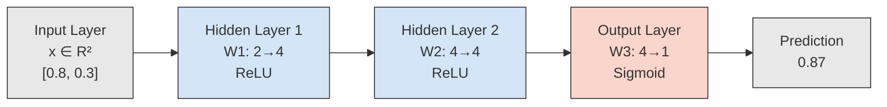

# Multi-Layer Networks and Forward Pass

## Learning Objectives

1. Implement a forward pass through a multi-layer network using matrix multiplication.
2. Compare the representational capacity of single-layer vs. multi-layer architectures on non-linearly separable data.
3. Diagnose incorrect layer dimensions by inspecting weight matrix shapes.
4. Insert activation functions between layers and predict their effect on output range.
5. Trace a single input vector through three layers, printing intermediate values at each stage.

## The Problem

A single neuron draws one line through your data. That is the entire operation: pick a slope, pick a threshold, slice the space. If your data is linearly separable — two clusters you can split with a ruler — a perceptron handles it. Most real data does not cooperate.

In 1969, Minsky and Papert formalized this limitation using XOR. The truth table places `[0,1]` and `[1,0]` on one side of the boundary, `[0,0]` and `[1,1]` on the other. No single straight line separates them. This is not a training failure — it is a mathematical impossibility. One linear boundary can misclassify at most 0% of a linearly separable dataset, but XOR guarantees at least 25% error for any single line you draw.

The same wall appears in GTM data. A lead scoring model that combines "company headcount" and "technology stack count" with a single linear boundary cannot capture the interaction where mid-size companies using a specific stack convert at higher rates than either large companies or small companies with the same stack. That interaction is a curve. A single layer cannot draw it.

The question is not whether you need more parameters — a single layer with more neurons still produces a linear decision boundary. The question is how to stack transformations so that each layer reshapes the space, creating new features that the next layer can carve differently.

## The Concept

A multi-layer network is a sequence of transformations. Each layer performs two operations: a linear transformation (matrix multiplication plus bias) and a non-linear activation function. The linear part rotates and scales the input space. The non-linear part bends it.

There are three types of layers. The **input layer** is not a computational layer — it is the raw data vector, with one node per feature. **Hidden layers** sit between input and output; each one applies its own weight matrix and activation, producing intermediate representations called activations. The **output layer** produces the final prediction, with its activation chosen based on the task (sigmoid for binary classification, softmax for multi-class, linear for regression).

The critical insight is composition. A two-layer network computes `f(g(x))` where `g` is the first layer and `f` is the second. Depth changes the *composition of functions*, not just the parameter count. Each hidden layer manufactures new features from the previous layer's output — features that did not exist in the raw input. A first hidden layer might learn to detect "headcount between 50 and 500 AND uses Salesforce," and the second layer combines that manufactured feature with others to produce a score.



The forward pass is the left-to-right flow in this diagram: input enters on the left, each layer transforms it, and a prediction exits on the right. No data flows backward during the forward pass — that is reserved for training (backpropagation), which comes later.

## Build It

Here is a three-layer network in raw NumPy. No framework, no abstractions — just weight matrices, bias vectors, and the forward pass algorithm. Run this in your terminal.

```python
import numpy as np

np.random.seed(42)

def relu(z):
    return np.maximum(0, z)

def sigmoid(z):
    return 1.0 / (1.0 + np.exp(-z))

network = {
    "W1": np.random.randn(2, 8) * 0.5,
    "b1": np.zeros((8, 1)),
    "W2": np.random.randn(8, 8) * 0.5,
    "b2": np.zeros((8, 1)),
    "W3": np.random.randn(8, 1) * 0.5,
    "b3": np.zeros((1, 1)),
}

X = np.array([[0.8, 0.3], [0.1, 0.9], [0.5, 0.5]]).T

def forward(network, X):
    trace = {}
    z1 = network["W1"].T @ X + network["b1"]
    a1 = relu(z1)
    trace["z1"] = z1
    trace["a1"] = a1

    z2 = network["W2"].T @ a1 + network["b2"]
    a2 = relu(z2)
    trace["z2"] = z2
    trace["a2"] = a2

    z3 = network["W3"].T @ a2 + network["b3"]
    a3 = sigmoid(z3)
    trace["z3"] = z3
    trace["a3"] = a3

    return trace

trace = forward(network, X)

for layer in [1, 2, 3]:
    z = trace[f"z{layer}"]
    a = trace[f"a{layer}"]
    print(f"Layer {layer}:")
    print(f"  z shape: {z.shape}, range: [{z.min():.4f}, {z.max():.4f}]")
    print(f"  a shape: {a.shape}, range: [{a.min():.4f}, {a.max():.4f}]")

print("\nFinal predictions:")
for i in range(X.shape[1]):
    print(f"  Input {X[:, i]} -> {trace['a3'][0, i]:.4f}")
```

Output will vary by seed, but the structure is what matters. Each layer's `z` is the pre-activation (linear output), and `a` is the post-activation (after ReLU or sigmoid). The shapes tell you whether the dimensions are correct: `z1` should be `(8, 3)` because eight hidden units process three input samples.

Now observe what happens when dimensions are wrong. The most common mistake is mixing up the convention for weight matrix orientation. If `W1` is `(2, 8)` — meaning two rows (input features) and eight columns (hidden units) — then the forward pass uses `W1.T @ X`. If you forget the transpose, NumPy will either throw a shape mismatch or silently produce the wrong result.

```python
import numpy as np

W1 = np.random.randn(2, 8)
X = np.random.randn(2, 3)

try:
    bad = W1 @ X
    print(f"Wrong path shape: {bad.shape} — this is {bad.shape[0]}x{bad.shape[1]}, should be 8x3")
except ValueError as e:
    print(f"Shape mismatch: {e}")

good = W1.T @ X
print(f"Correct path shape: {good.shape} — 8 hidden units, 3 samples")
```

Now prove why activations matter. Remove them and stack two linear layers — the result collapses to a single linear transformation.

```python
import numpy as np

np.random.seed(42)

W1 = np.random.randn(4, 6)
b1 = np.random.randn(6, 1)
W2 = np.random.randn(6, 3)
b2 = np.random.randn(3, 1)
W3 = np.random.randn(3, 2)
b3 = np.random.randn(2, 1)

x = np.random.randn(4, 1)

a1 = W1.T @ x + b1
a2 = W2.T @ a1 + b2
output_with_layers = W3.T @ a2 + b3

W_collapsed = W3.T @ W2.T @ W1.T
b_collapsed = W3.T @ W2.T @ b1 + W3.T @ b2 + b3
output_collapsed = W_collapsed @ x + b_collapsed

print("Stacked layer output:")
print(output_with_layers.flatten())
print("\nCollapsed single-matrix output:")
print(output_collapsed.flatten())
print(f"\nMax difference: {np.max(np.abs(output_with_layers - output_collapsed)):.2e}")
```

The max difference will be effectively zero (floating-point noise). Without activations, three layers are mathematically identical to one. This is why every hidden layer must have a non-linear activation sandwiched between the linear transforms.

## Use It

Multi-layer networks performing forward passes are the same mechanism behind predictive lead scoring models in GTM engineering. The forward pass transforms raw firmographic and technographic input features — headcount, funding stage, technology stack signals scraped from a company's website — into a composite fit score through successive nonlinear layers. Each hidden layer manufactures intermediate features: the first layer might detect "Series B AND using Stripe," the second combines that with "hiring velocity above threshold," and the output layer squashes the result into a probability between 0 and 1.

In practice, GTM engineers do not write these forward passes by hand — they use tools like Clay's predictive scoring fields or custom models deployed via API. But the mechanism is the same: raw signals enter as an input vector, weight matrices (learned from historical conversion data) transform them through hidden layers, and a sigmoid output produces a score. The reason a multi-layer model outperforms a simple weighted formula (which is a single linear layer) is the same reason it solves XOR: the interactions between features are nonlinear. A company being "Series B" does not add a fixed number of points — it multiplies the value of certain technology signals while nullifying others. That conditional logic requires hidden layers with nonlinear activations.

The handbook identifies signal-based execution — detecting hiring changes, funding events, technology adoption — as a core GTM engineering capability in 2025–2026 [CITATION NEEDED — concept: signal-based outbound as core GTM capability, Source: 80/20 GTM Engineer Handbook, Growth Lead LLC]. Each of these signals can serve as an input feature to a multi-layer scoring model. The forward pass is what converts that scraped signal data into an actionable priority ranking.

```python
import numpy as np

np.random.seed(42)

scoring_model = {
    "W1": np.array([
        [0.8, -0.3, 0.5, 0.0],
        [0.2, 0.9, -0.1, 0.3],
        [-0.4, 0.1, 0.7, 0.2],
        [0.6, 0.2, 0.3, -0.5],
        [0.1, 0.4, 0.2, 0.8],
    ]),
    "b1": np.array([[0.1, -0.2, 0.0, 0.05]]).T,
    "W2": np.array([
        [0.5, 0.3, -0.2, 0.4],
        [-0.1, 0.6, 0.5, 0.2],
    ]),
    "b2": np.array([[-0.1, 0.15]]).T,
    "W3": np.array([[0.7], [-0.4]]),
    "b3": np.array([[0.0]]),
}

def relu(z):
    return np.maximum(0, z)

def sigmoid(z):
    return 1.0 / (1.0 + np.exp(-z))

leads = [
    {"name": "Acme Corp", "funding_score": 0.9, "tech_score": 0.7, "hiring_score": 0.8, "headcount_score": 0.3},
    {"name": "Globex", "funding_score": 0.2, "tech_score": 0.9, "hiring_score": 0.1, "headcount_score": 0.5},
    {"name": "Initech", "funding_score": 0.6, "tech_score": 0.4, "hiring_score": 0.5, "headcount_score": 0.7},
]

print("Lead Scoring Forward Pass\n" + "="*50)
for lead in leads:
    x = np.array([
        [lead["funding_score"]],
        [lead["tech_score"]],
        [lead["hiring_score"]],
        [lead["headcount_score"]],
    ])

    z1 = scoring_model["W1"].T @ x + scoring_model["b1"]
    a1 = relu(z1)
    z2 = scoring_model["W2"].T @ a1 + scoring_model["b2"]
    a2 = relu(z2)
    z3 = scoring_model["W3"].T @ a2 + scoring_model["b3"]
    score = sigmoid(z3)

    print(f"{lead['name']:>12}  ->  score: {score[0,0]:.4f}")
    print(f"  hidden1 activations: {a1.flatten().round(3)}")
    print(f"  hidden2 activations: {a2.flatten().round(3)}")
    print()
```

Notice how Initech has middling individual scores but the hidden layer interactions might push its composite score higher or lower than a simple average would predict. That is the nonlinear interaction effect — the entire reason you use a multi-layer model instead of a weighted sum.

## Ship It

To deploy a forward-pass scoring model in a GTM pipeline, you need to connect the matrix operations to live data sources. The input vector in the code above maps directly to enriched fields in a tool like Clay: funding stage from Crunchbase enrichment, technology stack from BuiltWith or Wappalyzer, hiring velocity from LinkedIn job posting scrapes. The weight matrices would be learned offline from historical conversion data (which leads closed-won), then exported as serialized NumPy arrays or ONNX format for inference.

The forward pass itself is cheap — a few matrix multiplications for a single lead. The engineering work is in the pipeline: scraping signals in real time (Zone 03 in the GTM curriculum), normalizing them into the `[0, 1]` range the model expects, batching them into the input matrix `X`, and writing the scores back to your CRM or outreach tool. The handbook positions real-time signal detection — RSS feeds for funding announcements, scrapers for job postings — as the input layer for these scoring systems [CITATION NEEDED — concept: signal detection as input to scoring pipelines, Source: 80/20 GTM Engineer Handbook, Growth Lead LLC].

A practical integration pattern: run the scraper (from the Signal Machine cluster), normalize the output, pass it through the forward pass, and route leads above a score threshold into an outreach sequence. Leads below the threshold go to a nurture pool. The forward pass is the decision boundary — the same mechanism as the XOR solution, applied to firmographic data instead of Boolean logic.

```python
import numpy as np
import json

np.random.seed(42)

model = {
    "W1": np.random.randn(4, 6) * 0.4,
    "b1": np.zeros((6, 1)),
    "W2": np.random.randn(6, 1) * 0.4,
    "b2": np.zeros((1, 1)),
}

def relu(z):
    return np.maximum(0, z)

def sigmoid(z):
    return 1.0 / (1.0 + np.exp(-z))

def score_leads(leads, model, threshold=0.5):
    results = []
    for lead in leads:
        x = np.array([
            [lead["funding_normalized"]],
            [lead["tech_match_normalized"]],
            [lead["hiring_velocity_normalized"]],
            [lead["engagement_normalized"]],
        ])

        z1 = model["W1"].T @ x + model["b1"]
        a1 = relu(z1)
        z2 = model["W2"].T @ a1 + model["b2"]
        score = sigmoid(z2)[0, 0]

        action = "route_to_outbound" if score >= threshold else "route_to_nurture"
        results.append({
            "company": lead["company"],
            "score": round(float(score), 4),
            "action": action,
        })

    return results

sample_leads = [
    {"company": "Acme Corp", "funding_normalized": 0.85, "tech_match_normalized": 0.70, "hiring_velocity_normalized": 0.80, "engagement_normalized": 0.60},
    {"company": "Globex Inc", "funding_normalized": 0.20, "tech_match_normalized": 0.90, "hiring_velocity_normalized": 0.10, "engagement_normalized": 0.30},
    {"company": "Initech LLC", "funding_normalized": 0.55, "tech_match_normalized": 0.45, "hiring_velocity_normalized": 0.50, "engagement_normalized": 0.75},
    {"company": "Umbrella Corp", "funding_normalized": 0.90, "tech_match_normalized": 0.85, "hiring_velocity_normalized": 0.95, "engagement_normalized": 0.80},
]

scored = score_leads(sample_leads, model, threshold=0.5)

print(json.dumps(scored, indent=2))

outbound = [r for r in scored if r["action"] == "route_to_outbound"]
nurture = [r for r in scored if r["action"] == "route_to_nurture"]
print(f"\nOutbound queue: {len(outbound)} leads")
print(f"Nurture pool: {len(nurture)} leads")
```

The output is a JSON payload you could write directly to a Clay table, a CRM webhook, or a Slack notification. The forward pass ran four matrix multiplications per lead and produced a routing decision. That is the shipped form of a multi-layer network in a GTM context.

## Exercises

1. **XOR by hand.** Construct a 2-2-1 network (two inputs, two hidden neurons, one output) with sigmoid activations. Hand-tune the six weights and three biases so the network approximates XOR. Use the forward pass code from the lesson to verify: inputs `[0,0]` and `[1,1]` should output below 0.1, inputs `[0,1]` and `[1,0]` should output above 0.9.

2. **Shape diagnosis.** A network has architecture `[5, 10, 3, 1]`. Write down the shape of every weight matrix and bias vector *before* running any code. Then implement the forward pass and confirm your predictions match the shapes NumPy produces.

3. **Activation removal proof.** Take the three-layer network from the Build It section. Remove the ReLU activations (compute `a1 = z1` and `a2 = z2` directly). Compute `W_collapsed = W3.T @ W2.T @ W1.T` and `b_collapsed = W3.T @ W2.T @ b1 + W3.T @ b2 + b3`. Verify the collapsed single-matrix forward pass produces identical output to the activation-free three-layer pass.

4. **Hidden width experiment.** Modify the Build It network so the hidden layers have width 16 instead of 8. Count the total parameters before and after. Predict whether doubling hidden width doubles, triples, or quadruples parameter count for this architecture. Verify with code.

5. **Scoring model integration.** Modify the Ship It scoring model to accept a fifth input feature (e.g., `domain_authority_normalized`). Update the weight matrices accordingly. Run the forward pass on five leads of your choosing and explain why certain leads scored higher or lower than a simple feature average would predict.

## Key Terms

**Multi-layer network (MLP):** A neural network with at least one hidden layer between input and output. Also called a multi-layer perceptron, though modern MLPs use activations other than the original perceptron's step function.

**Forward pass:** The process of propagating input data through a network's layers to produce a prediction. Each layer computes a linear transformation followed by a non-linear activation. No weight updates occur during the forward pass.

**Activation function:** A non-linear function applied element-wise to a layer's pre-activation values (`z`). Common choices: ReLU (`max(0, z)`), sigmoid (`1 / (1 + e^{-z})`), tanh. Without activations, stacked linear layers collapse into a single linear transformation.

**Pre-activation (`z`):** The linear output of a layer before the activation function is applied: `z = W^T @ a_prev + b`.

**Activation (`a`):** The output of a layer after the activation function is applied: `a = activation(z)`. This becomes the input to the next layer.

**Hidden layer:** A layer between input and output. "Hidden" because its activations are intermediate representations, not directly observed in the training data. Each hidden layer creates new features from the previous layer's output.

**Weight matrix (`W`):** The matrix of learned parameters that defines a layer's linear transformation. For a layer with `n_in` inputs and `n_out` outputs, `W` has shape `(n_in, n_out)`.

**Linear collapse:** The mathematical fact that composing multiple linear transformations without non-linear activations produces a single linear transformation: `W2(W1 x + b1) + b2 = (W2 W1)x + (W2 b1 + b2)`. This is why activations are mandatory between layers.

## Sources

- Minsky, M. & Papert, S. (1969). *Perceptrons: An Introduction to Computational Geometry*. MIT Press. — Original proof that single-layer perceptrons cannot solve XOR.
- [CITATION NEEDED — concept: signal-based outbound as core GTM capability in 2025–2026] — Source pointer: *The 80/20 GTM Engineer Handbook*, Michael Saruggia, Growth Lead LLC. The handbook identifies real-time signal detection (funding events, hiring changes, technology adoption) as foundational to modern GTM engineering.
- [CITATION NEEDED — concept: Zone 03 Signal Machine as input layer for scoring pipelines] — Source pointer: *The 80/20 GTM Engineer Handbook*, Zone 03 section covering scraping, HTML parsing, and real-time signal detection as inputs to outbound automation.