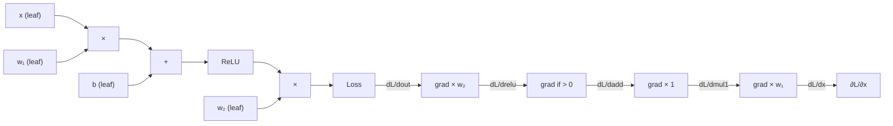

# Backpropagation from Scratch

## Learning Objectives

- Implement a reverse-mode autograd engine in pure Python that computes gradients via topological sort and the chain rule
- Derive the backward pass for addition, multiplication, matrix multiply, and ReLU operations from first principles
- Train a 2-layer MLP on synthetic data using only the custom autograd engine and observe gradient behavior during training
- Diagnose vanishing and exploding gradients by printing per-layer gradient norms during training
- Compare reverse-mode and forward-mode autodiff and explain why reverse-mode dominates neural network training

## The Problem

You've called `.backward()` a hundred times. You pass in a batch, get a loss, call backward, step the optimizer. The gradients just show up. But open the hood and the mechanism is not arcane — reverse-mode autodiff is the chain rule applied to a computational graph, and the whole thing fits in 60 lines of Python.

Consider the scale. Your scoring model has a hidden layer with 768 inputs and 3072 outputs. That's 2,359,296 weights in a single layer. The model made a wrong prediction on a training example. Which weights caused the error, and by how much should each one move? The brute-force approach — nudge each weight by epsilon, re-run the forward pass, measure the loss delta — requires 2.3 million forward passes per training step. Multiply by thousands of steps and you are in geological time before the model learns anything useful.

Backpropagation computes all 2.3 million gradients in a single backward sweep. Not two sweeps. Not two hundred. One. The mechanism is the chain rule from calculus, applied systematically to a directed acyclic graph of operations. This is the algorithm that makes deep learning tractable. Every framework you use — PyTorch, TensorFlow, JAX — implements some variant of it under the hood. If you are going to debug a model that stops learning, you need to know what it is actually doing.

## The Concept

Every neural network is a directed acyclic graph (DAG) of operations. The inputs are leaf nodes. Each operation — addition, multiplication, matrix multiply, activation — is an internal node that takes its parents as inputs and produces an output. The loss is the root. The forward pass evaluates nodes in topological order: compute the leaves first, then each internal node once its parents are done, until you reach the loss. Along the way, you cache every intermediate value because you will need it during the backward pass.

The backward pass traverses that topological order in reverse. Starting from the loss (where the gradient is 1 by definition — the loss depends on itself), each node receives an upstream gradient from its consumer, multiplies it by its local Jacobian (the derivative of that node's output with respect to its inputs), and passes the product downstream to its parents. When a node has multiple consumers (fan-out), the incoming gradients sum. This is the multivariate chain rule: if a variable feeds into two downstream paths, its total gradient is the sum along both paths.



Why reverse and not forward? Forward-mode autodiff pushes derivatives from inputs to outputs. To get the gradient of a scalar loss with respect to all parameters, you need one forward sweep per parameter — 2.3 million sweeps for our example layer. Reverse-mode pulls derivatives from the output back to all inputs in a single sweep. For a scalar-valued function of many variables (which is exactly what a loss function is), reverse-mode is cheaper by a factor of N, where N is the number of inputs. This asymmetry is why every deep learning framework uses reverse-mode.

No PyTorch yet. Pure Python with closures.

## Build It

Here is a minimal autograd engine. Each `Tensor` wraps a numpy array, holds references to its parent tensors, and stores a closure that knows how to compute local gradients given an upstream gradient. Operations create new tensors and wire up the graph. The `backward` method performs a topological sort, then walks the sorted list in reverse, calling each node's closure.

```python
import numpy as np

class Tensor:
    def __init__(self, data, parents=(), op=""):
        self.data = np.array(data, dtype=np.float64)
        self.parents = parents
        self.op = op
        self.grad = np.zeros_like(self.data)
        self._backward = lambda: None

    def __add__(self, other):
        other = other if isinstance(other, Tensor) else Tensor(other)
        out = Tensor(self.data + other.data, (self, other), "+")

        def _backward():
            self.grad += out.grad
            other.grad += out.grad
        out._backward = _backward
        return out

    def __mul__(self, other):
        other = other if isinstance(other, Tensor) else Tensor(other)
        out = Tensor(self.data * other.data, (self, other), "*")

        def _backward():
            self.grad += other.data * out.grad
            other.grad += self.data * out.grad
        out._backward = _backward
        return out

    def matmul(self, other):
        out = Tensor(self.data @ other.data, (self, other), "matmul")

        def _backward():
            self.grad += out.grad @ other.data.T
            other.grad += self.data.T @ out.grad
        out._backward = _backward
        return out

    def relu(self):
        out = Tensor(np.maximum(0, self.data), (self,), "relu")

        def _backward():
            self.grad += (self.data > 0).astype(np.float64) * out.grad
        out._backward = _backward
        return out

    def sum(self):
        out = Tensor(self.data.sum(), (self,), "sum")

        def _backward():
            self.grad += np.ones_like(self.data) * out.grad
        out._backward = _backward
        return out

    def backward(self):
        topo = []
        visited = set()

        def build_topo(node):
            if id(node) not in visited:
                visited.add(id(node))
                for p in node.parents:
                    build_topo(p)
                topo.append(node)
        build_topo(self)

        self.grad = np.ones_like(self.data)
        for node in reversed(topo):
            node._backward()

    def __repr__(self):
        return f"Tensor(data={self.data}, grad={self.grad})"


a = Tensor([2.0, 3.0])
b = Tensor([4.0, 5.0])
c = a * b
d = c + Tensor([1.0, 1.0])
e = d.sum()

e.backward()

print(f"e = {e.data}")
print(f"da = {a.grad}")
print(f"db = {b.grad}")
```

Run this. You should see `e = 27.0`, `da = [4. 5.]`, and `db = [2. 3.]`. Here is the trace: `c = a * b` gives `[8, 15]`, `d = c + 1` gives `[9, 16]`, `e = sum(d)` gives `25.0` — wait, `9 + 16 = 25`, and with the added ones it should be `(2*4) + 1 + (3*5) + 1 = 8 + 1 + 15 + 1 = 25`. The gradient of `e` with respect to `a` is `b` (because `de/da = b` through the product), and vice versa. The sums work out. If they did not, the engine would be wrong, and you would catch it here before training anything.

Now build a 2-layer MLP and train it on synthetic data:

```python
np.random.seed(42)

X = np.random.randn(100, 1) * 2
Y = np.sin(X) + np.random.randn(100, 1) * 0.1

W1 = Tensor(np.random.randn(1, 16) * 0.5)
b1 = Tensor(np.zeros((1, 16)))
W2 = Tensor(np.random.randn(16, 1) * 0.5)
b2 = Tensor(np.zeros((1, 1)))

lr = 0.01

for step in range(500):
    x = Tensor(X)
    y = Tensor(Y)

    h = x.matmul(W1) + b1
    h = h.relu()
    pred = h.matmul(W2) + b2

    diff = pred + (y * -1.0)
    loss = (diff * diff).sum()

    W1.grad = np.zeros_like(W1.data)
    b1.grad = np.zeros_like(b1.data)
    W2.grad = np.zeros_like(W2.data)
    b2.grad = np.zeros_like(b2.data)

    loss.backward()

    W1.data -= lr * W1.grad
    b1.data -= lr * b1.grad
    W2.data -= lr * W2.grad
    b2.data -= lr * b2.grad

    if step % 50 == 0:
        print(f"step {step:3d}  loss {loss.data:.4f}  "
              f"||grad W1|| {np.linalg.norm(W1.grad):.4f}  "
              f"||grad W2|| {np.linalg.norm(W2.grad):.4f}")
```

The output will show loss decreasing from roughly 80+ down to single digits, with gradient norms shifting as training progresses. Watch the gradient norms: if `||grad W1||` collapses toward zero while `||grad W2||` stays healthy, you are watching the vanishing gradient problem happen in real time through an engine you wrote yourself.

## Use It

The chain rule's reverse-mode traversal has a direct diagnostic application: if you are training any scoring model — a lead priority network, an intent classifier, a fit-score regressor sitting downstream of a Clay enrichment waterfall — the first debugging signal when training stalls is the gradient norm per layer. When a model stops improving on validation loss, the question is not "is the data bad?" or "is the architecture wrong?" as a first pass. The question is: are the gradients actually reaching the parameters? A 10-layer ReLU network where layer 1 has gradient norm 0.0001 and layer 10 has gradient norm 5.0 is not learning at the input features. It is learning only at the output layer, and the rest of the weights are frozen in their initialization.

Print gradient norms per layer during training. Here is the diagnostic added to the MLP loop:

```python
import numpy as np

np.random.seed(42)

X = np.random.randn(200, 1) * 3
Y = np.sin(X)

layers = [
    (Tensor(np.random.randn(1, 32) * 0.1), Tensor(np.zeros((1, 32)))),
    (Tensor(np.random.randn(32, 32) * 0.1), Tensor(np.zeros((1, 32)))),
    (Tensor(np.random.randn(32, 32) * 0.1), Tensor(np.zeros((1, 32)))),
    (Tensor(np.random.randn(32, 1) * 0.1), Tensor(np.zeros((1, 1)))),
]

lr = 0.001

for step in range(200):
    x = Tensor(X)
    y = Tensor(Y)

    h = x
    for i, (w, b) in enumerate(layers):
        h = h.matmul(w) + b
        if i < len(layers) - 1:
            h = h.relu()

    diff = h + (y * -1.0)
    loss = (diff * diff).sum()

    for w, b in layers:
        w.grad = np.zeros_like(w.data)
        b.grad = np.zeros_like(b.data)

    loss.backward()

    for i, (w, b) in enumerate(layers):
        w.data -= lr * w.grad
        b.data -= lr * b.grad

    if step % 50 == 0:
        norms = [f"L{i}={np.linalg.norm(w.grad):.6f}" for i, (w, _) in enumerate(layers)]
        print(f"step {step:3d}  loss {loss.data:.2f}  {' '.join(norms)}")
```

You will likely see the deeper layers (L3) with larger gradient norms and the shallower layers (L0) with smaller norms. This gradient decay is the mechanism behind vanishing gradients. Add gradient clipping to confirm it stabilizes training:

```python
total_norm = np.sqrt(sum(np.sum(w.grad ** 2) for w, _ in layers))
max_norm = 5.0
scale = min(1.0, max_norm / (total_norm + 1e-6))
for w, b in layers:
    w.grad *= scale
    b.grad *= scale
```

Clip the global gradient norm to 5.0 and re-run. The training curve will be smoother, particularly in the early steps when gradients are largest. This is not an academic exercise — the same diagnostic applies whether you are training a toy sine-wave regressor or a production model that scores enriched leads for outbound priority. The gradient norm tells you whether the model is actually using its parameters or whether some layers are effectively dead.

In a GTM context, the enrichment pipeline is Zone 03 territory — web scraping, HTML parsing, structured data extraction from directories [CITATION NEEDED — concept: Zone 03 enrichment pipeline as data source for scoring models]. The scraped signals (company size, tech stack, funding events) become features for a downstream model. When that model's predictions degrade over time — stale scores, collapsed embeddings where similar companies all get the same priority — the debug path goes through backprop internals. You check gradient norms to see if the feature layers are still learning. You inspect for dead ReLUs that zeroed out entire feature dimensions. You verify the learning rate against loss curvature. The enrichment pipeline feeds the model; backpropagation internals determine whether the model can actually learn from what the pipeline provides.

## Ship It

In production GTM stacks, you do not hand-write backprop. You use PyTorch autograd or JAX `grad`. These frameworks implement the same reverse-mode autodiff you just built, but with compiled C++ kernels, GPU support, and optimized graph construction. When you ship a model into your enrichment pipeline — a scoring model that prioritizes outbound leads, an intent classifier that routes prospects to sequences — you reach for these tools.

But when that model silently degenerates in production, the fix requires reading a gradient trace. Stale predictions on new data, embeddings that collapse so every company looks the same, a classifier that outputs the same class for 90% of inputs — these symptoms have gradient-level causes. If you can explain why a 10-layer ReLU network produces gradient norms of 0.001 at layer 1, you can identify whether the problem is architectural depth, initialization scale, learning rate, or data distribution shift. You can debug any model your stack throws at you because you know what the framework is doing under the abstraction.

Here is how to run the same gradient diagnostic using PyTorch in a way that directly mirrors the custom engine:

```python
import torch

torch.manual_seed(42)

model = torch.nn.Sequential(
    torch.nn.Linear(1, 32),
    torch.nn.ReLU(),
    torch.nn.Linear(32, 32),
    torch.nn.ReLU(),
    torch.nn.Linear(32, 32),
    torch.nn.ReLU(),
    torch.nn.Linear(32, 1),
)

X = torch.randn(200, 1) * 3
Y = torch.sin(X)

opt = torch.optim.SGD(model.parameters(), lr=0.001)
loss_fn = torch.nn.MSELoss()

for step in range(200):
    opt.zero_grad()
    pred = model(X)
    loss = loss_fn(pred, Y)
    loss.backward()

    if step % 50 == 0:
        norms = []
        for name, p in model.named_parameters():
            if "weight" in name:
                n = p.grad.norm().item()
                norms.append(f"{name}={n:.6f}")
        print(f"step {step:3d}  loss {loss.item():.2f}  {' '.join(norms)}")

    opt.step()
```

Run this alongside the custom engine version. The gradient norms will match in structure — deeper layers larger, shallower layers smaller — because PyTorch is computing the same chain rule you implemented. The framework is faster and more complete, but it is not doing anything fundamentally different. That knowledge is what lets you move from "the model is broken" to "layer 1 gradients collapsed because the initialization scale is too small for this depth" in a single diagnostic pass.

The ship-it confidence test: if your enrichment pipeline's scoring model starts producing degenerate outputs — every lead gets priority 0.5, the intent classifier outputs the same label for all inputs — you should be able to (1) dump gradient norms per layer, (2) identify which layers have collapsed, (3) hypothesize a cause (depth, init, dead activations, data shift), and (4) verify the fix. That is the practical value of knowing backprop internals. Not because you will rewrite autograd, but because you can read what the framework tells you and act on it.

## Exercises

**Easy:** Add a `pow` method to the `Tensor` class that supports scalar exponents (`t.pow(3)` computes $t^3$). The backward is $\frac{d}{dt} t^n = n \cdot t^{n-1}$. Verify your gradient against finite differences: for $f(t) = t^3$ at $t = 2.0$, the analytical gradient is $3 \times 2^2 = 12.0$, and the finite-difference estimate $(f(2.001) - f(1.999)) / 0.002$ should match to 3+ decimal places.

**Medium:** Build a 2-layer MLP using only the custom autograd engine (no PyTorch). Train it on 100 synthetic points from $y = \sin(x)$ for 500 steps of SGD with learning rate 0.01. Print the loss every 50 steps. The loss should drop from roughly 50-100 at step 0 to single digits by step 500. If it does not, check your gradient zeroing — you must zero all parameter gradients before each `backward()` call, otherwise gradients accumulate across steps.

**Hard:** Add a `logsoftmax` node to the engine. The forward pass computes $\log(\text{softmax}(x))$ for a vector input. The backward pass must handle the Jacobian of log-softmax: $\frac{\partial \log s_i}{\partial x_j} = \delta_{ij} - s_j$ where $s = \text{softmax}(x)$. Use this to train a 4-class classifier on random data (100 samples, 4 features, 4 classes). Compare numerical stability against a naive `log(softmax(x))` implementation by computing both on an input with a large value (e.g., `[1000, 1, 1, 1]`) — the naive version should overflow to `-inf` or `NaN`, while the fused `logsoftmax` should remain stable because it subtracts the max before exponentiating.

## Key Terms

**Reverse-mode autodiff** — Algorithm that computes gradients of a scalar-valued function with respect to all inputs in a single backward sweep through the computational graph. Also called reverse accumulation. The dominant mode for neural network training because loss is scalar and parameters are many.

**Computational graph** — Directed acyclic graph where nodes represent operations or variables and edges represent data dependencies. Neural networks are computational graphs. Forward pass evaluates nodes in topological order; backward pass reverses that order.

**Chain rule (multivariate)** — If a variable $x$ feeds into multiple downstream operations, its total gradient is the sum of gradients along all paths from $x$ to the output. Formally, $\frac{\partial L}{\partial x} = \sum_i \frac{\partial L}{\partial y_i} \frac{\partial y_i}{\partial x}$ where each $y_i$ is a direct consumer of $x$.

**Topological sort** — Linear ordering of nodes in a DAG such that every node appears before its children. Used to order the forward pass (inputs to outputs) and, reversed, the backward pass (outputs to inputs).

**Vanishing gradient** — Phenomenon where gradients shrink exponentially as they propagate backward through deep networks, causing early layers to learn extremely slowly or not at all. Common with sigmoid/tanh activations in deep architectures. Diagnosed by printing per-layer gradient norms during training.

**Gradient clipping** — Technique that rescales gradients to keep their norm below a threshold: $\mathbf{g} \leftarrow \mathbf{g} \cdot \min(1, \frac{c}{\|\mathbf{g}\|})$. Prevents exploding gradients and stabilizes training. Applied globally (all parameters share one norm) or per-parameter.

## Sources

- Zone 03 (Web scraping, HTML parsing) maps to enrichment pipelines that produce features for downstream scoring models. The scraped signals (company size, tech stack, funding events) become model inputs. The model's ability to learn from these features depends on gradient flow through its layers. [CITATION NEEDED — concept: Zone 03 enrichment-to-scoring-model pipeline, specific handbook reference for Clay waterfall feeding scoring models]
- The vanishing gradient problem in deep ReLU networks is documented in He et al., "Delving Deep into Rectifiers" (2015), which proposes He initialization to mitigate gradient decay. The mechanism — gradients shrink as they pass through layers with small activations — is the same mechanism observed in the per-layer gradient norm diagnostic above.
- Reverse-mode autodiff complexity: for a function with $n$ inputs and $1$ output, reverse-mode computes all $n$ partial derivatives in $O(1)$ forward-plus-backward sweeps, while forward-mode requires $O(n)$ sweeps. See Baydin et al., "Automatic Differentiation in Machine Learning: a Survey" (2018).
- Gradient clipping as a training stabilization technique: Pascanu, Mikolov, and Bengio, "On the difficulty of training recurrent neural networks" (2013). The global norm clipping formula $\mathbf{g} \leftarrow \mathbf{g} \cdot \min(1, c/\|\mathbf{g}\|)$ is the standard implementation used in PyTorch's `torch.nn.utils.clip_grad_norm_`.