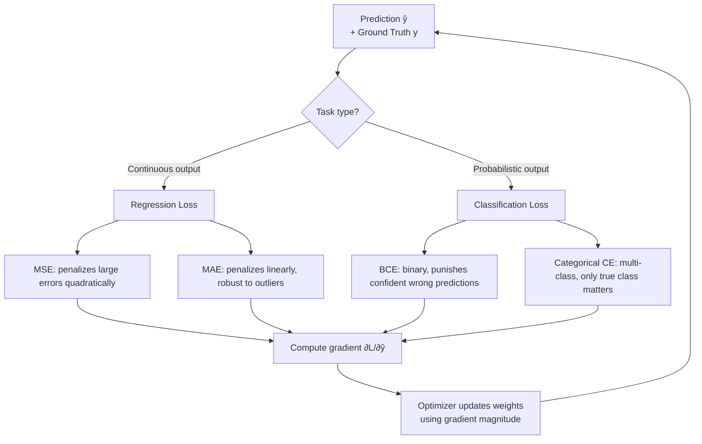

# Loss Functions

## Learning Objectives

1. Implement MSE, MAE, binary cross-entropy, and hinge loss from scratch in Python with their gradients
2. Compare how different loss functions penalize the same prediction errors using executable code
3. Select the appropriate loss function for regression, binary classification, and multi-class classification tasks
4. Diagnose model training issues by interpreting loss curves and gradient magnitudes
5. Explain why the derivative of the loss function determines learning dynamics — not the loss value itself

## The Problem

A neural network makes a prediction. The ground truth says otherwise. How wrong is it, and in which direction? That number is the loss. Without it, there is no gradient, no weight update, no learning. The loss function is the single scalar that translates "wrongness" into something an optimizer can minimize.

Here is the failure mode that makes this choice non-trivial. You have a binary classification task — two classes, 50/50 split. You use Mean Squared Error as your loss. The model predicts 0.5 for every single input. The average MSE is 0.25, which happens to be the minimum the model can reach without actually learning any discriminative features. The model has zero predictive power, but it has technically minimized your loss function. Switch to binary cross-entropy and the same model is forced to push predictions toward 0 or 1, because `-log(0.5) = 0.693` is a terrible loss while `-log(0.99) = 0.01` rewards confident correct predictions.

The loss function is the only thing your model actually optimizes. Not accuracy. Not F1 score. Not whatever dashboard metric you report. The optimizer takes the gradient of the loss function and adjusts weights to make that specific number smaller. If the loss function does not capture what you care about, the model will find the mathematically cheapest way to satisfy it — and that way is almost never what you wanted.

This lesson implements four loss functions from scratch, shows how each one penalizes the same set of errors differently, and traces the consequences into a go-to-market scoring problem where the wrong loss function wastes your outbound budget on accounts that will never convert.

## The Concept

Loss functions fall into families based on what kind of prediction they evaluate. The two fundamental families are regression losses (continuous output) and classification losses (discrete or probabilistic output). Within each family, the penalty shape — how the loss scales with error magnitude — determines what the model prioritizes fixing.

**Mean Squared Error (MSE)** squares the difference between prediction and target, then averages. Squaring does two things: it makes everything positive (so negative and positive errors don't cancel), and it makes large errors disproportionately expensive. An error of 0.1 costs 0.01. An error of 1.0 costs 1.0. An error of 10 costs 100. One outlier in your training data can dominate the entire gradient signal, because MSE's penalty grows quadratically. The derivative of MSE with respect to the prediction is `2 * (prediction - target)`, which means the gradient magnitude scales linearly with error. Big errors produce big gradients, which produce big weight updates. This is desirable for regression where you want to fix large mistakes fast, but catastrophic when those large errors come from noisy data.

**Mean Absolute Error (MAE)** takes the absolute difference instead of squaring. The penalty grows linearly: an error of 0.1 costs 0.1, an error of 10 costs 10. Outliers no longer dominate the gradient. The trade-off is that the derivative is constant (`-1` or `+1` depending on sign) everywhere except at exactly zero, where it is undefined. Near zero error, the gradient does not shrink, so the model keeps taking large steps even when it is already close to the correct answer. This produces oscillation around the optimum instead of smooth convergence.

**Binary Cross-Entropy (BCE)** measures the divergence between a predicted probability and a true label (0 or 1). The formula is `-[y * log(p) + (1-y) * log(1-p)]`. When the true label is 1 and the model predicts 0.99, the loss is `-log(0.99) = 0.01` — tiny. When the model confidently predicts 0.01 for a true label of 1, the loss is `-log(0.01) = 4.6` — large. BCE punishes confident wrong answers exponentially. The gradient of BCE with respect to the logit (pre-sigmoid output) simplifies to `(sigmoid(z) - y)`, which is clean and stable. This is why BCE is the default for binary classification.

**Categorical Cross-Entropy** extends BCE to multi-class. For the true class, the loss is `-log(p_true)`. For all other classes, the loss contribution is zero (because their target is 0 and `0 * log(anything) = 0`). Only the predicted probability assigned to the correct class matters. This is elegant: the model is penalized purely based on how much probability it assigned to the right answer.



The key insight is in that bottom loop. The loss value itself is just a number you log for monitoring. What actually drives learning is the *derivative* of the loss with respect to the model's parameters. MSE produces gradients proportional to error magnitude. BCE produces gradients proportional to `(prediction - target)`. Hinge loss produces gradients that are zero for predictions that are correct with sufficient margin — which is why SVMs produce sparse, max-margin decision boundaries. Different loss functions create fundamentally different optimization landscapes, even on identical data.

## Build It

Here is the implementation. Four loss functions, four gradients, and a comparison harness that runs on the same set of predictions and targets so you can see the penalty differences directly.

```python
import numpy as np

def mse_loss(predictions, targets):
    return np.mean((predictions - targets) ** 2)

def mse_gradient(predictions, targets):
    return 2 * (predictions - targets) / len(predictions)

def mae_loss(predictions, targets):
    return np.mean(np.abs(predictions - targets))

def mae_gradient(predictions, targets):
    return np.sign(predictions - targets) / len(predictions)

def binary_cross_entropy(predictions, targets, eps=1e-15):
    predictions = np.clip(predictions, eps, 1 - eps)
    return -np.mean(targets * np.log(predictions) + (1 - targets) * np.log(1 - predictions))

def bce_gradient(predictions, targets, eps=1e-15):
    predictions = np.clip(predictions, eps, 1 - eps)
    return (predictions - targets) / (predictions * (1 - predictions)) / len(predictions)

def hinge_loss(predictions, targets):
    targets_transformed = 2 * targets - 1
    return np.mean(np.maximum(0, 1 - targets_transformed * predictions))

def hinge_gradient(predictions, targets):
    targets_transformed = 2 * targets - 1
    mask = (1 - targets_transformed * predictions) > 0
    return -targets_transformed * mask / len(predictions)

predictions = np.array([0.1, 0.3, 0.6, 0.8, 0.95])
targets = np.array([0, 0, 1, 1, 1])

print("Same predictions, four loss functions")
print("=" * 55)
print(f"Predictions:  {predictions}")
print(f"Targets:      {targets}")
print("=" * 55)
print(f"MSE:                {mse_loss(predictions, targets):.6f}")
print(f"MAE:                {mae_loss(predictions, targets):.6f}")
print(f"Binary CE:          {binary_cross_entropy(predictions, targets):.6f}")
print(f"Hinge:              {hinge_loss(predictions, targets):.6f}")
print()

predictions_with_outlier = np.array([0.1, 0.3, 0.6, 0.8, 0.01])
print("Same data, but last prediction flipped to extreme outlier")
print("Prediction 4: was 0.95 (correct, target=1), now 0.01 (very wrong)")
print("=" * 55)
print(f"MSE:                {mse_loss(predictions_with_outlier, targets):.6f}  (was {mse_loss(predictions, targets):.6f})")
print(f"MAE:                {mae_loss(predictions_with_outlier, targets):.6f}  (was {mae_loss(predictions, targets):.6f})")
print(f"Binary CE:          {binary_cross_entropy(predictions_with_outlier, targets):.6f}  (was {binary_cross_entropy(predictions, targets):.6f})")
print(f"Hinge:              {hinge_loss(predictions_with_outlier, targets):.6f}  (was {hinge_loss(predictions, targets):.6f})")
print()

print("Gradient magnitudes (mean absolute gradient per sample)")
print("=" * 55)
print(f"MSE grad:           {np.mean(np.abs(mse_gradient(predictions_with_outlier, targets))):.6f}")
print(f"MAE grad:           {np.mean(np.abs(mae_gradient(predictions_with_outlier, targets))):.6f}")
print(f"BCE grad:           {np.mean(np.abs(bce_gradient(predictions_with_outlier, targets))):.6f}")
print(f"Hinge grad:         {np.mean(np.abs(hinge_gradient(predictions_with_outlier, targets))):.6f}")
```

Run this and look at the outlier section. When the last prediction flips from 0.95 to 0.01 (confidently wrong instead of confidently correct), MSE jumps from roughly 0.003 to roughly 0.19 — a 60x increase driven almost entirely by the single squared error term `(0.01 - 1)^2 = 0.98`. MAE increases more modestly because its penalty is linear. BCE explodes because `-log(0.01) = 4.6` — the logarithmic penalty for confidently wrong predictions kicks in hard.

Now look at gradient magnitudes. MSE's gradient for that one sample is `2 * (0.01 - 1) / 5 = -0.396`. BCE's gradient is `(0.01 - 1) / (0.01 * 0.99) / 5 = -20.0` before clipping kicks in. The gradient magnitude difference is enormous — BCE is telling the optimizer to fix this prediction with urgency, while MAE treats it the same as any other error of similar absolute distance. This is what "the derivative determines learning dynamics" means in practice.

## Use It

Here is where loss functions meet go-to-market engineering. Ideal Customer Profile (ICP) scoring is fundamentally a classification problem: given a set of account attributes (company size, industry, funding stage, technology stack, hiring signals scraped from directories and RSS feeds), predict the probability that this account matches your ICP and will convert if outbound is applied. The model outputs a probability. The loss function measures how far off that probability is from the labeled outcome (converted / did not convert).

[CITATION NEEDED — concept: ICP scoring models trained with specific loss functions in GTM tooling]

Binary cross-entropy is the correct loss for ICP classification. When you label accounts "good fit" or "bad fit" based on historical conversion data, BCE quantifies how well your model separates the two distributions. If the model assigns 0.02 probability to an account that actually converted, BCE produces a loss of `-log(0.02) = 3.9`, which generates a large gradient pushing that prediction upward. The model learns from its confident mistakes. This is exactly the behavior you want when the cost of a false negative (missing a high-value account) far exceeds the cost of a false positive (wasting a few outreach sequences on a marginal account).

The problem is class imbalance. In most B2B outbound, the vast majority of accounts in your TAM will not convert. If 5% of accounts are good fits and 95% are not, a model that predicts 0.05 for everything achieves a technically respectable BCE by gaming the prior. The fix is weighted binary cross-entropy: assign a higher weight to the minority class so that errors on positive examples produce proportionally larger gradients. This is the same mechanism as standard BCE but with a multiplier on the positive-class loss term. In practice, this means your ICP model treats a missed high-value account as more costly than a wasted outbound attempt — which is the correct economic prior for most GTM teams.

This connects directly to Zone 03 in the GTM curriculum: web scraping, HTML parsing, and signal detection. The scrapers that pull company data from directories (lesson 3.1) and the RSS feeds that surface funding events in real time (lesson 3.2) are the *input pipeline* to your ICP model. Those signals — hiring spikes, funding rounds, technology adoption — become features. The loss function determines how the model learns to weight those features. If you use the wrong loss, the model might learn to predict "not ICP" for everything because that minimizes unweighted BCE on imbalanced data, and your entire Signal Machine becomes useless despite having good input data.

## Ship It

Here is the production consideration that catches teams off guard: the loss function you train with is not the metric you deploy against. You train with BCE because it produces clean gradients. You evaluate with precision, recall, and conversion rate because those are what your GTM team cares about. The loss function and the evaluation metric measure different things, and they should. BCE measures probabilistic calibration. Conversion rate measures business outcomes. A model with excellent BCE can still have poor precision if the decision threshold is wrong.

```python
import numpy as np

np.random.seed(42)
n_accounts = 1000
n_positive = 50

true_labels = np.zeros(n_accounts)
true_labels[:n_positive] = 1
features = np.random.randn(n_accounts, 5)
features[:n_positive] += np.array([1.5, -0.8, 0.6, 1.0, -0.4])

def sigmoid(x):
    return 1 / (1 + np.exp(-np.clip(x, -30, 30)))

weights = np.random.randn(5) * 0.1
bias = 0.0
learning_rate = 0.5
epochs = 200

positive_weight = n_accounts / (2 * n_positive)
negative_weight = n_accounts / (2 * (n_accounts - n_positive))
sample_weights = np.where(true_labels == 1, positive_weight, negative_weight)

loss_history_standard = []
loss_history_weighted = []

weights_std = weights.copy()
weights_wgt = weights.copy()
bias_std = bias
bias_wgt = bias

for epoch in range(epochs):
    logits_std = features @ weights_std + bias_std
    probs_std = sigmoid(logits_std)
    eps = 1e-15
    probs_std = np.clip(probs_std, eps, 1 - eps)
    loss_std = -np.mean(true_labels * np.log(probs_std) + (1 - true_labels) * np.log(1 - probs_std))
    loss_history_standard.append(loss_std)
    grad_std = features.T @ (probs_std - true_labels) / n_accounts
    weights_std -= learning_rate * grad_std
    bias_std -= learning_rate * np.mean(probs_std - true_labels)

    logits_wgt = features @ weights_wgt + bias_wgt
    probs_wgt = sigmoid(logits_wgt)
    probs_wgt = np.clip(probs_wgt, eps, 1 - eps)
    loss_wgt = -np.mean(sample_weights * (true_labels * np.log(probs_wgt) + (1 - true_labels) * np.log(1 - probs_wgt)))
    loss_history_weighted.append(loss_wgt)
    grad_wgt = features.T @ (sample_weights * (probs_wgt - true_labels)) / n_accounts
    weights_wgt -= learning_rate * grad_wgt
    bias_wgt -= learning_rate * np.mean(sample_weights * (probs_wgt - true_labels))

print("ICP Model: Standard BCE vs. Weighted BCE (5% positive class)")
print("=" * 60)

threshold = 0.5
preds_std = sigmoid(features @ weights_std + bias_std) > threshold
preds_wgt = sigmoid(features @ weights_wgt + bias_wgt) > threshold

tp_std = np.sum((preds_std == 1) & (true_labels == 1))
fp_std = np.sum((preds_std == 1) & (true_labels == 0))
fn_std = np.sum((preds_std == 0) & (true_labels == 1))

tp_wgt = np.sum((preds_wgt == 1) & (true_labels == 1))
fp_wgt = np.sum((preds_wgt == 1) & (true_labels == 0))
fn_wgt = np.sum((preds_wgt == 0) & (true_labels == 1))

precision_std = tp_std / (tp_std + fp_std) if (tp_std + fp_std) > 0 else 0
recall_std = tp_std / n_positive
precision_wgt = tp_wgt / (tp_wgt + fp_wgt) if (tp_wgt + fp_wgt) > 0 else 0
recall_wgt = tp_wgt / n_positive

print(f"Standard BCE:")
print(f"  True positives found:  {tp_std}/{n_positive}")
print(f"  False positives:       {fp_std}")
print(f"  False negatives:       {fn_std}")
print(f"  Precision:             {precision_std:.3f}")
print(f"  Recall:                {recall_std:.3f}")
print()
print(f"Weighted BCE:")
print(f"  True positives found:  {tp_wgt}/{n_positive}")
print(f"  False positives:       {fp_wgt}")
print(f"  False negatives:       {fn_wgt}")
print(f"  Precision:             {precision_wgt:.3f}")
print(f"  Recall:                {recall_wgt:.3f}")
print()
print(f"Final training loss (standard): {loss_history_standard[-1]:.4f}")
print(f"Final training loss (weighted): {loss_history_weighted[-1]:.4f}")
```

The output tells the story. Standard BCE on imbalanced data will likely classify very few or zero accounts as positive — it minimizes loss by predicting low probabilities for everything. Weighted BCE recovers most of the true positives at the cost of more false positives. Whether that trade-off is correct depends on your GTM economics: if each correctly identified ICP account is worth $50K in pipeline and each wasted outbound sequence costs $20 in SDR time, you should err toward recall. The loss function encodes that trade-off through the class weight, not through the loss formula itself.

In a Clay workflow, these predictions become enrichment columns. The scraper from Zone 03 pulls the raw account data, the model (trained with weighted BCE) assigns a probability score, and a Clay Function — free boolean logic, no API credits — applies the threshold: `if icp_score > 0.7, route to SDR queue; else, park in nurture`. The loss function choice is invisible at deployment, but it determines whether the SDR queue is full of high-value accounts or garbage.

## Exercises

**Exercise 1 (Easy):** Modify the Build It code. Change one prediction from the original array to 0.9999 when the target is 0 (confidently wrong in the other direction). Print the before/after loss for all four functions. Which loss function reacts most violently to a confidently wrong prediction?

**Exercise 2 (Medium):** Implement Huber loss from scratch. Huber loss is quadratic for errors below a threshold δ and linear above it. The formula: if `|error| ≤ δ`, loss = `0.5 * error²`. If `|error| > δ`, loss = `δ * (|error| - 0.5 * δ)`. Set δ = 1.0. Add it to the comparison table alongside MSE and MAE. Identify the error magnitude at which Huber transitions from matching MSE's behavior to matching MAE's behavior.

**Exercise 3 (Hard):** Generate a range of error values from -3 to 3 in steps of 0.01. Compute MSE, MAE, BCE (with target fixed at 1), and Huber loss for each error value. Print a text-based comparison at five key error magnitudes: 0.0, 0.1, 0.5, 1.0, and 3.0. Then state which loss function has the steepest penalty slope near zero error, and explain why this matters for training stability.

**Exercise 4 (GTM):** In the Ship It code, change `positive_weight` to 1.0 and `negative_weight` to 1.0 (effectively removing the class weighting). Re-run and compare recall against the weighted version. Calculate the opportunity cost: at $50K per missed positive account, how much pipeline value does the unweighted model leave on the table?

## Key Terms

- **Loss Function** — A function that maps a prediction and its ground truth to a single scalar representing error. The optimizer minimizes this scalar.
- **Gradient** — The derivative of the loss with respect to model parameters. Determines the direction and magnitude of weight updates.
- **Mean Squared Error (MSE)** — Regression loss that squares errors. Penalizes outliers quadratically. Gradient scales linearly with error magnitude.
- **Mean Absolute Error (MAE)** — Regression loss that takes absolute error. Penalizes linearly. Constant gradient magnitude everywhere except zero.
- **Binary Cross-Entropy (BCE)** — Classification loss for binary tasks. `-[y·log(p) + (1-y)·log(1-p)]`. Punishes confident wrong predictions logarithmically.
- **Categorical Cross-Entropy** — Multi-class extension of BCE. Only the predicted probability of the true class contributes to the loss.
- **Hinge Loss** — Loss for maximum-margin classifiers. Penalizes predictions that are correct but insufficiently confident. Zero gradient when prediction exceeds the margin.
- **Class Imbalance** — Training condition where one class appears far more frequently than others. Distorts unweighted loss toward the majority class.
- **Weighted Cross-Entropy** — BCE variant that multiplies each class's loss contribution by a weight. Counteracts class imbalance by making minority-class errors more expensive to the optimizer.

## Sources

- Binary cross-entropy as standard loss for binary classification: standard deep learning literature (Goodfellow, Bengio, Courville — *Deep Learning*, Ch. 5.5, 6.2.1)
- MSE failure mode for classification (predict 0.5 for everything): Goodfellow et al., *Deep Learning*, Ch. 5.5 — maximum likelihood derivation showing MSE's relationship to Gaussian noise assumption
- Gradient of BCE with respect to logit simplifying to `(sigmoid(z) - y)`: Bishop, *Pattern Recognition and Machine Learning*, Ch. 4.3.2
- Class imbalance and weighted cross-entropy: King & Zeng, "Logistic Regression in Rare Events Data" (2001); standard practice in sklearn `class_weight` parameter
- [CITATION NEEDED — concept: ICP scoring models trained with specific loss functions in GTM tooling such as Clay]
- Clay Functions as free boolean logic / column formulas without API credits: Clay documentation and product description
- Zone 03 GTM mapping (web scraping, directory scraping, RSS signal detection): lesson cluster 3.1–3.2 in the GTM curriculum