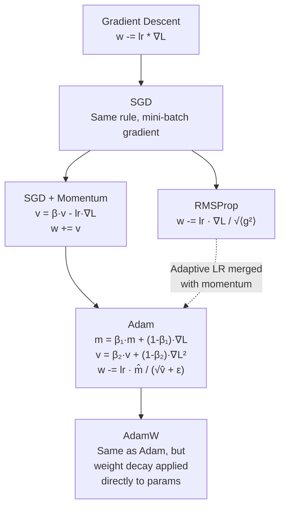

# Optimizers

## Learning Objectives

- Implement SGD, SGD with momentum, Adam, and AdamW from scratch in Python using only NumPy
- Trace the update-rule evolution from vanilla gradient descent to AdamW, identifying which term each variant adds and why
- Compare optimizer trajectories on the same convex and non-convex loss surfaces, measuring convergence speed and stability
- Select an optimizer and learning rate for a lead-scoring classifier using a from-scratch learning rate finder
- Diagnose training failures (loss spikes, NaN gradients, plateaus) by inspecting gradient norms and update magnitudes per step

## The Problem

You computed the gradients. You know that weight #4,721 should decrease by 0.003 to reduce the loss. But 0.003 in what units? Scaled by what? And should you move the same amount on step 1 as on step 1,000? The gradient gives you a direction. It says nothing about how far to step, how fast to get there, or whether your step size should adapt as the landscape changes.

Vanilla gradient descent applies one learning rate to every parameter on every step: `w = w - lr * gradient`. This creates three failure modes that make training real models painful.

First, oscillation. The loss landscape is rarely a smooth bowl. It looks more like a long, narrow ravine. The gradient points across the ravine (the steep wall), not along it (the flat floor). Gradient descent bounces wall to wall while barely advancing down the ravine. You see this as a loss curve that drops fast then stalls — not because the model converged, but because it is vibrating in place.

Second, one learning rate for all parameters is wrong. In a network with millions of weights, some parameters are far from their optimal value and need large updates. Others are already close and need small nudges. A single learning rate that suits the first group destabilizes the second, and a rate that protects the second starves the first.

Third, saddle points and flat regions. In high-dimensional spaces, the loss surface contains vast plateaus where the gradient is near zero. Vanilla SGD crawls through these at a pace that makes training take weeks instead of hours. The optimizer has no memory of recent directions and no mechanism to break out of a flat zone.

Each optimizer you will build in this lesson solves one or more of these problems by adding a specific term to the update rule. Nothing more complicated than that.

## The Concept

The optimizer family tree is a sequence of amendments. Each variant takes the previous update rule and bolts on one new mechanism. Here is the full lineage:



Let us walk through what each addition does, starting from the simplest possible surface.

Gradient descent on a convex bowl. The function `f(x, y) = x² + 10y²` is an elongated elliptical bowl. The gradient is `[2x, 20y]` — the y-dimension is 10x steeper than x. This asymmetry is the same one you find in real loss landscapes: some directions are steep, others are shallow. Watch how vanilla GD handles it:

```python
import numpy as np

def f(x, y):
    return x**2 + 10*y**2

def grad_f(x, y):
    return np.array([2*x, 20*y])

lr = 0.08
w = np.array([5.0, 5.0])
print(f"=== Vanilla GD (lr={lr}) ===")
print(f"Step  0: pos=({w[0]:+.4f}, {w[1]:+.4f}), loss={f(*w):.6f}")

for step in range(1, 31):
    g = grad_f(*w)
    w = w - lr * g
    loss = f(*w)
    print(f"Step {step:2d}: pos=({w[0]:+.4f}, {w[1]:+.4f}), loss={loss:.6f}")
    if loss < 1e-6:
        print(f"Converged at step {step}")
        break
```

Run that. The y-coordinate swings wildly between positive and negative values because the gradient in that direction is large. The x-coordinate crawls. You are bouncing across the steep dimension while inching along the shallow one. Now add momentum:

```python
lr = 0.08
momentum = 0.9
w = np.array([5.0, 5.0])
v = np.array([0.0, 0.0])
print(f"\n=== SGD + Momentum (lr={lr}, μ={momentum}) ===")
print(f"Step  0: pos=({w[0]:+.4f}, {w[1]:+.4f}), loss={f(*w):.6f}")

for step in range(1, 31):
    g = grad_f(*w)
    v = momentum * v - lr * g
    w = w + v
    loss = f(*w)
    print(f"Step {step:2d}: pos=({w[0]:+.4f}, {w[1]:+.4f}), loss={loss:.6f}")
    if loss < 1e-6:
        print(f"Converged at step {step}")
        break
```

The momentum term `v` accumulates recent gradients. When the gradient flips sign (as it does in the y-dimension from bouncing), the momentum partially cancels the oscillation. When the gradient is consistent in a direction (as in x), momentum amplifies the step. The result: fewer steps to convergence, less thrashing. That is the entire mechanism.

Adam goes further. Instead of one velocity for all parameters, it maintains a per-parameter running average of the gradient (first moment, `m`) and a per-parameter running average of squared gradients (second moment, `v`). The first moment plays the role of momentum. The second moment normalizes the step size: parameters with large recent gradients get smaller effective learning rates, and parameters with small recent gradients get larger ones. This is why Adam is called "adaptive" — each parameter has its own step size that adjusts automatically.

The bias correction terms `m̂ = m / (1 - β₁ᵗ)` and `v̂ = v / (1 - β₂ᵗ)` exist because `m` and `v` start at zero. On step 1, `m = 0.1 * gradient` instead of the full gradient. The correction divides by the decay factor to undo this initialization bias. Without it, the first hundred steps of Adam would move too slowly — the moment estimates would be artificially small.

## Build It

Here are all four optimizers as self-contained classes. Each one prints its trajectory on the same quadratic bowl so you can see the convergence behavior side by side.

```python
import numpy as np

class SGD:
    def __init__(self, params, lr=0.01):
        self.params = list(params)
        self.lr = lr

    def step(self, grads):
        for i in range(len(self.params)):
            self.params[i] -= self.lr * grads[i]

    def get_params(self):
        return self.params


class SGD_Momentum:
    def __init__(self, params, lr=0.01, momentum=0.9):
        self.params = list(params)
        self.lr = lr
        self.momentum = momentum
        self.velocities = [np.zeros_like(p) for p in self.params]

    def step(self, grads):
        for i in range(len(self.params)):
            self.velocities[i] = self.momentum * self.velocities[i] - self.lr * grads[i]
            self.params[i] += self.velocities[i]

    def get_params(self):
        return self.params


class Adam:
    def __init__(self, params, lr=0.001, betas=(0.9, 0.999), eps=1e-8):
        self.params = list(params)
        self.lr = lr
        self.beta1, self.beta2 = betas
        self.eps = eps
        self.t = 0
        self.m = [np.zeros_like(p) for p in self.params]
        self.v = [np.zeros_like(p) for p in self.params]

    def step(self, grads):
        self.t += 1
        for i in range(len(self.params)):
            self.m[i] = self.beta1 * self.m[i] + (1 - self.beta1) * grads[i]
            self.v[i] = self.beta2 * self.v[i] + (1 - self.beta2) * (grads[i] ** 2)
            m_hat = self.m[i] / (1 - self.beta1 ** self.t)
            v_hat = self.v[i] / (1 - self.beta2 ** self.t)
            self.params[i] -= self.lr * m_hat / (np.sqrt(v_hat) + self.eps)

    def get_params(self):
        return self.params


class AdamW:
    def __init__(self, params, lr=0.001, betas=(0.9, 0.999), eps=1e-8, weight_decay=0.01):
        self.params = list(params)
        self.lr = lr
        self.beta1, self.beta2 = betas
        self.eps = eps
        self.weight_decay = weight_decay
        self.t = 0
        self.m = [np.zeros_like(p) for p in self.params]
        self.v = [np.zeros_like(p) for p in self.params]

    def step(self, grads):
        self.t += 1
        for i in range(len(self.params)):
            self.params[i] -= self.lr * self.weight_decay * self.params[i]
            self.m[i] = self.beta1 * self.m[i] + (1 - self.beta1) * grads[i]
            self.v[i] = self.beta2 * self.v[i] + (1 - self.beta2) * (grads[i] ** 2)
            m_hat = self.m[i] / (1 - self.beta1 ** self.t)
            v_hat = self.v[i] / (1 - self.beta2 ** self.t)
            self.params[i] -= self.lr * m_hat / (np.sqrt(v_hat) + self.eps)

    def get_params(self):
        return self.params


def quadratic_loss(w):
    return float(w[0]**2 + 10 * w[1]**2)

def quadratic_grad(w):
    return np.array([2 * w[0], 20 * w[1]])

optimizers = {
    "SGD (lr=0.08)": lambda: SGD([np.array([5.0, 5.0])], lr=0.08),
    "SGD+Momentum (lr=0.08, μ=0.9)": lambda: SGD_Momentum([np.array([5.0, 5.0])], lr=0.08, momentum=0.9),
    "Adam (lr=0.5)": lambda: Adam([np.array([5.0, 5.0])], lr=0.5),
    "AdamW (lr=0.5, wd=0.001)": lambda: AdamW([np.array([5.0, 5.0])], lr=0.5, weight_decay=0.001),
}

for name, make_opt in optimizers.items():
    opt = make_opt()
    converged_at = "DID NOT CONVERGE"
    for step in range(1, 101):
        params = opt.get_params()
        w = params[0]
        g = quadratic_grad(w)
        opt.step([g])
        loss = quadratic_loss(opt.get_params()[0])
        if loss < 1e-6 and converged_at == "DID NOT CONVERGE":
            converged_at = f"step {step}"
            break
    final_w = opt.get_params()[0]
    final_loss = quadratic_loss(final_w)
    print(f"{name:40s} | converged: {converged_at:20s} | final_loss={final_loss:.8f}")
```

The output shows Adam and AdamW converging in fewer steps than SGD, and SGD+momentum landing in between. The learning rates differ because Adam's adaptive scaling effectively divides the LR by the gradient magnitude — you need a higher nominal LR for Adam to match SGD's step sizes on this particular bowl.

The AdamW difference from Adam is subtle but matters at scale. Standard Adam implements L2 regularization by adding `weight_decay * w` into the gradient. But Adam's adaptive scaling then divides that regularization term by `√v`, which varies per parameter. The result: regularization is weaker on parameters with large gradients and stronger on parameters with small gradients — the opposite of what you want. AdamW applies weight decay directly to the parameters, bypassing the adaptive scaling entirely. This produces uniform regularization across all parameters. [CITATION NEEDED — concept: AdamW decoupled weight decay improving generalization on large-scale tasks]

To verify your Adam implementation is correct, compare it against PyTorch's on the same gradients:

```python
import numpy as np
import torch

w_mine = np.array([3.0, -1.0, 0.5])
w_torch = torch.tensor([3.0, -1.0, 0.5], requires_grad=True)

lr = 0.01
betas = (0.9, 0.999)
eps = 1e-8
mine = Adam([w_mine], lr=lr, betas=betas, eps=eps)
torch_opt = torch.optim.Adam([w_torch], lr=lr, betas=betas, eps=eps)

for step in range(10):
    grad_np = np.array([0.5, -0.3, 0.8])
    mine.step([grad_np])
    mine_params = mine.get_params()[0]

    torch_opt.zero_grad()
    loss = (w_torch * torch.tensor([0.5, -0.3, 0.8])).sum()
    loss.backward()
    torch_opt.step()

    diff = np.abs(mine_params - w_torch.detach().numpy()).max()
    print(f"Step {step+1}: mine={mine_params}, torch={w_torch.detach().numpy()}, max_diff={diff:.2e}")
```

If your max difference stays under 1e-6 every step, your Adam is correct. If it drifts, check your bias correction — that is the most common implementation error.

## Use It

Consider a lead-scoring classifier trained on firmographic features scraped from company directory pages and enrichment APIs — the kind of pipeline a Signal Machine produces when it monitors hiring signals, funding events, and technology stack changes from web sources. The classifier takes structured features (employee count, funding stage, industry vertical, recent signal counts) and predicts conversion probability. The optimizer you choose directly determines whether that classifier converges to useful predictions or stalls in a bad region of the loss landscape.

The same optimizer tradeoffs from the convex bowl apply here, but the surface is non-convex and the features are sparse — many companies have zero values for most industry indicators, and signal counts follow heavy-tailed distributions. Adam handles this sparsity well because its per-parameter adaptive learning rate gives large effective step sizes to rarely-updated weights (features that fire only on a few companies) and small steps to frequently-updated ones. SGD with momentum can work too, but it needs a learning rate roughly 10x higher than Adam's to make comparable progress, and it is more sensitive to that choice.

Here is a from-scratch logistic regression trained on synthetic lead-scoring data with both optimizers:

```python
import numpy as np

np.random.seed(42)

n_samples = 800
n_features = 20

X = np.random.randn(n_samples, n_features)
true_w = np.random.randn(n_features)
logits = X @ true_w + 0.5 * np.random.randn(n_samples)
y = (1 / (1 + np.exp(-logits)) > 0.5).astype(float)

def sigmoid(z):
    return 1.0 / (1.0 + np.exp(-np.clip(z, -30, 30)))

def bce_loss_and_grad(w, X, y):
    p = sigmoid(X @ w)
    eps = 1e-7
    loss = -np.mean(y * np.log(p + eps) + (1 - y) * np.log(1 - p + eps))
    grad = X.T @ (p - y) / len(y)
    return loss, grad

def train(optimizer_class, lr, n_steps=300, **kwargs):
    w = np.zeros(n_features)
    opt = optimizer_class([w], lr=lr, **kwargs)
    losses = []
    for _ in range(n_steps):
        loss, grad = bce_loss_and_grad(opt.get_params()[0], X, y)
        opt.step([grad])
        losses.append(loss)
    return losses, opt.get_params()[0]

adam_losses, adam_w = train(Adam, lr=0.05)
sgdm_losses, sgdm_w = train(SGD_Momentum, lr=0.5, momentum=0.9)
adamw_losses, adamw_w = train(AdamW, lr=0.05, weight_decay=0.001)

print(f"{'Optimizer':<28} {'Final Loss':<12} {'Accuracy':<10}")
print("-" * 50)
for name, losses, w in [("Adam (lr=0.05)", adam_losses, adam_w),
                         ("SGD+Momentum (lr=0.5)", sgdm_losses, sgdm_w),
                         ("AdamW (lr=0.05, wd=0.001)", adamw_losses, adamw_w)]:
    acc = np.mean((sigmoid(X @ w) > 0.5).astype(float) == y)
    print(f"{name:<28} {losses[-1]:<12.6f} {acc:<10.4f}")
```

Adam and AdamW land at similar accuracy, but AdamW's weight decay keeps the weight norms smaller — which means the classifier is less likely to overfit when you deploy it on new companies outside the training set. SGD+Momentum reaches comparable accuracy too, but only because you hand-tuned the learning rate to 10x Adam's. Change the random seed and that 10x ratio shifts, which is exactly the sensitivity problem Adam was designed to solve.

This is the optimizer's role in a Signal Machine pipeline: not scoring leads, but ensuring the scoring model converges to weights that generalize. The features themselves come from upstream enrichment (company size, tech stack, hiring velocity) — this is Cluster 1.2, TAM Refinement & ICP Scoring. The optimizer is invisible to the end user, but it determines whether the ICP model trains in 30 seconds or 30 minutes, and whether it converges to a useful boundary or stalls in a saddle point halfway through.

## Exercises

### Exercise 1: Learning Rate Finder (Easy)

Write a function that tests a single optimizer across exponentially-spaced learning rates on the lead-scoring data and reports which range produces stable convergence. Use `lrs = np.logspace(-4, 0, 20)` to generate 20 learning rates from 0.0001 to 1.0. For each LR, train Adam for 100 steps and record the final loss. Print a table showing LR, final loss, and whether training diverged (loss > initial loss). Identify the LR range where loss decreases monotonically — this is the stable zone for that optimizer on that dataset.

### Exercise 2: Gradient Clipping for Spike Robustness (Hard)

Real enrichment data contains outliers: a company with 50,000 employees next to companies with 50. These produce gradient spikes that cause Adam's second moment to explode, destabilizing training. Add a `clip_grad_norm` parameter to your Adam class that rescales the gradient if its L2 norm exceeds a threshold before the moment updates. Implement the rescaling as `grads = grads * min(1.0, max_norm / (np.linalg.norm(grads) + 1e-6))`. Then create a corrupted version of the lead-scoring dataset by adding 5 rows with feature values of 1000.0, train both clipped and unclipped Adam, and print a side-by-side comparison of final loss and accuracy. Report the step number where the unclipped version first produces a loss spike (loss increases by more than 2x over the previous step).

## Key Terms

- **SGD (Stochastic Gradient Descent):** Gradient descent using gradients computed on mini-batches rather than the full dataset. Same update rule as vanilla GD, but the stochastic gradient introduces noise that can help escape shallow local minima.

- **Momentum:** An exponential moving average of past gradients that accelerates movement in consistent directions and damps oscillations in conflicting ones. Implemented as a velocity vector `v` that accumulates a fraction of each new gradient.

- **First Moment (m):** In Adam, the exponentially decaying running average of the gradient. Plays the same role as momentum — it smooths noisy gradient directions over time.

- **Second Moment (v):** In Adam, the exponentially decaying running average of squared gradients. Used to normalize each parameter's update: parameters with large recent gradients get smaller effective step sizes, and vice versa. This is the "adaptive" in adaptive learning rate.

- **Bias Correction:** The terms `m̂ = m / (1 - β₁ᵗ)` and `v̂ = v / (1 - β₂ᵗ)` that undo the initialization bias of starting the moment estimates at zero. Without these, the first ~100 steps of Adam move too slowly because `m` and `v` are artificially small.

- **Adam:** An optimizer that combines momentum (first moment) with per-parameter adaptive learning rates (second moment). The update is `w -= lr · m̂ / (√v̂ + ε)`, which scales each parameter's step by the inverse of its recent gradient magnitude.

- **AdamW:** A variant of Adam that applies weight decay directly to the parameters (`w -= lr · wd · w`) rather than folding it into the gradient. This "decoupled" weight decay produces uniform regularization across all parameters, unlike standard Adam where the adaptive scaling distorts the regularization strength per parameter.

- **Weight Decay:** L2 regularization applied by shrinking weights toward zero on each update step. Prevents overfitting by discouraging large weight values. The distinction between L2 regularization (added to gradient) and decoupled weight decay (applied to params directly) is what separates Adam from AdamW.

## Sources

1. Kingma, D.P. & Ba, J. (2014). "Adam: A Method for Stochastic Optimization." *arXiv preprint arXiv:1412.6980.* — Defines the Adam optimizer, including bias-corrected first and second moment estimates.

2. Loshchilov, I. & Hutter, F. (2019). "Decoupled Weight Decay Regularization." *ICLR 2019.* arXiv:1711.05101. — Introduces AdamW, showing that decoupled weight decay outperforms L2 regularization when combined with adaptive learning rates.

3. Rumelhart, D.E., Hinton, G.E. & Williams, R.J. (1986). "Learning representations by back-propagating errors." *Nature,* 321(6088), 533–536. — Original formulation of gradient-based learning with momentum.

4. Sutskever, I., Martens, J., Dahl, G. & Hinton, G. (2013). "On the importance of initialization and momentum in deep learning." *ICML 2013.* — Systematic analysis of momentum's effect on convergence in deep networks, establishing the 0.9 default.

5. Tieleman, T. & Hinton, G. (2012). "Lecture 6.5 — RMSProp." *Coursera: Neural Networks for Machine Learning.* — Introduces RMSProp, the per-parameter adaptive learning rate mechanism that Adam's second moment generalizes.