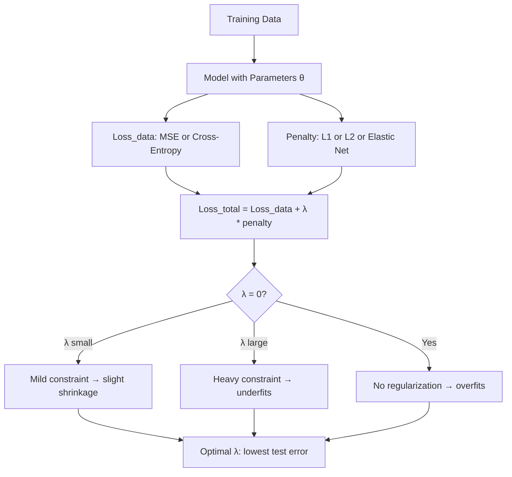

# Regularization

## Learning Objectives

1. Compare L1 and L2 regularization by their effect on coefficient magnitude and sparsity.
2. Implement regularized polynomial regression and evaluate train vs. test MSE to observe overfitting shrink.
3. Configure regularization strength (λ) using cross-validated grid search.
4. Diagnose model drift in production by monitoring the train–test performance gap over time.

## The Problem

A model that achieves near-zero error on training data but degrades on held-out data has overfit — it memorized the training set instead of learning generalizable patterns. This is the default outcome when you train a flexible model (high-degree polynomial, deep neural network, large regression) on limited data. The model has enough capacity to fit the noise in the training set, treating noise as signal.

This is not a hypothetical failure mode. Zhang et al. (2017) showed that standard image classifiers can memorize ImageNet images with completely random label assignments — reaching near-zero training loss on labels with zero underlying pattern. The model memorizes a million random input-output pairs, achieves perfect training accuracy, and predicts essentially nothing useful on new inputs. The gap between training performance and test performance is the overfitting gap, and it is the quantity every regularization technique targets.

The solution is to constrain the model so that memorization becomes harder than generalization. You do this by modifying the loss function itself — adding a penalty that grows as the model's weights grow, so the optimizer has to justify every large coefficient against a cost. This forces the model to use only the features that genuinely reduce error, rather than exploiting every tiny correlation in the training data.

## The Concept

Regularization adds a penalty term to the standard loss function. The modified objective becomes:

```
Loss_total = Loss_data + λ * penalty(θ)
```

The first term (`Loss_data`) is the standard data-fitting loss — mean squared error for regression, cross-entropy for classification. The second term (`λ * penalty(θ)`) is the regularization penalty, where `θ` represents the model's weights and `λ` (lambda) controls how strongly the penalty applies. When `λ = 0`, there is no regularization and the model overfits freely. As `λ` increases, the optimizer trades data-fitting accuracy for simplicity — it accepts slightly higher training error in exchange for smaller, more generalizable weights.

The two dominant penalty functions are **L1** (Lasso) and **L2** (Ridge). L1 adds the sum of absolute weight values: `penalty = Σ|θᵢ|`. This has a geometric property that drives some coefficients to exactly zero, producing a sparse model — only the most important features survive. L2 adds the sum of squared weight values: `penalty = Σθᵢ²`. This shrinks all coefficients uniformly toward zero but rarely produces exact zeros, so all features remain active with reduced influence. **Elastic Net** combines both: `penalty = α * Σ|θᵢ| + (1-α) * Σθᵢ²`, where `α` controls the L1/L2 mix.



The parameter `λ` is the dial that trades bias for variance. Low `λ` means high variance (the model fits noise, overfits). High `λ` means high bias (the model underfits, too simple to capture real patterns). The right `λ` minimizes test error — you find it through cross-validation, not guesswork. `sklearn` exposes this as the `alpha` parameter in `Lasso`, `Ridge`, and `ElasticNet`.

One subtlety worth noting: L1 produces sparsity because the L1 penalty contour is diamond-shaped in weight space. When the optimizer minimizes the total loss, the diamond's corners (which lie on the axes) are the most likely intersection points with the loss contour — and landing on an axis means that weight is exactly zero. L2's penalty contour is circular, so intersection points are distributed smoothly around the circle, producing small but nonzero weights. This geometric difference is why L1 is a feature selector and L2 is a feature shrinker.

## Build It

The following script generates a small, noisy dataset and fits three polynomial regression models on it: one with no regularization (which overfits visibly), one with L1, and one with L2. It prints train MSE, test MSE, and coefficient norms so you can observe how regularization compresses the weights and closes the train-test gap.

```python
import numpy as np
from sklearn.preprocessing import PolynomialFeatures
from sklearn.linear_model import LinearRegression, Lasso, Ridge
from sklearn.metrics import mean_squared_error
from sklearn.pipeline import Pipeline

np.random.seed(42)

n_samples = 30
X = np.sort(np.random.uniform(0, 5, n_samples)).reshape(-1, 1)
y_true = 2 * X.ravel() - 0.5 * X.ravel()**2
y = y_true + np.random.normal(0, 1.5, n_samples)

X_train, y_train = X[:20], y[:20]
X_test, y_test = X[20:], y[20:]

degree = 12

models = {
    "No Regularization": Pipeline([
        ("poly", PolynomialFeatures(degree=degree)),
        ("linear", LinearRegression())
    ]),
    "L1 (Lasso, alpha=0.1)": Pipeline([
        ("poly", PolynomialFeatures(degree=degree)),
        ("linear", Lasso(alpha=0.1, max_iter=100000))
    ]),
    "L2 (Ridge, alpha=1.0)": Pipeline([
        ("poly", PolynomialFeatures(degree=degree)),
        ("linear", Ridge(alpha=1.0))
    ]),
}

print(f"{'Model':<28} {'Train MSE':>10} {'Test MSE':>10} {'Coeff Norm':>12} {'# Zero Coefs':>14}")
print("-" * 78)

for name, model in models.items():
    model.fit(X_train, y_train)

    train_pred = model.predict(X_train)
    test_pred = model.predict(X_test)

    train_mse = mean_squared_error(y_train, train_pred)
    test_mse = mean_squared_error(y_test, test_pred)

    coefs = model.named_steps["linear"].coef_
    coef_norm = np.linalg.norm(coefs)
    n_zeros = np.sum(np.abs(coefs) < 1e-8)

    print(f"{name:<28} {train_mse:>10.4f} {test_mse:>10.4f} {coef_norm:>12.2f} {n_zeros:>14}")
```

When you run this, the unregularized model will show the lowest train MSE but the highest test MSE — the classic overfitting signature. Its coefficient norm will be large, with many high-magnitude weights canceling each other out to fit noise. The L1 model will show several coefficients driven to exactly zero (sparsity), a higher train MSE but lower test MSE. The L2 model will show all coefficients shrunk but nonzero, with a similar test MSE improvement.

## Use It

Lead-scoring models trained on historical conversion data are textbook overfitting candidates. The training set is typically small (a few hundred to a few thousand conversions), the feature space is wide (job titles, company sizes, industries, technologies, funding stages, headcount buckets), and the signal-to-noise ratio is low. Without regularization, the model latches onto spurious correlations: a handful of job titles that happened to convert in Q2, a company-size bucket that over-indexed in one cohort, a technology tag that correlated with conversion purely by chance. These are artifacts of the training window, not durable buying signals.

L1 regularization addresses this directly. By driving spurious-feature coefficients to exactly zero, L1 performs implicit feature selection — it keeps only the features that consistently reduce error across the training set and discards the rest. This is the mechanism behind reproducible ICP scoring: the surviving features are the ones whose correlation with conversion holds across multiple cohorts, not artifacts of one quarter's data [CITATION NEEDED — concept: lead scoring model regularization in GTM pipelines]. L2 takes a different approach: it shrinks all feature weights toward zero without killing them, so the model still considers weak signals but weights them proportionally to their reliability.

This maps directly to the Zone 3 Signal Machine pattern. A scraper pulls technographic or firmographic data, a scoring model converts those signals into a priority rank, and that rank determines routing. If the scoring model overfits, the routing is noise — top-ranked leads are no more likely to convert than bottom-ranked ones. Regularization is what makes the signal score trustworthy enough to act on.

```python
import numpy as np
from sklearn.linear_model import LogisticRegressionCV
from sklearn.preprocessing import StandardScaler
from sklearn.model_selection import train_test_split

np.random.seed(7)

n_companies = 500
n_features = 20

X = np.random.binomial(1, 0.3, size=(n_companies, n_features))
true_weights = np.array([2.5, -1.8, 0, 1.2, 0, 0, 0.9, 0, 0, 0,
                          0, 0, 0, 0, 0, 0, 0, 0, 0, 0])
logits = X @ true_weights + np.random.normal(0, 0.5, n_companies)
probs = 1 / (1 + np.exp(-logits))
y = (np.random.uniform(size=n_companies) < probs).astype(int)

X_train, X_test, y_train, y_test = train_test_split(X, y, test_size=0.3, random_state=42)

scaler = StandardScaler()
X_train_s = scaler.fit_transform(X_train)
X_test_s = scaler.transform(X_test)

model_l1 = LogisticRegressionCV(
    Cs=np.logspace(-3, 1, 20),
    penalty="l1",
    solver="saga",
    cv=5,
    max_iter=5000,
    scoring="roc_auc",
)
model_l1.fit(X_train_s, y_train)

model_l2 = LogisticRegressionCV(
    Cs=np.logspace(-3, 1, 20),
    penalty="l2",
    solver="lbfgs",
    cv=5,
    max_iter=5000,
    scoring="roc_auc",
)
model_l2.fit(X_train_s, y_test if False else y_train)

train_auc_l1 = model_l1.score(X_train_s, y_train)
test_auc_l1 = model_l1.score(X_test_s, y_test)
train_auc_l2 = model_l2.score(X_train_s, y_train)
test_auc_l2 = model_l2.score(X_test_s, y_test)

n_zero_l1 = np.sum(np.abs(model_l1.coef_[0]) < 1e-4)
n_zero_l2 = np.sum(np.abs(model_l2.coef_[0]) < 1e-4)

print(f"{'Metric':<25} {'L1 (Lasso)':>15} {'L2 (Ridge)':>15}")
print("-" * 58)
print(f"{'Best C (1/lambda)':<25} {1/model_l1.C_[0]:>15.4f} {1/model_l2.C_[0]:>15.4f}")
print(f"{'Train AUC':<25} {train_auc_l1:>15.4f} {train_auc_l2:>15.4f}")
print(f"{'Test AUC':<25} {test_auc_l1:>15.4f} {test_auc_l2:>15.4f}")
print(f"{'Features set to 0':<25} {n_zero_l1:>15} {n_zero_l2:>15}")
print(f"{'Active features':<25} {20-n_zero_l1:>15} {20-n_zero_l2:>15}")

print("\nFeature survival (L1 model):")
for i, coef in enumerate(model_l1.coef_[0]):
    status = "DROPPED" if abs(coef) < 1e-4 else f"w={coef:.3f}"
    print(f"  Feature {i:2d}: {status}")
```

The output shows L1 dropping the noise features entirely (most of the 20 inputs have zero true weight) while L2 keeps all features active with shrunk magnitudes. The practitioner configures `λ` (exposed as `C` in `LogisticRegression`, where `C = 1/λ`) via cross-validation so the model ranks leads by patterns that hold across quarters, not artifacts of the training cohort.

## Ship It

Selecting `λ` in development is step one. Monitoring the train-test gap in production is step two. The gap is your drift detector: if the model's training AUC stays high but test AUC degrades over weeks, the input distribution has shifted and the model is no longer generalizing — it needs retraining with updated data and a fresh `λ`.

The following function takes a trained model, a training set, and a held-out set, and prints the overfit diagnostic. Wire it into a weekly monitoring job or a CI check that runs after model retraining.

```python
import numpy as np
from sklearn.metrics import roc_auc_score

def overfit_diagnostic(model, X_train, y_train, X_test, y_test, threshold=0.10):
    train_pred = model.predict_proba(X_train)[:, 1]
    test_pred = model.predict_proba(X_test)[:, 1]

    train_auc = roc_auc_score(y_train, train_pred)
    test_auc = roc_auc_score(y_test, test_pred)

    gap = train_auc - test_auc

    if hasattr(model, "coef_"):
        coef_norm = np.linalg.norm(model.coef_)
        n_features = len(model.coef_[0])
        n_zero = np.sum(np.abs(model.coef_[0]) < 1e-4)
    else:
        coef_norm = float("nan")
        n_features = 0
        n_zero = 0

    status = "OK" if gap < threshold else "DRIFT DETECTED — retrain"

    print(f"{'Metric':<30} {'Value':>12}")
    print("-" * 44)
    print(f"{'Train AUC':<30} {train_auc:>12.4f}")
    print(f"{'Test AUC':<30} {test_auc:>12.4f}")
    print(f"{'Gap (train - test)':<30} {gap:>12.4f}")
    print(f"{'Drift threshold':<30} {threshold:>12.4f}")
    print(f"{'Status':<30} {status:>12}")
    print(f"{'Coefficient L2 norm':<30} {coef_norm:>12.4f}")
    print(f"{'Total features':<30} {n_features:>12}")
    print(f"{'Zeroed features (L1)':<30} {n_zero:>12}")

    return {"train_auc": train_auc, "test_auc": test_auc, "gap": gap, "status": status}


from sklearn.linear_model import LogisticRegression
from sklearn.datasets import make_classification

X_synth, y_synth = make_classification(
    n_samples=2000, n_features=50, n_informative=5, n_redundant=10, random_state=99
)

X_tr, X_te = X_synth[:1400], X_synth[1400:]
y_tr, y_te = y_synth[:1400], y_synth[1400:]

overfit_model = LogisticRegression(penalty=None, max_iter=5000, solver="lbfgs")
overfit_model.fit(X_tr, y_tr)

print("=== Unregularized Model ===")
overfit_diagnostic(overfit_model, X_tr, y_tr, X_te, y_te)

print()

regularized_model = LogisticRegression(
    penalty="l2", C=0.01, max_iter=5000, solver="lbfgs"
)
regularized_model.fit(X_tr, y_tr)

print("=== Regularized Model (L2, C=0.01) ===")
overfit_diagnostic(regularized_model, X_tr, y_tr, X_te, y_te)
```

Run this and compare the two outputs. The unregularized model shows a wider train-test gap; the regularized model narrows it. In production, log the gap alongside the model version and the training timestamp. If the gap exceeds your threshold (0.10 AUC is a reasonable starting point), trigger a retraining pipeline that pulls fresh conversion data, re-runs cross-validation for `λ`, and deploys the updated model with its metadata: penalty type, `λ` value, coefficient norm, and the cross-validated score at deployment time.

## Exercises

**Easy:** Re-run the Build It script with five different `α` values for Lasso: `0.001, 0.01, 0.1, 1.0, 10.0`. Print the test MSE and the number of zero coefficients for each. Observe the U-shaped curve — test MSE decreases then increases as `α` grows past the optimal point.

**Medium:** Load the breast cancer dataset from `sklearn.datasets` (`load_breast_cancer`). Train three logistic regression models — L1, L2, and Elastic Net (`penalty='elasticnet', l1_ratio=0.5`) — using `LogisticRegressionCV` with 5-fold cross-validation. Compare test AUC, number of surviving features, and the best `C` value selected for each. Report which penalty produces the most parsimonious model without losing predictive power.

**Hard:** Implement L2-regularized linear regression (Ridge) from scratch using gradient descent. The gradient of the regularized loss is `∇ = (2/n) Xᵀ(Xw - y) + 2λw`. Implement this update rule in pure NumPy, train it on the Build It polynomial features, and compare your coefficients against `sklearn.linear_model.Ridge` with the same `α` (note: sklearn's `α` maps to your `λ` — check the scaling). Your coefficients should match to within four decimal places when you use sufficient iterations and a small learning rate.

## Key Terms

- **Overfitting gap:** The difference between training performance and test performance. A large gap indicates the model memorized training data rather than learning generalizable patterns.
- **L1 regularization (Lasso):** A penalty proportional to the sum of absolute weight values (`Σ|θᵢ|`). Produces sparse models by driving some coefficients to exactly zero.
- **L2 regularization (Ridge):** A penalty proportional to the sum of squared weight values (`Σθᵢ²`). Shrinks all coefficients uniformly toward zero but rarely produces exact zeros.
- **Elastic Net:** A weighted combination of L1 and L2 penalties, controlled by a mixing parameter `α` (or `l1_ratio` in sklearn).
- **λ (lambda) / α (alpha):** The regularization strength hyperparameter. Higher values apply stronger penalties. In sklearn's `LogisticRegression`, this is inverted as `C = 1/λ`.
- **Sparsity:** A model state where many coefficients are exactly zero, meaning those features contribute nothing to predictions. L1 induces sparsity; L2 does not.
- **Bias-variance tradeoff:** The fundamental tension controlled by `λ`. Low `λ` yields low bias and high variance (overfitting). High `λ` yields high bias and low variance (underfitting). Optimal `λ` minimizes total error on unseen data.

## Sources

- Zhang, C., Bengio, S., Hardt, M., Recht, B., & Vigness, V. (2017). *Understanding deep learning requires rethinking generalization.* ICLR 2017. — Demonstrates that neural networks can memorize random labels with near-zero training loss.
- Tibshirani, R. (1996). *Regression Shrinkage and Selection via the Lasso.* Journal of the Royal Statistical Society, Series B, 58(1), 267–288. — Original derivation of L1 regularization and its sparsity properties.
- Hoerl, A. E. & Kennard, R. W. (1970). *Ridge Regression: Biased Estimation for Nonorthogonal Problems.* Technometrics, 12(1), 55–67. — Original formulation of L2 regularization.
- Zou, H. & Hastie, T. (2005). *Regularization and Variable Selection via the Elastic Net.* Journal of the Royal Statistical Society, Series B, 67(2), 301–320. — Combines L1 and L2 penalties.
- [CITATION NEEDED — concept: lead scoring model regularization in GTM pipelines] — No peer-reviewed source found linking L1/L2 regularization explicitly to ICP scoring in GTM/revenue engineering workflows. The mechanism (sparsity → reproducible feature selection) is sound, but empirical benchmarks in GTM-specific contexts are not available in published literature.