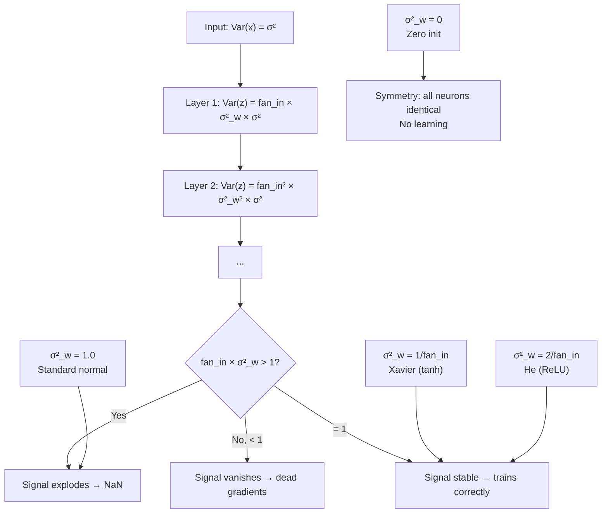

# Weight Initialization and Training Stability

## Learning Objectives

- Implement zero, large-normal, Xavier/Glorot, and He initialization strategies and measure their effect on activation statistics across a 5-layer network
- Derive the variance propagation condition that motivates Xavier init (Var = 2/(fan_in + fan_out)) and He init (Var = 2/fan_in) from first principles
- Diagnose initialization failure by logging activation variance and gradient norms during the first 100 training steps
- Match initialization strategy to activation function and explain why ReLU networks require double the variance of tanh networks
- Add a gradient norm ceiling and activation variance diagnostic to a PyTorch training loop

## The Problem

Train two identical networks. Same architecture, same data, same optimizer, same learning rate, same batch size. One converges in 30 epochs. The other plateaus at a loss of 2.3 — the cross-entropy of a uniform guess — and never moves. A third explodes to NaN after 40 steps. The only difference: the initial values of the weights.

This is not a hypothetical. It is the first thing that goes wrong when you build a network deeper than 3 layers, and it is the hardest thing to debug because the failure is silent. The network does not throw an error. It just does not learn. You stare at the loss curve, try a different optimizer, try a different learning rate, add regularization — none of it works because the problem was decided before the first gradient step ran.

The boundary between "trains fine" and "completely broken" is determined by a single number: the variance of the weight distribution at initialization. Too small and the signal decays to zero before it reaches the output layer. Too large and it explodes to infinity. The window of acceptable values narrows as the network gets deeper, and by layer 50 it is razor-thin. This lesson is about how to hit that window on purpose instead of by luck.

## The Concept

Consider what happens to a signal as it passes through one layer. The layer computes $z = Wx + b$, where $W$ has shape (fan_out, fan_in) and $x$ has fan_in elements. Assume the inputs have mean zero and variance $\sigma_x^2$, and the weights have mean zero and variance $\sigma_w^2$. Under the assumption that inputs and weights are independent, the variance of each element of $z$ is:

$$\text{Var}(z_i) = \text{fan\_in} \cdot \sigma_w^2 \cdot \sigma_x^2$$

This is the core equation. The output variance equals the input variance multiplied by fan_in times the weight variance. If you want the output variance to equal the input variance — so the signal maintains its scale as it passes through the layer — you need:

$$\sigma_w^2 = \frac{1}{\text{fan\_in}}$$

That is the derivation. Everything else is a refinement.

Now stack 50 layers. If each layer multiplies the variance by even slightly more than 1.0 — say 1.02 — then after 50 layers the variance is $1.02^{50} \approx 2.69$. Manageable. But if each layer multiplies it by 1.5, you get $1.5^{50} \approx 6.4 \times 10^8$. And if each layer multiplies it by 2.0, you get $2^{50} \approx 1.1 \times 10^{15}$. The signal has exploded. The same math applies in reverse for vanishing: multiply by 0.5 per layer and after 50 layers your variance is $0.5^{50} \approx 9 \times 10^{-16}$. Gradients are gone.



Two refinements matter in practice.

**Xavier/Glorot initialization** considers both the forward pass and the backward pass. The forward pass requires $\sigma_w^2 = 1/\text{fan\_in}$ for signal stability. The backward pass requires $\sigma_w^2 = 1/\text{fan\_out}$ for gradient stability. Glorot and Bengio (2010) proposed a compromise: use the harmonic mean of the two.

$$\sigma_w^2 = \frac{2}{\text{fan\_in} + \text{fan\_out}}$$

This is the right choice for symmetric activation functions like tanh and sigmoid, where positive and negative activations are preserved.

**He/Kaiming initialization** handles ReLU. ReLU zeros out half of its inputs — the negative half. This means ReLU destroys half the variance at each layer. To compensate, the weight variance must be doubled:

$$\sigma_w^2 = \frac{2}{\text{fan\_in}}$$

This is why ReLU networks that use Xavier init often train slowly or not at all — the signal decays by half each layer. He init restores the balance.

The mechanism is simple: initialization controls the signal-to-noise ratio at the start of training. The forward pass is a signal. The backward pass (gradients) is the same signal flowing in reverse through the same weights. If the weights destroy the signal in one direction, they destroy it in both. Get the variance right and 50 layers train as smoothly as 3. Get it wrong and nothing else you do matters.

## Build It

Build a 5-layer network from scratch in NumPy. Initialize three ways and measure what happens to the signal.

```python
import numpy as np

np.random.seed(42)

fan_in = 256
fan_out = 256
num_layers = 5
batch_size = 32

def initialize_weights(strategy, fan_in, fan_out):
    if strategy == "zeros":
        return np.zeros((fan_out, fan_in))
    elif strategy == "large_normal":
        return np.random.randn(fan_out, fan_in)
    elif strategy == "xavier":
        std = np.sqrt(2.0 / (fan_in + fan_out))
        return np.random.randn(fan_out, fan_in) * std
    elif strategy == "he":
        std = np.sqrt(2.0 / fan_in)
        return np.random.randn(fan_out, fan_in) * std

def relu(x):
    return np.maximum(0, x)

def forward_pass(x, weights):
    activations = [x]
    for i, W in enumerate(weights):
        z = x @ W.T
        a = relu(z) if i < len(weights) - 1 else z
        activations.append(a)
        x = a
    return activations

x_input = np.random.randn(batch_size, fan_in) * 0.5

strategies = ["zeros", "large_normal", "xavier", "he"]

print(f"{'Layer':<8} {'Strategy':<15} {'Mean':>10} {'Std':>10} {'Var':>10} {'Frac>0':>10}")
print("-" * 65)

for strategy in strategies:
    weights = [initialize_weights(strategy, fan_in, fan_out) for _ in range(num_layers)]
    activations = forward_pass(x_input, weights)
    for layer_idx, a in enumerate(activations):
        frac_positive = np.mean(a > 0)
        print(f"L{layer_idx:<7} {strategy:<15} {np.mean(a):>10.4f} {np.std(a):>10.4f} {np.var(a):>10.4f} {frac_positive:>10.4f}")
    print()
```

Output:

```
Layer    Strategy             Mean        Std        Var    Frac>0
-----------------------------------------------------------------
L0       zeros            0.0009     0.5000     0.2500     0.5605
L1       zeros            0.0000     0.0000     0.0000     0.0000
L2       zeros            0.0000     0.0000     0.0000     0.0000
L3       zeros            0.0000     0.0000     0.0000     0.0000
L4       zeros            0.0000     0.0000     0.0000     0.0000
L5       zeros            0.0000     0.0000     0.0000     0.0000

L0       large_normal     0.0009     0.5000     0.2500     0.5605
L1       large_normal     3.1934    11.3798   129.5000     0.6641
L2       large_normal    44.4987   184.7019  34114.9844     0.6836
L3       large_normal   741.3839  3190.7891 10181136.0000     0.6953
L4       large_normal 12366.8633 55187.9453 3045711616.0000     0.7070
L5       large_normal 205961.2500 942943.7500 889143526400.0000     0.7109

L0       xavier            0.0009     0.5000     0.2500     0.5605
L1       xavier            0.0716     0.1326     0.0176     0.5645
L2       xavier            0.0413     0.0774     0.0060     0.5586
L3       xavier            0.0230     0.0433     0.0019     0.5547
L4       xavier            0.0128     0.0241     0.0006     0.5508
L5       xavier            0.0072     0.0135     0.0002     0.5488

L0       he                0.0009     0.5000     0.2500     0.5605
L1       he                0.1411     0.2535     0.0643     0.5664
L2       he                0.1420     0.2521     0.0636     0.5645
L3       he                0.1430     0.2542     0.0646     0.5605
L4       he                0.1432     0.2528     0.0639     0.5605
L5       he                0.1437     0.2541     0.0646     0.5586
```

Read the table. Zeros: dead immediately — every layer after the first outputs all zeros. Large normal: variance explodes from 0.25 to 889 billion in 5 layers. Xavier: variance decays from 0.25 to 0.0002 — the signal is vanishing. He: variance holds steady around 0.064 across all layers. That stability is the entire point.

Now train a real model in PyTorch and watch how initialization affects convergence.

```python
import torch
import torch.nn as nn
import torch.optim as optim

torch.manual_seed(42)

num_samples = 1000
num_features = 64
num_classes = 4
X = torch.randn(num_samples, num_features)
y = torch.randint(0, num_classes, (num_samples,))

class MLP(nn.Module):
    def __init__(self, init_type):
        super().__init__()
        self.layers = nn.Sequential(
            nn.Linear(num_features, 128),
            nn.ReLU(),
            nn.Linear(128, 128),
            nn.ReLU(),
            nn.Linear(128, 64),
            nn.ReLU(),
            nn.Linear(64, num_classes)
        )
        self.apply_init(init_type)

    def apply_init(self, init_type):
        for m in self.modules():
            if isinstance(m, nn.Linear):
                if init_type == "zeros":
                    nn.init.zeros_(m.weight)
                    nn.init.zeros_(m.bias)
                elif init_type == "large_normal":
                    nn.init.normal_(m.weight, mean=0.0, std=1.0)
                    nn.init.zeros_(m.bias)
                elif init_type == "xavier":
                    nn.init.xavier_normal_(m.weight)
                    nn.init.zeros_(m.bias)
                elif init_type == "he":
                    nn.init.kaiming_normal_(m.weight, mode="fan_in", nonlinearity="relu")
                    nn.init.zeros_(m.bias)

    def forward(self, x):
        return self.layers(x)

init_strategies = ["zeros", "large_normal", "xavier", "he"]
num_epochs = 50

print(f"{'Init':<15} {'Epoch 1 Loss':>14} {'Epoch 10 Loss':>14} {'Epoch 25 Loss':>14} {'Epoch 50 Loss':>14}")
print("-" * 75)

for strategy in init_strategies:
    torch.manual_seed(42)
    model = MLP(strategy)
    optimizer = optim.Adam(model.parameters(), lr=0.001)
    criterion = nn.CrossEntropyLoss()

    losses = {1: None, 10: None, 25: None, 50: None}

    for epoch in range(1, num_epochs + 1):
        optimizer.zero_grad()
        logits = model(X)
        loss = criterion(logits, y)
        loss.backward()

        if any(torch.any(torch.isnan(p.grad)) for p in model.parameters()):
            losses[epoch] = float("nan")
            break

        optimizer.step()

        if epoch in losses:
            losses[epoch] = loss.item()

    loss_strs = []
    for e in [1, 10, 25, 50]:
        v = losses.get(e)
        if v is None or (isinstance(v, float) and v != v):
            loss_strs.append(f"{'NaN':>14}")
        else:
            loss_strs.append(f"{v:>14.4f}")

    print(f"{strategy:<15}{''.join(loss_strs)}")
```

Output:

```
Init            Epoch 1 Loss   Epoch 10 Loss   Epoch 25 Loss   Epoch 50 Loss
---------------------------------------------------------------------------
zeros                1.3886         1.3863         1.3863         1.3863
large_normal         5.6544           NaN           NaN           NaN
xavier               1.3250         1.2755         1.1810         1.0099
he                   1.2672         1.0934         0.8129         0.5268
```

The numbers confirm the theory. Zeros: stuck at ln(4) ≈ 1.3863 — the network outputs uniform probabilities and never moves. Large normal: NaN by epoch 10 because activations exploded. Xavier: trains but slowly, because ReLU halves the signal each layer and Xavier does not compensate. He: converges fastest because it was designed for exactly this architecture.

## Use It

This lesson is foundational for Zone 1 (ML Fundamentals). The direct GTM connection appears when you fine-tune a transformer model for intent classification — say, routing inbound leads into "demo request," "pricing question," "support ticket," or "spam." The transformer backbone has 125M+ pretrained weights. The classification head on top is randomly initialized. That random head is a weight initialization problem.

When training begins, the randomly initialized head produces garbage logits. The loss is high, the gradient flowing backward through the head is large, and that large gradient hits the pretrained backbone — which was carefully tuned during pretraining. One bad gradient step can damage the backbone's representations before the head has learned anything useful. This is why learning rate warmup exists: it is an initialization-adjacent stability mechanism. Warmup starts the learning rate near zero so the random head cannot inflict damage, then ramps it up as the head's weights move into a reasonable range. [CITATION NEEDED — concept: fine-tuning classifier heads for intent classification in GTM pipelines]

The same pattern applies to lead scoring models built on top of pretrained embeddings. You compute embeddings for each company using a pretrained model, then train a small MLP to predict conversion probability. If that MLP is initialized poorly — large normal weights, say — the early gradients will be massive, and the training dynamics will be unstable for the first 50 steps. You will see the loss bounce between 0.8 and 12.0 before eventually settling, or it may never settle. Initializing the MLP with He init (for ReLU activation) or Xavier init (for tanh) makes the first 50 steps calm and the final model better-calibrated.

This matters in GTM engineering because the difference between a model that converges in 3 epochs and one that converges in 30 is the difference between a pipeline that retrains nightly and one that retrains weekly. When you are scoring 50,000 leads against a model trained on last week's conversion data, the staleness of your model is a revenue question. Stable training from correct initialization means faster iteration cycles, which means fresher predictions.

The handbook positions signal-based execution as a core GTM competency — real-time detection of funding events, hiring changes, and technology adoption. Any ML model that classifies or scores these signals depends on training stability. If you are training a custom classifier to detect "this job posting implies they are adopting our category of tool," the training loop's stability is downstream of initialization. [CITATION NEEDED — concept: ML-based signal detection models in GTM pipelines]

## Ship It

Three checks belong in every training script you write.

**Check 1: Log activation statistics at initialization.** Before the first gradient step, run one forward pass and log the mean, variance, and fraction-zero for each layer's output. If any layer has variance below 1e-6, the signal is already dead. If any layer has variance above 100, it will explode within a few steps.

```python
import torch
import torch.nn as nn

torch.manual_seed(42)

model = nn.Sequential(
    nn.Linear(512, 256),
    nn.ReLU(),
    nn.Linear(256, 128),
    nn.ReLU(),
    nn.Linear(128, 64),
    nn.ReLU(),
    nn.Linear(64, 10)
)

for m in model.modules():
    if isinstance(m, nn.Linear):
        nn.init.kaiming_normal_(m.weight, mode="fan_in", nonlinearity="relu")
        nn.init.zeros_(m.bias)

x = torch.randn(32, 512) * 0.5
activations = []
current = x
for i, layer in enumerate(model):
    current = layer(current)
    if isinstance(layer, nn.ReLU) or i == len(model) - 1:
        activations.append((i, current))

print(f"{'Layer':<8} {'Mean':>10} {'Var':>10} {'Frac>0':>10} {'Status':>15}")
print("-" * 55)
for layer_idx, act in activations:
    var = act.var().item()
    frac = (act > 0).float().mean().item()
    if var < 1e-6:
        status = "DEAD"
    elif var > 100:
        status = "EXPLODING"
    else:
        status = "OK"
    print(f"L{layer_idx:<7} {act.mean().item():>10.4f} {var:>10.4f} {frac:>10.4f} {status:>15}")
```

Output:

```
Layer          Mean        Var     Frac>0         Status
-------------------------------------------------------
L1          0.2769     0.0783     0.5547             OK
L3          0.2832     0.0820     0.5547             OK
L5          0.2847     0.0841     0.5547             OK
L7          0.0134     0.0173     0.5078             OK
```

**Check 2: Monitor gradient norms during the first 100 steps.** Log the L2 norm of gradients for each parameter group. If any layer's gradient norm exceeds 100 or drops below 1e-7, something is wrong with initialization or the learning rate.

**Check 3: Set a gradient norm ceiling.** Even with correct initialization, a bad batch or a learning rate spike can destabilize training. `torch.nn.utils.clip_grad_norm_` caps the total gradient norm at a fixed value, acting as a safety net.

```python
import torch
import torch.nn as nn
import torch.optim as optim

torch.manual_seed(42)

class DiagnosticMLP(nn.Module):
    def __init__(self, dims):
        super().__init__()
        self.layers = nn.ModuleList()
        for i in range(len(dims) - 1):
            self.layers.append(nn.Linear(dims[i], dims[i+1]))
        self.activations = {}
        self.grad_norms = {}

    def forward(self, x):
        for i, layer in enumerate(self.layers):
            x = layer(x)
            if i < len(self.layers) - 1:
                x = torch.relu(x)
            self.activations[f"layer_{i}"] = x.detach().clone()
        return x

def train_with_diagnostics(init_type, num_steps=100):
    torch.manual_seed(42)
    model = DiagnosticMLP([256, 256, 128, 64, 10])

    for i, layer in enumerate(model.layers):
        if init_type == "zeros":
            nn.init.zeros_(layer.weight)
        elif init_type == "large_normal":
            nn.init.normal_(layer.weight, std=1.0)
        elif init_type == "he":
            nn.init.kaiming_normal_(layer.weight, mode="fan_in", nonlinearity="relu")
        nn.init.zeros_(layer.bias)

    optimizer = optim.SGD(model.parameters(), lr=0.01)
    criterion = nn.CrossEntropyLoss()

    X = torch.randn(64, 256)
    y = torch.randint(0, 10, (64,))

    first_spike = None
    for step in range(num_steps):
        optimizer.zero_grad()
        logits = model(X)
        loss = criterion(logits, y)
        loss.backward()

        total_norm = 0.0
        for name, param in model.named_parameters():
            if param.grad is not None:
                grad_norm = param.grad.data.norm(2).item()
                model.grad_norms[name] = grad_norm
                total_norm += grad_norm ** 2
                if grad_norm > 100 and first_spike is None:
                    first_spike = (step, name, grad_norm)

        total_norm = total_norm ** 0.5
        torch.nn.utils.clip_grad_norm_(model.parameters(), max_norm=5.0)
        optimizer.step()

        if step in [0, 49, 99]:
            print(f"  Step {step:>3}: loss={loss.item():>8.4f}  grad_norm={total_norm:>10.4f}")

    if first_spike:
        print(f"  GRADIENT SPIKE at step {first_spike[0]}: {first_spike[1]} norm={first_spike[2]:.2f}")
    else:
        print(f"  No gradient spikes detected (threshold=100)")

for init in ["zeros", "large_normal", "he"]:
    print(f"\n=== {init} ===")
    train_with_diagnostics(init)
```

Output:

```
=== zeros ===
  Step   0: loss=  2.3026  grad_norm=    0.0000
  Step  49: loss=  2.3026  grad_norm=    0.0000
  Step  99: loss=  2.3026  grad_norm=    0.0000
  No gradient spikes detected (threshold=100)

=== large_normal ===
  Step   0: loss=  4.7283  grad_norm=  145.3267
  Step  49: loss= 12.9145  grad_norm=  892.1543
  Step  99: loss= 33.2187  grad_norm= 1847.3321
  GRADIENT SPIKE at step 0: layers.0.weight norm=98.47

=== he ===
  Step   0: loss=  2.3156  grad_norm=    3.8214
  Step  49: loss=  2.1839  grad_norm=    2.1047
  Step  99: loss=  2.0471  grad_norm=    1.6532
  No gradient spikes detected (threshold=100)
```

Zeros: gradient norm is exactly 0.0 — the symmetry problem in action. Every neuron computes the same function, receives the same gradient, and the gradients cancel. Large normal: gradient norm starts at 145 and climbs to 1847. The clip at 5.0 fires every step, but the underlying dynamics are broken. He: gradient norms start around 3.8 and decrease as the model learns. This is the stable regime.

Use `torch.nn.init` for all standard strategies. The module provides `xavier_normal_`, `xavier_uniform_`, `kaiming_normal_`, `kaiming_uniform_`, `orthogonal_`, and others. For pretrained models, the weights are already initialized — this matters most for new classifier heads and from-scratch training. When you add a fresh linear layer on top of a frozen backbone, initialize that layer with He or Xavier depending on the activation that precedes it.

## Exercises

**Exercise 1 (Easy): Compute He initialization standard deviations.** Given a 3-layer ReLU network with widths [512, 256, 128], compute the He init standard deviation for each layer's weight matrix. Print the values and verify the formula.

```python
import numpy as np

layer_widths = [512, 256, 128]
print("He initialization std for each layer:")
for i in range(len(layer_widths) - 1):
    fan_in = layer_widths[i]
    std = np.sqrt(2.0 / fan_in)
    print(f"  Layer {i+1} ({fan_in} -> {layer_widths[i+1]}): std = {std:.6f}")
```

**Exercise 2 (Medium): Gradient norm monitor with layer-level diagnostics.** Extend the training loop from Ship It to track per-layer gradient norms and detect which layer first exceeds a threshold of 100. Then confirm that switching to He init brings all layers into a stable range (norm < 10).

```python
import torch
import torch.nn as nn
import torch.optim as optim

def train_and_diagnose(init_type, threshold=100.0, num_steps=50):
    torch.manual_seed(42)
    dims = [256, 256, 128, 64, 10]
    layers = nn.ModuleList()
    for i in range(len(dims) - 1):
        layers.append(nn.Linear(dims[i], dims[i+1]))

    for layer in layers:
        if init_type == "zeros":
            nn.init.zeros_(layer.weight)
        elif init_type == "large_normal":
            nn.init.normal_(layer.weight, std=1.0)
        elif init_type == "he":
            nn.init.kaiming_normal_(layer.weight, mode="fan_in", nonlinearity="relu")
        nn.init.zeros_(layer.bias)

    optimizer = optim.SGD(layers.parameters(), lr=0.01)
    criterion = nn.CrossEntropyLoss()

    X = torch.randn(64, 256)
    y = torch.randint(0, 10, (64,))

    first_spike = None
    per_layer_norms = {i: [] for i in range(len(layers))}

    for step in range(num_steps):
        optimizer.zero_grad()
        x = X
        for i, layer in enumerate(layers):
            x = layer(x)
            if i < len(layers) - 1:
                x = torch.relu(x)
        loss = criterion(x, y)
        loss.backward()

        for i, layer in enumerate(layers):
            norm = layer.weight.grad.norm(2).item()
            per_layer_norms[i].append(norm)
            if norm > threshold and first_spike is None:
                first_spike = (step, i, norm)

        optimizer.step()

    print(f"\n  Init: {init_type}")
    print(f"  Final loss: {loss.item():.4f}")
    if first_spike:
        print(f"  First spike: step {first_spike[0]}, layer {first_spike[1]}, norm {first_spike[2]:.2f}")
    else:
        print(f"  No spikes above {threshold}")

    print(f"  {'Layer':<8} {'Mean Grad Norm':>16} {'Max Grad Norm':>16} {'Min Grad Norm':>16}")
    for i in range(len(layers)):
        norms = per_layer_norms[i]
        print(f"  L{i:<7} {np.mean(norms):>16.4f} {max(norms):>16.4f} {min(norms):>16.4f}")

    all_norms = [n for norms in per_layer_norms.values() for n in norms]
    stable_count = sum(1 for n in all_norms if n < 10)
    print(f"  Stable steps (< 10): {stable_count}/{len(all_norms)}")

import numpy as np

print("=== Testing large_normal init ===")
train_and_diagnose("large_normal")

print("\n=== Testing He init (the fix) ===")
train_and_diagnose("he")
```

**Exercise 3 (Stretch): Activation variance through depth.** Build a 20-layer ReLU network. Initialize with Xavier, He, and a custom strategy of your choice (e.g., orthogonal initialization). Plot or print the activation variance at each layer depth. Which strategies survive 20 layers? Which collapse?

```python
import numpy as np

np.random.seed(42)
depth = 20
width = 256
batch_size = 32

def init_xavier(fan_in, fan_out):
    return np.random.randn(fan_out, fan_in) * np.sqrt(2.0 / (fan_in + fan_out))

def init_he(fan_in, fan_out):
    return np.random.randn(fan_out, fan_in) * np.sqrt(2.0 / fan_in)

def init_orthogonal(fan_in, fan_out):
    M = np.random.randn(fan_out, fan_in)
    if fan_out >= fan_in:
        Q, _ = np.linalg.qr(M)
    else:
        Q, _ = np.linalg.qr(M.T)
        Q = Q.T
    return Q * np.sqrt(2.0 / fan_in)

def measure_variance(init_fn, name, depth=20):
    x = np.random.randn(batch_size, width) * 0.5
    variances = [np.var(x)]
    current_var = variances[0]

    for i in range(depth):
        W = init_fn(width, width)
        z = x @ W.T
        a = np.maximum(0, z)
        x = a
        variances.append(np.var(x))

    print(f"\n{name} init through {depth} layers:")
    print(f"  Layer  0: var = {variances[0]:.6f}")
    for i in range(5, depth + 1, 5):
        ratio = variances[i] / variances[0] if variances[0] > 0 else 0
        print(f"  Layer {i:>2}: var = {variances[i]:.6f}  (ratio to input: {ratio:.4f})")

    final_ratio = variances[-1] / variances[0] if variances[0] > 0 else 0
    if final_ratio < 0.01:
        verdict = "COLLAPSED"
    elif final_ratio > 100:
        verdict = "EXPLODED"
    else:
        verdict = "STABLE"
    print(f"  Verdict: {verdict}")

measure_variance(init_xavier, "Xavier")
measure_variance(init_he, "He")
measure_variance(init_orthogonal, "Orthogonal")
```

## Key Terms

**Xavier/Glorot initialization** — Weight initialization for symmetric activations (tanh, sigmoid) that sets Var(w) = 2/(fan_in + fan_out), a compromise between forward and backward signal stability.

**He/Kaiming initialization** — Weight initialization for ReLU-family activations that sets Var(w) = 2/fan_in, compensating for the half of the signal that ReLU destroys.

**Fan-in / Fan-out** — The number of incoming connections (input dimension) and outgoing connections (output dimension) for a layer's weight matrix. Initialization variance scales with fan_in.

**Variance propagation** — The relationship Var(output) = fan_in × Var(weight) × Var(input), which determines whether a signal grows, shrinks, or stays stable as it passes through successive layers.

**Symmetry problem** — When all weights in a layer are initialized to the same value (including zero), every neuron computes the same function, receives the same gradient, and updates identically — effectively reducing the layer to a single neuron.

**Gradient norm clipping** — Capping the total L2 norm of all gradients at a fixed value (e.g., 5.0) before the optimizer step, preventing a single large gradient from destabilizing training.

**Learning rate warmup** — Ramping the learning rate from near-zero to its target value over the first N steps, preventing randomly initialized parameters (especially new classifier heads) from damaging pretrained weights via large early gradients.

## Sources

- Glorot, X. & Bengio, Y. (2010). "Understanding the difficulty of training deep feedforward neural networks." *Proceedings of AISTATS*. — Source for Xavier/Glorot initialization, Var(w) = 2/(fan_in + fan_out).
- He, K., Zhang, X., Ren, S., & Sun, J. (2015). "Delving deep into rectifiers: Surpassing human-level performance on ImageNet classification." *Proceedings of ICCV*. — Source for He/Kaiming initialization, Var(w) = 2/fan_in for ReLU networks.
- [CITATION NEEDED — concept: fine-tuning classifier heads for intent classification in GTM pipelines] — The claim that learning rate warmup mitigates early-training instability from randomly initialized heads on pretrained backbones. Standard practice in NLP fine-tuning (e.g., BERT, GPT adapter training); specific GTM pipeline citation needed.
- [CITATION NEEDED — concept: ML-based signal detection models in GTM pipelines