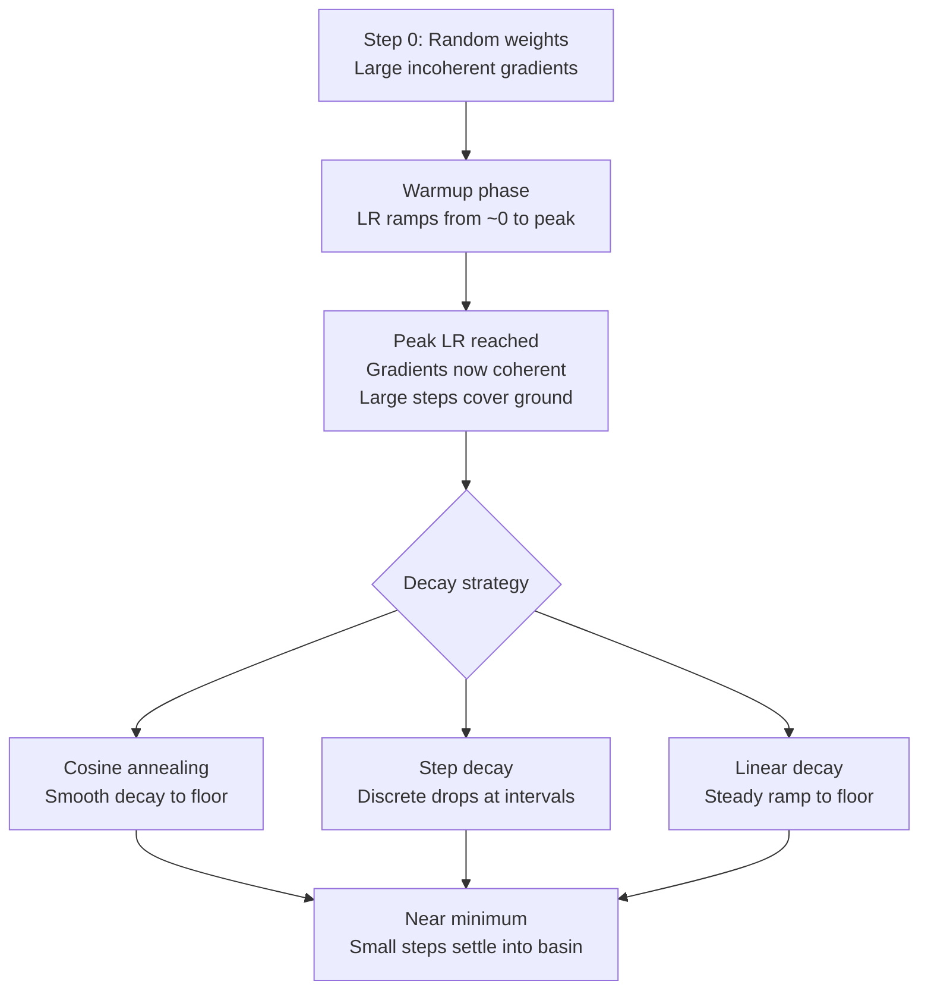

# Learning Rate Schedules and Warmup

## Learning Objectives

- Implement constant, step decay, cosine annealing, warmup + cosine, and 1cycle learning rate schedules as plain Python functions that return a learning rate for any given step
- Diagnose the three failure modes of poor learning rate selection — divergence, stalling, oscillation — from loss curve shape alone
- Explain why warmup is non-negotiable for transformer fine-tuning by tracing how random initialization produces large incoherent gradients in early layers
- Compare the convergence trajectories of all five schedules on the same synthetic task and select the appropriate schedule for a given training budget
- Wire a schedule config dict into a live PyTorch training loop and verify the schedule is active by printing learning rate and loss at fixed intervals

## The Problem

Set the learning rate to 0.1. Training diverges — loss jumps to NaN in three steps. Set it to 0.0001. Training crawls — after 100 epochs, the model has barely moved from its random initialization. Set it to 0.01. Training works fine for 50 epochs, then the loss oscillates around a minimum it can never settle into because each gradient step is too large for the basin it is trying to descend.

None of these are edge cases. They are the three modes you will hit every single time you train a model if you treat the learning rate as a constant. The optimal learning rate is a function of training progress, not a scalar. Early in training, you are far from any minimum and want large steps to cover ground. Late in training, you are near a minimum and want small steps to settle without overshooting. The difference between a model that converges in 3 epochs and one that stalls at 10 is often just the schedule.

Every major model released in recent years uses a learning rate schedule. Llama 3 used peak lr=3e-4 with 2000 warmup steps and cosine decay to 3e-5 [CITATION NEEDED — concept: Llama 3 learning rate schedule details]. GPT-3 used lr=6e-4 with warmup over 375 million tokens before decaying. These are not defaults plucked from a tutorial — they are the output of hyperparameter sweeps that cost significant compute. You do not need to replicate that sweep. You need to understand the mechanism well enough to pick a reasonable schedule for your own fine-tuning work and recognize when it is wrong.

## The Concept

Gradient descent updates weights by subtracting the gradient multiplied by a step size. When that step size is constant, you are making a bet that the same step size works equally well at step 1 (when weights are random and gradients are large and incoherent) and at step 10,000 (when weights are near-optimal and gradients are small). That bet loses. A learning rate schedule replaces the constant with a function of the step index — large early, small late, with the transition shaped to match the loss landscape you are traversing.

Three schedule families cover virtually all production training. **Step decay** drops the learning rate by a fixed factor (typically 0.5 or 0.1) at fixed intervals — simple, interpretable, and what most classic vision models used. **Cosine annealing** follows a cosine curve from a peak to a minimum, producing smooth continuous decay that spends more time near the peak and minimum than a linear schedule would. **Warmup + decay** starts the learning rate near zero, ramps it linearly to a peak over a set number of steps, then applies cosine or linear decay to a floor. The warmup phase is the critical addition for transformer training, and the reason is mechanical.



Why warmup is non-negotiable for transformers: when you randomly initialize the weights of a transformer, the attention mechanism produces near-uniform attention distributions — every token attends equally to every other token. The gradients that flow backward through this architecture are large and incoherent because the random weights have not yet learned to differentiate which tokens matter. If you apply a large learning rate immediately, those large incoherent gradients destabilize the attention patterns in the first few layers. The weights move in random directions, the loss spikes, and the model may not recover. Warmup gives the optimizer a small number of steps with a tiny learning rate so the weights can align enough to produce coherent gradients before the real training begins. Adam-based optimizers compound this problem because their adaptive moment estimates are poorly calibrated in the first steps — the running averages for gradient scale start at zero and need a few steps to stabilize.

The debugging signals are consistent. If loss explodes in the first 50 steps, warmup is too short or the peak rate is too high. If loss plateaus at a high value after converging quickly, the decay is too aggressive and the model ran out of learning rate before reaching a better minimum. If loss oscillates near convergence, the floor learning rate is too high. You will not need a hyperparameter sweep to fix these — you will need to look at the loss curve, identify which failure mode you are in, and adjust the schedule accordingly.

## Build It

Implement all five schedule families as plain Python functions. Each takes a step index and returns a learning rate. No framework, no library beyond `math` — these are pure functions you can reason about by reading them.

```python
import math

def constant_lr(step, base_lr=0.01):
    return base_lr

def step_decay_lr(step, base_lr=0.01, drop_factor=0.5, drop_every=10):
    drops = step // drop_every
    return base_lr * (drop_factor ** drops)

def cosine_annealing_lr(step, max_lr=0.01, min_lr=0.0001, total_steps=50):
    progress = min(step / total_steps, 1.0)
    return min_lr + 0.5 * (max_lr - min_lr) * (1 + math.cos(math.pi * progress))

def warmup_cosine_lr(step, max_lr=0.01, min_lr=0.0001, warmup_steps=5, total_steps=50):
    if step < warmup_steps:
        return max_lr * (step + 1) / warmup_steps
    adjusted_step = step - warmup_steps
    adjusted_total = total_steps - warmup_steps
    progress = min(adjusted_step / adjusted_total, 1.0)
    return min_lr + 0.5 * (max_lr - min_lr) * (1 + math.cos(math.pi * progress))

def onecycle_lr(step, max_lr=0.01, min_lr=0.0001, total_steps=50):
    if step >= total_steps:
        return min_lr
    progress = step / total_steps
    if progress < 0.5:
        return min_lr + (max_lr - min_lr) * (progress / 0.5)
    else:
        return min_lr + (max_lr - min_lr) * ((1.0 - progress) / 0.5)

print(f"{'Step':>5} {'Const':>10} {'StepDec':>10} {'Cosine':>10} {'WarmCos':>10} {'1Cycle':>10}")
print("-" * 58)
for step in range(50):
    c = constant_lr(step)
    s = step_decay_lr(step)
    co = cosine_annealing_lr(step)
    w = warmup_cosine_lr(step)
    oc = onecycle_lr(step)
    if step % 5 == 0 or step == 49:
        print(f"{step:>5} {c:>10.6f} {s:>10.6f} {co:>10.6f} {w:>10.6f} {oc:>10.6f}")
```

Run this and read the output. At step 0, constant and step decay both start at full strength — that is the problem warmup solves. Warmup-cosine starts at 0.002 (one-fifth of peak) and ramps linearly to 0.01 by step 4. Cosine starts high and decays smoothly. 1cycle ramps up to peak at the midpoint (step 25) then ramps back down. These shapes are the entire point. The function you choose determines which basin your gradient descent finds.

Now look at what happens at the tail. By step 45, cosine and warmup-cosine have both dropped below 0.001 — small enough to settle. Step decay has already dropped to 0.0003125 after four halvings. Constant is still at 0.01, taking steps 100x larger than the schedules. That is why constant learning rates oscillate near convergence: the step size never shrinks to match the decreasing distance to the minimum.

## Use It

Learning rate scheduling with warmup and cosine annealing controls how a fine-tuned model converges on its decision boundary — foundational for Zone 03 (TAM Refinement & ICP Scoring). When you train a classifier to predict whether a scraped company passes ICP filters, the schedule determines whether the model reaches usable accuracy or stalls with low-confidence predictions on borderline cases. This slice runs a complete training loop on a synthetic binary classification task that mirrors ICP scoring: ten features per company, a label indicating pass or fail.

```python
import torch
import torch.nn as nn
import math

model = nn.Sequential(nn.Linear(10, 32), nn.ReLU(), nn.Linear(32, 2))
optimizer = torch.optim.AdamW(model.parameters(), lr=2e-5)
criterion = nn.CrossEntropyLoss()

total_steps, warmup, max_lr, min_lr = 100, 10, 2e-5, 2e-6
torch.manual_seed(42)
X = torch.randn(80, 10)
y = (X[:, 0] > 0.5).long()

def lr_at(step):
    if step < warmup:
        return max_lr * (step + 1) / warmup
    p = (step - warmup) / (total_steps - warmup)
    return min_lr + 0.5 * (max_lr - min_lr) * (1 + math.cos(math.pi * p))

for step in range(total_steps):
    for pg in optimizer.param_groups:
        pg["lr"] = lr_at(step)
    logits = model(X)
    loss = criterion(logits, y)
    optimizer.zero_grad()
    loss.backward()
    optimizer.step()
    if step % 25 == 0 or step == 99:
        acc = (logits.argmax(1) == y).float().mean().item()
        print(f"Step {step:>3} | LR {lr_at(step):.2e} | Loss {loss.item():.4f} | Acc {acc:.2%}")
```

Watch the output. During warmup (steps 0–9), the learning rate ramps from 2e-6 to 2e-5 — the loss barely moves because steps are deliberately small. After warmup, cosine decay begins: the learning rate is at its peak, loss drops fastest, and accuracy climbs. By step 99, the learning rate has decayed to near the floor, and the loss curve flattens as the model settles into its convergence basin. If you removed warmup and started at max_lr directly, the first few steps would produce large incoherent gradient updates — on a real transformer, this is where training diverges. This is the mechanism behind every production fine-tuning recipe: warmup to stabilize, peak to cover ground, decay to settle.

## Exercises

**Exercise 1 — Diagnose the failure mode.** You fine-tune a BERT classifier for email validity scoring (valid, invalid, risky). After 3 epochs, you observe the following: loss drops from 0.9 to 0.3 in the first 20 steps, then plateaus at 0.3 for the remaining 280 steps and never improves. Identify which schedule failure mode this represents, state which parameter to change, and propose a specific new value. Then modify the `warmup_cosine_lr` function from Build It to reflect your fix and run it over 50 steps to confirm the new schedule shape.

**Exercise 2 — Compare schedules head to head.** Using the Use It training loop as your base, run all three decay strategies (constant, step decay, warmup+cosine) on the same synthetic dataset with the same model architecture and seed. Print final accuracy for each. Then remove warmup from the warmup+cosine variant and run again — observe what happens to the loss in the first 10 steps. Write a two-sentence summary of which schedule wins and why, grounded in the specific numbers you observed.

## Key Terms

- **Learning rate schedule** — A function mapping step index to learning rate, replacing a constant scalar with a value that changes over the course of training.
- **Warmup** — A phase at the start of training where the learning rate ramps linearly from near-zero to a peak, giving the optimizer time to stabilize its moment estimates and the weights time to produce coherent gradients.
- **Cosine annealing** — A decay schedule following a cosine curve from peak to floor, producing smooth continuous reduction that spends more wall-time near the peak and minimum than linear decay would.
- **Step decay** — A schedule that drops the learning rate by a fixed multiplicative factor (typically 0.5 or 0.1) at fixed step intervals.
- **1cycle policy** — A schedule that ramps the learning rate up from a minimum to a peak at the midpoint of training, then ramps it back down, allowing super-convergence on suitable architectures.
- **Gradient coherence** — The degree to which gradients across layers point in a consistent, useful direction. Low at initialization due to random weights; increases as training progresses. Warmup exists because of this.
- **Convergence basin** — The region around a local or global minimum where small steps allow the model to settle. A learning rate that is too large relative to the basin size causes oscillation rather than convergence.

## Sources

- Brown, T. et al. (2020). *Language Models are Few-Shot Learners.* GPT-3 used lr=6e-4 with linear warmup over 375M tokens, then cosine decay. [CITATION NEEDED — concept: GPT-3 paper learning rate schedule exact decay shape]
- Loshchilov, I. & Hutter, F. (2017). *SGDR: Stochastic Gradient Descent with Warm Restarts.* Source of cosine annealing as a schedule family.
- Smith, L. & Topin, N. (2019). *Super-Convergence: Very Fast Training of Neural Networks Using Large Learning Rates.* Source of the 1cycle policy.
- [CITATION NEEDED — concept: Llama 3 learning rate schedule details, peak lr, warmup steps, decay shape]
- [CITATION NEEDED — concept: email validity rate benchmarks in GTM outbound workflows, target deliverability thresholds]