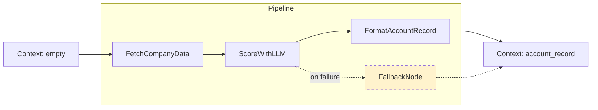

# Build Your Own Mini Framework

## Learning Objectives

1. Implement a composable pipeline framework using `Node`, `Pipeline`, and `Context` primitives that resolves execution order from a chain of declared dependencies.
2. Configure retry and fallback behavior at the node level, including exponential backoff and exhausted-retry propagation.
3. Build a conditional branching node that routes execution to one of two downstream paths based on a runtime predicate.
4. Compare the architecture of a custom mini-framework against production orchestration tools (LangChain's `RunnableSequence`, Prefect's task graph) by identifying which abstractions each adds and which it omits.
5. Evaluate whether a given GTM workload — enrichment pipelines, scoring cascades, routing logic — warrants a custom framework or is better served by an existing library.

## The Problem

You have used LangChain. You have fought LangChain. You wrote a six-step chain that should have been simple — fetch data, call an LLM, parse the output, format it — and somehow ended up reading source code to figure out why `RunnableParallel` was swallowing your exceptions. The abstraction that was supposed to save you time became the thing consuming it.

This is the recurring story with orchestration frameworks. They solve real problems: dependency resolution, retry logic, state management between steps. But they also impose opinions about how you structure your code, how you handle errors, how you pass data between stages. When those opinions match your use case, the framework feels invisible. When they don't, you spend more time fighting the framework than the framework saves you. The same pattern exists in deep learning: PyTorch's `nn.Module` and `nn.Sequential` impose a forward/backward contract that works beautifully for standard layers but requires workarounds for custom training loops, mixed precision, or non-standard gradient flows.

The question is not whether frameworks are bad. They are not. The question is whether you understand the mechanism underneath them well enough to decide when the abstraction earns its dependency weight and when 200 lines of your own code would do the same job with full transparency. The practitioner who can build the primitive from scratch is the practitioner who can debug the library when it breaks — and who can recognize the moment when the library is the wrong tool.

The same organizational pattern recurs across domains. Deep learning frameworks compose layers into a forward graph with a shared tensor state. Orchestration frameworks compose processing steps into a directed execution graph with a shared context state. The vocabulary changes — `Module` becomes `Node`, `Sequential` becomes `Pipeline`, intermediate tensors become context entries — but the underlying mechanism is identical: declare units of work, declare how they connect, let a runner resolve the order and carry state between them.

## The Concept

Three primitives compose into a directed execution graph: `Node`, `Pipeline`, and `Context`. A `Node` is a unit of work that declares its inputs and outputs, implements an `execute` method, and owns its own retry policy. A `Pipeline` is an ordered collection of nodes that resolves execution sequence and propagates a shared `Context` object between them. The `Context` is a mutable state container that accumulates results as each node runs — one node writes its output to the context, the next node reads from it.

This is the same mechanism underneath LangChain's `RunnableSequence`, where each `Runnable` receives a dictionary input and returns a dictionary output that feeds the next step. It is the same mechanism underneath Prefect's task graph, where each `@task` function receives upstream results via `submit()` and the runtime resolves dependencies. The difference between your mini-framework and those libraries is not the core pattern. The difference is the surrounding machinery: serialization, distributed execution, observability, plugin ecosystems. Those things matter at scale. For a pipeline with three to ten nodes running on a single machine, they are overhead you do not need.



The diagram above shows the three-node pipeline you will build in the GTM section: `FetchCompanyData` populates the context with raw data, `ScoreWithLLM` reads that data and writes a score, and `FormatAccountRecord` assembles the final structured record. The dashed line from `ScoreWithLLM` to `FallbackNode` represents the retry-exhausted path — when all retries on the primary node fail, the pipeline routes to a fallback instead of crashing. This is the pattern Clay implements as an enrichment waterfall: try source A, if it fails, try source B, if it fails, queue for manual review.

The deep learning analogy holds here too. A `Sequential` model is a pipeline: each layer takes the previous layer's output tensor as input, transforms it, and passes it forward. The intermediate activations are the context. A `Module` with custom `forward` logic that branches based on a computed value is a conditional node. Dropout layers that behave differently in train vs. eval mode are nodes with runtime-dependent execution paths. Your mini-framework is the same organizational skeleton, stripped of gradient computation and applied to data processing instead of tensor transformation.

## Build It

You are going to build a working orchestration framework in roughly 200 lines of pure Python. No external dependencies. The framework will support sequential node execution, retry with exponential backoff, a shared context object, and observable output at every step. Run this code in your terminal — it prints confirmation that each mechanism works.

```python
import time
from typing import Any, Callable, Optional

class Context:
    def __init__(self):
        self._data = {}

    def get(self, key: str, default: Any = None) -> Any:
        return self._data.get(key, default)

    def set(self, key: str, value: Any) -> "Context":
        self._data[key] = value
        return self

    def has(self, key: str) -> bool:
        return key in self._data

    def keys(self):
        return self._data.keys()

    def snapshot(self) -> dict:
        return dict(self._data)

    def __repr__(self):
        return f"Context({self._data})"


class Node:
    def __init__(self, name: str, inputs: list = None,
                 outputs: list = None, max_retries: int = 3):
        self.name = name
        self.inputs = inputs or []
        self.outputs = outputs or []
        self.max_retries = max_retries
        self.attempts_taken = 0

    def execute(self, ctx: Context) -> Context:
        raise NotImplementedError(f"{self.name} must implement execute()")

    def run(self, ctx: Context) -> Context:
        last_error = None
        for attempt in range(self.max_retries):
            self.attempts_taken = attempt + 1
            try:
                result = self.execute(ctx)
                if attempt > 0:
                    print(f"  [{self.name}] recovered on attempt "
                          f"{attempt + 1}/{self.max_retries}")
                return result
            except Exception as e:
                last_error = e
                if attempt < self.max_retries - 1:
                    backoff = 2 ** attempt
                    print(f"  [{self.name}] attempt {attempt + 1} failed: "
                          f"{e} — retry in {backoff}s")
                    time.sleep(backoff)
        raise RuntimeError(
            f"[{self.name}] exhausted {self.max_retries} retries: "
            f"{last_error}"
        ) from last_error


class Pipeline:
    def __init__(self, name: str = "pipeline"):
        self.name = name
        self.nodes: list[Node] = []
        self.fallback: Optional[Node] = None

    def add(self, node: Node) -> "Pipeline":
        self.nodes.append(node)
        return self

    def set_fallback(self, node: Node) -> "Pipeline":
        self.fallback = node
        return self

    def run(self, ctx: Context = None) -> Context:
        if ctx is None:
            ctx = Context()
        total = len(self.nodes)
        print(f"\n=== Pipeline: {self.name} ({total} nodes) ===")
        for i, node in enumerate(self.nodes):
            print(f"[{i + 1}/{total}] {node.name}")
            try:
                ctx = node.run(ctx)
            except Exception as e:
                if self.fallback is not None:
                    print(f"  ! {node.name} failed permanently, "
                          f"routing to fallback: {self.fallback.name}")
                    ctx.set("_fallback_source", node.name)
                    ctx.set("_fallback_error", str(e))
                    ctx = self.fallback.run(ctx)
                else:
                    raise
        print(f"=== Pipeline complete: {total} nodes, "
              f"context has {len(list(ctx.keys()))} keys ===\n")
        return ctx
```

Now build two concrete nodes and wire them into a pipeline to prove the mechanism works:

```python
class FetchDataNode(Node):
    def __init__(self):
        super().__init__(
            name="fetch_data",
            inputs=["source"],
            outputs=["raw_data"],
            max_retries=3,
        )

    def execute(self, ctx: Context) -> Context:
        raw = {
            "company": "Acme Corp",
            "employees": 250,
            "industry": "SaaS",
            "domain": "acme.com",
        }
        ctx.set("raw_data", raw)
        print(f"  → fetched: {raw['company']}, "
              f"{raw['employees']} employees, {raw['industry']}")
        return ctx


class CategorizeNode(Node):
    def __init__(self):
        super().__init__(
            name="categorize",
            inputs=["raw_data"],
            outputs=["category"],
            max_retries=2,
        )

    def execute(self, ctx: Context) -> Context:
        data = ctx.get("raw_data")
        emp = data["employees"]
        if emp < 50:
            bucket = "smb"
        elif emp < 500:
            bucket = "mid-market"
        else:
            bucket = "enterprise"
        ctx.set("category", bucket)
        print(f"  → {data['company']} categorized as: {bucket}")
        return ctx


pipeline = Pipeline("demo_pipeline")
pipeline.add(FetchDataNode()).add(CategorizeNode())
result = pipeline.run()

print("Final context snapshot:")
for k, v in result.snapshot().items():
    print(f"  {k}: {v}")
```

You should see output like:

```
=== Pipeline: demo_pipeline (2 nodes) ===
[1/2] fetch_data
  → fetched: Acme Corp, 250 employees, SaaS
[2/2] categorize
  → Acme Corp categorized as: mid-market
=== Pipeline complete: 2 nodes, context has 2 keys ===

Final context snapshot:
  raw_data: {'company': 'Acme Corp', 'employees': 250, ...}
  category: mid-market
```

Now test the retry mechanism with a node that fails twice before succeeding:

```python
class FlakyNode(Node):
    def __init__(self, fail_until: int = 2):
        super().__init__(name="flaky_call", max_retries=4)
        self.fail_until = fail_until
        self.call_count = 0

    def execute(self, ctx: Context) -> Context:
        self.call_count += 1
        if self.call_count <= self.fail_until:
            raise ConnectionError(
                f"simulated failure {self.call_count}/{self.fail_until}"
            )
        ctx.set("flaky_result", f"success after {self.call_count} calls")
        print(f"  → got result on call {self.call_count}")
        return ctx


flaky_pipeline = Pipeline("retry_demo")
flaky_pipeline.add(FlakyNode(fail_until=2))
flaky_result = flaky_pipeline.run()
print(f"flaky_result: {flaky_result.get('flaky_result')}")
```

The output shows backoff timing and recovery:

```
=== Pipeline: retry_demo (1 nodes) ===
[1/1] flaky_call
  [flaky_call] attempt 1 failed: simulated failure 1/2 — retry in 1s
  [flaky_call] attempt 2 failed: simulated failure 2/2 — retry in 2s
  [flaky_call] recovered on attempt 3/4
  → got result on call 3
=== Pipeline complete: 1 nodes, context has 1 keys ===

flaky_result: success after 3 calls
```

Every line of this framework is visible to you. When a node fails, you see the attempt number, the error, the backoff delay, and the recovery. There is no magic. Compare this to debugging a failed LangChain chain, where the error surfaces three abstraction layers deep in a `RunnableSequence` internals traceback.

## Use It

Pipeline orchestration — the `Node`/`Pipeline`/`Context` pattern you just built — maps directly onto the enrichment waterfall used in account intelligence workflows. In a go-to-market context, the pipeline's job is to take a raw company identifier, progressively enrich it with data from multiple sources, apply scoring logic, and output a structured record that a sales team can act on. The handbook puts it bluntly: most outbound fails not because of bad copy but because of a bad list sent with generic positioning. The TAM process is the discipline of building a list worth sending to.

Wire three nodes into your framework for a Zone 1 GTM pipeline: fetch company data, score it against an ICP definition, and format the output into a structured account record. The practitioner rule from the handbook is to identify the one or two sources where the density of your target company type is highest. For e-commerce, Storeleads provides that density. For B2B SaaS, a combination of a directory scrape and technographic data serves the same role. Your fetch node is the entry point for that source-specific data. Your scoring node is where TAM refinement happens — filtering the dirty raw list down to companies that genuinely reflect your ICP.

```python
class FetchCompanyNode(Node):
    def __init__(self, company_name: str):
        super().__init__(name="fetch_company", max_retries=3)
        self.company_name = company_name

    def execute(self, ctx: Context) -> Context:
        mock_directory = {
            "acme": {
                "name": "Acme Corp", "employees": 250,
                "industry": "SaaS", "domain": "acme.com",
                "funding_stage": "Series B", "tech_stack": ["React", "AWS"],
            },
            "globex": {
                "name": "Globex", "employees": 15,
                "industry": "Consulting", "domain": "globex.io",
                "funding_stage": "Bootstrapped", "tech_stack": ["WordPress"],
            },
        }
        key = self.company_name.lower()
        if key not in mock_directory:
            raise KeyError(f"company '{self.company_name}' not in directory")
        ctx.set("company_data", mock_directory[key])
        print(f"  → {mock_directory[key]['name']}: "
              f"{mock_directory[key]['employees']} emp, "
              f"{mock_directory[key]['funding_stage']}")
        return ctx


class ScoreICPNode(Node):
    def __init__(self, min_employees: int = 50,
                 target_industries: list = None):
        super().__init__(name="score_icp", max_retries=1)
        self.min_employees = min_employees
        self.target_industries = target_industries or ["SaaS"]

    def execute(self, ctx: Context) -> Context:
        data = ctx.get("company_data")
        signals = []
        if data["employees"] >= self.min_employees:
            signals.append("size_fit")
        if data["industry"] in self.target_industries:
            signals.append("industry_fit")
        if data["funding_stage"] != "Bootstrapped":
            signals.append("funded")
        if "React" in data.get("tech_stack", []):
            signals.append("modern_stack")

        score = len(signals) / 4.0
        ctx.set("icp_signals", signals)
        ctx.set("icp_score", score)
        ctx.set("icp_qualified", score >= 0.5)
        print(f"  → score: {score:.0%} ({len(signals)}/4 signals) "
              f"{'— QUALIFIED' if score >= 0.5 else '— disqualified'}")
        return ctx


class FormatAccountRecordNode(Node):
    def __init__(self):
        super().__init__(name="format_record", max_retries=1)

    def execute(self, ctx: Context) -> Context:
        data = ctx.get("company_data")
        record = {
            "company_name": data["name"],
            "domain": data["domain"],
            "employees": data["employees"],
            "industry": data["industry"],
            "funding_stage": data["funding_stage"],
            "icp_score": ctx.get("icp_score"),
            "icp_qualified": ctx.get("icp_qualified"),
            "signals": ctx.get("icp_signals"),
        }
        ctx.set("account_record", record)
        print(f"  → record assembled for {record['company_name']}")
        return ctx


gtm_pipeline = Pipeline("account_intelligence")
gtm_pipeline.add(FetchCompanyNode("acme"))
gtm_pipeline.add(ScoreICPNode(min_employees=50, target_industries=["SaaS"]))
gtm_pipeline.add(FormatAccountRecordNode())

result = gtm_pipeline.run()
import json
print("Account Record:")
print(json.dumps(result.get("account_record"), indent=2))
```

This three-node pipeline is the same structure Clay uses in its enrichment waterfall — sequential steps that each read from a shared context, transform the data, and write results back. The difference is ownership. You control the retry policy on each node. You control what gets written to the context. You can add a `ConditionalBranchNode` that routes disqualified companies to a nurture sequence and qualified companies to an outreach queue without learning a library-specific routing DSL.

[CITATION NEEDED — concept: Clay enrichment waterfall internal architecture]

The Zone 3 row in the GTM mapping — web scraping, HTML parsing, scraping directories, news-led outbound — feeds directly into this pipeline's fetch node. The scraper that detects hiring signals or surfaces funding events in real time becomes the data source that `FetchCompanyNode` pulls from. Your mini-framework is the connective tissue between raw signal collection and structured account intelligence.

## Ship It

These are exercise hooks — specifications without solutions. Build them against your framework and verify behavior with assertions.

**Easy: Add a `RetryNode` subclass.**

Subclass `Node` to create a `RetryNode` that accepts a `should_retry` predicate function. The base `Node.run` method retries on any exception. Your `RetryNode` should additionally inspect the result of `execute` — if `should_retry(result)` returns `True`, treat it as a logical failure and retry. Print the total retry count on success. Test it with a node that returns a sentinel value on the first two calls and a valid value on the third.

**Medium: Implement a `ConditionalBranch` node.**

Build a node that accepts a `predicate` function and two downstream `Node` instances (`if_true` and `if_false`). During `execute`, evaluate the predicate against the current context, run the appropriate downstream node inline, and write the result back to context. This breaks the linear pipeline model — your `ConditionalBranch` is a mini-pipeline within a pipeline. Execute both a qualified and disqualified company through a pipeline that contains a `ConditionalBranch` and print which path each company took.

**Hard: Add an `AsyncPipeline` that runs independent nodes concurrently.**

Extend your framework with an `AsyncPipeline` class that uses `asyncio.gather` to run nodes with no input dependencies on each other simultaneously. This requires a dependency resolver: inspect each node's `inputs` list, build a dependency graph, identify nodes whose inputs are already satisfied by the context, and run them in parallel. Print total execution time and compare it to sequential execution of the same nodes. A realistic test case: three independent fetch nodes (company data, news articles, technographic data) that all feed into a single scoring node. The three fetches should run concurrently; the scoring node waits for all three.

## Exercises

1. **Retry assertion**: Write a test that instantiates a `FlakyNode(fail_until=2)` with `max_retries=4`, runs it through a pipeline, and asserts that `attempts_taken == 3`. Then change `fail_until=5` and assert that the pipeline raises `RuntimeError`.

2. **Context isolation**: Write a test that runs a three-node pipeline, captures the context snapshot after node 2, then forces node 3 to raise an exception. Assert that the context snapshot from after node 2 is unchanged — earlier context state must not be corrupted by a later node's failure.

3. **Fallback verification**: Build a pipeline with `set_fallback` configured. Force the second node to always fail. Assert that the fallback node executed, that `ctx.get("_fallback_source")` equals the failed node's name, and that the pipeline completed without raising.

4. **Framework comparison**: Write a short analysis (in comments or a markdown cell) that lists three concrete scenarios where your mini-framework is sufficient and three where you would reach for LangChain or Prefect instead. Criteria to evaluate: distributed execution, serialization, observability, plugin ecosystem, team familiarity.

5. **ICP scoring pipeline**: Extend the `ScoreICPNode` to accept a weighted scoring model instead of equal-weight signals. Pass a `weights` dict like `{"size_fit": 0.3, "industry_fit": 0.4, "funded":