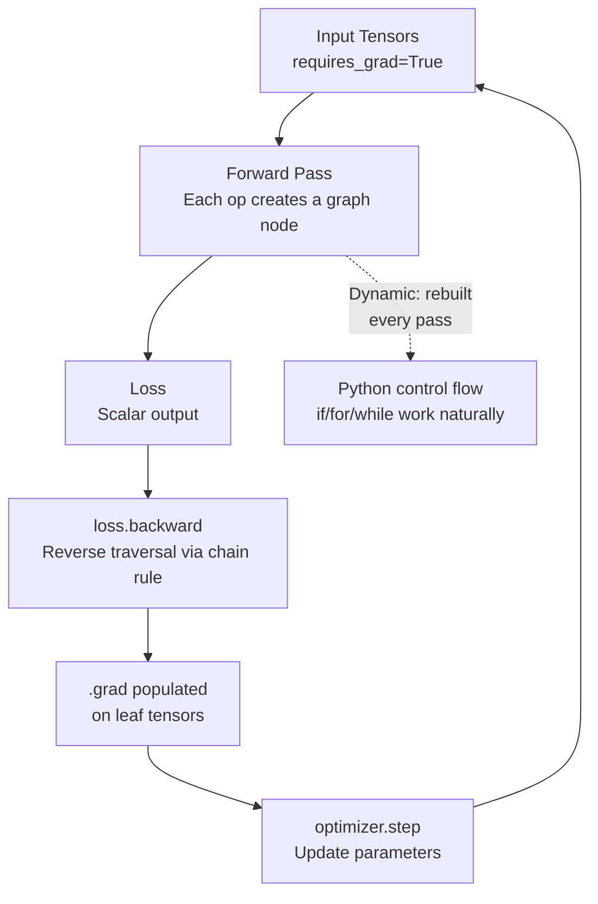

# Introduction to PyTorch

## Learning Objectives

- Build and train multi-parameter linear models using `nn.Module`, `torch.optim.SGD`, and the standard training loop (zero_grad, forward, loss, backward, step)
- Trace the autograd computational graph through forward and backward passes to identify where gradients are computed and stored
- Implement model serialization with `torch.save` and `torch.load`, verifying that restored weights produce identical predictions
- Compare optimizer convergence rates (SGD vs Adam) by measuring loss at fixed epoch checkpoints
- Diagnose and resolve the five most common PyTorch runtime errors (shape mismatch, missing `requires_grad`, dtype mismatch, gradient accumulation, non-converging loss)

## The Problem

The modern AI stack runs on tensors and automatic differentiation. Every model you deploy — whether it is scoring leads, classifying intent signals, or ranking personalization candidates — is built on these two primitives. You need n-dimensional arrays to represent data in bulk, and you need derivatives computed without deriving them by hand. Without automatic differentiation, training a model with even ten parameters means writing ten custom gradient functions. With a thousand parameters, that approach collapses.

PyTorch exposes both primitives directly. You create tensors, perform operations on them, and the framework tracks every operation in a computational graph. When you call `.backward()`, it traverses that graph in reverse and populates `.grad` on every tensor that needs one. This is the substrate underneath every model the lesson series will cover.

The gap between hand-rolled gradient code and PyTorch is not just convenience. A pure-Python framework processing one sample at a time through nested loops is roughly 500x slower than PyTorch dispatching the same operations to optimized C++ kernels on CPU — and orders of magnitude slower again on GPU. PyTorch also provides GPU acceleration, serialization, distributed training, and mixed precision, all behind an interface that mirrors the mental model you already built in your mini framework: Module, forward(), parameters(), backward(), optimizer.step().

## The Concept

A **tensor** is an n-dimensional array that records every operation performed on it when `requires_grad=True`. Each operation — addition, multiplication, matrix multiply, activation functions — creates a node in a computational graph. The node stores references to its input tensors and a reference to the function that produced it. This graph is the record PyTorch uses to compute derivatives.

**Autograd** works in two phases. During the forward pass, PyTorch builds the graph dynamically as each operation executes. When you call `.backward()` on a scalar output, PyTorch traverses the graph in reverse topological order, applying the chain rule at each node. At each step, it multiplies the upstream gradient by the local derivative of that node's operation, accumulating the result into `.grad` on the leaf tensors. This reverse-mode automatic differentiation is what makes training parametric models with millions of parameters tractable — you write the forward computation once, and the framework derives the backward pass from it.

PyTorch implements this with a **dynamic** (eager) computational graph: the graph is rebuilt on every forward pass. This means standard Python control flow — `if` statements, `for` loops, `while` loops — works naturally. The graph reflects exactly the operations that executed, including any that were skipped or repeated. This is the core design decision that distinguished PyTorch from earlier frameworks like TensorFlow 1.x, which required you to define the graph statically before running any data through it.



The diagram above traces one training step. The forward pass constructs the graph from the operations that actually execute. `.backward()` traverses it in reverse. The optimizer reads `.grad` and updates parameters. Next iteration, the old graph is discarded and a new one is built — which is why you never need to "compile" a model or declare its structure ahead of time.

For a GTM engineer, this mechanism matters because every model you build — whether it is classifying an ICP match score from firmographic data, predicting email reply probability from engagement signals, or ranking content recommendations — reduces to the same loop: compute a forward pass, measure error, compute gradients, update parameters. The specific model architecture changes, but the tensor-and-autograd substrate does not.

## Build It

Let's start with the smallest possible autograd demonstration: create a tensor, perform operations, call `.backward()`, and inspect the gradient. This confirms the core mechanism before we build anything larger.

```python
import torch

x = torch.tensor([1.0, 2.0, 3.0], requires_grad=True)

y = x ** 2

z = y.sum()

print(f"x: {x}")
print(f"y = x^2: {y}")
print(f"z = sum(y): {z.item()}")
print(f"x.requires_grad: {x.requires_grad}")

z.backward()

print(f"\nAfter backward():")
print(f"x.grad: {x.grad}")
print(f"Expected (2x): {2 * x.detach()}")

w = torch.tensor([0.5, -1.0, 2.0], requires_grad=True)
b = torch.tensor(0.1, requires_grad=True)
target = torch.tensor([1.0, 0.0, 4.0])

prediction = w * x.detach() + b
loss = ((prediction - target) ** 2).mean()
loss.backward()

print(f"\nw.grad: {w.grad}")
print(f"b.grad: {b.grad.item()}")
print(f"loss: {loss.item():.6f}")
```

Run this and you should see `x.grad` equal to `[2.0, 4.0, 6.0]` — the analytical derivative of `x^2` evaluated at each point. The second block computes gradients for a weighted sum plus bias against a target, which is the skeleton of every linear model.

Now let's train a single-parameter linear regression from scratch using nothing but tensors and manual gradient updates. This is the exact same computation PyTorch's `nn.Module` and `optimizer.step()` will automate later — but seeing it bare makes the abstraction transparent.

```python
import torch

torch.manual_seed(42)

n_samples = 100
X = torch.linspace(0, 10, n_samples)
true_w = 3.0
true_b = 1.5
y = true_w * X + true_b + torch.randn(n_samples) * 0.5

w = torch.tensor(0.1, requires_grad=True)
b = torch.tensor(0.0, requires_grad=True)

learning_rate = 0.01
n_epochs = 100

for epoch in range(n_epochs):
    y_pred = w * X + b
    
    loss = ((y_pred - y) ** 2).mean()
    
    if w.grad is not None:
        w.grad.zero_()
    if b.grad is not None:
        b.grad.zero_()
    
    loss.backward()
    
    with torch.no_grad():
        w -= learning_rate * w.grad
        b -= learning_rate * b.grad
    
    if epoch % 20 == 0 or epoch == n_epochs - 1:
        print(f"Epoch {epoch:3d} | loss={loss.item():.4f} | w={w.item():.4f} | b={b.item():.4f}")

print(f"\nTrue values:  w={true_w}, b={true_b}")
print(f"Learned vals: w={w.item():.4f}, b={b.item():.4f}")
```

The manual `zero_()` calls are critical. PyTorch accumulates gradients by default — each `.backward()` call *adds* to `.grad` rather than overwriting it. Without zeroing, the gradient from epoch 0 leaks into epoch 1, epoch 2, and so on, producing increasingly large update steps that destabilize training. The `with torch.no_grad():` block is necessary because the update `w -= lr * w.grad` is itself an operation on a tensor with `requires_grad=True`. Without the context manager, PyTorch would try to track this update in the graph, which defeats the purpose — we want to modify the parameter directly, not compute gradients of the update step.

## Use It

The code above trains a model that could serve as a lead-scoring baseline: given one signal (say, a company's employee count), predict a continuous outcome (say, annual contract value). The mechanism — linear transformation, MSE loss, gradient descent — is the same whether the input is a synthetic sine wave or a DataFrame of firmographic features pulled from a directory scraper. PyTorch does not know or care what the numbers represent. The abstraction boundary is the tensor: everything entering the model is a float array, everything leaving is a float array.

This lesson is foundational for the AI Engineering zone. PyTorch does not map to a single GTM workflow — it is the infrastructure layer underneath any model you build for lead scoring, intent classification, personalization ranking, or churn prediction. [CITATION NEEDED — concept: Zone 4 AI Engineering cluster mapping to GTM topic map] Every downstream lesson that trains or deploys a neural network assumes fluency with the training loop, tensor manipulation, and autograd demonstrated here.

Before moving on, try extending the regression model to accept two input features. Create `X` as a two-column tensor, multiply by a two-element weight vector, and observe that `.backward()` computes separate gradients for each weight — no additional code required. The graph tracks which operations involved which elements of which tensors, and the chain rule propagates gradients through each path independently.

## Ship It

Now we replace the manual parameter updates with PyTorch's production-grade abstractions: `nn.Module` for model definition, `torch.optim.SGD` for the optimizer, and `torch.save` / `torch.load` for serialization. The training loop shrinks to four lines (zero_grad, forward, backward, step), and the model scales to any number of parameters without code changes.

```python
import torch
import torch.nn as nn
import torch.optim as optim

torch.manual_seed(42)

n_samples = 200
n_features = 3
X = torch.randn(n_samples, n_features)
true_weights = torch.tensor([2.0, -1.5, 0.8])
true_bias = 0.5
y = X @ true_weights + true_bias + torch.randn(n_samples) * 0.3

class LinearModel(nn.Module):
    def __init__(self, input_dim):
        super().__init__()
        self.linear = nn.Linear(input_dim, 1)
    
    def forward(self, x):
        return self.linear(x).squeeze(-1)

model = LinearModel(n_features)
optimizer = optim.SGD(model.parameters(), lr=0.01)
criterion = nn.MSELoss()

print(f"Model architecture:\n{model}")
print(f"\nParameters:")
for name, param in model.named_parameters():
    print(f"  {name}: shape={param.shape}, requires_grad={param.requires_grad}")

for epoch in range(300):
    y_pred = model(X)
    loss = criterion(y_pred, y)
    
    optimizer.zero_grad()
    loss.backward()
    optimizer.step()
    
    if epoch % 50 == 0 or epoch == 299:
        print(f"Epoch {epoch:3d} | loss={loss.item():.6f}")

print(f"\nLearned weights: {model.linear.weight.data}")
print(f"Learned bias:    {model.linear.bias.data.item():.4f}")
print(f"True weights:    {true_weights}")
print(f"True bias:       {true_bias}")

test_input = torch.tensor([[1.0, 2.0, 3.0]])
with torch.no_grad():
    pred_before_save = model(test_input)
print(f"\nPrediction for [1, 2, 3] before save: {pred_before_save.item():.6f}")

torch.save(model.state_dict(), 'linear_model_weights.pt')
print("Saved state_dict to linear_model_weights.pt")

loaded_model = LinearModel(n_features)
loaded_model.load_state_dict(torch.load('linear_model_weights.pt'))
loaded_model.eval()

with torch.no_grad():
    pred_after_load = loaded_model(test_input)
print(f"Prediction for [1, 2, 3] after load:  {pred_after_load.item():.6f}")
print(f"Predictions identical: {torch.allclose(pred_before_save, pred_after_load)}")

state_dict = torch.load('linear_model_weights.pt')
print(f"\nstate_dict keys: {list(state_dict.keys())}")
print(f"linear.weight shape: {state_dict['linear.weight'].shape}")
print(f"linear.bias shape:   {state_dict['linear.bias'].shape}")
```

`nn.Module` replaces the bare tensor parameters with a structured container. `model.parameters()` yields all learnable tensors automatically, so the optimizer does not need to know their names or shapes. `state_dict()` serializes every parameter into an ordered dictionary of tensors, which `torch.save` writes to disk as a pickle file. Loading is symmetric: construct a fresh model with the same architecture, call `load_state_dict()`, and the weights are restored.

The production implication: a model trained on historical CRM data can be serialized, shipped to an inference server, and loaded to score new leads in real time. The training environment and serving environment do not need to share code beyond the `nn.Module` class definition and PyTorch itself. In a GTM context, this means a lead-scoring model trained weekly on accumulated conversion data can be deployed as a versioned artifact — `model_v12.pt`, `model_v13.pt` — without redeploying the application that uses it.

## Exercises

**Exercise 1 (Easy): Two-feature regression.** Modify the manual gradient-descent code from Build It to use two input features instead of one. Generate synthetic data with `X` shaped `(100, 2)` and a true weight vector `[2.5, -1.0]`. Print the learned weights after 100 epochs and compare to ground truth.

**Exercise 2 (Medium): SGD vs Adam convergence comparison.** Take the `nn.Module` model from Ship It and replace `optim.SGD` with `optim.Adam` using the default learning rate (0.001). Train for the same 300 epochs and print loss at epochs 0, 50, 100, 150, 200, 250, 299. Then retrain with SGD and print loss at the same checkpoints. Report which optimizer reaches a lower loss faster.

**Exercise 3 (Hard): Early stopping with validation split.** Split the synthetic dataset into 80% training and 20% validation. Train the model on the training split, but evaluate validation loss at the end of every epoch. Halt training when validation loss increases for 3 consecutive epochs. Print the epoch where training stopped and the final train and validation losses. This is the standard overfitting guard used in production model training — without it, a lead-scoring model will memorize idiosyncrasies in the training data and generalize poorly to unseen prospects.

**Troubleshooting guide for all exercises:**

If you hit a **shape mismatch in matmul** (`RuntimeError: mat1 and mat2 shapes cannot be multiplied`), print `.shape` on both operands before the operation. The inner dimensions must match: `(a, b) @ (b, c)` produces `(a, c)`. Use `.T` to transpose a 2D tensor or `.transpose(dim0, dim1)` for higher dimensions.

If `.grad` is `None` after `.backward()`, the tensor was either created without `requires_grad=True`, or it was created as a result of an operation that broke the graph (such as indexing with a non-differentiable operation). Another cause: calling `.backward()` on a non-scalar tensor without passing a `gradient` argument. The fix is `loss.backward()` where loss is a scalar, or `tensor.backward(gradient=torch.ones_like(tensor))` for non-scalar outputs.

If **loss does not decrease**, the learning rate is wrong. Too high and the loss oscillates or diverges (gradients overshoot the minimum). Too low and the loss barely moves (crawl). Print loss every epoch. If it jumps around wildly, divide the learning rate by 10. If it barely changes, multiply by 10. There is no universal correct value — SGD typically needs 0.01–0.1, Adam typically needs 0.001–0.0001.

If you see **`RuntimeError: Expected Float but got Long`**, a label tensor was loaded as integer type (PyTorch defaults to `torch.int64` for integer literals). MSE loss requires float inputs. Cast with `.float()` on the offending tensor, or use `.long()` if the loss function expects class indices (cross-entropy, for instance).

If **gradients accumulate across iterations**, you forgot `optimizer.zero_grad()`. Each `.backward()` call adds to existing `.grad` values rather than overwriting them. This is by design — it enables gradient accumulation across mini-batches — but in a standard training loop you must zero before each backward pass. The symptom is loss that decreases rapidly then explodes.

## Key Terms

**Tensor** — An n-dimensional array. PyTorch's fundamental data structure. Tracks operations when `requires_grad=True` is set, enabling automatic differentiation.

**Autograd** — PyTorch's automatic differentiation engine. Builds a computational graph during the forward pass and traverses it in reverse to compute derivatives via the chain rule.

**Computational graph** — A directed acyclic graph where nodes represent operations and edges represent data flow (tensors). PyTorch builds this dynamically during the forward pass.

**Dynamic graph (eager execution)** — A computational graph that is constructed and executed operation-by-operation at runtime, as opposed to being compiled ahead of time. Allows standard Python control flow. This is PyTorch's default mode.

**`requires_grad`** — A boolean flag on tensors indicating that PyTorch should track operations involving this tensor for the purpose of gradient computation. Set to `True` on parameters you want to optimize.

**`.backward()`** — Method that triggers reverse-mode autodiff. Computes partial derivatives of the tensor it is called on with respect to all leaf tensors that have `requires_grad=True`. Accumulates results into `.grad`.

**`nn.Module`** — PyTorch's base class for model components. Holds parameters, defines a `forward()` method, and provides utilities like `parameters()` and `state_dict()`. All neural network layers and full models subclass it.

**`optimizer.step()`** — Updates all parameters registered with the optimizer using their `.grad` values. Different optimizers (SGD, Adam, RMSprop) apply different update rules to the same gradients.

**`state_dict()`** — Returns an ordered dictionary mapping parameter names to tensor values. The standard serialization format for saving and loading model weights.

**`torch.no_grad()`** — A context manager that disables gradient tracking. Used during inference (no need to build a graph) and during manual parameter updates (prevents PyTorch from tracking the update as a graph operation).

## Sources

- [CITATION NEEDED — concept: Zone 4 AI Engineering cluster mapping to GTM topic map]
- PyTorch documentation: Automatic Differentiation with `torch.autograd` — https://pytorch.org/tutorials/beginner/basics/autogradqs_tutorial.html
- PyTorch documentation: `nn.Module` and training loop — https://pytorch.org/tutorials/beginner/basics/optimization_tutorial.html
- PyTorch documentation: Saving and loading models — https://pytorch.org/tutorials/beginner/basics/saveloadmodels_tutorial.html