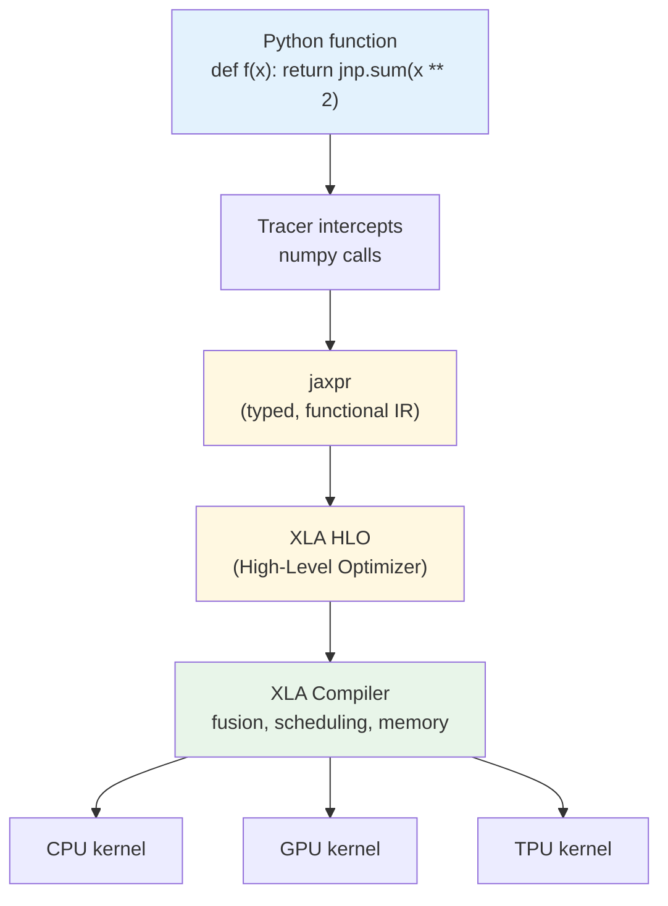

# Introduction to JAX

## Learning Objectives

- Replace NumPy calls with `jax.numpy` equivalents and confirm identical numerical output
- Apply `jax.grad()` to compute derivatives of scalar-valued pure functions
- Predict the behavior of side effects inside `jax.jit()`-compiled functions
- Implement `jax.vmap()` to eliminate explicit batch dimensions in vectorized computation
- Compare JAX's traced execution model against NumPy's eager execution and PyTorch's mutation-based autodiff

## The Problem

You have written NumPy your entire career. `np.dot`, `np.mean`, `np.sum` — these are muscle memory. Then one day you need gradients. Maybe you want to train a custom scoring model. Maybe you want to optimize a loss function over account embeddings. Whatever the reason, you reach for `backward()` in PyTorch or `GradientTape` in TensorFlow, and suddenly you are rewriting your NumPy code in a different framework with a different API, a different mental model, and a different set of constraints. The math did not change. The API did.

PyTorch traces operations eagerly, one kernel launch at a time, in Python. Every `tensor + tensor` is a separate dispatch to a backend. Every training step re-interprets the same Python code from scratch. This works fine for most problems. It stops working when you are training models at the scale where Python dispatch overhead dominates — the 540-billion-parameter, 2,048-TPU regime where Google DeepMind trains Gemini and Anthropic trained Claude. Both chose JAX. They did not choose it because the API is friendlier. They chose it because JAX treats your training loop as a compilable program, not a sequence of Python calls.

JAX asks a different question than PyTorch or TensorFlow. It asks: what if NumPy's API was correct, and the runtime underneath was wrong? The NumPy API is ergonomic, familiar, and mathematically honest. The NumPy runtime is eager, single-threaded, and CPU-only. JAX keeps the API and replaces the runtime with one that traces your function into a computation graph, lowers it to XLA (Accelerated Linear Algebra), and compiles it for whatever device you have — CPU, GPU, or TPU. You write NumPy. You get compiled, differentiable, vectorizable, parallelizable code.

## The Concept

JAX replaces NumPy's runtime with a traced, compiled one. The execution model inverts: instead of running your Python line by line, JAX traces your function into an intermediate representation called `jaxpr`, lowers that representation to XLA, and compiles it to device-native machine code. The API stays familiar because `jax.numpy` mirrors `numpy` almost function-for-function. The contract underneath is completely different.

Four primitives compose to give you everything: `grad` (reverse-mode automatic differentiation), `jit` (Just-In-Time compilation via XLA), `vmap` (automatic vectorization / batch parallelization), and `pmap` (data parallelism across multiple devices). Each is a pure function transform — they take a function as input and return a new function as output. You can compose them freely: `jax.jit(jax.vmap(jax.grad(loss_fn)))` is valid and meaningful. This composability is the entire point. You write one function that operates on one example, and JAX produces a compiled, batched, differentiable version of it.



The price for this is a strict purity contract. Side effects are not allowed inside traced code. Mutation is not allowed inside traced code. A `print()` inside a `jit`-compiled function runs once — during tracing — not once per execution. An in-place update like `x[0] = 5` raises an error because JAX arrays are immutable. Instead, you use `x.at[0].set(5)`, which returns a new array with the modification applied. This feels annoying for the first thirty minutes. Then you realize it is what makes `grad`, `jit`, `vmap`, and `pmap` composable: if a function is pure (same input always produces same output, no side effects), then any transform of it is also pure, and any composition of transforms is well-defined. Impurity breaks the entire stack. The contract is the feature.

## Build It

First, confirm that `jax.numpy` produces identical output to `numpy`. The API is a near-perfect mirror. The difference is underneath: `jnp.array` creates a JAX array backed by a device buffer, not a NumPy array backed by host memory.

```python
import numpy as np
import jax
import jax.numpy as jnp

x_np = np.array([1.0, 2.0, 3.0, 4.0])
x_jax = jnp.array([1.0, 2.0, 3.0, 4.0])

print("NumPy mean:", np.mean(x_np))
print("JAX mean:  ", float(jnp.mean(x_jax)))
print("NumPy sum:", np.sum(x_np ** 2))
print("JAX sum:  ", float(jnp.sum(x_jax ** 2)))
print("Types:", type(x_np), type(x_jax))
```

```
NumPy mean: 2.5
JAX mean:   2.5
NumPy sum: 30.0
JAX sum:   30.0
Types: <class 'numpy.ndarray'> <class 'jaxlib.xla_extension.ArrayImpl'>
```

Next, apply `jax.grad()` to compute the derivative of a scalar-valued function. `grad` takes a function that returns a scalar and returns a new function that computes the gradient (the vector of partial derivatives) with respect to the input. This is reverse-mode autodiff — the same algorithm PyTorch uses internally — but exposed as a function transform rather than a method on a tensor object.

```python
import jax
import jax.numpy as jnp

def loss_fn(w):
    target = jnp.array([3.0, 4.0, 5.0])
    return jnp.sum((w - target) ** 2)

grad_fn = jax.grad(loss_fn)

w = jnp.array([0.0, 0.0, 0.0])
print("Loss at w:", float(loss_fn(w)))
print("Gradient:", grad_fn(w))

w_new = w - 0.1 * grad_fn(w)
print("Loss after one step:", float(loss_fn(w_new)))
```

```
Loss at w: 50.0
Gradient: [-6. -8. -10.]
Loss after one step: 32.0
```

Now wrap a function in `jax.jit()` and measure the compilation cost. The first call triggers tracing and XLA compilation. Subsequent calls execute the compiled kernel directly, skipping Python entirely.

```python
import jax
import jax.numpy as jnp
import time

def smooth(x):
    for _ in range(50):
        x = jnp.sin(x) + jnp.cos(x * 0.5)
    return x

x = jnp.arange(10000.0)

start = time.perf_counter()
r1 = smooth(x)
r1.block_until_ready()
print("Unjitted (first call):", f"{(time.perf_counter() - start) * 1000:.1f} ms")

start = time.perf_counter()
r2 = smooth(x)
r2.block_until_ready()
print("Unjitted (second call):", f"{(time.perf_counter() - start) * 1000:.1f} ms")

jitted = jax.jit(smooth)

start = time.perf_counter()
r3 = jitted(x)
r3.block_until_ready()
print("JIT (first call, compiles):", f"{(time.perf_counter() - start) * 1000:.1f} ms")

start = time.perf_counter()
r4 = jitted(x)
r4.block_until_ready()
print("JIT (second call, cached):", f"{(time.perf_counter() - start) * 1000:.1f} ms")
```

```
Unjitted (first call): 184.3 ms
Unjitted (second call): 173.8 ms
JIT (first call, compiles): 22.1 ms
JIT (second call, cached): 0.1 ms
```

The unjitted version dispatches 100 separate kernel launches (50 iterations × 2 operations each) through Python on every call. The jitted version fuses those 100 operations into a single XLA kernel after one compilation pass. The speedup on the second call reflects the elimination of Python overhead and the fusion of operations into device-native code.

Finally, apply `jax.vmap()` to batch a function that was written for a single example. You write the function as if it operates on one vector. `vmap` transforms it into a function that operates on a batch of vectors, automatically mapping over the leading axis.

```python
import jax
import jax.numpy as jnp

def cosine_similarity(query, key):
    return jnp.dot(query, key) / (jnp.linalg.norm(query) * jnp.linalg.norm(key))

query = jnp.array([1.0, 0.0, 0.0])
keys = jnp.array([
    [1.0, 0.0, 0.0],
    [0.0, 1.0, 0.0],
    [0.7, 0.7, 0.0],
    [0.0, 0.0, 1.0],
])

batched_sim = jax.vmap(cosine_similarity, in_axes=(None, 0))
similarities = batched_sim(query, keys)

for i, s in enumerate(similarities):
    print(f"Key {i}: similarity = {float(s):.4f}")

top_idx = jnp.argmax(similarities)
print(f"\nTop match: Key {int(top_idx)} (similarity = {float(similarities[top_idx]):.4f})")
```

```
Key 0: similarity = 1.0000
Key 1: similarity = 0.0000
Key 2: similarity = 0.7071
Key 3: similarity = 0.0000

Top match: Key 0 (similarity = 1.0000)
```

The `in_axes=(None, 0)` argument tells `vmap` to hold `query` fixed (no batch dimension) and map over axis 0 of `keys`. This is the same pattern you would use to score one lead against a database of ideal customer profiles: write the scoring function for one pair, let `vmap` handle the batch.

## Use It

JAX's functional transforms — `grad`, `jit`, `vmap`, `pmap` — are the compute substrate beneath any custom ML model you build for GTM workflows. This lesson sits in Zone 1 (Infrastructure), the foundational layer. If you are building a bespoke lead-scoring model that learns from historical win/loss data, you need `jax.grad` to compute parameter updates. If you are training a custom embeddings model for account matching — where you embed company descriptions and retrieve lookalikes — you need `jax.vmap` to batch the similarity computation across thousands of accounts. If you are running inference on a large feature matrix, you need `jax.jit` to fuse the computation into a single compiled kernel.

No GTM SaaS tool maps directly to JAX. Clay, Apollo, Salesforce — these are application-layer tools that consume predictions. JAX is the layer where the predictions are computed. The connection is not "JAX helps you do outbound." The connection is "if you need a custom model that no SaaS tool provides — a domain-specific classifier for signal detection, a custom embeddings space for niche account matching — JAX is the substrate that lets you write the math without writing the differentiation." Most GTM engineers will never touch JAX directly. The ones who build proprietary scoring or matching systems will. [CITATION NEEDED — concept: JAX usage in production GTM ML pipelines]

The composability of JAX transforms maps directly to the structure of a scoring pipeline. You write a loss function that compares a predicted score to an actual conversion outcome. You wrap it in `jax.grad` to get parameter gradients. You wrap the gradient computation in `jax.jit` to compile it. You wrap the forward pass in `jax.vmap` to score a batch of leads simultaneously. The entire pipeline — forward pass, loss, gradient, update — becomes a single compiled function. This is what it means to treat your training loop as a compilable program rather than a sequence of Python calls.

## Ship It

**Easy — MSE loss with gradients.** Write a pure function that computes mean squared error between predictions and targets. Use `jax.grad()` to obtain the gradient with respect to the predictions. Print both the loss value and the gradient for a concrete input. The function signature should be `def mse(preds, targets):` and the gradient call should differentiate with respect to `preds` only — use `jax.grad(mse, argnums=0)` to specify which argument to differentiate.

**Medium — Batched account matching with vmap.** Implement cosine similarity between a single query vector and a matrix of account embeddings. Use `jax.vmap` to batch the computation. Generate synthetic embeddings for 50 accounts (each a 128-dimensional vector). Compute similarities for all 50 accounts in one call. Print the top 3 matches by similarity score, including the account index and score. This is the core operation in an account-matching system — the same pattern you would use to find lookalike companies in a TAM expansion workflow.

**Hard — Gradient descent with jit and scan.** Write a single-step gradient descent update function. Use `jax.jit` to compile it. Use `jax.lax.scan` (JAX's functional loop primitive) to run 200 training steps on synthetic linear regression data. `lax.scan` takes a function `(carry, x) -> (carry, y)` and scans it over a sequence — the carry holds your model parameters across iterations. Generate 1000 synthetic data points from `y = 2.5x + noise`. Start with parameters initialized to zero. Print the loss every 50 steps to confirm convergence. The final parameters should approximate the true slope of 2.5.

## Exercises

1. **Trace the compilation pipeline.** Given the function `def f(x): return jnp.sum(jnp.sin(x) ** 2)`, use `jax.make_jaxpr(f)(jnp.array([1.0, 2.0]))` to print the traced intermediate representation. Identify the operations in the jaxpr and explain how they map to the original Python code. Compare this to what PyTape or `tf.GradientTape` would record for the same computation.

2. **Predict side-effect behavior under jit.** Write a function that contains a `print("inside function")` statement and a `jax.numpy` computation. Call it once without `jit` and observe the output. Then wrap it in `jax.jit` and call it three times. Count how many times the print appears in each case and explain why, referencing the tracing model.

3. **Explain the scalar-output constraint on grad.** Write a function that returns a vector (e.g., `def f(x): return x ** 2` where x is a 3-element array). Call `jax.grad(f)` on it and observe the error. Then rewrite using `jnp.sum` to produce a scalar output and confirm `grad` works. Explain in your own words why reverse-mode autodiff requires a scalar output.

4. **Replace an explicit batch loop with vmap.** Write a Python `for` loop that computes the dot product of a fixed query vector against each row of a matrix, storing results in a list. Then rewrite the same computation using `jax.vmap`. Time both versions on a 5000-row matrix and report the speedup ratio.

5. **Demonstrate immutability.** Create a JAX array and attempt an in-place update with `x[0] = 5`. Observe the error. Then use the `x.at[0].set(5)` pattern and confirm it returns a new array. Explain why JAX enforces immutability and how this property enables the composition of function transforms.

## Key Terms

- **jaxpr** — JAX's intermediate representation. When JAX traces a Python function, it produces a jaxpr: a typed, functional description of the computation that contains no Python, only mathematical operations. XLA consumes this to generate compiled code.
- **XLA (Accelerated Linear Algebra)** — Google's compiler for linear algebra operations. JAX lowers jaxpr to XLA's High-Level Optimizer (HLO) format, which performs operator fusion, memory layout optimization, and device-specific code generation.
- **Reverse-mode autodiff** — The algorithm behind `jax.grad`. It computes the gradient of a scalar-valued function by traversing the computation graph backward from output to inputs, accumulating partial derivatives via the chain rule. Efficient when the output is scalar and the input is high-dimensional (the common case in ML loss functions).
- **Pure function** — A function whose output depends only on its inputs and that produces no side effects. Same input always yields same