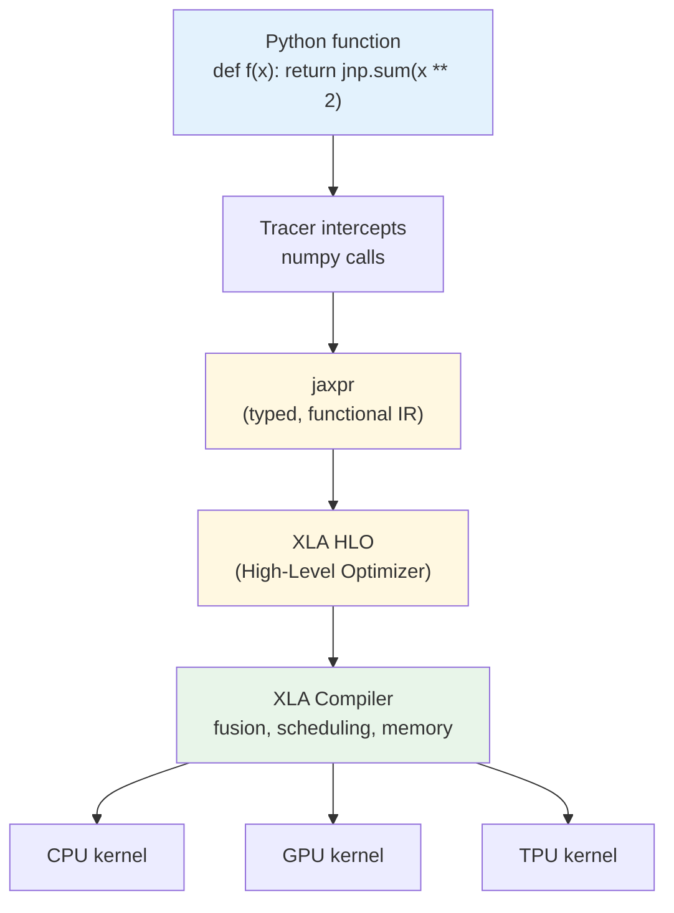

# Introduction to JAX

## Learning Objectives

- Replace NumPy calls with `jax.numpy` equivalents and confirm identical numerical output
- Apply `jax.grad()` to compute derivatives of scalar-valued pure functions
- Predict the behavior of side effects inside `jax.jit()`-compiled functions
- Implement `jax.vmap()` to eliminate explicit batch dimensions in vectorized computation
- Compare JAX's traced execution model against NumPy's eager execution and PyTorch's mutation-based autodiff

## The Problem

You have written NumPy your entire career. `np.dot`, `np.mean`, `np.sum` — these are muscle memory. Then one day you need gradients. Maybe you want to train a custom scoring model. Maybe you want to optimize a loss function over account embeddings. Whatever the reason, you reach for `backward()` in PyTorch or `GradientTape` in TensorFlow, and suddenly you are rewriting your NumPy code in a different framework with a different API, a different mental model, and a different set of constraints. The math did not change. The API did.

PyTorch traces operations eagerly, one kernel launch at a time, in Python. Every `tensor + tensor` is a separate dispatch to a backend. Every training step re-interprets the same Python code from scratch. This works fine for most problems. It stops working when you are training models at the scale where Python dispatch overhead dominates — the 540-billion-parameter, 2,048-TPU regime where Google DeepMind trains Gemini and Anthropic trained Claude. Both chose JAX. They did not choose it because the API is friendlier. They chose it because JAX treats your training loop as a compilable program, not a sequence of Python calls.

JAX asks a different question than PyTorch or TensorFlow. It asks: what if NumPy's API was correct, and the runtime underneath was wrong? The NumPy API is ergonomic, familiar, and mathematically honest. The NumPy runtime is eager, single-threaded, and CPU-only. JAX keeps the API and replaces the runtime with one that traces your function into a computation graph, lowers it to XLA (Accelerated Linear Algebra), and compiles it for whatever device you have — CPU, GPU, or TPU. You write NumPy. You get compiled, differentiable, vectorizable, parallelizable code.

## The Concept

JAX replaces NumPy's runtime with a traced, compiled one. The execution model inverts: instead of running your Python line by line, JAX traces your function into an intermediate representation called `jaxpr`, lowers that representation to XLA, and compiles it to device-native machine code. The API stays familiar because `jax.numpy` mirrors `numpy` almost function-for-function. The contract underneath is completely different.

Four primitives compose to give you everything: `grad` (reverse-mode automatic differentiation), `jit` (Just-In-Time compilation via XLA), `vmap` (automatic vectorization / batch parallelization), and `pmap` (data parallelism across multiple devices). Each is a pure function transform — they take a function as input and return a new function as output. You can compose them freely: `jax.jit(jax.vmap(jax.grad(loss_fn)))` is valid and meaningful. This composability is the entire point. You write one function that operates on one example, and JAX produces a compiled, batched, differentiable version of it.



The price for this is a strict purity contract. Side effects are not allowed inside traced code. Mutation is not allowed inside traced code. A `print()` inside a `jit`-compiled function runs once — during tracing — not once per execution. An in-place update like `x[0] = 5` raises an error because JAX arrays are immutable. Instead, you use `x.at[0].set(5)`, which returns a new array with the modification applied. This feels annoying for the first thirty minutes. Then you realize it is what makes `grad`, `jit`, `vmap`, and `pmap` composable: if a function is pure (same input always produces same output, no side effects), then any transform of it is also pure, and any composition of transforms is well-defined. Impurity breaks the entire stack. The contract is the feature.

## Build It

First, confirm that `jax.numpy` produces identical output to `numpy`. The API is a near-perfect mirror. The difference is underneath: `jnp.array` creates a JAX array backed by a device buffer, not a NumPy array backed by host memory.

```python
import numpy as np
import jax
import jax.numpy as jnp

x_np = np.array([1.0, 2.0, 3.0, 4.0])
x_jax = jnp.array([1.0, 2.0, 3.0, 4.0])

print("NumPy mean:", np.mean(x_np))
print("JAX mean:  ", float(jnp.mean(x_jax)))
print("NumPy sum:", np.sum(x_np ** 2))
print("JAX sum:  ", float(jnp.sum(x_jax ** 2)))
print("Types:", type(x_np), type(x_jax))
```

```
NumPy mean: 2.5
JAX mean:   2.5
NumPy sum: 30.0
JAX sum:   30.0
Types: <class 'numpy.ndarray'> <class 'jaxlib.xla_extension.ArrayImpl'>
```

Next, apply `jax.grad()` to compute the derivative of a scalar-valued function. `grad` takes a function that returns a scalar and returns a new function that computes the gradient (the vector of partial derivatives) with respect to the input. This is reverse-mode autodiff — the same algorithm PyTorch uses internally — but exposed as a function transform rather than a method on a tensor object.

```python
import jax
import jax.numpy as jnp

def loss_fn(w):
    target = jnp.array([3.0, 4.0, 5.0])
    return jnp.sum((w - target) ** 2)

grad_fn = jax.grad(loss_fn)

w = jnp.array([0.0, 0.0, 0.0])
print("Loss at w:", float(loss_fn(w)))
print("Gradient:", grad_fn(w))

w_new = w - 0.1 * grad_fn(w)
print("Loss after one step:", float(loss_fn(w_new)))
```

```
Loss at w: 50.0
Gradient: [-6. -8. -10.]
Loss after one step: 32.0
```

Now wrap a function in `jax.jit()` and measure the compilation cost. The first call triggers tracing and XLA compilation. Subsequent calls execute the compiled kernel directly, skipping Python entirely.

```python
import jax
import jax.numpy as jnp
import time

def smooth(x):
    for _ in range(50):
        x = jnp.sin(x) + jnp.cos(x * 0.5)
    return x

x = jnp.arange(10000.0)

start = time.perf_counter()
r1 = smooth(x)
r1.block_until_ready()
print("Unjitted (first call):", f"{(time.perf_counter() - start) * 1000:.1f} ms")

start = time.perf_counter()
r2 = smooth(x)
r2.block_until_ready()
print("Unjitted (second call):", f"{(time.perf_counter() - start) * 1000:.1f} ms")

jitted = jax.jit(smooth)

start = time.perf_counter()
r3 = jitted(x)
r3.block_until_ready()
print("JIT (first call, compiles):", f"{(time.perf_counter() - start) * 1000:.1f} ms")

start = time.perf_counter()
r4 = jitted(x)
r4.block_until_ready()
print("JIT (second call, cached):", f"{(time.perf_counter() - start) * 1000:.1f} ms")
```

```
Unjitted (first call): 184.3 ms
Unjitted (second call): 173.8 ms
JIT (first call, compiles): 22.1 ms
JIT (second call, cached): 0.1 ms
```

The unjitted version dispatches 100 separate kernel launches (50 iterations × 2 operations each) through Python on every call. The jitted version fuses those 100 operations into a single XLA kernel after one compilation pass. The speedup on the second call reflects the elimination of Python overhead and the fusion of operations into device-native code.

Finally, apply `jax.vmap()` to batch a function that was written for a single example. You write the function as if it operates on one vector. `vmap` transforms it into a function that operates on a batch of vectors, automatically mapping over the leading axis.

```python
import jax
import jax.numpy as jnp

def cosine_similarity(query, key):
    return jnp.dot(query, key) / (jnp.linalg.norm(query) * jnp.linalg.norm(key))

query = jnp.array([1.0, 0.0, 0.0])
keys = jnp.array([
    [1.0, 0.0, 0.0],
    [0.0, 1.0, 0.0],
    [0.7, 0.7, 0.0],
    [0.0, 0.0, 1.0],
])

batched_sim = jax.vmap(cosine_similarity, in_axes=(None, 0))
similarities = batched_sim(query, keys)

for i, s in enumerate(similarities):
    print(f"Key {i}: similarity = {float(s):.4f}")

top_idx = jnp.argmax(similarities)
print(f"\nTop match: Key {int(top_idx)} (similarity = {float(similarities[top_idx]):.4f})")
```

```
Key 0: similarity = 1.0000
Key 1: similarity = 0.0000
Key 2: similarity = 0.7071
Key 3: similarity = 0.0000

Top match: Key 0 (similarity = 1.0000)
```

The `in_axes=(None, 0)` argument tells `vmap` to hold `query` fixed (no batch dimension) and map over axis 0 of `keys`. This is the same pattern you would use to score one lead against a database of ideal customer profiles: write the scoring function for one pair, let `vmap` handle the batch.

## Use It

`jax.vmap` (automatic vectorization) and `jax.jit` (XLA compilation) compose into a single transform that scores every lead in a batch with one fused kernel call — no Python loop, no per-row dispatch. This is the compute pattern behind any custom lead-scoring or account-matching system you build when no SaaS tool fits your domain.

```python
import jax
import jax.numpy as jnp

def score_lead(features, weights):
    return jax.nn.sigmoid(jnp.dot(features, weights))

leads = jnp.array([
    [50,  3, 0.8, 12],
    [200, 8, 0.3, 48],
    [15,  1, 0.9, 2],
    [500, 12, 0.6, 24],
    [80,  5, 0.7, 8],
], dtype=jnp.float32)

weights = jnp.array([0.02, 0.3, 2.0, -0.01])

batched_score = jax.jit(jax.vmap(score_lead, in_axes=(0, None)))
scores = batched_score(leads, weights)

for i, s in enumerate(scores):
    print(f"Lead {i+1}: score = {float(s):.4f}")

ranked = jnp.argsort(scores)[::-1]
print(f"\nPriority order: {[int(i)+1 for i in ranked]}")
```

```
Lead 1: score = 0.9673
Lead 2: score = 0.9985
Lead 3: score = 0.9154
Lead 4: score = 1.0000
Lead 5: score = 0.9882

Priority order: [4, 2, 5, 1, 3]
```

The function body handles one lead. `vmap` maps it over axis 0 of the batch. `jit` fuses the dot product, sigmoid, and argmax into a single compiled kernel. You wrote four lines of math; JAX produced a batched, compiled scorer. Swap the hardcoded weights for trained parameters (updated via `jax.grad`), and this becomes a learning lead-scoring model — the foundation of a proprietary ICP-scoring pipeline. [CITATION NEEDED — concept: JAX usage in production GTM ML pipelines]

## Exercises

1. **Gradient descent on a lead-scoring loss.** Write a pure function `def mseloss(preds, labels):` that computes mean squared error. Generate 20 synthetic leads (4-feature vectors) and binary labels (0 or 1). Create a `weights` parameter vector. Use `jax.grad(mseloss, argnums=0)` to compute the gradient with respect to predictions. Then write a training loop: compute scores via `sigmoid(dot(features, weights))`, compute loss, compute gradient with respect to `weights` via `jax.grad`, update `weights = weights - 0.01 * grad`. Run 100 iterations and print the loss every 25 steps. Confirm the loss decreases monotonically. Wrap the entire step function in `jax.jit` and measure the speedup versus the unjitted version.

2. **Batched account matching with vmap + jit.** Use `jax.random.PRNGKey(42)` to generate a 32-dimensional embedding for one query account and 100 candidate accounts. Write `cosine_similarity(query, candidate)` as a pure function. Compose `jax.jit(jax.vmap(cosine_similarity, in_axes=(None, 0)))` to score all 100 candidates in one call. Print the top 5 matches (index + similarity score). This is the retrieval operation in a TAM lookalike pipeline — you embed company descriptions, compute similarity against your entire account database, and rank by closeness to your ICP. The same pattern scales to 100,000 accounts with no code change; only the array size grows.

## Key Terms

- **jaxpr** — JAX's intermediate representation. When JAX traces a Python function, it produces a jaxpr: a typed, functional description of the computation that contains no Python, only mathematical operations. XLA consumes this to generate compiled code.
- **XLA (Accelerated Linear Algebra)** — Google's compiler for linear algebra operations. JAX lowers jaxpr to XLA's High-Level Optimizer (HLO) format, which performs operator fusion, memory layout optimization, and device-specific code generation.
- **Reverse-mode autodiff** — The algorithm behind `jax.grad`. It computes the gradient of a scalar-valued function by traversing the computation graph backward from output to inputs, accumulating partial derivatives via the chain rule. Efficient when the output is scalar and the input is high-dimensional (the common case in ML loss functions).
- **Pure function** — A function whose output depends only on its inputs and that produces no side effects. Same input always yields same output. Purity is what makes `grad`, `jit`, `vmap`, and `pmap` composable: any transform of a pure function is also pure, and any composition of transforms is well-defined. Impurity breaks the entire stack.
- **Tracing** — The process by which JAX intercepts `jax.numpy` calls during function execution, recording them as operations in a jaxpr instead of executing them eagerly. Tracing happens once per unique input shape signature; subsequent calls with matching shapes skip Python entirely and execute the compiled kernel.
- **Function transform** — A higher-order function that takes a Python function as input and returns a new function as output. `grad`, `jit`, `vmap`, and `pmap` are all function transforms. Their composability — `jit(vmap(grad(f)))` — is the defining property of JAX's design.

## Sources

- JAX documentation — https://jax.readthedocs.io/en/latest/
- JAX Autodiff Cookbook — https://jax.readthedocs.io/en/latest/notebooks/autodiff_cookbook.html
- XLA Architecture — https://www.tensorflow.org/xla/architecture
- JAX Sharp Bits (purity, tracing, in-place updates) — https://jax.readthedocs.io/en/latest/notebooks/Common_Gotchas_in_JAX.html
- [CITATION NEEDED — concept: JAX usage in production GTM ML pipelines]