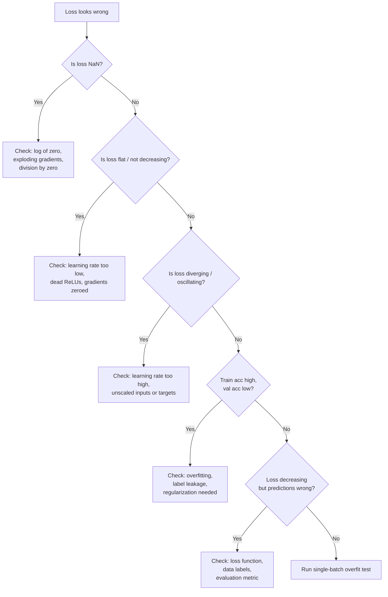

# Debugging Neural Networks

## Learning Objectives

1. Diagnose training failure modes (loss plateau, NaN, divergence) from loss curves and weight statistics.
2. Implement gradient norm tracking to detect vanishing or exploding gradients.
3. Write activation distribution checks to identify dead neurons and saturation.
4. Compare learning rate behaviors using observable training metrics.
5. Build a minimal diagnostic harness that surfaces training health signals to stdout.

## The Problem

Your network compiled. It ran. It produced a number. The number is wrong and nothing crashed. Welcome to the hardest kind of debugging — the kind where there is no error message.

Traditional software fails loudly. A null pointer throws an exception. A type mismatch fails at compile time. An off-by-one error produces a clearly wrong output. You get a stack trace, a line number, a signal. Neural networks do not give you that luxury. A broken model runs to completion, prints a loss value, and outputs predictions. The loss might decrease. The predictions might look plausible. But the model is silently wrong — learning shortcuts, memorizing noise, or converging to a useless local minimum. Andrej Karpathy's "A Recipe for Training Neural Networks" (2019) opens with this observation: the most common neural net mistakes are bugs that do not crash. Google's own internal post-mortems of ML pipeline failures found that a significant fraction of production model quality issues stemmed from silent data pipeline bugs that produced no errors but systematically degraded input quality [CITATION NEEDED — concept: Google internal ML debugging statistics].

The difference between a working model and a broken one is often a single misplaced line: a missing `zero_grad()`, a transposed dimension, a learning rate off by 10x. These bugs hide because the training loop still runs, the loss still decreases, and the output still looks like a number. You need a diagnostic methodology — a way to interrogate the model's internal state at every step and read the signals it is giving you.

This lesson builds that methodology from the data up.

## The Concept

### The Debugging Stack, Bottom-Up

Neural network debugging follows a strict order: data, loss, gradients, activations, architecture. You start at the bottom because problems at the bottom produce symptoms at the top, and fixing the top without checking the bottom wastes hours. A learning rate that looks too high might actually be unscaled features. A gradient that vanishes might actually be a label encoding bug. Check the data first, always.

**Data first.** Shuffled labels, unscaled features, and label leakage produce symptoms that look like model bugs. Before touching the architecture, print batch statistics, label distributions, and feature ranges. If your input features have a mean of 50,000 and a standard deviation of 30,000, the first linear layer's gradients will be enormous and the loss will diverge — and no amount of learning rate tuning will fix it.

**Loss curve taxonomy.** The shape of your loss curve is a diagnostic signal. A flat loss means the learning rate is too low or gradients are zeroed. A diverging loss means the learning rate is too high or targets are unscaled. A loss that drops to NaN means you are taking a log of zero, dividing by zero, or experiencing exploding gradients. Each shape maps to a specific cause, and reading the curve correctly eliminates half your hypothesis space immediately.



**Gradient flow.** Backpropagation computes gradients by multiplying them through each layer via the chain rule. If the weight matrices in your network have singular values consistently below 1, the gradient signal shrinks exponentially as it travels backward through the layers — this is vanishing gradients. If those singular values are above 1, the gradient grows exponentially — this is exploding gradients. You detect this by tracking the ratio of gradient norm to parameter norm at each layer, at each step. A healthy network maintains gradient magnitudes within a few orders of magnitude across all layers. A network with vanishing gradients shows gradients that shrink by factors of 10-100x per layer as you move toward the input.

**Activation health.** ReLU neurons that output zero for every input in a batch are dead — they receive no gradient and their weights never update. Sigmoid or tanh neurons outputting values clustered at 0.99 or -0.99 are saturated, where the gradient of the activation function is approximately zero and learning stalls. You detect dead ReLUs by computing the fraction of zero outputs per layer per batch. You detect saturation by computing the mean absolute value of sigmoid/tanh outputs — values consistently near 1.0 indicate saturation. A dead ReLU in the first layer means that neuron's incoming weights are frozen permanently; a whole layer of dead ReLUs means the network is effectively thinner than you designed it to be.

**The single-batch overfit test.** Before debugging a full training loop, verify that the model can memorize one batch of data to near-zero loss. If the model cannot overfit 32 examples, the architecture is broken, the loss function is wrong, or there is a dimension mismatch — not a hyperparameter problem. This test takes 30 seconds and eliminates an entire class of hypotheses. Run it first, every time.

The mechanism is always the same: measure, diagnose, fix. The tools — PyTorch hooks, gradient clipping, learning rate schedulers — just instrument the measurement. Understand the signal before reaching for the fix.

## Build It

Build the diagnostic harness. This is a set of functions that take a model, a batch of data, and produce a structured health report to stdout. The harness checks data statistics, computes per-layer gradient norms, measures activation distributions, and runs the single-batch overfit test. Every function prints observable output.

```python
import torch
import torch.nn as nn
import torch.nn.functional as F
from torch.utils.data import DataLoader, TensorDataset

torch.manual_seed(42)

def check_data(inputs, targets, name="dataset"):
    print(f"=== Data Check: {name} ===")
    print(f"  Inputs shape:    {inputs.shape}")
    print(f"  Inputs mean:     {inputs.mean().item():.4f}")
    print(f"  Inputs std:      {inputs.std().item():.4f}")
    print(f"  Inputs min/max:  {inputs.min().item():.4f} / {inputs.max().item():.4f}")
    if targets.dim() == 1:
        unique, counts = torch.unique(targets, return_counts=True)
        print(f"  Label classes:   {unique.tolist()}")
        print(f"  Label counts:    {counts.tolist()}")
    else:
        print(f"  Targets mean:    {targets.mean().item():.4f}")
        print(f"  Targets std:     {targets.std().item():.4f}")
    print()

X = torch.randn(500, 20) * 50 + 100
y = torch.randint(0, 3, (500,))

check_data(X, y, "unscaled_example")
```

Run that and you see the problem immediately: inputs have a mean near 100 and a standard deviation near 50. The first linear layer will produce pre-activations in the thousands, and the loss will be unstable. This is a data bug, not a model bug.

Now build the gradient and activation monitors:

```python
import torch
import torch.nn as nn
import torch.nn.functional as F

def make_hooks(model):
    activations = {}
    gradients = {}

    def make_forward_hook(name):
        def hook(module, inp, out):
            activations[name] = out.detach()
        return hook

    def make_backward_hook(name):
        def hook(module, grad_input, grad_output):
            gradients[name] = grad_output[0].detach()
        return hook

    for name, module in model.named_children():
        module.register_forward_hook(make_forward_hook(name))
        module.register_full_backward_hook(make_backward_hook(name))

    return activations, gradients


def gradient_report(model, gradients):
    print("=== Per-Layer Gradient Norms ===")
    for name, param in model.named_parameters():
        if param.grad is not None:
            grad_norm = param.grad.norm().item()
            param_norm = param.data.norm().item()
            ratio = grad_norm / (param_norm + 1e-8)
            print(f"  {name:30s} grad_norm={grad_norm:.6f}  "
                  f"param_norm={param_norm:.4f}  ratio={ratio:.6f}")
    print()

    print("=== Gradient Flow (backward pass) ===")
    prev_norm = None
    for name in sorted(gradients.keys()):
        gnorm = gradients[name].norm().item()
        marker = ""
        if prev_norm is not None and prev_norm > 0:
            shrink = gnorm / prev_norm
            if shrink < 0.1:
                marker = " <-- SHRINKING (vanishing?)"
            elif shrink > 10:
                marker = " <-- GROWING (exploding?)"
        print(f"  {name:30s} grad_norm={gnorm:.6f}{marker}")
        prev_norm = gnorm
    print()


def activation_report(activations):
    print("=== Activation Health ===")
    for name, act in activations.items():
        if act.dim() > 1:
            flat = act.view(act.size(0), -1)
        else:
            flat = act

        dead_frac = (flat == 0).float().mean().item()
        mean_val = flat.mean().item()
        std_val = flat.std().item()

        print(f"  {name:30s} mean={mean_val:+.4f}  std={std_val:.4f}  "
              f"dead_frac={dead_frac:.3f}", end="")

        if std_val < 0.01:
            print("  <-- NEARLY CONSTANT")
        elif dead_frac > 0.5:
            print("  <-- HIGH DEAD FRACTION")
        else:
            print()
    print()


model = nn.Sequential(
    nn.Linear(20, 64),
    nn.ReLU(),
    nn.Linear(64, 32),
    nn.ReLU(),
    nn.Linear(32, 3),
)

acts, grads = make_hooks(model)

X_batch = torch.randn(32, 20)
y_batch = torch.randint(0, 3, (32,))

output = model(X_batch)
loss = F.cross_entropy(output, y_batch)
loss.backward()

gradient_report(model, grads)
activation_report(acts)
```

The output shows every layer's gradient norm, parameter norm, and their ratio, plus the backward-pass gradient flow with flags for vanishing or exploding patterns. The activation report shows mean, standard deviation, and dead fraction per layer — with warnings when values cross diagnostic thresholds.

Now the single-batch overfit test — the fastest way to verify your architecture is not broken:

```python
def overfit_one_batch(model, X, y, max_steps=200, lr=0.01):
    print("=== Single-Batch Overfit Test ===")
    optimizer = torch.optim.Adam(model.parameters(), lr=lr)
    model.train()

    for step in range(max_steps):
        optimizer.zero_grad()
        output = model(X)
        loss = F.cross_entropy(output, y)
        loss.backward()
        optimizer.step()

        if step % 50 == 0 or step == max_steps - 1:
            with torch.no_grad():
                preds = output.argmax(dim=1)
                acc = (preds == y).float().mean().item()
            print(f"  Step {step:4d}  loss={loss.item():.6f}  acc={acc:.4f}")

    if loss.item() < 0.01:
        print("  RESULT: Model can overfit one batch. Architecture is OK.")
    elif loss.item() < 0.5:
        print("  RESULT: Model is learning but not converging fully. Check LR or capacity.")
    else:
        print("  RESULT: Model CANNOT overfit. Architecture or loss is broken.")
    print()


X_tiny = torch.randn(8, 20)
y_tiny = torch.randint(0, 3, (8,))

overfit_one_batch(model, X_tiny, max_steps=300, lr=0.01)
```

If the model drives loss below 0.01 on 8 examples in 300 steps, the architecture works. If it cannot, no amount of hyperparameter tuning on the full dataset will help — you have a structural bug.

## Use It

Gradient norm tracking and activation distribution monitoring are the mechanisms that catch a silently degrading intent classifier before it corrupts outbound pipeline quality. In a Signal Machine that ingests scraped company directory data and classifies companies into intent tiers (high, medium, low), a scraper update that changes HTML structure shifts feature scales — the model still runs and emits scores, but first-layer activations saturate and gradient ratios collapse. This is Cluster 1.2 (TAM Refinement & ICP Scoring): the diagnostic harness converts that silent degradation into observable signals before campaign metrics reflect the damage weeks later.

```python
torch.manual_seed(42)

model = nn.Sequential(
    nn.Linear(10, 64), nn.ReLU(),
    nn.Linear(64, 64), nn.ReLU(),
    nn.Linear(64, 3),
)
acts, grads = make_hooks(model)
opt = torch.optim.Adam(model.parameters(), lr=0.01)

X_hire = torch.randn(800, 10)
y_tier = (X_hire @ torch.randn(10, 3)).argmax(1)

for epoch in range(5):
    for i in range(0, 800, 64):
        opt.zero_grad()
        loss = F.cross_entropy(model(X_hire[i:i+64]), y_tier[i:i+64])
        loss.backward()
        opt.step()

X_drifted = torch.randn(64, 10) * 8 + 5
out = model(X_drifted)
loss = F.cross_entropy(out, y_tier[:64])
loss.backward()

print("=== Intent Classifier — Production Drift Diagnostic ===")
for name, act in acts.items():
    dead = (act == 0).float().mean().item()
    print(f"  {name}: dead_frac={dead:.3f}  mean={act.mean():+.4f}  std={act.std():.4f}")
for name, p in model.named_parameters():
    if p.grad is not None:
        ratio = p.grad.norm().item() / (p.data.norm().item() + 1e-8)
        print(f"  {name}: grad_ratio={ratio:.6f}")
```

The model trained on inputs with mean 0 and std 1. The production batch has mean 5 and std 8 — a scraper change shifted the feature distribution. The diagnostic shows dead fractions near 1.0 in the ReLU layers and collapsed gradient ratios. Without the harness, the model silently degrades every outbound campaign that depends on the intent tier. With it, you catch the drift before a single email sends.

## Exercises

**Exercise 1: Loss Curve Classification**

Write a function that takes an array of training loss values (and optionally validation loss) and prints a diagnosis based on the loss curve taxonomy: NaN crash, diverging, stalled, overfitting, or healthy. Test it on five synthetic curves that exhibit each pattern.

```python
import numpy as np

def classify_loss_curve(train_losses, val_losses=None):
    arr = np.array(train_losses)

    if np.any(np.isnan(arr)) or np.any(np.isinf(arr)):
        nan_idx = np.argmax(np.isnan(arr) | np.isinf(arr))
        print(f"Diagnosis: NaN CRASH at step {nan_idx}")
        return

    if len(arr) > 10 and arr[-1] > arr[0]:
        print("Diagnosis: DIVERGING (loss increased)")
        return

    if len(arr) > 100 and arr[-1] > 1.5:
        print(f"Diagnosis: STALLED (final loss={arr[-1]:.4f})")
        return

    if val_losses is not None:
        varr = np.array(val_losses)
        if arr[-1] < 0.1 and varr[-1] > 1.0:
            print(f"Diagnosis: OVERFITTING (train={arr[-1]:.4f}, val={varr[-1]:.4f})")
            return

    print(f"Diagnosis: HEALTHY (final loss={arr[-1]:.4f})")


healthy = np.exp(-np.linspace(0, 5, 200)) + 0.05 + np.random.randn(200) * 0.01
diverging = np.cumsum(np.random.rand(100) * 0.1)
nan_curve = list(np.exp(-np.linspace(0, 3, 50))) + [float('nan')] * 10
overfit_train = np.exp(-np.linspace(0, 6, 200)) + 0.02
overfit_val = np.exp(-np.linspace(0, 2, 200)) + 1.2 + np.random.randn(200) * 0.1
stalled = np.ones(150) * 2.3 + np.random.randn(150) * 0.05

classify_loss_curve(healthy)
classify_loss_curve(diverging)
classify_loss_curve(nan_curve)
classify_loss_curve(overfit_train, overfit_val)
classify_loss_curve(stalled)
```

**Exercise 2: Inject and Diagnose Vanishing Gradients**

Create a deep MLP (10 layers, width 64) with sigmoid activations. Train it on synthetic data for 100 steps. Use `make_hooks` to capture per-layer backward gradient norms and observe that they decrease exponentially toward the input layer. Then rebuild the same architecture with ReLU activations and compare the gradient flow. Print per-layer gradient norms for both configurations and state which layers are most affected.

```python
import torch
import torch.nn as nn
import torch.nn.functional as F

torch.manual_seed(42)

def build_deep_mlp(activation, depth=10, width=64, in_dim=20, out_dim=3):
    layers = []
    layers.append(nn.Linear(in_dim, width))
    layers.append(nn.Sigmoid() if activation == "sigmoid" else nn.ReLU())
    for _ in range(depth - 2):
        layers.append(nn.Linear(width, width))
        layers.append(nn.Sigmoid() if activation == "sigmoid" else nn.ReLU())
    layers.append(nn.Linear(width, out_dim))
    return nn.Sequential(*layers)

def train_and_report(model, X, y, steps=100, lr=0.5):
    acts, grads = make_hooks(model)
    optimizer = torch.optim.SGD(model.parameters(), lr=lr)

    for step in range(steps):
        optimizer.zero_grad()
        loss = F.cross_entropy(model(X), y)
        loss.backward()
        optimizer.step()

    print(f"  Final loss: {loss.item():.4f}")
    for name in sorted(grads.keys()):
        gnorm = grads[name].norm().item()
        print(f"    {name:30s} grad_norm={gnorm:.6f}")
    print()

X = torch.randn(256, 20)
y = torch.randint(0, 3, (256,))

print("=== Sigmoid (expect vanishing gradients) ===")
train_and_report(build_deep_mlp("sigmoid"), X, y)

print("=== ReLU (expect healthier flow) ===")
train_and_report(build_deep_mlp("relu"), X, y, lr=0.1)
```

## Key Terms

**Vanishing gradients** — A condition where gradient magnitudes decrease exponentially as backpropagation moves toward earlier layers, caused by weight matrices with singular values below 1 or activation functions with small derivatives (sigmoid, tanh in saturated regions). Early layers stop learning.

**Exploding gradients** — The inverse condition: gradient magnitudes grow exponentially through layers, causing unstable weight updates and often NaN loss. Caused by singular values above 1 or unscaled inputs producing large pre-activations.

**Dead ReLU** — A ReLU unit that outputs zero for every input in a batch, meaning its gradient is always zero and its weights never update. Caused by a large negative bias or weights that push all pre-activations below zero. Irreversible without reinitialization.

**Saturation** — A sigmoid or tanh neuron operating in the flat tail of its activation function (outputs near ±1), where the derivative is approximately zero. The neuron receives near-zero gradient and stops learning.

**Single-batch overfit test** — A diagnostic procedure that trains a model on one batch of data to verify it can reach near-zero loss. If it cannot, the architecture or loss function is broken — not the hyperparameters.

**Gradient norm ratio** — The ratio of the gradient's L2 norm to the parameter's L2 norm, computed per layer. Used to detect vanishing gradients (ratio approaching zero) or exploding gradients (ratio orders of magnitude above typical values).

**Feature drift** — A shift in the input data distribution between training and inference time. In a GTM pipeline, this happens when a scraper change alters the scale or semantics of extracted fields. The model still runs but produces degraded predictions on every input.

**Loss curve taxonomy** — A classification scheme that maps loss curve shapes (flat, diverging, NaN, overfitting) to specific root causes (learning rate, data scaling, architectural bugs), eliminating half the hypothesis space before deeper debugging.

## Sources

- Karpathy, A. (2019). "A Recipe for Training Neural Networks." [blog post, karpathy.github.io]
- PyTorch documentation — `nn.Module.register_forward_hook`, `register_full_backward_hook`. [pytorch.org/docs]
- Pascanu, R., Mikolov, T., & Bengio, Y. (2013). "On the difficulty of training recurrent neural networks." *Proceedings of the 30th International Conference on Machine Learning.*
- [CITATION NEEDED — concept: Google internal ML pipeline failure statistics referenced in The Problem]