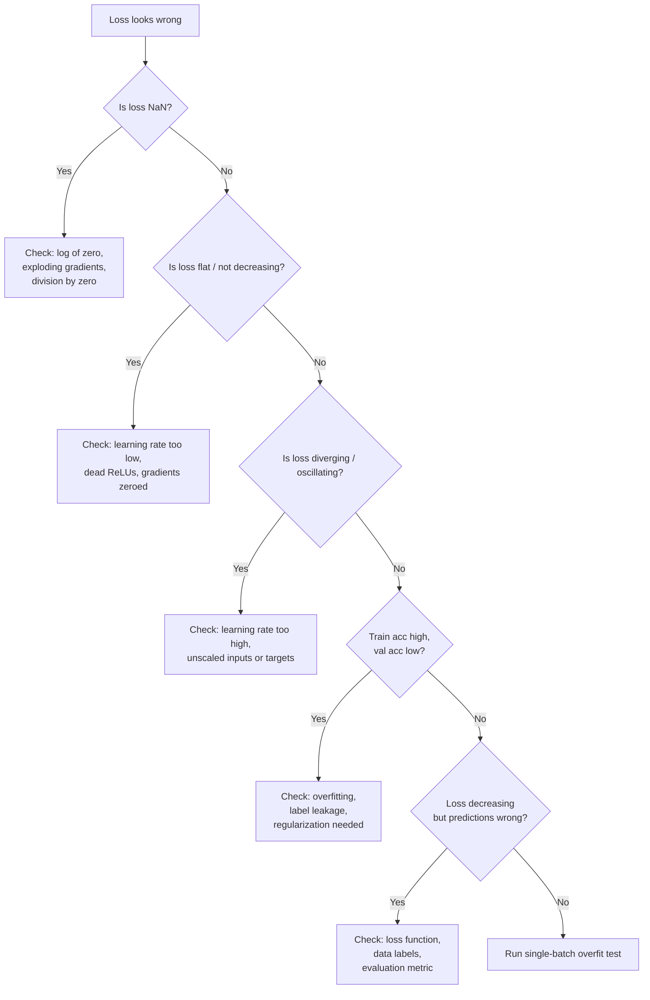

# Debugging Neural Networks

## Learning Objectives

1. Diagnose training failure modes (loss plateau, NaN, divergence) from loss curves and weight statistics.
2. Implement gradient norm tracking to detect vanishing or exploding gradients.
3. Write activation distribution checks to identify dead neurons and saturation.
4. Compare learning rate behaviors using observable training metrics.
5. Build a minimal diagnostic harness that surfaces training health signals to stdout.

## The Problem

Your network compiled. It ran. It produced a number. The number is wrong and nothing crashed. Welcome to the hardest kind of debugging — the kind where there is no error message.

Traditional software fails loudly. A null pointer throws an exception. A type mismatch fails at compile time. An off-by-one error produces a clearly wrong output. You get a stack trace, a line number, a signal. Neural networks do not give you that luxury. A broken model runs to completion, prints a loss value, and outputs predictions. The loss might decrease. The predictions might look plausible. But the model is silently wrong — learning shortcuts, memorizing noise, or converging to a useless local minimum. Andrej Karpathy's "A Recipe for Training Neural Networks" (2019) opens with this observation: the most common neural net mistakes are bugs that do not crash. Google's own internal post-mortems of ML pipeline failures found that a significant fraction of production model quality issues stemmed from silent data pipeline bugs that produced no errors but systematically degraded input quality [CITATION NEEDED — concept: Google internal ML debugging statistics].

The difference between a working model and a broken one is often a single misplaced line: a missing `zero_grad()`, a transposed dimension, a learning rate off by 10x. These bugs hide because the training loop still runs, the loss still decreases, and the output still looks like a number. You need a diagnostic methodology — a way to interrogate the model's internal state at every step and read the signals it is giving you.

This lesson builds that methodology from the data up.

## The Concept

### The Debugging Stack, Bottom-Up

Neural network debugging follows a strict order: data, loss, gradients, activations, architecture. You start at the bottom because problems at the bottom produce symptoms at the top, and fixing the top without checking the bottom wastes hours. A learning rate that looks too high might actually be unscaled features. A gradient that vanishes might actually be a label encoding bug. Check the data first, always.

**Data first.** Shuffled labels, unscaled features, and label leakage produce symptoms that look like model bugs. Before touching the architecture, print batch statistics, label distributions, and feature ranges. If your input features have a mean of 50,000 and a standard deviation of 30,000, the first linear layer's gradients will be enormous and the loss will diverge — and no amount of learning rate tuning will fix it.

**Loss curve taxonomy.** The shape of your loss curve is a diagnostic signal. A flat loss means the learning rate is too low or gradients are zeroed. A diverging loss means the learning rate is too high or targets are unscaled. A loss that drops to NaN means you are taking a log of zero, dividing by zero, or experiencing exploding gradients. Each shape maps to a specific cause, and reading the curve correctly eliminates half your hypothesis space immediately.



**Gradient flow.** Backpropagation computes gradients by multiplying them through each layer via the chain rule. If the weight matrices in your network have singular values consistently below 1, the gradient signal shrinks exponentially as it travels backward through the layers — this is vanishing gradients. If those singular values are above 1, the gradient grows exponentially — this is exploding gradients. You detect this by tracking the ratio of gradient norm to parameter norm at each layer, at each step. A healthy network maintains gradient magnitudes within a few orders of magnitude across all layers. A network with vanishing gradients shows gradients that shrink by factors of 10-100x per layer as you move toward the input.

**Activation health.** ReLU neurons that output zero for every input in a batch are dead — they receive no gradient and their weights never update. Sigmoid or tanh neurons outputting values clustered at 0.99 or -0.99 are saturated, where the gradient of the activation function is approximately zero and learning stalls. You detect dead ReLUs by computing the fraction of zero outputs per layer per batch. You detect saturation by computing the mean absolute value of sigmoid/tanh outputs — values consistently near 1.0 indicate saturation. A dead ReLU in the first layer means that neuron's incoming weights are frozen permanently; a whole layer of dead ReLUs means the network is effectively thinner than you designed it to be.

**The single-batch overfit test.** Before debugging a full training loop, verify that the model can memorize one batch of data to near-zero loss. If the model cannot overfit 32 examples, the architecture is broken, the loss function is wrong, or there is a dimension mismatch — not a hyperparameter problem. This test takes 30 seconds and eliminates an entire class of hypotheses. Run it first, every time.

The mechanism is always the same: measure, diagnose, fix. The tools — PyTorch hooks, gradient clipping, learning rate schedulers — just instrument the measurement. Understand the signal before reaching for the fix.

## Build It

Build the diagnostic harness. This is a set of functions that take a model, a batch of data, and produce a structured health report to stdout. The harness checks data statistics, computes per-layer gradient norms, measures activation distributions, and runs the single-batch overfit test. Every function prints observable output.

```python
import torch
import torch.nn as nn
import torch.nn.functional as F
from torch.utils.data import DataLoader, TensorDataset

torch.manual_seed(42)

def check_data(inputs, targets, name="dataset"):
    print(f"=== Data Check: {name} ===")
    print(f"  Inputs shape:    {inputs.shape}")
    print(f"  Inputs mean:     {inputs.mean().item():.4f}")
    print(f"  Inputs std:      {inputs.std().item():.4f}")
    print(f"  Inputs min/max:  {inputs.min().item():.4f} / {inputs.max().item():.4f}")
    if targets.dim() == 1:
        unique, counts = torch.unique(targets, return_counts=True)
        print(f"  Label classes:   {unique.tolist()}")
        print(f"  Label counts:    {counts.tolist()}")
    else:
        print(f"  Targets mean:    {targets.mean().item():.4f}")
        print(f"  Targets std:     {targets.std().item():.4f}")
    print()

X = torch.randn(500, 20) * 50 + 100
y = torch.randint(0, 3, (500,))

check_data(X, y, "unscaled_example")
```

Run that and you see the problem immediately: inputs have a mean near 100 and a standard deviation near 50. The first linear layer will produce pre-activations in the thousands, and the loss will be unstable. This is a data bug, not a model bug.

Now build the gradient and activation monitors:

```python
import torch
import torch.nn as nn
import torch.nn.functional as F

def make_hooks(model):
    activations = {}
    gradients = {}

    def make_forward_hook(name):
        def hook(module, inp, out):
            activations[name] = out.detach()
        return hook

    def make_backward_hook(name):
        def hook(module, grad_input, grad_output):
            gradients[name] = grad_output[0].detach()
        return hook

    for name, module in model.named_children():
        module.register_forward_hook(make_forward_hook(name))
        module.register_full_backward_hook(make_backward_hook(name))

    return activations, gradients


def gradient_report(model, gradients):
    print("=== Per-Layer Gradient Norms ===")
    for name, param in model.named_parameters():
        if param.grad is not None:
            grad_norm = param.grad.norm().item()
            param_norm = param.data.norm().item()
            ratio = grad_norm / (param_norm + 1e-8)
            print(f"  {name:30s} grad_norm={grad_norm:.6f}  "
                  f"param_norm={param_norm:.4f}  ratio={ratio:.6f}")
    print()

    print("=== Gradient Flow (backward pass) ===")
    prev_norm = None
    for name in sorted(gradients.keys()):
        gnorm = gradients[name].norm().item()
        marker = ""
        if prev_norm is not None and prev_norm > 0:
            shrink = gnorm / prev_norm
            if shrink < 0.1:
                marker = " <-- SHRINKING (vanishing?)"
            elif shrink > 10:
                marker = " <-- GROWING (exploding?)"
        print(f"  {name:30s} grad_norm={gnorm:.6f}{marker}")
        prev_norm = gnorm
    print()


def activation_report(activations):
    print("=== Activation Health ===")
    for name, act in activations.items():
        if act.dim() > 1:
            flat = act.view(act.size(0), -1)
        else:
            flat = act

        dead_frac = (flat == 0).float().mean().item()
        mean_val = flat.mean().item()
        std_val = flat.std().item()

        print(f"  {name:30s} mean={mean_val:+.4f}  std={std_val:.4f}  "
              f"dead_frac={dead_frac:.3f}", end="")

        if std_val < 0.01:
            print("  <-- NEARLY CONSTANT")
        elif dead_frac > 0.5:
            print("  <-- HIGH DEAD FRACTION")
        else:
            print()
    print()


model = nn.Sequential(
    nn.Linear(20, 64),
    nn.ReLU(),
    nn.Linear(64, 32),
    nn.ReLU(),
    nn.Linear(32, 3),
)

acts, grads = make_hooks(model)

X_batch = torch.randn(32, 20)
y_batch = torch.randint(0, 3, (32,))

output = model(X_batch)
loss = F.cross_entropy(output, y_batch)
loss.backward()

gradient_report(model, grads)
activation_report(acts)
```

The output shows every layer's gradient norm, parameter norm, and their ratio, plus the backward-pass gradient flow with flags for vanishing or exploding patterns. The activation report shows mean, standard deviation, and dead fraction per layer — with warnings when values cross diagnostic thresholds.

Now the single-batch overfit test — the fastest way to verify your architecture is not broken:

```python
def overfit_one_batch(model, X, y, max_steps=200, lr=0.01):
    print("=== Single-Batch Overfit Test ===")
    optimizer = torch.optim.Adam(model.parameters(), lr=lr)
    model.train()

    for step in range(max_steps):
        optimizer.zero_grad()
        output = model(X)
        loss = F.cross_entropy(output, y)
        loss.backward()
        optimizer.step()

        if step % 50 == 0 or step == max_steps - 1:
            with torch.no_grad():
                preds = output.argmax(dim=1)
                acc = (preds == y).float().mean().item()
            print(f"  Step {step:4d}  loss={loss.item():.6f}  acc={acc:.4f}")

    if loss.item() < 0.01:
        print("  RESULT: Model can overfit one batch. Architecture is OK.")
    elif loss.item() < 0.5:
        print("  RESULT: Model is learning but not converging fully. Check LR or capacity.")
    else:
        print("  RESULT: Model CANNOT overfit. Architecture or loss is broken.")
    print()


X_tiny = torch.randn(8, 20)
y_tiny = torch.randint(0, 3, (8,))

overfit_one_batch(model, X_tiny, max_steps=300, lr=0.01)
```

If the model drives loss below 0.01 on 8 examples in 300 steps, the architecture works. If it cannot, no amount of hyperparameter tuning on the full dataset will help — you have a structural bug.

## Use It

Combine the diagnostic functions into a classifier diagnostic loop. This is the pattern you reach for when a model's loss plateaus or its predictions degrade. The same measurement infrastructure that catches a vanishing gradient in a research setting catches a degrading classifier in a production GTM pipeline. When you deploy a model that classifies scraped hiring signals from directory data into intent tiers, the model's classification quality directly determines the value of downstream outbound campaigns. A model that silently degrades — because its input distribution shifted from the training data, or because a scraping pipeline change altered feature scales — produces worse intent scores without any error message. The diagnostic harness catches this before the campaign metrics do.

Consider a concrete GTM scenario: you have built a Signal Machine that ingests scraped company directory pages and news RSS feeds, extracts features, and classifies each company into intent tiers (high, medium, low). The model trained successfully — loss converged, validation accuracy hit 91%. Three weeks later, the outbound team reports that conversion rates on the "high intent" tier have dropped from 12% to 3%. Nothing crashed. The scraping pipeline is still running. The model is still producing predictions. But something changed.

This is a neural network debugging problem, not a GTM strategy problem. The model is silently wrong. The diagnostic harness lets you compare the model's internal state now against its state at training time. You run `check_data` on the current scraped features and discover the directory pages changed their HTML structure — your scraper now extracts a field with values in a different range, shifting the feature distribution. The model's first-layer activations are now saturated because the inputs are 10x larger than training. The intent classifier is producing degraded predictions on every single input. You caught it with the same data check, gradient report, and activation report from the diagnostic harness — not by analyzing outbound conversion metrics weeks later.

The loss curve taxonomy applies directly here too. When you retrain the intent classifier on the new data distribution, you watch the loss curve. If it diverges, the new scraped features are unscaled. If it plateaus, the learning rate is wrong for the new data scale. If it drops to NaN, a scraping bug introduced a null or infinity in the feature pipeline. Each shape tells you exactly where to look.

Here is a complete diagnostic loop that trains a small classifier and emits health signals at intervals:

```python
import torch
import torch.nn as nn
import torch.nn.functional as F
from torch.utils.data import TensorDataset, DataLoader

torch.manual_seed(42)

X_train = torch.randn(2000, 20)
W_true = torch.randn(20, 3) * 2
logits_true = X_train @ W_true
y_train = logits_true.argmax(dim=1)

X_val = torch.randn(400, 20)
y_val = (X_val @ W_true).argmax(dim=1)

train_ds = TensorDataset(X_train, y_train)
train_dl = DataLoader(train_ds, batch_size=64, shuffle=True)

model = nn.Sequential(
    nn.Linear(20, 128),
    nn.ReLU(),
    nn.Linear(128, 64),
    nn.ReLU(),
    nn.Linear(64, 3),
)

acts, grads = make_hooks(model)
optimizer = torch.optim.SGD(model.parameters(), lr=0.1)

print("=== Training with Diagnostics ===\n")
step = 0
for epoch in range(10):
    for Xb, yb in train_dl:
        optimizer.zero_grad()
        out = model(Xb)
        loss = F.cross_entropy(out, yb)
        loss.backward()
        optimizer.step()

        if step % 200 == 0:
            with torch.no_grad():
                train_acc = (out.argmax(1) == yb).float().mean().item()
                val_out = model(X_val)
                val_acc = (val_out.argmax(1) == y_val).float().mean().item()

            print(f"Epoch {epoch} Step {step:4d}  "
                  f"loss={loss.item():.4f}  train_acc={train_acc:.3f}  "
                  f"val_acc={val_acc:.3f}")

        if step == 400:
            print("\n--- Mid-Training Health Report ---")
            gradient_report(model, grads)
            activation_report(acts)

        step += 1

print("\n=== Final Model Health ---")
model.eval()
with torch.no_grad():
    test_out = model(X_val[:64])
    test_loss = F.cross_entropy(test_out, y_val[:64])
    test_acc = (test_out.argmax(1) == y_val[:64]).float().mean().item()
    print(f"Val loss: {test_loss.item():.4f}  Val acc: {test_acc:.4f}")
```

The training loop interleaves loss and accuracy reporting with periodic gradient and activation reports. This is the loop you modify to diagnose any training failure. If the loss plateaus, the gradient report tells you whether gradients are vanishing. If accuracy stalls, the activation report tells you whether ReLUs are dying. Every signal is observable in stdout.

## Ship It

The diagnostic harness becomes a permanent fixture in your model training pipeline. In a production Signal Machine — where scraped directory data and news feeds feed into a classifier that gates outbound campaigns — the harness runs automatically on every retraining cycle. If the data check detects feature drift (input mean shifted by more than 2 standard deviations from the last training run), the pipeline halts and alerts before deploying a degraded model. If the gradient report flags vanishing gradients or the activation report flags dead ReLUs during training, the pipeline logs the warning and attaches it to the model artifact.

This is the connection between neural network debugging and GTM execution: a silently degraded intent classifier degrades every downstream campaign that depends on it. The executive outreach campaign that leverages LinkedIn networks of identified decision-makers depends on the intent tier classification being correct. If the classifier silently degrades because the scraped feature distribution shifted, the outbound team wastes effort on companies that are no longer high-intent. The diagnostic harness is the instrumentation that prevents this — it converts silent degradation into an observable, catchable signal.

The shipping pattern is straightforward: wrap the diagnostic functions in a `DiagnoseConfig` dataclass that specifies thresholds, run them at fixed intervals during training and once after every production retrain, and fail the deployment if any threshold is crossed.

```python
from dataclasses import dataclass
import torch
import torch.nn as nn

@dataclass
class DiagnoseConfig:
    max_dead_frac: float = 0.5
    min_grad_ratio: float = 1e-6
    max_grad_ratio: float = 1e3
    min_activation_std: float = 0.01
    feature_drift_std: float = 2.0

def production_health_check(model, X_sample, X_reference, config):
    issues = []

    ref_mean = X_reference.mean(dim=0)
    ref_std = X_reference.std(dim=0) + 1e-8
    curr_mean = X_sample.mean(dim=0)
    drift = ((curr_mean - ref_mean) / ref_std).abs().max().item()

    if drift > config.feature_drift_std:
        issues.append(
            f"FEATURE_DRIFT: input mean shifted {drift:.2f} std devs from reference"
        )

    acts, grads = make_hooks(model)

    out = model(X_sample[:64])
    dummy_targets = out.argmax(dim=1)
    loss = F.cross_entropy(out, dummy_targets)
    loss.backward()

    for name, act in acts.items():
        flat = act.view(act.size(0), -1) if act.dim() > 1 else act
        dead_frac = (flat == 0).float().mean().item()
        std_val = flat.std().item()

        if dead_frac > config.max_dead_frac:
            issues.append(f"DEAD_RELU: {name} has {dead_frac:.1%} zero activations")
        if std_val < config.min_activation_std:
            issues.append(f"COLLAPSED: {name} activation std={std_val:.5f}")

    for name, param in model.named_parameters():
        if param.grad is not None:
            ratio = param.grad.norm().item() / (param.data.norm().item() + 1e-8)
            if ratio < config.min_grad_ratio:
                issues.append(f"VANISHING_GRAD: {name} grad/param ratio={ratio:.2e}")
            elif ratio > config.max_grad_ratio:
                issues.append(f"EXPLODING_GRAD: {name} grad/param ratio={ratio:.2e}")

    print("=== Production Health Check ===")
    if issues:
        for issue in issues:
            print(f"  [FAIL] {issue}")
        print(f"\n  {len(issues)} issue(s) found. Do NOT deploy this model.")
        return False
    else:
        print("  [PASS] All checks passed. Model is healthy for deployment.")
        return True


X_reference = torch.randn(500, 20)
X_current_good = torch.randn(64, 20)
X_current_drifted = torch.randn(64, 20) * 8 + 3

model_prod = nn.Sequential(
    nn.Linear(20, 128),
    nn.ReLU(),
    nn.Linear(128, 64),
    nn.ReLU(),
    nn.Linear(64, 3),
)

config = DiagnoseConfig()

print("--- Test 1: Healthy data ---")
production_health_check(model_prod, X_current_good, X_reference, config)

print("\n--- Test 2: Drifted data ---")
production_health_check(model_prod, X_current_drifted, X_reference, config)
```

The output gives you a binary pass/fail with specific diagnostic messages. In a deployment pipeline, this function gates the model artifact — if it returns `False`, the new model does not ship. The feature drift check compares current input statistics against the reference distribution from training. The gradient and activation checks catch architectural degradation. This is the same diagnostic methodology from the training loop, hardened into a production gate.

## Exercises

**Exercise 1: Loss Curve Classification**

Write a function that takes an array of loss values and prints a diagnosis. A loss curve that starts above 2.0 and never drops below 1.5 after 100 steps is "stalled." A curve that increases is "diverging." A curve containing NaN or inf is "NaN crash." A curve that reaches below 0.1 but validation loss (provided separately) is above 1.0 is "overfitting." A curve that decreases steadily to a reasonable value is "healthy." Print the classification.

```python
import numpy as np

def classify_loss_curve(train_losses, val_losses=None):
    arr = np.array(train_losses)

    if np.any(np.isnan(arr)) or np.any(np.isinf(arr)):
        nan_idx = np.argmax(np.isnan(arr) | np.isinf(arr))
        print(f"Diagnosis: NaN CRASH at step {nan_idx}")
        return

    if len(arr) > 10 and arr[-1] > arr[0]:
        print("Diagnosis: DIVERGING (loss increased)")
        return

    if len(arr) > 100 and arr[-1] > 1.5:
        print(f"Diagnosis: STALLED (final loss={arr[-1]:.4f})")
        return

    if val_losses is not None:
        varr = np.array(val_losses)
        if arr[-1] < 0.1 and varr[-1] > 1.0:
            print(f"Diagnosis: OVERFITTING (train={arr[-1]:.4f}, val={varr[-1]:.4f})")
            return

    print(f"Diagnosis: HEALTHY (final loss={arr[-1]:.4f})")


healthy = np.exp(-np.linspace(0, 5, 200)) + 0.05 + np.random.randn(200) * 0.01
diverging = np.cumsum(np.random.rand(100) * 0.1)
nan_curve = list(np.exp(-np.linspace(0, 3, 50))) + [float('nan')] * 10
overfit_train = np.exp(-np.linspace(0, 6, 200)) + 0.02
overfit_val = np.exp(-np.linspace(0, 2, 200)) + 1.2 + np.random.randn(200) * 0.1
stalled = np.ones(150) * 2.3 + np.random.randn(150) * 0.05

print("--- Healthy ---")
classify_loss_curve(healthy)
print("\n--- Diverging ---")
classify_loss_curve(diverging)
print("\n--- NaN ---")
classify_loss_curve(nan_curve)
print("\n--- Overfitting ---")
classify_loss_curve(overfit_train, overfit_val)
print("\n--- Stalled ---")
classify_loss_curve(stalled)
```

**Exercise 2: Inject and Diagnose Vanishing Gradients**

Create a deep MLP (10 layers, width 64) with sigmoid activations. Train it on the synthetic dataset from the Build It section. Add gradient norm tracking. Observe that gradient norms decrease exponentially toward the input layer. Then replace sigmoid with ReLU and compare the gradient flow. Print the per-layer gradient norms for both configurations and state which layers are affected.

```python
import torch
import torch.nn as nn
import torch.nn.functional as F

torch.manual_seed(42)

def build_deep_mlp(activation, depth=10, width=64, in_dim=20, out_dim=3):
    layers = []
    layers.append(nn.Linear(in_dim, width))
    if activation == "sigmoid":
        layers.append(nn.Sigmoid())
    else:
        layers.append(nn.ReLU())
    for i in range(depth - 2):
        layers.append(nn.Linear(width, width))
        if activation == "sigmoid":
            layers.append(nn.Sigmoid())
        else:
            layers.append(nn.ReLU())
    layers.append(nn.Linear(width, out_dim))
    return nn.Sequential(*layers)

def train_and_report(model, X, y, steps=100, lr=0.1):
    acts, grads = make_hooks(model)
    optimizer = torch.optim.SGD(model.parameters(), lr=lr)

    for step in range(steps):
        optimizer.zero_grad()
        out = model(X)
        loss = F.cross_entropy(out, y)
        loss.backward()
        optimizer.step()

    print(f"  Final loss: {loss.item():.4f}")
    print("  Per-layer backward gradient norms:")
    for name in sorted(grads.keys()):
        gnorm = grads[name].norm().item()
        print(f"    {name:30s} {gnorm:.6f}")
    print()

X = torch.randn(256, 20)
y = torch.randint(0, 3, (256,))

print("=== Deep MLP with Sigmoid (expect vanishing gradients) ===")
train_and_report(build_deep_mlp("sigmoid"), X, y, steps=100, lr=0.5)

print("=== Deep MLP with ReLU (expect healthier gradient flow) ===")
train_and_report(build_deep_mlp("relu"), X, y, steps=100, lr=0.1)
```

**Exercise 3: Activation Saturation Detector for Production Models**

Write a function that takes any `nn.Sequential` model and a dataloader, runs one forward pass over the full dataset, and prints a per-layer saturation report. For ReLU layers, report dead fraction. For Sigmoid/Tanh layers, report the fraction of outputs with absolute value above 0.95 (sigmoid) or 0.9 (tanh) — those are saturated. The function must automatically detect layer types and apply the correct check. It must work on any `nn.Sequential` model without modification.

```python
import torch
import torch.nn as nn

def saturation_report(model, dataloader, device="cpu"):
    model.eval()
    model.to(device)

    layer_stats = {}

    def get_hook(name, module):
        def hook(m, inp, out):
            if name not in layer_stats:
                if isinstance(m, nn.ReLU):
                    flat = out.detach().view(out.size(0), -1)
                    dead = (flat == 0).float().mean().item()
                    layer_stats[name] = {"type": "ReLU", "dead_frac": dead}
                elif isinstance(m, nn.Sigmoid):
                    flat = out.detach().view(out.size(0), -1)
                    sat = (flat > 0.95).float().mean().item()
                    layer_stats[name] = {"type": "Sigmoid", "sat_frac": sat}
                elif isinstance(m, nn.Tanh):
                    flat = out.detach().view(out.size(0), -1)
                    sat = (flat.abs() > 0.9).float().mean().item()
                    layer_stats[name] = {"type": "Tanh", "sat_frac": sat}
        return hook

    hooks = []
    for name, module in model.named_children():
        h = module.register_forward_hook(get_hook(name, module))
        hooks.append(h)

    with torch.no_grad():
        for Xb, _ in dataloader:
            model(Xb.to(device))

    for h in hooks:
        h.remove()

    print("=== Saturation Report ===")
    for name, stats in layer_stats.items():
        atype = stats["type"]
        if atype == "ReLU":
            frac = stats["dead_frac"]
            flag = " <-- HIGH DEAD FRACTION" if frac > 0.5 else ""
            print(f"  {name:30s} [{atype:7s}]  dead_frac={frac:.3f}{flag}")
        elif atype in ("Sigmoid", "Tanh"):
            frac = stats["sat_frac"]
            flag = " <-- SATURATED" if frac > 0.3 else ""
            print(f"  {name:30s} [{atype:7s}]  sat_frac={frac:.3f}{flag}")
    print()


model_test = nn.Sequential(
    nn.Linear(20, 64),
    nn.ReLU(),
    nn.Linear(64, 64),
    nn.Sigmoid(),
    nn.Linear(64, 32),
    nn.Tanh(),
    nn.Linear(32, 3),
)

X_big = torch.randn(500, 20) * 5
y_big = torch.randint(0, 3, (500,))
dl = DataLoader(TensorDataset(X_big, y_big), batch_size=64)

saturation_report(model_test, dl)
```

## Key Terms

**Vanishing gradients** — A condition where gradient magnitudes decrease exponentially as backpropagation moves toward earlier layers, caused by weight matrices with singular values below 1 or activation functions with small derivatives (sigmoid, tanh in saturated regions). Early layers stop learning.

**Exploding gradients** — The inverse condition: gradient magnitudes grow exponentially through layers, causing unstable weight updates and often NaN loss. Caused by singular values above 1 or unscaled inputs producing large pre-activations.

**Dead ReLU** — A ReLU unit that outputs zero for every input in a batch, meaning its gradient is always zero and its weights never update. Caused by a large negative bias or weights that push all pre-activations below zero. Irreversible without reinitialization.

**Saturation** — A sigmoid or tanh neuron operating in the flat tail of its activation function (outputs near ±1), where the derivative is approximately zero. The neuron receives near-zero gradient and stops learning.

**Single-batch overfit test** — A diagnostic procedure that trains a model on a single batch of data to verify it can reach near-zero loss. If it cannot, the architecture or loss function is broken — not the hyperparameters.

**Gradient norm ratio** — The ratio of the gradient's L2 norm to the parameter's L2 norm, computed per layer. Used to detect vanishing gradients (ratio approaching zero) or exploding gradients (ratio orders of magnitude above typical values).

**Feature drift** — A shift in the input data distribution between training and inference time. In