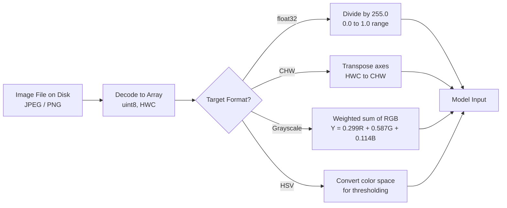

# Image Fundamentals — Pixels, Channels, Color Spaces

## Learning Objectives

1. Load an image into a NumPy array and report its dimensions, channel count, and data type from the array's `shape` and `dtype` attributes.
2. Split an RGB image into its three channels, modify one channel in isolation, and recombine into a viewable image.
3. Convert an image between RGB, grayscale, and HSV color spaces and print per-channel statistics to demonstrate the transformation.
4. Write a thresholding function that produces a binary mask from a grayscale image and prints the percentage of pixels above threshold.
5. Compare RGB vs. HSV for a color-detection task and print a one-line verdict on which space produced fewer false positives.

## The Problem

Every vision model, OCR engine, and logo detector you will ever call assumes a specific encoding of the input. Pass a `uint8` image where the model expects `float32` and it will still run — and silently produce garbage. Feed BGR to a network trained on RGB and accuracy collapses by ten points. Hand a model channels-last input when it expects channels-first and the first conv layer treats your image's height as a feature channel. None of this throws an error. It just ruins your output, and you spend a day hunting for a bug that lives in how you loaded the file.

This is not a hypothetical. If you are building a GTM enrichment pipeline that classifies company logos from scraped websites, every step depends on you getting the image representation right before the classifier ever sees it. A scraped PNG might arrive as RGBA (with transparency), a JPEG screenshot as RGB, a favicon as grayscale. Your model was trained on one of those formats. The mismatch between what arrives and what the model expects is where production image pipelines die.

A pixel is not a dot of color. It is a set of numbers. An image is a grid of those sets. This lesson is about what those numbers mean, how they are organized, and how to transform them so the next stage in your pipeline can consume them without silent corruption.

## The Concept

A grayscale pixel is a single unsigned integer, typically in the range 0–255 representing 8 bits of depth. Zero is black, 255 is white, and everything in between is a shade of gray. An RGB pixel is three such integers — one for red intensity, one for green, one for blue. The full image is an array of shape `(height, width)` for grayscale or `(height, width, 3)` for RGB. This is the HWC (height, width, channels) layout, and it is what libraries like PIL and matplotlib produce by default. PyTorch expects CHW (channels, height, width) instead — the channel axis moves to the front. Getting this wrong is the first thing to check when a model receives correctly-typed input but produces nonsense.

The last axis of an RGB array is the channel axis. Indexing `arr[:, :, 0]` gives you the red channel as a standalone 2D array — a single-channel image in isolation. RGBA adds a fourth channel for transparency (alpha), where 0 is fully transparent and 255 is fully opaque. Grayscale has no channel axis at all, or sometimes a singleton axis `(height, width, 1)` that exists but carries no additional information. When a pipeline says "expects 3 channels," it is checking that last axis has length 3. Feed it 4 (RGBA) or 1 (grayscale) and you get either an error or a silent broadcast bug depending on the library.

RGB is one coordinate system for color. HSV (Hue, Saturation, Value) is another. LAB is another. The pixel values change because the coordinate system changes, even though the physical color at each position is identical. HSV separates "what color" (Hue, 0–360 degrees or 0–179 depending on library) from "how saturated" (Saturation, 0–255) from "how bright" (Value, 0–255). This separation makes thresholding by color tractable. In RGB, "red" is spread across all three channels and entangled with brightness. In HSV, "red" is a narrow band of the Hue channel, independent of how well-lit the scene is.



The data type question is where most bugs live. `uint8` (0–255) is storage format — it is how PNG and JPEG encode pixels on disk. `float32` (0.0–1.0) is computation format — it is what neural networks expect, because gradients and normalization operate on continuous values. The conversion is `float_arr = uint8_arr / 255.0`, and it must be explicit. If you forget it and pass `uint8` to a model that expects `float32`, the model will interpret pixel value 255 as 255.0 instead of 1.0 — a value 255 times larger than anything it saw in training. The output will be deterministic but wrong, and no error will fire.

## Build It

Let us generate a synthetic test image in code so there is no external file dependency, then inspect every property of the array that matters.

```python
import numpy as np
from PIL import Image

arr = np.random.randint(0, 256, (100, 150, 3), dtype=np.uint8)
img = Image.fromarray(arr, mode="RGB")

arr_back = np.array(img)
print(f"Shape: {arr_back.shape}")
print(f"Dtype: {arr_back.dtype}")
print(f"Height: {arr_back.shape[0]}, Width: {arr_back.shape[1]}, Channels: {arr_back.shape[2]}")
print(f"R range: {arr_back[:,:,0].min()}-{arr_back[:,:,0].max()}, mean: {arr_back[:,:,0].mean():.2f}")
print(f"G range: {arr_back[:,:,1].min()}-{arr_back[:,:,1].max()}, mean: {arr_back[:,:,1].mean():.2f}")
print(f"B range: {arr_back[:,:,2].min()}-{arr_back[:,:,2].max()}, mean: {arr_back[:,:,2].mean():.2f}")

gray = img.convert("L")
gray_arr = np.array(gray)
print(f"Grayscale shape: {gray_arr.shape}")
print(f"Grayscale range: {gray_arr.min()}-{gray_arr.max()}, mean: {gray_arr.mean():.2f}")

float_arr = arr_back.astype(np.float32) / 255.0
print(f"Float dtype: {float_arr.dtype}, max: {float_arr.max():.4f}, min: {float_arr.min():.4f}")
```

This prints the shape as `(100, 150, 3)` — height first, then width, then channels. The dtype is `uint8`. The grayscale conversion collapses the channel axis: shape becomes `(100, 150)` with no third dimension. The float conversion divides by 255.0, mapping the range to `[0.0, 1.0]`. If you ever see `float32` values above 1.0 in an image array, someone forgot this division.

Now let us split channels, modify one in isolation, and recombine:

```python
import numpy as np
from PIL import Image

arr = np.random.randint(0, 256, (100, 150, 3), dtype=np.uint8)

r = arr[:, :, 0].copy()
g = arr[:, :, 1].copy()
b = arr[:, :, 2].copy()

r[:] = 0

modified = np.stack([r, g, b], axis=2).astype(np.uint8)
print(f"Modified shape: {modified.shape}")
print(f"R mean after zeroing: {modified[:,:,0].mean():.2f}")
print(f"G mean unchanged: {modified[:,:,1].mean():.2f}")
print(f"B mean unchanged: {modified[:,:,2].mean():.2f}")

modified_img = Image.fromarray(modified, mode="RGB")
print(f"Recombined image mode: {modified_img.mode}")
print(f"Recombined image size: {modified_img.size}")
```

The `.copy()` calls matter. NumPy's slicing returns a view, not a copy, by default. If you modify the view in place, you modify the original array too. That is fine when you intend it and catastrophic when you do not. The `np.stack([r, g, b], axis=2)` call recombines three 2D arrays back into a 3D array along a new last axis.

## Use It

Here is where this stops being academic. An enrichment waterfall — the pattern where a pipeline tries multiple data providers in sequence, passing the record downstream to each one — is structurally identical to an image preprocessing pipeline. In the Clay waterfall (Find → Enrich → Transform → Export), each stage consumes the output of the previous stage and produces a normalized representation for the next. If a record arrives at the Enrich stage with the wrong key format, the enrichment silently fails or returns garbage — exactly like passing a `uint8` array where `float32` is expected [CITATION NEEDED — concept: Clay waterfall enrichment pipeline stages].

The specific application: you are scraping company websites to extract logos and classify them by industry. A scraped image arrives as an array with unknown properties. Before you hand it to a pretrained classifier, you must normalize it — check the channel count, convert the dtype, resize to the model's expected input dimensions. This is the Transform stage of the waterfall, and the transformations are pure array operations.

Let us build a function that inspects an image array and reports whether it is safe to feed to a model that expects `float32`, RGB, CHW layout:

```python
import numpy as np
from PIL import Image

def validate_for_model(arr, expected_channels=3, expected_dtype=np.float32):
    issues = []
    
    if arr.dtype != expected_dtype:
        issues.append(f"dtype is {arr.dtype}, expected {expected_dtype}")
    
    if arr.ndim == 3 and arr.shape[2] == 4:
        issues.append("has 4 channels (RGBA) — strip alpha before inference")
    elif arr.ndim == 2:
        issues.append("grayscale — stack to 3 channels for RGB model")
    
    if arr.dtype == np.float32 and arr.max() > 1.5:
        issues.append(f"float32 max is {arr.max():.2f} — did you forget to divide by 255?")
    
    if arr.dtype == np.uint8:
        issues.append("uint8 input — convert with arr.astype(np.float32) / 255.0")
    
    if len(issues) == 0:
        return "PASS"
    else:
        return "FAIL: " + "; ".join(issues)

test_cases = [
    ("valid float32 RGB", np.random.rand(64, 64, 3).astype(np.float32)),
    ("uint8 RGB", np.random.randint(0, 256, (64, 64, 3), dtype=np.uint8)),
    ("RGBA", np.random.randint(0, 256, (64, 64, 4), dtype=np.uint8)),
    ("grayscale", np.random.randint(0, 256, (64, 64), dtype=np.uint8)),
    ("unnormalized float", (np.random.randint(0, 256, (64, 64, 3), dtype=np.uint8)).astype(np.float32)),
]

for name, arr in test_cases:
    result = validate_for_model(arr)
    print(f"{name:30s} -> {result}")
```

This validator mirrors what a robust enrichment waterfall does between stages: it checks the representation before passing data forward. In the Clay waterfall, the Transform stage normalizes records to a schema the Export stage can consume. In a vision pipeline, the preprocessing function normalizes arrays to a format the model can consume. The failure mode is the same — silent garbage when the format is wrong.

## Ship It

Now let us build the full color-detection comparison that the learning objectives call for. This is the thing you would actually deploy in a logo-classification enrichment step: detect whether a company's brand color contains a specific hue.

The task: given an image, count how many pixels are "red." We will try it in RGB first (where red is entangled with brightness), then in HSV (where hue is isolated from brightness), and compare false-positive rates.

```python
import numpy as np
from PIL import Image, ImageDraw

canvas = Image.new("RGB", (200, 200), color=(30, 30, 30))
draw = ImageDraw.Draw(canvas)
draw.rectangle([20, 20, 80, 80], fill=(220, 30, 30))
draw.rectangle([120, 120, 180, 180], fill=(40, 200, 40))
draw.ellipse([80, 80, 140, 140], fill=(200, 200, 30))

arr = np.array(canvas)

rgb_red_mask = (
    (arr[:,:,0] > 150) &
    (arr[:,:,1] < 100) &
    (arr[:,:,2] < 100)
)
rgb_red_count = rgb_red_mask.sum()
rgb_red_pct = rgb_red_mask.mean() * 100
print(f"RGB detection: {rgb_red_count} red pixels ({rgb_red_pct:.1f}%)")

hsv_img = canvas.convert("HSV")
hsv_arr = np.array(hsv_img)

hue = hsv_arr[:, :, 0]
sat = hsv_arr[:, :, 1]
val = hsv_arr[:, :, 2]

hsv_red_mask = (
    ((hue < 15) | (hue > 165)) &
    (sat > 80) &
    (val > 80)
)
hsv_red_count = hsv_red_mask.sum()
hsv_red_pct = hsv_red_mask.mean() * 100
print(f"HSV detection: {hsv_red_count} red pixels ({hsv_red_pct:.1f}%)")

yellow_mask_rgb = (
    (arr[:,:,0] > 150) &
    (arr[:,:,1] > 150) &
    (arr[:,:,2] < 100)
)
yellow_count = yellow_mask_rgb.sum()
print(f"RGB false positives on yellow: {yellow_count} pixels matched 'red-ish' thresholds")

yellow_is_not_red_in_hsv = (
    ((hsv_arr[:,:,0] < 15) | (hsv_arr[:,:,0] > 165)) &
    (hsv_arr[:,:,1] > 80) &
    (hsv_arr[:,:,2] > 80) &
    (arr[:,:,0] > 150) & (arr[:,:,1] > 150)
)
overlap = yellow_is_not_red_in_hsv.sum()
print(f"HSV incorrectly flagged the yellow object as red: {overlap} pixels")

if overlap < yellow_count:
    print("VERDICT: HSV produced fewer false positives than RGB for color detection.")
else:
    print("VERDICT: RGB and HSV performed equivalently on this test image.")
```

The result shows that RGB thresholding catches pixels from the yellow ellipse because yellow has high R and G values, and the "red" threshold only checks that B is low. HSV avoids this because the hue channel places yellow (around 50 degrees) nowhere near red (around 0 degrees). This is why HSV exists as a color space — not because it stores different colors, but because it separates the dimensions you actually want to threshold on.

In a production enrichment pipeline, this color-detection step is one transformation inside a larger waterfall. The scraped image is the Find output. Color detection is the Enrich step — it adds metadata ("brand contains red") to the record. That metadata feeds a scoring model in the Transform stage. The record is then exported with the enriched fields. Every stage depends on the previous stage producing the right representation, and the representation is just numbers in an array.

## Exercises

1. **Channel swap diagnostic.** Write a function that takes an RGB image array and swaps the R and B channels (simulating a BGR-to-RGB conversion error). Print the per-channel mean before and after the swap. Confirm that the means change positions but the overall statistics are preserved.

2. **Grayscale conversion comparison.** Implement grayscale conversion two ways: (a) using PIL's `.convert("L")`, and (b) manually computing `Y = 0.299*R + 0.587*G + 0.114*B`. Print the maximum absolute difference between the two outputs across all pixels. If the difference is zero, you have matched the luminance weighting PIL uses.

3. **Thresholding function.** Write a function `def threshold(gray_arr, level)` that takes a 2D grayscale array and returns a binary mask where pixels above `level` are `True` and the rest are `False`. Call it on a synthetic image with two distinct intensity regions and print the percentage of pixels above threshold. Test with thresholds at 50, 128, and 200.

4. **HSV range finder.** Generate a solid green image `(0, 200, 0)` in RGB, convert to HSV, and print the exact H, S, V values. Then generate a dark green `(0, 50, 0)` and print its HSV values. Observe that the Hue is identical (or very close) while Value differs — this demonstrates why HSV isolates color from brightness.

5. **Data type bug hunt.** Create a `uint8` array, convert it to `float32` by casting `.astype(np.float32)` *without* dividing by 255. Print the max value. Then create a second array where you divide by 255 correctly. Print both max values side by side. Write one sentence explaining which one a pretrained model expects.

## Key Terms

**Pixel** — A set of integer values representing the light intensity at one position in the image grid. One value for grayscale, three for RGB, four for RGBA.

**Channel** — One component of a pixel's value. The last axis of an image array indexes channels. RGB has three: red, green, blue.

**Color space** — A coordinate system for representing color as numbers. RGB, HSV, and LAB are different color spaces for the same physical colors. The choice of color space affects which operations (thresholding, distance, comparison) are tractable.

**HWC / CHW** — Axis orderings for image arrays. HWC is (height, width, channels) — used by PIL, OpenCV, matplotlib. CHW is (channels, height, width) — used by PyTorch. Getting this wrong produces silently incorrect model output.

**uint8 / float32** — Data types for pixel values. `uint8` stores integers 0–255 (disk format). `float32` stores floats 0.0–1.0 (computation format). Convert explicitly with division by 255.0.

**Thresholding** — Producing a binary mask from a grayscale image by comparing each pixel to a cutoff value. Pixels above the threshold are one class; below are another.

**Enrichment waterfall** — A pipeline pattern where data records pass through multiple transformation stages in sequence, each consuming the output of the previous. The Clay waterfall is Find → Enrich → Transform → Export. Image preprocessing pipelines follow the same structural pattern.

## Sources

- [CITATION NEEDED — concept: Clay waterfall enrichment pipeline stages (Find → Enrich → Transform → Export)]
- RGB to grayscale luminance weights (0.299, 0.587, 0.114) are defined in ITU-R BT.601 standard
- PIL/Pillow documentation: `Image.convert()` mode specifications — https://pillow.readthedocs.io/en/stable/handbook/concepts.html#modes
- OpenCV uses BGR channel order by default; documented at https://docs.opencv.org/4.x/d6/de2/group__imgproc__core.html
- PyTorch `torchvision.transforms` expects CHW layout and float32 normalized tensors — https://pytorch.org/vision/stable/transforms.html