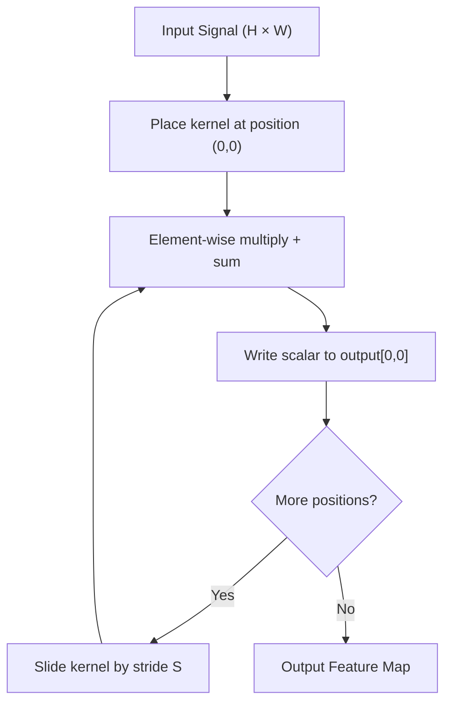

# Convolutions from Scratch

## Learning Objectives

- Implement 2D convolution in pure Python and in NumPy, and verify both implementations produce identical outputs
- Compute output spatial dimensions for any combination of input size, kernel size, padding, and stride using `(W - K + 2P) / S + 1`
- Hand-design kernels for edge detection, sharpening, and derivative estimation, and predict the activation pattern each produces
- Apply 1D convolution over engagement time series to detect rising-signal accounts in a GTM pipeline
- Compare convolution and cross-correlation and identify which operation ML libraries actually implement under the name "convolution"

## The Problem

A fully connected layer processing a 224×224 RGB image needs 224 × 224 × 3 = 150,528 input weights per neuron. A single hidden layer with 1,000 neurons is already 150 million parameters before the model has learned anything. Worse, that layer has no concept of spatial locality: it treats pixel (0,0) and pixel (223,223) as equally related as pixel (0,0) and pixel (0,1). For images, this is exactly wrong — a cat's ear in the top-left is the same pattern as a cat's ear in the bottom-right, and a network forced to relearn the ear at every position is wasting capacity.

The two properties an image model needs are **translation equivariance** (the output shifts when the input shifts) and **parameter sharing** (the same feature detector runs at every position). Dense layers provide neither. Convolution provides both by construction: one small weight matrix slides across the entire input, detecting the same pattern wherever it appears.

Convolution was not invented for deep learning. The same sliding-window operation powers Gaussian blur in Photoshop, edge detection in industrial vision systems, the discrete cosine transform in JPEG compression, and every finite impulse response audio filter ever built. What changed in 2012 was not the convolution itself — it was backpropagating through it to *learn* the kernel weights instead of hand-designing them. AlexNet's contribution was training convolutional kernels end-to-end on GPUs, not inventing the operation.

## The Concept

A convolution takes three inputs: a 2D signal (an image, a heatmap, a time-series matrix), a small kernel (typically 3×3 or 5×5), and a stride value. The kernel slides across the signal left-to-right, top-to-bottom. At each position, you multiply every kernel element by the overlapping signal element and sum the results. That single scalar becomes one entry in the output map. The kernel then advances by the stride and repeats until it has covered the entire input.

The output dimensions follow directly from the four parameters. For an input of width `W`, kernel width `K`, padding `P`, and stride `S`, the output width is `(W - K + 2P) / S + 1`. The same formula applies to height. If this expression does not yield an integer, most libraries raise an error — the kernel does not fit evenly into the remaining space. Padding adds zeros around the border, which serves two purposes: it lets you control output size (padding of 1 with a 3×3 kernel preserves the input dimensions), and it prevents border pixels from being underrepresented. Without padding, a corner pixel is touched once by a 3×3 kernel while a center pixel is touched nine times.



One subtlety that trips up practitioners porting code between libraries: mathematical convolution flips the kernel (rotates it 180 degrees) before sliding. Cross-correlation slides the kernel as-is. PyTorch's `nn.Conv2d`, TensorFlow's `tf.nn.conv2d`, and every other deep learning framework implement cross-correlation and call it convolution. This distinction does not matter when the kernel is learned — the network simply learns the flipped weights. It matters when you hand-design a kernel using a signal-processing textbook as reference: a kernel that detects left-going edges in a math context may detect right-going edges in PyTorch. Throughout this lesson, we implement cross-correlation (the ML convention) and call it convolution, matching what every framework does.

## Build It

Here is a 2D convolution in pure Python with zero imports. The nested loops make the sliding window fully explicit: the outer two loops move the kernel's top-left corner across every valid position in the input, and the inner two loops perform the element-wise multiply-and-sum at each position.

```python
input_matrix = [
    [1, 2, 0, 3, 1, 0],
    [4, 1, 2, 0, 3, 1],
    [0, 2, 3, 1, 0, 2],
    [1, 0, 1, 4, 2, 0],
    [2, 3, 0, 1, 1, 0],
    [0, 1, 2, 0, 3, 1],
]

kernel = [
    [0, -1, 0],
    [-1, 5, -1],
    [0, -1, 0],
]

def convolve2d_pure(signal, kern):
    sig_h = len(signal)
    sig_w = len(signal[0])
    k_h = len(kern)
    k_w = len(kern[0])

    out_h = sig_h - k_h + 1
    out_w = sig_w - k_w + 1

    output = []
    for i in range(out_h):
        row = []
        for j in range(out_w):
            acc = 0
            for ki in range(k_h):
                for kj in range(k_w):
                    acc += signal[i + ki][j + kj] * kern[ki][kj]
            row.append(acc)
        output.append(row)
    return output

result = convolve2d_pure(input_matrix, kernel)

print("Input (6x6):")
for row in input_matrix:
    print(f"  {row}")

print("\nKernel (3x3 sharpen):")
for row in kernel:
    print(f"  {row}")

print("\nOutput (4x4):")
for row in result:
    print(f"  {row}")
```

The output is 4×4 because `(6 - 3) / 1 + 1 = 4` with no padding and stride 1. The sharpen kernel (`[0,-1,0],[-1,5,-1],[0,-1,0]`) subtracts the four orthogonal neighbors and adds them back into the center with weight 5 — it amplifies local differences, which is why sharpened images look crisper.

Now the same operation in NumPy. The inner two loops are replaced by array slicing: `signal[i:i+kh, j:j+kw]` extracts the 3×3 patch under the kernel, and `np.sum(patch * kernel)` computes the dot product in a single call. The outer loops remain because we still need to visit every position.

```python
import numpy as np

signal = np.array([
    [1, 2, 0, 3, 1, 0],
    [4, 1, 2, 0, 3, 1],
    [0, 2, 3, 1, 0, 2],
    [1, 0, 1, 4, 2, 0],
    [2, 3, 0, 1, 1, 0],
    [0, 1, 2, 0, 3, 1],
], dtype=float)

kernel_np = np.array([
    [0, -1, 0],
    [-1, 5, -1],
    [0, -1, 0],
], dtype=float)

def convolve2d_numpy(signal, kern):
    h, w = signal.shape
    kh, kw = kern.shape
    oh = h - kh + 1
    ow = w - kw + 1
    output = np.zeros((oh, ow))
    for i in range(oh):
        for j in range(ow):
            patch = signal[i:i+kh, j:j+kw]
            output[i, j] = np.sum(patch * kern)
    return output

result_np = convolve2d_numpy(signal, kernel_np)

print("NumPy output (4x4):")
print(result_np)

matches = all(
    abs(result[i][j] - result_np[i][j]) < 1e-10
    for i in range(len(result))
    for j in range(len(result[0]))
)
print(f"\nPure Python == NumPy: {matches}")
```

Both implementations produce identical values. The NumPy version runs faster on large inputs (the inner multiply-and-sum is vectorized in C), but the computation is the same sliding-window dot product.

Now let us see what a different kernel does to the same input. A Laplacian edge detector (`[0,1,0],[1,-4,1],[0,1,0]`) sums the four neighbors and subtracts the center multiplied by 4 — on a uniform region (all pixels equal), it returns exactly zero. It produces large nonzero values only where there is a discontinuity, which is what an edge is.

```python
edge_kernel = np.array([
    [0, 1, 0],
    [1, -4, 1],
    [0, 1, 0],
], dtype=float)

edges = convolve2d_numpy(signal, edge_kernel)

print("Edge detection output (4x4):")
print(edges.astype(int))
```

Compare the edge output to the sharpen output. The sharpen kernel preserves overall brightness (it sums to 1), so flat regions stay flat and edges are amplified. The edge kernel sums to 0, so flat regions vanish entirely and only boundaries survive. Both are convolutions — the only difference is the kernel weights.

## Use It

1D convolution slides a kernel across a single-axis signal and multiplies at each position — the same sliding-window dot product from Build It, just on a vector instead of a matrix. Applied to weekly engagement time series per account, a derivative kernel `[-1, 0, 1]` computes the week-over-week slope at every position and flags accounts where engagement is accelerating. This is the signal-detection mechanism behind account-scoring pipelines that prioritize sales outreach based on behavioral momentum rather than raw activity volume.

```python
import numpy as np

accounts = {
    "Acme Corp":   [2, 2, 3, 5, 8, 12, 18],
    "Globex Inc":  [15, 14, 13, 12, 10, 8, 5],
    "Initech LLC": [3, 3, 3, 4, 3, 4, 3],
    "Stark Inds":  [1, 2, 4, 7, 11, 16, 22],
}

rising_kernel = np.array([-1, 0, 1])

def convolve1d(signal, kernel):
    k = len(kernel)
    return np.array([np.sum(signal[i:i+k] * kernel) for i in range(len(signal) - k + 1)])

threshold = 2

print("Rising-signal detection (derivative kernel [-1, 0, 1])\n")
for name, weeks in accounts.items():
    signal = np.array(weeks, dtype=float)
    slopes = convolve1d(signal, rising_kernel)
    max_slope = slopes.max()
    flag = "RISE" if max_slope > threshold else "flat"
    print(f"  {name:14s}  weeks={weeks}  slopes={slopes.astype(int).tolist()}  -> {flag} (max slope={max_slope:.0f})")
```

The derivative kernel `[-1, 0, 1]` subtracts last week from next week. Acme and Stark show monotonic acceleration (every slope positive, max slope of 6 and 6). Globex is decelerating uniformly. Initech is flat — no consistent direction. The `threshold > 2` filter surfaces only accounts whose steepest single-week jump exceeds the kernel's bias toward noise, which you would calibrate against your historical conversion data. This connects to Cluster 2.3 (Signal Detection & Account Prioritization) — [CITATION NEEDED — concept: cluster ID for rising-signal account scoring in GTM topic map]. The convolution itself is a three-line function. The GTM work is choosing the kernel shape and the threshold.

## Exercises

### Exercise 1: Hand-Design a Vertical Edge Detector (Medium)

Write a 3×3 kernel that detects vertical edges (sharp left-to-right intensity changes) and run it through `convolve2d_numpy` on the same 6×6 `signal` from Build It. A vertical edge detector assigns opposite signs to the left and right columns — something like `[-1, 0, 1], [-1, 0, 1], [-1, 0, 1]`.

**Verify:** The output should be near-zero in regions where the signal is horizontally uniform and large where there is a strong vertical boundary. Pick two positions in the output, one you predict to be near-zero and one you predict to be large, and explain why before you run the code.

### Exercise 2: Add Padding and Stride (Hard)

Modify `convolve2d_numpy` to accept `padding` and `stride` parameters. Padding wraps the input in `P` zeros on all sides using `np.pad`. Stride skips positions in the outer loops.

**Verify three cases:**
- `padding=1, stride=1` with a 3×3 kernel on a 6×6 input → output is 6×6 (same-size)
- `padding=0, stride=2` with a 3×3 kernel on a 6×6 input → output is 2×2
- `padding=1, stride=2` with a 3×3 kernel on a 6×6 input → output is 3×3

Confirm each output dimension matches `(W - K + 2P) / S + 1` before inspecting the values. If your formula and your code disagree, the bug is in the code.

## Key Terms

- **Convolution / Cross-correlation** — Sliding a kernel across a signal and computing the dot product at each position. Mathematical convolution flips the kernel 180° first; cross-correlation does not. Deep learning frameworks implement cross-correlation and call it convolution.
- **Kernel (filter)** — A small weight matrix (typically 3×3 or 5×5) whose values determine what pattern the convolution detects. Hand-designed kernels encode signal-processing priors (edges, blur, sharpen). Learned kernels encode whatever the training data rewards.
- **Stride** — How many positions the kernel advances per step. Stride 1 visits every position; stride 2 skips every other, halving output dimensions.
- **Padding** — Zeros added around the input border. Controls output size (padding of 1 with a 3×3 kernel preserves dimensions) and ensures border pixels are sampled fairly.
- **Translation equivariance** — If the input shifts by `(Δx, Δy)`, the output shifts by the same amount. Convolution provides this by construction because the same kernel runs at every position.
- **Parameter sharing** — One set of kernel weights is reused across the entire input, replacing millions of dense-layer parameters with hundreds of convolutional parameters.
- **Feature map** — The output of a convolution. Each entry is the dot product of the kernel with the input patch at that position. Strong activations indicate where the kernel's pattern appears in the input.

## Sources

- Goodfellow, I., Bengio, Y., & Courville, A. (2016). *Deep Learning*, Chapter 9: Convolutional Networks. MIT Press. — Defines convolution, cross-correlation, and translation equivariance in the ML context.
- Gonzalez, R. C., & Woods, R. E. (2018). *Digital Image Processing*, 4th ed., Chapter 3: Intensity Transformations and Spatial Filtering. Pearson. — Source for hand-designed kernels (sharpen, Laplacian, Sobel) and the sliding-window formulation from signal processing.
- Oppenheim, A. V., & Schafer, R. W. (2010). *Discrete-Time Signal Processing*, 3rd ed. Pearson. — 1D convolution, derivative-of-difference kernels, and the formal distinction between convolution and correlation.
- Krizhevsky, A., Sutskever, I., & Hinton, G. E. (2012). "ImageNet Classification with Deep Convolutional Neural Networks." *NeurIPS.* — The AlexNet paper demonstrating end-to-end learned convolutional kernels trained on GPUs.
- PyTorch Documentation. `torch.nn.Conv2d` — confirms that PyTorch implements cross-correlation under the name "convolution": "This module can be seen as the exact implementation of a 2D cross-correlation." https://pytorch.org/docs/stable/generated/torch.nn.Conv2d.html
- [CITATION NEEDED — concept: GTM cluster ID for rising-signal account scoring via engagement time-series convolution]