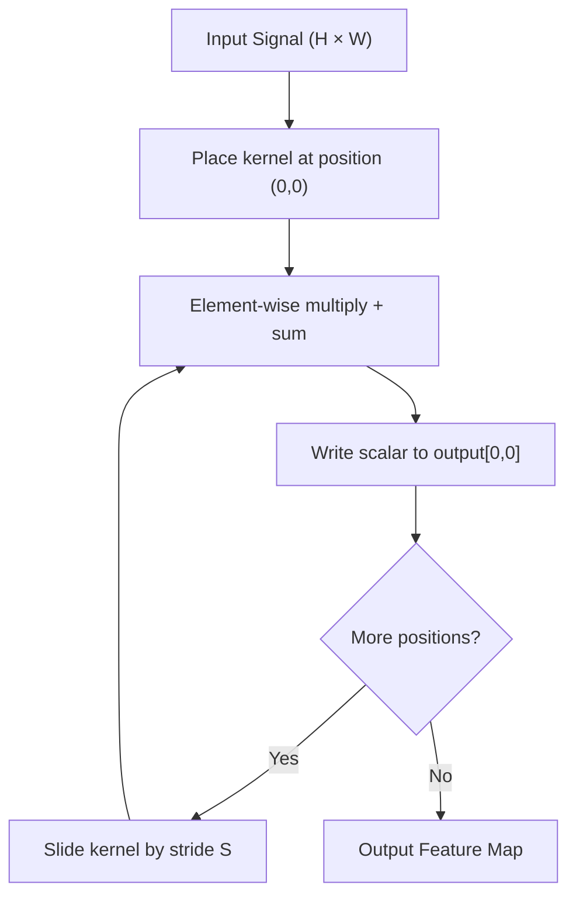

# Convolutions from Scratch

## Learning Objectives

- Implement 2D convolution in pure Python and in NumPy, and verify both implementations produce identical outputs
- Compute output spatial dimensions for any combination of input size, kernel size, padding, and stride using `(W - K + 2P) / S + 1`
- Hand-design kernels for edge detection, sharpening, and derivative estimation, and predict the activation pattern each produces
- Apply 1D convolution over engagement time series to detect rising-signal accounts in a GTM pipeline
- Compare convolution and cross-correlation and identify which operation ML libraries actually implement under the name "convolution"

## The Problem

A fully connected layer processing a 224×224 RGB image needs 224 × 224 × 3 = 150,528 input weights per neuron. A single hidden layer with 1,000 neurons is already 150 million parameters before the model has learned anything. Worse, that layer has no concept of spatial locality: it treats pixel (0,0) and pixel (223,223) as equally related as pixel (0,0) and pixel (0,1). For images, this is exactly wrong — a cat's ear in the top-left is the same pattern as a cat's ear in the bottom-right, and a network forced to relearn the ear at every position is wasting capacity.

The two properties an image model needs are **translation equivariance** (the output shifts when the input shifts) and **parameter sharing** (the same feature detector runs at every position). Dense layers provide neither. Convolution provides both by construction: one small weight matrix slides across the entire input, detecting the same pattern wherever it appears.

Convolution was not invented for deep learning. The same sliding-window operation powers Gaussian blur in Photoshop, edge detection in industrial vision systems, the discrete cosine transform in JPEG compression, and every finite impulse response audio filter ever built. What changed in 2012 was not the convolution itself — it was backpropagating through it to *learn* the kernel weights instead of hand-designing them. AlexNet's contribution was training convolutional kernels end-to-end on GPUs, not inventing the operation.

## The Concept

A convolution takes three inputs: a 2D signal (an image, a heatmap, a time-series matrix), a small kernel (typically 3×3 or 5×5), and a stride value. The kernel slides across the signal left-to-right, top-to-bottom. At each position, you multiply every kernel element by the overlapping signal element and sum the results. That single scalar becomes one entry in the output map. The kernel then advances by the stride and repeats until it has covered the entire input.

The output dimensions follow directly from the four parameters. For an input of width `W`, kernel width `K`, padding `P`, and stride `S`, the output width is `(W - K + 2P) / S + 1`. The same formula applies to height. If this expression does not yield an integer, most libraries raise an error — the kernel does not fit evenly into the remaining space. Padding adds zeros around the border, which serves two purposes: it lets you control output size (padding of 1 with a 3×3 kernel preserves the input dimensions), and it prevents border pixels from being underrepresented. Without padding, a corner pixel is touched once by a 3×3 kernel while a center pixel is touched nine times.



One subtlety that trips up practitioners porting code between libraries: mathematical convolution flips the kernel (rotates it 180 degrees) before sliding. Cross-correlation slides the kernel as-is. PyTorch's `nn.Conv2d`, TensorFlow's `tf.nn.conv2d`, and every other deep learning framework implement cross-correlation and call it convolution. This distinction does not matter when the kernel is learned — the network simply learns the flipped weights. It matters when you hand-design a kernel using a signal-processing textbook as reference: a kernel that detects left-going edges in a math context may detect right-going edges in PyTorch. Throughout this lesson, we implement cross-correlation (the ML convention) and call it convolution, matching what every framework does.

## Build It

Here is a 2D convolution in pure Python with zero imports. The nested loops make the sliding window fully explicit: the outer two loops move the kernel's top-left corner across every valid position in the input, and the inner two loops perform the element-wise multiply-and-sum at each position.

```python
input_matrix = [
    [1, 2, 0, 3, 1, 0],
    [4, 1, 2, 0, 3, 1],
    [0, 2, 3, 1, 0, 2],
    [1, 0, 1, 4, 2, 0],
    [2, 3, 0, 1, 1, 0],
    [0, 1, 2, 0, 3, 1],
]

kernel = [
    [0, -1, 0],
    [-1, 5, -1],
    [0, -1, 0],
]

def convolve2d_pure(signal, kern):
    sig_h = len(signal)
    sig_w = len(signal[0])
    k_h = len(kern)
    k_w = len(kern[0])

    out_h = sig_h - k_h + 1
    out_w = sig_w - k_w + 1

    output = []
    for i in range(out_h):
        row = []
        for j in range(out_w):
            acc = 0
            for ki in range(k_h):
                for kj in range(k_w):
                    acc += signal[i + ki][j + kj] * kern[ki][kj]
            row.append(acc)
        output.append(row)
    return output

result = convolve2d_pure(input_matrix, kernel)

print("Input (6x6):")
for row in input_matrix:
    print(f"  {row}")

print("\nKernel (3x3 sharpen):")
for row in kernel:
    print(f"  {row}")

print("\nOutput (4x4):")
for row in result:
    print(f"  {row}")
```

The output is 4×4 because `(6 - 3) / 1 + 1 = 4` with no padding and stride 1. The sharpen kernel (`[0,-1,0],[-1,5,-1],[0,-1,0]`) subtracts the four orthogonal neighbors and adds them back into the center with weight 5 — it amplifies local differences, which is why sharpened images look crisper.

Now the same operation in NumPy. The inner two loops are replaced by array slicing: `signal[i:i+kh, j:j+kw]` extracts the 3×3 patch under the kernel, and `np.sum(patch * kernel)` computes the dot product in a single call. The outer loops remain because we still need to visit every position.

```python
import numpy as np

signal = np.array([
    [1, 2, 0, 3, 1, 0],
    [4, 1, 2, 0, 3, 1],
    [0, 2, 3, 1, 0, 2],
    [1, 0, 1, 4, 2, 0],
    [2, 3, 0, 1, 1, 0],
    [0, 1, 2, 0, 3, 1],
], dtype=float)

kernel_np = np.array([
    [0, -1, 0],
    [-1, 5, -1],
    [0, -1, 0],
], dtype=float)

def convolve2d_numpy(signal, kern):
    h, w = signal.shape
    kh, kw = kern.shape
    oh = h - kh + 1
    ow = w - kw + 1
    output = np.zeros((oh, ow))
    for i in range(oh):
        for j in range(ow):