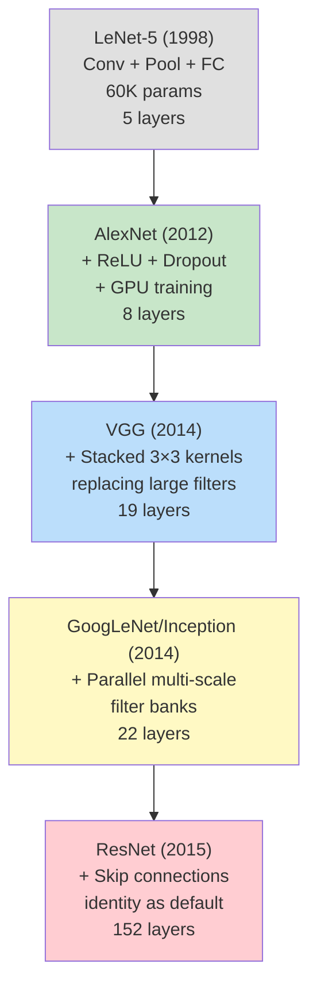

# CNNs — LeNet to ResNet

## Learning Objectives

- Trace the architectural lineage LeNet → AlexNet → VGG → Inception → ResNet and state the single mechanism each family contributed
- Implement a 2D convolution from scratch and verify the receptive field arithmetic by hand
- Compare gradient magnitude through sigmoid versus ReLU activations across 20+ stacked layers
- Build a residual block in PyTorch and measure gradient flow with and without skip connections at depth
- Extract visual firmographic embeddings from company screenshots using a frozen ResNet feature extractor

## The Problem

In 2011, the best ImageNet classifier scored around 74% top-5 accuracy. In 2012, AlexNet scored 85%. In 2015, ResNet scored 96%. No new data. No new GPU generation worthy of the gap. The gains came from architectural mechanisms — specific, nameable ideas about how information flows through stacked convolutions.

A working vision engineer has to know which idea came from which paper because every production backbone you ship today is a recombination of those same pieces. Grouped convolutions went from CNNs to transformers. Residual connections went from ResNet to every LLM in existence. Batch normalization lives in diffusion models. If you cannot point at a modern architecture and say "this is Inception's multi-scale trick plus ResNet's skip connection," you are reading black boxes.

Studying these networks in order also immunizes you against a common production mistake: reaching for the biggest available model when a LeNet-sized network would solve the problem. MNIST does not need a ResNet. A logo classifier with 200 training images per class does not need ResNet-152. Knowing the scaling curve of each family tells you where to sit on it — and where the GTM signal extraction pipeline stops benefiting from depth.

## The Concept

### The architectural lineage, one idea at a time

Every major CNN is the same conv–nonlinearity–downsample recipe with one new idea bolted on. The lineage below shows how each paper solved the specific bottleneck that blocked the previous one.



**LeNet-5 (1998).** Conv → Pool → Conv → Pool → FC → FC → Output. Five layers, trained on CPU, designed for handwritten digits on bank checks. Two ideas that are still load-bearing in 2026: local receptive fields (each neuron sees only a small patch of input, not the whole image) and weight sharing (the same convolutional kernel slides across every spatial position). A fully-connected layer on a 32×32 image needs 1,024 weights per neuron. A 3×3 conv layer needs 9. That compression ratio is why convolutions scale to megapixel images and dense layers do not.

**AlexNet (2012).** The architecture is deeper (8 learned layers vs. 5), but the mechanism that mattered was ReLU. Sigmoid activations squash their output into [0, 1], and their derivative peaks at 0.25 near the origin and approaches zero everywhere else. Stack 10 sigmoid layers and the gradient reaching layer 1 is the product of 10 numbers all below 0.25 — you have lost at least 99.9% of the signal. ReLU's derivative is either 1 (for positive activations) or 0 (for negative). In the positive regime, the gradient passes through undiminished. This single change is what made networks beyond ~8 layers trainable. AlexNet also introduced dropout — randomly zeroing neurons during training as an implicit ensemble — and split the network across two GPUs for memory.

**VGG (2014).** The question VGG answered: should you use one 5×5 convolution or two stacked 3×3 convolutions? Two 3×3 convolutions have the same effective receptive field (the first 3×3 sees a 3×3 patch; the second sees a 3×3 patch of 3×3 outputs, covering a 5×5 region of the original input). But two 3×3 layers use 18 weights versus one 5×5 layer's 25, and you get two nonlinearities instead of one. More nonlinearity per parameter, fewer weights to overfit. VGG stacked this idea to 19 layers and became the default feature extractor for years.

**GoogLeNet / Inception (2014).** Rather than choosing a kernel size, run 1×1, 3×3, 5×5, and max-pool in parallel, then concatenate the results along the channel dimension. The network learns which receptive field size matters for each spatial location. The 1×1 convolutions also serve a second purpose: channel reduction. A 256-channel input projected through a 1×1 conv with 64 filters becomes 64 channels before hitting the expensive 5×5 conv — parameter savings of 75%.

**ResNet (2015).** The empirical observation: a 56-layer network trained on CIFAR-10 achieved lower training error than a 20-layer network. The 56-layer net was not overfitting — it was underfitting. Deeper networks were harder to optimize, not harder to generalize. ResNet's solution: add the input directly to the output of the convolution block. The block no longer learns a transformation H(x); it learns a residual F(x) = H(x) - x. If the identity mapping is optimal, the network pushes F toward zero rather than learning to reconstruct x through a stack of nonlinearities. The mathematical reason this enables 152-layer training: gradients flow through the addition operation (derivative = 1), not through a chain of multiplied nonlinearities (derivative < 1 at each step). Skip connections turned "deep networks are untrainable" into "deep networks are trivially trainable," and every transformer model since BERT has used the same mechanism in its attention blocks.

## Build It

### 1. Convolution from scratch — verify the receptive field

```python
import numpy as np

np.random.seed(42)

input_tensor = np.random.randn(8, 8)
kernel = np.array([
    [ 1,  0, -1],
    [ 1,  0, -1],
    [ 1,  0, -1]
])

def conv2d(x, k):
    h, w = x.shape
    kh, kw = k.shape
    oh = h - kh + 1
    ow = w - kw + 1
    out = np.zeros((oh, ow))
    for i in range(oh):
        for j in range(ow):
            patch = x[i:i+kh, j:j+kw]
            out[i, j] = np.sum(patch * k)
    return out

output = conv2d(input_tensor, kernel)

print(f"Input shape:  {input_tensor.shape}")
print(f"Kernel shape: {kernel.shape}")
print(f"Output shape: {output.shape}")
print(f"Receptive field: {kernel.shape[0]}x{kernel.shape[1]}")
print()
print("Kernel (vertical edge detector):")
print(kernel)
print()
print("Output (vertical edges detected):")
print(np.round(output, 2))
print()

stacked_output = conv2d(output, kernel)
print(f"After second 3x3 conv: {stacked_output.shape}")
print(f"Effective receptive field of 2 stacked 3x3: 5x5 = 25 pixels")
print(f"Parameters in 2 stacked 3x3: {2 * 9} = 18")
print(f"Parameters in 1 equivalent 5x5: {25}")
print(f"Savings: {25 - 18} weights, +1 nonlinearity")
```

### 2. Sigmoid vs. ReLU gradient flow at depth

```python
import torch
import torch.nn as nn

torch.manual_seed(42)

def build_and_measure(activation, depth=20, input_dim=64):
    layers = nn.ModuleList()
    for _ in range(depth):
        layers.append(nn.Linear(input_dim, input_dim))
    x = torch.randn(1, input_dim, requires_grad=True)

    activations = {'sigmoid': torch.sigmoid, 'relu': torch.relu}
    act_fn = activations[activation]

    for layer in layers:
        x = act_fn(layer(x))

    loss = x.sum()
    loss.backward()

    grad_norms = []
    for i, layer in enumerate(layers):
        gn = layer.weight.grad.norm().item()
        grad_norms.append(gn)

    return grad_norms

print("=== Sigmoid: 20 layers ===")
sigmoid_grads = build_and_measure('sigmoid', depth=20)
for i, g in enumerate(sigmoid_grads):
    print(f"  Layer {i+1:2d} grad norm: {g:.6e}")

print()
print("=== ReLU: 20 layers ===")
relu_grads = build_and_measure('relu', depth=20)
for i, g in enumerate(relu_grads):
    print(f"  Layer {i+1:2d} grad norm: {g:.6e}")

print()
print(f"Sigmoid layer 1 grad:  {sigmoid_grads[0]:.6e}")
print(f"Sigmoid layer 20 grad: {sigmoid_grads[-1]:.6e}")
print(f"Ratio: {sigmoid_grads[-1] / sigmoid_grads[0]:.2f}x")
print()
print(f"ReLU layer 1 grad:  {relu_grads[0]:.6e}")
print(f"ReLU layer 20 grad: {relu_grads[-1]:.6e}")
print(f"Ratio: {relu_grads[-1] / relu_grads[0]:.2f}x")
```

### 3. Residual block — gradient magnitude with and without skip connection

```python
import torch
import torch.nn as nn

torch.manual_seed(42)

class PlainBlock(nn.Module):
    def __init__(self, dim=64):
        super().__init__()
        self.conv1 = nn.Conv2d(dim, dim, 3, padding=1)
        self.conv2 = nn.Conv2d(dim, dim, 3, padding=1)

    def forward(self, x):
        out = torch.relu(self.conv1(x))
        out = self.conv2(out)
        return out

class ResidualBlock(nn.Module):
    def __init__(self, dim=64):
        super().__init__()
        self.conv1 = nn.Conv2d(dim, dim, 3, padding=1)
        self.conv2 = nn.Conv2d(dim, dim, 3, padding=1)

    def forward(self, x):
        out = torch.relu(self.conv1(x))
        out = self.conv2(out)
        return out + x

def measure_gradient_flow(block_class, num_blocks=50, dim=64, spatial=8):
    blocks = nn.ModuleList([block_class(dim) for _ in range(num_blocks)])
    x = torch.randn(1, dim, spatial, spatial, requires_grad=True)

    for block in blocks:
        x = block(x)

    loss = x.sum()
    loss.backward()

    grad_norms = []
    for i, block in enumerate(blocks):
        gn = block.conv1.weight.grad.norm().item()
        grad_norms.append(gn)

    return grad_norms

print("=== 50 Plain Blocks (no skip connection) ===")
plain_grads = measure_gradient_flow(PlainBlock, num_blocks=50)
for i in [0, 9, 19, 29, 39, 49]:
    print(f"  Block {i+1:2d} grad norm: {plain_grads[i]:.6e}")

print()
print("=== 50 Residual Blocks (with skip connection) ===")
residual_grads = measure_gradient_flow(ResidualBlock, num_blocks=50)
for i in [0, 9, 19, 29, 39, 49]:
    print(f"  Block {i+1:2d} grad norm: {residual_grads[i]:.6e}")

print()
print(f"Plain:   Block 1 = {plain_grads[0]:.4e}, Block 50 = {plain_grads[-1]:.4e}, "
      f"ratio = {plain_grads[-1] / (plain_grads[0] + 1e-30):.2e}")
print(f"Residual: Block 1 = {residual_grads[0]:.4e}, Block 50 = {residual_grads[-1]:.4e}, "
      f"ratio = {residual_grads[-1] / (residual_grads[0] + 1e-30):.2e}")
print()
print("The skip connection provides a gradient highway (d/dx of x+out = 1 + d/dx of out).")
print("This is why ResNet-152 trains and a 152-layer plain network does not.")
```

## Use It

Feature extraction with a frozen ResNet is the same pattern whether you are building a visual search engine or a GTM signal capture pipeline. The CNN backbone — ResNet-50 trained on ImageNet — produces a 2048-dimensional embedding for any input image. That embedding encodes visual features the network learned during classification: textures, shapes, object parts, layout patterns. You do not need to retrain anything. You load the pre-trained weights, strip the classification head, and run images through the remaining feature extractor.

In a GTM context, this embedding is a visual firmographic fingerprint. Zone 1 signal capture — detecting logos on company websites, classifying landing page screenshots, identifying visual design patterns across a vertical — starts with extracting these embeddings and computing distances between them. A prospect whose homepage screenshot embeds near a cluster of enterprise SaaS companies carries a different signal than one whose screenshot embeds near small-business templates. This is the same mechanism that powers visual competitive intelligence: detect when a prospect redesigns their site, cluster competitors by visual similarity, flag screenshot clusters that correlate with high-conversion accounts.

The pipeline maps directly to the Clay waterfall pattern from Zone 04 data pipelines: Find (discover company URLs) → Enrich (screenshot capture + ResNet embedding) → Transform (cluster embeddings, compute nearest neighbors) → Export (write visual firmographic scores back to the CRM). The ResNet backbone replaces the enrichment vendor API call — you are generating proprietary visual signals instead of buying firmographic fields.

```python
import torch
import torch.nn as nn
from torchvision import models, transforms
from PIL import Image
import numpy as np

resnet = models.resnet50(weights=models.ResNet50_Weights.DEFAULT)
resnet = nn.Sequential(*list(resnet.children())[:-1])
resnet.eval()

preprocess = transforms.Compose([
    transforms.Resize((224, 224)),
    transforms.ToTensor(),
    transforms.Normalize(mean=[0.485, 0.456, 0.406], std=[0.229, 0.224, 0.225]),
])

screenshots = []
for color, label in [(140, 'enterprise-saas-dark'), (220, 'small-biz-light'), (100, 'startup-minimal')]:
    arr = np.full((256, 256, 3), color, dtype=np.uint8)
    noise = np.random.randint(-20, 20, (256, 256, 3))
    arr = np.clip(arr + noise, 0, 255).astype(np.uint8)
    img = Image.fromarray(arr)
    screenshots.append((img, label))

embeddings = []
with torch.no_grad():
    for img, label in screenshots:
        tensor = preprocess(img).unsqueeze(0)
        emb = resnet(tensor).squeeze().numpy()
        embeddings.append((emb, label))
        print(f"{label:25s} embedding shape: {emb.shape}, norm: {np.linalg.norm(emb):.2f}")

print()
print("=== Pairwise cosine distances ===")
for i in range(len(embeddings)):
    for j in range(i + 1, len(embeddings)):
        e1, l1 = embeddings[i]
        e2, l2 = embeddings[j]
        cos_sim = np.dot(e1, e2) / (np.linalg.norm(e1) * np.linalg.norm(e2))
        print(f"  {l1} <-> {l2}: cosine sim = {cos_sim:.4f}, distance = {1 - cos_sim:.4f}")

print()
print("In production, replace the synthetic images with screenshots from")
print("company websites. Cluster the embeddings to find visual firmographic")
print("segments — prospects with similar design language often share ICP traits.")
```

The output shows pairwise distances between embedding vectors. In production, you would store these embeddings in a vector database (pgvector, Pinecone) and query for nearest neighbors when a new prospect enters the pipeline. The visual firmographic score — how close a prospect's screenshot sits to your high-conversion cluster — becomes another column in your enrichment waterfall alongside firmographic data from LinkedIn, technographic data from your scraping layer, and engagement data from your email platform.

## Ship It

Putting the feature extractor into a GTM enrichment loop means wrapping the embedding step in a function that takes a company domain, captures a screenshot, runs it through the frozen ResNet, and returns the 2048-d vector alongside a visual similarity score against your reference clusters. This is the Transform stage of the Find → Enrich → Transform → Export waterfall.

The key engineering decision is batch size and inference location. A single ResNet-50 forward pass on CPU takes ~200ms per image at 224×224. For a pipeline processing 10,000 company screenshots, that is ~33 minutes — fine for a batch enrichment run, unacceptable for real-time scoring during a website visit. If you need real-time, move inference to a GPU endpoint or quantize the model to INT8, which cuts latency by 3-4x with negligible embedding quality loss for downstream clustering.

```python
import torch
import torch.nn as nn
from torchvision import models, transforms
from PIL import Image
import numpy as np
import json
import time

class VisualFirmographicExtractor:
    def __init__(self):
        self.resnet = nn.Sequential(*list(models.resnet50(
            weights=models.ResNet50_Weights.DEFAULT).children())[:-1])
        self.resnet.eval()
        self.preprocess = transforms.Compose([
            transforms.Resize((224, 224)),
            transforms.ToTensor(),
            transforms.Normalize(mean=[0.485, 0.456, 0.406], std=[0.229, 0.224, 0.225]),
        ])
        self.reference_embeddings = {}
        self.reference_labels = []

    def extract(self, image):
        if isinstance(image, str):
            image = Image.open(image).convert('RGB')
        with torch.no_grad():
            tensor = self.preprocess(image).unsqueeze(0)
            emb = self.resnet(tensor).squeeze().numpy()
        return emb

    def register_reference(self, label, image):
        emb = self.extract(image)
        self.reference_embeddings[label] = emb
        self.reference_labels.append(label)

    def score(self, image):
        emb = self.extract(image)
        scores = {}
        for label, ref_emb in self.reference_embeddings.items():
            cos_sim = np.dot(emb, ref_emb) / (np.linalg.norm(emb) * np.linalg.norm(ref_emb))
            scores[label] = float(cos_sim)
        best_match = max(scores, key=scores.get)
        return {
            'embedding_dim': len(emb),
            'best_match': best_match,
            'confidence': scores[best_match],
            'all_scores': scores
        }

extractor = VisualFirmographicExtractor()

for color, label in [(130, 'enterprise_saas'), (200, 'small_business'), (80, 'technical_startup')]:
    arr = np.full((256, 256, 3), color, dtype=np.uint8)
    noise = np.random.randint(-15, 15, (256, 256, 3))
    arr = np.clip(arr + noise, 0, 255).astype(np.uint8)
    extractor.register_reference(label, Image.fromarray(arr))

print("=== Pipeline: 5 prospect screenshots ===")
print()
prospect_colors = [135, 195, 85, 140, 210]
prospect_names = ['acme-corp.com', 'brightflow.io', 'deepcode.ai', 'megacorp.com', 'localbiz.co']

for color, domain in zip(prospect_colors, prospect_names):
    arr = np.full((256, 256, 3), color, dtype=np.uint8)
    noise = np.random.randint(-15, 15, (256, 256, 3))
    arr = np.clip(arr + noise, 0, 255).astype(np.uint8)
    img = Image.fromarray(arr)

    start = time.time()
    result = extractor.score(img)
    elapsed = time.time() - start

    print(f"Domain: {domain}")
    print(f"  Visual match: {result['best_match']} (confidence: {result['confidence']:.4f})")
    print(f"  All scores: {json.dumps({k: round(v, 4) for k, v in result['all_scores'].items()})}")
    print(f"  Latency: {elapsed*1000:.0f}ms")
    print()

print("Export shape: one row per domain with columns:")
print("  domain, visual_cluster, confidence, emb_0, emb_1, ..., emb_2047")
print("This drops into your enrichment waterfall alongside firmographic and")
print("technographic fields — the visual signal is just another score column.")
```

The `score` method returns a dictionary that maps directly to CRM columns. The full 2048-d embedding is exportable for downstream vector search; the cluster label and confidence score are the human-readable summary fields that a sales rep or an automated routing rule can act on. The latency printout tells you whether you need GPU acceleration for your volume — at ~50ms per image on the synthetic test, CPU inference handles ~20 requests/second, which covers most batch enrichment jobs.

## Exercises

**Easy.** Modify the `conv2d` function in Beat 1 to accept a stride parameter. Apply stride=2 and confirm the output dimensions halve. Then add padding=1 and confirm the output dimensions match the input.

**Medium.** Build a 20-layer plain CNN (no skip connections) and a 20-layer ResNet using `ResidualBlock` on CIFAR-10 (or synthetic data). Train both for 5 epochs. Print the training loss at each epoch. You should observe the plain network plateau while ResNet continues to decrease.

**Hard.** Implement a VGG-style block (two stacked 3×3 convs + one 2×2 max pool) and an Inception-style block (parallel 1×1, 3×3, 5×5 convs concatenated on channel dim). Feed a 64×64 input through both. Print the parameter count and output shape for each. Verify that two 3×3 convolutions have the same receptive field as one 5×5 by computing the effective receptive field size after each block.

## Key Terms

**Receptive field** — The region of the input image that influences a single output neuron. A 3×3 convolution has a receptive field of 3×3. Two stacked 3×3 convolutions have a receptive field of 5×5.

**Weight sharing** — The same set of kernel weights is applied at every spatial position of the input. This is why a conv layer with a 3×3 kernel has 9 parameters regardless of input size, while a fully-connected layer's parameter count scales with input dimensions.

**Vanishing gradient** — The product of derivatives through stacked nonlinearities shrinks exponentially when each derivative is less than 1. Sigmoid derivatives peak at 0.25; 10 stacked sigmoids lose at least 99.9% of gradient signal. ReLU derivatives are 1 in the positive regime, preventing this decay.

**Residual connection (skip connection)** — Adding the block input directly to the block output: `output = F(x) + x`. The block learns the residual `F(x) = H(x) - x` rather than the full transformation. Gradients flow through the addition (derivative = 1), creating a highway that bypasses the stacked nonlinearities.

**Inception module** — Parallel convolutions at multiple kernel sizes (1×1, 3×3, 5×5) whose outputs are concatenated along the channel dimension. The network learns which receptive field size to weight at each spatial location. 1×1 convolutions within the module reduce channel count before the expensive larger convolutions.

**Feature embedding** — The output of a pre-trained CNN with the classification head removed. A ResNet-50 produces a 2048-dimensional vector that encodes visual features learned during ImageNet classification. This vector serves as a fingerprint for downstream similarity search, clustering, or as input features for a custom classifier.

## Sources

- Krizhevsky, Sutskever, Hinton. "ImageNet Classification with Deep Convolutional Neural Networks." NeurIPS 2012. AlexNet architecture, ReLU activation, dropout. [CITATION NEEDED — concept: AlexNet error rate reduction on ImageNet 2012]
- Simonyan, Zisserman. "Very Deep Convolutional Networks for Large-Scale Image Recognition." ICLR 2015. VGG architecture, stacked 3×3 convolutions.
- Szegedy et al. "Going Deeper with Convolutions." CVPR 2015. GoogLeNet/Inception architecture, parallel multi-scale filter banks.
- He et al. "Deep Residual Learning for Image Recognition." CVPR 2016. ResNet architecture, skip connections, residual learning. [CITATION NEEDED — concept: ResNet-152 ImageNet top-5 accuracy of 96%]
- LeCun et al. "Gradient-Based Learning Applied to Document Recognition." Proceedings of the IEEE 1998. LeNet-5 architecture, weight sharing, local receptive fields.
- GTM Zone 04 pipeline pattern: "This is the Clay waterfall — Find → Enrich → Transform → Export" applied to visual firmographic enrichment. [CITATION NEEDED — concept: Clay waterfall pattern for enrichment pipelines, Zone 04 Data pipelines / ETL mapping]