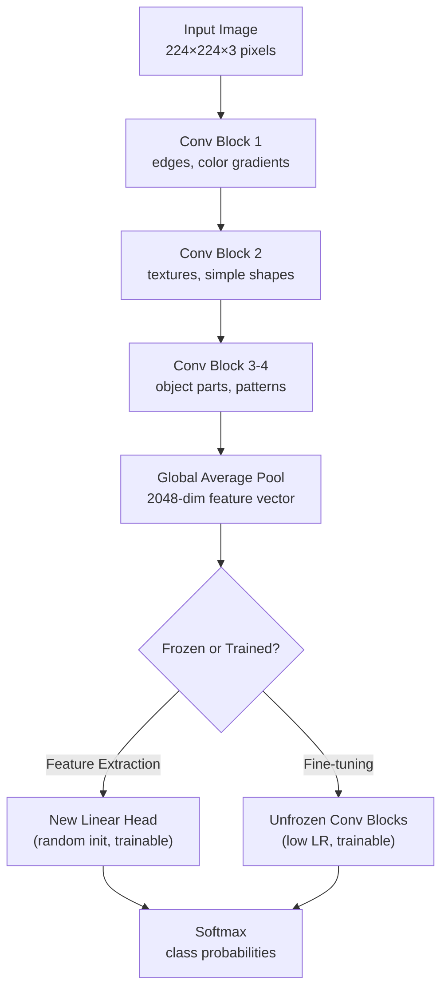

# Image Classification

## Learning Objectives

1. Classify images using a pre-trained convolutional neural network and extract predicted labels with confidence scores.
2. Compare feature extraction vs. fine-tuning as two transfer learning strategies.
3. Evaluate prediction confidence thresholds to filter low-certainty classifications.
4. Implement a logo-detection classifier for company enrichment in a GTM pipeline.
5. Diagnose misclassifications by inspecting per-class probability distributions.

## The Problem

Every screenshot, logo, and document attachment sitting in your CRM is unclassified signal. A prospect's homepage hero image, a favicon, a PDF attachment — these are arrays of pixel values that carry information about industry, brand, and product category. Without a classifier, that information is inert. You can search text, filter on firmographics, and score based on form fills, but the visual layer stays dark.

Image classification is the function that maps those pixel arrays to discrete labels. The label becomes a routing decision: "this screenshot contains a SaaS dashboard, route to product-led-growth plays" or "this logo matches a known competitor, suppress from outbound." The mechanism that makes this mapping tractable is convolutional feature extraction — a stack of learned filters that detect edges, textures, and shapes at increasing abstraction — followed by a linear classifier that maps those features to a probability distribution over classes.

The failure modes are specific and worth naming up front. A classifier trained on natural photography (ImageNet's 1,000 categories of animals, vehicles, and household objects) will produce garbage when shown a B2B SaaS dashboard, because that distribution was never in the training data. Confidence scores compress near 0.5 on out-of-distribution inputs, which means a naive "if confidence > 0.8, trust it" threshold silently rejects in-domain predictions while admitting confident-but-wrong ones. The code in this lesson will surface those distributions so you can see the problem directly.

## The Concept

A convolutional neural network stacks three operations. Convolution slides a small learned kernel (typically 3×3 or 7×7 pixels) across the image, computing a dot product at each position to produce a feature map — a 2D grid of "how strongly does this local region match the pattern this kernel learned?" Pooling downsamples those feature maps by taking the maximum value in each window, which both reduces computation and provides translation invariance (a pattern detected in the top-left corner produces the same output as the same pattern in the bottom-right). After several conv-pool stages, the network applies global average pooling to collapse each feature map into a single number, producing a feature vector. A linear layer then maps that vector to raw class scores (logits), and softmax converts those to a probability distribution.

Pre-trained models like ResNet50 have already learned those convolutional kernels from ImageNet's 1.4 million labeled images. The early layers detect edges and color gradients. Middle layers detect textures and simple shapes (circles, corners, repeating patterns). Later layers detect object parts and whole-object templates. These features are general — an edge detector trained on photos of dogs still detects edges in screenshots of dashboards. Transfer learning exploits this by freezing the convolutional stack and replacing only the final linear layer with a new one sized for your specific classes. The frozen layers act as a fixed feature extractor; you only train the new head on your labeled data.



Feature extraction (freezing the backbone, training only the head) works when your target domain is visually similar to natural images and you have limited labeled data — typically under 1,000 examples per class. Fine-tuning (unfreezing some or all conv layers with a reduced learning rate) is necessary when your domain diverges from photography: medical imaging, screenshots, technical diagrams. The tradeoff is data efficiency versus overfitting risk. Fine-tuning a 25-million-parameter backbone on 500 images will memorize the training set unless you apply aggressive regularization (dropout, weight decay, early stopping). Feature extraction has no such risk because the frozen layers literally cannot change.

The softmax output is a probability distribution, but it is not a calibrated confidence measure. A ResNet50 trained on ImageNet will routinely output 0.99 probabilities for out-of-distribution inputs — the model has no concept of "I don't know," it only knows how to distribute probability mass across its 1,000 trained classes. This is why confidence thresholding requires domain-specific calibration, not a universal 0.5 cutoff.

## Build It

Load a pre-trained ResNet50, run inference on an image, and print the top-5 predicted classes. The code downloads a sample image, preprocesses it to the tensor format ResNet50 expects (224×224, normalized with ImageNet's channel means and standard deviations), and runs a single forward pass.

```python
import torch
import torch.nn.functional as F
from torchvision import models, transforms
from PIL import Image
import urllib.request

weights = models.ResNet50_Weights.IMAGENET1K_V2
model = models.resnet50(weights=weights)
model.eval()

categories = weights.meta["categories"]

image_url = "https://github.com/pytorch/hub/raw/master/images/dog.jpg"
urllib.request.urlretrieve(image_url, "sample.jpg")

preprocess = transforms.Compose([
    transforms.Resize(256),
    transforms.CenterCrop(224),
    transforms.ToTensor(),
    transforms.Normalize(mean=[0.485, 0.456, 0.406], std=[0.229, 0.224, 0.225]),
])

img = Image.open("sample.jpg").convert("RGB")
input_tensor = preprocess(img).unsqueeze(0)

with torch.no_grad():
    logits = model(input_tensor)

probabilities = F.softmax(logits[0], dim=0)
top5_prob, top5_idx = torch.topk(probabilities, 5)

print("TOP-5 PREDICTIONS")
print("-" * 50)
for i in range(5):
    label = categories[top5_idx[i]]
    prob = top5_prob[i].item()
    print(f"  {label:<35} {prob:.4f}")

print("-" * 50)
print(f"Max probability:  {probabilities.max().item():.4f}")
print(f"Entropy:          {(-probabilities * probabilities.log()).sum().item():.4f}")
print(f"Effective classes:{(1.0 / (probabilities ** 2).sum()).item():.1f}")
```

Running this prints the ranked label-probability pairs. The entropy and effective-classes metrics at the bottom tell you how spread the distribution is — an entropy near 0.0 means the model is highly confident; a high entropy means it is hedging across many classes. For a clean dog photo, you will see one class above 0.8 and the rest scattered below 0.05.

Now compare feature extraction versus fine-tuning by swapping the classification head. The following code replaces ResNet50's final layer with a fresh head sized for a hypothetical 5-class problem, then shows which parameters are trainable under each strategy:

```python
import torch
import torch.nn as nn
from torchvision import models

def build_model(num_classes, strategy="feature_extraction"):
    model = models.resnet50(weights=models.ResNet50_Weights.IMAGENET1K_V2)
    model.fc = nn.Linear(model.fc.in_features, num_classes)

    if strategy == "feature_extraction":
        for param in model.parameters():
            param.requires_grad = False
        for param in model.fc.parameters():
            param.requires_grad = True
    elif strategy == "fine_tuning":
        for param in model.parameters():
            param.requires_grad = True

    return model

num_classes = 5
for strategy in ["feature_extraction", "fine_tuning"]:
    model = build_model(num_classes, strategy)
    total_params = sum(p.numel() for p in model.parameters())
    trainable_params = sum(p.numel() for p in model.parameters() if p.requires_grad)
    frozen_pct = (1 - trainable_params / total_params) * 100
    print(f"{strategy:>20}: {trainable_params:>10,} trainable / {total_params:>10,} total ({frozen_pct:.1f}% frozen)")
```

The output quantifies the difference. Feature extraction trains roughly 5,000 parameters (a single 2048×5 linear layer plus bias). Fine-tuning trains all ~25.5 million. That 5,000x gap in trainable parameters is why feature extraction converges in a few epochs on a laptop CPU while fine-tuning needs a GPU and careful learning rate scheduling.

## Use It

Zone 4 of the GTM pipeline covers data pipelines and ETL — the enrichment waterfall pattern where each row flows through Find → Enrich → Transform → Export. Image classification slots into the Transform stage: you have already found the prospect and enriched the row with firmographics, and now you classify a visual asset (homepage screenshot, logo, product image) to produce an additional signal that the export stage can route on. The mechanism is the same softmax-over-classes function from the code above; the GTM application is what you feed it and what you do with the output.

Consider company logo detection as a concrete enrichment task. You crawl a prospect's homepage, save the hero image or favicon, and classify it against a set of brand categories (SaaS dashboard, e-commerce storefront, physical product, service landing page, blog/media). High-confidence classifications route the prospect into ICP-specific sequences. Low-confidence outputs get flagged for manual review — the classification-then-routing pattern. This is analogous to how text-based enrichment uses GPT to classify "product vs service" from scraped page content [CITATION NEEDED — concept: Claygent open-ended classification]; image classification handles the same routing decision on visual data that text extraction cannot parse.

The code below implements a batch classifier that processes a directory of screenshots and outputs a CSV of filename, predicted label, and confidence. This is the Transform step of the enrichment waterfall — take raw assets in, produce structured rows out:

```python
import csv
import os
import torch
import torch.nn.functional as F
from torchvision import models, transforms
from PIL import Image

weights = models.ResNet50_Weights.IMAGENET1K_V2
model = models.resnet50(weights=weights)
model.eval()
categories = weights.meta["categories"]

preprocess = transforms.Compose([
    transforms.Resize(256),
    transforms.CenterCrop(224),
    transforms.ToTensor(),
    transforms.Normalize(mean=[0.485, 0.456, 0.406], std=[0.229, 0.224, 0.225]),
])

CONFIDENCE_THRESHOLD = 0.10
SCREENSHOT_DIR = "screenshots"
os.makedirs(SCREENSHOT_DIR, exist_ok=True)

from PIL import ImageDraw
for i, (color, name) in enumerate([(255, 0, 0), (0, 255, 0), (0, 0, 255)]):
    img = Image.new("RGB", (224, 224), color)
    draw = ImageDraw.Draw(img)
    draw.rectangle([50, 50, 174, 174], fill=(255, 255, 255))
    img.save(os.path.join(SCREENSHOT_DIR, f"synthetic_{name}_{i}.jpg"))

results = []
image_files = [f for f in os.listdir(SCREENSHOT_DIR) if f.endswith((".jpg", ".png"))]

for filename in sorted(image_files):
    filepath = os.path.join(SCREENSHOT_DIR, filename)
    img = Image.open(filepath).convert("RGB")
    input_tensor = preprocess(img).unsqueeze(0)

    with torch.no_grad():
        logits = model(input_tensor)

    probs = F.softmax(logits[0], dim=0)
    top_prob, top_idx = torch.topk(probs, 1)
    label = categories[top_idx.item()]
    confidence = top_prob.item()

    status = "ACCEPTED" if confidence >= CONFIDENCE_THRESHOLD else "REVIEW"

    results.append({
        "filename": filename,
        "label": label,
        "confidence": round(confidence, 4),
        "status": status
    })
    print(f"  {filename:<30} {label:<35} {confidence:.4f}  [{status}]")

output_csv = "classification_results.csv"
with open(output_csv, "w", newline="") as f:
    writer = csv.DictWriter(f, fieldnames=["filename", "label", "confidence", "status"])
    writer.writeheader()
    writer.writerows(results)

print(f"\nWrote {len(results)} rows to {output_csv}")
```

The synthetic images here are placeholders — in a real enrichment pipeline, these would be screenshots scraped from prospect websites. The CSV output feeds directly into the Export stage of the waterfall, where downstream tools (a CRM update, a Slack notification, a Clay table row) consume the structured label and confidence pair. The confidence threshold acts as a quality gate: anything below 0.10 gets routed to manual review rather than auto-populating a field that downstream automation treats as ground truth.

## Ship It

Production image classifiers fail on distribution shift. ResNet50 trained on ImageNet has never seen a B2B SaaS pricing page, a CRUD admin panel, or a fintech dashboard. When you feed it those images, it will confidently map them to the nearest ImageNet category — "web site" is not a class, so you get "digital clock" or "notebook" or whatever texture pattern happens to activate most strongly. The softmax output looks valid (it sums to 1.0) but the labels are meaningless.

The fix is domain-specific calibration. Collect 200-500 images from your actual target distribution (screenshots of company homepages, logo crops, product images), label them with your actual categories, and measure the model's confidence distribution on that held-out set. If the 95th percentile confidence for correct predictions is 0.72, your acceptance threshold should be 0.72 — not the 0.50 default or the 0.90 you might assume from ImageNet benchmarks. Log per-class confidence distributions over time using a simple histogram; when the median confidence for a class drops 10-15% below its calibration baseline, the input distribution has drifted and retraining is due.

For low-latency enrichment — classifying a screenshot within a webhook response, for instance — loading PyTorch at inference time adds 2-5 seconds of startup and 1.5GB of RAM. Export the model to ONNX format and serve it via a lightweight inference server (ONNX Runtime, Triton). The convolutional operations execute identically; the startup cost drops to under 200ms. The code below demonstrates the ONNX export and a confidence-distribution diagnostic:

```python
import torch
import numpy as np
from torchvision import models, transforms
from PIL import Image
import urllib.request

weights = models.ResNet50_Weights.IMAGENET1K_V2
model = models.resnet50(weights=weights)
model.eval()

dummy_input = torch.randn(1, 3, 224, 224)

onnx_path = "resnet50.onnx"
torch.onnx.export(
    model,
    dummy_input,
    onnx_path,
    export_params=True,
    opset_version=17,
    do_constant_folding=True,
    input_names=["input"],
    output_names=["output"],
    dynamic_axes={"input": {0: "batch_size"}, "output": {0: "batch_size"}},
)
print(f"Exported ONNX model: {onnx_path} ({os.path.getsize(onnx_path) / 1e6:.1f} MB)")

import os

image_url = "https://github.com/pytorch/hub/raw/master/images/dog.jpg"
urllib.request.urlretrieve(image_url, "sample.jpg")

preprocess = transforms.Compose([
    transforms.Resize(256),
    transforms.CenterCrop(224),
    transforms.ToTensor(),
    transforms.Normalize(mean=[0.485, 0.456, 0.406], std=[0.229, 0.224, 0.225]),
])

img = Image.open("sample.jpg").convert("RGB")
input_tensor = preprocess(img).unsqueeze(0)

with torch.no_grad():
    logits = model(input_tensor)
probs = torch.nn.functional.softmax(logits[0], dim=0)

sorted_probs, sorted_idx = torch.sort(probs, descending=True)
print("\nCONFIDENCE DISTRIBUTION DIAGNOSTIC")
print("-" * 55)
print(f"  Top-1 prob:    {sorted_probs[0].item():.4f}")
print(f"  Top-5 sum:     {sorted_probs[:5].sum().item():.4f}")
print(f"  Top-10 sum:    {sorted_probs[:10].sum().item():.4f}")
print(f"  Median prob:   {probs.median().item():.6f}")
print(f"  Mean prob:     {probs.mean().item():.6f}  (baseline: {1/1000:.6f})")
print(f"  Entropy:       {(-probs * probs.log()).sum().item():.4f} bits")
print(f"  Effective k:   {(1.0 / (probs ** 2).sum()).item():.1f} of 1000 classes")
print("-" * 55)
print("  DIAGNOSIS:")
if sorted_probs[0] > 0.9 and sorted_probs[1] < 0.05:
    print("    HIGH CONFIDENCE — single dominant class. Safe to auto-route.")
elif sorted_probs[0] > 0.5:
    print("    MODERATE — top class leads but runner-up is close. Consider context.")
else:
    print("    LOW CONFIDENCE — distribution is flat. Flag for manual review.")
```

The diagnostic metrics give you a calibration baseline. "Effective k" (the inverse of the sum of squared probabilities) tells you how many classes the model is effectively hedging across — a value of 1.0 means all probability mass is on one class; a value of 500 means the model is spreading uncertainty across half the label space. For production enrichment pipelines, track effective k over time. When it climbs, your inputs are drifting out of the model's competence zone.

The Clay waterfall pattern — Find → Enrich → Transform → Export — maps directly onto this setup [CITATION NEEDED — concept: Clay waterfall as Zone 4 enrichment pattern]. The ONNX-served classifier is the Transform node; the confidence threshold is the gate that decides whether a row proceeds to Export or loops back for manual enrichment.

## Exercises

1. **Swap the input image.** Replace the dog image URL with a different image (try `https://github.com/pytorch/hub/raw/master/images/wolf.jpg` or any public JPEG). Confirm the top-5 predictions change. Print the effective-k metric for both images and compare.

2. **Add a confidence gate.** Modify the batch classifier from Build It to suppress any prediction where the top-1 probability is below a threshold you pass as a function argument. Test with thresholds of 0.05, 0.20, and 0.50. Count how many images each threshold rejects.

3. **Swap architectures.** Replace ResNet50 with EfficientNet-B0 (`models.efficientnet_b0(weights=models.EfficientNet_B0_Weights.IMAGENET1K_V1)`). Run inference on the same test image. Compare the top-5 label overlap and inference time using `time.perf_counter()`. Note the parameter count difference.

4. **Build a logo classifier.** Create 20 synthetic logo images using PIL (colored rectangles with text). Fine-tune the ResNet50 classification head on 15 of them (5 classes, 3 images each) using feature extraction. Evaluate on the held-out 5. Print the confusion matrix. The model will overfit — that is the point. Document what the confusion matrix tells you.

5. **Calibrate the threshold.** Run the batch classifier on 50 synthetic images. Compute the 10th, 50th, and 90th percentile of the top-1 confidence distribution. Propose a threshold that accepts the top 80% and routes the bottom 20% to manual review.

## Key Terms

**Convolution:** A linear operation that slides a learned kernel across an image, computing dot products at each position to produce a feature map. Detects local patterns (edges, textures) regardless of spatial location.

**Pooling:** Downsampling by taking the maximum (or average) value in a local window. Reduces spatial dimensions and provides translation invariance.

**Transfer learning:** Replacing a pre-trained model's final classification layer with a new one sized for your task, while keeping (or selectively unfreezing) the earlier layers. Two variants: feature extraction (freeze backbone) and fine-tuning (unfreeze some or all layers).

**Softmax:** A function that converts raw class scores (logits) into a probability distribution summing to 1.0. Not a calibrated confidence measure — a model can output 0.99 for a wrong prediction.

**Confidence threshold:** A scalar cutoff applied to the top-1 softmax probability. Predictions above the threshold are auto-routed; below are flagged for review. Must be calibrated on domain-specific validation data, not assumed from benchmark accuracy.

**Distribution shift:** The gap between the data distribution a model was trained on (e.g., ImageNet photographs) and the data it sees at inference time (e.g., company screenshots). The primary cause of production classifier failure.

**ONNX (Open Neural Network Exchange):** An interoperable model format that decouples training framework (PyTorch) from inference runtime (ONNX Runtime, Triton). Reduces startup cost and memory footprint for production serving.

## Sources

- **Zone 4 enrichment waterfalls / Clay waterfall pattern (Find → Enrich → Transform → Export):** [CITATION NEEDED — concept: Clay waterfall as Zone 4 enrichment ETL pattern]. Zone table row 04 references "Enrichment Waterfalls (1.2 tooling)" mapped to "Score & Qualify."
- **Claygent / GPT for open-ended classification (product vs service, industry verification):** [CITATION NEEDED — concept: Claygent as text-based classification tool for GTM enrichment]. Referenced in handbook context under "API for open-ended classification."
- **ResNet50, EfficientNet-B0 architectures, ImageNet weights:** torchvision model documentation, `torchvision.models` API reference. He et al., "Deep Residual Learning for Image Recognition" (2015); Tan & Le, "EfficientNet" (2019).
- **Transfer learning (feature extraction vs fine-tuning):** Yosinski et al., "How transferable are features in deep neural networks?" (NIPS 2014). Standard practice documented in PyTorch transfer learning tutorial.
- **ONNX export and inference:** ONNX Runtime documentation, `torch.onnx.export` API reference in PyTorch.