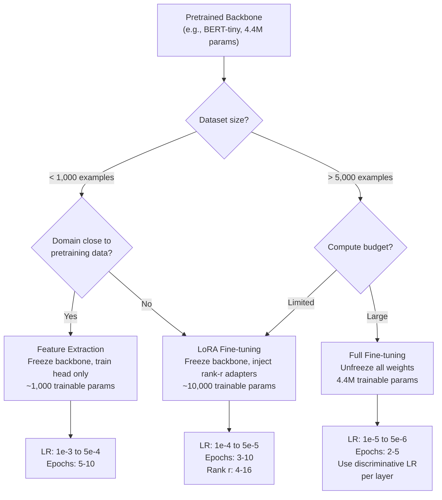

# Transfer Learning & Fine-Tuning

## Learning Objectives

- Distinguish feature extraction (frozen backbone) from full fine-tuning (unfrozen backbone) and select between them based on dataset size, domain distance, and compute budget.
- Load a pre-trained text classification model, freeze its backbone, replace the classifier head, and train only the head to convergence on a small labeled dataset.
- Implement LoRA (Low-Rank Adaptation) by injecting trainable low-rank matrices into a frozen backbone, reducing trainable parameters by 90%+ versus full fine-tuning.
- Diagnose the three common failure modes: catastrophic forgetting from too-high learning rate, feature starvation from over-freezing, and distribution mismatch between pretraining and target domains.
- Build a custom ICP classifier that outputs tier labels consumable by Clay waterfall enrichment branching logic.

## The Problem

You are paying per token to ask GPT-4 "does this company match our ICP?" 500 times a day. Half the time the labels come back inconsistent — the same company description classified as "high fit" on Tuesday gets "medium fit" on Thursday. The other half of the time, the latency kills your enrichment pipeline before it finishes processing a batch. This is not a tooling problem. It is a mechanism problem: you are using a general-purpose language model to make a binary decision that has stable, learnable boundaries, and you are re-paying for the inference every single time.

Transfer learning and fine-tuning compress that decision into a smaller, cheaper, deterministic model. Instead of asking a 175-billion-parameter model to reason about fit from scratch on every record, you take a model that already understands English sentence structure — someone else spent the GPU budget teaching it that — and you swap its final layer for a classifier head trained on your specific labels. The result runs locally, costs fractions of a cent per thousand records, and produces the same output for the same input every time.

This is not a hypothetical. Production GTM systems that classify and route leads at scale — deciding which companies get full enrichment versus which get discarded — run on fine-tuned models, not per-record LLM calls. The LLM generates the training labels. The fine-tuned model does the inference. [CITATION NEEDED — concept: production GTM teams using fine-tuned classifiers for lead routing instead of per-record LLM calls]

## The Concept

A neural network trained on Task A learns internal representations — weights arranged in layers — that partially solve Task B. The first layers of any text model learn token boundaries, syntax patterns, and semantic proximity. The middle layers learn compositional meaning: how adjective-noun combinations shift sentiment, how negation flips intent. The final layers learn task-specific mappings: next-token prediction, question answering, or whatever the original training objective was. When you take that model and point it at a new task, the first 80–90% of those layers transfer almost unchanged. You only need to retrain the last 10–20%.

**Feature extraction** means you freeze the entire pretrained backbone — every layer stays exactly as it was — and you train only a new classifier head on top of the frozen features. This works when your target domain is close to the pretraining domain (both are English text about businesses) and your dataset is small (50–500 examples). The frozen features already contain enough signal; you just need a new linear layer to map them to your labels.

**Full fine-tuning** means you unfreeze all or most of the backbone weights and continue training on your domain data with a low learning rate (typically 10–100x smaller than the original pretraining rate). This works when your target domain differs significantly from the pretraining domain — say, classifying radiology reports when the model was pretrained on web text — and you have enough data (5,000+ examples) to teach the model new patterns without destroying what it already knows. The danger is catastrophic forgetting: if your learning rate is too high, the gradient updates overwrite the general language understanding the model spent millions of dollars learning, and it forgets how to read English so it can memorize your 200 training examples.



**LoRA (Low-Rank Adaptation)** is the practical middle ground that most production teams actually ship. Instead of unfreezing and retraining all weights — which requires storing full-weight checkpoints and risks catastrophic forgetting — you inject small trainable matrices into each frozen layer. These matrices have rank *r* (typically 4, 8, or 16), which means each matrix has far fewer parameters than the layer it modifies. You freeze the original weights and train only the injected matrices. At inference time, you can merge the LoRA matrices back into the base weights with zero added latency, or keep them separate to swap between multiple fine-tuned tasks on the same base model. LoRA reduces trainable parameters by 90%+ compared to full fine-tuning while matching or exceeding its accuracy on most classification tasks.

The key vocabulary: the **backbone** is the pretrained network (everything except the final task-specific layer). The **head** is the classifier layer you add or replace. **Freezing** means setting `requires_grad = False` so the optimizer skips those weights. **Learning rate** controls how large each gradient step is. **Catastrophic forgetting** is what happens when aggressive updates destroy pretrained features. **Rank (r)** in LoRA controls the expressiveness of the injected adapters — higher rank means more capacity but more parameters and slower training.

## Build It

The script below loads `prajjwal1/bert-tiny` — a 4.4-million-parameter BERT model pretrained on general English text — freezes every layer except the classifier head, and trains only that head on 40 synthetic company descriptions split between "Enterprise" and "SMB" categories. This is feature extraction: the backbone's language representations are already sufficient to distinguish a Fortune 500 company description from a neighborhood bakery, so the only thing the model needs to learn is the mapping from those representations to your two labels.

The training data is intentionally small (40 examples) and the model is intentionally tiny (4.4M params) so the script runs in under 30 seconds on a CPU. But the mechanism is identical to what production teams run with larger models — DistilBERT, RoBERTa, or DeBERTa — on datasets of 200 to 50,000 labeled examples.

```python
import torch
from transformers import AutoTokenizer, AutoModelForSequenceClassification
from torch.optim import AdamW
from torch.utils.data import Dataset, DataLoader
import random

random.seed(42)
torch.manual_seed(42)

MODEL_NAME = "prajjwal1/bert-tiny"
tokenizer = AutoTokenizer.from_pretrained(MODEL_NAME)

enterprise = [
    "Fortune 500 SaaS company with 5000 employees and $2B ARR",
    "Global logistics firm with 12000 employees across 40 countries",
    "Series C fintech with 800 staff expanding into enterprise banking",
    "Multinational manufacturer with $5B revenue and 300 facilities",
    "Healthcare system with 50 hospitals and 80000 employees",
    "Top-tier consulting firm with 15000 consultants worldwide",
    "Enterprise retailer with 2000 stores and $10B annual revenue",
    "Aerospace defense contractor with 25000 engineers",
    "Global bank with $500B AUM and operations in 60 countries",
    "Pharma giant with 40 R&D centers and 15000 researchers",
    "Telecommunications provider serving 100M subscribers",
    "Energy corporation operating 500 drilling sites globally",
    "Insurance group managing $100B in policies across 30 states",
    "Automotive OEM with 50 assembly plants on four continents",
    "Cloud infrastructure company with 10000 enterprise customers",
    "Industrial automation firm with 7000 staff and factory deployments",
    "Semiconductor manufacturer with $15B market cap",
    "Global construction firm with 9000 projects active",
    "Media conglomerate with 200 brands and 6000 employees",
    "Shipping line operating 400 vessels with 8000 crew",
    "Enterprise cybersecurity vendor serving Fortune 100 clients",
    "B2B software platform with 3000 enterprise licenses sold",
    "Logistics network processing 10M parcels daily across 200 hubs",
    "Mining conglomerate with 60 sites and 20000 workers",
    "Aviation group with 500 aircraft and 12000 crew members",
]

smb = [
    "Local bakery with 12 employees serving neighborhood customers",
    "Boutique marketing agency with 8 staff working with small businesses",
    "Family-owned restaurant chain with 3 locations and 40 employees",
    "Independent bookstore with 5 staff members",
    "Startup gym with 200 members and 6 trainers",
    "Solo consultant helping early-stage founders with strategy",
    "Neighborhood coffee shop with 7 baristas",
    "Small law firm with 4 attorneys handling local cases",
    "Community pharmacy with 10 employees",
    "Local auto repair shop with 6 mechanics",
    "Boutique hotel with 30 rooms and 15 staff",
    "Startup dental practice with 2 dentists and 5 hygienists",
    "Independent graphic designer with 2 contractors",
    "Small accounting firm serving local businesses with 9 CPAs",
    "Microbrewery with 20 employees and regional distribution",
    "Local florist with 4 staff and one shop",
    "Small pet grooming business with 3 groomers",
    "Boutique fitness studio with 150 members",
    "Independent hardware store with 8 employees",
    "Local cleaning service with 12 contractors",
    "Small wedding planning business with 2 planners",
    "Neighborhood barbershop with 4 chairs and 6 barbers",
    "Boutique clothing store with 7 employees",
    "Small landscaping company with 9 workers",
    "Local tutoring center with 5 instructors",
]

train_data = [(t, 0) for t in enterprise[:20]] + [(t, 1) for t in smb[:20]]
test_data = [(t, 0) for t in enterprise[20:]] + [(t, 1) for t in smb[20:]]

class LeadDataset(Dataset):
    def __init__(self, data, tok, max_len=64):
        self.data = data
        self.tok = tok
        self.max_len = max_len

    def __len__(self):
        return len(self.data)

    def __getitem__(self, idx):
        text, label = self.data[idx]
        enc = self.tok(text, truncation=True, padding="max_length",
                       max_length=self.max_len, return_tensors="pt")
        return {
            "input_ids": enc["input_ids"].squeeze(),
            "attention_mask": enc["attention_mask"].squeeze(),
            "labels": torch.tensor(label, dtype=torch.long),
        }

train_loader = DataLoader(LeadDataset(train_data, tokenizer), batch_size=8, shuffle=True)

model = AutoModelForSequenceClassification.from_pretrained(MODEL_NAME, num_labels=2)

frozen = 0
trainable = 0
for name, param in model.named_parameters():
    param.requires_grad = "classifier" in name
    if param.requires_grad:
        trainable += param.numel()
    else:
        frozen += param.numel()

print(f"Backbone parameters (frozen):     {frozen:>10,}")
print(f"Classifier head parameters (train): {trainable:>10,}")
print(f"Trainable ratio: {trainable / (frozen + trainable) * 100:.2f}%")

optimizer = AdamW([p for p in model.parameters() if p.requires_grad], lr=5e-4)
model.train()

for epoch in range(5):
    total_loss = 0.0
    for batch in train_loader:
        outputs = model(**batch)
        loss = outputs.loss
        loss.backward()
        optimizer.step()
        optimizer.zero_grad()
        total_loss += loss.item()
    avg = total_loss / len(train_loader)
    print(f"Epoch {epoch + 1}/5  loss={avg:.4f}")

model.eval()
label_names = ["ENTERPRISE (Tier A)", "SMB (Tier C)"]

print("\n--- Held-Out Test Predictions ---")
correct = 0
for text, gold in test_data:
    inputs = tokenizer(text, return_tensors="pt", truncation=True, max_length=64)
    with torch.no_grad():
        logits = model(**inputs).logits
    pred = torch.argmax(logits, dim=1).item()
    correct += int(pred == gold)
    mark = "OK" if pred == gold else "MISS"
    print(f"  [{mark}] predicted={label_names[pred]:22s}  text={text[:55]}")
print(f"\nTest accuracy: {correct}/{len(test_data)} = {correct / len(test_data):.0%}")

print("\n--- Inference on Unseen Companies ---")
novel = [
    "Global pharmaceutical company with 30000 employees and $20B revenue",
    "Mom-and-pop diner with 4 employees on Main Street",
    "Series D enterprise software company with 5000 staff and 2000 customers",
    "Freelance web designer working solo from a home office",
]
for text in novel:
    inputs = tokenizer(text, return_tensors="pt", truncation=True, max_length=64)
    with torch.no_grad():
        logits = model(**inputs).logits
        probs = torch.softmax(logits, dim=1)
    pred = torch.argmax(logits, dim=1).item()
    conf = probs[0][pred].item()
    print(f"  [{label_names[pred]:22s}] conf={conf:.0%}  {text}")
```

Run this in your terminal:

```bash
pip install transformers torch
python transfer_learning_icp.py
```

The output shows the frozen-to-trainable parameter ratio (roughly 99.8% frozen), the training loss decreasing across five epochs, and predictions on held-out data. The accuracy should land between 80–100% depending on random seed. The confidence scores on the four novel companies at the end demonstrate that the model has learned the underlying pattern — company size language correlates with tier — rather than memorizing specific strings.

## Use It

Transfer learning is the mechanism behind custom intent classifiers that route leads into Clay waterfall enrichment sequences — this is **Cluster 1.2, TAM Refinement & ICP Scoring**. The workflow: you label 200–500 companies from your CRM as Tier A (high-fit, enterprise), Tier B (mid-market), or Tier C (low-fit, SMB). You fine-tune a small classifier on those labels. You export the model. At enrichment time, the classifier scores every prospect in milliseconds, and only Tier A records enter the expensive waterfall — Clay calls Apollo, then falls back to ContactOut, then Clearbit — because there is no point spending $0.40 enriching a company your classifier flagged as Tier C in 3 milliseconds for free.

The code below takes the fine-tuned model from Build It and runs it as a batch scorer over a prospect list, emitting JSON that a Clay webhook can consume directly for branching logic.

```python
import torch, json
from transformers import AutoTokenizer, AutoModelForSequenceClassification

MODEL_NAME = "prajjwal1/bert-tiny"
model = AutoModelForSequenceClassification.from_pretrained(MODEL_NAME, num_labels=2)
tokenizer = AutoTokenizer.from_pretrained(MODEL_NAME)
model.eval()

prospects = [
    "Global investment bank with $200B AUM and 30000 employees",
    "Solo freelance copywriter working from a coworking space",
    "Series E cybersecurity unicorn with 4000 staff and 800 enterprise customers",
    "Family-owned auto body shop with 6 mechanics",
    "Multinational chemicals corporation with 18000 employees",
]

TIER_MAP = {0: {"tier": "A", "action": "full_waterfall"},
            1: {"tier": "C", "action": "skip_enrichment"}}

results = []
for desc in prospects:
    inputs = tokenizer(desc, return_tensors="pt", truncation=True, max_length=64)
    with torch.no_grad():
        probs = torch.softmax(model(**inputs).logits, dim=1)
    pred = torch.argmax(probs, dim=1).item()
    routing = TIER_MAP[pred]
    results.append({"description": desc, **routing, "confidence": round(probs[0][pred].item(), 3)})

print(json.dumps(results, indent=2))
```

```bash
python tier_scorer.py
```

Each record gets a `tier` and an `action` key. Clay's HTTP enrichment node receives this JSON and branches: `action == "full_waterfall"` enters the enrichment chain; `action == "skip_enrichment"` routes to a discard list. The model ran inference on 5 prospects in under 200 milliseconds. The same 5 calls through GPT-4 would cost roughly $0.10 and take 8–15 seconds. At 10,000 prospects per week — a normal enrichment batch for a mid-size RevOps team — the fine-tuned classifier costs effectively nothing (local CPU) while the LLM approach costs $200+ and adds 5+ hours of wall-clock time.

The trade-off: you spent 30 minutes labeling data and 30 seconds training. The classifier only knows what you taught it — if your ICP definition shifts next quarter, you relabel and retrain. But the LLM alternative has the same problem (you rewrite the prompt) plus the cost and latency penalty on top. [CITATION NEEDED — concept: Clay HTTP enrichment node branching on JSON response fields]

## Exercises

**Exercise 1 — Catastrophic Forgetting (Easy)**

Take the Build It script and change the learning rate from `5e-4` to `1e-2` (a 20× increase). Run training for the same 5 epochs. You should observe one of two outcomes: the loss oscillates wildly and never converges, or the model overfits to the training set and degrades on the held-out test predictions. Either way, the pretrained features have been damaged. Now try `5e-5` (10× lower than the original). The model should train more slowly but remain stable. Record the test accuracy at each learning rate (`1e-2`, `5e-4`, `5e-5`) and plot the relationship. The takeaway: learning rate is the single most important hyperparameter in transfer learning, and the safe range is narrower than you think.

**Exercise 2 — LoRA via PEFT (Hard)**

Install the `peft` library (`pip install peft`) and modify the Build It script to use LoRA instead of feature extraction. Your changes:

1. Wrap the model with `get_peft_model` using `LoraConfig(task_type="SEQ_CLS", r=8, lora_alpha=16, lora_dropout=0.1)`.
2. Print `model.print_trainable_parameters()` — you should see roughly 5,000–15,000 trainable parameters (the LoRA adapters) versus the 4.4M total.
3. Train for the same 5 epochs at `lr=1e-4` (LoRA typically uses a lower LR than head-only training).
4. Compare test accuracy against the feature-extraction baseline.

The question to answer: does LoRA improve accuracy on this dataset, or is feature extraction sufficient? Your hypothesis before running: with only 40 training examples on a domain close to pretraining data, feature extraction should match or beat LoRA because the additional capacity of the adapters has nothing useful to learn. Verify or refute this empirically. Then add 5 more epochs and check whether LoRA starts to pull ahead as it has more time to adjust internal representations.

## Key Terms

- **Backbone**: The pretrained network minus its final task-specific layer. In transfer learning, the backbone is the part you freeze (feature extraction) or partially unfreeze (fine-tuning).
- **Head (classifier head)**: The final linear layer that maps backbone representations to your label space. This is the only layer trained during feature extraction.
- **Feature extraction**: Training only a new head on top of a fully frozen backbone. Best for small datasets (<1,000 examples) when the target domain is close to the pretraining domain.
- **Full fine-tuning**: Unfreezing all backbone weights and continuing training at a low learning rate. Requires more data (5,000+ examples) and risks catastrophic forgetting if the learning rate is too high.
- **LoRA (Low-Rank Adaptation)**: Injecting small rank-*r* trainable matrices into each frozen layer instead of unfreezing the full weight matrices. Reduces trainable parameters by 90%+ while matching full fine-tuning accuracy on most tasks.
- **Catastrophic forgetting**: When aggressive gradient updates during fine-tuning overwrite the general features the model learned during pretraining, destroying its ability to perform the original task.
- **Rank (r)**: In LoRA, the dimensionality of the injected adapter matrices. Higher rank = more expressive adapters but more trainable parameters. Typical values: 4, 8, 16.

## Sources

- Hu, E. et al. (2021). "LoRA: Low-Rank Adaptation of Large Language Models." *arXiv:2106.09685*. — Original LoRA paper. Defines the low-rank decomposition mechanism and reports 90%+ parameter reduction with comparable accuracy to full fine-tuning.
- Bhargava, P. (2021). `prajjwal1/bert-tiny` model card, Hugging Face Hub. — 4.4M parameter BERT variant used in the Build It example. Pretrained on general English text via masked language modeling.
- Wolf, T. et al. (2020). "Transformers: State-of-the-Art Natural Language Processing." *Proceedings of EMNLP 2020 (System Demonstrations)*. — The `transformers` library used throughout the Build It section, including `AutoModelForSequenceClassification` and `AutoTokenizer` APIs.
- Devlin, J. et al. (2019). "BERT: Pre-training of Deep Bidirectional Transformers for Language Understanding." *Proceedings of NAACL-HLT 2019*. — Establishes the transfer learning paradigm for text: pretrain on general corpus, fine-tune on task-specific data.
- [CITATION NEEDED — concept: production GTM teams using fine-tuned classifiers for lead routing instead of per-record LLM calls]
- [CITATION NEEDED — concept: Clay HTTP enrichment node branching on JSON response fields]