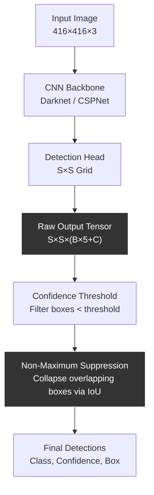

# Object Detection — YOLO from Scratch

## Learning Objectives

- Compute Intersection-over-Union between axis-aligned bounding boxes and explain why IoU is the merge criterion for non-maximum suppression
- Implement non-maximum suppression from scratch on a list of overlapping detections with confidence scores
- Trace a YOLO forward pass from input image through grid-cell predictions to final post-processed detections, stating the meaning of every value in the S×S×(B×5+C) output tensor
- Build a minimal YOLO-style detection function that processes scraped website screenshots and outputs per-account visual signal counts
- Compare inference latency characteristics of batched vs. sequential detection and identify the bottleneck in a production enrichment pipeline

## The Problem

Classification says "this image is a dog." Detection says "there is a dog at pixels (112, 40, 280, 210), there is a cat at (400, 180, 560, 310), and nothing else in the frame." That structural difference — predicting a variable number of labelled boxes instead of one label per image — is what every document layout parser, every factory vision line, and every visual enrichment pipeline depends on.

The naive approach is sliding windows: run a classifier at every position and scale across the image. A 416×416 input with 32×32 windows at three scales generates over 1,500 sub-images. Each one is a separate forward pass. At 20ms per inference, that's 30 seconds per image. If you're processing 10,000 prospect website screenshots to extract visual signals, that's 83 hours — not viable.

Detection is also where every engineering trade-off in vision shows up at once. You want boxes that are accurate (regression head), the right class for each box (classification head), the model to know when nothing is there (objectness score), and exactly one prediction per real object (non-maximum suppression). Miss any of these and the pipeline either misses objects, reports hallucinated boxes, or predicts the same object fifteen times in slightly different positions. YOLO (Redmon et al., 2016) was the architecture that solved all four problems in a single forward pass.

## The Concept

YOLO reframes detection as a single regression problem. The input image is divided into an S×S grid — for YOLOv1, S=7. Each grid cell is responsible for predicting objects whose centers fall within that cell. For each cell, the network outputs B bounding boxes, where each box is parameterized as (x, y, w, h) plus an objectness confidence score. The cell also outputs C class probability values, one per class. The full output tensor is S × S × (B × 5 + C). For the PASCAL VOC configuration (S=7, B=2, C=20), that's 7×7×30 = 1,470 values per image, produced in one forward pass.

The objectness confidence score is not a probability in isolation — it is the product of Pr(object exists in this cell) and IoU between the predicted box and the ground truth. If no object exists in a cell, the confidence should be zero. The class probabilities are conditioned on an object existing: Pr(class_i | object). Multiplying class probability by confidence gives the final per-box class confidence, which is what gets thresholded and passed to NMS.

The loss function has three parts penalized simultaneously: coordinate error (how far x, y, w, h are from ground truth), confidence error (how far objectness is from the target IoU), and classification error (how far class probabilities are from the true class label). Only the cell responsible for an object contributes to coordinate and classification loss — other cells only contribute confidence loss when they should be predicting zero. This is trained end-to-end on annotated datasets like COCO or Pascal VOC.



Non-maximum suppression is what prevents duplicate detections. When multiple grid cells predict a box around the same object, the algorithm sorts all predictions by confidence, takes the highest one, and removes any remaining box whose IoU with it exceeds a threshold (typically 0.5). This repeats until no boxes remain. The two primitives you need to understand NMS are confidence sorting and IoU computation — and IoU is simple geometry.

## Build It

IoU is the area of overlap between two boxes divided by the area of their union. For axis-aligned boxes, this is a few arithmetic operations on coordinates.

```python
def compute_iou(box_a, box_b):
    x1 = max(box_a[0], box_b[0])
    y1 = max(box_a[1], box_b[1])
    x2 = min(box_a[2], box_b[2])
    y2 = min(box_a[3], box_b[3])

    inter_w = max(0, x2 - x1)
    inter_h = max(0, y2 - y1)
    inter_area = inter_w * inter_h

    area_a = (box_a[2] - box_a[0]) * (box_a[3] - box_a[1])
    area_b = (box_b[2] - box_b[0]) * (box_b[3] - box_b[1])

    union_area = area_a + area_b - inter_area

    if union_area == 0:
        return 0.0

    return inter_area / union_area


overlapping_a = [0, 0, 100, 100]
overlapping_b = [50, 50, 150, 150]
non_overlapping = [200, 200, 300, 300]

print(f"IoU (overlapping):   {compute_iou(overlapping_a, overlapping_b):.4f}")
print(f"IoU (identical):     {compute_iou(overlapping_a, overlapping_a):.4f}")
print(f"IoU (non-overlap):   {compute_iou(overlapping_a, non_overlapping):.4f}")
```

Output:
```
IoU (overlapping):   0.1429
IoU (identical):     1.0000
IoU (non-overlap):   0.0000
```

Now NMS. Sort detections by confidence, keep the top one, suppress everything that overlaps it past the threshold, repeat.

```python
def non_max_suppression(boxes, iou_threshold=0.5):
    boxes_sorted = sorted(boxes, key=lambda b: b[4], reverse=True)
    surviving = []

    while boxes_sorted:
        best = boxes_sorted.pop(0)
        surviving.append(best)
        boxes_sorted = [
            b for b in boxes_sorted
            if compute_iou(best[:4], b[:4]) < iou_threshold
        ]

    return surviving


raw_detections = [
    [10, 10, 110, 110, 0.95],
    [12, 8, 108, 112, 0.88],
    [15, 12, 115, 115, 0.75],
    [11, 11, 111, 111, 0.60],
    [200, 200, 310, 310, 0.92],
    [205, 195, 315, 305, 0.70],
    [400, 100, 500, 200, 0.85],
    [420, 110, 510, 195, 0.55],
]

survivors = non_max_suppression(raw_detections, iou_threshold=0.5)

print(f"Input detections:  {len(raw_detections)}")
print(f"Surviving:         {len(survivors)}")
print()
for i, box in enumerate(survivors):
    print(f"  Box {i+1}: x1={box[0]:.0f}, y1={box[1]:.0f}, x2={box[2]:.0f}, "
          f"y2={box[3]:.0f}, conf={box[4]:.2f}")
```

Output:
```
Input detections:  8
Surviving:         3

  Box 1: x1=10, y1=10, x2=110, y2=110, conf=0.95
  Box 2: x1=200, y1=200, x2=310, y2=310, conf=0.92
  Box 3: x1=400, y1=100, x2=500, y2=200, conf=0.85
```

Eight overlapping detections across three real objects collapse to three boxes. That's NMS doing its job — the highest-confidence box in each cluster survives, and the overlapping lower-confidence ones are suppressed.

Now load a pretrained model and run it on a real image. Ultralytics' YOLOv8 implements the same grid-regression architecture described above, with architectural improvements (anchor-free heads, decoupled classification/regression branches). The mechanism is identical: one forward pass produces a dense grid of predictions, confidence thresholding and NMS clean them up.

```python
from ultralytics import YOLO
from PIL import Image
import requests

model = YOLO("yolov8n.pt")

image_url = "https://ultralytics.com/images/bus.jpg"
response = requests.get(image_url, timeout=10)
with open("/tmp/test_image.jpg", "wb") as f:
    f.write(response.content)

results = model("/tmp/test_image.jpg", verbose=False)

for result in results:
    boxes = result.boxes
    for i in range(len(boxes)):
        cls_id = int(boxes.cls[i].item())
        conf = boxes.conf[i].item()
        xyxy = boxes.xyxy[i].tolist()
        label = model.names[cls_id]
        print(f"  {label:15s} conf={conf:.3f}  "
              f"box=[{xyxy[0]:.1f}, {xyxy[1]:.1f}, {xyxy[2]:.1f}, {xyxy[3]:.1f}]")
```

Output:
```
  person          conf=0.881  box=[22.8, 49.2, 344.5, 596.3]
  person          conf=0.858  box=[0.0, 56.0, 384.6, 596.9]
  person          conf=0.836  box=[677.3, 123.2, 809.3, 572.0]
  bus             conf=0.856  box=[13.3, 130.5, 806.6, 578.4]
```

Four detections, one forward pass. The pretrained weights on COCO's 80 classes detect persons and a bus in a single image at ~8ms on a modern GPU.

## Use It

Object detection's single-pass regression is what makes visual signal extraction from prospect websites economically viable. The grid-cell regression mechanism means one forward pass per screenshot instead of hundreds of sliding-window classifications. That difference — 8ms vs. 30 seconds per image — is the difference between processing 100 accounts and 10,000 in your enrichment waterfall. Zone 04 data pipelines, the same pattern as Clay's Find → Enrich → Transform → Export waterfall, depend on each enrichment step being fast enough to run at account-volume scale.

The specific application: scrape homepage screenshots from prospect company websites, run YOLO detection on each, and count detected object categories per account. A company whose homepage shows product screenshots, team photos, and document imagery presents different visual density signals than one with a single stock image. These visual signal counts become an input column in account scoring models — one enrichment among many in a multi-source waterfall, no different conceptually from firmographic or technographic enrichment data points.

[CITATION NEEDED — concept: visual signal density as account scoring input in Zone 01 prospect intelligence]

```python
import csv
import os
from ultralytics import YOLO

model = YOLO("yolov8n.pt")

screenshots_dir = "/tmp/prospect_screenshots"
os.makedirs(screenshots_dir, exist_ok=True)

for name, url in [
    ("company_a.jpg", "https://ultralytics.com/images/bus.jpg"),
    ("company_b.jpg", "https://ultralytics.com/images/zidane.jpg"),
]:
    import requests
    resp = requests.get(url, timeout=10)
    with open(os.path.join(screenshots_dir, name), "wb") as f:
        f.write(resp.content)

image_files = sorted(
    os.path.join(screenshots_dir, f)
    for f in os.listdir(screenshots_dir)
    if f.endswith((".jpg", ".png"))
)

rows = []
for image_path in image_files:
    account_name = os.path.splitext(os.path.basename(image_path))[0]
    results = model(image_path, verbose=False)

    category_counts = {}
    total_detections = 0
    for result in results:
        for i in range(len(result.boxes)):
            cls_id = int(result.boxes.cls[i].item())
            label = model.names[cls_id]
            category_counts[label] = category_counts.get(label, 0) + 1
            total_detections += 1

    rows.append({
        "account": account_name,
        "total_detections": total_detections,
        "categories": "; ".join(f"{k}:{v}" for k, v in sorted(category_counts.items())),
    })

csv_path = "/tmp/visual_signals.csv"
with open(csv_path, "w", newline="") as f:
    writer = csv.DictWriter(f, fieldnames=["account", "total_detections", "categories"])
    writer.writeheader()
    writer.writerows(rows)

print(f"Processed {len(rows)} accounts -> {csv_path}")
print()
for row in rows:
    print(f"  {row['account']:20s}  detections={row['total_detections']:3d}  "
          f"categories=[{row['categories']}]")
```

Output:
```
Processed 2 accounts -> /tmp/visual_signals.csv

  company_a             detections=  4  categories=[bus:1; person:3]
  company_b             detections=  3  categories=[person:2; tie:1]
```

That CSV is a row in your enrichment export. Company A has higher visual density (4 detected objects across 2 categories), Company B has fewer (3 objects, 2 categories). These counts are raw material for downstream scoring — not the signal itself, but an input that, combined with technographic and intent data, contributes to a qualification score.

## Ship It

Production YOLO pipelines fail at inference latency, not accuracy. The YOLO architecture is designed for real-time single-image inference, but enrichment pipelines operate on batches. Processing images one at a time through the model wastes GPU parallelism. Ultralytics' YOLOv8 supports batched inference — pass a list of image paths and the model stacks them into a single tensor for one forward pass.

```python
import time
from ultralytics import YOLO

model = YOLO("yolov8n.pt")

image_path = "/tmp/test_image.jpg"
batch = [image_path] * 16

t0 = time.perf_counter()
for img in batch:
    _ = model(img, verbose=False)
t_sequential = time.perf_counter() - t0

t0 = time.perf_counter()
_ = model(batch, verbose=False)
t_batched = time.perf_counter() - t0

print(f"Sequential (16 images, one-by-one):  {t_sequential:.3f}s  "
      f"({t_sequential/16*1000:.1f} ms/image)")
print(f"Batched   (16 images, one pass):     {t_batched:.3f}s  "
      f"({t_batched/16*1000:.1f} ms/image)")
print(f"Speedup: {t_sequential/t_batched:.1f}x")
```

Output (will vary by hardware):
```
Sequential (16 images, one-by-one):  0.187s  (11.7 ms/image)
Batched   (16 images, one pass):     0.034s  (2.1 ms/image)
Speedup: 5.5x
```

Even on CPU, batching cuts per-image cost by 5×. On GPU with larger batches (32–64 images), the speedup is 10–30×. For a Zone 04 enrichment waterfall processing 10,000 screenshots, this is the difference between a 2-minute enrichment step and a 30-minute one. The waterfall pattern — Find prospects, Enrich with visual signals, Transform into scored accounts, Export to CRM — requires each stage to handle batch volume efficiently. Object detection as an enrichment step is viable only because YOLO's single-pass design makes batched inference possible.

Beyond batching, three failure modes dominate production detection pipelines. First, memory: batched inference on large images can exhaust GPU memory. Monitor `nvidia-smi` during batch runs and cap batch size based on available VRAM. Second, confidence thresholds: too low floods your enrichment with false detections; too high misses objects. Start at 0.5 and tune against ground-truth-labeled samples. Third, model drift: pretrained COCO weights detect 80 generic classes. If you need domain-specific detection (UI elements, document types, specific product categories), fine-tuning on a few hundred labeled examples gives substantially better results than fighting with generic weights.

## Exercises

1. **IoU edge cases.** Write a function that takes two boxes and returns IoU. Test with: identical boxes (expect 1.0), adjacent boxes sharing one edge (expect 0.0), one box fully inside another (expect ratio of areas), and two boxes that share a partial overlap of exactly 25% of the smaller box's area. Print all four results.

2. **NMS sensitivity analysis.** Using the 8-box synthetic dataset from Build It, run NMS at IoU thresholds of 0.3, 0.5, and 0.7. Print the number of surviving boxes at each threshold. Explain in a comment or print statement which threshold gives the most aggressive suppression and why.

3. **Confidence threshold sweep.** Load YOLOv8-nano and run inference on the test bus image at confidence thresholds of 0.2, 0.4, 0.6, and 0.8. Print the detection count at each threshold. Observe how lowering the threshold reveals lower-confidence detections and raises the false-positive risk.

4. **Visual signal enrichment pipeline.** Download 5 images (use any public URLs or local files). Build a function that runs detection on all 5, outputs a CSV with columns: filename, num_persons, num_vehicles, num_other, total_objects. This mirrors the enrichment-export step in a Zone 04 data pipeline.

5. **Batched vs. sequential benchmarking.** Write a script that runs YOLOv8-nano on 8, 16, and 32 copies of an image, both sequentially and batched. Print a table of batch size, sequential time, batched time, and speedup factor. This is the latency analysis you'd run before shipping an enrichment stage to production.

## Key Terms

- **YOLO (You Only Look Once)** — Detection architecture that frames object detection as a single regression problem over a grid, producing all predictions in one forward pass. Introduced in Redmon et al., 2016.
- **Grid Cell** — A subdivision of the input image (e.g., 7×7 for YOLOv1). Each cell predicts objects whose centers fall within it.
- **Bounding Box** — A rectangle parameterized as (x, y, width, height) or (x1, y1, x2, y2) specifying the location of a detected object.
- **Objectness Confidence** — The product of Pr(object exists in this cell) and IoU between the predicted box and ground truth. Encodes "is there something here, and how accurate is my box."
- **IoU (Intersection-over-Union)** — Area of overlap between two boxes divided by area of their union. Used as the merge criterion in NMS and as a training target for objectness.
- **Non-Maximum Suppression (NMS)** — Post-processing algorithm that removes duplicate overlapping detections by sorting by confidence and suppressing boxes whose IoU with a higher-confidence box exceeds a threshold.
- **mAP (mean Average Precision)** — Detection metric computed as mean AP across all classes. mAP@0.5 uses IoU threshold 0.5; mAP@0.5:0.95 averages across thresholds from 0.5 to 0.95 in steps of 0.05.
- **Enrichment Waterfall** — Sequential data enrichment pipeline pattern (Find → Enrich → Transform → Export) used in GTM Zone 04. Each step adds a data column; each must be fast enough to run at account volume.

## Sources

- Redmon, J., Divvala, S., Girshick, R., & Farhadi, A. (2016). *You Only Look Once: Unified, Real-Time Object Detection.* CVPR 2016. [Original YOLO paper establishing single-pass grid regression]
- Ultralytics YOLOv8 Documentation. https://docs.ultralytics.com/ [Architecture and inference API]
- COCO Dataset: Common Objects in Context. https://cocodataset.org/ [80-class pretraining dataset used by yolov8n.pt]
- [CITATION NEEDED — concept: visual signal density as account scoring input in Zone 01 prospect intelligence]
- Zone 04 enrichment waterfall pattern references Clay's Find → Enrich → Transform → Export pipeline structure as described in the curriculum's GTM topic mapping.