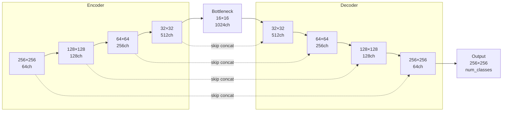

# Semantic Segmentation — U-Net

## Learning Objectives

- Distinguish semantic, instance, and panoptic segmentation and select the correct task for a given pixel-level prediction problem
- Build a U-Net in PyTorch with encoder blocks, a bottleneck, transposed-convolution decoder blocks, and skip connections that concatenate feature maps at matching resolutions
- Trace tensor shapes through every stage of a U-Net forward pass and predict the spatial and channel dimensions after each operation
- Implement pixel-wise cross-entropy, Dice loss, and the combined loss function that is the current default for medical and industrial segmentation
- Read per-class IoU and Dice metrics and diagnose whether a low score originates from small-object recall, boundary accuracy, or class imbalance

## The Problem

Classification outputs one label per image. Detection outputs a handful of boxes. Segmentation outputs one label per pixel. For an input of size H × W, the output is a tensor of shape H × W (semantic) or H × W × N_instances (instance). A single 128 × 128 image is 16,384 simultaneous predictions; a 1024 × 1024 satellite tile is over a million.

This dense prediction structure is why segmentation underpins almost every product that needs exact spatial extent rather than a bounding box. Medical imaging extracts tumour masks where boundary precision affects treatment planning. Autonomous driving separates road from pavement at pixel resolution because lane departure is a centimetre-scale decision. Satellite pipelines extract building footprints and crop boundaries. Document parsers identify layout zones. None of these are solvable with a box — they need the silhouette.

The architectural tension is straightforward to state and not straightforward to resolve. You need the network to encode global context (what kind of scene is this, what objects are present) and preserve local pixel detail (exactly which pixel is road vs pavement) at the same time. A standard CNN gains context by compressing spatial resolution through pooling and strided convolutions. That compression is exactly what throws away the boundary detail. U-Net was the design that resolved this by giving the network a way to reach back into the encoder's intermediate feature maps during reconstruction.

## The Concept

Semantic segmentation assigns a single class label to every pixel in an image. Instance segmentation extends this by separating distinct objects of the same class — two cars become two masks, not one. Panoptic segmentation unifies both: every pixel gets a semantic label and pixels belonging to "thing" classes also get an instance ID. Picking the right task is a question of whether your downstream consumer needs identity (instance), category only (semantic), or both (panoptic). For this lesson we work with semantic segmentation, which is the foundation the other two extend.

U-Net, introduced in 2015 for medical image segmentation, established the encoder-decoder with skip connections pattern that nearly every modern dense-prediction model inherits. The mechanism has three parts. The encoder applies repeated blocks of two 3×3 convolutions followed by a 2×2 max-pool, halving spatial resolution at each stage while increasing channel depth. The bottleneck sits at the bottom of the U and operates on the most compressed representation — high channel count, low spatial resolution. The decoder mirrors the encoder: transposed convolutions double spatial resolution at each stage while reducing channel depth, and skip connections concatenate the corresponding encoder feature map to the decoder input at each resolution.



The skip connection is the critical design decision. Without it, the decoder must reconstruct full-resolution spatial detail from a heavily compressed bottleneck. Pooling is not invertible — the exact pixel positions are lost. By concatenating the encoder feature map at matching resolution, the decoder receives the pre-pooling feature activations that still retain local spatial structure. The decoder then learns to combine the upsampled coarse representation with the fine-grained encoder features.

Two design choices deserve attention. First, U-Net uses concatenation rather than addition for skip connections. Addition would merge channels element-wise and force the decoder to disentangle which features came from which path. Concatenation preserves both streams as distinct channel groups, letting subsequent convolutions learn how to weight them. Second, the final layer is a 1×1 convolution that maps the decoder's channel depth to the number of classes, producing an H × W × C logit map passed through pixel-wise cross-entropy.

Loss functions for segmentation are not interchangeable with classification. Standard cross-entropy treats every pixel as an independent classification, which is correct in principle but brittle when classes are imbalanced — a small tumour region in a large background contributes almost nothing to the loss. The Dice coefficient, derived from the F1 score, directly measures overlap between prediction and ground truth and is invariant to class frequency. The current default for medical and industrial segmentation is a weighted sum of cross-entropy and Dice, which combines the stability of pixel-wise supervision with the overlap-aware gradient that Dice provides.

## Build It

We build a minimal U-Net in PyTorch and run a forward pass on a synthetic input, printing shapes at every stage to make the information flow visible. Each double-convolution block applies two 3×3 convolutions with padding, each followed by BatchNorm and ReLU. The encoder downsamples with max-pooling; the decoder upsamples with transposed convolutions. Skip connections concatenate encoder outputs to decoder inputs at matching spatial resolutions.

```python
import torch
import torch.nn as nn
import torch.nn.functional as F

class DoubleConv(nn.Module):
    def __init__(self, in_ch, out_ch):
        super().__init__()
        self.block = nn.Sequential(
            nn.Conv2d(in_ch, out_ch, 3, padding=1, bias=False),
            nn.BatchNorm2d(out_ch),
            nn.ReLU(inplace=True),
            nn.Conv2d(out_ch, out_ch, 3, padding=1, bias=False),
            nn.BatchNorm2d(out_ch),
            nn.ReLU(inplace=True),
        )

    def forward(self, x):
        return self.block(x)

class UNet(nn.Module):
    def __init__(self, in_channels=1, num_classes=2):
        super().__init__()
        self.enc1 = DoubleConv(in_channels, 64)
        self.enc2 = DoubleConv(64, 128)
        self.enc3 = DoubleConv(128, 256)
        self.enc4 = DoubleConv(256, 512)
        self.pool = nn.MaxPool2d(2)
        self.bottleneck = DoubleConv(512, 1024)
        self.up4 = nn.ConvTranspose2d(1024, 512, 2, stride=2)
        self.dec4 = DoubleConv(1024, 512)
        self.up3 = nn.ConvTranspose2d(512, 256, 2, stride=2)
        self.dec3 = DoubleConv(512, 256)
        self.up2 = nn.ConvTranspose2d(256, 128, 2, stride=2)
        self.dec2 = DoubleConv(256, 128)
        self.up1 = nn.ConvTranspose2d(128, 64, 2, stride=2)
        self.dec1 = DoubleConv(128, 64)
        self.out_conv = nn.Conv2d(64, num_classes, 1)

    def forward(self, x):
        e1 = self.enc1(x)
        e2 = self.enc2(self.pool(e1))
        e3 = self.enc3(self.pool(e2))
        e4 = self.enc4(self.pool(e3))
        b = self.bottleneck(self.pool(e4))
        d4 = self.up4(b)
        d4 = self.dec4(torch.cat([d4, e4], dim=1))
        d3 = self.up3(d4)
        d3 = self.dec3(torch.cat([d3, e3], dim=1))
        d2 = self.up2(d3)
        d2 = self.dec2(torch.cat([d2, e2], dim=1))
        d1 = self.up1(d2)
        d1 = self.dec1(torch.cat([d1, e1], dim=1))
        return self.out_conv(d1)

model = UNet(in_channels=1, num_classes=2)
x = torch.randn(1, 1, 128, 128)

print("Input shape:             ", tuple(x.shape))
e1 = model.enc1(x)
print("After enc1  (128x128):   ", tuple(e1.shape))
e2 = model.enc2(model.pool(e1))
print("After enc2  (64x64):     ", tuple(e2.shape))
e3 = model.enc3(model.pool(e2))
print("After enc3  (32x32):     ", tuple(e3.shape))
e4 = model.enc4(model.pool(e3))
print("After enc4  (16x16):     ", tuple(e4.shape))
b = model.bottleneck(model.pool(e4))
print("Bottleneck  (8x8):       ", tuple(b.shape))
d4 = model.up4(b)
print("After up4   (16x16):     ", tuple(d4.shape))
d4_cat = torch.cat([d4, e4], dim=1)
print("Skip concat (dec4):      ", tuple(d4_cat.shape))
d4 = model.dec4(d4_cat)
print("After dec4  (16x16):     ", tuple(d4.shape))
d3 = model.up3(d4)
d3 = model.dec3(torch.cat([d3, e3], dim=1))
print("After dec3  (32x32):     ", tuple(d3.shape))
d2 = model.up2(d3)
d2 = model.dec2(torch.cat([d2, e2], dim=1))
print("After dec2  (64x64):     ", tuple(d2.shape))
d1 = model.up1(d2)
d1 = model.dec1(torch.cat([d1, e1], dim=1))
print("After dec1  (128x128):   ", tuple(d1.shape))
out = model.out_conv(d1)
print("Output      (128x128x2): ", tuple(out.shape))
total_params = sum(p.numel() for p in model.parameters())
print(f"Total parameters:        {total_params:,}")
```

Running this prints the full shape trace. The encoder halves spatial resolution at each pool (128 → 64 → 32 → 16 → 8) and doubles channels (64 → 128 → 256 → 512 → 1024). The decoder reverses both. Each skip concatenation doubles the channel count before the double-conv block processes it — the dec4 block receives 1024 input channels because the transposed convolution produces 512 and the encoder skip contributes another 512.

The output is a logit map of shape (1, 2, 128, 128) — two channels for two classes. Each spatial position holds a 2-vector of unnormalised class scores. Applying softmax across the channel dimension converts these to per-pixel class probabilities. Taking the argmax across channels gives the predicted class for every pixel.

Now we implement the combined loss