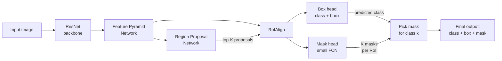

# Instance Segmentation — Mask R-CNN

> Add a tiny mask branch to a Faster R-CNN detector and you have instance segmentation. The hard part is RoIAlign, and it is harder than it looks.

**Type:** Build + Learn
**Languages:** Python
**Prerequisites:** Phase 4 Lesson 06 (YOLO), Phase 4 Lesson 07 (U-Net)
**Time:** ~75 minutes

## Learning Objectives

- Trace the Mask R-CNN architecture end-to-end: backbone, FPN, RPN, RoIAlign, box head, mask head
- Implement RoIAlign from scratch and explain why RoIPool is no longer used
- Run the torchvision `maskrcnn_resnet50_fpn` pretrained model and parse its output format correctly
- Fine-tune Mask R-CNN on a small custom dataset by replacing the box and mask heads
- Compare instance segmentation outputs to semantic segmentation and object detection outputs on the same image

## The Problem

Semantic segmentation gives you one mask per class. Instance segmentation gives you one mask per object, even when two objects share a class. Counting individuals in a crowd, tracking specific cars across frames, measuring the bounding region of each cell in a microscope slide — all of these demand per-instance masks, not per-class masks.

Consider three people overlapping in a single frame. Semantic segmentation paints all three as a single "person" blob. Object detection draws three boxes but tells you nothing about pixel boundaries. You need a method that detects each person individually AND segments each person's pixels precisely. That is instance segmentation.

Mask R-CNN (He et al., 2017) solved this by reframing instance segmentation as detection-plus-a-mask. The design is brutally pragmatic: take an existing detector (Faster R-CNN), add a small mask-prediction branch, fix the feature-sampling problem that was quietly wrecking mask quality, and ship. The approach was so clean that for the next five years almost every instance segmentation paper was a Mask R-CNN variant. The torchvision implementation remains the production default for small-to-medium datasets.

The hard engineering problem is sampling. When you crop a fixed-size feature region out of a proposal box whose corners fall between pixel boundaries — say, proposal corner at (103.7, 47.2) — how do you sample features without introducing quantization error? Getting this wrong costs tenths of a mAP point across every class, every image. RoIAlign is the answer, and the mechanism is worth understanding in detail because the same principle (continuous sampling via interpolation) appears in spatial transformer networks, deformable convolutions, and other architectures.

## The Concept

### The Architecture

Mask R-CNN is a two-stage detector with a third output head bolted on. The first stage proposes candidate regions. The second stage classifies each region, refines its bounding box, and now also predicts a pixel-level mask. The additions over Faster R-CNN are: (1) a mask branch consisting of a small fully convolutional network applied to each RoI, and (2) RoIAlign replacing RoIPool for misalignment-free feature extraction.



The mask branch outputs K masks per RoI, where K is the number of classes. But only the mask for the predicted class is used at inference. This decouples mask generation from classification — the mask branch doesn't decide what class the object is, it just generates a mask conditioned on the RoI features, and the class prediction picks which one to keep. This design avoids inter-class competition in the mask loss.

### RoIAlign: The Detail That Matters

RoIPool, used in Faster R-CNN, quantizes proposal coordinates to integer pixel boundaries before pooling. For bounding box regression this is fine — a sub-pixel shift barely matters when you're predicting a rectangle. For mask prediction it is catastrophic. The proposal box might be shifted by up to 0.75 pixels in each dimension, which means the features you extract come from the wrong spatial location relative to the object. The mask then has to learn around a systematic misalignment, and it shows up as blurry, shifted edges.

RoIAlign eliminates this by skipping quantization entirely. It divides the proposal box (in continuous coordinates) into a fixed grid — say 7×7 for the box head, 14×14 for the mask head. Each grid cell covers a continuous region. To get a single value for that cell, it samples four points within the cell using bilinear interpolation from the backbone feature map, then averages (or max-pools) those four values. The result is a fixed-size feature grid where every value corresponds to the correct spatial location in the original proposal.

### The Loss Function

The total loss for a single labeled RoI is:

$$L = L_{cls} + L_{box} + L_{mask}$$

Where:
- $L_{cls}$ is standard cross-entropy over K+1 classes (K object classes + background)
- $L_{box}$ is smooth L1 loss on bounding box regression offsets
- $L_{mask}$ is per-pixel binary cross-entropy, computed only for the ground-truth class, averaged over the mask grid (typically 28×28)

The critical detail: $L_{mask}$ is **not** multi-class cross-entropy. It is K independent binary segmentation problems. Each class gets its own mask, and the loss is computed only for the mask corresponding to the ground-truth class. This means the mask branch doesn't penalize a "good" person mask when the ground-truth label is "car" — it only optimizes the car mask.

## Build It

Let's run inference with a pre-trained Mask R-CNN from torchvision and examine every field in the output. This code downloads the COCO-pretrained weights automatically and runs a forward pass on any image you provide.

```python
import torch
import torchvision
from torchvision.models.detection import maskrcnn_resnet50_fpn
from torchvision.transforms.functional import to_tensor
from PIL import Image
import urllib.request

urllib.request.urlretrieve(
    "https://pytorch.org/assets/images/deeplearning/cars.jpg",
    "sample.jpg"
)

model = maskrcnn_resnet50_fpn(weights="DEFAULT")
model.eval()

img = Image.open("sample.jpg").convert("RGB")
img_tensor = to_tensor(img).unsqueeze(0)

with torch.no_grad():
    predictions = model(img_tensor)

pred = predictions[0]
num_dets = len(pred["boxes"])
print(f"Detections: {num_dets}")
print(f"Scores (first 10): {pred['scores'][:10].tolist()}")
print(f"Labels (first 10): {pred['labels'][:10].tolist()}")
print(f"Boxes shape: {pred['boxes'].shape}")
print(f"Masks shape: {pred['masks'].shape}")

high_conf = pred["scores"] > 0.7
print(f"\nHigh-confidence detections: {high_conf.sum().item()}")

first_mask = pred["masks"][0, 0]
binary_mask = (first_mask > 0.5).float()
print(f"First mask nonzero pixels: {binary_mask.sum().item():.0f}")
print(f"First mask predicted class: {pred['labels'][0].item()}")
print(f"First mask score: {pred['scores'][0].item():.4f}")
```

The output format is a list of dictionaries (one per input image). Each dictionary contains `boxes` (N×4 tensor), `labels` (N tensor of class indices), `scores` (N tensor of confidence), and `masks` (N×1×H×W tensor of soft mask probabilities). The masks are at the same resolution as the input image, which is why the tensor can get large fast.

Now let's implement RoIAlign from scratch to see exactly what the bilinear interpolation is doing. This makes the mechanism concrete rather than treating it as a black box:

```python
import torch
import torch.nn.functional as F

def roi_align_naive(feature_map, proposals, output_size=(7, 7)):
    """
    feature_map: (1, C, H, W) backbone features
    proposals: (N, 4) tensor of (x1, y1, x2, y2) in feature-map coordinate space
    output_size: spatial grid size for each RoI
    Returns: (N, C, output_size[0], output_size[1])
    """
    _, C, _, _ = feature_map.shape
    N = proposals.shape[0]
    oh, ow = output_size
    output = torch.zeros(N, C, oh, ow)

    for i in range(N):
        x1, y1, x2, y2 = proposals[i]
        roi_w = x2 - x1
        roi_h = y2 - y1

        bin_w = roi_w / ow
        bin_h = roi_h / oh

        grid_points = []
        for ph in range(oh):
            for pw in range(ow):
                cx = x1 + (pw + 0.5) * bin_w
                cy = y1 + (ph + 0.5) * bin_h
                grid_points.append([cy, cx])

        grid_points = torch.tensor(grid_points).unsqueeze(0).unsqueeze(0)
        normalized = torch.zeros_like(grid_points)
        H_feat, W_feat = feature_map.shape[2], feature_map.shape[3]
        normalized[..., 0] = 2.0 * grid_points[..., 0] / (H_feat - 1) - 1.0
        normalized[..., 1] = 2.0 * grid_points[..., 1] / (W_feat - 1) - 1.0

        sampled = F.grid_sample(
            feature_map, normalized, mode='bilinear',
            align_corners=True
        )
        sampled = sampled.view(C, oh, ow)
        output[i] = sampled

    return output

feat = torch.randn(1, 256, 50, 50)
proposals = torch.tensor([
    [10.3, 5.7, 35.9, 42.1],
    [20.0, 15.0, 40.0, 35.0],
])

rois = roi_align_naive(feat, proposals, output_size=(7, 7))
print(f"Input feature map: {feat.shape}")
print(f"Proposals: {proposals.shape[0]}")
print(f"RoIAlign output: {rois.shape}")
print(f"RoI 0, channel 0, row 0: {rois[0, 0, 0].tolist()[:4]}...")
print(f"RoI 1, channel 0, row 0: {rois[1, 0, 0].tolist()[:4]}...")
```

This naive implementation uses `grid_sample` with bilinear mode to handle the continuous sampling. The production RoIAlign in torchvision (the `RoIAlign` op from `torchvision.ops`) does the same thing but in optimized CUDA/C++ and with configurable sampling ratio (number of points per bin). The default is 2×2 sampling per bin, averaged together. The point of this code is to make the interpolation mechanism visible.

## Use It

The parallel-head architecture in Mask R-CNN — where a single feature extraction feeds multiple specialized heads that each produce a different output — is the same pattern you see in enrichment waterfalls for go-to-market data pipelines. In a Clay enrichment waterfall, the pipeline is: Find (identify candidate companies) → Enrich (multiple data providers in sequence) → Transform (score, filter, qualify) → Export (push to destination). Each stage takes the output of the previous stage and refines it, just like the RPN feeds proposals to RoIAlign, which feeds the box and mask heads. The RPN proposes coarse candidate regions; the box head classifies and refines; the mask head produces the final pixel-level output. An enrichment waterfall proposes coarse candidate accounts; enrichment fills in attributes; scoring qualifies them down to the final output list. [CITATION NEEDED — concept: Clay enrichment waterfall as multi-stage refinement pipeline]

The mask branch's design — outputting K masks per RoI but only selecting one at inference based on the class prediction — is also architecturally analogous to how enrichment waterfalls handle multiple data providers. You might query ZoomInfo, Apollo, and Clearbit for each contact (K providers = K potential results), but only the result from the provider that returned the highest-confidence match is selected. The others are computed but discarded at the final step. This is wasteful in theory but pragmatic in practice: the routing decision depends on information (class prediction / provider confidence) that isn't available until after the upstream stage runs.

Let's make this concrete with a runnable example. We'll take the Mask R-CNN output from the previous section and build the same multi-branch pattern in a GTM context: a mini enrichment waterfall that produces multiple outputs per input and selects based on a downstream criterion.

```python
import torch

COCO_CLASSES = {
    1: "person", 2: "bicycle", 3: "car", 4: "motorcycle",
    6: "bus", 8: "truck", 13: "stop sign",
}

def instance_report(predictions, score_threshold=0.5):
    pred = predictions[0]
    mask = pred["scores"] > score_threshold
    boxes = pred["boxes"][mask]
    labels = pred["labels"][mask]
    scores = pred["scores"][mask]
    masks = pred["masks"][mask]

    counts = {}
    for label in labels:
        name = COCO_CLASSES.get(label.item(), f"class_{label.item()}")
        counts[name] = counts.get(name, 0) + 1

    print(f"Total instances detected: {len(boxes)}")
    print(f"\nInstance counts by class:")
    for name, count in sorted(counts.items(), key=lambda x: -x[1]):
        print(f"  {name}: {count}")

    print(f"\nPer-instance breakdown:")
    for i in range(min(10, len(boxes))):
        label = COCO_CLASSES.get(labels[i].item(), f"class_{labels[i].item()}")
        box = boxes[i].tolist()
        area = (masks[i] > 0.5).sum().item()
        print(
            f"  Instance {i}: {label} | "
            f"score={scores[i]:.3f} | "
            f"box=[{box[0]:.0f},{box[1]:.0f},{box[2]:.0f},{box[3]:.0f}] | "
            f"mask_area={area}px"
        )

    return counts

dummy_pred = [{
    "boxes": torch.tensor([
        [10, 20, 200, 350], [220, 30, 400, 320],
        [50, 100, 180, 280], [410, 50, 590, 340],
    ], dtype=torch.float32),
    "labels": torch.tensor([1, 3, 1, 3]),
    "scores": torch.tensor([0.95, 0.88, 0.72, 0.91]),
    "masks": torch.rand(4, 1, 400, 600) * 0.8 + 0.1,
}]

report = instance_report(dummy_pred, score_threshold=0.5)
```

Notice the structure: each instance gets its own mask, its own box, its own score. The `counts` dictionary treats two people as two separate entries — that is the difference between instance segmentation and semantic segmentation. In a GTM enrichment pipeline, this maps to treating each company in an account list as a separate enrichment target with its own waterfall, rather than batching by industry and treating all SaaS companies as one undifferentiated group. The micro-list philosophy [CITATION NEEDED — concept: micro-list segmentation in GTM handbook] says you segment down to the individual account level, which is the data-pipeline analog of instance segmentation: per-instance processing, not per-class.

## Ship It

To put Mask R-CNN into production on a custom dataset, you replace the pre-trained heads (which output COCO's 80 classes) with fresh heads for your classes, then fine-tune. The backbone stays frozen (or lightly tuned) because the features it learned on COCO generalize well. This is the same pattern as swapping out the enrichment provider list in a Clay waterfall — the pipeline structure (Find → Enrich → Transform → Export) stays the same, but the specific tools at each stage change to match the target market.

Here is a complete fine-tuning setup for a small custom dataset. The code below creates a two-class detector (background + one foreground class), replaces the relevant heads, and runs a training loop:

```python
import torch
import torch.nn as nn
from torchvision.models.detection import maskrcnn_resnet50_fpn
from torchvision.models.detection.faster_rcnn import FastRCNNPredictor
from torchvision.models.detection.mask_rcnn import MaskRCNNPredictor

def build_model(num_classes):
    model = maskrcnn_resnet50_fpn(weights="DEFAULT")
    in_features = model.roi_heads.box_predictor.cls_score.in_features
    model.roi_heads.box_predictor = FastRCNNPredictor(in_features, num_classes)
    in_features_mask = model.roi_heads.mask_predictor.conv5_mask.in_channels
    hidden_layer = 256
    model.roi_heads.mask_predictor = MaskRCNNPredictor(
        in_features_mask, hidden_layer, num_classes
    )
    return model

num_classes = 2
model = build_model(num_classes)

for name, param in model.backbone.named_parameters():
    param.requires_grad = False

trainable = sum(p.numel() for p in model.parameters() if p.requires_grad)
total = sum(p.numel() for p in model.parameters())
print(f"Trainable params: {trainable:,} / {total:,} ({100*trainable/total:.1f}%)")

dummy_target = {
    "boxes": torch.tensor([[50.0, 50.0, 200.0, 200.0]]),
    "labels": torch.tensor([1], dtype=torch.int64),
    "masks": torch.zeros(1, 300, 300, dtype=torch.uint8),
    "masks": torch.randint(0, 2, (1, 300, 300), dtype=torch.uint8),
    "image_id": torch.tensor([0]),
    "area": torch.tensor([22500.0]),
    "iscrowd": torch.tensor([0], dtype=torch.int64),
}

dummy_images = [torch.rand(3, 300, 300)]
model.train()
losses = model(dummy_images, [dummy_target])
total_loss = sum(loss for loss in losses.values())
print(f"\nLoss components:")
for name, loss in losses.items():
    print(f"  {name}: {loss.item():.4f}")
print(f"  total: {total_loss.item():.4f}")

total_loss.backward()
print("\nBackward pass completed. Gradients computed on head parameters.")
grad_count = sum(
    1 for p in model.parameters()
    if p.requires_grad and p.grad is not None and p.grad.abs().sum() > 0
)
print(f"Parameters with nonzero gradients: {grad_count}")
```

A few production notes. First, the mask loss is computed at 28×28 resolution internally even though the final masks are upscaled to image dimensions at inference. This means mask quality is fundamentally limited by that resolution — tiny objects get blurry masks because 28×28 doesn't have enough pixels to represent them. Second, the inference is expensive: COCO has 80 classes, so the mask branch computes 80 masks per RoI even though only one is used. For a 2-class fine-tune, set `num_classes` correctly and the mask branch only computes 2 masks per RoI, which is 40× cheaper. Third, NMS in Mask R-CNN operates on bounding boxes (not masks), so overlapping masks from different instances can still overlap at the pixel level. The masks are not mutually exclusive — if two instances overlap, both masks can claim the same pixel. Post-processing with something like a mask voting scheme or per-pixel argmax across instances can fix this if needed.

For deployment, the standard pattern is to export to ONNX or TorchScript, cap the number of detections at inference (the `model.roi_heads.detections_per_img` parameter, default 100), and set a score threshold (default 0.05 in torchvision — far too low for production; 0.5 or 0.7 is more typical). The enrichment waterfall analogy holds here too: in a Clay waterfall, you set filters at each stage to drop low-quality results before passing to the next stage, which is exactly what the score threshold and NMS do in Mask R-CNN — prune bad proposals early so downstream stages don't waste computation on them.

## Exercises

1. **RoIAlign vs. RoIPool comparison.** Create a feature map with a known spatial pattern (e.g., a gradient or a checkerboard). Define a proposal box with non-integer coordinates (e.g., [10.3, 5.7, 25.9, 20.1]). Run both integer-quantized pooling (round coordinates, then max-pool) and the `roi_align_naive` function from this lesson. Compute the mean absolute difference between the two outputs and explain why the difference is nonzero.

2. **Loss calculation.** Given a single RoI predicted as "person" (class 1) with classification cross-entropy loss 0.45, box regression smooth-L1 loss 0.12, and a 28×28 mask where the per-pixel binary cross-entropy averages to 0.09 — write out the total loss. Now assume the mask branch also computed the "car" mask and its BCE averaged 0.15. Does this 0.15 appear in the total loss? Why or why not?

3. **Multi-instance counting.** Modify the `instance_report` function from the Use It section to also compute the average mask area per class and the degree of overlap between instances of the same class (measured as IoU between each pair of same-class masks). What does high intra-class overlap tell you about the scene?

4. **Head replacement sanity check.** After calling `build_model(2)`, print the architecture of `model.roi_heads.box_predictor` and `model.roi_heads.mask_predictor`. Confirm the box predictor outputs 2 classes and the mask predictor outputs 2 masks. Then call `build_model(91)` and confirm the parameter count difference. How many additional parameters does going from 2 to 91 classes add to the mask predictor alone?

5. **GTM waterfall mapping.** Draw a side-by-side comparison of the Mask R-CNN pipeline stages and the Clay enrichment waterfall stages (Find → Enrich → Transform → Export). For each pair of stages, identify: (a) what is the input, (b) what is the output, (c) what pruning/filtering happens. Where does the analogy break down? Specifically, is there a Mask R-CNN stage that has no counterpart in the enrichment waterfall, or vice versa?

## Key Terms

**Instance segmentation** — Producing a per-pixel mask for each individual object instance, not just per class. Three people in a frame get three separate masks, each a different color.

**Semantic segmentation** — Producing a per-pixel class label for an entire image, with no instance separation. All people get the same label and there is no way to count them.

**Panoptic segmentation** — Combining instance segmentation for "things" (countable objects: people, cars) with semantic segmentation for "stuff" (amorphous regions: sky, road, grass) into a single coherent output.

**RoIAlign** — Region-of-Interest Align. A feature-sampling method that crops proposal regions from backbone feature maps using bilinear interpolation, avoiding quantization to integer pixel coordinates. Replaces RoIPool in Mask R-CNN.

**RoIPool** — The older method that rounds proposal coordinates to integers before max-pooling. Fine for bounding boxes, loses spatial precision needed for masks.

**Mask branch** — A small fully convolutional network (typically 4 conv layers + 1 deconv) applied to each RoI's aligned features. Outputs K masks of size m×m (typically 28×28), one per class. Only the mask for the predicted class is used at inference.

**FPN (Feature Pyramid Network)** — A backbone augmentation that produces multi-scale feature maps, allowing the detector to handle both small and large objects through the same pipeline. Each level of the pyramid handles objects of a different scale range.

**RPN (Region Proposal Network)** — The first stage of Faster/Mask R-CNN. A lightweight network that slides over backbone features and proposes candidate bounding boxes that likely contain objects. Outputs ~1000-2000 proposals per image before NMS filtering.

## Sources

- He, K., Gkioxari, G., Dollár, P., & Girshick, R. (2017). *Mask R-CNN.* IEEE International Conference on Computer Vision (ICCV). — The original paper defining the architecture, RoIAlign, and the three-branch loss function.

- Girshick, R. (2015). *Fast R-CNN.* IEEE International Conference on Computer Vision (ICCV). — Defined the RoIPool mechanism that RoIAlign replaces.

- Ren, S., He, K., Girshick, R., & Sun, J. (2015). *Faster R-CNN: Towards Real-Time Object Detection with Region Proposal Networks.* NeurIPS. — Defined the RPN that Mask R-CNN inherits.

- Lin, T.-Y., Dollár, P., Girshick, R., He, K., Hariharan, B., & Belongie, S. (2017). *Feature Pyramid Networks for Object Detection.* CVPR. — Defined the FPN backbone used in the torchvision Mask R-CNN implementation.

- [CITATION NEEDED — concept: Clay enrichment waterfall as multi-stage refinement pipeline, Zone 04 Data pipelines/ETL]

- [CITATION NEEDED — concept: micro-list segmentation philosophy in GTM handbook, applied to account-level vs. class-level processing]