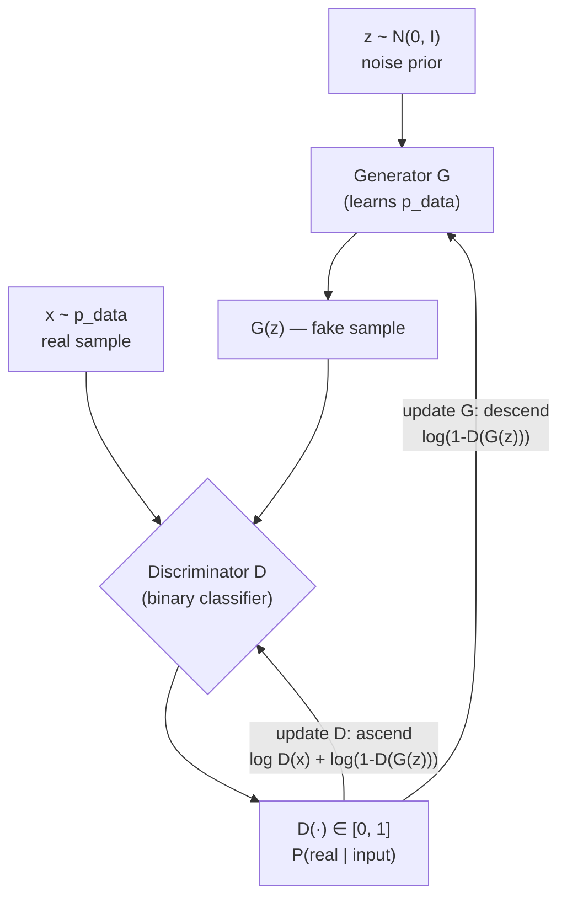

# Image Generation — GANs

## Learning Objectives

- Trace the minimax game between generator and discriminator to its Nash equilibrium where p_model converges to p_data
- Implement a minimal GAN in PyTorch that converges on a 2D mixture-of-Gaussians distribution
- Diagnose the three canonical GAN pathologies — mode collapse, vanishing gradients, oscillatory training — from loss curves and discriminator accuracy
- Compare standard minimax loss against the non-saturating reformulation and state why the latter preserves generator gradients early in training
- Evaluate when a single-forward-pass generator is the right architectural choice over diffusion for latency-constrained generation

## The Problem

Classification maps images to labels. Generation inverts the problem: produce new images drawn from the same distribution as your training data. There is no ground-truth output to diff against — no pixel-by-pixel target. There is only a distribution you want to mimic, and you cannot write down its density function.

Standard supervised losses cannot measure "does this sample look like it came from the real distribution." Minimizing per-pixel error between a generated image and the nearest training image produces blurry averages — the mean of a multimodal distribution sits in a low-density valley between modes. You need a loss that penalizes distributional mismatch, not pointwise distance. Kernel-based divergences (MMD) work but require careful kernel selection. Explicit likelihood methods (normalizing flows, autoregressive models) impose architectural constraints — invertibility, causal masking — that limit model capacity.

Ian Goodfellow's 2014 insight was to learn the loss function itself. Train a second network whose sole job is distinguishing real samples from generated ones, then use that network's judgement as the generator's training signal. This adversarial framing sidesteps explicit density estimation entirely: the generator never computes p_data, it just gets pushed toward it by a critic that gets harder to fool over time. By 2018, StyleGAN was producing 1024×1024 faces indistinguishable from photographs. Diffusion models have since taken the throne on image quality and controllability, but the adversarial training mechanism underpins enough downstream architectures — anomaly detection via reconstruction error, domain adaptation via adversarial feature alignment, synthetic data generation for minority class augmentation — that skipping it leaves gaps in everything that follows.

## The Concept

### The minimax game

A generator *G* maps random noise *z* drawn from a simple prior *p(z)* — typically a standard Gaussian — to synthetic samples *G(z)*. A discriminator *D* receives either a real sample *x* drawn from the data distribution *p_data*, or a fake sample *G(z)*, and outputs the probability that its input is real. *G* wants to maximize *D*'s error rate. *D* wants to minimize it. The formal value of the game:

```
min_G max_D  E_{x~p_data}[log D(x)] + E_{z~p_z}[log(1 - D(G(z)))]
```

At the Nash equilibrium, *G* has perfectly matched *p_data* and *D* cannot do better than random guessing — *D(x) = 0.5* for all inputs. This is the theoretical target. In practice, neither network reaches it cleanly.



### The non-saturating reformulation

Early in training, *G* produces garbage. *D* classifies it as fake with near-certainty — *D(G(z)) ≈ 0*. The generator's gradient is then ∇_G log(1 - D(G(z))), which saturates to zero when *D* is confident. The generator receives no usable signal and cannot improve. Goodfellow's fix: instead of minimizing log(1 - D(G(z))), maximize log(D(G(z))). This is the non-saturating loss. It provides strong gradients when *D* is confidently wrong — exactly when the generator needs the most correction. It changes the game theory slightly (no longer a pure minimax), but it works dramatically better in practice.

### Pathologies and why they happen

**Mode collapse** occurs when *G* finds a single output that fools *D* and maps every *z* to that same output (or a tiny cluster of them). The generator has found a local optimum in the zero-sum game that covers one mode of *p_data* and ignores the rest. **Vanishing gradients** happen when *D* becomes too strong — it classifies fakes with near-perfect accuracy, and the generator's loss landscape flattens. **Oscillatory training** is when *G* and *D* chase each other without either converging: *G* exploits a weakness in *D*, *D* patches it, *G* finds a new exploit, indefinitely. Solutions like WGAN (replace Jensen-Shannon divergence with Wasserstein distance), LSGAN (replace binary cross-entropy with least-squares), and spectral normalization (constrain *D*'s Lipschitz constant) each target a specific failure mode. The mechanism matters more than the specific fix: if you understand which pathology you're seeing, you know which lever to pull.

## Build It

A full DCGAN on image data requires a GPU and 30+ minutes. The mechanism is identical on a 2D distribution, and it trains in seconds on a laptop CPU. We build a GAN on a mixture of three Gaussians — the same distribution that makes mode collapse visible (if *G* collapses, it covers one of the three clusters and ignores the other two).

The generator and discriminator are both small MLPs. We use the non-saturating generator loss (maximizing log D(G(z)) rather than minimizing log(1 - D(G(z)))) because the saturating formulation produces zero gradients for the first few hundred steps on this dataset. Adam with β₁ = 0.5 is standard for GANs — the default 0.9 causes momentum to carry past narrow loss valleys.

```python
import torch
import torch.nn as nn
import torch.optim as optim

torch.manual_seed(42)

def sample_real(n):
    centers = torch.tensor([[2.0, 2.0], [-2.0, 2.0], [0.0, -2.0]])
    idx = torch.randint(0, 3, (n,))
    noise = torch.randn(n, 2) * 0.3
    return centers[idx] + noise

G = nn.Sequential(
    nn.Linear(2, 64), nn.ReLU(),
    nn.Linear(64, 64), nn.ReLU(),
    nn.Linear(2, 2)
)

D = nn.Sequential(
    nn.Linear(2, 64), nn.LeakyReLU(0.2),
    nn.Linear(64, 64), nn.LeakyReLU(0.2),
    nn.Linear(2, 1), nn.Sigmoid()
)

optG = optim.Adam(G.parameters(), lr=0.001, betas=(0.5, 0.999))
optD = optim.Adam(D.parameters(), lr=0.001, betas=(0.5, 0.999))
bce = nn.BCELoss()

batch = 256
epochs = 3000

for epoch in range(epochs):
    real = sample_real(batch)
    z = torch.randn(batch, 2)
    fake_detached = G(z).detach()

    optD.zero_grad()
    d_real = D(real)
    d_fake = D(fake_detached)
    lossD = bce(d_real, torch.ones(batch, 1)) + bce(d_fake, torch.zeros(batch, 1))
    lossD.backward()
    optD.step()

    optG.zero_grad()
    z = torch.randn(batch, 2)
    fake = G(z)
    d_fake_for_g = D(fake)
    lossG = bce(d_fake_for_g, torch.ones(batch, 1))
    lossG.backward()
    optG.step()

    if epoch % 500 == 0 or epoch == epochs - 1:
        with torch.no_grad():
            test_fake = G(torch.randn(batch, 2))
            real_acc = (D(real) > 0.5).float().mean().item()
            fake_acc = (D(test_fake) < 0.5).float().mean().item()
            d_acc = (real_acc + fake_acc) / 2
        print(f"Epoch {epoch:4d} | D_loss: {lossD.item():.4f} | G_loss: {lossG.item():.4f} | D_acc: {d_acc:.3f}")

with torch.no_grad():
    gen = G(torch.randn(2000, 2))
    rls = sample_real(2000)
    print(f"\nGenerated stats: mean=({gen[:,0].mean():.3f}, {gen[:,1].mean():.3f})  std=({gen[:,0].std():.3f}, {gen[:,1].std():.3f})")
    print(f"Real stats:      mean=({rls[:,0].mean():.3f}, {rls[:,1].mean():.3f})  std=({rls[:,0].std():.3f}, {rls[:,1].std():.3f})")
    print(f"\nGenerated x-range: {gen[:,0].min():.2f} to {gen[:,0].max():.2f}  (real: {rls[:,0].min():.2f} to {rls[:,0].max():.2f})")
    print(f"Generated y-range: {gen[:,1].min():.2f} to {gen[:,1].max():.2f}  (real: {rls[:,1].min():.2f} to {rls[:,1].max():.2f})")
```

Run this. At epoch 0, *D*'s accuracy should be near 0.5 (it has not learned yet). By epoch 500–1000, *D* accuracy typically spikes to 0.7–0.9 as it learns to distinguish real from fake. By epoch 2500–3000, if training is healthy, *D* accuracy drifts back toward 0.5 — the generator has gotten good enough that the discriminator can barely tell the difference. The generated sample statistics should approach the real statistics: mean near (0, 0.67), x-range roughly -3 to 3, y-range roughly -3 to 3. If the generated x-range is narrow (say -1 to 1), you are seeing mode collapse — the generator found one or two clusters and ignored the rest.

The key diagnostic is the discriminator accuracy at epoch 2999. If it is above 0.9, the discriminator won — the generator stopped receiving useful gradients. If it is near 0.5 and the generated sample ranges match the real ranges, training converged. If it bounces between 0.5 and 0.9 every 500 epochs, training is oscillating.

## Use It

The direct mechanism transfer for GANs in a GTM context is **synthetic data augmentation within data pipelines** — the same pipeline pattern used in enrichment waterfalls. An enrichment waterfall in Clay cascades through data providers to fill missing fields: Find → Enrich → Transform → Export. A conditional GAN (cGAN) performs the same gap-filling role when the gap is *not enough labeled training examples* rather than *not enough firmographic data*. The cGAN conditions the generator on a class label *y*, so *G(z, y)* produces a synthetic sample belonging to class *y*. You then mix generated samples into your training set to bulk up minority classes before feeding the augmented dataset into a downstream classifier.

The specific scenario: your GTM team has labeled 200 examples of "high-intent support tickets" and 5,000 examples of "low-intent." A classifier trained on this imbalance will be biased toward the majority class. Oversampling by duplication teaches the model to memorize, not generalize. A cGAN trained on the 200 high-intent examples learns their distribution and manufactures new, diverse samples that fill out the minority class without duplication. This is a data pipeline operation — Transform step — and it slots into the same enrichment waterfall architecture: your data source feeds the cGAN, the cGAN generates synthetic samples, the augmented dataset feeds the classifier, the classifier outputs intent scores.

The honest qualifier: GANs are not the default production choice for image generation in 2024 — diffusion models hold that slot. If your pipeline needs more *images*, use a diffusion model or an API. The niche where GANs still win is **real-time single-sample generation latency**. A trained generator produces one sample in a single forward pass (milliseconds on GPU). A diffusion model requires 20–1000 denoising steps per sample. If your GTM application needs on-the-fly personalized creative generation with sub-100ms latency — dynamic ad creative, real-time avatar generation in a sales