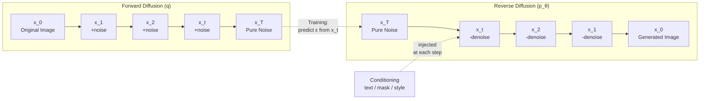

# Image Generation — Diffusion Models

## Learning Objectives

- Implement a forward diffusion process on an image tensor and compute the Signal-to-Noise Ratio at each timestep
- Derive the closed-form noising distribution `q(x_t | x_0)` from the iterative Markov chain, and explain why it eliminates the need to simulate every intermediate step
- Compare DDPM (stochastic) and DDIM (deterministic) sampling strategies by generation speed and sample quality tradeoffs
- Call a hosted Stable Diffusion API endpoint, parameterize the prompt with structured data, and validate the returned image before writing it to disk
- Explain why latent diffusion reduces inference cost relative to pixel-space diffusion, grounded in the dimensionality reduction from the VAE encoder

## The Problem

GANs generate one-shot: noise in, image out, one forward pass. They are fast and hard to train. The discriminator and generator play a minimax game that is notoriously sensitive to hyperparameters, architecture choices, and random seed. Mode collapse — where the generator finds a few outputs that fool the discriminator and produces nothing else — is a persistent failure mode. Training a GAN that produces diverse, high-quality images is a craft learned over months of failed runs.

Diffusion models generate iteratively: start from pure noise, denoise in small steps, image emerges over hundreds or thousands of passes. They are slow and comparatively easy to train. The training objective is a simple regression — predict the noise added to an image at a given timestep. No adversarial game, no mode collapse, no delicate balance to maintain between two networks. Any team with a GPU can train a diffusion model and get reasonable samples within a few days.

Beyond training stability, diffusion's iterative structure is what unlocks everything modern image generation does: text conditioning, inpainting, image editing, super-resolution, controllable style. Each step of the sampling loop is a place to inject a new constraint. That hook is why Stable Diffusion, Imagen, DALL-E 3, Midjourney, and every controllable image model you will encounter are all diffusion-based. The iterative loop is not a drawback — it is the architecture's core advantage, because it gives you hundreds of decision points where you can steer generation toward a target.

## The Concept

Forward diffusion corrupts data by adding Gaussian noise over $T$ timesteps. At each step, a small amount of noise is added: $x_t = \sqrt{1 - \beta_t}\, x_{t-1} + \sqrt{\beta_t}\, \epsilon$, where $\epsilon \sim \mathcal{N}(0, I)$ and $\beta_t$ is a small variance schedule (typically $\beta$ ranges from $0.0001$ to $0.02$). After $T$ steps (commonly 1000), the image is indistinguishable from pure Gaussian noise. The forward process is a Markov chain — each step depends only on the previous one.

The key mathematical insight is that the forward process has a closed-form solution for any timestep $t$ without simulating all intermediate steps. Using the cumulative product $\bar{\alpha}_t = \prod_{s=1}^{t} (1 - \beta_s)$, we can jump directly from $x_0$ to $x_t$:

$$q(x_t | x_0) = \mathcal{N}\left(\sqrt{\bar{\alpha}_t}\, x_0,\; (1 - \bar{\alpha}_t) I\right)$$

This means $x_t = \sqrt{\bar{\alpha}_t}\, x_0 + \sqrt{1 - \bar{\alpha}_t}\, \epsilon$ for any $t$ in one shot. Training becomes: sample an image, sample a random timestep $t$, sample noise $\epsilon$, compute $x_t$ via the closed form, and train a neural network (typically a U-Net) to predict $\epsilon$ from $x_t$ and $t$. The loss is simple MSE between predicted and actual noise.

Reverse diffusion starts from $x_T \sim \mathcal{N}(0, I)$ and iteratively subtracts predicted noise. At each step, the model predicts the noise in $x_t$, and we take a step toward $x_{t-1}$:

$$x_{t-1} = \frac{1}{\sqrt{1 - \beta_t}} \left( x_t - \frac{\beta_t}{\sqrt{1 - \bar{\alpha}_t}} \epsilon_\theta(x_t, t) \right) + \sigma_t z$$

where $z \sim \mathcal{N}(0, I)$ and $\sigma_t$ is a step-dependent noise term. In DDPM sampling, $z$ is nonzero — each step adds fresh randomness. In DDIM sampling, $z$ is set to zero (or scaled), producing a deterministic mapping from noise to image that takes fewer steps to reach the same output quality.



Latent diffusion (Stable Diffusion) compresses this entire loop into a lower-dimensional latent space. The insight: most pixels in a $512 \times 512 \times 3$ image carry redundant spatial information. A variational autoencoder (VAE) encodes the image into a $64 \times 64 \times 4$ latent tensor — a 48x reduction in dimensionality. The diffusion process runs on the latent tensor, not on pixels. The U-Net predicts noise in latent space, and after sampling completes, the VAE decoder maps the final latent back to pixel space. This is why Stable Diffusion can run on consumer GPUs while pixel-space diffusion models (like the original DDPM paper) required impractical compute.

The Signal-to-Noise Ratio (SNR) at timestep $t$ is $\text{SNR}(t) = \bar{\alpha}_t / (1 - \bar{\alpha}_t)$. At $t = 0$, SNR is infinite (no noise). At $t = T$, SNR approaches zero (pure noise). The noise schedule — the shape of $\beta_t$ over time — controls how quickly SNR degrades, which in turn affects how much fine detail the model can recover during sampling.

## Build It

Build the forward diffusion pipeline first. This script creates a synthetic image, applies a linear noise schedule over 1000 timesteps, and prints SNR at key checkpoints. You will observe how quickly structure disappears into noise.

```python
import torch
import torch.nn.functional as F
import math

torch.manual_seed(42)

channels, height, width = 3, 32, 32
image = torch.rand(channels, height, width)

T = 1000
beta_start = 0.0001
beta_end = 0.02
betas = torch.linspace(beta_start, beta_end, T)
alphas = 1.0 - betas
alphas_cumprod = torch.cumprod(alphas, dim=0)

def forward_diffusion(x_0, t, alphas_cumprod):
    sqrt_alpha_bar = torch.sqrt(alphas_cumprod[t])
    sqrt_one_minus_alpha_bar = torch.sqrt(1.0 - alphas_cumprod[t])
    epsilon = torch.randn_like(x_0)
    x_t = sqrt_alpha_bar * x_0 + sqrt_one_minus_alpha_bar * epsilon
    return x_t, epsilon

def snr_at_t(t, alphas_cumprod):
    return alphas_cumprod[t].item() / (1.0 - alphas_cumprod[t].item())

checkpoints = [0, 10, 50, 100, 250, 500, 750, 999]
print("=== Forward Diffusion Noise Schedule ===")
print(f"T={T}, beta_start={beta_start}, beta_end={beta_end}")
print(f"Image shape: {image.shape}")
print()
print(f"{'Timestep':>10} {'alpha_bar':>12} {'SNR':>12} {'Pixel std':>12}")
print("-" * 50)

for t in checkpoints:
    x_t, eps = forward_diffusion(image, t, alphas_cumprod)
    pixel_std = x_t.std().item()
    snr = snr_at_t(t, alphas_cumprod)
    print(f"{t:>10} {alphas_cumprod[t].item():>12.6f} {snr:>12.4f} {pixel_std:>12.6f}")

x_999, _ = forward_diffusion(image, 999, alphas_cumprod)
print()
print(f"x_0 mean: {image.mean().item():.4f}, std: {image.std().item():.4f}")
print(f"x_999 mean: {x_999.mean().item():.4f}, std: {x_999.std().item():.4f}")
print(f"x_999 vs pure noise mean diff: {abs(x_999.mean().item() - torch.randn(1000).mean().item()):.4f}")
```

Run it. You will see SNR drop from effectively infinite at $t=0$ to near-zero by $t=500$. By $t=999$, the pixel statistics are indistinguishable from $\mathcal{N}(0, 1)$.

Now call a hosted Stable Diffusion endpoint. This script uses the Stability AI REST API, sends a text prompt, and saves the result. It prints the full API response metadata so you can inspect what the service returns.

```python
import requests
import json
import base64
import sys
import os

api_key = os.environ.get("STABILITY_API_KEY", "YOUR_API_KEY_HERE")
if api_key == "YOUR_API_KEY_HERE":
    print("Set STABILITY_API_KEY environment variable")
    print("export STABILITY_API_KEY='sk-...'")
    sys.exit(1)

url = "https://api.stability.ai/v1/generation/stable-diffusion-v1-6/text-to-image"

headers = {
    "Accept": "application/json",
    "Authorization": f"Bearer {api_key}",
    "Content-Type": "application/json",
}

payload = {
    "text_prompts": [
        {
            "text": "a data pipeline flowing into a funnel, isometric 3D illustration, corporate blue palette, clean vector style",
            "weight": 1.0
        }
    ],
    "cfg_scale": 7,
    "height": 512,
    "width": 512,
    "samples": 1,
    "steps": 30,
    "seed": 42,
    "style_preset": "digital-art",
}

print("=== Stable Diffusion API Call ===")
print(f"Endpoint: {url}")
print(f"Prompt: {payload['text_prompts'][0]['text']}")
print(f"Steps: {payload['steps']}, CFG: {payload['cfg_scale']}, Seed: {payload['seed']}")
print()

response = requests.post(url, headers=headers, json=payload)

if response.status_code != 200:
    print(f"Error {response.status_code}: {response.text}")
    sys.exit(1)

data = response.json()
print("=== Response Metadata ===")
print(json.dumps({k: v for k, v in data.items() if k != "artifacts"}, indent=2))
print()
print(f"Generated {len(data['artifacts'])} image(s)")

for i, artifact in enumerate(data["artifacts"]):
    print(f"\nImage {i}:")
    print(f"  Base64 length: {len(artifact['base64'])} chars")
    print(f"  Finish reason: {artifact.get('finishReason', 'N/A')}")
    print(f"  Seed: {artifact.get('seed', 'N/A')}")

    img_data = base64.b64decode(artifact["base64"])
    filename = f"generated_{artifact.get('seed', i)}.png"
    with open(filename, "wb") as f:
        f.write(img_data)
    print(f"  Saved to: {os.path.abspath(filename)}")
    print(f"  File size: {len(img_data)} bytes")
```

Both scripts run from the terminal. The first requires only PyTorch. The second requires `requests` and a Stability AI API key.

## Use It

Diffusion-based image generation is the transform step in the enrichment waterfall — the layer that converts structured firmographic data into a creative asset. In a Clay waterfall, the pipeline runs Find → Enrich → Transform → Export. Image generation sits in the Transform stage: it takes enriched account data (company name, industry, size, tech stack) and produces a unique visual asset for each account. This is the Content Personalization cluster, and the mechanism is straightforward — the text prompt is parameterized with data from earlier waterfall stages, so each account receives a unique image that references something specific about their business.

Consider a batch of 50 target accounts. Each row in your spreadsheet has `company_name`, `industry`, and `homepage_url`. You construct a prompt template: `"a modern hero illustration for {company_name}, a {industry} company, abstract geometric style, {brand_color} palette"`. The generation API returns a unique image per account. Those images feed into your outreach tool — personalized email headers, LinkedIn post graphics, or landing page hero images. The batch operation is just a loop over the rows, one API call per row, with the prompt filled from enrichment columns. [CITATION NEEDED — concept: conversion rates for personalized images in outbound campaigns]

The critical design decision is prompt structure. A good prompt template has two parts: a fixed style anchor (the visual language your brand uses) and variable slots (the account-specific data). The style anchor ensures visual consistency across the batch. The variable slots ensure each image is recognizably different and relevant. A prompt like `"a data pipeline flowing into a funnel, isometric 3D illustration, corporate blue palette, clean vector style"` is a fixed style anchor. Adding `{industry} workflow diagram, {brand_color} accents` to that anchor parameterizes it. This is the same Find → Enrich → Transform → Export pattern the Clay waterfall uses for text personalization, applied to the image generation layer.

Rate limiting matters here. A batch of 50 images at 30 steps each takes roughly 50 API calls. If your plan allows 150 requests per minute, that batch completes in one sequential run. For 500 accounts, you need either a queue with backoff or a higher tier. The generation call is the bottleneck — everything else (reading the spreadsheet, constructing prompts, saving files) is negligible by comparison.

## Ship It

Wrapping the generation call in a production loop means handling three failure modes: API errors (rate limits, server errors, malformed prompts), content safety rejections (the prompt triggered a safety filter), and output validation (the returned image has wrong dimensions or is corrupt). The retry-and-validate loop below handles all three.

```python
import requests
import base64
import json
import time
import os
import csv
from pathlib import Path

API_KEY = os.environ.get("STABILITY_API_KEY", "YOUR_API_KEY_HERE")
API_URL = "https://api.stability.ai/v1/generation/stable-diffusion-v1-6/text-to-image"
OUTPUT_DIR = Path("generated_assets")
LOG_DIR = Path("generation_logs")
OUTPUT_DIR.mkdir(exist_ok=True)
LOG_DIR.mkdir(exist_ok=True)

MAX_RETRIES = 3
EXPECTED_SIZE = 512
RATE_LIMIT_DELAY = 1.5

def generate_with_retry(prompt, seed=42, max_retries=MAX_RETRIES):
    headers = {
        "Accept": "application/json",
        "Authorization": f"Bearer {API_KEY}",
    }
    payload = {
        "text_prompts": [{"text": prompt, "weight": 1.0}],
        "cfg_scale": 7,
        "height": EXPECTED_SIZE,
        "width": EXPECTED_SIZE,
        "samples": 1,
        "steps": 30,
        "seed": seed,
    }

    for attempt in range(max_retries):
        try:
            response = requests.post(API_URL, headers=headers, json=payload, timeout=60)

            if response.status_code == 429:
                wait = 2 ** attempt * RATE_LIMIT_DELAY
                print(f"  Rate limited. Waiting {wait:.1f}s (attempt {attempt + 1})")
                time.sleep(wait)
                continue

            if response.status_code >= 500:
                print(f"  Server error {response.status_code}. Retrying (attempt {attempt + 1})")
                time.sleep(RATE_LIMIT_DELAY)
                continue

            if response.status_code != 200:
                print(f"  API error {response.status_code}: {response.text[:200]}")
                return None

            data = response.json()
            artifact = data["artifacts"][0]

            if artifact.get("finishReason") != "SUCCESS":
                print(f"  Content filter triggered: {artifact.get('finishReason')}")
                return None

            img_bytes = base64.b64decode(artifact["base64"])
            if len(img_bytes) < 1000:
                print(f"  Output too small ({len(img_bytes)} bytes). Likely corrupt.")
                return None

            return {
                "image": img_bytes,
                "seed": artifact.get("seed", seed),
                "finish_reason": artifact.get("finishReason"),
            }

        except requests.exceptions.RequestException as e:
            print(f"  Request failed: {e}. Retrying (attempt {attempt + 1})")
            time.sleep(RATE_LIMIT_DELAY)

    print(f"  Exhausted {max_retries} retries")
    return None

accounts = [
    {"company": "Acme Logistics", "industry": "supply chain", "color": "blue"},
    {"company": "Globex Health", "industry": "healthcare", "color": "teal"},
    {"company": "Initech Finance", "industry": "fintech", "color": "navy"},
]

log_entries = []

for account in accounts:
    company = account["company"]
    prompt = (
        f"a modern hero illustration for {company}, a {account['industry']} company, "
        f"isometric 3D style, {account['color']} color palette, clean vector aesthetic"
    )

    print(f"Processing: {company}")
    result = generate_with_retry(prompt, seed=hash(company) % 2**31)

    if result:
        filename = f"{company.lower().replace(' ', '_')}_{result['seed']}.png"
        filepath = OUTPUT_DIR / filename
        filepath.write_bytes(result["image"])

        log_entries.append({
            "company": company,
            "prompt": prompt,
            "seed": result["seed"],
            "finish_reason": result["finish_reason"],
            "file": str(filepath),
            "file_size": len(result["image"]),
            "status": "success",
        })
        print(f"  Saved: {filepath} ({len(result['image'])} bytes)")
    else:
        log_entries.append({
            "company": company,
            "prompt": prompt,
            "seed": "N/A",
            "finish_reason": "FAILED",
            "file": "N/A",
            "file_size": 0,
            "status": "failed",
        })
        print(f"  FAILED for {company}")

    time.sleep(RATE_LIMIT_DELAY)

log_path = LOG_DIR / "generation_log.json"
with open(log_path, "w") as f:
    json.dump(log_entries, f, indent=2)

print(f"\nLog written to: {log_path}")
print(f"Successful: {sum(1 for e in log_entries if e['status'] == 'success')}/{len(log_entries)}")
```

Every generation is logged with the prompt, seed, and output metadata. The seed is the critical field — without it, you cannot reproduce a specific image. If a stakeholder asks why a particular asset looks the way it does, the log tells you the exact prompt and seed that produced it. The content safety check (`finishReason != "SUCCESS"`) catches filtered prompts before you write a broken or placeholder image to your asset store. The file size check catches truncated responses that would otherwise silently corrupt your pipeline.

## Exercises

**Easy:** Given the output of the forward diffusion script, which timestep has the highest Signal-to-Noise Ratio? Modify the script to print SNR at every 100th timestep (0, 100, 200, ..., 900) and verify that SNR monotonically decreases. At what timestep does SNR drop below 1.0?

**Medium:** Change `beta_end` from 0.02 to 0.05 in the forward diffusion script. Predict whether this will make the noise schedule more aggressive (faster corruption) or less aggressive. Run it and compare the SNR values at $t = 250$ and $t = 500$ between the two schedules. Write one sentence explaining the effect on fine detail recovery during sampling — a steeper schedule means the model spends fewer timesteps in the high-SNR regime where fine structure is recoverable.

**Hard:** Write a 3–5 sentence explanation of why latent diffusion is faster than pixel-space diffusion. Ground your answer in the dimensionality reduction from the VAE encoder: a $512 \times 512 \times 3$ image is 786,432 values, while the corresponding latent is $64 \times 64 \times 4 = 16,384$ values — a 48x reduction. Each denoising step processes this smaller tensor through the U-Net, so the per-step compute drops proportionally. Reference the Mermaid diagram and the closed-form equation to explain why the same number of diffusion steps produces the same quality output at lower cost.

## Key Terms

- **Forward diffusion:** The process of adding Gaussian noise to an image over $T$ timesteps until it becomes pure noise. Defined by the variance schedule $\beta_t$.
- **Reverse diffusion:** The process of iteratively removing predicted noise from $x_T$ to recover $x_0$. Implemented by a trained U-Net.
- **Noise schedule:** The sequence $\beta_1, \ldots, \beta_T$ that controls how much noise is added per step. Linear schedules are standard; cosine schedules provide smoother SNR degradation.
- **SNR (Signal-to-Noise Ratio):** The ratio $\bar{\alpha}_t / (1 - \bar{\alpha}_t)$ at timestep $t$. Infinite at $t=0$, approaches zero at $t=T$.
- **Latent diffusion:** Running the diffusion process in the compressed latent space of a VAE rather than in pixel space. Reduces per-step compute by ~48x for $512 \times 512$ images.
- **DDPM (Denoising Diffusion Probabilistic Models):** The original stochastic sampler that adds fresh noise at each reverse step. Requires ~1000 steps for high-quality samples.
- **DDIM (Denoising Diffusion Implicit Models):** A deterministic variant that skips the stochastic noise injection, enabling 10–50 step sampling with comparable quality.
- **CFG (Classifier-Free Guidance):** A technique that amplifies the prompt's influence on generation by extrapolating between conditional and unconditional predictions. Controlled by the `cfg_scale` parameter.
- **VAE (Variational Autoencoder):** The encoder-decoder pair that maps between pixel space and latent space in Stable Diffusion.

## Sources

- Ho, Jain, Abbeel (2020). "Denoising Diffusion Probabilistic Models." arXiv:2006.11239 — original DDPM paper, forward/reverse process formulation, training objective.
- Song et al. (2021). "Denoising Diffusion Implicit Models." arXiv:2010.02502 — DDIM sampling, deterministic reverse process, fewer-step generation.
- Rombach et al. (2022). "High-Resolution Image Synthesis with Latent Diffusion Models." arXiv:2112.10752 — Stable Diffusion / latent diffusion architecture, VAE compression ratio.
- Stability AI API documentation: https://platform.stability.ai/docs/api-reference — endpoint structure, response format, content safety flags.
- [CITATION NEEDED — concept: conversion rate impact of personalized images in outbound email/LinkedIn campaigns]