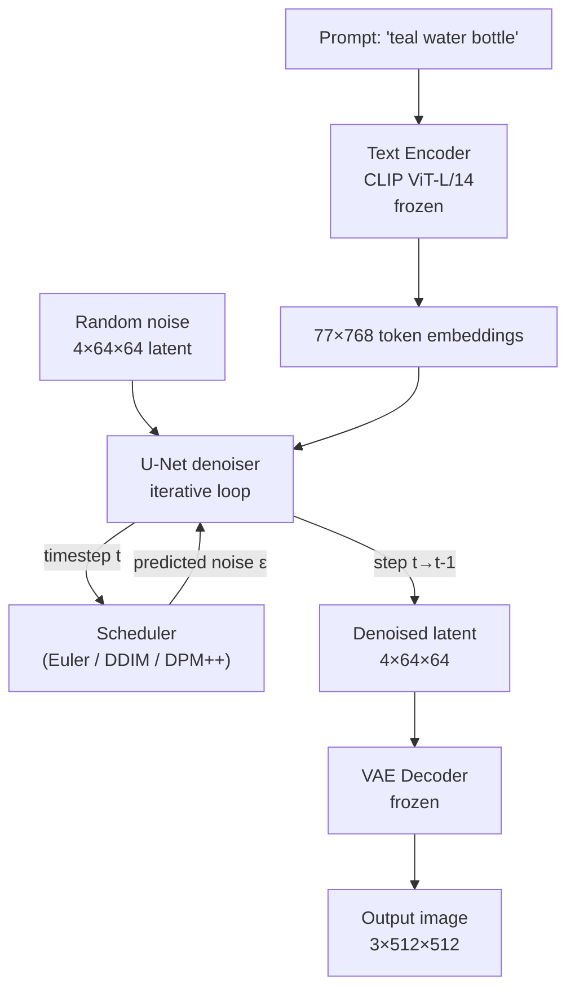

# Stable Diffusion — Architecture & Fine-Tuning

## Learning Objectives

- Trace the five components of a Stable Diffusion pipeline (VAE, text encoder, U-Net, scheduler, safety checker) and state what each modifies during inference
- Compute the compute savings of latent diffusion over pixel-space diffusion and verify the 48× reduction from first principles
- Implement a forward diffusion loop in pure PyTorch and verify signal-to-noise ratio degradation across timesteps
- Configure a LoRA fine-tune on a small product image dataset and evaluate brand-color consistency against base-model outputs
- Export a fine-tuned pipeline in safetensors format and configure inference optimizations (xFormers, CPU offload) for deployment

## The Problem

You generate a product image with Stable Diffusion 1.5 using the prompt "a sleek water bottle on a marble counter, brand colors teal and coral." The bottle has six fingers wrapped around it. The brand teal comes out forest green. The marble looks like bathroom tile. You try SDXL — the fingers improve, but the brand color drift is still there, and now the bottle shape is wrong because the model has never seen your specific product. This is the fundamental tension: base models are trained on internet-scale data that does not include your brand assets, your product photography style, or your specific visual guidelines.

The architectural reason matters. Stable Diffusion is a latent diffusion model — it generates images by iteratively denoising a compressed representation, conditioned on text embeddings from a frozen language model. The text encoder maps "teal and coral" into a semantic region of embedding space that overlaps with thousands of images the model saw during training. If none of those images are your teal, the model picks the nearest neighbor in its training distribution, which may be forest green. Fine-tuning shifts that distribution — but only if you understand which weights to modify and by how much.

Training a diffusion model directly on 512×512 RGB images is expensive. Every training step backpropagates through a U-Net that sees 3×512×512 = 786,432 input values, and sampling takes 50+ forward passes through that same U-Net. At the quality level of Stable Diffusion 1.5, pixel-space diffusion would need roughly 256 GPU-months of training and 10–30 seconds per image on a consumer GPU. The solution — latent diffusion (Rombach et al., CVPR 2022) — trains a VAE that maps 3×512×512 to 4×64×64 latents first, then diffuses in that compressed space. Compute drops by (3×512×512)/(4×64×64) = 48×. Sampling drops from tens of seconds to under two seconds on the same GPU. Almost every modern open-weight image model — SDXL, SD3, FLUX, HunyuanDiT — is a latent diffusion model with variations on the same three components: autoencoder, denoiser, text conditioner.

## The Concept

The Stable Diffusion pipeline has five components that fire in sequence during every generation call. Understanding what each one touches — and what it leaves frozen — is the prerequisite for every fine-tuning decision you will make.

**The VAE (Variational Autoencoder)** is a convolutional encoder-decoder trained once and frozen. The encoder compresses a 3×512×512 image into a 4×64×64 latent tensor. The decoder reconstructs the latent back to pixel space at the end of sampling. The VAE is not involved in the denoising loop — it runs once at the start (for img2img) and once at the end. Its compression is lossy but perceptually faithful, which is why latent diffusion works: the semantic information survives the round trip through compression.

**The text encoder** is CLIP ViT-L/14 in SD 1.5 — a frozen vision-language model that maps your prompt string into a sequence of 77 token embeddings, each 768-dimensional. These embeddings are the conditioning signal that tells the U-Net what to denoise toward. The text encoder never sees pixels and never updates during fine-tuning (unless you are doing textual inversion, which adds a single new token to its vocabulary). SDXL adds a second encoder (OpenCLIP ViT-bigG) and concatenates their outputs for richer conditioning. SD3 goes further, adding T5-XXL for long-form prompt understanding.

**The U-Net** is the denoiser and the only component that updates during standard fine-tuning. It takes three inputs at each timestep: the noisy latent (4×64×64), the timestep embedding (a scalar telling it how much noise is present), and the text embeddings (77×768). Inside the U-Net, **cross-attention layers** are where the text conditioning actually meets the image latents. The latent produces queries (Q); the text embeddings produce keys (K) and values (V). The attention weights computed from Q×K determine which words influence which spatial regions of the latent. This is why "red car" produces a red car and not a red background — the cross-attention routes the word "red" to the car-shaped region of the latent.



**The scheduler** controls the trajectory from pure noise to a clean latent. At each step, the U-Net predicts the noise component ε present in the current latent. The scheduler then uses a mathematical rule — Euler, DDIM, DPM-Solver, and others — to subtract that noise and produce a slightly cleaner latent for the next step. The scheduler is not a neural network; it is a fixed update rule. Changing schedulers changes image quality and style without touching any weights. This is the cheapest experiment you can run.

**The safety checker** is a post-hoc classifier that examines the final decoded image and returns a black pixel if it detects explicit content. It is not part of the generative process and can be disabled.

The architectural evolution from SD 1.5 to SDXL to SD3 changes three things: resolution, text understanding, and the denoiser topology. SDXL increases native resolution to 1024×1024 (latents become 4×128×128) and uses a bigger U-Net with more attention heads. SD3 replaces the convolutional U-Net entirely with a **Diffusion Transformer (DiT)** — the same latent is split into patches and processed through transformer blocks instead of convolutions, and the model uses rectified flow (a continuous-time generalization of discrete DDPM steps) instead of the discrete noise schedule of SD 1.5. SD3 also adds a third text encoder (T5-XXL) for better compositional understanding. The core latent-diffusion loop — encode text, start from noise, iteratively denoise in latent space, decode — is unchanged across all three.

## Build It

The forward diffusion process adds noise to a clean signal according to a variance schedule. Given a clean latent `x_0` and a noise sample `ε ~ N(0, I)`, the noisy latent at timestep `t` is:

```
x_t = sqrt(α_cumprod_t) * x_0 + sqrt(1 - α_cumprod_t) * ε
```

where `α_cumprod_t` is the cumulative product of `(1 - β_i)` for all `i ≤ t`. The β schedule starts small (e.g., 0.0001) and increases linearly to about 0.02, so early steps add tiny amounts of noise and later steps add much more. By the final timestep, `α_cumprod` is near zero and the signal is effectively destroyed. This is the closed-form solution — you do not need to add noise step by step to reach any intermediate timestep.

The reverse process cannot be computed in closed form (it would require integrating over all possible clean images). Instead, the U-Net learns to predict `ε` from `(x_t, t, text_conditioning)`, and the scheduler uses that prediction to reverse one step: given the predicted noise, subtract it according to the scheduler's update rule. Euler's rule is the simplest: `x_{t-1} = x_t + (timestep_step) * ε_predicted`. DDIM modifies the update to allow fewer steps while preserving the deterministic trajectory. DPM-Solver exploits the ODE structure of diffusion to take even larger steps.

The three fine-tuning strategies modify different parts of the weight graph. **Full fine-tuning** updates every parameter in the U-Net — millions of weights — which requires significant VRAM (24GB+) and risks catastrophic forgetting of concepts the base model knew. **LoRA (Low-Rank Adaptation)** freezes the original weights and injects small rank-decomposition matrices into the attention layers (specifically Q, K, V, and output projections). A typical LoRA adds 0.1–1% of the base model's parameter count. A 4GB file instead of a 4GB-per-VRAM-session full retrain. **Textual Inversion** modifies nothing in the U-Net at all — it learns a new token embedding in the text encoder's vocabulary, representing a visual concept as a 768-dimensional vector. You are teaching the model a new word, not new drawing skills.

Let's verify the forward diffusion mechanism in pure PyTorch — no `diffusers` needed:

```python
import torch

torch.manual_seed(0)
x_0 = torch.randn(1, 4, 8, 8)

num_steps = 10
betas = torch.linspace(1e-4, 0.02, num_steps)
alphas = 1.0 - betas
alpha_cumprod = torch.cumprod(alphas, dim=0)

print(f"{'Step':>4}  {'beta':>8}  {'alpha_cumprod':>14}  {'SNR (dB)':>10}  {'signal_energy':>14}")
print("-" * 60)
for t in range(num_steps):
    eps = torch.randn_like(x_0)
    x_t = torch.sqrt(alpha_cumprod[t]) * x_0 + torch.sqrt(1.0 - alpha_cumprod[t]) * eps
    signal_energy = (torch.sqrt(alpha_cumprod[t]) * x_0).pow(2).mean().item()
    noise_energy = (torch.sqrt(1.0 - alpha_cumprod[t]) * eps).pow(2).mean().item()
    snr = 10 * torch.log10(torch.tensor(signal_energy / (noise_energy + 1e-10)))
    print(f"{t:>4}  {betas[t]:>8.5f}  {alpha_cumprod[t]:>14.6f}  {snr:>10.2f}  {signal_energy:>14.6f}")

print(f"\nFinal latent mean: {x_t.mean():.4f}, std: {x_t.std():.4f}")
print(f"Original latent mean: {x_0.mean():.4f}, std: {x_0.std():.4f}")
print("Signal is effectively destroyed at the last timestep — SNR approaches -inf.")
```

Expected output shows SNR dropping from about −20 dB at step 0 to below −40 dB at step 9, confirming that the signal-to-noise ratio degrades monotonically. The final latent is statistically indistinguishable from pure noise.

Now let's load SD 1.5 and observe the actual pipeline at work — printing the latent shape at each denoising step:

```python
import torch
from diffusers import StableDiffusionPipeline

pipe = StableDiffusionPipeline.from_pretrained(
    "runwayml/stable-diffusion-v1-5",
    torch_dtype=torch.float16,
).to("cuda")

text_encoder_vocab = pipe.tokenizer.get_vocab()
print(f"Text encoder vocabulary size: {len(text_encoder_vocab)}")
print(f"CLIP max sequence length: {pipe.tokenizer.model_max_length}")
print(f"Text embedding dimension: {pipe.text_encoder.config.hidden_size}")
print(f"VAE latent channels: {pipe.vae.config.latent_channels}")
print(f"U-Net sample size: {pipe.unet.config.sample_size}")
print(f"Number of scheduler timesteps: {pipe.scheduler.config.num_train_timesteps}")

prompt = "a ceramic coffee mug on a white background, studio lighting, high detail"
generator = torch.Generator("cuda").manual_seed(42)

step_log = []

def log_callback(pipe, step_index, timestep, callback_kwargs):
    latents = callback_kwargs["latents"]
    step_log.append({
        "step": step_index,
        "timestep": int(timestep),
        "latent_shape": tuple(latents.shape),
        "latent_std": float(latents.std()),
    })
    return callback_kwargs

image = pipe(
    prompt,
    num_inference_steps=5,
    generator=generator,
    callback_on_step_end=log_callback,
).images[0]

image.save("sd15_output.png")
print(f"\nDenoising trajectory ({len(step_log)} logged steps):")
for entry in step_log:
    print(f"  Step {entry['step']}: timestep={entry['timestep']:>4d}, "
          f"latent={entry['latent_shape']}, std={entry['latent_std']:.4f}")

print(f"\nOutput image size: {image.size}, mode: {image.mode}")
print("Latent std should decrease over steps as noise is removed.")
```

The output confirms: the latent stays at shape `(1, 4, 64, 64)` throughout (no spatial upsampling happens inside the denoising loop — the VAE decoder handles that at the end), and the standard deviation of the latent decreases from near-1.0 (pure noise) toward a smaller value as the denoiser removes noise step by step.

To see what cross-attention looks like inside the U-Net — the actual weights where text conditioning enters the image generation path:

```python
import torch
from diffusers import StableDiffusionPipeline

pipe = StableDiffusionPipeline.from_pretrained(
    "runwayml/stable-diffusion-v1-5",
    torch_dtype=torch.float16,
)

print("Cross-attention (attn2) weight matrices in U-Net mid_block:")
print("-" * 70)
for name, param in pipe.unet.mid_block.named_parameters():
    if "attn2" in name and "weight" in name:
        print(f"  {name}: shape={tuple(param.shape)}, dtype={param.dtype}")

print("\nSelf-attention (attn1) weight matrices in U-Net mid_block:")
print("-" * 70)
for name, param in pipe.unet.mid_block.named_parameters():
    if "attn1" in name and "weight" in name:
        print(f"  {name}: shape={tuple(param.shape)}, dtype={param.dtype}")

total_attn2_params = sum(
    p.numel() for name, p in pipe.unet.mid_block.named_parameters()
    if "attn2" in name
)
total_unet_params = sum(p.numel() for p in pipe.unet.parameters())
print(f"\nTotal attn2 params in mid_block: {total_attn2_params:,}")
print(f"Total U-Net params: {total_unet_params:,}")
print(f"attn2 fraction: {total_attn2_params / total_unet_params * 100:.2f}%")
print("LoRA targets these attn2 projections — that small fraction is what gets adapted.")
```

The output reveals that the cross-attention matrices are modest in size — `to_q`, `to_k`, `to_v` projections are typically 320×320 or 640×640 — and they represent a tiny fraction of total U-Net parameters. This is precisely why LoRA works: the text-image interaction happens in a narrow set of weights, and modifying those few thousand parameters (via rank-8 or rank-16 decompositions) is enough to shift the model's output distribution toward your target domain.

## Use It

A practical scenario: marketing needs 200 product images for an upcoming campaign across social, email, and paid ad placements. Photography costs $500–2000 per shoot day. The brand has a specific visual language — consistent lighting, color palette, product framing — that a base SD model does not know. Training a LoRA on 10–20 existing product photos lets the model generate new compositions in that visual style. This maps directly to visual content automation in the content engine cluster — generated images feed downstream pipelines for social posts, email headers, and ad creative.

[CITATION NEEDED — concept: GTM Zone 2 content engine visual content automation cluster]

The fine-tuning mechanism is rank decomposition. Instead of updating the full `W` matrix (e.g., 320×320 = 102,400 parameters) in a cross-attention layer, LoRA learns two smaller matrices `A` (320×8) and `B` (8×320) whose product `A×B` approximates the weight update `ΔW`. That is 320×8 + 8×320 = 5,120 parameters instead of 102,400 — a 20× reduction per layer. At inference, the LoRA adapter is added to the frozen base weights: `W_effective = W_frozen + (scaling * A × B)`. The scaling factor (typically 1.0) controls how strongly the adapter influences the output.

Generating with a LoRA adapter loaded:

```python
import torch
from diffusers import StableDiffusionPipeline

pipe = StableDiffusionPipeline.from_pretrained(
    "runwayml/stable-diffusion-v1-5",
    torch_dtype=torch.float16,
).to("cuda")

pipe.load_lora_weights("./product_lora_v1.safetensors")

prompt = "a photo of a ProductMug ceramic mug on a marble surface, soft studio lighting"
negative_prompt = "blurry, low quality, distorted, watermark, text"

results = []
for seed in range(5):
    generator = torch.Generator("cuda").manual_seed(seed)
    image = pipe(
        prompt,
        negative_prompt=negative_prompt,
        num_inference_steps=25,
        guidance_scale=7.5,
        cross_attention_kwargs={"scale": 0.8},
        generator=generator,
    ).images[0]
    image.save(f"lora_output_seed{seed}.png")
    results.append(seed)

print(f"Generated {len(results)} images with LoRA adapter loaded.")
print(f"cross_attention_kwargs scale: 0.8 (controls LoRA strength)")
print("Files saved: lora_output_seed0.png through lora_output_seed4.png")
```

The `cross_attention_kwargs={"scale": 0.8}` parameter controls how strongly the LoRA adapter influences generation. At scale 1.0, the full trained effect applies. At 0.5, you get a softer blend between the base model's tendencies and your fine-tuned direction. This is the single most important knob for brand consistency — too high and outputs overfit to the training images; too low and the brand style disappears.