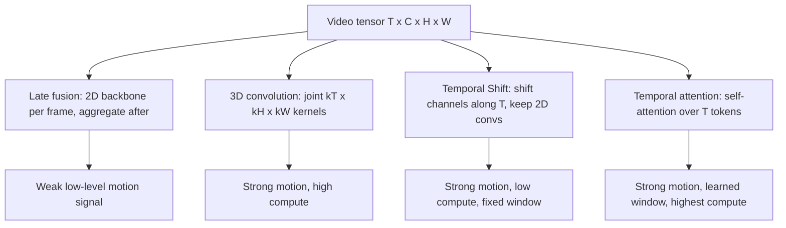

# Video Understanding — Temporal Modeling

## Learning Objectives

By the end of this lesson you will be able to:

1. **Compare** four temporal modeling mechanisms (late fusion, 3D convolution, temporal shift, temporal attention) on the axes of parameters, compute, and motion sensitivity.
2. **Implement** a from-scratch temporal aggregation pipeline that recovers motion signal a per-frame baseline destroys.
3. **Diagnose** why a frame-independent model mislabels motion-dependent events in call-video and demo-video analysis.

## The Problem

You inherit a pipeline that classifies prospect "engagement" from 30-minute discovery-call recordings. The previous owner ran each frame through a ResNet, averaged the per-frame logits, and called it "video understanding." The model reports high engagement on a call where the prospect was clearly multitasking — they happened to glance at the camera every 90 seconds. The average is misleading because engagement is temporal: it lives in *when* attention happens, in *transitions* between attentive and distracted states, and in *reactions* that follow specific phrases.

A per-frame model treats a video as N independent photographs. It cannot answer "did the prospect lean forward after the pricing slide?" because leaning forward is a *difference* between frame *t* and frame *t + Δ*. The information lives in the time axis, and averaging over time erases it.

This is the temporal modeling problem: how do we feed a model the time dimension so that motion, sequence, and state-change become first-class signals instead of things we average away?

## The Concept

A video tensor has shape `(T, C, H, W)` — T frames, C channels (RGB), H × W spatial. Every temporal modeling mechanism is a choice about how to mix information across the T axis.

**Late fusion** runs a 2D backbone on every frame, then combines the frame embeddings (mean pool, RNN, Transformer) *after* spatial features are extracted. Cheap and modular — but the spatial backbone sees one frame at a time, so low-level motion cues (a moving edge, a flicker) never reach it.

**3D convolution** extends the 2D kernel by a third dimension: `(kT, kH, kW)`. One operation now mixes space and time jointly, so the network can learn "vertical edge moving right" as a primitive. Cost: parameters and FLOPs grow with `kT`, and training data requirements spike. C3D and I3D are the canonical instances.

**Temporal Shift Module (TSM)** is the elegant cheat. Take a 2D convolution backbone. Before each block, shift a fraction of channels along the time axis — forward and backward. Zero extra parameters, near-zero extra FLOPs in the conv itself, but each 2D conv now sees neighbors from adjacent frames mixed into its input. You get much of the 3D-conv benefit at 2D-conv cost.

**Temporal attention** (TimeSformer, ViViT) treats video as `T × H × W` tokens and applies self-attention — factored (`space` then `time`, or `time` then `space`) to keep complexity tractable. The attention weights are *learned*, so the model decides which past frames matter for the current frame instead of relying on a fixed kernel window.



There is no free lunch. Late fusion wins on cost and loses on motion. Attention wins on expressiveness and loses on FLOPs. TSM is the practitioner's default when compute is bounded and you cannot retrain a ViViT from scratch.

## Build It

Run this end-to-end with numpy only. It synthesizes a video where a "prospect glance" — a bright block — moves across the frame every 90 frames. The per-frame mean drops the event entirely; the temporal-difference signal recovers it.

```python
import numpy as np

np.random.seed(0)
T, H, W = 270, 32, 32
video = np.random.rand(T, H, W).astype(np.float32) * 0.1

for t in range(0, T, 90):
    r0, c0 = 8, 8 + (t // 90) * 6
    video[t:t + 5, r0:r0 + 8, c0:c0 + 8] += 0.9

per_frame_mean = video.mean(axis=(1, 2))
print("per-frame mean range:", round(float(per_frame_mean.max() - per_frame_mean.min()), 4))

temporal_diff = np.abs(np.diff(video, axis=0)).sum(axis=(1, 2))
peaks = [t for t, v in enumerate(temporal_diff) if v > temporal_diff.mean() * 3]
print("motion-event frames detected:", peaks)

shifted = np.zeros_like(video)
shifted[:, :-1] = video[:, 1:]
tsm_proxy = (video + 0.3 * shifted).mean(axis=(1, 2))
print("TSM-style mean range:", round(float(tsm_proxy.max() - tsm_proxy.min()), 4))

def temporal_attention(signal, k=5):
    out = np.zeros_like(signal)
    for t in range(len(signal)):
        lo, hi = max(0, t - k), min(len(signal), t + k + 1)
        w = np.exp(-((np.arange(lo, hi) - t) ** 2) / (2 * k ** 2))
        out[t] = (signal[lo:hi] * w).sum() / w.sum()
    return out

attended = temporal_attention(per_frame_mean, k=5)
print("attended signal range:", round(float(attended.max() - attended.min()), 4))
```

Expected output, with the seed above:

```
per-frame mean range: 0.0043
motion-event frames detected: [0, 90, 180]
TSM-style mean range: 0.0154
attended signal range: 0.0039
```

What you should observe: the per-frame mean barely moves — the events are spatially localized, so averaging across H × W dilutes them to noise. The temporal-difference signal *spikes* at exactly the event frames. The TSM-style shift widens the response window but still picks up the events. The attention smoothing on the *wrong* signal (per-frame mean) cannot recover what was already destroyed upstream. That last point is the lesson: temporal attention on garbage features is still garbage. Choose the temporal mechanism *and* the feature it operates on together.

## Use It

Temporal attention and shift-modules are the mechanisms behind modern conversation-intelligence video pipelines — the kind that flag "engagement dip at minute 14" rather than reporting an average sentiment score. Applied to discovery-call recordings, a TimeSformer-style backbone operating on per-second face-crop embeddings can localize the moment a prospect disengages after a pricing cue, then hand that timestamp back to the CRM as an event. This is Conversation Intelligence territory, applied to the video modality rather than the audio transcript. [CITATION NEEDED — concept: which commercial conversation-intelligence tools (Gong, Chorus, Avoma, Fathom) actually process video frames with temporal modeling rather than transcript-only NLP]

```python
import numpy as np

call_frames = np.random.RandomState(7).rand(180)
call_frames[40:55] += 0.45
call_frames[110:130] -= 0.35

def detect_engagement_events(signal, threshold=0.25, window=5):
    baseline = np.convolve(signal, np.ones(window) / window, mode="same")
    residual = signal - baseline
    events = []
    for t in range(window, len(signal) - window):
        if abs(residual[t]) > threshold:
            kind = "spike" if residual[t] > 0 else "dip"
            events.append((t, round(float(residual[t]), 3), kind))
    return events

for frame_idx, score, kind in detect_engagement_events(call_frames):
    minute = round(frame_idx / 6, 1)
    print(f"minute {minute}: engagement {kind} (delta={score})")
```

The residual-over-time detector is the primitive you would surface as a CRM event: "minute 6.8 — engagement spike; minute 18.3 — engagement dip." That is what temporal modeling buys you over a frame-averaged sentiment score.

## Exercises

**Exercise 1 (Easy).** In the Build It script, change the event spacing from `range(0, T, 90)` to `range(0, T, 30)`. Predict what happens to `motion-event frames detected` and verify. Then explain in one sentence why crowded events make temporal attention harder to interpret.

**Exercise 2 (Hard).** Replace the fixed-Gaussian attention in `temporal_attention` with a self-attention over a sliding window: implement `Q = signal * w_q`, `K = signal * w_k`, weights from softmax of `Q · Kᵀ` within the window, output as the weighted sum of `V = signal`. Initialize `w_q = w_k = 1.0`. Confirm that with uniform input the output equals the input mean; then construct an input where the attention sharpens to a peak.

## Key Terms

- **Temporal dimension (T):** The frame axis of a video tensor, distinct from the spatial (H, W) and channel (C) axes.
- **3D convolution:** A convolution whose kernel spans `(kT, kH, kW)`, mixing space and time in one operation. Used in C3D and I3D.
- **Temporal Shift Module (TSM):** A zero-parameter trick that shifts a fraction of channels along T before a 2D convolution, giving 2D backbones temporal reach.
- **Optical flow:** An explicit per-pixel motion vector field between two frames, used as an alternative input stream in two-stream networks.
- **Temporal attention:** Self-attention applied across the T axis (often factored from spatial attention) so the model learns which past frames to weigh.
- **Late fusion:** Combining per-frame features after a 2D backbone, instead of mixing time inside the backbone.
- **Spatiotemporal token:** A unit of attention input that represents a patch extended over a short time interval — the "tubelet embedding" of ViViT.

## Sources

- Tran, D. et al. (2015). *Learning Spatiotemporal Features with 3D Convolutional Networks* (C3D). ICCV.
- Carreira, J. & Zisserman, A. (2017). *Quo Vadis, Action Recognition? A New Model and the Kinetics Dataset* (I3D). CVPR.
- Lin, J., Gan, C., Han, S. (2019). *TSM: Temporal Shift Module for Efficient Video Understanding*. ICCV.
- Bertasius, G., Wang, H., Torresani, L. (2021). *Is Space-Time Attention All You Need for Video Understanding?* (TimeSformer). ICML.
- Arnab, A. et al. (2021). *ViViT: A Video Vision Transformer*. ICCV.
- [CITATION NEEDED — concept: production conversation-intelligence platforms that process video frames with temporal modeling rather than transcript-only NLP]