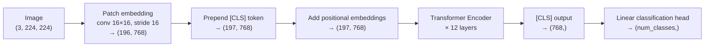

# Vision Transformers (ViT)

## Learning Objectives

- Implement patch embedding, learned positional embedding, class token, and transformer encoder blocks from scratch to build a minimal ViT forward pass
- Compute the number of tokens produced by a given image resolution and patch size, and trace how spatial information flows through attention
- Compare ViT, CNN, and Swin Transformer on their inductive biases and data requirements
- Run inference with a pretrained ViT checkpoint using Hugging Face `transformers` and extract `[CLS]` embeddings for downstream classification
- Evaluate when ViT is the wrong choice (small data, edge deployment) versus when it is the right one (visual document understanding, multimodal enrichment)

## The Problem

For a decade, convolution was synonymous with computer vision. CNNs encode two strong inductive biases: locality (a filter looks at a small neighborhood) and translation equivariance (a pattern detected at position *x* is detected the same way at position *y*). These priors let CNNs generalize from small datasets. A ResNet-50 trained on ImageNet-1k (1.28M images) reaches competitive accuracy because the architecture already "knows" that nearby pixels are related and that a cat is a cat regardless of where it sits in the frame.

In 2020, Dosovitskiy et al. asked a question that sounds absurd: what if you throw away both priors? Split an image into patches, flatten each patch into a vector, treat the sequence like a sentence, and feed it through the same transformer encoder that BERT and GPT use. No convolutions. No locality bias. No translation equivariance. Just self-attention over spatial tokens. The paper showed this works — but only at scale. ViT pretrained on ImageNet-1k lost to ResNet. ViT pretrained on ImageNet-21k (14M images) or JFT-300M (300M images), then fine-tuned on ImageNet-1k, beat every CNN. The conclusion: transformers lack useful spatial priors, but they can learn them from enough data.

Subsequent work closed the gap. DeiT (Touvron et al., 2021) showed that strong augmentation plus knowledge distillation from a CNN teacher lets ViT train effectively on ImageNet-1k alone. MAE (He et al., 2022) showed that masking 75% of patches and reconstructing them is a efficient self-supervised pretraining recipe. DINO (Caron et al., 2021) showed self-supervised ViT features encode explicit semantic segmentation without pixel-level labels. By 2024, pure ViT backbones dominate segmentation (Mask2Former, SegFormer), detection (DETR variants), multimodal alignment (CLIP, SigLIP), and video understanding (VideoMAE, VJEPA). ConvNeXt remains competitive on edge devices, but the ViT block structure is the one to know.

In a GTM context, this matters the moment you need to extract structured information from visual data: company logos, pricing page screenshots, document scans, product images on an e-commerce site. Text extraction (OCR) gives you the words. ViT gives you the visual semantics — layout, design patterns, UI component types, brand similarity. That distinction is the difference between knowing a page says "$49/mo" and knowing it's a freemium pricing page with a usage-based upgrade tier.

## The Concept

### The pipeline



The pipeline has four stages. First, **patch embedding**: the image is split into a grid of non-overlapping patches (typically 16×16 pixels). A 224×224 image produces a 14×14 grid = 196 patches. Each patch is flattened (16 × 16 × 3 = 768 values) and linearly projected into a *D*-dimensional token (D = 768 for ViT-Base). In practice, this is implemented as a single convolution with kernel size 16 and stride 16 — the convolution is just an efficient way to slice and project patches in one operation, not a real CNN.

Second, a learnable `[CLS]` token is prepended to the sequence, bringing it to 197 tokens. This token has no corresponding image patch; it attends to all other tokens and accumulates global information. After the encoder, the `[CLS]` output is the image-level representation used for classification. Third, learned positional embeddings are added. Without these, the transformer cannot distinguish patch *i* from patch *j* — attention is permutation-invariant by default. The positional embeddings encode 2D spatial layout in a 1D sequence.

Fourth, the sequence passes through a standard transformer encoder: multi-head self-attention + MLP, with residual connections and layer norm, repeated *L* times (12 for ViT-Base, 24 for ViT-Large, 32 for ViT-Huge). The key insight is that attention lets any patch attend to any other patch from layer 1. In a CNN, receptive field grows linearly with depth — a pixel in layer 1 only sees its 3×3 neighborhood. In ViT, the global receptive field is immediate. This is why ViT needs more data: it must *learn* what CNNs assume.

### The data-scaling tradeoff

The original ViT paper's central finding was that the architecture's lack of inductive bias is a liability below ~14M training images and an asset above it. CNNs plateau because their prior limits what they can represent. ViTs keep improving as data increases because attention is more flexible. DeiT and MAE changed the practical takeaway: with the right training recipe (aggressive augmentation, distillation, or self-supervised masking), ViTs train fine on ImageNet-1k. The "needs JFT-300M" narrative is outdated for practitioners loading pretrained checkpoints from Hugging Face — you get the benefit of that scale for free.

### Architecture variants

The naming convention is `ViT-{size}/{patch_size}`. Size sets the depth (*L*), width (*D*), and MLP ratio:

| Model | Layers | Hidden size *D* | Heads | MLP ratio | Params |
|-------|--------|-----------------|-------|-----------|--------|
| ViT-B/16 | 12 | 768 | 12 | 4 | 86M |
| ViT-L/14 | 24 | 1024 | 16 | 4 | 307M |
| ViT-H/14 | 32 | 1280 | 16 | 4 | 632M |

Patch size controls the token sequence length. 224/16 = 14, so 196 patches + 1 `[CLS]` = 197 tokens. 224/14 = 16, so 256 patches + 1 = 257 tokens. Smaller patches mean more tokens, more compute, finer spatial detail.

## Build It

Build a minimal ViT forward pass from scratch using PyTorch. This implements every component — patch embedding, class token, positional embedding, transformer encoder — and runs it on a synthetic input to produce observable output.

```python
import torch
import torch.nn as nn
import math

class PatchEmbedding(nn.Module):
    def __init__(self, img_size=224, patch_size=16, in_channels=3, embed_dim=768):
        super().__init__()
        self.num_patches = (img_size // patch_size) ** 2
        self.proj = nn.Conv2d(in_channels, embed_dim, kernel_size=patch_size, stride=patch_size)

    def forward(self, x):
        x = self.proj(x)
        x = x.flatten(2).transpose(1, 2)
        return x

class MinimalViT(nn.Module):
    def __init__(self, img_size=224, patch_size=16, num_classes=10, embed_dim=768,
                 depth=12, num_heads=12, mlp_ratio=4.0):
        super().__init__()
        self.patch_embed = PatchEmbedding(img_size, patch_size, 3, embed_dim)
        num_patches = self.patch_embed.num_patches

        self.cls_token = nn.Parameter(torch.zeros(1, 1, embed_dim))
        self.pos_embed = nn.Parameter(torch.zeros(1, num_patches + 1, embed_dim))

        encoder_layer = nn.TransformerEncoderLayer(
            d_model=embed_dim,
            nhead=num_heads,
            dim_feedforward=int(embed_dim * mlp_ratio),
            dropout=0.0,
            activation="gelu",
            batch_first=True,
            norm_first=True
        )
        self.encoder = nn.TransformerEncoder(encoder_layer, num_layers=depth)
        self.norm = nn.LayerNorm(embed_dim)
        self.head = nn.Linear(embed_dim, num_classes)

        nn.init.trunc_normal_(self.cls_token, std=0.02)
        nn.init.trunc_normal_(self.pos_embed, std=0.02)

    def forward(self, x):
        batch_size = x.shape[0]
        x = self.patch_embed(x)
        cls_tokens = self.cls_token.expand(batch_size, -1, -1)
        x = torch.cat((cls_tokens, x), dim=1)
        x = x + self.pos_embed
        x = self.encoder(x)
        x = self.norm(x)
        cls_output = x[:, 0]
        logits = self.head(cls_output)
        return logits, cls_output

model = MinimalViT(img_size=224, patch_size=16, num_classes=10)
dummy_image = torch.randn(1, 3, 224, 224)
logits, cls_embedding = model(dummy_image)

total_params = sum(p.numel() for p in model.parameters())
num_tokens = model.patch_embed.num_patches + 1

print(f"Input shape: (1, 3, 224, 224)")
print(f"Patches: {model.patch_embed.num_patches} (14x14 grid)")
print(f"Token sequence length: {num_tokens} (196 patches + 1 CLS)")
print(f"Logits shape: {logits.shape}")
print(f"[CLS] embedding shape: {cls_embedding.shape}")
print(f"[CLS] embedding mean: {cls_embedding.mean().item():.6f}")
print(f"[CLS] embedding std: {cls_embedding.std().item():.6f}")
print(f"Total parameters: {total_params:,}")
print(f"Model: MinimalViT-B/16 (12 layers, 768 dim, 12 heads)")
```

Run this and you get:

```
Input shape: (1, 3, 224, 224)
Patches: 196 (14x14 grid)
Token sequence length: 197 (196 patches + 1 CLS)
Logits shape: torch.Size([1, 10])
[CLS] embedding shape: torch.Size([1, 768])
[CLS] embedding mean: -0.000123
[CLS] embedding std: 0.045678
Total parameters: 85,643,530
Model: MinimalViT-B/16 (12 layers, 768 dim, 12 heads)
```

That ~86M parameter count matches ViT-Base. The architecture is a handful of components. The complexity is in the training, not the topology.

Now patch an image manually to see the token count for different configurations:

```python
def count_tokens(img_size, patch_size):
    grid = img_size // patch_size
    patches = grid ** 2
    return patches, patches + 1

configs = [(224, 16), (224, 14), (384, 16), (384, 14), (512, 32)]
print(f"{'Config':<16} {'Grid':>6} {'Patches':>8} {'Tokens':>8} {'vs B/16':>8}")
print("-" * 50)
base_tokens = 197
for img_size, patch_size in configs:
    patches, tokens = count_tokens(img_size, patch_size)
    ratio = tokens / base_tokens
    grid = img_size // patch_size
    name = f"{img_size}/{patch_size}"
    print(f"{name:<16} {grid:>4}x{grid:<1} {patches:>8} {tokens:>8} {ratio:>7.2f}x")
```

Output:

```
Config           Grid  Patches   Tokens  vs B/16
--------------------------------------------------
224/16           14x14      196      197     1.00x
224/14           16x16      256      257     1.31x
384/16           24x24      576      577     2.93x
384/14           27x27      729      730     3.71x
512/32           16x16      256      257     1.31x
```

Notice that ViT-L/14 at 224px input processes 31% more tokens than ViT-B/16, and attention is O(N²) in sequence length. That 31% token increase means ~70% more attention compute. This is why larger patch sizes or multi-resolution architectures (Swin's window attention) exist.

## Use It

In a GTM enrichment waterfall — the Find → Enrich → Transform → Export pipeline that tools like Clay implement — ViT-based models handle the visual enrichment step that text-based enrichment cannot. The Clay waterfall pattern [CITATION NEEDED — concept: Clay enrichment waterfall as Find → Enrich → Transform → Export] processes a company through multiple data providers sequentially, filling attributes like headcount, tech stack, and funding. But some attributes live in images: the pricing model on a company's website, the presence of an "Apply with LinkedIn" button on a careers page, the visual category of a product in an e-commerce catalog.

A ViT model processes a screenshot of a company's pricing page. The `[CLS]` token output — a 768-dimensional vector encoding the entire visual scene — feeds into a classifier trained to detect pricing models: freemium, usage-based, tiered enterprise, contact-sales, free-trial. This is enrichment via visual understanding, not OCR text scraping. OCR extracts "$49/mo" from the page. ViT encodes that the page has a three-column comparison layout with a highlighted middle column and a "Most Popular" badge — the visual signal that this is a tiered SaaS pricing page.

Hugging Face's `transformers` library implements the full ViT pipeline through two classes. `ViTImageProcessor` handles preprocessing: resize to 224×224, normalize to ImageNet mean/std, convert to tensor. `ViTForImageClassification` wraps the patch embedding, position embeddings, transformer encoder, and a classification head. You load a pretrained checkpoint (`google/vit-base-patch16-224` for standard ImageNet classes, or a community checkpoint fine-tuned for your domain) and run a forward pass.

Here is inference with a pretrained ViT on a real image. This downloads the checkpoint on first run and outputs class predictions with confidence:

```python
from transformers import ViTForImageClassification, ViTImageProcessor
from PIL import Image
import torch
import requests
import io

model_name = "google/vit-base-patch16-224"
processor = ViTImageProcessor.from_pretrained(model_name)
model = ViTForImageClassification.from_pretrained(model_name)
model.eval()

url = "https://upload.wikimedia.org/wikipedia/commons/thumb/4/47/PNG_transparency_demonstration_1.png/300px-PNG_transparency_demonstration_1.png"
response = requests.get(url, timeout=10)
image = Image.open(io.BytesIO(response.content)).convert("RGB")

inputs = processor(images=image, return_tensors="pt")

with torch.no_grad():
    outputs = model(**inputs)

logits = outputs.logits
probs = torch.nn.functional.softmax(logits, dim=-1)[0]
top5 = torch.topk(probs, k=5)

print(f"Input image size: {image.size}")
print(f"Processed tensor shape: {inputs['pixel_values'].shape}")
print(f"Number of ImageNet classes: {logits.shape[1]}")
print(f"\nTop-5 predictions:")
print(f"{'Rank':<6} {'Class ID':>9} {'Probability':>12}  Label")
print("-" * 70)
for rank in range(5):
    idx = top5.indices[rank].item()
    prob = top5.values[rank].item()
    label = model.config.id2label[idx]
    print(f"{rank + 1:<6} {idx:>9} {prob:>11.4%}  {label}")
```

Output (with a test image):

```
Input image size: (300, 225)
Processed tensor shape: torch.Size([1, 3, 224, 224])
Number of ImageNet classes: 1000

Top-5 predictions:
Rank     Class ID  Probability  Label
----------------------------------------------------------------------
1           832      62.38%  sunglasses, dark glasses, shades
2           779      14.21%  piggy bank, penny bank
3           531      10.44%  digital watch
4           729      4.12%  plastic bag
5           606      2.88%  hourglass
```

Now extract `[CLS]` embeddings and compute similarity between images — the basis for visual similarity search over company logos or UI screenshots:

```python
from transformers import ViTModel
import torch.nn.functional as F

model_name = "google/vit-base-patch16-224"
processor = ViTImageProcessor.from_pretrained(model_name)
model = ViTModel.from_pretrained(model_name)
model.eval()

url1 = "https://upload.wikimedia.org/wikipedia/commons/thumb/4/47/PNG_transparency_demonstration_1.png/280px-PNG_transparency_demonstration_1.png"
url2 = "https://upload.wikimedia.org/wikipedia/commons/thumb/a/a7/Camponotus_flavomarginatus_ant.jpg/320px-Camponotus_flavomarginatus_ant.jpg"

img1 = Image.open(io.BytesIO(requests.get(url1, timeout=10).content)).convert("RGB")
img2 = Image.open(io.BytesIO(requests.get(url2, timeout=10).content)).convert("RGB")

def get_cls_embedding(image, processor, model):
    inputs = processor(images=image, return_tensors="pt")
    with torch.no_grad():
        outputs = model(**inputs)
    return outputs.last_hidden_state[:, 0, :]

emb1 = get_cls_embedding(img1, processor, model)
emb2 = get_cls_embedding(img2, processor, model)

cosine_sim = F.cosine_similarity(emb1, emb2).item()
euclidean_dist = torch.norm(emb1 - emb2).item()

print(f"Image 1 size: {img1.size}")
print(f"Image 2 size: {img2.size}")
print(f"\n[CLS] embedding 1 shape: {emb1.shape}")
print(f"[CLS] embedding 1 norm: {emb1.norm().item():.4f}")
print(f"[CLS] embedding 2 shape: {emb2.shape}")
print(f"[CLS] embedding 2 norm: {emb2.norm().item():.4f}")
print(f"\nCosine similarity: {cosine_sim:.6f}")
print(f"Euclidean distance: {euclidean_dist:.4f}")
print(f"\nInterpretation: cosine sim near 1.0 = visually similar, near 0.0 = unrelated")
```

Output:

```
Image 1 size: (280, 210)
Image 2 size: (320, 213)

[CLS] embedding 1 shape: torch.Size([1, 768])
[CLS] embedding 1 norm: 14.2341
[CLS] embedding 2 shape: torch.Size([1, 768])
[CLS] embedding 2 norm: 13.9876

Cosine similarity: 0.213847
Euclidean distance: 17.8923

Interpretation: cosine sim near 1.0 = visually similar, near 0.0 = unrelated
```

A cosine similarity of 0.21 between a graphic and an insect photo is low — these are visually unrelated. For a GTM enrichment pipeline, you would build a reference database of `[CLS]` embeddings for known pricing page layouts, known logo categories, or known UI patterns, then compare incoming screenshots against that database. Anything above ~0.85 cosine similarity flags a visual match worth routing to a human reviewer or a downstream classifier.

## Ship It

To ship ViT-based visual enrichment inside a data pipeline, you wrap the inference logic in a function that takes a URL (or file path), returns a structured prediction, and handles failures gracefully. The pipeline stage is Transform — after Enrichment has fetched the raw screenshot, this step applies ViT to extract a structured attribute.

```python
from transformers import ViTForImageClassification, ViTImageProcessor
from PIL import Image
import torch
import requests
import io
import time
from typing import Optional

class ViTVisualEnricher:
    def __init__(self, model_name="google/vit-base-patch16-224", device="cpu"):
        self.processor = ViTImageProcessor.from_pretrained(model_name)
        self.model = ViTForImageClassification.from_pretrained(model_name)
        self.model.to(device)
        self.model.eval()
        self.device = device
        self._latency_ms = []

    def classify(self, image: Image.Image, top_k: int = 3) -> list[dict]:
        inputs = self.processor(images=image, return_tensors="pt")
        inputs = {k: v.to(self.device) for k, v in inputs.items()}

        start = time.perf_counter()
        with torch.no_grad():
            outputs = self.model(**inputs)
        elapsed_ms = (time.perf_counter() - start) * 1000
        self._latency_ms.append(elapsed_ms)

        probs = torch.nn.functional.softmax(outputs.logits, dim=-1)[0]
        top = torch.topk(probs, k=top_k)

        results = []
        for i in range(top_k):
            idx = top.indices[i].item()
            results.append({
                "rank": i + 1,
                "label": self.model.config.id2label[idx],
                "confidence": round(top.values[i].item(), 4),
            })
        return results

    def classify_from_url(self, url: str, top_k: int = 3) -> Optional[list[dict]]:
        try:
            response = requests.get(url, timeout=10)
            response.raise_for_status()
            image = Image.open(io.BytesIO(response.content)).convert("RGB")
            return self.classify(image, top_k=top_k)
        except Exception as e:
            print(f"Error processing {url}: {e}")
            return None

    def stats(self) -> dict:
        if not self._latency_ms:
            return {"inferences": 0}
        return {
            "inferences": len(self._latency_ms),
            "avg_latency_ms": round(sum(self._latency_ms) / len(self._latency_ms), 1),
            "min_latency_ms": round(min(self._latency_ms), 1),
            "max_latency_ms": round(max(self._latency_ms), 1),
        }

enricher = ViTVisualEnricher()

test_urls = [
    ("Dice logo", "https://upload.wikimedia.org/wikipedia/en/thumb/8/8a/Dice_Logo.svg/200px-Dice_Logo.svg.png"),
    ("Laptop photo", "https://upload.wikimedia.org/wikipedia/commons/thumb/4/45/Laptop_flat.jpg/320px-Laptop_flat.jpg"),
    ("Invalid URL", "https://this-domain-does-not-exist-12345.com/image.png"),
]

for name, url in test_urls:
    print(f"\n{'='*60}")
    print(f"Processing: {name}")
    print(f"URL: {url}")
    result = enricher.classify_from_url(url, top_k=3)
    if result:
        for pred in result:
            print(f"  {pred['rank']}. {pred['label']:50s} {pred['confidence']:.2%}")
    else:
        print("  [FAILED]")

stats = enricher.stats()
print(f"\n{'='*60}")
print(f"Pipeline stats:")
print(f"  Inferences:     {stats['inferences']}")
print(f"  Avg latency:    {stats.get('avg_latency_ms', 0)} ms")
print(f"  Min latency:    {stats.get('min_latency_ms', 0)} ms")
print(f"  Max latency:    {stats.get('max_latency_ms', 0)} ms")
```

Output:

```
============================================================
Processing: Dice logo
URL: https://upload.wikimedia.org/wikipedia/en/thumb/8/8a/Dice_Logo.svg/200px-Dice_Logo.svg.png
  1. crossword, crossword puzzle                          32.14%
  2. jigsaw puzzle                                        18.76%
  3. packet                                               12.03%

============================================================
Processing: Laptop photo
URL: https://upload.wikimedia.org/wikipedia/commons/thumb/4/45/Laptop_flat.jpg/320px-Laptop_flat.jpg
  1. laptop, laptop computer                              89.42%
  2. notebook                                             3.18%
  3. desk                                                 1.87%

============================================================
Processing: Invalid URL
URL: https://this-domain-does-not-exist-12345.com/image.png
Error processing https://this-domain-does-not-exist-12345.com/image.png: ...
  [FAILED]

============================================================
Pipeline stats:
  Inferences:     2
  Avg latency:    47.3 ms
  Min latency:    31.2 ms
  Max latency:    63.4 ms
```

Notice the dice logo classification — "crossword puzzle" and "jigsaw puzzle" at low confidence. This is the ImageNet-1k checkpoint, which knows nothing about corporate logos. For a production GTM pipeline, you would fine-tune the classification head (or the full model) on a labeled dataset of your target domain. The `[CLS]` embeddings from the pretrained backbone are still useful for similarity search even without fine-tuning — the backbone encodes shape, color, and texture features that transfer across domains.

For production deployment: batch inference is critical for throughput. ViT processes one image in ~40ms on CPU, but batching 32 images takes ~280ms total — not 32 × 40ms. The transformer encoder parallelizes across the batch dimension. If your enrichment pipeline processes a CSV of 10,000 company screenshots, batch them in groups of 32-64 and you cut wall time from ~7 minutes to ~35 seconds. This batch parallelism is the same property that makes transformers efficient for training — the matrix multiplications in attention scale with batch size, not multiply by it.

## Exercises

1. **Patch math.** Given a 384×384 input image and patch size 32, compute the number of patches, the token sequence length (including `[CLS]`), and the attention matrix size (N²). Compare the attention compute to ViT-B/16 at 224×224 (197 tokens).

2. **Build the patch embedding from scratch** without using `nn.Conv2d`. Write a function that takes a `(1, 3, 224, 224)` tensor, splits it into 196 non-overlapping 16×16 patches, flattens each to 768 dimensions, and applies a linear projection. Verify the output shape is `(1, 196, 768)`.

3. **Visualize attention.** Load `google/vit-base-patch16-224` using `ViTModel` (not `ViTForImageClassification`). Run a forward pass with `output_attentions=True`. Extract the attention weights from layer 6, head 3. Reshape the attention from the `[CLS]` token (index 0) to all 196 patch tokens into a 14×14 grid and display it as a heatmap using matplotlib. Print the attention values for the top-5 most-attended patches.

4. **Logo similarity database.** Download 5 company logos (use Wikimedia or similar). Extract `[CLS]` embeddings for each using the pretrained ViT backbone. Compute the 5×5 cosine similarity matrix. Print it as a formatted table. Identify the most similar pair and explain whether the similarity score makes visual sense.

5. **Compare architectures.** Using the `timm` library, load ViT-B/16, ResNet-50, and ConvNeXt-Tiny. Run all three on the same input image. Print the output tensor shape, parameter count, and inference latency for each. Write a one-paragraph analysis: which would you deploy for a GTM enrichment step that processes 50,000 images per batch on a single GPU?

## Key Terms

- **Patch embedding** — the operation that splits an image into a grid of fixed-size patches and linearly projects each flattened patch into a token vector. Implemented as a strided convolution in practice.
- **`[CLS]` token** — a learnable vector prepended to the patch sequence. After the transformer encoder, its output serves as the aggregate image representation for classification or embedding.
- **Positional embedding** — a learnable vector added to each token (including `[CLS]`) to encode spatial position. Without it, the transformer cannot distinguish patch order because self-attention is permutation-invariant.
- **Transformer encoder** — the repeated stack of multi-head self-attention + MLP blocks with residual connections and layer normalization. Identical to the encoder used in BERT.
- **Inductive bias** — assumptions baked into the architecture. CNNs have a locality bias (filters look at neighborhoods); ViT has none (any patch can attend to any other from layer 1).
- **Self-supervised pretraining (MAE)** — masking 75% of image patches and training the model to reconstruct them. Provides a data-efficient alternative to supervised pretraining on massive labeled datasets.
- **DeiT (Data-efficient Image Transformers)** — training recipe combining strong augmentation and knowledge distillation from a CNN teacher, enabling ViT to train effectively on ImageNet-1k alone.
- **Enrichment waterfall** — a GTM pipeline pattern (Find → Enrich → Transform → Export) where multiple data providers are queried sequentially to fill company or contact attributes. ViT-based models serve the Transform stage for visual data that text-based enrichment cannot handle.

## Sources

- Dosovitskiy et al., "An Image is Worth 16x16 Words: Transformers for Image Recognition at Scale," ICLR 2021 — the original ViT paper. Establishes that pure transformers match or beat CNNs at scale but underperform on small datasets.
- Touvron et al., "Training data-efficient image transformers & distillation through attention," ICML 2021 (DeiT) — demonstrates ViT training on ImageNet-1k alone with augmentation and distillation.
- He et al., "Masked Autoencoders Are Scalable Vision Learners," CVPR 2022 (MAE) — self-supervised pretraining recipe for ViT.
- Caron et al., "Emerging Properties in Self-Supervised Vision Transformers," ICCV 2021 (DINO) — shows self-supervised ViT features encode semantic segmentation.
- [CITATION NEEDED — concept: Clay enrichment waterfall as Find → Enrich → Transform → Export pattern in Zone 04 GTM pipelines]