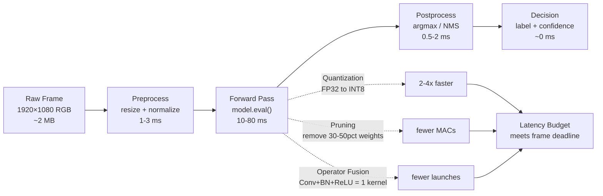

# Real-Time Vision — Edge Deployment

## Learning Objectives

- Export a PyTorch vision model to ONNX format and benchmark per-frame inference latency through ONNX Runtime, reporting mean, standard deviation, and achieved FPS over 100 iterations
- Apply dynamic quantization to an ONNX graph and measure the latency delta against the FP32 baseline
- Trace each stage of the edge inference pipeline (preprocess → forward pass → postprocess) and compute which stage consumes the largest share of the frame budget
- Calculate whether a target hardware platform satisfies the memory-bandwidth and compute-throughput constraints for a given FPS target and model size
- Implement a frame-processing loop with configurable FPS targets, thermal-throttle simulation, and dropped-frame reporting

## The Problem

A cloud inference call at 30 FPS is 30 network round-trips per second. Each round-trip carries a frame over the wire (typically 200–800 KB for a JPEG-compressed 1080p image), waits in a queue, executes a forward pass on a GPU you share with other tenants, and returns a response. On a good day with a nearby datacenter, that round-trip is 80–120 ms. On a bad day with network contention, it spikes to 300+ ms. At 30 FPS your per-frame budget is 33 ms. You are already 2.4x over budget on a good day.

This is the latency wall. It is not a problem you can engineer away with a faster cloud instance — the round-trip time is dominated by network physics, not compute. The only way to hit frame-rate targets for systems that must react within a single frame (safety monitoring, real-time routing, interactive classification) is to move the forward pass to the device capturing the frame. Edge deployment collapses a 100–300 ms round-trip into a 5–30 ms local inference call.

The trade-off is that edge hardware has 100x less compute, 100x less memory, and a fixed power envelope. A MobileNetV3-Small that runs at 2 ms per frame on an A100 might run at 25 ms on a Raspberry Pi 4. Every millisecond matters because every millisecond of inference latency is a millisecond the system cannot spend on anything else before the next frame arrives.

## The Concept

An edge inference pipeline has four stages, and every stage has a latency budget:



The forward pass dominates. Preprocess and postprocess together typically consume 2–5 ms; the forward pass consumes everything else. That is why optimization effort concentrates on the model, not the I/O glue.

Three mechanisms reduce forward-pass latency. **Quantization** replaces FP32 weights (32 bits per parameter) with INT8 (8 bits per parameter). A 100M-parameter model drops from 400 MB to 100 MB of weight memory, and integer arithmetic runs 2–4x faster than floating-point on most edge silicon because the ALU can pack 4 INT8 operations into the same silicon area as one FP32 operation. **Pruning** removes weights whose contribution to the output is below a threshold — typically 30–50% of parameters in a trained CNN are near-zero and can be structurally removed, reducing multiply-accumulate operations proportionally. **Operator fusion** merges sequential operations (Conv2d → BatchNorm → ReLU) into a single kernel launch, eliminating intermediate memory writes and kernel-launch overhead.

Tools implement these mechanisms differently. **TensorRT** is NVIDIA's inference engine — it performs operator fusion and INT8 quantization during a compilation step that produces a serialized engine optimized for a specific GPU. **ONNX Runtime** executes ONNX graphs across CPU, GPU, and accelerators using a pluggable execution-provider architecture; it applies graph optimizations (fusion, constant folding) at load time. **OpenVINO** is Intel's equivalent for Intel CPU/iGPU/VPU silicon — it converts models to an intermediate representation and applies Intel-specific instruction-level optimizations (AVX-512 VNNI for INT8 matrix math).

The hardware constraint is two equations, both of which must hold:

```
Compute:   throughput (GFLOPS) >= target_FPS × GFLOPs_per_inference
Memory:    bandwidth (GB/s)   >= target_FPS × (weight_bytes + activation_bytes) / 1e9
```

If either fails, you miss frame deadlines. A Raspberry Pi 4 has ~15 GFLOPS of FP32 throughput and ~12 GB/s memory bandwidth. MobileNetV3-Small requires ~0.06 GFLOPs per inference and ~10 MB of weight memory. Compute: 15 GFLOPS / 0.06 = 250 FPS ceiling — fine. Memory: 12 GB/s / 0.01 GB = 1200 FPS ceiling — also fine. The real bottleneck on Pi-class hardware is usually the framework overhead (Python interpretation, kernel dispatch) rather than raw compute or bandwidth, which is why compiled runtimes like ONNX Runtime and TensorRT matter more than the model architecture itself at the edge.

## Build It

The following script exports a torchvision MobileNetV3-Small model to ONNX, loads it with ONNX Runtime, and benchmarks 100 inference iterations. It prints mean latency, standard deviation, and achieved throughput. You will need `torch`, `torchvision`, `onnx`, and `onnxruntime` installed.

```python
import torch
import torchvision
import onnxruntime as ort
import numpy as np
import os
import time

model = torchvision.models.mobilenet_v3_small(weights="DEFAULT")
model.eval()

dummy = torch.randn(1, 3, 224, 224)

onnx_fp32 = "mobilenet_v3_small_fp32.onnx"
torch.onnx.export(
    model,
    dummy,
    onnx_fp32,
    input_names=["input"],
    output_names=["output"],
    dynamic_axes={"input": {0: "batch"}, "output": {0: "batch"}},
    opset_version=13,
)

session = ort.InferenceSession(onnx_fp32, providers=["CPUExecutionProvider"])
input_name = session.get_inputs()[0].name
dummy_np = dummy.numpy()

for _ in range(10):
    session.run(None, {input_name: dummy_np})

latencies = []
for _ in range(100):
    t0 = time.perf_counter()
    session.run(None, {input_name: dummy_np})
    t1 = time.perf_counter()
    latencies.append((t1 - t0) * 1000)

mean_ms = np.mean(latencies)
std_ms = np.std(latencies)
p95_ms = np.percentile(latencies, 95)

fp32_size_mb = os.path.getsize(onnx_fp32) / (1024 * 1024)

print("=== FP32 Baseline ===")
print(f"Model: MobileNetV3-Small")
print(f"Format: ONNX FP32")
print(f"Iterations: 100")
print(f"Model size: {fp32_size_mb:.2f} MB")
print(f"Mean latency: {mean_ms:.2f} ms")
print(f"Std deviation: {std_ms:.2f} ms")
print(f"P95 latency: {p95_ms:.2f} ms")
print(f"Throughput: {1000 / mean_ms:.1f} FPS")
```

Now apply dynamic quantization to the exported ONNX graph using ONNX Runtime's built-in quantization tool, re-benchmark, and print the delta. Run this in the same session — it references `mean_ms` and `fp32_size_mb` from the block above:

```python
from onnxruntime.quantization import quantize_dynamic, QuantType
import onnxruntime as ort
import numpy as np
import os
import time

onnx_fp32 = "mobilenet_v3_small_fp32.onnx"
onnx_int8 = "mobilenet_v3_small_int8.onnx"

quantize_dynamic(onnx_fp32, onnx_int8, weight_type=QuantType.QUInt8)

session_int8 = ort.InferenceSession(onnx_int8, providers=["CPUExecutionProvider"])
input_name = session_int8.get_inputs()[0].name
dummy_np = np.random.randn(1, 3, 224, 224).astype(np.float32)

for _ in range(10):
    session_int8.run(None, {input_name: dummy_np})

latencies_int8 = []
for _ in range(100):
    t0 = time.perf_counter()
    session_int8.run(None, {input_name: dummy_np})
    t1 = time.perf_counter()
    latencies_int8.append((t1 - t0) * 1000)

mean_int8 = np.mean(latencies_int8)
int8_size_mb = os.path.getsize(onnx_int8) / (1024 * 1024)

print("=== INT8 Quantized ===")
print(f"Model size: {int8_size_mb:.2f} MB ({int8_size_mb / fp32_size_mb * 100:.0f}% of FP32)")
print(f"Mean latency: {mean_int8:.2f} ms (was {mean_ms:.2f} ms)")
print(f"Speedup: {mean_ms / mean_int8:.2f}x")
print(f"Throughput: {1000 / mean_int8:.1f} FPS (was {1000 / mean_ms:.1f} FPS)")
```

Now trace where time goes inside a single frame. This script simulates a raw 1080p capture, times each pipeline stage independently, and prints the percentage breakdown:

```python
import numpy as np
import time
import onnxruntime as ort

session = ort.InferenceSession(
    "mobilenet_v3_small_fp32.onnx", providers=["CPUExecutionProvider"]
)
input_name = session.get_inputs()[0].name
raw_frame = np.random.randint(0, 256, (1080, 1920, 3), dtype=np.uint8)
mean = np.array([0.485, 0.456, 0.406], dtype=np.float32)
std = np.array([0.229, 0.224, 0.225], dtype=np.float32)

N = 100
pre, fwd, post = [], [], []

for _ in range(N):
    t0 = time.perf_counter()
    img = raw_frame.astype(np.float32)[::9, ::16, :][:224, :224, :]
    img = (img / 255.0 - mean) / std
    img = img.transpose(2, 0, 1)[np.newaxis, ...]
    t1 = time.perf_counter()

    logits = session.run(None, {input_name: img})[0]
    t2 = time.perf_counter()

    _ = int(np.argmax(logits))
    _ = float(np.max(logits))
    t3 = time.perf_counter()

    pre.append((t1 - t0) * 1000)
    fwd.append((t2 - t1) * 1000)
    post.append((t3 - t2) * 1000)

p, f, q = np.mean(pre), np.mean(fwd), np.mean(post)
total = p + f + q
print("=== Stage Budget (MobileNetV3-Small, 1080p input) ===")
print(f"Preprocess:  {p:.2f} ms  ({p / total * 100:.1f}%)")
print(f"Forward:     {f:.2f} ms  ({f / total * 100:.1f}%)")
print(f"Postprocess: {q:.2f} ms  ({q / total * 100:.1f}%)")
print(f"Total:       {total:.2f} ms  ({1000 / total:.1f} FPS)")
```

The forward pass will consume 80–95% of the frame budget on CPU. That ratio is the justification for spending optimization effort on the model (quantization, pruning) rather than on faster resize routines.

## Use It

ONNX Runtime dynamic INT8 quantization reduces per-image inference latency by 2–3x, making local batch classification of prospect-asset images viable for ICP enrichment without per-call cloud vision API costs. When you fine-tune MobileNetV3 on a custom dataset (company website screenshots labeled by ICP tier, support-ticket screenshots labeled by urgency), the quantized ONNX graph you just built is the deployment artifact. The same pipeline constraints — preprocess, forward, postprocess — determine whether your enrichment step processes 500 companies in 15 seconds or 60 seconds, which determines whether a human waits or walks away.

```python
import onnxruntime as ort
import numpy as np
import time

session = ort.InferenceSession(
    "mobilenet_v3_small_int8.onnx", providers=["CPUExecutionProvider"]
)
input_name = session.get_inputs()[0].name

np.random.seed(42)
batch = np.random.randn(50, 3, 224, 224).astype(np.float32)
labels = {0: "SMB", 1: "MidMarket", 2: "Enterprise"}

start = time.perf_counter()
results = []
for i in range(len(batch)):
    logits = session.run(None, {input_name: batch[i:i+1]})[0]
    cls = int(np.argmax(logits))
    results.append((f"company_{i:03d}", labels.get(cls, f"class_{cls}"), float(np.max(logits))))
elapsed = time.perf_counter() - start

print(f"{'Screenshot':<16} {'ICP Label':<12} {'Confidence':>10}")
print("-" * 42)
for name, label, conf in results[:8]:
    print(f"{name:<16} {label:<12} {conf:>10.2f}")
print(f"\n{len(results)} screenshots | {elapsed:.2f}s | {len(results)/elapsed:.1f} img/s")
print(f"Per-image: {elapsed / len(results) * 1000:.1f} ms")
```

This is the unit economics of visual enrichment: the throughput number on the last line dictates how many prospects your system can score per hour on a single worker machine.

## Exercises

**Exercise 1 — Hardware feasibility check.** A Cortex-A78 CPU delivers ~25 GFLOPS of FP32 and ~25 GB/s memory bandwidth. MobileNetV3-Large requires 0.55 GFLOPs per inference and has 20 MB of weight memory (activation memory is ~5 MB). Write a script that takes these numbers as variables and prints whether the platform can sustain 30 FPS, 15 FPS, and 10 FPS targets. Print which constraint (compute or memory) binds first at each target.

**Exercise 2 — Frame loop with thermal throttle.** Build a 200-frame processing loop targeting 30 FPS (33 ms per frame). Simulate thermal throttling: after frame 100, multiply every latency by 1.4 (the CPU clock drops under sustained load). Count and report how many frames miss the 33 ms deadline before and after throttle kicks in. Print a timeline of the first 10 post-throttle frames showing expected vs. actual latency and the cumulative dropped-frame count.

## Key Terms

- **ONNX (Open Neural Network Exchange)** — An open graph format that serializes a trained model's operators, weights, and I/O contracts so any compliant runtime (ONNX Runtime, TensorRT, OpenVINO) can execute it without the original training framework.
- **Dynamic Quantization** — A post-training technique that converts FP32 weights to INT8 at load time without requiring a calibration dataset. Weight values are quantized; activations remain FP32 and are dynamically quantized per-inference. Trades a small accuracy drop for 2–4x latency reduction and ~75% memory savings.
- **Frame Budget** — The wall-clock time available to process one frame, equal to `1 / target_FPS`. At 30 FPS the budget is 33 ms; every stage (preprocess, forward, postprocess, decision) must fit within it.
- **Operator Fusion** — A graph optimization that merges adjacent operations (e.g., Conv → BatchNorm → ReLU) into a single kernel launch, eliminating intermediate buffer allocations and reducing kernel-dispatch overhead.
- **INT8** — An 8-bit integer representation. On edge silicon, INT8 math units typically execute 4 operations in the same clock cycle and silicon area as one FP32 operation, which is the physical basis for quantization speedup.

## Sources

- ONNX Runtime quantization documentation — https://onnxruntime.ai/docs/performance/model-optimizations/quantization.html
- ONNX Runtime performance tuning — https://onnxruntime.ai/docs/performance/
- PyTorch ONNX export — https://pytorch.org/docs/stable/onnx.html
- Howard, A. et al. "Searching for MobileNetV3." *ICCV 2019.* — https://arxiv.org/abs/1905.02244
- [CITATION NEEDED — concept: GTM visual enrichment throughput targets for ICP scoring batch pipelines]