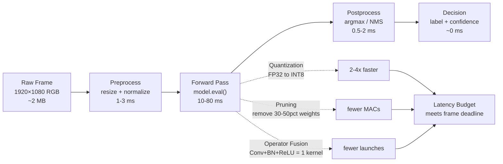

# Real-Time Vision — Edge Deployment

## Learning Objectives

- Export a PyTorch vision model to ONNX format and benchmark per-frame inference latency through ONNX Runtime, reporting mean, standard deviation, and achieved FPS over 100 iterations
- Apply dynamic quantization to an ONNX graph and measure the latency delta against the FP32 baseline
- Trace each stage of the edge inference pipeline (preprocess → forward pass → postprocess) and compute which stage consumes the largest share of the frame budget
- Calculate whether a target hardware platform satisfies the memory-bandwidth and compute-throughput constraints for a given FPS target and model size
- Implement a frame-processing loop with configurable FPS targets, thermal-throttle simulation, and dropped-frame reporting

## The Problem

A cloud inference call at 30 FPS is 30 network round-trips per second. Each round-trip carries a frame over the wire (typically 200–800 KB for a JPEG-compressed 1080p image), waits in a queue, executes a forward pass on a GPU you share with other tenants, and returns a response. On a good day with a nearby datacenter, that round-trip is 80–120 ms. On a bad day with network contention, it spikes to 300+ ms. At 30 FPS your per-frame budget is 33 ms. You are already 2.4x over budget on a good day.

This is the latency wall. It is not a problem you can engineer away with a faster cloud instance — the round-trip time is dominated by network physics, not compute. The only way to hit frame-rate targets for systems that must react within a single frame (safety monitoring, real-time routing, interactive classification) is to move the forward pass to the device capturing the frame. Edge deployment collapses a 100–300 ms round-trip into a 5–30 ms local inference call.

The trade-off is that edge hardware has 100x less compute, 100x less memory, and a fixed power envelope. A MobileNetV3-Small that runs at 2 ms per frame on an A100 might run at 25 ms on a Raspberry Pi 4. Every millisecond matters because every millisecond of inference latency is a millisecond the system cannot spend on anything else before the next frame arrives.

## The Concept

An edge inference pipeline has four stages, and every stage has a latency budget:



The forward pass dominates. Preprocess and postprocess together typically consume 2–5 ms; the forward pass consumes everything else. That is why optimization effort concentrates on the model, not the I/O glue.

Three mechanisms reduce forward-pass latency. **Quantization** replaces FP32 weights (32 bits per parameter) with INT8 (8 bits per parameter). A 100M-parameter model drops from 400 MB to 100 MB of weight memory, and integer arithmetic runs 2–4x faster than floating-point on most edge silicon because the ALU can pack 4 INT8 operations into the same silicon area as one FP32 operation. **Pruning** removes weights whose contribution to the output is below a threshold — typically 30–50% of parameters in a trained CNN are near-zero and can be structurally removed, reducing multiply-accumulate operations proportionally. **Operator fusion** merges sequential operations (Conv2d → BatchNorm → ReLU) into a single kernel launch, eliminating intermediate memory writes and kernel-launch overhead.

Tools implement these mechanisms differently. **TensorRT** is NVIDIA's inference engine — it performs operator fusion and INT8 quantization during a compilation step that produces a serialized engine optimized for a specific GPU. **ONNX Runtime** executes ONNX graphs across CPU, GPU, and accelerators using a pluggable execution-provider architecture; it applies graph optimizations (fusion, constant folding) at load time. **OpenVINO** is Intel's equivalent for Intel CPU/iGPU/VPU silicon — it converts models to an intermediate representation and applies Intel-specific instruction-level optimizations (AVX-512 VNNI for INT8 matrix math).

The hardware constraint is two equations, both of which must hold:

```
Compute:   throughput (GFLOPS) >= target_FPS × GFLOPs_per_inference
Memory:    bandwidth (GB/s)   >= target_FPS × (weight_bytes + activation_bytes) / 1e9
```

If either fails, you miss frame deadlines. A Raspberry Pi 4 has ~15 GFLOPS of FP32 throughput and ~12 GB/s memory bandwidth. MobileNetV3-Small requires ~0.06 GFLOPs per inference and ~10 MB of weight memory. Compute: 15 GFLOPS / 0.06 = 250 FPS ceiling — fine. Memory: 12 GB/s / 0.01 GB = 1200 FPS ceiling — also fine. The real bottleneck on Pi-class hardware is usually the framework overhead (Python interpretation, kernel dispatch) rather than raw compute or bandwidth, which is why compiled runtimes like ONNX Runtime and TensorRT matter more than the model architecture itself at the edge.

## Build It

The following script exports a torchvision MobileNetV3-Small model to ONNX, loads it with ONNX Runtime, and benchmarks 100 inference iterations. It prints mean latency, standard deviation, and achieved throughput. You will need `torch`, `torchvision`, `onnx`, and `onnxruntime` installed.

```python
import torch
import torchvision
import onnxruntime as ort
import numpy as np
import os
import time

model = torchvision.models.mobilenet_v3_small(weights="DEFAULT")
model.eval()

dummy = torch.randn(1, 3, 224, 224)

onnx_fp32 = "mobilenet_v3_small_fp32.onnx"
torch.onnx.export(
    model,
    dummy,
    onnx_fp32,
    input_names=["input"],
    output_names=["output"],
    dynamic_axes={"input": {0: "batch"}, "output": {0: "batch"}},
    opset_version=13,
)

session = ort.InferenceSession(onnx_fp32, providers=["CPUExecutionProvider"])
input_name = session.get_inputs()[0].name
dummy_np = dummy.numpy()

for _ in range(10):
    session.run(None, {input_name: dummy_np})

latencies = []
for _ in range(100):
    t0 = time.perf_counter()
    session.run(None, {input_name: dummy_np})
    t1 = time.perf_counter()
    latencies.append((t1 - t0) * 1000)

mean_ms = np.mean(latencies)
std_ms = np.std(latencies)
p95_ms = np.percentile(latencies, 95)

fp32_size_mb = os.path.getsize(onnx_fp32) / (1024 * 1024)

print("=== FP32 Baseline ===")
print(f"Model: MobileNetV3-Small")
print(f"Format: ONNX FP32")
print(f"Iterations: 100")
print(f"Model size: {fp32_size_mb:.2f} MB")
print(f"Mean latency: {mean_ms:.2f} ms")
print(f"Std deviation: {std_ms:.2f} ms")
print(f"P95 latency: {p95_ms:.2f} ms")
print(f"Throughput: {1000 / mean_ms:.1f} FPS")
```

Now apply dynamic quantization to the exported ONNX graph using ONNX Runtime's built-in quantization tool, re-benchmark, and print the delta:

```python
import onnxruntime as ort
from onnxruntime.quantization import quantize_dynamic, QuantType
import numpy as np
import os
import time

onnx_fp32 = "mobilenet_v3_small_fp32.onnx"
onnx_int8 = "mobilenet_v3_small_int8.onnx"

quantize_dynamic(onnx_fp