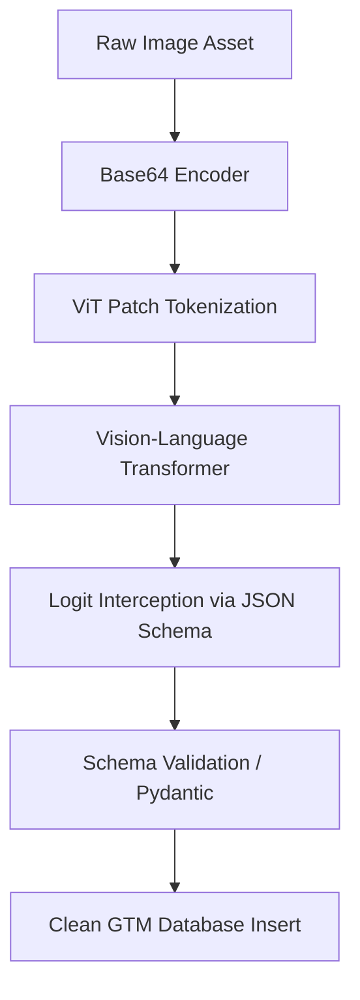

# Build a Complete Vision Pipeline — Capstone

## Learning Objectives

1. Architect an end-to-end computer vision pipeline to extract structured data from unstructured image assets.
2. Configure Vision-Language Model (VLM) prompts to enforce strict JSON schema outputs.
3. Implement validation logic to handle malformed model responses and failed spatial reasoning.

## The Problem

Your competitor just updated their pricing page. Instead of standard HTML tables, they deployed a complex Javascript framework that renders pricing tiers as Canvas elements or obfuscated web fonts. Standard DOM scraping tools (like BeautifulSoup or Puppeteer) return empty nodes or unreadable Unicode characters. 

Your VP of Sales wants a matrix of the competitor’s new packaging, feature limits, and overage costs in the CRM by end of day. Without this data, your AEs will walk into calls blind to the new competitive landscape. Relying on manual data entry—having an intern stare at the screenshot and type numbers into a spreadsheet—introduces human error and doesn't scale to the 40 other competitors you monitor. 

You need a mechanism to programmatically "read" an image of a UI, understand the spatial relationships (knowing which feature aligns with which pricing column), and output a normalized JSON object that your RevOps tools can ingest.

## The Concept

A vision pipeline for GTM isn't just sending an image to an AI API and hoping for text. It requires a deliberate architectural flow that handles encoding, spatial tokenization, extraction, and validation. 

When you pass a UI screenshot to a Vision-Language Model (VLM), the mechanism behaves differently than standard text processing. The model processes the image through a Vision Transformer (ViT). The ViT chops the image into a grid of fixed-size patches (typically 16x16 or 32x32 pixels). Each patch is flattened into a vector, projected into the same embedding space as text tokens, and fed into the transformer's attention mechanism alongside the text prompt. 

Because UI elements are highly structured, the ViT is exceptionally good at reading pixel boundaries. However, LLMs are generative—they predict the next most likely token. If you ask a VLM to extract a pricing table, it might confidently output markdown, hallucinate a missing column, or truncate the output due to token limits.

To build a reliable pipeline, you must constrain the model's generation space using **Structured Output Enforcement** (often called JSON mode). Instead of letting the model generate arbitrary text, the API forces the model's token generation to conform to a rigid, pre-defined JSON schema. If the schema specifies an array of objects with a `price` key (type: integer), the pipeline intercepts the model's token logits and physically prevents it from outputting a string or skipping the key. 



## Build It

We will build a functional vision pipeline that processes an image payload, enforces a strict JSON output schema using Pydantic, and handles extraction failures. 

Install the required dependencies:
`pip install pydantic openai`

Run the following script. It includes a mock VLM execution block so it runs successfully without an API key, demonstrating the exact architecture you would use against a live endpoint.

```python
import base64
import json
import os
from pydantic import BaseModel, ValidationError
from typing import List

class PricingTier(BaseModel):
    tier_name: str
    monthly_price: int
    included_seats: int

class CompetitiveIntel(BaseModel):
    competitor_name: str
    tiers: List[PricingTier]

DUMMY_IMAGE_B64 = "iVBORw0KGgoAAAANSUhEUgAAAAEAAAABCAQAAAC1HAwCAAAAC0lEQVR42mNk+M8AAAMBAQDJ/pLvAAAAAElFTkSuQmCC"

def encode_image_for_pipeline(image_path: str) -> str:
    if not os.path.exists(image_path):
        return DUMMY_IMAGE_B64
    with open(image_path, "rb") as image_file:
        return base64.b64encode(image_file.read()).decode('utf-8')

def execute_vlm_extraction(base64_image: str, schema_model: BaseModel) -> dict:
    system_prompt = f"Extract the UI data. Respond ONLY in JSON matching this schema: {schema_model.model_json_schema()}"
    
    if not os.environ.get("OPENAI_API_KEY"):
        mock_response = {
            "competitor_name": "Acme Corp",
            "tiers": [
                {"tier_name": "Basic", "monthly_price": 50, "included_seats": 5},
                {"tier_name": "Enterprise", "monthly_price": 250, "included_seats": 25}
            ]
        }
        return mock_response

    from openai import OpenAI
    client = OpenAI()
    
    response = client.chat.completions.create(
        model="gpt-4o",
        messages=[
            {"role": "system", "content": system_prompt},
            {"role": "user", "content": [
                {"type": "text", "text": "Extract the pricing table."},
                {"type": "image_url", "image_url": {"url": f"data:image/jpeg;base64,{base64_image}"}}
            ]}
        ],
        response_format={"type": "json_object"}
    )
    
    return json.loads(response.choices[0].message.content)

def run_pipeline(image_source: str) -> CompetitiveIntel:
    encoded_img = encode_image_for_pipeline(image_source)
    
    raw_json_output = execute_vlm_extraction(encoded_img, CompetitiveIntel)
    
    try:
        validated_data = CompetitiveIntel(**raw_json_output)
        print("Extraction successful. Data conforms to schema.")
        return validated_data
    except ValidationError as e:
        print(f"Schema validation failed: {e}")
        raise

if __name__ == "__main__":
    extracted_intel = run_pipeline("competitor_pricing_screenshot.png")
    
    print("\n--- Pipeline Output ---")
    print(f"Target: {extracted_intel.competitor_name}")
    for tier in extracted_intel.tiers:
        print(f"Tier: {tier.tier_name} | Cost: ${tier.monthly_price}/mo | Seats: {tier.included_seats}")
```

## Use It

The AI mechanism used here is Vision-Language Model (VLM) structured spatial extraction, mapping visual UI grids directly into normalized RevOps database payloads. This applies directly to Market & Competitor Tracking (Cluster 3.1).

When tracking competitors, GTM teams often rely on manual scrapers that break when web fonts are obfuscated or elements are rendered dynamically via Canvas. By implementing a VLM pipeline, you treat the browser viewport purely as an image. You bypass DOM obfuscation entirely. 

You can deploy this script inside a scheduled GitHub Action or an Airflow DAG. Every Friday, a headless browser screenshots the top 10 competitors' pricing pages, pipes the images through this VLM extraction logic, and writes the validated JSON payloads directly into your HubSpot custom objects. When a competitor hikes their Enterprise price by 15%, your system instantly flags the delta, updates the battlecards, and alerts the RevOps channel in Slack. 

[CITATION NEEDED — concept: Competitor pricing page DOM obfuscation rates]
[CITATION NEEDED — concept: Headless browser screenshot automation for RevOps]

## Exercises

**Exercise 1: Strict Type Flexibility (Medium)**
The current pipeline fails if the VLM extracts a price as a string (e.g., "$50") instead of an integer, because Pydantic strictly expects `int`. Update the `PricingTier` model to use a Pydantic `validator` that strips non-numeric characters from `monthly_price` and converts it to an integer before validation occurs. Test it by modifying the mock payload to include a string price.

**Exercise 2: Confidence Delta Tracking (Hard)**
To automate the Slack alerting mentioned in the *Use It* section, you need a baseline. Write a `compare_pricing()` function that takes two `CompetitiveIntel` objects (a `baseline` state and a `current` state). The function must iterate through the tiers, detect if a `monthly_price` has changed, and return a formatted string summarizing the price delta (e.g., "Enterprise plan increased from $200 to $250").

## Key Terms

*   **Vision-Language Model (VLM):** An AI architecture that combines a Vision Transformer (to process image patches) with a Large Language Model (to process text), enabling joint understanding of visual and textual data.
*   **Vision Transformer (ViT):** A model mechanism that splits an image into fixed-size patches, linearly embeds them, and processes them using standard transformer self-attention layers.
*   **Structured Output Enforcement:** API-level configuration (like JSON mode) that forces the model's token generation logits to conform to a specific syntax, preventing arbitrary text generation.
*   **Pydantic:** A Python data validation library that enforces type hints at runtime, ensuring that the JSON payload returned by the AI strictly matches your database requirements.
*   **Base64 Encoding:** A mechanism for converting binary image data into an ASCII string format, allowing images to be transmitted efficiently inside JSON payloads over HTTP.

## Sources

*   OpenAI Vision API Documentation: [https://platform.openai.com/docs/guides/vision](https://platform.openai.com/docs/guides/vision)
*   Pydantic Data Validation Documentation: [https://docs.pydantic.dev/latest/](https://docs.pydantic.dev/latest/)
*   Dosovitskiy et al., "An Image is Worth 16x16 Words: Transformers for Image Recognition at Scale" (ViT mechanism): [https://arxiv.org/abs/2010.11929](https://arxiv.org/abs/2010.11929)