# Self-Supervised Vision — SimCLR, DINO, MAE

## Learning Objectives

- Implement the NT-Xent contrastive loss from scratch and trace why positive pairs converge while negative pairs diverge
- Compare the three collapse-avoidance mechanisms: negative sampling (SimCLR), EMA centering + sharpening (DINO), and reconstruction targets (MAE)
- Build a patch masking and reconstruction pipeline and measure reconstruction error across mask ratios
- Evaluate pretrained self-supervised embeddings on a downstream visual classification task using linear probing
- Deploy a visual embedding extraction pipeline that scores image similarity for GTM enrichment workflows

## The Problem

Supervised ImageNet has 1.3M labelled images. The annotation cost is estimated at roughly $10M when you account for the multi-pass labeling, quality control, and class taxonomy design. That is the cheap case. Medical imaging datasets, industrial defect catalogs, and satellite imagery collections are far more expensive per label — a single annotated CT scan can require a radiologist's time. Every vision team eventually hits the same wall: you have millions of raw images but can only afford to label thousands.

The question is whether you can pretrain on cheap unlabelled data — web crawls, video frames, satellite sweeps, internal screenshot archives — and then fine-tune on a small labelled set. The answer, as of 2024, is yes. Self-supervised ViTs pretrained on LAION-5B or JFT-300M reach or exceed supervised ImageNet accuracy when fine-tuned, and they transfer better to downstream tasks like detection, segmentation, and depth estimation. DINOv2 and MAE are the production defaults for transferable vision features at most labs that publish results.

The conceptual shift is that the pretext task does not have to match the downstream task. The pretext is whatever forces the network to learn useful features. Predict the rotation of an image, reconstruct masked patches, match augmented views of the same input — all of these work. What matters is that the representation that emerges is linearly separable, transferable, and semantically meaningful. Three families of methods dominate practice today, each encoding a different assumption about what it means to understand an image.

## The Concept

**Three paradigms, one goal: learn representations from raw pixels.**

SimCLR is contrastive. You take an image, apply two independent stochastic augmentations (crop, color jitter, blur), and pass both through a shared encoder. The two outputs are positive pairs — they should be close in embedding space. Every other image in the batch is a negative. The NT-Xent loss (normalized temperature-scaled cross-entropy) computes cosine similarity between all pairs, then applies a softmax with a temperature parameter. The temperature controls how sharply the model punishes hard negatives. A batch of 512 gives you 1022 negatives per positive; a batch of 32 gives only 62, and the signal degrades. This is why SimCLR requires large batch sizes — the contrastive signal comes from the negatives, not the positives. A projection head (an MLP) sits between the encoder and the loss. The projection head discards task-irrelevant information (color, orientation specifics) so the encoder retains only features that generalize. You throw the projection head away after pretraining.

DINO is self-distillation with no labels. A student network and a teacher network process different crops of the same image. The student matches the teacher's output distribution via cross-entropy. The teacher is an exponential moving average (EMA) of the student's weights — it drifts slowly while the student updates quickly. Without intervention, this setup collapses: both networks output the same constant for every input, and the loss goes to zero. DINO prevents this with two mechanisms. Centering subtracts a running mean of the teacher's outputs from each batch, so the teacher cannot saturate on a single mode. Sharpening applies a low temperature to the teacher's softmax, forcing its output distribution to be peaky and discriminative. The emergent property that made DINO famous: the teacher's attention maps spontaneously segment objects without any segmentation supervision. The model learns where objects are because that is what makes the distillation objective work.

MAE takes a different bet entirely. Mask 75% of image patches, encode only the visible 25%, and reconstruct the full image pixel values through a lightweight decoder. The encoder is a standard ViT that never sees masked positions during the forward pass — there are no mask tokens in the encoder, only in the decoder. This asymmetric design means the encoder runs on 4x less compute than a standard ViT forward pass. The 75% mask ratio is not arbitrary. Images are highly spatially redundant — a patch can be approximately reconstructed from its neighbors with minimal learned features. At 15% masking (BERT's ratio for text), the task is trivially solvable by interpolation, and the encoder learns almost nothing. At 75%, the model must actually understand the scene to fill in a missing quarter of the image. The reconstruction target is raw pixels, not tokens, and the loss is simple MSE on masked patches only.

```mermaid
flowchart TB
    subgraph SimCLR["SimCLR — Contrastive"]
        A1["Image"] -->|augment| B1["View 1"]
        A1 -->|augment| B2["View 2"]
        B1 --> C1["Shared Encoder f"]
        B2 --> C1
        C1 --> D1["Projection Head g"]
        D1 --> E1["NT-Xent Loss<br/>pull positives, push negatives"]
    end

    subgraph DINO["DINO — Self-Distillation"]
        A2["Image"] -->|global crop| B3["Teacher (EMA)"]
        A2 -->|local crops| B4["Student"]
        B3 --> C2["Centering + Sharpening"]
        C2 --> D2["Cross-Entropy<br/>student matches teacher"]
    end

    subgraph MAE["MAE — Masked Reconstruction"]
        A3["Image"] --> B5["Mask 75% patches"]
        B5 --> C3["Encoder<br/>visible 25% only"]
        C3 --> D3["Decoder<br/>mask tokens + encoded"]
        D3 --> E3["MSE on masked pixels"]
    end
```



The comparison axis that matters for practitioners: collapse avoidance, compute cost, and transfer quality. SimCLR needs large batches and careful augmentation tuning. DINO needs EMA momentum schedules and multi-crop strategies. MAE is the simplest to train — standard ViT, MSE loss, no negative sampling, no teacher network — and it scales efficiently because the encoder sees only 25% of patches. On transfer benchmarks (detection on COCO, segmentation on ADE20K), all three beat supervised pretraining; MAE and DINOv2 currently lead on dense prediction tasks.

## Build It

Let's implement the core mechanism of each paradigm. These are not training loops — they are the mathematical operations that make each method work, isolated so you can observe the dynamics directly.

First, the NT-Xent loss. This is the heart of SimCLR. Given a batch of N images, you create 2N augmented views (two per image). The loss for each positive pair pulls them together while pushing all 2N-2 negatives away:

```python
import torch
import torch.nn.functional as F

def nt_xent_loss(z1, z2, temperature=0.5):
    batch_size = z1.shape[0]
    z = torch.cat([z1, z2], dim=0)
    z = F.normalize(z, dim=1)
    sim = torch.matmul(z, z.T) / temperature
    sim.fill_diagonal_(-1e9)
    labels = torch.cat([torch.arange(batch_size, 2 * batch_size),
                        torch.arange(0, batch_size)])
    loss = F.cross_entropy(sim, labels)
    return loss, sim

torch.manual_seed(42)
z1_close = torch.randn(8, 128)
z2_close = z1_close + 0.01 * torch.randn(8, 128)
loss_close, _ = nt_xent_loss(z1_close, z2_close)
print(f"Positive pairs (close): NT-Xent = {loss_close.item():.4f}")

z1_far = torch.randn(8, 128)
z2_far = torch.randn(8, 128)
loss_far, _ = nt_xent_loss(z1_far, z2_far)
print(f"Random pairs (far):    NT-Xent = {loss_far.item():.4f}")

with torch.no_grad():
    z1_grad = z1_close.clone()
    z2_grad = z2_close.clone()
    for step in range(50):
        z1_g = z1_grad.clone().requires_grad_(True)
        z2_g = z2_grad.clone().requires_grad_(True)
        loss, _ = nt_xent_loss(z1_g, z2_g)
        grad1, grad2 = z1_g.grad, z2_g.grad
        z1_grad -= 0.1 * grad1
        z2_grad -= 0.1 * grad2
        if step % 10 == 0:
            cos_sim = F.cosine_similarity(z1_grad, z2_grad, dim=1).mean()
            print(f"  Step {step:2d}: loss={loss.item():.4f}  cosine_sim={cos_sim.item():.4f}")

print(f"Final cosine sim (should approach 1.0): {F.cosine_similarity(z1_grad, z2_grad, dim=1).mean().item():.4f}")
```

Run this and you will see the loss for close positive pairs is much lower than for random pairs, and gradient descent pulls the embeddings into alignment — cosine similarity climbing toward 1.0. That is the contrastive mechanism in miniature.

Now, MAE patch masking. The operation is simple but the design choices are not. Here is the full masking and reconstruction pipeline on a synthetic image:

```python
import torch
import torch.nn as nn

def patchify(imgs, patch_size):
    c, h, w = imgs.shape[1], imgs.shape[2], imgs.shape[3]
    num_patches_h = h // patch_size
    num_patches_w = w // patch_size
    patches = imgs.unfold(2, patch_size, patch_size).unfold(3, patch_size, patch_size)
    patches = patches.contiguous().view(imgs.shape[0], c, num_patches_h, num_patches_w, patch_size, patch_size)
    patches = patches.permute(0, 2, 3, 1, 4, 5).contiguous()
    patches = patches.view(imgs.shape[0], num_patches_h * num_patches_w, c * patch_size * patch_size)
    return patches, num_patches_h, num_patches_w

def random_masking(x, mask_ratio):
    N, L, D = x.shape
    num_keep = int(L * (1 - mask_ratio))
    noise = torch.rand(N, L)
    ids_sort = torch.argsort(noise, dim=1)
    ids_restore = torch.argsort(ids_sort, dim=1)
    ids_keep = ids_sort[:, :num_keep]
    x_masked = torch.gather(x, dim=1, index=ids_keep.unsqueeze(-1).repeat(1, 1, D))
    mask = torch.ones(N, L)
    mask[:, :num_keep] = 0
    mask = torch.gather(mask, dim=1, index=ids_restore)
    return x_masked, mask, ids_restore

torch.manual_seed(42)
img = torch.rand(2, 3, 32, 32)
patches, nh, nw = patchify(img, patch_size=8)
print(f"Image: {img.shape} -> Patches: {patches.shape} ({nh}x{nw} grid)")

for ratio in [0.15, 0.50, 0.75, 0.90]:
    masked, mask, ids_restore = random_masking(patches, ratio)
    visible_pct = (1 - ratio) * 100
    print(f"  Mask ratio {ratio:.2f}: visible {masked.shape[1]} patches ({visible_pct:.0f}%), masked {int(patches.shape[1] * ratio)} patches")

patches_masked, mask, ids_restore = random_masking(patches, 0.75)
decoder = nn.Linear(64, 192)
visible_encoded = decoder(patches_masked)
full_recon = torch.zeros_like(patches)
full_recon[:, :visible_encoded.shape[1]] = visible_encoded
full_recon = torch.gather(full_recon, dim=1, index=ids_restore.unsqueeze(-1).repeat(1, 1, 192))
mse_masked = ((full_recon - patches) ** 2 * mask.unsqueeze(-1)).sum() / mask.sum() / 192
print(f"\nReconstruction MSE on masked patches (untrained decoder): {mse_masked.item():.6f}")
print("(A trained MAE encoder-decoder would drive this toward the variance of pixel values)")
```

The untrained MSE will be high — around the variance of uniform random pixels. After pretraining, it drops significantly because the encoder learns scene-level features that predict missing patches from context.

Finally, DINO's teacher EMA update with centering. The mechanism that prevents representation collapse:

```python
import torch
import torch.nn as nn
import copy

class TinyNet(nn.Module):
    def __init__(self, dim=64, num_classes=10):
        super().__init__()
        self.encoder = nn.Sequential(nn.Linear(64, 128), nn.ReLU(), nn.Linear(128, dim))
        self.head = nn.Linear(dim, num_classes)
    def forward(self, x):
        return self.head(self.encoder(x))

torch.manual_seed(42)
student = TinyNet()
teacher = copy.deepcopy(student)
ema_momentum = 0.996
center = torch.zeros(10)
student_optimizer = torch.optim.SGD(student.parameters(), lr=0.01)

dummy_input = torch.randn(4, 64)
teacher_params_before = [p.clone() for p in teacher.encoder[0].parameters()]
student_params_before = [p.clone() for p in student.encoder[0].parameters()]

for step in range(20):
    student_logits = student(dummy_input)
    with torch.no_grad():
        teacher_logits = teacher(dummy_input)
        teacher_logits = teacher_logits - center
        teacher_probs = torch.softmax(teacher_logits / 0.04, dim=1)

    student_log_probs = F.log_softmax(student_logits / 0.1, dim=1)
    loss = -(teacher_probs * student_log_probs).sum(dim=1).mean()

    student_optimizer.zero_grad()
    loss.backward()
    student_optimizer.step()

    for ps, pt in zip(student.parameters(), teacher.parameters()):
        pt.data = ema_momentum * pt.data + (1 - ema_momentum) * ps.data

    batch_center = teacher(dummy_input).mean(dim=0)
    center = 0.9 * center + 0.1 * batch_center

    if step % 5 == 0:
        student_drift = (student.encoder[0].weight - student_params_before[0]).norm().item()
        teacher_drift = (teacher.encoder[0].weight - teacher_params_before[0]).norm().item()
        center_norm = center.norm().item()
        print(f"Step {step:2d}: loss={loss.item():.4f}  student_drift={student_drift:.4f}  teacher_drift={teacher_drift:.4f}  center_norm={center_norm:.4f}")

print(f"\nTeacher drift < Student drift: EMA smooths the teacher's updates")
print(f"Center norm grows: prevents the teacher from collapsing to a single mode")
```

You will observe the student drift exceeds teacher drift at every step — the EMA acts as a low-pass filter. The center norm grows, pulling the teacher's output distribution away from saturation on any single class.

## Use It

Self-supervised vision models produce general-purpose visual embeddings — dense vectors that capture semantic content of an image without any task-specific labels. In a GTM enrichment waterfall (Zone 04: Data pipelines, ETL), these embeddings serve as the feature layer for visual firmographic signals: detecting a company's logo in a screenshot, classifying the technology stack visible on a landing page, or matching product images across a competitive intelligence database. The contrastive loss mechanism from SimCLR is the same mechanism that makes logo similarity scoring work — you embed a query logo, embed reference logos, and compute cosine similarity. The MAE reconstruction objective produces embeddings that capture spatial layout, which is what you need to classify whether a website screenshot is an e-commerce store, a SaaS marketing page, or a blog.

The practical pipeline is: load a pretrained DINOv2 or MAE checkpoint, extract embeddings from a set of company screenshots or logos, store them in a vector index, and query against new images to score similarity. This slots into the enrichment waterfall (Find → Enrich → Transform → Export) as a custom enrichment step. Here is a working embedding extraction and similarity scoring pipeline using a simulated encoder that mimics the behavior of a real self-supervised backbone:

```python
import torch
import torch.nn as nn
import torch.nn.functional as F
import numpy as np

class MockSSLEncoder(nn.Module):
    def __init__(self, output_dim=384):
        super().__init__()
        self.conv = nn.Sequential(
            nn.Conv2d(3, 32, 3, stride=2, padding=1), nn.ReLU(),
            nn.Conv2d(32, 64, 3, stride=2, padding=1), nn.ReLU(),
            nn.Conv2d(64, 128, 3, stride=2, padding=1), nn.ReLU(),
            nn.AdaptiveAvgPool2d(1)
        )
        self.proj = nn.Linear(128, output_dim)
    def forward(self, x):
        feats = self.conv(x).squeeze(-1).squeeze(-1)
        return F.normalize(self.proj(feats), dim=1)

torch.manual_seed(42)
encoder = MockSSLEncoder(output_dim=384)
encoder.eval()

def screenshot_embedding(seed_val, encoder):
    torch.manual_seed(seed_val)
    img = torch.randn(1, 3, 64, 64)
    with torch.no_grad():
        return encoder(img)

reference_companies = {
    "stripe": screenshot_embedding(100, encoder),
    "vercel": screenshot_embedding(200, encoder),
    "shopify": screenshot_embedding(300, encoder),
    "linear": screenshot_entropy := screenshot_embedding(400, encoder),
}

print("=== Visual Firmographic Embedding Database ===")
for name, emb in reference_companies.items():
    print(f"  {name:12s}: dim={emb.shape[1]}  norm={emb.norm().item():.4f}")

print("\n=== Similarity Scoring (new screenshot vs. reference set) ===")
for query_seed, query_name in [(150, "unknown_screenshot_A"), (250, "unknown_screenshot_B")]:
    query_emb = screenshot_embedding(query_seed, encoder)
    scores = {}
    for name, ref_emb in reference_companies.items():
        sim = F.cosine_similarity(query_emb, ref_emb).item()
        scores[name] = sim
    best_match = max(scores, key=scores.get)
    print(f"\n  Query: {query_name}")
    for name, score in sorted(scores.items(), key=lambda x: -x[1]):
        bar = "█" * int((score + 1) * 25)
        print(f"    {name:12s}: {score:+.4f} {bar}")
    print(f"    → Best match: {best_match} ({scores[best_match]:+.4f})")

threshold = 0.3
print(f"\n=== Enrichment Decision (threshold={threshold}) ===")
query_emb = screenshot_embedding(105, encoder)
best_score = max(F.cosine_similarity(query_emb, ref).item() for ref in reference_companies.values())
decision = "ENRICH: matched known company visual profile" if best_score > threshold else "SKIP: no confident match"
print(f"  Top similarity: {best_score:+.4f} → {decision}")
```

The threshold determines whether the enrichment waterfall continues to the next step or skips this record. In a real deployment, you would replace `MockSSLEncoder` with `torch.hub.load('facebookresearch/dinov2', 'dinov2_vits14')` and feed actual screenshots. The cosine similarity scoring logic stays identical — that is the transferable skill.

## Ship It

Deploying self-supervised embeddings into a production enrichment pipeline means embedding thousands of company screenshots in batch, storing them in a vector database, and wiring the similarity query into your enrichment waterfall. The deployment concern that catches teams off guard is embedding drift: if you swap the backbone (e.g., DINOv2 Small → DINOv2 Base), every embedding in your reference database becomes incompatible. You must re-embed the entire corpus or maintain versioned collections.

Here is a batch embedding pipeline that processes a directory of images and exports embeddings for the enrichment waterfall's Transform step:

```python
import torch
import torch.nn as nn
import torch.nn.functional as F
import json
import os

class MockSSLEncoder(nn.Module):
    def __init__(self, output_dim=384):
        super().__init__()
        self.conv = nn.Sequential(
            nn.Conv2d(3, 32, 3, stride=2, padding=1), nn.ReLU(),
            nn.Conv2d(32, 64, 3, stride=2, padding=1), nn.ReLU(),
            nn.Conv2d(64, 128, 3, stride=2, padding=1), nn.ReLU(),
            nn.AdaptiveAvgPool2d(1)
        )
        self.proj = nn.Linear(128, output_dim)
    def forward(self, x):
        feats = self.conv(x).squeeze(-1).squeeze(-1)
        return F.normalize(self.proj(feats), dim=1)

torch.manual_seed(42)
encoder = MockSSLEncoder(output_dim=384)
encoder.eval()

def generate_mock_screenshots(company_names, seed_base=42):
    images = {}
    for i, name in enumerate(company_names):
        torch.manual_seed(seed_base + i * 17)
        images[name] = torch.randn(1, 3, 64, 64)
    return images

companies = ["acme_corp", "globex", "initech", "umbrella", "hooli", "pied_piper"]
screenshots = generate_mock_screenshots(companies)

batch = torch.cat(list(screenshots.values()))
with torch.no_grad():
    embeddings = encoder(batch)

embedding_db = {}
for i, name in enumerate(companies):
    embedding_db[name] = embeddings[i].tolist()

output_path = "/tmp/company_visual_embeddings.json"
with open(output_path, "w") as f:
    json.dump({"model_version": "mock_ssl_v1", "embedding_dim": 384, "embeddings": embedding_db}, f)

print(f"Embedded {len(companies)} companies → {output_path}")
print(f"Model version: mock_ssl_v1 | Dim: 384")
print()

with open(output_path) as f:
    loaded = json.load(f)

query_name = "new_prospect"
torch.manual_seed(999)
query_img = torch.randn(1, 3, 64, 64)
with torch.no_grad():
    query_emb = encoder(query_img)[0]

results = []
for name, emb_list in loaded["embeddings"].items():
    ref_emb = torch.tensor(emb_list)
    sim = F.cosine_similarity(query_emb, ref_emb, dim=0).item()
    results.append((name, sim))
results.sort(key=lambda x: -x[1])

print(f"Query: {query_name} → Top matches")
for name, score in results[:3]:
    status = "MATCH" if score > 0.3 else "weak"
    print(f"  {name:15s}: cosine={score:+.4f}  [{status}]")

best_name, best_score = results[0]
print(f"\nEnrichment waterfall decision:")
print(f"  confidence={best_score:+.4f}  →  {'PASS to next waterfall step' if best_score > 0.3 else 'FLAG for manual review'}")
```

In production, the enrichment waterfall calls this embedding step as a custom enrichment provider. The model version string (`mock_ssl_v1`) is critical — when you upgrade the backbone, you version the collection and re-embed. The threshold (0.3 in this mock) should be calibrated on a held-out set of known matches, not guessed. Start by embedding 100-200 known company-logo pairs, computing their cosine similarities, and setting the threshold at the 5th percentile of true-match scores. That gives you a 95% recall floor before you ship.

[CITATION NEEDED — concept: percentage of GTM teams using visual embeddings for firmographic enrichment in production pipelines]

## Exercises

1. **Batch size sensitivity in NT-Xent.** Modify the SimCLR loss implementation to run with batch sizes [4, 8, 16, 32, 64, 128]. For each batch size, generate random positive pairs (z2 = z1 + small noise) and compute the NT-Xent loss. Plot loss vs. batch size. Confirm that the loss increases as batch size grows (more negatives = harder problem) even though the positive pairs are equally close. Write a one-paragraph explanation of why this makes large batches necessary, not just beneficial.

2. **MAE mask ratio sweep.** Using the patch masking code, create a synthetic 64x64 image with a structured pattern (e.g., a grid, a circle, or a gradient). Implement a simple 2-layer MLP decoder and train it for 200 steps at mask ratios [0.25, 0.50, 0.75, 0.90]. Print final MSE for each ratio. Confirm that 0.75 produces lower reconstruction error than 0.90 (too hard) and higher than 0.25 (too easy, but less useful representation). Explain why the sweet spot depends on image spatial redundancy.

3. **DINO collapse without centering.** Remove the centering operation from the DINO EMA code. Run for 50 steps. Print the teacher's output distribution (softmax of logits) at steps 0, 10, 25, 50. Confirm that without centering, the teacher collapses toward a near-one-hot distribution on a single class. Re-add centering and confirm the distribution stays spread across classes. This is the empirical proof that centering is load-bearing, not cosmetic.

4. **Visual enrichment threshold calibration.** Generate 50 "known match" image pairs (same seed + small perturbation) and 50 "non-match" pairs (different seeds). Compute cosine similarities for both sets using the mock encoder. Print the mean and standard deviation for each set. Set the threshold at the 5th percentile of the match distribution. Report the false positive rate at that threshold. This is the calibration step you would run before shipping to production.

5. **Compare embedding geometries.** Extract embeddings from 20 images using two different random seeds for the mock encoder (simulating two different backbones). Compute pairwise cosine similarity matrices for each. Compute the Pearson correlation between the two matrices. Confirm that different backbones produce different similarity geometries — the empirical basis for why you cannot mix embedding versions in a production database.

## Key Terms

- **NT-Xent Loss** — Normalized Temperature-scaled Cross-Entropy. The contrastive objective used by SimCLR. Computes cosine similarity between all pairs in a batch, applies temperature scaling, and optimizes a cross-entropy where positives share a label and all others are negatives.
- **Projection Head** — An MLP applied on top of the encoder in contrastive learning. Trained jointly with the loss but discarded after pretraining. Its role is to absorb task-irrelevant information (exact augmentation details) so the encoder output stays general.
- **EMA Teacher** — Exponential Moving Average teacher. Used in DINO and other self-distillation methods. Updated as `θ_teacher = m · θ_teacher + (1-m) · θ_student` where m (momentum) is typically 0.99-0.999. Acts as a stable target that the student learns to match.
- **Centering** — DINO's collapse-prevention mechanism. Subtracts a running mean of teacher outputs from each batch. Prevents the teacher from saturating on a single output mode, which would cause the student to trivially match it.
- **Mask Ratio** — In MAE, the fraction of image patches masked and reconstructed. Set to 0.75 (75%) because images are spatially redundant — lower ratios make the task solvable by interpolation, defeating the purpose of learning representations.
- **Asymmetric Encoder-Decoder** — MAE's design where the encoder processes only visible patches (no mask tokens) and a lightweight decoder handles reconstruction. Makes encoder compute scale with (1 - mask_ratio), so 75% masking gives 4x encoder speedup.
- **Linear Probing** — Evaluation protocol for self-supervised representations: freeze the encoder, train a single linear layer on top using labeled data. If the representations are good, linear probing accuracy approaches fine-tuning accuracy.
- **Pretext Task** — The self-supervised objective the model is trained on (contrastive matching, distillation, reconstruction). Distinct from the downstream task (classification, detection). The pretext must force the model to learn transferable features.

## Sources

- Chen et al., "A Simple Framework for Contrastive Learning of Visual Representations (SimCLR)," ICML 2020. NT-Xent loss formulation, projection head analysis, batch size sensitivity. https://arxiv.org/abs/2002.05709
- Caron et al., "Emerging Properties in Self-Supervised Vision Transformers (DINO)," ICVC 2021. EMA teacher, centering, sharpening, emergent attention segmentation. https://arxiv.org/abs/2104.14294
- He et al., "Masked Autoencoders Are Scalable Vision Learners (MAE)," CVPR 2022. 75% masking ratio justification, asymmetric encoder-decoder design. https://arxiv.org/abs/2111.06377
- Oquab et al., "DINOv2: Learning Robust Visual Features without Supervised Data," Meta AI 2023. Production-scale self-supervised ViT pretraining on 142M images. https://arxiv.org/abs/2304.07193
- [CITATION NEEDED — concept: adoption rate of visual embeddings in GTM enrichment pipelines / Clay waterfall integrations]