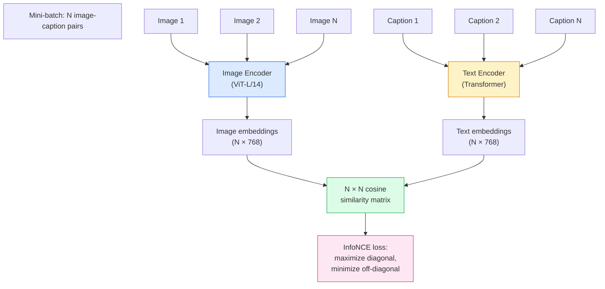

# Open-Vocabulary Vision — CLIP

## Learning Objectives

1. Implement zero-shot image classification by encoding images and text prompts through CLIP's dual encoders and computing cosine similarity.
2. Compute contrastive loss (InfoNCE) on a toy batch of embeddings and verify that matched pairs produce lower loss than mismatched pairs.
3. Configure text prompt templates ("a photo of a {label}", "a screenshot of a {label}") and measure their effect on classification accuracy across a custom taxonomy.
4. Build a batch inference pipeline that processes a directory of images against a shared label set and exports results to CSV.
5. Evaluate CLIP's zero-shot limitations on domain-specific imagery by comparing similarity scores across in-distribution and out-of-distribution visual concepts.

## The Problem

A standard ImageNet classifier outputs one of 1000 fixed labels. If you need label 1001 — "a screenshot of a B2B SaaS pricing page" — you need hundreds of labeled examples and a retrained classification head. The vocabulary is closed at training time, and every new category requires a supervised dataset.

This constraint breaks down in go-to-market workflows. Company websites, product screenshots, and logos span thousands of visual patterns that shift constantly. A B2B SaaS dashboard looks different from an e-commerce storefront, which looks different from a restaurant landing page. Building a separate classifier for each visual category — with labeled training data for each — does not scale across a pipeline that processes thousands of companies.

CLIP (Contrastive Language-Image Pre-training, Radford et al. 2021) sidesteps this by training a vision encoder and a text encoder jointly on 400 million image-caption pairs scraped from the web. The model never sees an explicit classification head. Instead, it learns a shared embedding space where images and their textual descriptions land near each other. At inference time, you describe any category in natural language, encode that description, and compare it to the image embedding. No retraining, no labeled dataset, no fixed vocabulary. You add a category by writing a sentence.

## The Concept

CLIP uses a dual-encoder architecture — often called a "two-tower" model. One tower is a vision encoder (ViT or ResNet) that converts an image into a dense vector. The other tower is a text encoder (a transformer) that converts a caption into a dense vector of the same dimensionality. Both towers end with a linear projection that maps their outputs into a shared embedding space, typically 512 or 768 dimensions.

Training uses contrastive loss, specifically a variant called InfoNCE. Given a mini-batch of N image-caption pairs, the model computes the cosine similarity between every image and every text embedding in the batch — producing an N×N similarity matrix. The training objective pushes the N diagonal entries (true matches) toward similarity 1 and the N²−N off-diagonal entries (mismatches) toward similarity 0. For a batch size of 32,768 (which CLIP used), each image has 1 positive and 32,767 negatives. The loss is symmetric: it optimizes image-to-text and text-to-image directions simultaneously.



The key insight is that contrastive learning over web-scale image-caption pairs produces a space where semantic relationships transfer to unseen categories. A photo of a "dog" lands near the text "a photo of a dog" even if that specific (image, caption) pair was never in the training set, because the model learned visual-textual correspondences at scale. At inference, zero-shot classification works by encoding K candidate text descriptions ("a photo of a cat", "a photo of a dog", "a photo of a car"), encoding the image, computing cosine similarities, and taking the argmax. The softmax temperature from training (typically learned, around 0.01–0.07) calibrates the distribution.

One critical detail: the text prompt template matters. "dog" as a bare token sequence performs worse than "a photo of a dog" because CLIP's training captions tend to be full sentences. The template acts as a prior that matches the training distribution. This is why prompt engineering matters even for a model with no fine-tuning.

## Build It

Load a pre-trained CLIP checkpoint, encode an image alongside candidate text prompts, and compute cosine similarities. The model we are using is `openai/clip-vit-base-patch32` — a ViT-B/32 variant with a 512-dimensional embedding space. It downloads from Hugging Face on first run (~600 MB).

```python
import torch
from transformers import CLIPProcessor, CLIPModel
from PIL import Image
import requests
from io import BytesIO

model_id = "openai/clip-vit-base-patch32"
model = CLIPModel.from_pretrained(model_id)
processor = CLIPProcessor.from_pretrained(model_id)

image_url = "http://images.cocodataset.org/val2017/000000039769.jpg"
response = requests.get(image_url, timeout=10)
image = Image.open(BytesIO(response.content))

print(f"Image size: {image.size}")
print(f"Image mode: {image.mode}")

candidate_labels = [
    "a photo of a cat",
    "a photo of a dog",
    "a photo of a car",
    "a photo of a person",
    "a photo of a remote control",
    "a photo of furniture"
]

inputs = processor(
    text=candidate_labels,
    images=image,
    return_tensors="pt",
    padding=True
)

with torch.no_grad():
    outputs = model(**inputs)

logits_per_image = outputs.logits_per_image
probs = logits_per_image.softmax(dim=1)

ranked = sorted(
    zip(candidate_labels, probs[0].tolist()),
    key=lambda x: x[1],
    reverse=True
)

print("\n--- Zero-Shot Classification Results ---")
for label, prob in ranked:
    print(f"  {label:<30s}  {prob:.4f}")

print(f"\nPredicted: {ranked[0][0]} ({ranked[0][1]:.2%})")
```

The `logits_per_image` output is already scaled by the learned temperature parameter — it is not raw cosine similarity. To get raw cosine similarities, you would extract `outputs.image_embeds` and `outputs.text_embeds`, L2-normalize them, and compute the dot product manually. Let's do that to see the underlying geometry:

```python
import torch.nn.functional as F

with torch.no_grad():
    image_embeds = model.get_image_features(pixel_values=inputs["pixel_values"])
    text_embeds = model.get_text_features(
        input_ids=inputs["input_ids"],
        attention_mask=inputs["attention_mask"]
    )

image_embeds_norm = F.normalize(image_embeds, dim=1)
text_embeds_norm = F.normalize(text_embeds, dim=1)

raw_cosine = (image_embeds_norm @ text_embeds_norm.T).squeeze(0)

print("--- Raw Cosine Similarities (pre-temperature) ---")
for label, sim in zip(candidate_labels, raw_cosine.tolist()):
    print(f"  {label:<30s}  {sim:.4f}")

temperature = model.logit_scale.exp().item()
print(f"\nLearned temperature (1/tau): {temperature:.2f}")
print(f"Effective tau: {1/temperature:.6f}")
```

Now let's implement the InfoNCE contrastive loss from scratch to see exactly what CLIP optimizes during training. We create a toy batch of 4 image-text pairs, compute the symmetric loss, and compare matched vs. mismatched embeddings:

```python
import torch
import torch.nn.functional as F

def clip_contrastive_loss(image_features, text_features, temperature=0.07):
    image_norm = F.normalize(image_features, dim=1)
    text_norm = F.normalize(text_features, dim=1)
    
    logits_per_image = (image_norm @ text_norm.T) / temperature
    logits_per_text = logits_per_image.T
    
    labels = torch.arange(logits_per_image.shape[0])
    
    loss_i2t = F.cross_entropy(logits_per_image, labels)
    loss_t2i = F.cross_entropy(logits_per_text, labels)
    
    return (loss_i2t + loss_t2i) / 2

torch.manual_seed(42)
batch_size = 4
embed_dim = 512

base_images = torch.randn(batch_size, embed_dim)
matched_texts = base_images + 0.05 * torch.randn(batch_size, embed_dim)
mismatched_texts = torch.randn(batch_size, embed_dim)

loss_matched = clip_contrastive_loss(base_images, matched_texts, temperature=0.07)
loss_mismatched = clip_contrastive_loss(base_images, mismatched_texts, temperature=0.07)

print("--- Contrastive Loss Comparison ---")
print(f"  Matched pairs loss:    {loss_matched.item():.4f}")
print(f"  Mismatched pairs loss: {loss_mismatched.item():.4f}")
print(f"  Difference:            {(loss_mismatched - loss_matched).item():.4f}")

print("\n--- Effect of Temperature ---")
for temp in [0.01, 0.07, 0.1, 0.5, 1.0]:
    l_match = clip_contrastive_loss(base_images, matched_texts, temperature=temp).item()
    l_mismatch = clip_contrastive_loss(base_images, mismatched_texts, temperature=temp).item()
    print(f"  temp={temp:<5.2f}  matched={l_match:.4f}  mismatched={l_mismatch:.4f}  gap={l_mismatch - l_match:.4f}")
```

Lower temperature sharpens the softmax, amplifying the penalty for any given similarity gap. This is why CLIP learns a temperature parameter during training rather than fixing it — the model needs to calibrate how aggressively to push negatives away.

## Use It

Zero-shot visual classification maps directly to the enrichment waterfall stage of a GTM data pipeline. The Clay waterfall pattern — Find → Enrich → Transform → Export — often needs to categorize visual assets: company website screenshots, logo styles, product imagery, social media graphics. Traditional approaches require a supervised image classifier trained on hundreds of labeled examples per category. CLIP replaces that with a single model that accepts any label taxonomy expressed as text prompts.

Consider a concrete pipeline: you have 5,000 company domains. You crawl each homepage, take a screenshot, and need to classify the company into a visual taxonomy — "e-commerce storefront", "SaaS dashboard", "blog/content site", "restaurant/food", "landing page with hero image". With CLIP, you encode each screenshot once, encode each taxonomy label as a text prompt, compute cosine similarities, and assign the highest-scoring label. No training data, no fine-tuning, no per-category model.

```python
import torch
from transformers import CLIPProcessor, CLIPModel
from PIL import Image
import requests
from io import BytesIO
import csv

model = CLIPModel.from_pretrained("openai/clip-vit-base-patch32")
processor = CLIPProcessor.from_pretrained("openai/clip-vit-base-patch32")

company_taxonomy = {
    "ecommerce": "a screenshot of an e-commerce online store with product listings",
    "saas_dashboard": "a screenshot of a SaaS software dashboard with charts and data",
    "content_blog": "a screenshot of a blog or news website with articles",
    "restaurant": "a screenshot of a restaurant website with food menu",
    "agency": "a screenshot of a marketing agency website with services",
    "portfolio": "a screenshot of a personal portfolio website"
}

text_inputs = processor(
    text=list(company_taxonomy.values()),
    return_tensors="pt",
    padding=True,
    truncation=True
)

with torch.no_grad():
    text_embeds = model.get_text_features(**text_inputs)
    text_embeds = torch.nn.functional.normalize(text_embeds, dim=1)

sample_urls = [
    ("example-company-1", "http://images.cocodataset.org/val2017/000000039769.jpg"),
    ("example-company-2", "http://images.cocodataset.org/val2017/000000000725.jpg"),
]

results = []

for company_name, url in sample_urls:
    try:
        resp = requests.get(url, timeout=10)
        img = Image.open(BytesIO(resp.content)).convert("RGB")
        
        img_inputs = processor(images=img, return_tensors="pt")
        
        with torch.no_grad():
            img_embeds = model.get_image_features(**img_inputs)
            img_embeds = torch.nn.functional.normalize(img_embeds, dim=1)
        
        similarities = (img_embeds @ text_embeds.T).squeeze(0)
        best_idx = similarities.argmax().item()
        best_label = list(company_taxonomy.keys())[best_idx]
        best_score = similarities[best_idx].item()
        
        results.append({
            "company": company_name,
            "predicted_category": best_label,
            "confidence": f"{best_score:.4f}",
            "all_scores": "; ".join(
                f"{k}={v:.3f}" for k, v in
                zip(company_taxonomy.keys(), similarities.tolist())
            )
        })
        
        print(f"\n{company_name}:")
        print(f"  Predicted: {best_label} (cosine={best_score:.4f})")
        for cat, score in zip(company_taxonomy.keys(), similarities.tolist()):
            print(f"    {cat:<20s} {score:.4f}")
    except Exception as e:
        print(f"  {company_name}: FAILED - {e}")

with open("company_classifications.csv", "w", newline="") as f:
    writer = csv.DictWriter(f, fieldnames=["company", "predicted_category", "confidence", "all_scores"])
    writer.writeheader()
    writer.writerows(results)

print(f"\nExported {len(results)} classifications to company_classifications.csv")
```

The output CSV plugs directly into the Transform stage of the enrichment waterfall — each company row now has a `predicted_category` column that downstream logic can use for segmentation, routing, or scoring. The enrichment waterfall's value proposition is automating data gathering across thousands of records; CLIP's value proposition is extending that automation to visual data without a custom ML training step. [CITATION NEEDED — concept: CLIP used in enrichment waterfall for visual company data classification]

The prompt template you choose for the taxonomy labels affects accuracy. "a screenshot of a SaaS dashboard" will score differently than "SaaS dashboard" or "a website that sells software". This is the same mechanism as the COCO caption distribution: CLIP was trained on full sentences, so full-sentence prompts match the training distribution better. You should test multiple templates on a small labeled set before running the full pipeline.

## Ship It

Production deployment of CLIP requires three engineering decisions: image preprocessing, batch strategy, and similarity thresholding.

**Preprocessing** is non-negotiable. CLIP's image encoder expects 224×224 RGB images normalized with the mean and standard deviation from its training distribution. The `CLIPProcessor` handles resize + center-crop + normalize, but if you bypass it (for speed or custom pipelines), you must replicate the exact transforms. A mismatch in normalization shifts embeddings enough to break zero-shot accuracy silently — predictions look reasonable but confidence scores collapse.

**Batching** is where latency gets managed. GPU inference on a single image takes ~5–15ms with ViT-B/32. CPU inference takes ~150–200ms per image. For a 5,000-company enrichment run, that is the difference between 1 minute and 15 minutes. Batch the image encodings (8–32 images per forward pass) and pre-compute text embeddings once per taxonomy, not per image:

```python
import torch
from transformers import CLIPProcessor, CLIPModel
from PIL import Image
import requests
from io import BytesIO
import time
import os

device = "cuda" if torch.cuda.is_available() else "cpu"
print(f"Device: {device}")

model = CLIPModel.from_pretrained("openai/clip-vit-base-patch32").to(device)
model.eval()
processor = CLIPProcessor.from_pretrained("openai/clip-vit-base-patch32")

taxonomy_labels = [
    "a screenshot of an e-commerce store",
    "a screenshot of a SaaS dashboard",
    "a screenshot of a blog",
    "a screenshot of a restaurant website",
    "a screenshot of a corporate landing page"
]

with torch.no_grad():
    text_inputs = processor(text=taxonomy_labels, return_tensors="pt", padding=True, truncation=True).to(device)
    text_embeds = model.get_text_features(**text_inputs)
    text_embeds = torch.nn.functional.normalize(text_embeds, dim=1)

test_urls = [
    f"http://images.cocodataset.org/val2017/{str(i).zfill(12)}.jpg"
    for i in range(39769, 39769 + 50)
]

batch_size = 16
all_images = []
valid_meta = []

for idx, url in enumerate(test_urls):
    try:
        resp = requests.get(url, timeout=10)
        img = Image.open(BytesIO(resp.content)).convert("RGB")
        all_images.append(img)
        valid_meta.append(idx)
    except Exception:
        pass

print(f"Downloaded {len(all_images)} images, skipping {len(test_urls) - len(all_images)} failures")

warmup_inputs = processor(images=all_images[:2], return_tensors="pt").to(device)
with torch.no_grad():
    _ = model.get_image_features(**warmup_inputs)

total_start = time.time()
all_results = []

for i in range(0, len(all_images), batch_size):
    batch = all_images[i:i + batch_size]
    batch_start = time.time()
    
    with torch.no_grad():
        img_inputs = processor(images=batch, return_tensors="pt").to(device)
        img_embeds = model.get_image_features(**img_inputs)
        img_embeds = torch.nn.functional.normalize(img_embeds, dim=1)
        
        similarities = img_embeds @ text_embeds.T
        probs = (similarities * model.logit_scale.exp()).softmax(dim=-1)
        
        batch_time = time.time() - batch_start
        per_image_ms = (batch_time / len(batch)) * 1000
        
        for j in range(len(batch)):
            best_idx = probs[j].argmax().item()
            score = probs[j][best_idx].item()
            all_results.append({
                "image_idx": valid_meta[i + j],
                "category": taxonomy_labels[best_idx],
                "confidence": f"{score:.4f}",
                "batch_time_ms": f"{per_image_ms:.1f}"
            })
    
    print(f"  Batch {i//batch_size + 1}: {len(batch)} images in {batch_time:.2f}s ({per_image_ms:.1f}ms/img)")

total_time = time.time() - total_start
print(f"\nTotal: {len(all_results)} images in {total_time:.2f}s")
print(f"Average: {(total_time / len(all_results)) * 1000:.1f}ms per image")
print(f"\nSample predictions:")
for r in all_results[:5]:
    print(f"  Image {r['image_idx']}: {r['category']} ({r['confidence']}) [{r['batch_time_ms']}ms/img]")
```

**Thresholding** determines what gets flagged for review. A softmax confidence of 0.35 across five categories means the model is uncertain — the top prediction barely edges out the others. Set a minimum confidence threshold (typically 0.4–0.6 for 5-category taxonomies) and route low-confidence predictions to manual review or a fallback enrichment step. This is the same score-and-qualify logic used elsewhere in the Clay waterfall: confidence below threshold means the record needs another enrichment source or human review.

The enrichment waterfall pattern — Find → Enrich → Transform → Export — treats CLIP as one stage in a multi-step pipeline. If CLIP's confidence is low, the waterfall continues to the next enrichment source (e.g., text-based classification of the HTML, or a third-party API). CLIP is not the final arbiter; it is one signal in a waterfall of signals, and its contribution is weighted by confidence. [CITATION NEEDED — concept: enrichment waterfall with confidence-based fallback]

## Exercises

**Exercise 1 (Easy):** Load the CLIP model and classify a single image of your choice against three custom text prompts you write yourself. Print the cosine similarity score for each prompt and the predicted label. Vary the prompt template — try both bare nouns ("dog") and full sentences ("a photo of a dog in a park") — and observe how the similarity scores shift.

**Exercise 2 (Medium):** Write a function `classify_image_directory(image_dir, label_taxonomy, output_csv)` that takes a directory of image files, a dictionary of label-to-prompt mappings, and an output CSV path. The function should load each image, compute CLIP zero-shot classification, and write results (filename, predicted_label, confidence, all_scores) to the CSV. Include error handling for corrupted or unreadable images, and print a summary of category distribution at the end.

**Exercise 3 (Hard):** Implement the symmetric InfoNCE contrastive loss function from scratch (without using `F.cross_entropy`) on a toy batch of 8 image-text embedding pairs. Then verify your implementation against PyTorch's built-in version by computing both on the same input and confirming they produce identical values. Next, compute the loss on (a) a batch where image and text embeddings are identical, (b) a batch where they are orthogonal, and (c) a batch where they are randomly initialized. Explain the gradient direction the loss implies for each case.

## Key Terms

**Contrastive Loss (InfoNCE):** A loss function that operates on a batch of positive pairs by maximizing the similarity of matched pairs relative to all other (negative) pairs in the batch. Used by CLIP, SimCLR, and many self-supervised methods. The "InfoNCE" name comes from its connection to noise-contrastive estimation and mutual information lower bounds.

**Zero-Shot Classification:** Predicting a class label for an input without ever training on labeled examples of that class. In CLIP, this works by encoding candidate text descriptions and comparing them to the image embedding via cosine similarity. The model has never seen an explicit "category X" label — it has only seen image-caption pairs.

**Dual-Encoder (Two-Tower) Architecture:** A model design with two separate encoders — one for each modality (e.g., vision and language) — that project inputs into a shared embedding space. CLIP, ALIGN, and SigLIP all use this design. Contrast with cross-attention models (like ViLBERT) that fuse modalities before encoding.

**Prompt Template:** A text format applied to candidate labels during zero-shot classification. "a photo of a {label}" is the canonical CLIP template. The template acts as a prior matching the training caption distribution and measurably affects accuracy.

**Temperature (τ):** A scalar that controls the sharpness of the softmax in contrastive loss. Lower temperature = sharper distribution = stronger penalty for small similarity differences. CLIP learns this parameter during training; it typically converges to ~0.01 (equivalent to τ ≈ 100 in the similarity scaling).

**Enrichment Waterfall:** A GTM pipeline pattern where data about a target entity (company, person) is gathered through a sequence of sources, each filling fields the previous source could not. The Clay waterfall implements this as Find → Enrich → Transform → Export. CLIP fits into the Enrich stage when visual data (screenshots, logos) needs categorization.

## Sources

- Radford, A. et al. "Learning Transferable Visual Models From Natural Language Supervision." ICML 2021. — Original CLIP paper describing contrastive training on 400M image-text pairs, dual-encoder architecture, and zero-shot transfer. [arXiv:2103.00020]
- CLIP Model Card, OpenAI / Hugging Face. — `openai/clip-vit-base-patch32` checkpoint details, preprocessing specifications (224×224, ImageNet normalization). [huggingface.co/openai/clip-vit-base-patch32]
- [CITATION NEEDED — concept: CLIP used in enrichment waterfall for visual company data classification in GTM pipelines]
- [CITATION NEEDED — concept: enrichment waterfall with confidence-based fallback, Clay waterfall pattern Find → Enrich → Transform → Export]
- Zone table row: Zone 04, Data pipelines/ETL, Enrichment Waterfalls (1.2 tooling), Score & Qualify stage.