# OCR & Document Understanding

## Learning Objectives

- Trace the classical OCR pipeline (detect → recognise → layout) and compare it against modern end-to-end approaches (Donut, Qwen-VL-OCR).
- Implement text extraction with Tesseract and PaddleOCR, including preprocessing steps (grayscale, threshold, deskew) and confidence scoring.
- Reconstruct reading order from bounding-box output using `image_to_data()` spatial coordinates.
- Build a structured-field extractor that converts raw OCR text into JSON with named fields (vendor, date, total).
- Distinguish OCR, layout parsing, and document understanding — and select the appropriate tool per task.

## The Problem

You have 500 scanned vendor invoices. Each one has a company name, total amount, date, and line items. Manual re-entry is 30 seconds per invoice — over 4 hours of tedium that no one will do carefully past invoice 40. OCR converts image pixels into text; document understanding converts that text into structured fields you can write to a database. These are not the same problem, and the gap between them is where most automation attempts stall.

The field splits into three layers that are often conflated. **OCR proper** turns pixels into characters. **Layout parsing** groups those characters into regions — title, body, table, header — using spatial position and whitespace. **Document understanding** maps those regions to semantic fields: this string is the invoice total, that string is the vendor address. Each layer has classical and modern approaches, and skipping a layer produces text you cannot use without a human reading it.

In a GTM context, this gap is concrete. A signed contract arrives as a PDF attachment. You need the counterparty legal name, the contract value, and the signature date to create a deal record. Raw OCR gives you 4,000 characters of unstructured text. Document understanding gives you `{"counterparty": "Acme Corp", "value": 42000, "signed_date": "2024-03-15"}`. Only the second payload can be written to Salesforce without a human in the loop.

## The Concept

The classical OCR pipeline has four stages executed sequentially: image preprocessing, text region detection, character recognition, and post-processing correction. Preprocessing cleans the image — grayscale conversion, binarization (thresholding), deskew correction, noise removal — because recognition accuracy degrades sharply on rotated, low-contrast, or noisy scans. Detection then finds bounding boxes around text regions. Recognition classifies the pixels within each box as characters using a CNN or transformer. Post-processing applies spell correction, language models, or regex constraints to fix predictable errors.

```mermaid
flowchart LR
    IMG["Image"] --> PRE["Preprocess<br/>(grayscale, threshold, deskew)"]
    PRE --> DET["Text detection<br/>(DB, EAST, CRAFT)"]
    DET --> BOX["Word/line<br/>bounding boxes"]
    BOX --> CROP["Crop each region"]
    CROP --> REC["Recognition<br/>(CRNN + CTC)"]
    REC --> TXT["Raw text strings"]
    TXT --> LAY["Layout<br/>ordering"]
    LAY --> POST["Post-processing<br/>(spellcheck, regex)"]
    POST --> OUT["Structured output"]

    style DET fill:#dbeafe,stroke:#2563eb
    style REC fill:#fef3c7,stroke:#d97706
    style OUT fill:#dcfce7,stroke:#16a34a
```



Recognition models for classical OCR use **Connectionist Temporal Classification (CTC)** loss, which solves the alignment problem: the model produces a sequence of character predictions at each timestep, but there is no labels-to-timesteps mapping. CTC handles this by allowing "blank" tokens between characters and collapsing repeated predictions. A model predicting `[-, t, t, -, o, t, -, a, l]` (where `-` is blank) collapses to `total`. This is why CRNN architectures work for OCR without needing character-level bounding box annotations during training.

Modern document understanding models — LayoutLM, Donut, Qwen-VL-OCR — merge these stages or replace them entirely. LayoutLM adds 2D position embeddings to BERT-style token representations, so the model learns that text at coordinates (x=720, y=1050) on an 8.5×11 page is likely a total amount. Donut skips OCR altogether: it takes the image directly and outputs structured JSON via an autoregressive decoder. These models encode layout context during pretraining rather than treating it as a post-hoc grouping step.

The practical distinction matters. Tesseract is fast, free, and runs locally, but produces raw text — you must parse structure yourself. Cloud APIs (AWS Textract, Google Document AI, Azure Form Recognizer) handle layout and field extraction but cost per page and send data to a third party. End-to-end models like Donut give you structured output but require GPU inference and model-specific fine-tuning for new document types. The right choice depends on document volume, layout variability, latency constraints, and data sensitivity — not on which tool is "better."

## Build It

Start with Tesseract. It implements the classical pipeline: detection finds character and word bounding boxes, recognition classifies glyphs within those boxes, and post-processing applies language-model corrections. The `pytesseract` Python wrapper exposes both raw text extraction and structured data with coordinates.

```python
import subprocess
import sys

try:
    import pytesseract
    from PIL import Image, ImageOps, ImageFilter
    import numpy as np
except ImportError:
    subprocess.check_call([sys.executable, "-m", "pip", "install", "pytesseract", "Pillow", "numpy"])
    import pytesseract
    from PIL import Image, ImageOps, ImageFilter
    import numpy as np

image = Image.new("RGB", (400, 100), "white")
from PIL import ImageDraw
draw = ImageDraw.Draw(image)
draw.text((20, 30), "Invoice Total: $4,200.00", fill="black")
draw.text((20, 55), "Date: 2024-03-15", fill="black")

raw_text = pytesseract.image_to_string(image)
print("RAW TEXT OUTPUT:")
print(repr(raw_text))

data = pytesseract.image_to_data(image, output_type=pytesseract.Output.DICT)
print("\nWORD-LEVEL DATA:")
for i, word in enumerate(data["text"]):
    if word.strip():
        print(f"  '{word}' conf={data['conf'][i]} x={data['left'][i]} y={data['top'][i]} w={data['width'][i]} h={data['height'][i]}")
```

Preprocessing is where most accuracy gains come from on real-world scans. Grayscale removes color noise. Otsu's threshold converts to pure black-and-white, which sharpens character edges. Deskew corrects rotation — a 2-degree tilt can drop recognition accuracy by 15% or more. Here is a before-and-after comparison on a degraded image:

```python
import math

degraded = Image.new("RGB", (400, 100), "white")
draw2 = ImageDraw.Draw(degraded)
draw2.text((20, 30), "Invoice Total: $4,200.00", fill="gray")
draw2.text((20, 55), "Date: 2024-03-15", fill="gray")
degraded = degraded.rotate(2, fillcolor="white", expand=False)

raw_degraded = pytesseract.image_to_string(degraded).strip()
print("DEGRADED (no preprocessing):")
print(repr(raw_degraded))

gray = ImageOps.grayscale(degraded)
threshold = gray.point(lambda x: 0 if x < 128 else 255, "1")
processed_text = pytesseract.image_to_string(threshold).strip()
print("\nPROCESSED (grayscale + threshold):")
print(repr(processed_text))

if raw_degraded and processed_text:
    chars_before = len([c for c in raw_degraded if c.isalnum()])
    chars_after = len([c for c in processed_text if c.isalnum()])
    print(f"\nAlphanumeric chars: {chars_before} -> {chars_after}")
```

Layout-aware extraction uses the bounding box data from `image_to_data()` to reconstruct reading order and identify structural regions. A "total" field on an invoice is typically at the bottom-right. A "date" is typically top-right. A "vendor name" is typically top-left. You can use these spatial heuristics to extract fields without any ML:

```python
import json

invoice = Image.new("RGB", (600, 400), "white")
draw3 = ImageDraw.Draw(invoice)
draw3.text((30, 30), "ACME CORP", fill="black")
draw3.text((450, 30), "Date: 2024-03-15", fill="black")
draw3.text((30, 80), "123 Business Ave", fill="black")
draw3.text((30, 100), "Suite 100", fill="black")
draw3.text((30, 300), "Subtotal: $4,000.00", fill="black")
draw3.text((30, 320), "Tax: $200.00", fill="black")
draw3.text((400, 350), "TOTAL: $4,200.00", fill="black")

data = pytesseract.image_to_data(invoice, output_type=pytesseract.Output.DICT)

words = []
for i, txt in enumerate(data["text"]):
    if txt.strip():
        words.append({
            "text": txt,
            "x": data["left"][i],
            "y": data["top"][i],
            "w": data["width"][i],
            "h": data["height"][i],
            "conf": int(data["conf"][i])
        })

words.sort(key=lambda w: (w["y"] // 20, w["x"]))

print("READING ORDER RECONSTRUCTION:")
line_y = None
current_line = []
for w in words:
    if line_y is None or abs(w["y"] - line_y) < 15:
        current_line.append(w["text"])
        line_y = w["y"] if line_y is None else line_y
    else:
        print(f"  y={line_y}: {' '.join(current_line)}")
        current_line = [w["text"]]
        line_y = w["y"]
if current_line:
    print(f"  y={line_y}: {' '.join(current_line)}")

page_width = 600
page_height = 400
regions = {
    "vendor_zone": [w for w in words if w["x"] < page_width * 0.4 and w["y"] < page_height * 0.3],
    "date_zone": [w for w in words if w["x"] > page_width * 0.6 and w["y"] < page_height * 0.3],
    "total_zone": [w for w in words if w["x"] > page_width * 0.5 and w["y"] > page_height * 0.7],
}

print("\nSPATIAL FIELD EXTRACTION:")
for zone_name, zone_words in regions.items():
    text = " ".join(w["text"] for w in zone_words)
    print(f"  {zone_name}: {text}")
```

Now chain it into structured extraction — the step that turns OCR output into something a CRM can consume:

```python
import re

ocr_text = """
ACME CORP
123 Business Ave, Suite 100
Date: 2024-03-15

Invoice #INV-0042

Subtotal: $4,000.00
Tax: $200.00
TOTAL: $4,200.00
"""

invoice_fields = {}

vendor_match = re.search(r'^([A-Z][A-Z\s&]+(?:CORP|INC|LLC|LTD))', ocr_text.strip(), re.MULTILINE)
invoice_fields["vendor"] = vendor_match.group(1).strip() if vendor_match else None

date_match = re.search(r'(\d{4}-\d{2}-\d{2})', ocr_text)
invoice_fields["date"] = date_match.group(1) if date_match else None

total_match = re.search(r'TOTAL:?\s*\$([\d,]+\.\d{2})', ocr_text)
invoice_fields["total"] = total_match.group(1) if total_match else None

inv_match = re.search(r'Invoice\s*#?\s*([A-Z]+-\d+)', ocr_text)
invoice_fields["invoice_number"] = inv_match.group(1) if inv_match else None

print("STRUCTURED EXTRACTION OUTPUT:")
print(json.dumps(invoice_fields, indent=2))
```

## Use It

In a GTM enrichment pipeline (Zone 4 — the Clay waterfall pattern: Find → Enrich → Transform → Export), inbound documents are an enrichment source that most teams ignore. Signed contracts arrive with counterparty legal names. Vendor invoices contain billing addresses and amounts. Scanned business cards from trade shows have names, titles, and emails. PDF purchase orders specify product quantities and deal values. Each of these documents contains structured data that should reach your CRM — but only if you can convert pixels to fields reliably.

The pipeline pattern is: a document arrives via email webhook or form upload → OCR extracts text → layout parsing identifies regions → structured extraction maps regions to fields → the JSON payload enters a Clay enrichment waterfall or goes directly to the CRM API. The enrichment waterfall step matters because OCR output is noisy. A vendor name extracted as "ACNE CORP" instead of "ACME CORP" will fail a Salesforce lookup. Running the extracted name through Clay's data enrichment providers (clearing on domain match, employee count, or industry) catches OCR errors that would otherwise create duplicate or orphaned records.

For a purchase order intake specifically: OCR the PDF, extract the buyer company name and purchase amount, use those fields as enrichment inputs (domain lookup → ICP fit score → routing to correct AE), and write the result to Salesforce as a new opportunity. The OCR step is upstream of scoring and routing — garbage text means garbage enrichment means garbage pipeline.

[CITATION NEEDED — concept: GTM enrichment pipeline for inbound document processing, Clay waterfall integration with OCR output]

## Ship It

**Easy:** Run Tesseract OCR on three test images — a clean scan, a rotated scan, and a low-contrast photo. Print the raw text output and confidence scores for each. Report which preprocessing step would fix each failure mode.

```python
import pytesseract
from PIL import Image, ImageDraw, ImageOps

def make_test_image(label, rotation=0, contrast=0):
    img = Image.new("RGB", (400, 80), "white")
    draw = ImageDraw.Draw(img)
    fill_color = "black" if contrast == 0 else "gray"
    draw.text((20, 25), label, fill=fill_color)
    if rotation:
        img = img.rotate(rotation, fillcolor="white", expand=False)
    return img

test_cases = [
    ("Invoice: $4,200.00", make_test_image("Invoice: $4,200.00")),
    ("Invoice: $4,200.00", make_test_image("Invoice: $4,200.00", rotation=3)),
    ("Invoice: $4,200.00", make_test_image("Invoice: $4,200.00", contrast=1)),
]

for label, img in test_cases:
    text = pytesseract.image_to_string(img).strip()
    data = pytesseract.image_to_data(img, output_type=pytesseract.Output.DICT)
    confs = [int(c) for c in data["conf"] if int(c) > 0]
    avg_conf = sum(confs) / len(confs) if confs else 0
    print(f"Image: '{label}'")
    print(f"  OCR result: {repr(text)}")
    print(f"  Avg confidence: {avg_conf:.1f}")
    print()
```

**Medium:** Build a function that takes an image path, applies grayscale + Otsu threshold, runs OCR, reconstructs reading order from bounding boxes, and returns a JSON payload with vendor name, date, and total extracted via spatial heuristics and regex. Test it on a generated invoice image and print the structured output.

**Hard:** Build a document intake webhook (using Flask or FastAPI) that accepts a PDF attachment, converts each page to an image with `pdf2image`, runs OCR, extracts fields, and emits a JSON payload structured for a Clay enrichment waterfall input. Include error handling for unreadable scans, confidence thresholds below which the document is flagged for human review, and logging of extraction latency per page.

## Exercises

1. **Preprocessing sweep.** Take a single invoice image and run OCR under five conditions: no preprocessing, grayscale only, grayscale + threshold, grayscale + threshold + deskew, and grayscale + threshold + deskew + noise removal. Print character-level accuracy (against ground truth text) for each. Identify which step produces the largest single accuracy gain.

2. **Reading order challenge.** Create a two-column document image where the left column says "SHIP TO" and the right column says "BILL TO," each followed by an address. Run `image_to_data()` and reconstruct the columns using x-coordinates. Print each column's text separately. The naive left-to-right reading order will interleave the columns — fix it using a column-detection heuristic based on x-coordinate gaps.

3. **Field extraction robustness.** Take the regex-based invoice extractor from Build It and run it against five variations of OCR output where the format differs: "TOTAL: $4,200.00", "Total Due: $4,200", "AMOUNT DUE $4,200.00", "Balance: 4200.00", and "T0TAL: $4,200.00" (OCR error with zero instead of O). Write regex patterns that handle all five. Report which patterns failed and why.

4. **End-to-end document pipeline.** Write a function that accepts a PIL Image of an invoice, applies preprocessing, runs OCR, extracts fields via spatial heuristics + regex, and returns a JSON payload with `vendor`, `date`, `total`, and `confidence` (average of per-field confidence scores). The function should return `confidence: null` for any field it cannot extract, and the overall confidence should be the mean of non-null fields only.

## Key Terms

- **OCR (Optical Character Recognition):** Converting image pixels of text into machine-readable character strings. The first layer of any document pipeline.
- **CTC (Connectionist Temporal Classification):** A loss function for training sequence models without aligned input-output pairs. Collapses repeated predictions and blank tokens into final output. Used in CRNN-based OCR recognition.
- **Layout parsing:** Grouping OCR text output into structural regions (title, body, table, header) using spatial coordinates, whitespace, and font cues. The second layer between raw OCR and document understanding.
- **Document understanding:** Mapping layout regions to semantic fields — "this string is the invoice total." Can use rule-based extraction, layout-aware models (LayoutLM), or end-to-end models (Donut).
- **Bounding box:** The rectangular coordinates (x, y, width, height) defining where a text region appears in an image. Used for reading-order reconstruction and spatial field extraction.
- **Otsu's threshold:** An algorithm that automatically selects the optimal binarization threshold by maximizing inter-class variance between foreground and background pixels.
- **Deskew:** The process of detecting and correcting image rotation. Even small angles (1-3 degrees) degrade OCR accuracy significantly because character glyph matching assumes horizontal text.
- **Enrichment waterfall:** A GTM pipeline pattern (Find → Enrich → Transform → Export) where multiple data providers are queried in sequence, each filling fields the previous could not. OCR output enters the "Find" stage as structured candidate data.

## Sources

- Tesseract OCR documentation and `pytesseract` API: https://github.com/madmaze/pytesseract — `image_to_string()` and `image_to_data()` methods, confidence scoring via DICT output.
- CTC loss mechanism: Graves et al., "Connectionist Temporal Classification: Labelling Unsegmented Sequence Data with Recurrent Neural Networks" (2006). Describes the blank-token collapse algorithm.
- LayoutLM architecture: Xu et al., "LayoutLM: Pre-training of Text and Layout for Document Image Understanding" (2019). Introduces 2D position embeddings merged with BERT token representations.
- Donut (Document Understanding Transformer): Kim et al., "OCR-free Document Understanding Transformer" (2021). Decoder directly generates structured JSON from image embeddings, bypassing explicit OCR.
- [CITATION NEEDED — concept: GTM enrichment pipeline for inbound document processing, Clay waterfall integration with OCR output — no located handbook reference tying document OCR to Zone 4 enrichment waterfall stage]