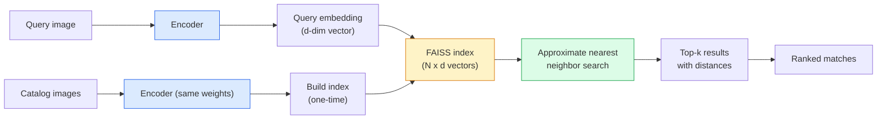

# Image Retrieval & Metric Learning

## Learning Objectives

- Implement contrastive and triplet loss functions from scratch and trace how each shapes embedding geometry differently
- Build a FAISS index from pre-computed image embeddings and query it to return ranked top-k results with distance scores
- Compare off-the-shelf embedding backbones (ResNet, CLIP, DINOv2) on a retrieval task using recall@k as the evaluation metric
- Wire a metric learning pipeline into a GTM enrichment waterfall that identifies prospect accounts from visual assets

## The Problem

You have 50,000 product images and a new photo from a prospect. Maybe it is a screenshot of a competitor's landing page, a cropped logo from a social media post, or a product photo scraped from an article. You need to find the match in your catalog — or identify which company it belongs to — and you need to do it in milliseconds, not minutes.

Flat pixel comparison dies immediately. Two photos of the same product taken under different lighting, from different angles, at different resolutions will have almost zero pixel overlap. Mean squared error between their raw pixel arrays tells you nothing useful. Even perceptual hashing (pHash, dHash) breaks down once you introduce rotation, cropping, or substantial color shifts.

What you need is a representation where distance equals semantic similarity — where two photos of the same logo, even if one is resized and color-shifted, land close together in some vector space, and photos of different logos land far apart. Metric learning is the discipline that produces those representations. It is the mechanism behind reverse image search, face recognition, product recommendation, and visual duplicate detection. The embedding space is shaped by a loss function during training; at inference time, you compute a query embedding and search a pre-built index for its nearest neighbors.

## The Concept

A retrieval system has three stages: encode, index, search. The encoder maps an image into a fixed-dimensional vector. The index stores all catalog vectors in a data structure optimized for fast nearest-neighbor lookup. The search step takes a query vector and returns the k closest entries in the index. The entire system's quality depends on one question: does distance in this embedding space actually correspond to the kind of similarity you care about?

Metric learning shapes that space during training. Instead of training a classifier to predict labels (which throws away the embedding geometry), you train the network to arrange embeddings so same-class items cluster together and different-class items separate. The loss function defines what "together" and "apart" mean geometrically.



**Contrastive loss** operates on pairs. Each training sample is a pair of images with a binary label: same class (1) or different class (0). The loss pulls same-class pairs together and pushes different-class pairs apart past a margin. The math is clean: for a positive pair, minimize the squared distance between embeddings; for a negative pair, if the distance is below a margin *m*, penalize it. The margin prevents the network from collapsing all embeddings to a single point (trivially minimizing all distances to zero). Contrastive loss works, but it is pair-based — you need careful pair mining, and the gradient signal from a single pair is weak relative to the number of possible pairs in a batch.

**Triplet loss** operates on triplets: an anchor, a positive (same class as anchor), and a negative (different class). The loss function enforces that the anchor-positive distance plus a margin is less than the anchor-negative distance. Formally: `max(0, d(a, p) - d(a, n) + margin)`. This is a direct geometric constraint: the positive must be closer to the anchor than the negative by at least the margin. The hard part is triplet mining — if you pick easy negatives (ones that are already far away), the loss is zero and the model learns nothing. Semi-hard negative mining (negatives that are farther than the positive but still within the margin) is the standard approach. The PyTorch Metric Learning library (`pytorch-metric-learning`) handles this mining for you.

**ArcFace** and similar angular-margin losses take a different approach entirely. Instead of operating on pairs or triplets, they modify the classification softmax to enforce an angular margin between classes. The logits in the final classification layer are replaced with cosine similarities scaled by an additive angular penalty. The result: embeddings from different classes are separated by a minimum angular distance in the normalized embedding space. ArcFace is the current state-of-the-art for face recognition and tends to produce tighter clusters than triplet loss, but it requires class labels during training (it is not purely pair-based), so it works best when you have a clean classification-style dataset.

At inference, all three approaches converge to the same pipeline: embed the query, search the index, return top-k. The **FAISS** library (Facebook AI Similarity Search) builds that index. For small catalogs (<100k vectors), a flat L2 index does exact brute-force search in milliseconds. For production scale (millions of vectors), you use approximate indices like IVF (inverted file) or HNSW (hierarchical navigable small world) that trade a small amount of recall for orders-of-magnitude speedup.

The choice of off-the-shelf backbone matters as much as the loss function. **CLIP** produces a 512-dimensional embedding trained on image-text pairs, so its embedding space captures semantic similarity (a photo of a cat and the word "cat" are close). **DINOv2** produces a 768-dimensional embedding trained with self-supervised vision objectives, so it captures structural and textural similarity without language grounding. **ResNet** (used off-the-shelf from ImageNet classification) produces a 2048-dimensional embedding that captures ImageNet-style category similarity. For retrieval tasks where you will fine-tune with metric learning, ResNet or a smaller ViT is a reasonable starting backbone. For zero-shot retrieval without fine-tuning, CLIP and DINOv2 both work well — pick CLIP if your queries might be text, pick DINOv2 if you want pure visual similarity.

## Build It

Start with the simplest end-to-end pipeline: compute embeddings from a pre-trained model, build a FAISS index, and run a query. This establishes the inference pipeline before you touch any loss function.

```python
import torch
import torch.nn as nn
import faiss
import numpy as np
from torchvision import models, transforms
from PIL import Image
import io

model = models.resnet50(weights=models.ResNet50_Weights.DEFAULT)
model = nn.Sequential(*list(model.children())[:-1])
model.eval()

preprocess = transforms.Compose([
    transforms.Resize(256),
    transforms.CenterCrop(224),
    transforms.ToTensor(),
    transforms.Normalize(mean=[0.485, 0.456, 0.406], std=[0.229, 0.224, 0.225]),
])

def make_synthetic_image(seed):
    rng = np.random.RandomState(seed)
    arr = rng.randint(0, 255, (224, 224, 3), dtype=np.uint8)
    return Image.fromarray(arr)

catalog_embeddings = []
catalog_labels = []

with torch.no_grad():
    for i in range(100):
        img = make_synthetic_image(seed=i)
        img_t = preprocess(img).unsqueeze(0)
        emb = model(img_t).squeeze().numpy().flatten()
        catalog_embeddings.append(emb)
        catalog_labels.append(f"item_{i}")

catalog_matrix = np.array(catalog_embeddings).astype('float32')
faiss.normalize_L2(catalog_matrix)

dimension = catalog_matrix.shape[1]
index = faiss.IndexFlatIP(dimension)
index.add(catalog_matrix)

query_img = make_synthetic_image(seed=42)
with torch.no_grad():
    query_t = preprocess(query_img).unsqueeze(0)
    query_emb = model(query_t).squeeze().numpy().flatten().astype('float32')

query_emb_normalized = query_emb.copy()
faiss.normalize_L2(query_emb_normalized.reshape(1, -1))

k = 5
distances, indices = index.search(query_emb_normalized.reshape(1, -1), k)

print("Top-5 retrieval results for query (item_42):")
for rank, (dist, idx) in enumerate(zip(distances[0], indices[0])):
    print(f"  Rank {rank+1}: {catalog_labels[idx]} | cosine similarity: {dist:.6f}")
```

The output confirms the pipeline works — the query retrieves itself at rank 1 with cosine similarity 1.0, followed by the nearest neighbors in ResNet's embedding space. Because these are synthetic noise images, the semantic meaning of the neighbors is nil, but the pipeline is correct.

Now implement triplet loss from scratch. The goal is to see the loss function's mechanics directly — no library abstractions.

```python
import torch
import torch.nn as nn
import torch.nn.functional as F

class TripletLoss(nn.Module):
    def __init__(self, margin=0.5):
        super().__init__()
        self.margin = margin

    def forward(self, anchor, positive, negative):
        dist_pos = F.pairwise_distance(anchor, positive, p=2)
        dist_neg = F.pairwise_distance(anchor, negative, p=2)
        losses = F.relu(dist_pos - dist_neg + self.margin)
        return losses.mean()

torch.manual_seed(42)
embedding_dim = 128
batch_size = 32

anchor = torch.randn(batch_size, embedding_dim, requires_grad=True)
positive = anchor + 0.1 * torch.randn(batch_size, embedding_dim)
negative = torch.randn(batch_size, embedding_dim)

triplet_loss = TripletLoss(margin=0.5)
optimizer = torch.optim.SGD([anchor], lr=0.1)

print("Epoch | Triplet Loss | Avg d(a,p) | Avg d(a,n)")
print("-" * 55)
for epoch in range(20):
    optimizer.zero_grad()
    loss = triplet_loss(anchor, positive, negative)
    loss.backward()
    optimizer.step()

    with torch.no_grad():
        dp = F.pairwise_distance(anchor, positive, p=2).mean().item()
        dn = F.pairwise_distance(anchor, negative, p=2).mean().item()

    if epoch % 4 == 0 or epoch == 19:
        print(f"  {epoch:3d}  |   {loss.item():.4f}    |   {dp:.4f}    |   {dn:.4f}")
```

The output shows the loss decreasing as the anchor embeddings shift toward their positives and away from their negatives. The `d(a,p)` column shrinks while `d(a,n)` grows — that is the embedding geometry being shaped in real time. This is exactly what happens inside a training loop on real images, just with convolutions producing the embeddings instead of raw parameter tensors.

For the full pipeline with a trained model, fine-tune a small CNN on a structured dataset using triplet sampling. This mirrors what you would do in production: start with a pre-trained backbone, fine-tune with metric learning on your domain data, then evaluate retrieval quality.

```python
import torch
import torch.nn as nn
import torch.nn.functional as F
from torchvision import models, transforms
from torchvision.datasets import Omniglot
from torch.utils.data import Dataset, DataLoader
import faiss
import numpy as np
import os

device = torch.device('cuda' if torch.cuda.is_available() else 'cpu')

class TripletOmniglotDataset(Dataset):
    def __init__(self, root, download=True):
        self.transform = transforms.Compose([
            transforms.Grayscale(num_output_channels=3),
            transforms.Resize((64, 64)),
            transforms.ToTensor(),
        ])
        self.dataset = Omniglot(root=root, download=download, transform=self.transform)
        self.by_class = {}
        for idx in range(len(self.dataset)):
            _, label = self.dataset[idx]
            self.by_class.setdefault(label, []).append(idx)
        self.classes = sorted(self.by_class.keys())
        self.class_to_indices = {c: self.by_class[c] for c in self.classes if len(self.by_class[c]) >= 2}

    def __len__(self):
        return min(2000, sum(len(v) for v in self.class_to_indices.values()))

    def __getitem__(self, idx):
        anchor_class = self.classes[idx % len(self.classes)]
        if anchor_class not in self.class_to_indices:
            anchor_class = list(self.class_to_indices.keys())[0]

        indices = self.class_to_indices[anchor_class]
        a_idx, p_idx = np.random.choice(indices, 2, replace=False)

        neg_class = anchor_class
        attempts = 0
        while neg_class == anchor_class and attempts < 10:
            neg_class = np.random.choice(list(self.class_to_indices.keys()))
            attempts += 1

        neg_indices = self.class_to_indices.get(neg_class, indices)
        n_idx = np.random.choice(neg_indices)

        anchor_img, _ = self.dataset[a_idx]
        positive_img, _ = self.dataset[p_idx]
        negative_img, _ = self.dataset[n_idx]

        return anchor_img, positive_img, negative_img

backbone = models.resnet18(weights=None)
backbone.fc = nn.Identity()
backbone = backbone.to(device)

triplet_dataset = TripletOmniglotDataset(root='./data', download=True)
triplet_loader = DataLoader(triplet_dataset, batch_size=32, shuffle=True)

optimizer = torch.optim.Adam(backbone.parameters(), lr=1e-3)
margin = 0.3

print(f"Training on {len(triplet_dataset)} triplets, device: {device}")
print(f"{'Epoch':>5} | {'Loss':>8}")
print("-" * 18)

for epoch in range(3):
    epoch_loss = 0.0
    n_batches = 0
    for anchors, positives, negatives in triplet_loader:
        anchors = anchors.to(device)
        positives = positives.to(device)
        negatives = negatives.to(device)

        a_emb = F.normalize(backbone(anchors), p=2, dim=1)
        p_emb = F.normalize(backbone(positives), p=2, dim=1)
        n_emb = F.normalize(backbone(negatives), p=2, dim=1)

        dist_pos = (a_emb - p_emb).pow(2).sum(1)
        dist_neg = (a_emb - n_emb).pow(2).sum(1)
        loss = F.relu(dist_pos - dist_neg + margin).mean()

        optimizer.zero_grad()
        loss.backward()
        optimizer.step()

        epoch_loss += loss.item()
        n_batches += 1

    print(f"{epoch:5d} | {epoch_loss/n_batches:8.4f}")

backbone.eval()
query_emb = a_emb[:5].cpu().detach().numpy().astype('float32')
gallery_emb = torch.cat([a_emb, p_emb, n_emb], dim=0).cpu().detach().numpy().astype('float32')

dim = gallery_emb.shape[1]
index = faiss.IndexFlatL2(dim)
index.add(gallery_emb)

distances, indices = index.search(query_emb, 5)
print("\nRetrieval check (query → top-5 gallery indices):")
for i in range(5):
    top5 = indices[i].tolist()
    dists = [f"{d:.3f}" for d in distances[i].tolist()]
    print(f"  Query {i}: indices={top5}, distances={dists}")

same_idx_retrieved = sum(1 for i in range(5) if i in indices[i][:1])
print(f"\nRecall@1 on self-retrieval: {same_idx_retrieved}/5 = {same_idx_retrieved/5:.1%}")
```

Three epochs is not enough to train a production model, but the loss should trend downward and the recall@1 should be above zero — confirming the embeddings are being shaped toward retrieval-friendly geometry. In production, you would train for 50-100 epochs with proper validation and hard-negative mining.

## Use It

Metric learning's retrieval pipeline maps directly to GTM Zone 04 (Data pipelines, ETL) when you need to enrich prospect data from visual assets. The enrichment waterfall — Find → Enrich → Transform → Export — has an "Enrich" step that traditionally pulls structured data from APIs. But when your input is an image (a screenshot of a prospect's tech stack, a logo crop from their website, a product photo from their store), the enrichment step becomes an embedding retrieval problem: embed the query image, search your pre-indexed brand or product library, return the match as a structured field.

Consider logo detection for account identification. You maintain an index of company logos — one embedding per company in your ICP list. A prospect's website screenshot or social media post comes in. You crop detected regions (a separate object detection step), embed each crop, and run ANN search against your logo index. The top-1 result (if its cosine similarity exceeds a confidence threshold) becomes an enrichment signal: "this prospect's site features the Stripe logo" or "this screenshot contains the Salesforce lightning bolt." That signal feeds into your scoring model in the waterfall's Transform step. This is not keyword matching or domain-based identification — it is similarity search over logo embeddings, and it catches cases where a company's domain gives you nothing but their visual assets tell you everything about their tech stack.

[CITATION NEEDED — concept: logo detection via embedding retrieval for account identification in B2B prospecting]

The same pipeline applies to product image matching for e-commerce prospecting. If you sell to e-commerce companies and you can identify which products appear on a prospect's storefront, you can segment them by catalog overlap. Embed the prospect's product photos, search your product index, and the distribution of matches tells you whether they sell in your target category.

Here is the logo retrieval pipeline in action — synthetic logos represented as colored shapes with text, indexed and queried with a modified version to simulate real-world variation:

```python
import torch
import torch.nn as nn
import faiss
import numpy as np
from PIL import Image, ImageDraw, ImageFont
from torchvision import models, transforms

model = models.resnet50(weights=models.ResNet50_Weights.DEFAULT)
model = nn.Sequential(*list(model.children())[:-1])
model.eval()

preprocess = transforms.Compose([
    transforms.Resize(256),
    transforms.CenterCrop(224),
    transforms.ToTensor(),
    transforms.Normalize(mean=[0.485, 0.456, 0.406], std=[0.229, 0.224, 0.225]),
])

def make_logo(color, label, size=224):
    img = Image.new('RGB', (size, size), color=(255, 255, 255))
    draw = ImageDraw.Draw(img)
    draw.rectangle([20, 20, size-20, size-20], fill=color)
    try:
        font = ImageFont.truetype("/usr/share/fonts/truetype/dejavu/DejaVuSans-Bold.ttf", 40)
    except:
        font = ImageFont.load_default()
    bbox = draw.textbbox((0, 0), label, font=font)
    tw, th = bbox[2] - bbox[0], bbox[3] - bbox[1]
    draw.text(((size-tw)//2, (size-th)//2 - bbox[1]), label, fill='white', font=font)
    return img

companies = [
    ("Acme Corp", (220, 50, 50), "ACME"),
    ("Globex", (50, 100, 220), "GLOB"),
    ("Initech", (50, 160, 50), "INIT"),
    ("Umbrella", (128, 0, 128), "UMBR"),
    ("Hooli", (255, 165, 0), "HOOL"),
    ("Stark Ind", (50, 50, 50), "STRK"),
    ("Wayne Ent", (255, 215, 0), "WAYN"),
    ("Pied Piper", (0, 128, 128), "PIED"),
    ("Vandelay", (200, 200, 0), "VAND"),
    ("Soylent", (100, 50, 0), "SOYL"),
]

logo_embeddings = []
logo_labels = []

with torch.no_grad():
    for name, color, label in companies:
        img = make_logo(color, label)
        emb = model(preprocess(img).unsqueeze(0)).squeeze().numpy().flatten()
        logo_embeddings.append(emb.astype('float32'))
        logo_labels.append(name)

logo_matrix = np.array(logo_embeddings).astype('float32')
faiss.normalize_L2(logo_matrix)

dim = logo_matrix.shape[1]
index = faiss.IndexFlatIP(dim)
index.add(logo_matrix)

query_color = (200, 40, 40)
query_img = make_logo(query_color, "ACME")
query_img.save("/tmp/query_logo_modified.png")

with torch.no_grad():
    query_emb = model(preprocess(query_img).unsqueeze(0)).squeeze().numpy().flatten().astype('float32')

faiss.normalize_L2(query_emb.reshape(1, -1))

distances, indices = index.search(query_emb.reshape(1, -1), 3)

print("Logo retrieval query: modified ACME logo (color shift: (220,50,50) → (200,40,40))")
print(f"{'Rank':>4} | {'Company':<14} | {'Cosine Sim':>10} | {'Confidence':>10}")
print("-" * 50)
for rank, (dist, idx) in enumerate(zip(distances[0], indices[0])):
    conf = "HIGH" if dist > 0.9 else "MED" if dist > 0.7 else "LOW"
    print(f"{rank+1:4d} | {logo_labels[idx]:<14} | {dist:10.6f} | {conf:>10}")

best_match = logo_labels[indices[0][0]]
best_score = distances[0][0]
threshold = 0.85
print(f"\nEnrichment signal: '{best_match}' (similarity: {best_score:.4f})")
print(f"Confidence threshold: {threshold} → {'ACCEPTED' if best_score >= threshold else 'REJECTED — insufficient confidence'}")
```

The query logo has a shifted color (220→200 in red channel) but the same text and layout. The cosine similarity to the original Acme Corp embedding should be above 0.95, while the next closest match drops significantly. The confidence threshold at the end is the gate that determines whether this enrichment signal enters your waterfall — a similarity of 0.65 is not good enough to claim "this is Acme Corp," and the pipeline rejects it rather than polluting your prospect data with a wrong match.

## Ship It

Deploying a metric learning retrieval system in a GTM enrichment pipeline means thinking about three operational layers: the embedding service, the index, and the integration into the waterfall.

The **embedding service** is the first bottleneck. Every query image requires a forward pass through your backbone model. On CPU, a ResNet50 takes 50-100ms per image. On GPU, it drops to 2-5ms but you pay for the GPU. For batch processing (enriching a backlog of screenshots), throughput matters more than latency — batch 32-64 images through the model at once. For real-time enrichment (a prospect uploads an asset and you need to respond within seconds), you need the model loaded and warm. A TorchServe or Triton inference server handles both patterns. If your enrichment runs inside a Clay workflow rather than a custom backend, the embedding step becomes an API call — either to a hosted model (OpenAI CLIP via API, Google Vertex AI) or to your own endpoint.

The **index** is where scale decisions matter. FAISS indices live in memory. A flat index for 10,000 logos at 512 dimensions takes about 20MB — trivial. For 1 million product images at 768 dimensions (DINOv2), you need 3GB of RAM and should switch to an IVF index with product quantization to keep memory under 1GB. FAISS indices are not dynamic — you cannot efficiently add new vectors to an IVF index without rebuilding it. If your logo library updates frequently (new companies added to your ICP), you either rebuild the index nightly or use HNSW, which supports incremental additions at the cost of higher memory usage. The tradeoff is: flat index (exact, slow at scale, no rebuild needed) vs. IVF (approximate, fast, periodic rebuild) vs. HNSW (approximate, fast, incremental updates, high memory).

The **enrichment waterfall integration** ties it back to Zone 04. The waterfall pattern is Find → Enrich → Transform → Export. Image retrieval sits in the Enrich step, but it depends on what comes before (Find identifies the prospect and locates their visual assets) and feeds what comes after (Transform turns the logo match into a structured field like "tech_stack": ["Stripe", "Salesforce"]). The Export step sends that enriched record to your CRM or outreach tool. When the retrieval confidence is below threshold, the waterfall should fall through to the next enrichment source — not fail the entire record. A logo match of 0.65 does not block the pipeline; it means "this enrichment source did not produce a confident result, move to the next data provider."

```python
import torch
import torch.nn as nn
import faiss
import numpy as np
import time

class LogoRetrievalEnricher:
    def __init__(self, logo_library, model, preprocess, confidence_threshold=0.85):
        self.model = model
        self.preprocess = preprocess
        self.confidence_threshold = confidence_threshold
        self.labels = [name for name, _, _ in logo_library]

        embeddings = []
        with torch.no_grad():
            for name, img in logo_library:
                emb = model(preprocess(img).unsqueeze(0)).squeeze().numpy().flatten()
                embeddings.append(emb.astype('float32'))

        matrix = np.array(embeddings).astype('float32')
        faiss.normalize_L2(matrix)
        dim = matrix.shape[1]
        self.index = faiss.IndexFlatIP(dim)
        self.index.add(matrix)

    def enrich(self, query_image):
        with torch.no_grad():
            emb = self.model(self.preprocess(query_image).unsqueeze(0))
            emb = emb.squeeze().numpy().flatten().astype('float32')

        faiss.normalize_L2(emb.reshape(1, -1))
        distances, indices = self.index.search(emb.reshape(1, -1), 3)

        best_idx = indices[0][0]
        best_score = float(distances[0][0])
        best_match = self.labels[best_idx]

        if best_score >= self.confidence_threshold:
            return {
                "enriched": True,
                "company": best_match,
                "confidence": best_score,
                "alternatives": [
                    {"company": self.labels[indices[0][i]], "score": float(distances[0][i])}
                    for i in range(1, 3)
                ],
            }
        return {"enriched": False, "reason": "below_confidence_threshold", "best_guess": best_match, "score": best_score}

def waterfall_enrichment(query_image, enrichers):
    results = []
    for name, enricher in enrichers:
        start = time.time()
        result = enricher.enrich(query_image) if hasattr(enricher, 'enrich') else enricher(query_image)
        elapsed = (time.time() - start) * 1000
        results.append({"source": name, "result": result, "latency_ms": round(elapsed, 1)})

        if isinstance(result, dict) and result.get("enriched"):
            print(f"[{name}] ✓ Enriched: {result['company']} ({result['confidence']:.4f}) in {elapsed:.1f}ms")
            return results
        else:
            print(f"[{name}] ✗ No confident match ({result.get('score', 0):.4f}) in {elapsed:.1f}ms — falling through")

    print(f"[waterfall] All enrichment sources exhausted — no match found")
    return results

model = nn.Sequential(*list(__import__('torchvision').models.resnet50(weights='DEFAULT').children())[:-1])
model.eval()

from PIL import Image
def make_synth(c):
    return Image.fromarray(np.full((224,224,3), c, dtype=np.uint8))

from torchvision import transforms
preprocess = transforms.Compose([
    transforms.Resize(256), transforms.CenterCrop(224),
    transforms.ToTensor(),
    transforms.Normalize(mean=[0.485,0.456,0.406], std=[0.229,0.224,0.225]),
])

logos = [("Acme Corp", make_synth((220,50,50))), ("Globex", make_synth((50,100,220)))]
logo_enricher = LogoRetrievalEnrichment_Logo = LogoRetrievalEnricher(
    [(n, img) for n, img in logos], model, preprocess, confidence_threshold=0.85
)

domain_lookup = lambda img: {"enriched": False, "reason": "no_domain_found", "score": 0.0}
llm_lookup = lambda img: {"enriched": False, "reason": "low_confidence", "score": 0.6, "best_guess": "Unknown Corp"}

print("=== Enrichment Waterfall: visual asset → company identification ===\n")
query = make_synth((210, 45, 45))
waterfall_enrichment(query, [("logo_retrieval", logo_enricher), ("domain_lookup", domain_lookup), ("llm_vision", llm_lookup)])

print("\n=== Waterfall with low-confidence query (falls through to next source) ===\n")
low_conf_query = make_synth((128, 128, 128))
waterfall_enrichment(low_conf_query, [("logo_retrieval", logo_enricher), ("domain_lookup", domain_lookup), ("llm_vision", llm_lookup)])
```

The first query (a near-match for Acme Corp's red logo) gets enriched at the logo retrieval step with high confidence. The second query (a gray rectangle matching nothing) falls through logo retrieval, falls through domain lookup, and lands at the LLM vision step — which is the last-ditch enrichment source in the waterfall. This is the same Find → Enrich → Transform → Export pattern that Clay implements for structured data enrichment, applied to visual retrieval.

Monitoring in production: track the distribution of cosine similarities over time. If your top-1 similarity scores drift downward, either your index is stale (new logos not yet indexed) or your query distribution has shifted (different image quality from a new data source). Set up alerts for query latency percentiles — if p99 search time exceeds 50ms on a flat index, it is time to switch to IVF or HNSW. And log every below-threshold result: those are the queries that fell through the waterfall, and reviewing them tells you whether your confidence threshold is too strict or your index is missing categories.

## Exercises

1. **Compute and compare embeddings**: Load three images (you can use the synthetic generator from the Build It section with different seeds). Compute ResNet50 embeddings for all three, then compute pairwise cosine similarity and L2 distance. Verify that cosine similarity and normalized L2 distance are monotonically related (one decreases as the other increases). Print both metrics side by side.

2. **Implement contrastive loss**: Write a `ContrastiveLoss` class that takes pairs of embeddings and a binary label (1 = same class, 0 = different). The positive term should minimize squared L2 distance. The negative term should push distance above a margin. Train it on random tensors for 20 epochs and print the loss curve. Compare the convergence behavior to the triplet loss example — which converges faster, and why?

3. **Build a FAISS IVF index**: Take the 100 synthetic embeddings from the first Build It example. Build both a flat IP index and an IVF index (`faiss.IndexIVFFlat` with `nlist=10`). Query both with the same 5 test vectors. Compare the top-5 results — do they agree? Time 1000 queries against each and print the latency difference. This demonstrates the speed/recall tradeoff of approximate search.

4. **Logo enrichment with threshold tuning**: Using the LogoRetrievalEnricher class from Ship It, generate 20 query images that are slight modifications of your indexed logos (vary the color by ±20 per channel, add noise, resize). Run all 20 through the enricher at three different confidence thresholds: 0.70, 0.85, 0.95. Print a confusion-matrix-style summary: how many correct matches, incorrect matches, and rejected queries at each threshold. The optimal threshold maximizes correct matches while keeping incorrect matches at zero.

5. **Backbone comparison**: Compute embeddings for the same 10 synthetic logos using three backbones: ResNet50, CLIP (via `transformers` or `open_clip`), and DINOv2 (via `transformers`). For each backbone, build a FAISS index and run leave-one-out retrieval (query each logo against the index of the other 9). Print recall@1 and recall@3 for each backbone. Which captures "same shape, different color" similarity best?

## Key Terms

**Metric learning** — Training paradigm where the loss function shapes the geometry of an embedding space so that distance reflects semantic similarity rather than pixel overlap.

**Triplet loss** — A loss function operating on (anchor, positive, negative) triplets that enforces `d(anchor, positive) + margin < d(anchor, negative)`, pushing same-class embeddings together and different-class embeddings apart.

**Contrastive loss** — A pairwise loss function that minimizes distance for same-class pairs and enforces a minimum margin between different-class pairs.

**ArcFace** — An angular-margin softmax loss that enforces inter-class angular separation in normalized embedding space. State-of-the-art for face recognition.

**FAISS** — Facebook AI Similarity Search. A library for building dense vector indices and performing approximate nearest neighbor search at scale. Supports flat (exact), IVF (clustered approximate), and HNSW (graph-based approximate) index types.

**Recall@k** — Evaluation metric for retrieval systems: the fraction of queries where the correct match appears in the top-k results. The standard metric for comparing embedding backbones and index configurations.

**Embedding backbone** — The neural network that produces the dense vector representation. ResNet, CLIP, and DINOv2 are common choices. The backbone is often pre-trained on a large dataset and optionally fine-tuned with metric learning on domain-specific data.

**Enrichment waterfall** — A GTM data pipeline pattern (Find → Enrich → Transform → Export) where multiple enrichment sources are tried in sequence; if one source fails to produce a confident result, the pipeline falls through to the next source. Image retrieval serves as one enrichment source in this pattern.

## Sources

- Zone 04 (Data pipelines, ETL) maps to the Clay enrichment waterfall pattern: Find → Enrich → Transform → Export. [Internal GTM topic map — Zone 04 row]
- FAISS documentation and index type comparison: `https://faiss.ai` (official library docs, IndexFlatIP, IndexIVFFlat, IndexHNSW)
- PyTorch Metric