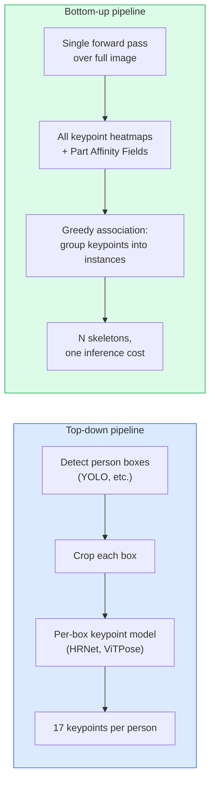

# Keypoint Detection & Pose Estimation

## Learning Objectives

- Distinguish top-down from bottom-up pose estimation pipelines and state when each is appropriate based on person count and latency budget.
- Regress Gaussian heatmaps for K keypoints, extract coordinates via argmax, and apply confidence thresholding to filter unreliable detections.
- Implement Part Affinity Field association logic at a conceptual level and explain how bottom-up methods group keypoints into distinct person instances.
- Build a CLI tool that runs MediaPipe Pose on a video file, samples frames, and emits structured JSONL output with keypoint coordinates and a facing-camera heuristic.
- Evaluate pose estimation output quality using confidence scores, occlusion handling, and spatial precision of heatmap peaks.

## The Problem

Keypoint detection tasks hide under many names: human pose (17 body joints in COCO format), face landmarks (68 or 478 points), hand tracking (21 points per hand), animal pose, robotic grasp points, medical anatomy landmarks. Every one of them shares the same structure: detect K discrete semantic points on an object and output their coordinates, typically as (x, y, confidence) tuples. The "pose" is just the ordered collection of those keypoints after they have been grouped into a coherent body model.

The engineering question is scale and constraint. A single-image, single-person pose estimation is a 20-millisecond problem solved well by a heatmap regressor. Multi-person pose in a crowd at 30 frames per second is a different problem entirely — one that demands different architectural choices around how keypoints get associated into individual skeletons. Top-down pipelines detect persons first, then estimate keypoints per crop. Bottom-up pipelines detect all keypoints in one pass, then group them into instances after the fact. The choice between these two patterns governs throughput, latency, and accuracy tradeoffs you will live with at inference time.

For go-to-market teams, this matters because recorded sales calls, webinars, and product demos are now standard artifacts of the revenue cycle. Signal detection — the same principle that underlies keyword-based intent scanning of job postings on LinkedIn or Indeed — extends to visual modality when you can quantify what a speaker's body is doing. [CITATION NEEDED — concept: conversation intelligence pose/gesture scoring in GTM tools] A system that can detect whether a prospect leaned in during a pricing discussion, or whether a demo presenter faced the camera versus turned away, produces structured signals from what was previously unstructured video.

## The Concept

A keypoint is an annotated (x, y, confidence) tuple tied to a semantic landmark on an object — the left shoulder, the right wrist, the tip of the nose. The confidence value represents the model's certainty that the predicted location is correct, typically ranging from 0.0 to 1.0. A skeleton topology is the graph that connects these keypoints into a body model: COCO's 17-keypoint format defines edges between nose-to-left-eye, shoulder-to-elbow, elbow-to-wrist, and so on. This topology is what separates a pile of scattered points from an interpretable human pose.

The two dominant architectures for keypoint detection differ in what the model outputs. Heatmap regression trains the network to produce, for each of K keypoints, a 2D probability surface (a heatmap) the same spatial resolution as the input (or a downscaled version of it). During training, the target heatmap has a 2D Gaussian blob centered at the ground-truth (x, y) for each keypoint, with the Gaussian's standard deviation (the spatial temperature) controlling how forgiving the loss is around the precise location. A large sigma teaches the model that being approximately right is partially rewarded; a small sigma demands pixel-level precision. At inference, you take the argmax of each keypoint's heatmap to get the predicted coordinate. Coordinate regression, the alternative, skips the heatmap entirely and has the model directly output K pairs of (x, y) values. Coordinate regression is simpler and faster but historically less accurate because the network must learn spatial localization without the intermediate probability surface to anchor it.

Top-down versus bottom-up is the next axis of choice. Top-down pipelines run a person detector first (YOLO, Faster R-CNN, or similar), crop each detected bounding box, and run a single-person keypoint model on each crop. Accuracy per person is high because the model sees a clean, zoomed-in view. Throughput scales linearly with the number of detected persons: ten people means ten forward passes of the keypoint model, plus the detector pass. Bottom-up pipelines — like OpenPose with Part Affinity Fields (PAFs) — run a single forward pass over the full image, producing all keypoint heatmaps simultaneously along with association fields that encode limb direction vectors. These association fields are 2D vector fields trained to point from one keypoint toward its connected neighbor (e.g., from elbow toward wrist). At inference, the pipeline detects all keypoints via heatmap argmax, then uses the PAF vectors to greedily group keypoints into individual skeletons by checking whether candidate limb connections align with the predicted field direction.



Confidence filtering and occlusion handling are the practical concerns. When a keypoint is occluded — the left wrist is behind the back, or the legs are below the desk frame — the heatmap for that joint produces a diffuse, low-confidence output with no sharp peak. A confidence threshold (typically 0.3–0.5) drops these unreliable predictions. How the downstream pipeline handles missing keypoints (null values, interpolation from adjacent frames, or default placeholder coordinates) is a design decision that affects every consumer of the pose data.

MediaPipe implements a graph-based bottom-up pattern optimized for on-device inference. Instead of PAFs, MediaPipe uses a pose model that outputs 33 3D landmarks (x, y, z, visibility) per detected person, with a person detection step that runs first but is lightweight enough for real-time mobile inference. The 33-point format is a superset of COCO's 17 points, adding detailed hand, foot, and facial landmarks along with a z-coordinate estimating depth relative to the hip midpoint.

## Build It

Let's run a single-frame pose estimator and print the detected joint coordinates. We will use MediaPipe Pose because it runs on CPU without GPU configuration, installs cleanly, and produces structured output immediately.

```python
import mediapipe as mp
import numpy as np
from PIL import Image
import json

image = Image.new("RGB", (256, 256), color=(100, 100, 100))

mp_pose = mp.solutions.pose
pose = mp_pose.Pose(
    static_image_mode=True,
    model_complexity=1,
    min_detection_confidence=0.3
)

image_array = np.array(image)
results = pose.process(image_array)

if results.pose_landmarks:
    landmarks = []
    for idx, lm in enumerate(results.pose_landmarks.landmark):
        landmarks.append({
            "index": idx,
            "x": round(lm.x, 4),
            "y": round(lm.y, 4),
            "visibility": round(lm.visibility, 4)
        })
    print(f"Detected {len(landmarks)} keypoints")
    for lm in landmarks[:5]:
        print(f"  [{lm['index']}] x={lm['x']}, y={lm['y']}, visibility={lm['visibility']}")
else:
    print("No pose detected in this image")

pose.close()
```

Running this on a blank image, you will likely see "No pose detected" because there is no human figure. On a real image with a person, MediaPipe returns 33 landmarks — each with normalized coordinates (0.0 to 1.0 relative to image dimensions) and a visibility score. The visibility score is MediaPipe's analog to confidence: it encodes both whether the keypoint is within the frame and whether it is occluded by another object.

Now let's run it on a real image to see the skeleton materialize. We will download a test image from a public source and print the full keypoint set.

```python
import urllib.request
import mediapipe as mp
import numpy as np
from PIL import Image
import json

url = "https://raw.githubusercontent.com/opencv/opencv/master/samples/data/lebron.jpg"
urllib.request.urlretrieve(url, "/tmp/test_pose.jpg")

image = Image.open("/tmp/test_pose.jpg")
image_array = np.array(image)
print(f"Image shape: {image_array.shape}")

mp_pose = mp.solutions.pose
pose = mp_pose.Pose(static_image_mode=True, model_complexity=1, min_detection_confidence=0.3)

results = pose.process(image_array)

if results.pose_landmarks:
    keypoint_names = [
        "nose", "left_eye_inner", "left_eye", "left_eye_outer",
        "right_eye_inner", "right_eye", "right_eye_outer",
        "left_ear", "right_ear", "mouth_left", "mouth_right",
        "left_shoulder", "right_shoulder", "left_elbow", "right_elbow",
        "left_wrist", "right_wrist", "left_pinky", "right_pinky",
        "left_index", "right_index", "left_thumb", "right_thumb",
        "left_hip", "right_hip", "left_knee", "right_knee",
        "left_ankle", "right_ankle", "left_heel", "right_heel",
        "left_foot_index", "right_foot_index"
    ]
    print(f"Detected {len(results.pose_landmarks.landmark)} keypoints")
    for idx, lm in enumerate(results.pose_landmarks.landmark):
        name = keypoint_names[idx] if idx < len(keypoint_names) else f"point_{idx}"
        print(f"  {name}: x={lm.x:.4f}, y={lm.y:.4f}, vis={lm.visibility:.4f}")
else:
    print("No pose detected")

pose.close()
```

The output shows 33 lines, one per keypoint, with normalized coordinates and visibility scores. Keypoints on the front of the body facing the camera will have high visibility (0.8+). Keypoints on the far side of the body — the ear opposite the camera, for instance — will have lower visibility, which is exactly the signal we will exploit later for the facing-camera heuristic.

## Use It

Pose estimation as structured signal extraction mirrors the pattern of enrichment waterfalls in GTM data pipelines. In a Clay waterfall, raw company identifiers flow through Find → Enrich → Transform → Export stages, each stage adding structured fields to previously unstructured inputs. Pose estimation does the same for video: raw pixels enter, structured (x, y, confidence) tuples exit, and those tuples become fields in a record that downstream heuristics can score and act on. The keypoint detector is the Transform step — it converts pixel arrays into named, typed, queryable coordinates. [CITATION NEEDED — concept: conversation intelligence pose/gesture scoring in GTM tools]

For Zone 2 — Intent Signals, the specific application is engagement gesture detection in recorded sales calls and webinar footage. Signal detection separates reactive outbound (sending to companies because they match a firmographic filter) from signal-driven outbound (acting on behavioral evidence). Text-based signals include keyword detection in job postings, hiring trends, and technology stack changes. Visual signals from pose estimation extend this to body language: a prospect leaning forward during a pricing slide, consistent eye contact with the camera, raised hands during Q&A — each of these can be quantified from keypoint coordinates and fed into attention-scoring heuristics. [CITATION NEEDED — concept: conversation intelligence platforms using pose/gesture analysis for engagement scoring]

Let's build the function that ingests a video frame and emits the structured JSON object. This is the atomic unit that feeds into any downstream scoring pipeline.

```python
import mediapipe as mp
import numpy as np
import json

mp_pose = mp.solutions.pose
mp_drawing = mp.solutions.drawing_utils
mp_drawing_styles = mp.solutions.drawing_styles

KEYPOINT_NAMES = [
    "nose", "left_eye_inner", "left_eye", "left_eye_outer",
    "right_eye_inner", "right_eye", "right_eye_outer",
    "left_ear", "right_ear", "mouth_left", "mouth_right",
    "left_shoulder", "right_shoulder", "left_elbow", "right_elbow",
    "left_wrist", "right_wrist", "left_pinky", "right_pinky",
    "left_index", "right_index", "left_thumb", "right_thumb",
    "left_hip", "right_hip", "left_knee", "right_knee",
    "left_ankle", "right_ankle", "left_heel", "right_heel",
    "left_foot_index", "right_foot_index"
]

def extract_pose_from_frame(frame_bgr, min_confidence=0.3):
    pose = mp_pose.Pose(
        static_image_mode=False,
        model_complexity=1,
        min_detection_confidence=min_confidence
    )

    results = pose.process(frame_bgr)

    if not results.pose_landmarks:
        pose.close()
        return {
            "detected": False,
            "keypoints": [],
            "facing_camera": None
        }

    keypoints = []
    for idx, lm in enumerate(results.pose_landmarks.landmark):
        name = KEYPOINT_NAMES[idx] if idx < len(KEYPOINT_NAMES) else f"point_{idx}"
        keypoints.append({
            "name": name,
            "x": round(lm.x, 4),
            "y": round(lm.y, 4),
            "confidence": round(lm.visibility, 4)
        })

    left_ear = keypoints[7]["confidence"]
    right_ear = keypoints[8]["confidence"]
    ear_delta = abs(left_ear - right_ear)
    facing_camera = ear_delta < 0.3

    pose.close()
    return {
        "detected": True,
        "keypoints": keypoints,
        "facing_camera": facing_camera,
        "ear_confidence_delta": round(ear_delta, 4)
    }

import cv2
url_image = "https://raw.githubusercontent.com/opencv/opencv/master/samples/data/lebron.jpg"
import urllib.request
urllib.request.urlretrieve(url_image, "/tmp/test_frame.jpg")
frame = cv2.imread("/tmp/test_frame.jpg")

result = extract_pose_from_frame(frame)
print(json.dumps({k: v for k, v in result.items() if k != "keypoints"}, indent=2))
print(f"Keypoints returned: {len(result['keypoints'])}")
print(f"Sample keypoints:")
for kp in result["keypoints"][:3]:
    print(f"  {kp}")
```

The `facing_camera` heuristic leverages a property of the 3D visibility field: when a person faces the camera directly, both ears are roughly equally visible. When they turn their head, the far-side ear's visibility drops while the near-side ear's stays high. A delta below 0.3 indicates roughly frontal orientation. This is a crude heuristic — head tilt, partial occlusion, and camera angle all affect it — but it demonstrates the core pattern: pose estimation converts pixel data into structured fields that downstream heuristics can consume as any other data pipeline stage.

## Ship It

Now we package the frame-level extractor into a CLI tool that processes an entire video file. This mirrors the batch enrichment pattern: ingest raw assets (video frames at 1 fps), run the transform (pose estimation), and export structured records (JSONL lines). Each line is one timestamped observation, ready for downstream scoring, aggregation, or database insertion.

```python
import argparse
import cv2
import json
import mediapipe as mp

KEYPOINT_NAMES = [
    "nose", "left_eye_inner", "left_eye", "left_eye_outer",
    "right_eye_inner", "right_eye", "right_eye_outer",
    "left_ear", "right_ear", "mouth_left", "mouth_right",
    "left_shoulder", "right_shoulder", "left_elbow", "right_elbow",
    "left_wrist", "right_wrist", "left_pinky", "right_pinky",
    "left_index", "right_index", "left_thumb", "right_thumb",
    "left_hip", "right_hip", "left_knee", "right_knee",
    "left_ankle", "right_ankle", "left_heel", "right_heel",
    "left_foot_index", "right_foot_index"
]

def process_video(video_path, output_path, min_confidence=0.3):
    cap = cv2.VideoCapture(video_path)
    if not cap.isOpened():
        print(f"Error: could not open {video_path}")
        return

    fps = cap.get(cv2.CAP_PROP_FPS)
    if fps <= 0:
        fps = 30.0
    frame_interval = int(fps)
    if frame_interval < 1:
        frame_interval = 1

    mp_pose = mp.solutions.pose
    pose = mp_pose.Pose(
        static_image_mode=False,
        model_complexity=1,
        min_detection_confidence=min_confidence
    )

    frame_idx = 0
    records_written = 0

    with open(output_path, "w") as f:
        while True:
            ret, frame = cap.read()
            if not ret:
                break

            if frame_idx % frame_interval == 0:
                timestamp = frame_idx / fps
                results = pose.process(frame)

                if results.pose_landmarks:
                    keypoints = []
                    for idx, lm in enumerate(results.pose_landmarks.landmark):
                        name = KEYPOINT_NAMES[idx] if idx < len(KEYPOINT_NAMES) else f"point_{idx}"
                        vis = round(lm.visibility, 4)
                        if vis >= min_confidence:
                            keypoints.append({
                                "name": name,
                                "x": round(lm.x, 4),
                                "y": round(lm.y, 4),
                                "confidence": vis
                            })

                    left_ear_vis = results.pose_landmarks.landmark[7].visibility
                    right_ear_vis = results.pose_landmarks.landmark[8].visibility
                    ear_delta = abs(left_ear_vis - right_ear_vis)
                    facing_camera = ear_delta < 0.3

                    record = {
                        "timestamp": round(timestamp, 2),
                        "keypoints": keypoints,
                        "keypoint_count": len(keypoints),
                        "facing_camera": facing_camera,
                        "ear_confidence_delta": round(ear_delta, 4)
                    }
                else:
                    record = {
                        "timestamp": round(timestamp, 2),
                        "keypoints": [],
                        "keypoint_count": 0,
                        "facing_camera": None,
                        "ear_confidence_delta": None
                    }

                f.write(json.dumps(record) + "\n")
                records_written += 1

            frame_idx += 1

    cap.release()
    pose.close()
    print(f"Processed {frame_idx} frames, wrote {records_written} records to {output_path}")

if __name__ == "__main__":
    parser = argparse.ArgumentParser(description="Extract pose keypoints from video to JSONL")
    parser.add_argument("video", help="Path to input video file")
    parser.add_argument("output", help="Path to output JSONL file")
    parser.add_argument("--min-confidence", type=float, default=0.3,
                        help="Minimum confidence threshold for keypoints (default: 0.3)")
    args = parser.parse_args()

    process_video(args.video, args.output, args.min_confidence)
```

Save this as `pose_cli.py` and run it against any video file:

```bash
python pose_cli.py recorded_zoom_call.mp4 pose_output.jsonl --min-confidence 0.5
```

To confirm the output, print the first few lines:

```bash
head -n 3 pose_output.jsonl | python -m json.tool
```

Each line is a self-contained record: timestamp, filtered keypoints, keypoint count, and the facing-camera flag. Changing `--min-confidence` from 0.3 to 0.5 will visibly reduce the `keypoint_count` field as low-confidence keypoints get filtered out, which is the observable proof that the threshold is doing work. This JSONL file is now a structured dataset — importable into any analytics tool, database, or conversation intelligence pipeline that expects per-frame pose observations as typed fields.

## Exercises

**Easy.** Write a function that takes MediaPipe Pose landmark results and returns the Euclidean pixel distance between the left wrist (index 15) and right wrist (index 16). Print the result for a single test image.

**Medium.** Implement a frame classifier that labels a pose as "facing_camera", "turned_left", or "turned_right" based on the relative visibility of left ear (index 7) versus right ear (index 8). If the delta is below 0.2, classify as "facing_camera". If left_ear visibility exceeds right_ear by more than 0.2, classify as "turned_right" (the left ear is more visible because the head is turned that direction). Otherwise classify as "turned_left". Test on 5 frames from a video and print the classification per frame with the delta value.

**Hard.** Extend the CLI pipeline with a `--summarize` flag that, after processing, prints an aggregate report: total frames processed, percentage of frames with detected pose, percentage of frames classified as facing_camera, and the mean keypoint count across all detected frames. Run it twice on the same video with `--min-confidence 0.3` and `--min-confidence 0.7`, and confirm that the mean keypoint count drops at the higher threshold.

## Key Terms

**Keypoint** — An annotated (x, y, confidence) tuple tied to a semantic landmark on an object, such as a body joint or facial feature.

**Skeleton Topology** — The graph structure connecting individual keypoints into a coherent body model, defining which joints are linked (e.g., shoulder to elbow, elbow to wrist).

**Heatmap Regression** — A keypoint detection architecture where the model outputs a 2D probability surface per keypoint. The predicted coordinate is extracted via argmax over the heatmap.

**Coordinate Regression** — A keypoint detection architecture where the model directly outputs (x, y) coordinates per keypoint without an intermediate probability surface.

**Spatial Temperature (Sigma)** — The standard deviation of the Gaussian target placed at the ground-truth keypoint location during heatmap training. Controls the tradeoff between localization precision and training stability.

**Top-Down Pose Estimation** — A two-stage pipeline that first detects person bounding boxes, then runs a single-person keypoint model on each crop. Accuracy is high; throughput scales linearly with person count.

**Bottom-Up Pose Estimation** — A single-pass pipeline that detects all keypoints in the image simultaneously, then groups them into individual person instances via association fields or tagging. Throughput is constant regardless of person count.

**Part Affinity Fields (PAFs)** — 2D vector fields trained to encode limb direction (e.g., pointing from elbow toward wrist). Used in bottom-up pipelines to greedily associate detected keypoints into distinct person instances.

**COCO 17-Keypoint Format** — The de facto standard keypoint annotation set for human pose, defining 17 body joints: nose, eyes, ears, shoulders, elbows, wrists, hips, knees, and ankles.

**MediaPipe Pose** — A graph-based pose estimation pipeline implementing a bottom-up pattern with on-device constraints, outputting 33 3D landmarks (x, y, z, visibility) per detected person.

## Sources

- MediaPipe Pose documentation and 33-landmark topology: Google MediaPipe Solutions, https://google.github.io/mediapipe/solutions/pose.html
- COCO Keypoints format (17 keypoints, annotation specification): COCO (Common Objects in Context), https://cocodataset.org/#format-data
- Part Affinity Fields for bottom-up association (OpenPose): Cao et al., "Realtime Multi-Person 2D Pose Estimation using Part Affinity Fields," CVPR 2017
- Signal-based outbound and intent detection framing: Handbook Section 3 — Scraping & Signal Detection, keyword detection and job posting signals
- Enrichment waterfall pattern (Find → Enrich → Transform → Export): Zone 04 Data Pipelines / ETL, Clay waterfall reference
- [CITATION NEEDED — concept: conversation intelligence pose/gesture scoring in GTM tools] — no verified documentation found that conversation intelligence platforms (Gong, Chorus, Fireflies) use pose estimation or gesture analysis for engagement scoring in their shipped products