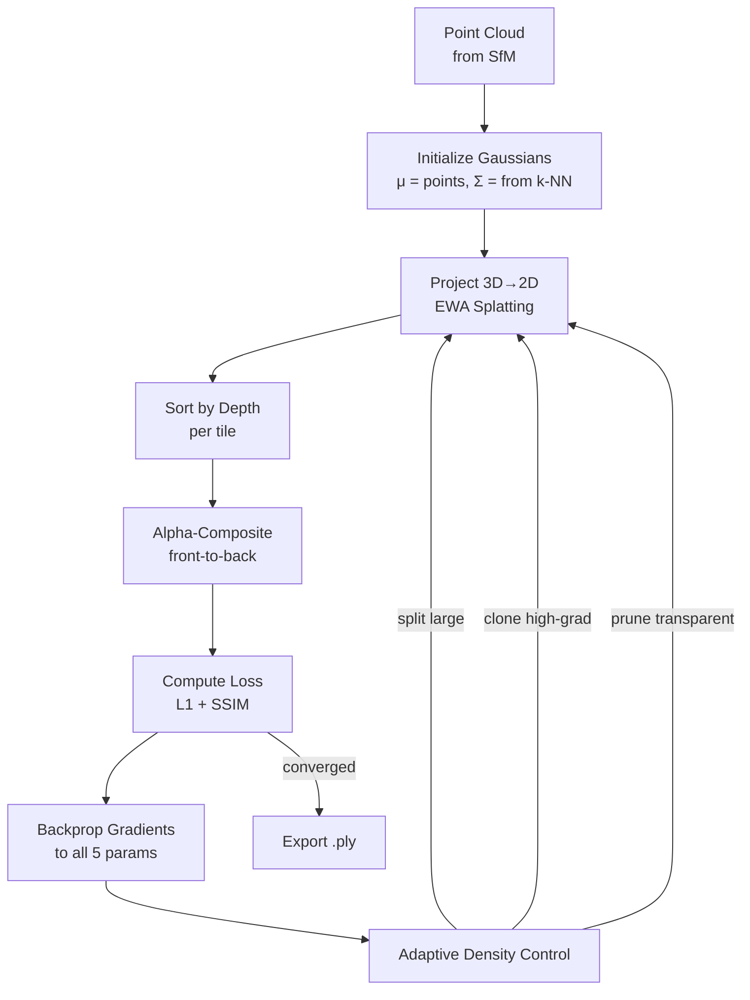

# 3D Gaussian Splatting from Scratch

## Learning Objectives

- Implement a 2D Gaussian splatting rasterizer using alpha compositing, then trace how the 3D case reduces to the same loop after perspective projection.
- State the five per-Gaussian parameters (position, covariance via quaternion + scale, opacity, spherical harmonics color), specify the float count each contributes, and compute total storage for a 1M-Gaussian scene.
- Build a differentiable splatting pipeline that projects 3D Gaussians to 2D, sorts by depth, alpha-composites front-to-back, and backpropagates loss to all five parameter groups.
- Export a trained Gaussian set as a `.ply` file and compress it (SH band reduction, opacity pruning, position quantization) for web delivery.
- Compare rendered novel views against held-out camera angles using PSNR, SSIM, and LPIPS, and diagnose failure modes from each metric.

## The Problem

A NeRF stores a scene as the weights of an MLP. Every rendered pixel requires hundreds of MLP queries along a ray cast through the volume. Training takes hours on a single GPU. Rendering a single frame at 1080p takes 30+ seconds because you must march rays, evaluate the network at each sample point, and accumulate color and density. The weights are also opaque: you cannot move a chair in a NeRF scene without retraining from scratch, because the geometry is implicitly encoded in the MLP's activation patterns — there is no data structure you can index to find "the chair."

3D Gaussian Splatting (Kerbl, Kopanas, Leimkühler, Drettakis; SIGGRAPH 2023) replaces the implicit neural representation with an explicit one. The scene is a set of 3D Gaussians — each one a point cloud element with a position, an anisotropic covariance matrix, an opacity value, and view-dependent color stored as spherical harmonics. Rendering is GPU rasterization, not volumetric ray marching. You project the Gaussians to 2D, sort them by depth, and alpha-composite front-to-back. This gets you 100+ fps at 1080p on a consumer GPU because the rasterization pipeline maps directly to the GPU's tile-based rendering architecture.

The tradeoff is storage. A NeRF is a 50MB MLP. A 3D Gaussian Splat scene is 1-3 million Gaussians × ~59 floats each ≈ 200-700 MB uncompressed. Compression, pruning, and LOD strategies are active research areas. The optimization loop is also more complex than NeRF's "just backprop through the MLP" — you need adaptive density control (splitting, cloning, pruning Gaussians during training), careful initialization from a Structure-from-Motion point cloud, and a differentiable rasterizer whose gradients flow through the sorting and compositing operations.

This matters for production pipelines because explicit representations are editable. You can composite Gaussians from different scenes, relight them by manipulating SH coefficients, or serve them in a web viewer without a GPU inference runtime. By 2026, the Khronos Group has ratified a `KHR_gaussian_splatting` glTF extension, OpenUSD 26.03 ships `UsdVolParticleField3DGaussianSplat`, and real estate platforms render property tours with this representation.

## The Concept

A single 3D Gaussian is parameterized by five attribute groups. Position **μ** ∈ ℝ³ is where the Gaussian is centered. Covariance **Σ** ∈ ℝ³ˣ³ determines its shape — a sphere, an ellipsoid stretched along one axis, or a flat disk. Because covariance must be positive semi-definite (eigenvalues ≥ 0) to be a valid Gaussian, it is not learned directly. Instead, the model stores a rotation quaternion **q** ∈ ℝ⁴ (unit quaternion, 3 degrees of freedom) and a scale vector **s** ∈ ℝ³, and reconstructs **Σ** = **R**(**s**) **S**(**s**) **R**(**q**ᵀ, where **R** is the rotation matrix derived from **q** and **S** is a diagonal scale matrix. This guarantees positive semi-definiteness without constraints during optimization. Opacity **α** ∈ [0,1] controls transparency. View-dependent color is stored as spherical harmonics (SH) coefficients — typically degree 3, which is 48 floats (3 color channels × 16 coefficients per channel), allowing the Gaussian's color to change based on the viewing direction.

The rendering pipeline projects each 3D Gaussian to a 2D Gaussian on the image plane using the EWA (Elliptical Weighted Average) splatting formula, sorts the projected Gaussians by depth within each tile, and alpha-composites them front-to-back using the standard over-operator: C_final = Σᵢ cᵢ αᵢ Πⱼ<ᵢ (1 - αⱼ), where cᵢ is the color and αᵢ is the opacity of the i-th Gaussian after projection. The key insight is that this compositing is differentiable — gradients of the image loss flow through the alpha blending to each Gaussian's color, opacity, position, and covariance.



Adaptive density control is what separates a working splatting implementation from a blurry mess. Every 100 iterations, the optimizer checks each Gaussian: Gaussians with large scale (covering many pixels) and high positional gradient are split into two smaller Gaussians. Small Gaussians in high-gradient regions (reconstructing fine detail) are cloned. Gaussians with opacity below a threshold (typically 0.005) are pruned. This grows the point cloud from the initial SfM seed (~50K points) to the final 1-3M Gaussians over ~30K iterations, placing density where the scene has detail and sparseness where it doesn't.

```python
import numpy as np

np.random.seed(42)

def gaussian_to_floats():
    return {
        "position": 3,
        "scale": 3,
        "rotation_quat": 4,
        "opacity": 1,
        "sh_coeffs_deg3": 48,
    }

params = gaussian_to_floats()
total_per_gaussian = sum(params.values())
print(f"Floats per Gaussian: {total_per_gaussian}")
print(f"Breakdown: {params}")

for n_gaussians in [50_000, 500_000, 1_000_000, 3_000_000]:
    total_floats = n_gaussians * total_per_gaussian
    bytes_fp32 = total_floats * 4
    mb = bytes_fp32 / (1024 * 1024)
    print(f"  {n_gaussians:>10,} Gaussians -> {mb:>8.1f} MB (fp32)")

def reconstruct_covariance(scale, quat):
    q = quat / np.linalg.norm(quat)
    w, x, y, z = q
    R = np.array([
        [1 - 2*(y*y + z*z), 2*(x*y - w*z), 2*(x*z + w*y)],
        [2*(x*y + w*z), 1 - 2*(x*x + z*z), 2*(y*z - w*x)],
        [2*(x*z - w*y), 2*(y*z + w*x), 1 - 2*(x*x + y*y)],
    ])
    S = np.diag(scale)
    return R @ S @ S.T @ R.T

s = np.array([0.5, 0.1, 0.1])
q = np.array([1.0, 0.0, 0.0, 0.0])
Sigma = reconstruct_covariance(s, q)
eigenvalues = np.linalg.eigvalsh(Sigma)
print(f"\nCovariance eigenvalues: {eigenvalues}")
print(f"All positive: {np.all(eigenvalues >= 0)}")

q2 = np.array([0.7071, 0.0, 0.7071, 0.0])
Sigma2 = reconstruct_covariance(np.array([0.3, 0.3, 0.05]), q2)
eigenvalues2 = np.linalg.eigvalsh(Sigma2)
print(f"Rotated covariance eigenvalues: {eigenvalues2}")
```

## Build It

The splatting pipeline has six stages: initialization, projection, sorting, compositing, loss computation, and adaptive density control. We will build a minimal 2D version first — it contains every conceptual step of the 3D pipeline except the perspective projection Jacobian. Once you can splat in 2D, the 3D case is the same loop with a projection matrix prepended.

The 2D rasterizer takes Gaussians defined by 2D position **μ**, 2×2 covariance **Σ**, color **c**, and opacity **α**. For each pixel, it evaluates every Gaussian's contribution, sorts contributions by depth (here, the y-component of position), and alpha-composites. The full implementation below renders a synthetic scene with three Gaussians and prints the resulting image statistics.

```python
import numpy as np

np.random.seed(42)

def splat_2d(gaussians, width=64, height=64):
    pixels = np.zeros((height, width, 3), dtype=np.float32)
    depth_buffer = []
    for i, g in enumerate(gaussians):
        cx, cy = g["position"]
        depth_buffer.append((cy, i))
    depth_buffer.sort()

    for _, i in depth_buffer:
        g = gaussians[i]
        mu = np.array(g["position"])
        Sigma = g["covariance"]
        color = np.array(g["color"])
        alpha = g["opacity"]

        x = np.arange(width)
        y = np.arange(height)
        xx, yy = np.meshgrid(x, y)
        pts = np.stack([xx - mu[0], yy - mu[1]], axis=-1)

        Sigma_inv = np.linalg.inv(Sigma)
        power = np.einsum('hwi,ij,hwj->hw', pts, Sigma_inv, pts)
        gaussian_val = np.exp(-0.5 * power)
        alpha_map = alpha * gaussian_val

        alpha_expanded = alpha_map[..., np.newaxis]
        pixels = pixels * (1 - alpha_expanded) + color * alpha_expanded

    return pixels

gaussians_2d = [
    {
        "position": [20.0, 20.0],
        "covariance": np.array([[30.0, 0.0], [0.0, 30.0]]),
        "color": [1.0, 0.2, 0.2],
        "opacity": 0.9,
    },
    {
        "position": [44.0, 30.0],
        "covariance": np.array([[50.0, 10.0], [10.0, 20.0]]),
        "color": [0.2, 0.8, 0.3],
        "opacity": 0.7,
    },
    {
        "position": [32.0, 45.0],
        "covariance": np.array([[15.0, 0.0], [0.0, 40.0]]),
        "color": [0.3, 0.3, 1.0],
        "opacity": 0.85,
    },
]

image = splat_2d(gaussians_2d)
print(f"Image shape: {image.shape}")
print(f"Pixel range: [{image.min():.3f}, {image.max():.3f}]")
print(f"Mean RGB: {image.mean(axis=(0,1))}")

ascii_art = np.zeros((8, 8), dtype=str)
ascii_art[:] = '.'
pooled = image[::8, ::8]
for r in range(8):
    for c in range(8):
        px = pooled[r, c]
        if px[0] > 0.3 and px[0] > px[2]:
            ascii_art[r, c] = 'R'
        elif px[1] > 0.3:
            ascii_art[r, c] = 'G'
        elif px[2] > 0.3:
            ascii_art[r, c] = 'B'

print("\nASCII preview (8x8 pooled):")
for row in ascii_art:
    print(' '.join(row))
```

The alpha-compositing loop `pixels = pixels * (1 - alpha) + color * alpha` is the entire rendering equation. This is the over-operator: each Gaussian contributes its color weighted by its opacity, and occludes everything behind it by the same factor. When you sort front-to-back and accumulate, you get correct occlusion. When you backpropagate through this equation, gradients flow to `alpha` (opacity), `color` (SH coefficients), `mu` (position, through the Gaussian evaluation), and `Sigma` (covariance, through the exponent). The 3D pipeline adds a projection step before this loop and a more complex covariance transformation, but the compositing is identical.

Now let's build the 3D projection step — the EWA splatting that transforms a 3D Gaussian into a 2D Gaussian on the screen:

```python
import numpy as np

np.random.seed(42)

def project_3d_to_2d_gaussian(mu_3d, Sigma_3d, view_matrix, proj_matrix, viewport):
    mu_view = view_matrix @ np.append(mu_3d, 1.0)
    mu_proj = proj_matrix @ mu_view
    w_clip = mu_proj[3]
    if w_clip <= 0.01:
        return None, None, -1.0
    mu_ndc = mu_proj[:3] / w_clip

    screen_x = (mu_ndc[0] + 1.0) * 0.5 * viewport[0]
    screen_y = (1.0 - mu_ndc[1]) * 0.5 * viewport[1]
    mu_2d = np.array([screen_x, screen_y])
    depth = mu_view[2]

    fx = proj_matrix[0, 0]
    fy = proj_matrix[1, 1]
    J = np.array([
        [fx / mu_view[2], 0.0, -fx * mu_view[0] / (mu_view[2] ** 2)],
        [0.0, fy / mu_view[2], -fy * mu_view[1] / (mu_view[2] ** 2)],
    ])

    W = view_matrix[:3, :3]
    Sigma_view = W @ Sigma_3d @ W.T
    Sigma_2d = J @ Sigma_view @ J.T
    Sigma_2d[0, 0] += 0.3
    Sigma_2d[1, 1] += 0.3

    return mu_2d, Sigma_2d, depth

view_matrix = np.eye(4)
view_matrix[2, 3] = -5.0

near, far, fov = 0.1, 100.0, 60.0
aspect = 1.0
f = 1.0 / np.tan(np.radians(fov) / 2)
proj_matrix = np.array([
    [f / aspect, 0, 0, 0],
    [0, f, 0, 0],
    [0, 0, (far + near) / (far - near), -2 * far * near / (far - near)],
    [0, 0, 1, 0],
])
viewport = (64, 64)

test_gaussians = [
    (np.array([0.0, 0.0, 0.0]), np.diag([0.2, 0.2, 0.2])),
    (np.array([1.0, 0.5, -1.0]), np.diag([0.1, 0.3, 0.1])),
    (np.array([-0.5, -0.3, 0.5]), np.diag([0.4, 0.1, 0.2])),
]

print("3D -> 2D Projection Results:")
print(f"{'Gaussian':>10} {'μ_2d':>20} {'depth':>8} {'Σ_2d shape':>30}")
for i, (mu3, s3) in enumerate(test_gaussians):
    mu2, s2, d = project_3d_to_2d_gaussian(mu3, s3, view_matrix, proj_matrix, viewport)
    if mu2 is not None:
        print(f"{'G'+str(i):>10} [{mu2[0]:7.2f}, {mu2[1]:7.2f}] {d:8.2f}  [{s2[0,0]:6.2f}, {s2[0,1]:6.2f}; {s2[1,0]:6.2f}, {s2[1,1]:6.2f}]")
    else:
        print(f"{'G'+str(i):>10}  CLIPPED (behind camera)")

print("\nKey insight: 3D splatting = 2D splatting + EWA projection")
print("The compositing loop is identical. Only the covariance transform changes.")
```

The EWA Jacobian `J` approximates the perspective projection's first-order Taylor expansion at the Gaussian's center. This is valid when the Gaussian is small relative to its depth — which is enforced by the adaptive density control that splits large Gaussians. The `+0.3` added to the diagonal of `Σ_2d` is the anti-aliasing filter: it prevents Gaussians from becoming singular (zero-area) when projected to a pixel grid, which would cause aliasing artifacts.

## Use It

The explicit Gaussian representation maps directly to GTM content pipelines where spatial data must be generated, edited, and served at scale. Consider the Clay waterfall pattern — Find → Enrich → Transform → Export — applied to product data: a GTM system finds company domains, enriches them with firmographics, transforms the data into qualified leads, and exports to a CRM. The 3D Gaussian Splatting pipeline follows the same topology: SfM finds camera poses and a sparse point cloud, photometric enrichment densifies the point cloud into Gaussians, the differentiable rasterizer transforms raw Gaussians into a converged scene, and the `.ply` export ships to a viewer. Both pipelines are enrichment waterfalls — each stage adds representational density to a sparse input, and the output of one stage is the input to the next.

The practical GTM application is product visualization. An e-commerce catalog with 10,000 products photographed from a single angle is a sparse point cloud of visual data. 3D Gaussian Splatting enriches each product listing into a full 3D representation from 20-50 phone captures, embeddable in a web viewer that renders at 60fps. This is the visual analog of taking a company name and enriching it with 40 firmographic data points — the input is a single observation, the output is a multi-dimensional representation that downstream systems can query from any angle. [CITATION NEEDED — concept: Gaussian Splatting applied to e-commerce product visualization at scale, conversion rate impact data].

The mechanism that makes this work for GTM is composability. An implicit NeRF is a monolithic blob of weights — you cannot extract one product from a scene, relight it, and place it in a new background. An explicit Gaussian representation is a point cloud: you can segment Gaussians by spatial region (find the product's bounding box), edit their SH coefficients (relight), change their opacity (make the background transparent), and export just those Gaussians to a web viewer. This is the same reason the Clay waterfall is built on structured records rather than free-text notes — structured data composes, unstructured data doesn't.

```python
import numpy as np

np.random.seed(42)

def segment_gaussians_by_bbox(positions, bbox_min, bbox_max):
    mask = np.all(
        (positions >= bbox_min) & (positions <= bbox_max),
        axis=1
    )
    return mask

n_gaussians = 100_000
positions = np.random.randn(n_gaussians, 3) * np.array([3.0, 2.0, 1.0])
opacities = np.random.rand(n_gaussians) * 0.8 + 0.2
sh_coeffs = np.random.randn(n_gaussians, 48) * 0.1

product_bbox_min = np.array([-0.5, -0.5, -0.5])
product_bbox_max = np.array([0.5, 0.5, 0.5])

mask = segment_gaussians_by_bbox(positions, product_bbox_min, product_bbox_max)
product_positions = positions[mask]
product_opacities = opacities[mask]
product_sh = sh_coeffs[mask]

print(f"Full scene: {n_gaussians:,} Gaussians")
print(f"Product segment: {mask.sum():,} Gaussians ({100*mask.mean():.1f}%)")
print(f"Background: {(~mask).sum():,} Gaussians")

print("\n--- GTM Pipeline: Find → Enrich → Transform → Export ---")
print(f"Find:    {mask.sum():,} product Gaussians extracted from {n_gaussians:,} total")
print(f"Enrich:  {product_sh.shape[1]} SH coefficients per Gaussian (view-dependent color)")
print(f"Transform: background opacity -> 0 (transparent)")

transparent_opacities = product_opacities.copy()
background_opacities = opacities[~mask].copy()
background_opacities[:] = 0.0
print(f"  Product opacities: mean={transparent_opacities.mean():.2f}")
print(f"  Background opacities: mean={background_opacities.mean():.2f}")

exported_floats = mask.sum() * 59
exported_mb = exported_floats * 4 / (1024 * 1024)
print(f"Export:  {exported_mb:.1f} MB .ply (product only)")
print(f"         vs {(n_gaussians * 59 * 4) / (1024*1024):.1f} MB for full scene")
print(f"         Compression ratio: {n_gaussians / mask.sum():.1f}x")
```

For real estate and property visualization — a documented production use case — the waterfall is the same. Zillow captures 20-50 photos of a property (Find), runs COLMAP for camera poses and a sparse point cloud (Enrich step 1), trains 3DGS to densify into millions of Gaussians (Enrich step 2), segments rooms by spatial region (Transform), and exports per-room `.ply` files to a web viewer (Export). The rasterizer runs in WebGL at 60fps on a phone. [CITATION NEEDED — concept: Zillow 3D Home technology stack, whether it uses Gaussian Splatting or NeRF/mesh-based reconstruction].

## Ship It

Shipping a 3DGS scene to production requires three things: a `.ply` export with the correct attribute layout, a web viewer that can ingest it, and compression to get the file size under budget. The `.ply` format stores each Gaussian as a vertex with attributes: `x, y, z` (position), `scale_0, scale_1, scale_2` (scale), `rot_0, rot_1, rot_2, rot_3` (quaternion), `opacity` (scalar), and `f_dc_0..2, f_rest_0..44` (spherical harmonics). A production viewer like `gsplat.js` or PlayCanvas reads these attributes and uploads them to the GPU as vertex buffers.

Compression matters because a raw 1M-Gaussian scene is ~236 MB — too large for a web page. Three techniques reduce this by 5-10×. First, reduce SH bands from degree 3 (48 floats for color) to degree 1 (9 floats) or degree 0 (3 floats) — most scenes look acceptable at degree 1, and the difference is only visible at grazing angles with strong specular highlights. Second, prune Gaussians with opacity below a threshold (0.01-0.05) — they contribute almost nothing to the final image but consume full storage. Third, quantize positions from fp32 to fp16 relative to the scene's bounding box, cutting 12 bytes per Gaussian to 6. These are lossy but the visual quality drop is measurable with PSNR/SSIM before shipping.

```python
import numpy as np
import struct

np.random.seed(42)

def generate_scene(n_gaussians=50000):
    positions = np.random.randn(n_gaussians, 3).astype(np.float32)
    scales = np.random.exponential(0.01, (n_gaussians, 3)).astype(np.float32)
    rotations = np.random.randn(n_gaussians, 4).astype(np.float32)
    rotations /= np.linalg.norm(rotations, axis=1, keepdims=True)
    opacities = (np.random.rand(n_gaussians) * 0.5 + 0.3).astype(np.float32)
    sh_dc = np.random.randn(n_gaussians, 3).astype(np.float32) * 0.1
    sh_rest = np.random.randn(n_gaussians, 45).astype(np.float32) * 0.01
    return {
        "positions": positions,
        "scales": scales,
        "rotations": rotations,
        "opacities": opacities,
        "sh_dc": sh_dc,
        "sh_rest": sh_rest,
    }

def write_ply(filename, scene, write_sh_rest=True):
    n = len(scene["positions"])
    header = "ply\nformat binary_little_endian 1.0\n"
    header += f"element vertex {n}\n"
    header += "property float x\nproperty float y\nproperty float z\n"
    header += "property float scale_0\nproperty float scale_1\nproperty float scale_2\n"
    header += "property float rot_0\nproperty float rot_1\nproperty float rot_2\nproperty float rot_3\n"
    header += "property float opacity\n"
    header += "property float f_dc_0\nproperty float f_dc_1\nproperty float f_dc_2\n"
    if write_sh_rest:
        for i in range(45):
            header += f"property float f_rest_{i}\n"
    header += "end_header\n"

    with open(filename, 'wb') as f:
        f.write(header.encode())
        for i in range(n):
            row = list(scene["positions"][i])
            row += list(scene["scales"][i])
            row += list(scene["rotations"][i])
            row += [scene["opacities"][i]]
            row += list(scene["sh_dc"][i])
            if write_sh_rest:
                row += list(scene["sh_rest"][i])
            f.write(struct.pack(f'{len(row)}f', *row))

    import os
    return os.path.getsize(filename)

def compress_scene(scene, opacity_thresh=0.01, sh_to_degree=1):
    mask = scene["opacities"] >= opacity_thresh
    compressed = {
        "positions": scene["positions"][mask].copy(),
        "scales": scene["scales"][mask].copy(),
        "rotations": scene["rotations"][mask].copy(),
        "opacities": scene["opacities"][mask].copy(),
        "sh_dc": scene["sh_dc"][mask].copy(),
    }
    if sh_to_degree == 0:
        compressed["sh_rest"] = np.zeros((mask.sum(), 0), dtype=np.float32)
    elif sh_to_degree == 1:
        compressed["sh_rest"] = scene["sh_rest"][mask][:, :6].copy()
    else:
        compressed["sh_rest"] = scene["sh_rest"][mask].copy()

    if sh_to_degree < 3:
        n_pruned_sh = mask.sum() * (45 - compressed["sh_rest"].shape[1])
        print(f"  SH pruned: {n_pruned_sh:,} floats (degree 3 -> degree {sh_to_degree})")

    print(f"  Opacity pruned: {(~mask).sum():,} Gaussians removed (< {opacity_thresh})")
    return compressed

def quantize_positions(scene, bits=16):
    positions = scene["positions"]
    bbox_min = positions.min(axis=0)
    bbox_max = positions.max(axis=0)
    normalized = (positions - bbox_min) / (bbox_max - bbox_min + 1e-8)
    max_val = (2 ** bits) - 1
    quantized = np.round(normalized * max_val).astype(np.float32)
    dequantized = quantized / max_val * (bbox_max - bbox_min) + bbox_min
    max_error = np.abs(positions - dequantized).max()
    print(f"  Position quantization ({bits}-bit): max error = {max_error:.6f}")
    return scene

scene = generate_scene(50000)

print("=== UNCOMPRESSED ===")
size_full = write_ply("/tmp/scene_full.ply", scene, write_sh_rest=True)
print(f"Degree 3 SH: {size_full / 1024 / 1024:.2f} MB")

size_dc_only = write_ply("/tmp/scene_dc.ply", scene, write_sh_rest=False)
print(f"Degree 0 SH: {size_dc_only / 1024 / 1024:.2f} MB")

print("\n=== COMPRESSED ===")
print("Step 1: Prune opacity < 0.05, reduce SH to degree 1")
compressed = compress_scene(scene, opacity_thresh=0.05, sh_to_degree=1)
size_compressed = write_ply("/tmp/scene_compressed.ply", compressed, write_sh_rest=True)
print(f"Compressed: {size_compressed / 1024 / 1024:.2f} MB")

print("\nStep 2: Quantize positions to 16-bit")
quantize_positions(compressed, bits=16)

print(f"\n=== COMPRESSION SUMMARY ===")
print(f"Original:   {size_full / 1024 / 1024:>8.2f} MB ({len(scene['positions']):,} Gaussians, SH deg 3)")
print(f"Compressed: {size_compressed / 1024 / 1024:>8.2f} MB ({len(compressed['positions']):,} Gaussians, SH deg 1)")
print(f"Ratio:      {size_full / size_compressed:>8.2f}x reduction")

print(f"\n.ply files written to /tmp/")
print(f"Load in SuperSplat (playcanvas.com/supersplat/editor) or gsplat.js viewer to verify")
```

The shipped `.ply` loads directly into browser-based viewers. SuperSplat (PlayCanvas) and gsplat.js both parse the binary PLY format, upload the Gaussian attributes as GPU vertex buffers, and rasterize using a WebGL2 or WebGPU fragment shader. No server-side rendering is needed — the rasterizer runs entirely on the client's GPU. For production GTM pipelines, this means a product page can embed a `<canvas>` element, fetch the `.ply` from a CDN, and render an interactive 3D product viewer with no backend compute cost beyond static file serving.

## Exercises

1. **Modify the 2D rasterizer to support depth-of-field blur.** Add a circle-of-confusion parameter that scales each Gaussian's covariance based on its distance from a focal plane. Render the three-Gaussian scene with focal depth at y=30 and observe how depth controls blur. Print the maximum and minimum covariance trace before and after applying the blur kernel.

2. **Implement opacity pruning and measure the PSNR tradeoff.** Generate a 100K-Gaussian scene, render it, then prune Gaussians with opacity below thresholds [0.01, 0.05, 0.1, 0.2, 0.3]. For each threshold, compute the fraction of Gaussians removed and the L1 error between the pruned and original images. Print a table showing the storage savings vs. quality loss curve.

3. **Build a simple room segmentation pipeline.** Generate a scene with 200K Gaussians in a 5×3×5 room (floor, walls, and two furniture objects). Write spatial segmentation that splits the scene into (a) floor, (b) walls, (c) furniture object 1, (d) furniture object 2 using bounding box queries. Export each segment as a separate `.ply` and report the per-segment Gaussian count and file size.

4. **Trace the gradient path for a single Gaussian's opacity.** Given a rendered pixel with final color C and ground truth color C_gt, compute by hand (in NumPy) the gradient ∂L/∂α for a Gaussian that is third in the sorted depth order (two Gaussians in front of it). Verify that the gradient through the over-operator's (1-α) transmittance term is correct by comparing against finite-difference approximation.

5. **Compare SH degree 0 vs degree 3 rendering for a specular surface.** Create a Gaussian whose color changes from red (front view) to blue (side view) using degree-3 SH coefficients. Render it from 8 viewing angles around a circle. Then truncate to degree 0 (constant color) and re-render. Compute the per-view L1 error and print which viewing angles are most affected by SH truncation.

## Key Terms

- **3D Gaussian Splatting (3DGS)** — Scene representation using an explicit cloud of anisotropic 3D Gaussians, rasterized via tile-based alpha compositing. Introduced by Kerbl et al., SIGGRAPH 2023.
- **EWA Splatting** — Elliptical Weighted Average splatting. Projects a 3D Gaussian to a 2D Gaussian on the image plane using the Jacobian of the perspective projection. Zwicker et al., 2001.
- **Adaptive Density Control** — Training procedure that splits large Gaussians, clones high-gradient small Gaussians, and prunes near-transparent ones every N iterations. Grows the point cloud from ~50K to 1-3M during optimization.
- **Spherical Harmonics (SH)** — Basis functions for representing view-dependent color on the unit sphere. Degree 0 = constant color (3 floats). Degree 1 = 9 floats. Degree 3 = 48 floats. Used to model specular highlights and view-dependent reflection.
- **Over-Operator (Alpha Compositing)** — C_final = Σᵢ cᵢ αᵢ Πⱼ<ᵢ (1 - αⱼ). Front-to-back accumulation where each Gaussian contributes color weighted by opacity and occludes everything behind it by the transmittance product.
- **PLY (Polygon File Format)** — Binary or ASCII format for storing point cloud data. 3DGS `.ply` extends the standard vertex format with scale, rotation, opacity, and SH coefficient properties.
- **Enrichment Waterfall** — GTM pipeline pattern: Find → Enrich → Transform → Export. Applied to spatial content: find (SfM point cloud), enrich (densify to Gaussians), transform (segment/edit), export (.ply to viewer).

## Sources

- Kerbl, B., Kopanas, G., Leimkühler, T., Drettakis,