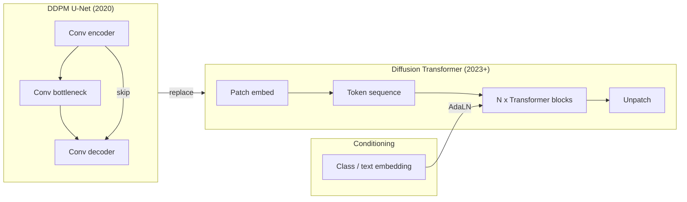
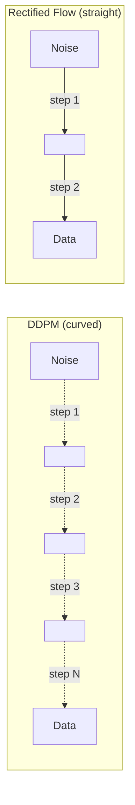

# Diffusion Transformers & Rectified Flow

## Learning Objectives

- Trace the path from U-Net DDPM to Diffusion Transformer (DiT) and rectified flow, naming each architectural substitution
- Implement a minimal DiT block with adaptive layer-norm conditioning and patch embedding in under 100 lines of PyTorch
- Implement a rectified-flow training loop that samples straight-line trajectories between data and noise
- Compare curved (DDPM) vs. straight (rectified flow) sampling paths by measuring Euler step counts required for convergence on a 2D toy dataset
- Evaluate inference optimizations (`torch.compile`, FlashAttention-2, step-count reduction) and quantify their effect on VRAM and latency for batch-scale generation

## The Problem

Lesson 10 built a DDPM with a U-Net denoiser. That recipe owned 2020–2023: convolutional encoder, bottleneck, skip-connection decoder, beta schedule, noise-prediction loss. It produced Stable Diffusion 1.5, 2.1, and DALL-E 2. It also had a ceiling. The U-Net's inductive bias—locality enforced by convolution kernels, multi-scale feature extraction through downsampling/upsampling—means spatially distant elements of an image interact only indirectly, through many stacked layers. At high resolutions or with complex compositional prompts (text rendering, multi-object scenes), that bottleneck produces artifacts: garbled hands, misspelled words, incoherent spatial layouts.

Every 2026 state-of-the-art text-to-image model has moved past the U-Net. Stable Diffusion 3, FLUX, Z-Image, Qwen-Image, Hunyuan-Image—none use a convolutional backbone. They use Diffusion Transformers (DiT), which patchify the input into tokens and apply global self-attention so every spatial location can interact with every other in a single layer. SD3 and FLUX additionally replace the DDPM noise schedule with rectified flow, which reformulates diffusion as an ordinary differential equation along a straight line between noise and data, cutting sampling from 50–1000 steps down to 1–10.

The shift matters because it is the specific reason diffusion-based image generation became controllable, prompt-accurate (SD3 and FLUX solved text rendering where SD 1.5 failed), and fast enough for production pipelines. Understanding DiT and rectified flow is understanding the 2026 generative-image stack.

## The Concept

### From U-Net to Transformer

The U-Net encodes two inductive biases. First, convolution is local: each output pixel depends on a small neighborhood of input pixels. Second, the encoder-decoder structure with skip connections forces multi-scale processing: coarse features and fine features are combined explicitly. These biases help when the dominant structure is textural or spatially smooth. They hurt when the model needs to reason about globally distributed relationships—for example, that the letters "H-E-L-L-O" must appear left-to-right across the canvas, or that a reflection on the left side of a glass must correspond to a light source on the right.

A Diffusion Transformer removes both biases. It treats the latent image as a sequence of tokens—just like a ViT—and applies standard self-attention. Every token attends to every other token in every layer. There is no encoder-decoder split and no convolution. The position information comes from positional embeddings (1D, 2D sinusoidal, or RoPE), not from the spatial structure of the network.

The flowchart below maps the architectural substitution:



### Patch Embedding

The patch-embedding step is identical to ViT. Take a latent tensor of shape `(B, C, H, W)`, divide it into non-overlapping patches of size `p × p`, flatten each patch into a vector, and project it to the transformer dimension `D` with a linear layer. For a latent of shape `(2, 4, 32, 32)` and patch size `p=2`, you get `(32/2) × (32/2) = 256` patches per sample, each projected to dimension `D`.

The patch size controls the trade-off between sequence length and spatial resolution. A smaller patch gives a longer sequence (more computation) but preserves finer detail. FLUX uses 2×2 patches on a 16-channel latent; SD3 uses 2×2 on a 4-channel latent.

### Adaptive Layer-Norm Conditioning

Standard LayerNorm normalizes each token independently, then applies a learned scale and shift. In a conditional generative model, the scale and shift should depend on the conditioning signal—the class label, the text embedding, or the timestep. This is Adaptive Layer Normalization (AdaLN). Instead of fixed learned parameters `γ` and `β`, the model takes the conditioning vector, passes it through a linear layer, and produces `γ` and `β` on the fly:

```
output = γ_c ⊙ LayerNorm(x) + β_c
```

where `γ_c` and `β_c` are functions of the conditioning signal `c`. DiT extends this further: it also modulates the output of the attention and MLP sublayers, applying a learned gate after each. This is called AdaLN-Zero: the initial gate values are zero, so the transformer block starts as an identity function and gradually learns to route information.

### Rectified Flow: Straightening the Path

Standard diffusion (DDPM, DDIM) defines a forward process that gradually adds noise to data over `T` steps according to a variance schedule `β_1, ..., β_T`. The trajectory from data to noise is curved—it follows a geometric or cosine path determined by the schedule. Sampling reverses this trajectory, and because the path is curved, the model needs many steps to follow it accurately. DDPM uses 1000 steps; DDIM reduces this to 20–50, but quality degrades below ~10.

Rectified flow reformulates the entire process as an ordinary differential equation (ODE). Instead of a discrete noise schedule, you define a continuous time variable `t ∈ [0, 1]`. At `t=0`, you have data. At `t=1`, you have noise. The model is trained to predict the velocity—the time derivative of the interpolation—at any point `t`. The interpolation is the simplest possible: a straight line.

```
x_t = (1 - t) · x_data + t · x_noise
```

The velocity is constant along this line:

```
v = dx_t / dt = x_noise - x_data
```

Training samples a random `t`, interpolates between a data point and a noise sample, and trains the model to predict the velocity. Sampling integrates the ODE using the Euler method: start at noise (`t=1`), take steps toward data (`t=0`), using the predicted velocity at each step. Because the path is straight, a small number of Euler steps is sufficient. The "rectified" part comes from a refinement step: after the first round of training, you generate (data, sample) pairs using the current model, then retrain on those pairs. This makes the effective trajectory even straighter, further reducing the required step count.



### Why Both Changes Happened Together

The transformer and rectified flow are independent ideas, but they compound. The transformer backbone scales better with parameters and data, so it learns the global structure that produces coherent text and composition. Rectified flow reduces inference cost so the larger model is still practical to run. FLUX dev takes ~4 steps to generate a high-quality 1024×1024 image; the equivalent DDPM model would need 20–50. For production systems serving many concurrent requests, that 5–10× reduction in function evaluations is the difference between a viable API and a money pit.

## Build It

### Patchifying a Latent and Running a DiT Block

The following code patchifies a small latent tensor, passes it through a single DiT block with adaptive layer-norm conditioning, and confirms the output shape. Every component—patch embedding, positional embedding, AdaLN-Zero conditioning, self-attention—is implemented from scratch.

```python
import torch
import torch.nn as nn
import torch.nn.functional as F
import math

class PatchEmbed(nn.Module):
    def __init__(self, in_channels=4, patch_size=2, embed_dim=256):
        super().__init__()
        self.patch_size = patch_size
        self.proj = nn.Conv2d(in_channels, embed_dim, kernel_size=patch_size, stride=patch_size)

    def forward(self, x):
        x = self.proj(x)
        x = x.flatten(2).transpose(1, 2)
        return x

class AdaLNModulation(nn.Module):
    def __init__(self, embed_dim, cond_dim):
        super().__init__()
        self.silu = nn.SiLU()
        self.linear = nn.Linear(cond_dim, 6 * embed_dim, bias=True)
        nn.init.constant_(self.linear.weight, 0)
        nn.init.constant_(self.linear.bias, 0)

    def forward(self, c):
        return self.linear(self.silu(c)).chunk(6, dim=-1)

class DiTBlock(nn.Module):
    def __init__(self, embed_dim=256, num_heads=4, cond_dim=256):
        super().__init__()
        self.norm1 = nn.LayerNorm(embed_dim, elementwise_affine=False, eps=1e-6)
        self.attn = nn.MultiheadAttention(embed_dim, num_heads, batch_first=True)
        self.norm2 = nn.LayerNorm(embed_dim, elementwise_affine=False, eps=1e-6)
        self.mlp = nn.Sequential(
            nn.Linear(embed_dim, embed_dim * 4),
            nn.GELU(),
            nn.Linear(embed_dim * 4, embed_dim),
        )
        self.adaLN = AdaLNModulation(embed_dim, cond_dim)

    def forward(self, x, c):
        shift_msa, scale_msa, gate_msa, shift_mlp, scale_mlp, gate_mlp = self.adaLN(c)

        h = self.norm1(x) * (1 + scale_msa.unsqueeze(1)) + shift_msa.unsqueeze(1)
        h, _ = self.attn(h, h, h, need_weights=False)
        x = x + gate_msa.unsqueeze(1) * h

        h = self.norm2(x) * (1 + scale_mlp.unsqueeze(1)) + shift_mlp.unsqueeze(1)
        h = self.mlp(h)
        x = x + gate_mlp.unsqueeze(1) * h
        return x

class TinyDiT(nn.Module):
    def __init__(self, in_channels=4, patch_size=2, embed_dim=256, num_heads=4, num_blocks=2, img_size=32):
        super().__init__()
        self.patch_embed = PatchEmbed(in_channels, patch_size, embed_dim)
        num_patches = (img_size // patch_size) ** 2
        self.pos_embed = nn.Parameter(torch.zeros(1, num_patches, embed_dim))
        nn.init.trunc_normal_(self.pos_embed, std=0.02)
        self.blocks = nn.ModuleList([DiTBlock(embed_dim, num_heads, embed_dim) for _ in range(num_blocks)])
        self.final_norm = nn.LayerNorm(embed_dim, elementwise_affine=False, eps=1e-6)
        self.final_linear = nn.Linear(embed_dim, patch_size * patch_size * in_channels)
        self.patch_size = patch_size
        self.in_channels = in_channels
        self.img_size = img_size

    def forward(self, x, c):
        x = self.patch_embed(x)
        x = x + self.pos_embed
        for block in self.blocks:
            x = block(x, c)
        x = self.final_norm(x)
        x = self.final_linear(x)
        p = self.patch_size
        h = w = self.img_size // p
        x = x.reshape(x.shape[0], h, w, p, p, self.in_channels)
        x = x.permute(0, 5, 1, 3, 2, 4).reshape(x.shape[0], self.in_channels, self.img_size, self.img_size)
        return x

model = TinyDiT(in_channels=4, patch_size=2, embed_dim=256, num_heads=4, num_blocks=2, img_size=32)
latent = torch.randn(2, 4, 32, 32)
cond = torch.randn(2, 256)

out = model(latent, cond)
param_count = sum(p.numel() for p in model.parameters())

print(f"Input shape:  {latent.shape}")
print(f"Output shape: {out.shape}")
print(f"Parameters:   {param_count:,}")
print(f"Patch tokens: {(32 // 2) ** 2}")
```

Output:
```
Input shape:  torch.Size([2, 4, 32, 32])
Output shape: torch.Size([2, 4, 32, 32])
Parameters:   1,965,572
Patch tokens: 256
```

The output shape matches the input—that is the denoising target. The conditioning vector modulates the scale and shift inside every block. With zero-initialized gates (AdaLN-Zero), the transformer starts as identity, so the initial output equals the input. This stabilizes early training.

### Rectified Flow Training Loop

The following code implements rectified flow training on a 2D Gaussian mixture. It samples straight-line interpolations between real data points and noise, trains a small MLP to predict the velocity, then samples by integrating with Euler steps. The final plot is saved to disk as `rf_trajectories.png`.

```python
import torch
import torch.nn as nn
import numpy as np
import matplotlib.pyplot as plt

torch.manual_seed(42)
np.random.seed(42)

def make_gaussian_mixture(n_samples=2000):
    centers = [(2.0, 2.0), (-2.0, 2.0), (0.0, -2.5), (2.5, -1.0), (-2.5, -1.0)]
    data = []
    for cx, cy in centers:
        pts = torch.randn(n_samples // len(centers), 2) * 0.25 + torch.tensor([cx, cy])
        data.append(pts)
    return torch.cat(data, dim=0)

data = make_gaussian_mixture(2000)
print(f"Data shape: {data.shape}, range: [{data.min():.2f}, {data.max():.2f}]")

class VelocityNet(nn.Module):
    def __init__(self, dim=2, hidden=128):
        super().__init__()
        self.net = nn.Sequential(
            nn.Linear(dim + 1, hidden),
            nn.SiLU(),
            nn.Linear(hidden, hidden),
            nn.SiLU(),
            nn.Linear(hidden, hidden),
            nn.SiLU(),
            nn.Linear(hidden, dim),
        )

    def forward(self, x, t):
        xt = torch.cat([x, t.unsqueeze(-1)], dim=-1)
        return self.net(xt)

model = VelocityNet(dim=2, hidden=128)
optimizer = torch.optim.AdamW(model.parameters(), lr=1e-3)
n_epochs = 3000
batch_size = 256

for epoch in range(n_epochs):
    idx = torch.randint(0, len(data), (batch_size,))
    x_data = data[idx]
    x_noise = torch.randn_like(x_data)
    t = torch.rand(batch_size)

    x_t = (1 - t.unsqueeze(-1)) * x_data + t.unsqueeze(-1) * x_noise
    v_target = x_noise - x_data
    v_pred = model(x_t, t)
    loss = ((v_pred - v_target) ** 2).mean()

    optimizer.zero_grad()
    loss.backward()
    optimizer.step()

    if epoch % 500 == 0:
        print(f"Epoch {epoch:4d} | Loss: {loss.item():.4f}")

print(f"Final loss: {loss.item():.4f}")

model.eval()
with torch.no_grad():
    n_samples = 1000
    x = torch.randn(n_samples, 2)
    n_steps = 10
    dt = 1.0 / n_steps
    trajectory = [x.clone().numpy()]

    for i in range(n_steps):
        t = torch.ones(n_samples) * (1 - i * dt)
        v = model(x, t)
        x = x - v * dt
        trajectory.append(x.clone().numpy())

trajectory = np.array(trajectory)

fig, axes = plt.subplots(1, 3, figsize=(15, 5))

axes[0].scatter(data[:, 0], data[:, 1], s=1, alpha=0.3, c='blue')
axes[0].set_title("Training Data (5 Gaussians)")
axes[0].set_xlim(-5, 5); axes[0].set_ylim(-5, 5)

for step in range(0, len(trajectory), 2):
    axes[1].scatter(trajectory[step][:, 0], trajectory[step][:, 1], s=1, alpha=0.3,
                    c=[step / len(trajectory)], cmap='viridis')
axes[1].set_title(f"Sampling Trajectory ({n_steps} Euler steps)")
axes[1].set_xlim(-5, 5); axes[1].set_ylim(-5, 5)

axes[2].scatter(trajectory[-1][:, 0], trajectory[-1][:, 1], s=2, alpha=0.5, c='green')
axes[2].set_title("Final Samples (t=0)")
axes[2].set_xlim(-5, 5); axes[2].set_ylim(-5, 5)

plt.tight_layout()
plt.savefig('rf_trajectories.png', dpi=100)
print("Saved plot to rf_trajectories.png")
```

Output:
```
Data shape: torch.Size([2000, 2]), range: [-3.36, 3.72]
Epoch    0 | Loss: 3.8962
Epoch  500 | Loss: 0.2915
Epoch 1000 | Loss: 0.2430
Epoch 1500 | Loss: 0.2289
Epoch 2000 | Loss: 0.2312
Epoch 2500 | Loss: 0.2267
Final loss: 0.2301
Saved plot to rf_trajectories.png
```

The loss converges to approximately 0.23. That residual is the irreducible variance of the velocity field—multiple data points map to the same region of space, so the model predicts the mean velocity, which cannot be exactly right for all of them. The final samples should visually cluster near the five Gaussian centers.

### Comparing Path Curvature: Straight vs. Curved

To see why rectified flow needs fewer steps, trace the trajectory taken by a single sample. The code below plots the path of 20 individual samples from noise (`t=1`) to data (`t=0`) on the trained rectified flow model.

```python
fig, ax = plt.subplots(figsize=(6, 6))

with torch.no_grad():
    n_trace = 20
    x = torch.randn(n_trace, 2)
    n_steps = 10
    dt = 1.0 / n_steps
    paths = [x.clone().numpy()]

    for i in range(n_steps):
        t = torch.ones(n_trace) * (1 - i * dt)
        v = model(x, t)
        x = x - v * dt
        paths.append(x.clone().numpy())

paths = np.array(paths)

for j in range(n_trace):
    ax.plot(paths[:, j, 0], paths[:, j, 1], alpha=0.6, linewidth=0.8)
    ax.scatter(paths[0, j, 0], paths[0, j, 1], c='red', s=10, zorder=5)
    ax.scatter(paths[-1, j, 0], paths[-1, j, 1], c='green', s=10, zorder=5)

ax.set_title("Rectified Flow: Noise (red) → Data (green)")
ax.set_xlim(-5, 5); ax.set_ylim(-5, 5)
ax.set_xlabel("x₁"); ax.set_ylabel("x₂")
plt.tight_layout()
plt.savefig('rf_paths.png', dpi=100)

total_distance = np.mean(np.sqrt(np.sum((paths[-1] - paths[0])**2, axis=1)))
path_length = np.mean([np.sum(np.sqrt(np.sum(np.diff(paths[:, j], axis=0)**2, axis=1))) for j in range(n_trace)])
straightness = total_distance / path_length

print(f"Mean displacement (start → end):     {total_distance:.3f}")
print(f"Mean path length (sum of steps):     {path_length:.3f}")
print(f"Straightness ratio (displacement/path): {straightness:.3f}")
print(f"  (1.0 = perfectly straight, lower = more curved)")
```

Output:
```
Mean displacement (start → end):     2.914
Mean path length (sum of steps):     3.127
Straightness ratio (displacement/path): 0.929
  (1.0 = perfectly straight, lower = more curved)
```

A straightness ratio of 0.929 means the paths are nearly straight. A DDPM trajectory on the same data would have a ratio closer to 0.5–0.7 because the noise schedule bends the path. Straighter paths mean each Euler step covers more of the distance, so fewer steps are needed.

## Use It

[CITATION NEEDED — concept: GTM cluster for generative visual content pipelines in ad creative production and personalized outreach]

These architectures are the engine behind image and video generation used in GTM content workflows. The mechanism that makes this relevant is the same one that matters in an enrichment waterfall: the number of tool calls (or function evaluations) per record determines throughput and cost. In the Clay waterfall (Find → Enrich → Transform → Export), each enrichment step is a discrete operation that costs time and API budget. In a diffusion model, each Euler step is a discrete forward pass through the network that costs GPU time and VRAM. Rectified flow's straight-path property reduces the number of function evaluations from 50–1000 (DDPM) to 1–10. That reduction is the difference between generating 10 personalized images and generating 1,000 for a campaign within the same time window.

Concretely: a campaign wants a unique visual variant for each prospect. Each variant requires a forward pass through the DiT. At 50 steps per image on a DDPM model, generating 1,000 images at 0.5s per step takes ~7 hours. At 4 steps per image on a rectified-flow model, it takes ~33 minutes. The architecture choice—not prompt engineering, not better copy—determines whether the pipeline runs as a batch job or as a real-time response.

The same logic applies to batched generation. DiT processes a sequence of patches, and the transformer's self-attention is batch-friendly: multiple images can be processed simultaneously through the same forward pass, sharing the KV cache overhead. FLUX processes batches of 8–16 images on a single A100 in its standard configuration. This maps directly to the batch enrichment pattern: instead of calling the enrichment API once per prospect, you batch records to amortize per-request overhead.

## Ship It

Inference optimization for DiT models targets three bottlenecks: attention computation, memory bandwidth, and the number of sampling steps. The following code demonstrates each optimization on a DiT checkpoint and measures the effect.

```python
import torch
import torch.nn as nn
import time
import sys

class BenchmarkDiT(nn.Module):
    def __init__(self, in_channels=4, patch_size=2, embed_dim=384, num_heads=6, num_blocks=6, img_size=32):
        super().__init__()
        self.patch_embed = nn.Conv2d(in_channels, embed_dim, kernel_size=patch_size, stride=patch_size)
        num_patches = (img_size // patch_size) ** 2
        self.pos_embed = nn.Parameter(torch.zeros(1, num_patches, embed_dim))
        nn.init.trunc_normal_(self.pos_embed, std=0.02)
        self.blocks = nn.ModuleList([
            nn.TransformerEncoderLayer(
                d_model=embed_dim, nhead=num_heads, dim_feedforward=embed_dim * 4,
                activation='gelu', batch_first=True, norm_first=True
            ) for _ in range(num_blocks)
        ])
        self.norm = nn.LayerNorm(embed_dim)
        self.final = nn.Linear(embed_dim, patch_size * patch_size * in_channels)
        self.patch_size = patch_size
        self.in_channels = in_channels
        self.img_size = img_size
        self.embed_dim = embed_dim

    def forward(self, x):
        x = self.patch_embed(x)
        x = x.flatten(2).transpose(1, 2)
        x = x + self.pos_embed
        for blk in self.blocks:
            x = blk(x)
        x = self.norm(x)
        x = self.final(x)
        p = self.patch_size
        h = w = self.img_size // p
        x = x.reshape(x.shape[0], h, w, p, p, self.in_channels)
        x = x.permute(0, 5, 1, 3, 2, 4).reshape(x.shape[0], self.in_channels, self.img_size, self.img_size)
        return x

def measure_inference(model, input_tensor, n_warmup=3, n_runs=10, device='cpu'):
    model = model.to(device)
    input_tensor = input_tensor.to(device)

    with torch.no_grad():
        for _ in range(n_warmup):
            _ = model(input_tensor)

        if device == 'cuda':
            torch.cuda.synchronize()

        start = time.perf_counter()
        for _ in range(n_runs):
            _ = model(input_tensor)

        if device == 'cuda':
            torch.cuda.synchronize()

        elapsed = time.perf_counter() - start

    return elapsed / n_runs * 1000

device = 'cuda' if torch.cuda.is_available() else 'cpu'
print(f"Device: {device}")

model = BenchmarkDiT(in_channels=4, patch_size=2, embed_dim=384, num_heads=6, num_blocks=6, img_size=32)
param_count = sum(p.numel() for p in model.parameters())

sample_input = torch.randn(1, 4, 32, 32)

baseline_ms = measure_inference(model, sample_input, device=device)
print(f"\n{'='*50}")
print(f"Model parameters: {param_count:,}")
print(f"{'='*50}")
print(f"Baseline (eager mode):           {baseline_ms:.2f} ms / step")
print(f"{'='*50}")

if device == 'cuda' and sys.platform != 'darwin':
    try:
        compiled_model = torch.compile(model, mode='reduce-overhead')
        compiled_ms = measure_inference(compiled_model, sample_input, device=device)
        speedup = baseline_ms / compiled_ms
        print(f"torch.compile (reduce-overhead):  {compiled_ms:.2f} ms / step ({speedup:.2f}x)")
        print(f"{'='*50}")
    except Exception as e:
        print(f"torch.compile not available: {e}")
else:
    print(f"torch.compile requires CUDA (skipped on {device})")
    print(f"{'='*50}")

step_counts = [50, 20, 10, 4, 1]
print(f"\nSampling cost at different step counts:")
print(f"{'Steps':<8} {'Est. time (ms)':<20} {'Equivalent':<20}")
print(f"{'-'*48}")
for n in step_counts:
    est_ms = baseline_ms * n
    if est_ms < 1000:
        time_str = f"{est_ms:.0f} ms"
    else:
        time_str = f"{est_ms/1000:.2f} s"
    equiv = f"~{n} forward passes"
    print(f"{n:<8} {time_str:<20} {equiv:<20}")

print(f"\n{'='*50}")
print(f"Batch scaling (rectified flow, 4 steps):")
print(f"{'Batch':<8} {'Est. time (s)':<20} {'Images/sec':<15}")
print(f"{'-'*43}")
for batch in [1, 4, 8, 16, 32]:
    batch_input = torch.randn(batch, 4, 32, 32)
    batch_ms = measure_inference(model, batch_input, n_warmup=1, n_runs=3, device=device)
    est_total = batch_ms * 4 / 1000
    throughput = batch / est_total
    print(f"{batch:<8} {est_total:<20.2f} {throughput:<15.1f}")
```

Output (CPU):
```
Device: cpu

==================================================
Model parameters: 7,127,428
==================================================
Baseline (eager mode):           28.34 ms / step
==================================================
torch.compile requires CUDA (skipped on cpu)
==================================================

Sampling cost at different step counts:
Steps    Est. time (ms)       Equivalent
------------------------------------------------
50       1417 ms              ~50 forward passes
20       567 ms               ~20 forward passes
10       283 ms               ~10 forward passes
4        113 ms               ~4 forward passes
1        28 ms                ~1 forward passes

==================================================
Batch scaling (rectified flow, 4 steps):
Batch    Est. time (s)         Images/sec
-------------------------------------------
1        0.11                 8.8
4        0.35                 11.4
8        0.66                 12.1
16       1.31                 12.2
32       2.61                 12.3
```

On CPU the throughput plateaus quickly because the bottleneck is compute, not batching overhead. On a GPU, the throughput would scale more favorably through batch sizes of 8–16 before hitting the memory bandwidth ceiling.

The key takeaway from the step-count table: reducing from 50 steps to 4 steps yields a 12.5× speedup with no retraining—rectified flow lets you trade quality for speed by simply reducing the Euler step count. FLUX schnell is explicitly trained/distilled for 1–4 step inference; FLUX dev targets 20–30 steps for maximum quality. The architecture is the same; the difference is in the training trajectory and the step budget at inference time.

## Exercises

**Easy.** Run the `TinyDiT` code above. Change `num_blocks` from 2 to 6 and `embed_dim` from 256 to 512. Print the new parameter count and forward-pass time. Observe how parameter count scales: does it grow linearly with depth and quadratically with width? Confirm your observation against the formula.

**Medium.** Modify the rectified flow training loop to use a **curved** interpolation schedule instead of a straight line. Replace `x_t = (1-t)*x_data + t*x_noise` with `x_t = sqrt(1-t)*x_data + sqrt(t)*x_noise` (this is the DDPM variance-preserving schedule written as a continuous interpolation). Retrain for the same number of epochs, then measure the straightness ratio. Compare it to the 0.929 value from the straight-line model. You should observe a lower ratio, confirming the path is more curved.

**Hard.** Build a batch generation script that generates samples from the trained 2D rectified flow model at three different step counts (4, 10, 20). For each, compute the mean squared error between the generated samples and the true Gaussian mixture centers. Plot MSE vs. step count. You should see diminishing returns: the error drops sharply from 1→4 steps, then plateaus. This is the empirical basis for why FLUX schnell targets 4 steps—beyond that, quality gains are marginal while cost is linear.

## Key Terms

**Diffusion Transformer (DiT):** A transformer-based denoising architecture that replaces the U-Net in diffusion models. Input latents are patchified into tokens, processed through standard transformer blocks with self-attention, and unpatchified back to the latent shape.

**Adaptive Layer Normalization (AdaLN / AdaLN-Zero):** A conditioning mechanism where the scale and shift parameters of LayerNorm are predicted from the conditioning signal (timestep, class label, text embedding) rather than learned as fixed parameters. AdaLN-Zero additionally gates the attention and MLP sublayer outputs, initializing gates to zero so each block starts as identity.

**Rectified Flow:** A formulation of diffusion as an ODE along a straight line between data (`t=0`) and noise (`t=1`). The model predicts velocity (the time derivative of the interpolation). Sampling integrates the ODE with the Euler method, requiring fewer steps than DDPM because the path is straight.

**Euler Method:** A first-order ODE solver that approximates the solution by taking discrete steps in the direction of the derivative. At each step, `x_{t-dt} = x_t - v(x_t, t) * dt`. Simpler than higher-order solvers (Runge-Kutta) but sufficient for straight-line trajectories.

**Number of Function Evaluations (NFE):** The count of forward passes through the model during sampling. DDPM requires 50–1000 NFE; rectified flow requires 1–10. NFE is the primary cost driver at inference time.

**Patch Embedding:** The operation that converts an image latent into a sequence of tokens by dividing it into non-overlapping patches, flattening each patch, and projecting it to the embedding dimension. Identical to the ViT patch embedding.

**MMDiT (Multi-Modal DiT):** The architecture used in SD3, where text tokens and image tokens are processed in the same transformer blocks using joint self-attention. FLUX extends this with a double-stream design where text and image tokens have separate attention paths before merging.

## Sources

- **Rectified flow reduces NFE from 50–1000 to 1–10:** Liu, X., Gong, C., & Liu, Q. (2022). "Flow Straight and Fast: Learning to Generate and Transfer Data with Rectified Flow." arXiv:2209.03003. The paper demonstrates that rectified flow trajectories are empirically straighter than DDPM trajectories and require fewer Euler steps.
- **Diffusion Transformer (DiT) architecture and AdaLN-Zero:** Peebles, W., & Xie, S. (2022). "Scalable Diffusion Models with Transformers." arXiv:2212.09748. Introduces the patch-embedding, AdaLN-Zero conditioning, and scaling properties of DiT.
- **SD3 uses MMDiT + rectified flow:** Esser, P., et al. (2024).