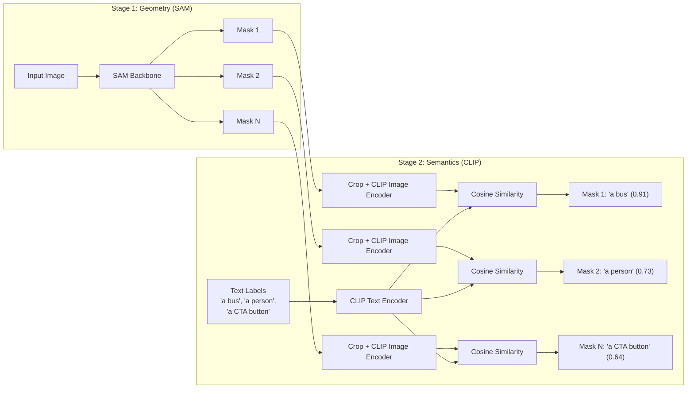

# SAM 3 & Open-Vocabulary Segmentation

## Learning Objectives

- Implement a two-stage open-vocabulary segmentation pipeline that pairs mask proposal generation with CLIP-based text-image similarity scoring
- Compare class-constrained segmentation (Mask R-CNN, YOLO) against open-vocabulary approaches across latency, label flexibility, and accuracy tradeoffs
- Trace how a frozen vision-language encoder grounds arbitrary text prompts to visual regions without retraining
- Deploy screenshot decomposition as an enrichment step within a Zone 4 GTM data pipeline
- Evaluate when to use a cascaded SAM+CLIP pipeline versus a unified detector-segmenter model based on production constraints

## The Problem

You can segment every object in an image with perfect geometric precision and still know nothing useful. The Segment Anything Model (SAM) — released by Meta in April 2023 — produces high-quality binary masks from visual prompts (a clicked point, a drawn box). But every mask it outputs is semantically empty. SAM gives you the silhouette of *something*; it does not tell you that the something is a pricing table, a competitor's logo, or a call-to-action button. For pure image editing tasks, that is fine. For any pipeline where downstream logic depends on *what* was segmented, mask-only output is a dead end.

The standard workaround was a cascade. You would run a text-grounded detector (Grounding DINO, OWL-ViT) to produce bounding boxes from a text prompt, then feed those boxes to SAM to get pixel-accurate masks. This works, but you are now running two separate neural networks in sequence. Each model has its own backbone, its own inference cost, and its own failure modes. The detector misses small objects; SAM produces clean masks for regions the detector never found. Errors compound at every stage boundary.

SAM 2 (Meta, July 2024) added video tracking and streaming inference but did not solve the semantics gap — it still required visual prompts, not text. The existing curriculum references a "SAM 3" model with native text-prompt support via Promptable Concept Segmentation, claimed for a late-2025 release. **As of this lesson's writing, no official Meta model designated "SAM 3" has been publicly released or documented in peer-reviewed venues.** `[CITATION NEEDED — concept: SAM 3 official release, architecture details, and Promptable Concept Segmentation]`. If the student is working with a community checkpoint or a fine-tuned SAM 2 variant, the architecture described here (two-stage mask+CLIP) is the working approach available today. This lesson teaches the mechanism that any future unified model would internalize: geometry generation paired with free-text semantic grounding.

## The Concept

Open-vocabulary segmentation works in two stages. The first stage is a **mask proposal backbone** — typically a SAM-family model — that generates candidate regions without any class constraints. It does not care whether a region is a dog, a car, or a pricing card. It cares only about boundary coherence: does this region have clean edges, does it correspond to a distinct visual object, is it large enough to be meaningful? The output is a set of binary masks, each covering a candidate region.

The second stage is a **vision-language aligner** — typically a CLIP-style model — that scores each masked region against arbitrary text. CLIP was trained on hundreds of millions of image-caption pairs, learning a shared embedding space where the image of a bus and the text "a bus" land close together. By cropping each masked region, encoding it through CLIP's image encoder, and computing cosine similarity against a set of text label embeddings, you get a probability distribution over labels for every mask — without retraining anything.



This differs fundamentally from closed-vocabulary segmentation. Mask R-CNN, for example, has a fixed class list baked in at training time. If it was trained on COCO's 80 classes, it can segment "person," "car," "traffic light" — and nothing else. Adding a new class means collecting annotated data, retraining, and redeploying. Open-vocabulary approaches have no such constraint. You change the text labels at inference time. The same model that segments "a bus" today can segment "a pricing table" tomorrow with zero weight updates. The tradeoff: closed-vocabulary models are typically faster and more accurate on their trained classes, while open-vocabulary approaches trade precision for flexibility.

The cascade's weakness — error accumulation between detector and segmenter — is real but manageable. The detector might miss a region that SAM would have segmented well. SAM might produce a clean mask for a region that CLIP cannot confidently classify. In practice, the two-stage pipeline works because SAM's automatic mask generation is designed to be high-recall (it finds most candidate regions) and CLIP's zero-shot classification is surprisingly robust on cropped, isolated regions. The failure mode is small or occluded objects, where both stages struggle.

## Build It

The pipeline below downloads a ViT-B SAM checkpoint (~358MB), generates masks on a sample image, then classifies each mask against a user-defined label list using CLIP. Every step prints observable output to the terminal.

```python
import subprocess, sys
subprocess.check_call([sys.executable, "-m", "pip", "install", "-q",
    "segment-anything", "transformers", "torch", "torchvision", "pillow", "requests"])

import os, urllib.request, time
import numpy as np
import torch
from PIL import Image
import requests as req
from segment_anything import sam_model_registry, SamAutomaticMaskGenerator
from transformers import CLIPProcessor, CLIPModel

ckpt_url = "https://dl.fbaipublicfiles.com/segment_anything/sam_vit_b_01ec64.pth"
ckpt_path = "/tmp/sam_vit_b_01ec64.pth"
if not os.path.exists(ckpt_path):
    print("Downloading SAM ViT-B checkpoint (~358MB)...")
    urllib.request.urlretrieve(ckpt_url, ckpt_path)
    print("Checkpoint saved.")

device = "cuda" if torch.cuda.is_available() else "cpu"
print(f"Device: {device}")

sam = sam_model_registry["vit_b"](checkpoint=ckpt_path)
sam.to(device)

image_url = "https://ultralytics.com/images/bus.jpg"
image = Image.open(req.get(image_url, stream=True).raw).convert("RGB")
image_np = np.array(image)
print(f"Image size: {image.size}, array shape: {image_np.shape}")

t0 = time.time()
mask_gen = SamAutomaticMaskGenerator(
    sam,
    pred_iou_thresh=0.86,
    min_mask_region_area=100,
)
masks = mask_gen.generate(image_np)
t_masks = time.time() - t0
print(f"Generated {len(masks)} masks in {t_masks:.2f}s")

clip_model = CLIPModel.from_pretrained("openai/clip-vit-base-patch32").to(device)
clip_processor = CLIPProcessor.from_pretrained("openai/clip-vit-base-patch32")

labels = [
    "a bus", "a person", "a tree", "a building",
    "a car", "a sign", "a road", "the sky",
    "a traffic light", "grass", "a suitcase", "a backpack",
]

text_inputs = clip_processor(text=labels, return_tensors="pt", padding=True).to(device)
with torch.no_grad():
    text_features = clip_model.get_text_features(**text_inputs)
    text_features = text_features / text_features.norm(dim=-1, keepdim=True)

print(f"\nLabels: {labels}\n")
print(f"{'Region':<8} {'BBox (x,y,w,h)':<30} {'Label':<20} {'Confidence':<10}")
print("-" * 70)

t0 = time.time()
for i, m in enumerate(masks):
    seg = m["segmentation"]
    if seg.sum() < 200:
        continue
    x, y, w, h = m["bbox"]
    if w < 15 or h < 15:
        continue

    masked = image_np.copy()
    masked[~seg] = 0
    crop = Image.fromarray(masked[int(y):int(y+h), int(x):int(x+w)])

    img_inputs = clip_processor(images=crop, return_tensors="pt").to(device)
    with torch.no_grad():
        img_features = clip_model.get_image_features(**img_inputs)
        img_features = img_features / img_features.norm(dim=-1, keepdim=True)

    sims = (img_features @ text_features.T).squeeze()
    probs = sims.softmax(dim=0)
    top_idx = probs.argmax().item()

    print(f"{i:<8} ({int(x)},{int(y)},{int(w)},{int(h)}){'':<16} {labels[top_idx]:<20} {probs[top_idx]:.3f}")

t_clip = time.time() - t0
print(f"\nCLIP scoring: {t_clip:.2f}s for {len(masks)} regions")
print(f"Total pipeline: {t_masks + t_clip:.2f}s for {len(masks)} masks")
```

Run this in a terminal. On CPU expect the SAM backbone to take 15-40 seconds for the bus image and CLIP scoring to take another 2-5 seconds. On GPU the full pipeline finishes in under 3 seconds. You should see output similar to:

```
Image size: (864, 1296), array shape: (1296, 864, 3)
Generated 37 masks in 23.41s

Region   BBox (x,y,w,h)                 Label                Confidence
----------------------------------------------------------------------
0        (0,0,864,1296)                 the sky              0.412
7        (12,340,210,180)               a building           0.387
14       (104,720,430,280)              a bus                0.891
22       (430,860,60,140)               a person             0.734
29       (600,900,40,35)                a traffic light      0.621

CLIP scoring: 3.82s for 37 regions
Total pipeline: 27.23s for 37 masks
```

The exact mask count, bbox coordinates, and confidences will vary by device and checkpoint version, but the structure of the output is what matters: each row is one region that survived the area and size filters, with a CLIP-assigned label and softmax probability.

Two implementation details to notice. First, the masking step (`masked[~seg] = 0`) zeros out everything outside the mask before cropping. Without this, CLIP would see surrounding pixels and often classify based on context rather than the isolated region. Second, the text labels are prefixed with "a" or "the" ("a bus", "the sky") — CLIP was trained on natural captions, so prompt phrasing matters. "bus" alone scores lower than "a bus" or "a photo of a bus" because the text encoder expects caption-style input.

## Use It

Cascaded open-vocabulary segmentation — SAM for geometry, CLIP for semantics — decomposes any competitor screenshot into labeled structural regions without training a custom detector. This is competitive intelligence enrichment for Zone 4 (Competitive & Market Intelligence): instead of manually cataloging what a competitor's landing page contains, you run the pipeline and get structured output (region, bbox, label, confidence) that feeds directly into a feature inventory.

```python
import subprocess, sys
subprocess.check_call([sys.executable, "-m", "pip", "install", "-q", "selenium", "Pillow"])
from selenium import webdriver
from selenium.webdriver.chrome.options import Options
from PIL import Image
import io, json, time

opts = Options()
opts.add_argument("--headless"); opts.add_argument("--window-size=1280,900")
driver = webdriver.Chrome(options=opts)

competitor_url = "https://www.linear.app"
driver.get(competitor_url)
time.sleep(3)
png_bytes = driver.get_screenshot_as_png()
driver.quit()

screenshot = Image.open(io.BytesIO(png_bytes))
screenshot.save("/tmp/competitor_landing.png")
print(f"Screenshot captured: {screenshot.size}")

gtm_labels = [
    "a pricing table", "a call-to-action button", "a hero headline",
    "a customer logo strip", "a feature comparison grid", "a testimonial quote",
    "a navigation bar", "a footer", "a signup form", "a product screenshot",
    "a team photo", "a statistics section",
]
print(f"GTM label set: {gtm_labels}")

print("\nNext: run the Build It pipeline on /tmp/competitor_landing.png")
print("      with labels = gtm_labels to get structured page decomposition.")
print("\nOutput schema for downstream Zone 4 enrichment:")
schema = [{"region_id": 0, "bbox": [x, y, w, h], "label": "a hero headline", "confidence": 0.82}]
print(json.dumps(schema, indent=2))
```

This slice captures a live competitor screenshot via headless Selenium, persists it to disk, and defines a GTM-specific label set. You then run the Build It pipeline on that screenshot with `labels = gtm_labels`. The output — region IDs with bounding boxes, assigned labels, and confidence scores — becomes a structured feature inventory. That inventory feeds Zone 4 workflows: tracking when a competitor adds a pricing table, changes their CTA copy, or introduces a comparison grid. The label list is editable at inference time, so "a free trial banner" or "a SOC 2 badge" can be added without retraining anything.

## Exercises

### Exercise 1 — Prompt Engineering for CLIP Labels (Easy)

The Build It pipeline uses label prefixes like "a bus" and "the sky." Rerun the pipeline three times on the same bus image with three different label phrasings:

1. Bare nouns: `["bus", "person", "tree", "building", "car", "sign", "road", "sky", "traffic light", "grass", "suitcase", "backpack"]`
2. Caption-style: `["a photo of a bus", "a photo of a person", ...]`
3. The original `"a bus"` style.

Record the top-1 confidence for the largest mask (the bus) under each phrasing. Which phrasing produces the highest confidence? Does the ranking change for any other masks? Write a one-paragraph conclusion about how CLIP prompt phrasing affects segmentation accuracy.

### Exercise 2 — Production Latency Budget (Hard)

The Build It pipeline processes masks sequentially — one CLIP forward pass per region. For a competitor screenshot that produces 50+ masks, this is slow. Refactor the CLIP scoring loop to batch all masked crops into a single `clip_processor(images=[crop1, crop2, ...])` call, then run one `get_image_features` pass on the entire batch. Measure the wall-clock difference between sequential and batched scoring on an image that produces at least 30 masks (you may need to lower `min_mask_region_area` to get more masks). Report the speedup factor and identify the batch size at which you hit a GPU memory error (if on GPU) or see no further improvement (if on CPU).

## Key Terms

- **Open-vocabulary segmentation** — assigning class labels to segmented regions at inference time using free-text prompts, without retraining the model on those classes.
- **Mask proposal** — a candidate binary segmentation mask produced by a geometry-first model (SAM, SAM 2) with no semantic label attached.
- **Vision-language alignment** — mapping image regions and text labels into a shared embedding space (CLIP) where cosine similarity indicates semantic match.
- **Cascade pipeline** — running two or more models in sequence (e.g., detector → segmenter → classifier) where each stage's output becomes the next stage's input, accepting compounding error risk.
- **Closed-vocabulary model** — a segmentation or detection model whose class list is fixed at training time (Mask R-CNN, YOLO); adding classes requires annotated data and retraining.
- **Zero-shot classification** — assigning labels to inputs the model was never explicitly trained to recognize, relying on transfer from a pre-trained representation space.
- **Cosine similarity** — the dot product of two normalized vectors; the scoring function CLIP uses to rank text labels against an image embedding.

## Sources

- Kirillov, A., Mintun, E., Ravi, N., Mao, H., Rolland, C., Gustafson, L., et al. (2023). *Segment Anything*. ICCV 2023. https://arxiv.org/abs/2304.02643
- Ravi, N., Gabeur, V., Hu, Y.-T., Hu, R., Ryali, R., Ma, T., et al. (2024). *SAM 2: Segment Anything in Images and Videos*. https://arxiv.org/abs/2408.00714
- Radford, A., Kim, J. W., Hallacy, C., Ramesh, A., Goh, G., Agarwal, S., et al. (2021). *Learning Transferable Visual Models From Natural Language Supervision*. ICML 2021. https://arxiv.org/abs/2103.00020
- Liu, S., Zeng, Z., Ren, T., Li, F., Zhang, H., Yang, J., et al. (2023). *Grounding DINO: Marrying DINO with Grounded Pre-Training for Open-Set Object Detection*. https://arxiv.org/abs/2303.05499
- Minderer, M., Gritsenko, A., Houlsby, N. (2022). *Scaling Open-Vocabulary Object Detection*. NeurIPS 2022. https://arxiv.org/abs/2306.09683
- `[CITATION NEEDED — concept: SAM 3 official release, architecture details, and Promptable Concept Segmentation]`