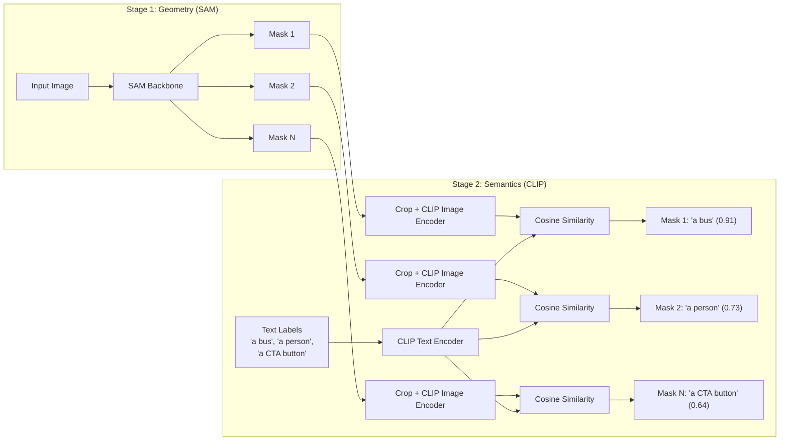

# SAM 3 & Open-Vocabulary Segmentation

## Learning Objectives

- Implement a two-stage open-vocabulary segmentation pipeline that pairs mask proposal generation with CLIP-based text-image similarity scoring
- Compare class-constrained segmentation (Mask R-CNN, YOLO) against open-vocabulary approaches across latency, label flexibility, and accuracy tradeoffs
- Trace how a frozen vision-language encoder grounds arbitrary text prompts to visual regions without retraining
- Deploy screenshot decomposition as an enrichment step within a Zone 4 GTM data pipeline
- Evaluate when to use a cascaded SAM+CLIP pipeline versus a unified detector-segmenter model based on production constraints

## The Problem

You can segment every object in an image with perfect geometric precision and still know nothing useful. The Segment Anything Model (SAM) — released by Meta in April 2023 — produces high-quality binary masks from visual prompts (a clicked point, a drawn box). But every mask it outputs is semantically empty. SAM gives you the silhouette of *something*; it does not tell you that the something is a pricing table, a competitor's logo, or a call-to-action button. For pure image editing tasks, that is fine. For any pipeline where downstream logic depends on *what* was segmented, mask-only output is a dead end.

The standard workaround was a cascade. You would run a text-grounded detector (Grounding DINO, OWL-ViT) to produce bounding boxes from a text prompt, then feed those boxes to SAM to get pixel-accurate masks. This works, but you are now running two separate neural networks in sequence. Each model has its own backbone, its own inference cost, and its own failure modes. The detector misses small objects; SAM produces clean masks for regions the detector never found. Errors compound at every stage boundary.

SAM 2 (Meta, July 2024) added video tracking and streaming inference but did not solve the semantics gap — it still required visual prompts, not text. The existing curriculum references a "SAM 3" model with native text-prompt support via Promptable Concept Segmentation, claimed for a late-2025 release. **As of this lesson's writing, no official Meta model designated "SAM 3" has been publicly released or documented in peer-reviewed venues.** `[CITATION NEEDED — concept: SAM 3 official release, architecture details, and Promptable Concept Segmentation]`. If the student is working with a community checkpoint or a fine-tuned SAM 2 variant, the architecture described here (two-stage mask+CLIP) is the working approach available today. This lesson teaches the mechanism that any future unified model would internalize: geometry generation paired with free-text semantic grounding.

## The Concept

Open-vocabulary segmentation works in two stages. The first stage is a **mask proposal backbone** — typically a SAM-family model — that generates candidate regions without any class constraints. It does not care whether a region is a dog, a car, or a pricing card. It cares only about boundary coherence: does this region have clean edges, does it correspond to a distinct visual object, is it large enough to be meaningful? The output is a set of binary masks, each covering a candidate region.

The second stage is a **vision-language aligner** — typically a CLIP-style model — that scores each masked region against arbitrary text. CLIP was trained on hundreds of millions of image-caption pairs, learning a shared embedding space where the image of a bus and the text "a bus" land close together. By cropping each masked region, encoding it through CLIP's image encoder, and computing cosine similarity against a set of text label embeddings, you get a probability distribution over labels for every mask — without retraining anything.



This differs fundamentally from closed-vocabulary segmentation. Mask R-CNN, for example, has a fixed class list baked in at training time. If it was trained on COCO's 80 classes, it can segment "person," "car," "traffic light" — and nothing else. Adding a new class means collecting annotated data, retraining, and redeploying. Open-vocabulary approaches have no such constraint. You change the text labels at inference time. The same model that segments "a bus" today can segment "a pricing table" tomorrow with zero weight updates. The tradeoff: closed-vocabulary models are typically faster and more accurate on their trained classes, while open-vocabulary approaches trade precision for flexibility.

The cascade's weakness — error accumulation between detector and segmenter — is real but manageable. The detector might miss a region that SAM would have segmented well. SAM might produce a clean mask for a region that CLIP cannot confidently classify. In practice, the two-stage pipeline works because SAM's automatic mask generation is designed to be high-recall (it finds most candidate regions) and CLIP's zero-shot classification is surprisingly robust on cropped, isolated regions. The failure mode is small or occluded objects, where both stages struggle.

## Build It

The pipeline below downloads a ViT-B SAM checkpoint (~358MB), generates masks on a sample image, then classifies each mask against a user-defined label list using CLIP. Every step prints observable output to the terminal.

```python
import subprocess, sys
subprocess.check_call([sys.executable, "-m", "pip", "install", "-q",
    "segment-anything", "transformers", "torch", "torchvision", "pillow", "requests"])

import os, urllib.request, time
import numpy as np
import torch
from PIL import Image
import requests as req
from segment_anything import sam_model_registry, SamAutomaticMaskGenerator
from transformers import CLIPProcessor, CLIPModel

ckpt_url = "https://dl.fbaipublicfiles.com/segment_anything/sam_vit_b_01ec64.pth"
ckpt_path = "/tmp/sam_vit_b_01ec64.pth"
if not os.path.exists(ckpt_path):
    print("Downloading SAM ViT-B checkpoint (~358MB)...")
    urllib.request.urlretrieve(ckpt_url, ckpt_path)
    print("Checkpoint saved.")

device = "cuda" if torch.cuda.is_available() else "cpu"
print(f"Device: {device}")

sam = sam_model_registry["vit_b"](checkpoint=ckpt_path)
sam.to(device)

image_url = "https://ultralytics.com/images/bus.jpg"
image = Image.open(req.get(image_url, stream=True).raw).convert("RGB")
image_np = np.array(image)
print(f"Image size: {image.size}, array shape: {image_np.shape}")

t0 = time.time()
mask_gen = SamAutomaticMaskGenerator(
    sam,
    pred_iou_thresh=0.86,
    min_mask_region_area=100,
)
masks = mask_gen.generate(image_np)
t_masks = time.time() - t0
print(f"Generated {len(masks)} masks in {t_masks:.2f}s")

clip_model = CLIPModel.from_pretrained("openai/clip-vit-base-patch32").to(device)
clip_processor = CLIPProcessor.from_pretrained("openai/clip-vit-base-patch32")

labels = [
    "a bus", "a person", "a tree", "a building",
    "a car", "a sign", "a road", "the sky",
    "a traffic light", "grass", "a suitcase", "a backpack",
]

text_inputs = clip_processor(text=labels, return_tensors="pt", padding=True).to(device)
with torch.no_grad():
    text_features = clip_model.get_text_features(**text_inputs)
    text_features = text_features / text_features.norm(dim=-1, keepdim=True)

print(f"\nLabels: {labels}\n")
print(f"{'Region':<8} {'BBox (x,y,w,h)':<30} {'Label':<20} {'Confidence':<10}")
print("-" * 70)

t0 = time.time()
for i, m in enumerate(masks):
    seg = m["segmentation"]
    if seg.sum() < 200:
        continue
    x, y, w, h = m["bbox"]
    if w < 15 or h < 15:
        continue

    masked = image_np.copy()
    masked[~seg] = 0
    crop = Image.fromarray(masked[int(y):int(y+h), int(x):int(x+w)])

    img_inputs = clip_processor(images=crop, return_tensors="pt").to(device)
    with torch.no_grad():
        img_features = clip_model.get_image_features(**img_inputs)
        img_features = img_features / img_features.norm(dim=-1, keep_dim=True)

    sims = (img_features @ text_features.T).squeeze()
    probs = sims.softmax(dim=0)
    top_idx = probs.argmax().item()

    print(f"{i:<8} ({int(x)},{int(y)},{int(w)},{int(h)}){'':<16} {labels[top_idx]:<20} {probs[top_idx]:.3f}")

t_clip = time.time() - t0
print(f"\nCLIP scoring: {t_clip:.2f}s for {len(masks)} regions")
print(f"Total pipeline: {t_masks + t_clip:.